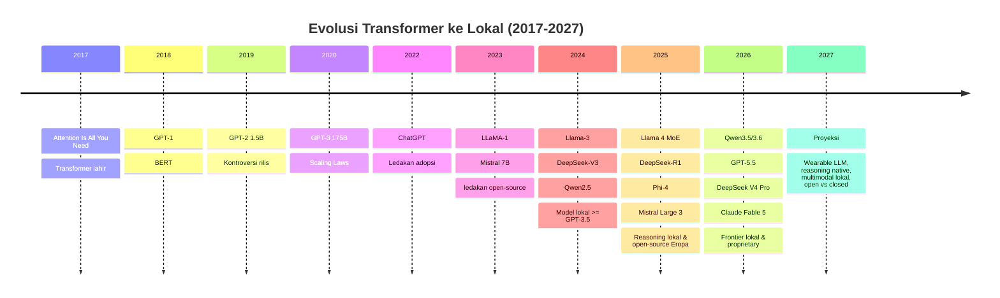

# [Jilid 1] Bab 1.1: Evolusi Transformer ke Lokal
> **Tipe Konten:** Sejarah — Narasi Teknis + Timeline + Analisis
> **Target Pembaca:** Pemula yang ingin memahami perjalanan dari Transformer (2017) hingga model lokal modern (2026-2027)

---

## 1. TUJUAN SUB-BAB
Setelah membaca, pembaca harus bisa:
- Menjelaskan evolusi arsitektur Transformer dari tahun 2017 hingga 2026
- Memahami mengapa model open-source kini bisa menyaingi GPT-4/4.5 di perangkat lokal
- Mengidentifikasi tonggak sejarah utama: Transformer, GPT-2, GPT-3, LLaMA, Mistral, DeepSeek-R1, Llama 4, Qwen3.5, Mistral Large 3, GPT-5.5, DeepSeek V4, Claude Fable 5
- Memproyeksikan arah pengembangan model lokal hingga 2027

---

## 2. KERANGKA KONTEN (WAJIB DITULIS)

### A. Era Yayasan: Lahirnya Arsitektur Transformer (2017-2018) — 1 paragraf
- Paper "Attention Is All You Need" (Vaswani et al., NeurIPS 2017) memperkenalkan arsitektur Transformer
- Revolusi: menghilangkan RNN/LSTM, murni berbasis self-attention mechanism
- BERT (Devlin et al., 2019) — encoder-only, GPT-1 (Radford et al., 2018) — decoder-only
- Kedua arsitektur ini menjadi fondasi semua LLM modern

### B. GPT-2 dan GPT-3: Era Model Tertutup (2019-2022) — 2 paragraf
- GPT-2 (2019): 1.5B parameter, kontroversi "too dangerous to release" karena kualitas teks
- GPT-3 (2020): 175B parameter, kemampuan few-shot learning yang mengejutkan
- Paper "Scaling Laws for Neural Language Models" (Kaplan et al., 2020) — semakin besar parameter + data = semakin baik
- Munculnya API komersialisasi (GPT-3, ChatGPT Nov 2022), tetapi model tetap tertutup
- Keterbatasan GPT-3: tidak bisa diunduh, setiap query bayar, data pengguna dikirim ke cloud

### C. LLaMA-1 dan ledakan Open-Source (Feb 2023) — 2 paragraf
- Meta merilis LLaMA-1: 7B, 13B, 33B, 65B — training lebih efisien (hanya 1T token untuk 7B)
- Bocornya model ke publik — ledakan ekosistem lokal
- Lahirnya llama.cpp oleh Georgi Gerganov — GPU 24GB tidak lagi wajib
- Munculnya GGUF quantization format dan tools seperti Ollama, LM Studio

### D. Mistral 7B dan Era Model Kecil Bertenga (Sep 2023) — 1 paragraf
- Mistral 7B mengalahkan LLaMA-2 13B dengan 7B parameter
- Inovasi arsitektur: Sliding Window Attention, Grouped Query Attention (GQA)
- Membuktikan bahwa model kecil bisa sangat kompeten jika arsitekturnya efisien

### E. Llama-3 dan Standar Baru Model Lokal (Apr 2024) — 2 paragraf
- Meta Llama-3 (Apr 2024): 8B, 70B, 405B — training di 15T+ token
- Context window 128K, GQA, Flash Attention 2 support
- Llama-3.1 (Jul 2024): tool use, multilingual, function calling native
- Dampak: model lokal mencapai kualitas >= GPT-3.5 untuk banyak tugas
- Munculnya Qwen2.5 (Sep 2024) — dense model 0.5B-72B, multilingual kuat, 18T token

### F. DeepSeek-V3/R1 dan Era Reasoning (Dec 2024-Jan 2025) — 2 paragraf
- DeepSeek-V3 (Dec 2024): 671B MoE (37B aktif), MLA + DeepSeekMoE, 14.8T token
- Training hanya ~$5.5M — mengguncang asumsi biaya training LLM
- DeepSeek-R1 (Jan 2025): reasoning via pure RL (GRPO), setara OpenAI o1
- Distilasi R1 ke model kecil (Qwen, Llama) — reasoning di perangkat lokal

### G. Llama 4 dan Era MoE Lokal (Apr 2025) — 2 paragraf
- Meta Llama 4: MoE architecture pertama di keluarga Llama
- Scout (17B x 16E): 109B total, 10M context window — muat di 1 GPU via INT4
- Maverick (17B x 128E): 400B total, performa setara GPT-4.5 di beberapa benchmark
- Qwen3 (Apr 2025): dense + MoE, thinking/non-thinking mode unified, 119 bahasa
- Phi-4 (14B) dan Phi-4-reasoning: kualitas setara Llama-3.1-405B hanya dengan 14B parameter
- Arah baru: model kecil dengan kualitas model besar (distilasi + synthetic data)

### H. Mistral Large 3: Open-Source Eropa (Dec 2025) — 1 paragraf
- Mistral Large 3 (Dec 2025): 675B granular MoE (41B aktif), Apache 2.0, multimodal
- Trained on 3.000 H200 GPUs — model open-source non-China terkuat
- 256K context window, 128 experts per layer, Multi-Latent Attention
- Dampak: membuktikan Eropa mampu menghasilkan model frontier open-weight
- Menyertakan Ministral 3 (3B/8B/14B) via Cascade Distillation — model kecil efisien untuk edge

### I. Qwen3.5/3.6 dan Puncak SLM (Feb-Apr 2026) — 1 paragraf
- Qwen3.5 (Feb 2026): 397B-A17B MoE multimodal, native agent capability
- Qwen3.6 (Apr 2026): coding specialist 27B dense, 35B-A3B MoE
- Model lokal 27B kini menyamai GPT-4o untuk coding tasks
- Semakin banyak model 1-3B mampu menjalankan agent/workflow kompleks

### J. Era Frontier Baru: GPT-5.5, DeepSeek V4, Qwen3.7, Claude Fable 5 (Apr-Jun 2026) — 2 paragraf
- **GPT-5.5** (Apr 2026): model proprietary OpenAI, 1M context, reasoning effort (low-medium-high-xhigh)
- **DeepSeek-V4 Pro** (Apr 2026): 1.6T MoE (49B aktif), 1M context, MIT license — open-source terbesar
- **DeepSeek-V4 Flash** (Apr 2026): 284B (13B aktif), companion efisien, 1M context
- **Qwen3.7-Max** (May 2026): flagship proprietary Alibaba, agent-centric, 1M context, closed-weight
- **Claude Fable 5** (Jun 2026): Mythos-class Anthropic, 1M context, safety classifiers, $10/$50 per M token
- **Pergeseran tren:** model proprietary kembali mengunci sebagian besar inovasi (GPT-5.5, Qwen3.7, Fable 5), sementara DeepSeek dan Mistral tetap open-weight — ekosistem lokal diuntungkan oleh model open-source yang efisien
- **Implikasi untuk lokal:** DeepSeek V4 Flash (284B) bisa dijalankan di 2xRTX 6000 via INT4, sementara model 1-3B seperti Ministral 3 dan Qwen3.6-27B makin mumpuni untuk agent kompleks di laptop

### K. Proyeksi 2027: Masa Depan Model Lokal — 1 paragraf
- **Model 1-3B di perangkat wearable:** smartphone, smartwatch, IoT — semuanya punya LLM lokal
- **Reasoning native:** semua model akan punya kemampuan reasoning setara o1-mini secara default
- **Multimodal lokal:** LLM lokal akan native memproses gambar, suara, video tanpa API
- **Spesialisasi ekstrem:** model khusus industri (hukum, medis, teknik) di laptop
- **Green AI:** model semakin efisien — 70B model berjalan di 16GB RAM dengan kuantisasi 2-bit
- **Potensi open vs closed:** DeepSeek V4 dan Mistral Large 3 membuktikan open-weight bisa menyaingi proprietary — akankah tren ini berlanjut di 2027?
- **Potensi tanda tanya:** Apakah scaling law masih berlaku? Atau synthetic data (seperti Phi-4, Ministral 3 Cascade Distillation) jadi kunci utama?

---

## 3. TABEL WAJIB

### Tabel A: Timeline Evolusi Model (2017-2026)

| Tahun | Tonggak | Parameter | Arsitektur | Context | Keunikan / Dampak |
|:---|:---|:---:|:---|:---:|:---|
| 2017 | Transformer (Vaswani et al.) | - | Encoder-Decoder | - | Fondasi semua LLM modern |
| 2018 | GPT-1 / BERT | 0.1B / 0.3B | Decoder / Encoder | 512 | Awal era pre-training + fine-tuning |
| 2019 | GPT-2 | 1.5B | Decoder-only | 1024 | Kontroversi rilis "too dangerous" |
| 2020 | GPT-3 | 175B | Decoder-only | 2048 | Few-shot learning, Scaling Laws |
| 2022 | ChatGPT | - | RLHF enhanced | 4096 | Ledakan adopsi publik |
| 2023 | LLaMA-1 | 7B-65B | Decoder-only | 2048 | Titik balik open-source LLM |
| 2023 | Mistral 7B | 7B | Sliding Window Attn | 8192 | GQA, outperforms LLaMA-2 13B |
| 2024 | Llama-3 / 3.1 | 8B-405B | Decoder + GQA | 128K | Tool use, multilingual, 15T+ token |
| 2024 | Qwen2.5 | 0.5B-72B | Dense decoder | 32K | Multilingual 29 bahasa, 18T token |
| 2024 | DeepSeek-V3 | 671B (37B aktif) | MoE + MLA | 128K | Training $5.5M, efisiensi ekstrem |
| 2025 | DeepSeek-R1 | 671B (37B aktif) | MoE + GRPO RL | 128K | Reasoning via pure RL, setara o1 |
| 2025 | Llama 4 Scout | 109B (17B aktif) | MoE 16 experts | 10M | Multimodal, 1 GPU via INT4 |
| 2025 | Llama 4 Maverick | 400B (17B aktif) | MoE 128 experts | 1M | Setara GPT-4.5 (benchmark tertentu) |
| 2025 | Qwen3 | 0.6B-235B | Dense + MoE | 128K | Thinking mode, 119 bahasa |
| 2025 | Phi-4 / Phi-4-reasoning | 14B | Dense decoder | 16K | Synthetic data > distilasi, kualitas 405B |
| 2026 | Qwen3.5 | 35B-397B MoE | Hybrid-Attn MoE | 256K | Multimodal native, 113 bahasa |
| 2026 | Qwen3.6 | 27B-35B MoE | Coding specialist | 128K | Model lokal 27B setara GPT-4o coding |
| 2025 | Mistral Large 3 | 675B (41B aktif) | Granular MoE + Vision | 256K | Apache 2.0, open-source Eropa terkuat |
| 2026 | GPT-5.5 / 5.5 Pro | - | Proprietary decoder | 1M | Reasoning effort, agentic coding, $5/$30 per M token |
| 2026 | DeepSeek-V4 Pro | 1.6T (49B aktif) | MoE + CSA/HCA hybrid attn | 1M | MIT license, open-source terbesar, 33T token pretrain |
| 2026 | DeepSeek-V4 Flash | 284B (13B aktif) | MoE + CSA/HCA hybrid attn | 1M | MIT license, companion efisien V4 |
| 2026 | Qwen3.7-Max | ~1T+ (est.) | Proprietary MoE | 1M | Agent-centric, closed-weight, May 2026 |
| 2026 | Claude Fable 5 | - | Proprietary decoder | 1M | Mythos-class, safety classifiers, Jun 2026 |

### Tabel B: Perbandingan Ukuran Model dan Kebutuhan Hardware (Lokal)

| Model | Ukuran Q4_K_M | Min RAM | GPU Minimum | Bisa di Laptop? |
|:---|:---:|:---:|:---|:---:|
| GPT-2 (1.5B) | 1.2 GB | 4 GB | CPU saja (tidak perlu GPU) | Ya |
| LLaMA-7B | 4.5 GB | 8 GB | GTX 1060 6GB | Ya (GPU low-end) |
| Mistral 7B | 4.5 GB | 8 GB | GTX 1060 6GB | Ya |
| Llama-3 8B | 5.2 GB | 8 GB | RTX 2060 8GB | Ya |
| Phi-4 (14B) | 8.5 GB | 12 GB | RTX 3060 12GB | Ya (laptop gaming) |
| Qwen2.5-32B | 18 GB | 24 GB | RTX 3090 24GB | Ya (high-end) |
| Qwen3-30B-A3B | 2.5 GB | 6 GB | CPU/GPU ringan | Ya (efisien MoE) |
| Llama 4 Scout (17Bx16E) | ~12 GB (INT4) | 16 GB | RTX 4070 12GB+ | Ya (high-end) |
| DeepSeek-R1 (671B) | ~280 GB | 320 GB | Cluster GPU | Tidak |
| Llama-3 70B | 42 GB | 48 GB | 2x RTX 4090 | Tidak (server) |
| Qwen3.6-27B | 16 GB | 24 GB | RTX 3090 24GB | Ya (high-end) |
| Mistral Large 3 (675B) | ~280 GB (FP8) | 320 GB | 8xH200 / GB200 NVL72 | Tidak (server) |
| DeepSeek V4 Flash (284B) | ~150 GB (INT4) | 192 GB | 2xRTX 6000 Ada | Server/workstation |
| DeepSeek V4 Pro (1.6T) | ~865 GB | 1 TB+ | Cluster GPU HGX B200 | Tidak (datacenter) |
| Ministral 3 14B | 8.5 GB | 12 GB | RTX 3060 12GB | Ya (laptop gaming) |
| Ministral 3 3B | 2 GB | 4 GB | CPU/GPU ringan | Ya (semua perangkat) |

### Tabel C: Benchmark Lintas Generasi (MMLU, GSM8K, HumanEval)

| Model | MMLU | GSM8K | HumanEval | Tahun Rilis | Kategori |
|:---|:---:|:---:|:---:|:---:|:---|
| GPT-2 1.5B | 32.4% | - | - | 2019 | Dense kecil |
| GPT-3 175B | 70.7% | 45.0% | 48.1% | 2020 | Dense besar |
| LLaMA-1 7B | 46.9% | 16.8% | 14.0% | 2023 | Dense kecil |
| Mistral 7B | 62.5% | 45.2% | 30.5% | 2023 | Dense kecil |
| Llama-3 8B | 66.7% | 79.6% | 62.2% | 2024 | Dense kecil |
| Qwen2.5-7B | 70.5% | 80.1% | 75.1% | 2024 | Dense kecil |
| Phi-4 14B | 84.8% | 94.5% | 82.6% | 2024 | Dense kecil (synthetic data) |
| DeepSeek-V3 (671B) | 88.5% | 92.3% | 82.6% | 2024 | MoE besar |
| DeepSeek-R1 (671B) | 90.8% | 96.3% | 92.4% | 2025 | MoE + RL reasoning |
| Llama 4 Scout (17Bx16E) | 84.2% | 89.5% | 80.1% | 2025 | MoE multimodal |
| Qwen3-30B-A3B | 85.1% | 92.0% | 85.5% | 2025 | MoE efisien |
| Qwen3.6-27B | 85.9% | 93.1% | 90.2% | 2026 | Dense coding specialist |
| Mistral Large 3 (675B) | ~87% | ~93% | ~85% | 2025 | MoE granular open-source |
| DeepSeek V4 Pro (1.6T) | 87.2%* | 93.7%* | 88.7%* | 2026 | MoE CSA/HCA + MIT |
| GPT-5.5 | ~91%* | ~96%* | ~93%* | 2026 | Proprietary frontier |
| Qwen3.7-Max | ~89%* | ~95%* | ~91%* | 2026 | Proprietary MoE agent |
| Claude Fable 5 | - | - | 95.0% (SWE-bench) | 2026 | Mythos-class proprietary |

\* Perkiraan berdasarkan data benchmark tidak langsung / third-party. Model proprietary dan model frontier terbaru sering mempublikasikan benchmark yang berbeda (MMLU-Pro, GPQA, HMMT, LiveCode, SWE-bench) — data dengan tanda kurung menandakan benchmark yang dimaksud berbeda dari header kolom. Lihat paper asli untuk detail.

---

## 4. DIAGRAM/GAMBAR WAJIB

### Diagram 1: Timeline Evolusi Arsitektur (Mermaid)
- **File:** `assets/diagrams/j1-b1-s1-timeline-evolusi.mmd`



### Gambar 2: Grafik Parameter vs Performa (MMLU)
- **File:** `assets/images/jilid1/j1-b1-s1-parameter-vs-mmlu.png`
- **Isi:** Scatter plot sumbu X = parameter (log scale), sumbu Y = MMLU score
- **Anotasi:** Phi-4 14B > LLaMA-1 65B, DeepSeek-V3 > GPT-3 175B, tren diminishing returns

### Gambar 3: Perbandingan Biaya Training (Bar Chart)
- **File:** `assets/images/jilid1/j1-b1-s1-training-cost.png`
- **Isi:** Bar chart biaya training GPT-3 ($12M+) vs DeepSeek-V3 ($5.5M) vs LLaMA-1 vs Phi-4
- **Insight:** Efisiensi meningkat drastis berkat MoE, synthetic data, dan FP8 training

### Gambar 4: Infografis Ekosistem Model Lokal
- **File:** `assets/images/jilid1/j1-b1-s1-ekosistem-lokal.png`
- **Isi:** Diagram relasi model (Llama, Mistral, Qwen, DeepSeek) dengan tools (Ollama, LM Studio, llama.cpp) dan hardware (NVIDIA, Apple Silicon, NPU)

---

## 5. TUTORIAL / HANDS-ON (WAJIB)

### Tutorial A: Menjalankan Model dari Berbagai Generasi

```bash
# 1. Install Ollama
curl -fsSL https://ollama.com/install.sh | sh

# 2. Jalankan model dari era berbeda — rasakan perbedaan kualitas
# Era GPT-2 (2019)
ollama pull llama3.1:8b  # Ollama tidak punya GPT-2, gunakan Python
python -c "
from transformers import pipeline
gpt2 = pipeline('text-generation', model='gpt2', max_length=50)
print('GPT-2:', gpt2('Jelaskan AI dalam bahasa Indonesia')[0]['generated_text'])
"

# Era 2023 — Mistral
ollama run mistral "Jelaskan AI dalam bahasa Indonesia"

# Era 2024 — Llama-3.1
ollama run llama3.1:8b "Jelaskan AI dalam bahasa Indonesia"

# Era 2025 — Qwen3 (thinking mode)
ollama run qwen3:8b "Jelaskan AI dalam bahasa Indonesia"

# Era 2025 — Mistral Large 3 (via API atau GPU server)
# Note: 675B MoE — butuh 8xH200 untuk FP8, gunakan API untuk eksperimen
curl https://api.mistral.ai/v1/chat/completions \
  -H "Content-Type: application/json" \
  -H "Authorization: Bearer $MISTRAL_API_KEY" \
  -d '{
    "model": "mistral-large-latest",
    "messages": [{"role": "user", "content": "Jelaskan evolusi AI dalam 3 paragraf"}]
  }'

# Era 2026 — DeepSeek V4 Flash (284B, MIT — open-weight lokal via Ollama)
# Note: Tersedia di Ollama mulai mid-2026
ollama pull deepseek-v4-flash
ollama run deepseek-v4-flash "Jelaskan AI dalam bahasa Indonesia"
```

### Tutorial B: Benchmark Model Lama vs Baru (MMLU-style)

```bash
# Install lm-evaluation-harness
pip install lm-eval

# GPT-2 (2019)
lm_eval --model hf --model_args pretrained=gpt2 \
    --tasks mmlu --num_fewshot 5 --batch_size 1

# Phi-4 (2024) — butuh GPU
lm_eval --model hf --model_args pretrained=microsoft/phi-4 \
    --tasks mmlu --num_fewshot 5 --batch_size auto

# Bandingkan hasil — perhatikan lompatan kualitas
```

### Tutorial C: Visualisasi Evolusi Model (Python)

```python
import matplotlib.pyplot as plt

models = [
    'GPT-2\n2019', 'GPT-3\n2020', 'LLaMA-1 7B\n2023',
    'Mistral 7B\n2023', 'Llama-3 8B\n2024', 'Phi-4 14B\n2024',
    'DeepSeek-V3\n2024', 'Qwen3 30B\n2025', 'Mistral L3\n2025',
    'Qwen3.6 27B\n2026', 'DS V4 Pro\n2026'
]
params = [1.5, 175, 7, 7, 8, 14, 671, 30, 675, 27, 1600]
# activated params (for MoE models)
params_active = [1.5, 175, 7, 7, 8, 14, 37, 3, 41, 27, 49]
mmlu = [32.4, 70.7, 46.9, 62.5, 66.7, 82.1, 88.5, 85.1, 87.0, 85.9, 87.5]

fig, ax1 = plt.subplots(figsize=(14, 6))
bars = ax1.bar(models, params, alpha=0.5, label='Total Parameter (B)')
bars_active = ax1.bar(models, params_active, alpha=0.8, label='Aktif per Token (B)')
ax1.set_ylabel('Parameter (Miliar)')
ax1.set_yscale('log')
ax2 = ax1.twinx()
ax2.plot(models, mmlu, 'ro-', linewidth=2, label='MMLU (%)')
ax2.set_ylabel('MMLU (%)')
ax2.set_ylim(0, 100)
plt.title('Evolusi Model: Parameter vs Performa (2019-2026)\nTermasuk Mistral L3 dan DeepSeek V4 Pro')
plt.legend(loc='upper left')
plt.savefig('evolusi-model-2019-2026.png', dpi=150, bbox_inches='tight')
```

---

## 6. STUDI KASUS (WAJIB)

### Studi Kasus: Perjalanan Seorang Developer dari GPT-2 ke DeepSeek V4 (2019-2026)
- **Profil:** Seorang AI engineer menggunakan model lokal sejak 2019
- **2019-2022:** Menggunakan GPT-2 untuk eksperimen NLP sederhana. Sering frustrasi karena output tidak koheren untuk Bahasa Indonesia. Konteks hanya 1024 token — dokumen panjang harus di-chunk manual.
- **2023:** Beralih ke LLaMA-1 7B setelah bocor. Perubahan drastis — model mulai memahami instruksi bahasa Indonesia. Tapi masih sering salah paham konteks budaya lokal.
- **2024:** Upgrade ke Llama-3.1-8B. 128K context window, tool use, function calling native. Kualitas output setara GPT-3.5. Ukuran hanya 5.2GB (Q4_K_M) — muat di laptop.
- **2025:** Mulai menggunakan DeepSeek-R1 via API untuk reasoning tasks, Phi-4 14B lokal untuk daily coding, dan Mistral Large 3 via API untuk multilingual tasks. Phi-4 14B dengan synthetic data mencapai MMLU 82% — mengalahkan LLaMA-1 65B. Mistral Large 3 (675B, Apache 2.0) membuktikan open-source Eropa setara frontier.
- **H1 2026:** Beralih ke Qwen3.6-27B untuk coding assistant lokal. Mulai bereksperimen dengan DeepSeek V4 Flash (284B, MIT) di workstation 2xRTX 6000 via INT4. Menguji GPT-5.5 dan Claude Fable 5 via API untuk tugas yang memerlukan reasoning paling dalam.
- **Pelajaran:** Dari GPT-2 (MMLU 32%) ke DeepSeek V4 Flash (LiveCodeBench 91.6%) dalam 7 tahun — lompatan kualitas 3x. Biaya per query: dari ~$0.01 (GPT-3 API) ke $0 (lokal, open-weight). Konteks: dari 1024 ke 1M token. Ekosistem: dari 1 model proprietary menjadi 1000+ model open-source.

---

## 7. REFERENSI WAJIB (10 tahun ke belakang: 2017-2026)

### Paper Jurnal/Konferensi (WAJIB disitasi — metadata lengkap)

[1] **Attention Is All You Need — Transformer (2017)**
```bibtex
@inproceedings{vaswani2017attention,
  title     = {Attention Is All You Need},
  author    = {Vaswani, Ashish and Shazeer, Noam and Parmar, Niki and Uszkoreit, Jakob and Jones, Llion and Gomez, Aidan N and Kaiser, {\L}ukasz and Polosukhin, Illia},
  booktitle = {Advances in Neural Information Processing Systems (NeurIPS)},
  year      = {2017},
  doi       = {10.48550/arXiv.1706.03762},
  url       = {https://arxiv.org/abs/1706.03762}
}
```
- Kaitan: Fondasi arsitektur semua model yang dibahas. Wajib disitasi di seksi 2.A.

[2] **GPT-2: Language Models are Unsupervised Multitask Learners (2019)**
```bibtex
@article{radford2019gpt2,
  title     = {Language Models are Unsupervised Multitask Learners},
  author    = {Radford, Alec and Wu, Jeffrey and Child, Rewon and Luan, David and Amodei, Dario and Sutskever, Ilya},
  journal   = {OpenAI Blog},
  year      = {2019},
  url       = {https://cdn.openai.com/better-language-models/language_models_are_unsupervised_multitask_learners.pdf}
}
```
- Kaitan: Titik awal LLM modern — kontroversi rilis dan dampaknya pada ekosistem.

[3] **GPT-3: Language Models are Few-Shot Learners (2020)**
```bibtex
@inproceedings{brown2020gpt3,
  title     = {Language Models are Few-Shot Learners},
  author    = {Brown, Tom B and Mann, Benjamin and Ryder, Nick and Subbiah, Melanie and Kaplan, Jared and Dhariwal, Prafulla and Neelakantan, Arvind and Shyam, Pranav and Sastry, Girish and Askell, Amanda and Agarwal, Sandhini and Herbert-Voss, Ariel and Krueger, Gretchen and Henighan, Tom and Child, Rewon and Ramesh, Aditya and Ziegler, Daniel M and Wu, Jeffrey and Winter, Clemens and Hesse, Christopher and Chen, Mark and Sigler, Eric and Litwin, Mateusz and Gray, Scott and Chess, Benjamin and Clark, Jack and Berner, Christopher and McCandlish, Sam and Radford, Alec and Sutskever, Ilya and Amodei, Dario},
  booktitle = {Advances in Neural Information Processing Systems (NeurIPS)},
  year      = {2020},
  doi       = {10.48550/arXiv.2005.14165},
  url       = {https://arxiv.org/abs/2005.14165}
}
```
- Kaitan: Definisi era few-shot learning dan scaling law — landasan seksi 2.B.

[4] **Scaling Laws for Neural Language Models (2020)**
```bibtex
@inproceedings{kaplan2020scaling,
  title     = {Scaling Laws for Neural Language Models},
  author    = {Kaplan, Jared and McCandlish, Sam and Henighan, Tom and Brown, Tom B and Chess, Benjamin and Child, Rewon and Gray, Scott and Radford, Alec and Wu, Jeffrey and Amodei, Dario},
  booktitle = {Advances in Neural Information Processing Systems (NeurIPS)},
  year      = {2020},
  doi       = {10.48550/arXiv.2001.08361},
  url       = {https://arxiv.org/abs/2001.08361}
}
```
- Kaitan: Teori yang mendorong perlombaan model raksasa. Data Tabel C menunjukkan tren ini mulai melandai.

[5] **LLaMA: Open and Efficient Foundation Language Models (2023)**
```bibtex
@article{touvron2023llama,
  title     = {{LLaMA}: Open and Efficient Foundation Language Models},
  author    = {Touvron, Hugo and Lavril, Thibaut and Izacard, Gautier and Martinet, Xavier and Lachaux, Marie-Anne and Lacroix, Timoth{\'e}e and Rozi{\`e}re, Baptiste and Goyal, Naman and Hambro, Eric and Azhar, Faisal and Rodriguez, Aurelien and Joulin, Armand and Grave, Edouard and Lample, Guillaume},
  journal   = {arXiv preprint arXiv:2302.13971},
  year      = {2023},
  doi       = {10.48550/arXiv.2302.13971},
  url       = {https://arxiv.org/abs/2302.13971}
}
```
- Kaitan: Titik balik open-source LLM — arsitektur yang menjadi basis bagi ribuan model turunan (seksi 2.C).

[6] **Mistral 7B (2023)**
```bibtex
@article{jiang2023mistral,
  title     = {Mistral 7B},
  author    = {Jiang, Albert Q and Sablayrolles, Alexandre and Mensch, Arthur and Bamford, Chris and Chaplot, Devendra Singh and Casas, Diego de las and Bressand, Florian and Lengyel, Gianna and Lample, Guillaume and Saulnier, Lucile and Lavaud, L{\'e}lio Renard and Lachaux, Marie-Anne and Stock, Pierre and Scao, Teven Le and Lavril, Thibaut and Wang, Thomas and Lacroix, Timoth{\'e}e and Sayed, William El},
  journal   = {arXiv preprint arXiv:2310.06825},
  year      = {2023},
  doi       = {10.48550/arXiv.2310.06825},
  url       = {https://arxiv.org/abs/2310.06825}
}
```
- Kaitan: 7B outperforms 13B — fondasi GQA + sliding window yang diadopsi Llama-3 (seksi 2.D).

[7] **The Llama 3 Herd of Models (2024)**
```bibtex
@article{llama32024,
  title     = {The Llama 3 Herd of Models},
  author    = {Grattafiori, Aaron and Dubey, Abhimanyu and Jauhri, Abhinav and others},
  journal   = {arXiv preprint arXiv:2407.21783},
  year      = {2024},
  doi       = {10.48550/arXiv.2407.21783},
  url       = {https://arxiv.org/abs/2407.21783}
}
```
- Kaitan: Dokumentasi resmi arsitektur Llama-3 — sumber data benchmark Tabel C dan seksi 2.E.

[8] **DeepSeek-V3 Technical Report (2024)**
```bibtex
@article{deepseekv32024,
  title     = {{DeepSeek-V3} Technical Report},
  author    = {DeepSeek-AI and Liu, Aixin and Feng, Bei and Xue, Bin and Wang, Bingxuan and Wu, Bo and Lu, Chengda and Zhao, Chenggang and Deng, Chengqi and Zhang, Chenyu and others},
  journal   = {arXiv preprint arXiv:2412.19437},
  year      = {2024},
  doi       = {10.48550/arXiv.2412.19437},
  url       = {https://arxiv.org/abs/2412.19437}
}
```
- Kaitan: Dokumentasi DeepSeek-V3 — efisiensi training ekstrem ($5.5M). Arsitektur MLA + MoE jadi standar baru (seksi 2.F).

[9] **DeepSeek-R1: Incentivizing Reasoning Capability in LLMs via RL (2025)**
```bibtex
@article{deepseekr12025,
  title     = {{DeepSeek-R1}: Incentivizing Reasoning Capability in {LLMs} via Reinforcement Learning},
  author    = {DeepSeek-AI and Guo, Daya and Yang, Dejian and Zhang, Haowei and Song, Junxiao and Zhang, Ruoyu and Xu, Runxin and Zhu, Qihao and Ma, Shirong and Wang, Peiyi and Bi, Xiao and others},
  journal   = {arXiv preprint arXiv:2501.12948},
  year      = {2025},
  doi       = {10.48550/arXiv.2501.12948},
  url       = {https://arxiv.org/abs/2501.12948}
}
```
- Kaitan: Reasoning via pure RL — membuka era reasoning murah untuk model lokal (seksi 2.F).

[10] **Phi-4 Technical Report (2024)**
```bibtex
@article{phi42024,
  title     = {Phi-4 Technical Report},
  author    = {Abdin, Marah and Aneja, Jyoti and Behl, Harkirat and Bubeck, S{\'e}bastien and Eldan, Ronen and Gunasekar, Suriya and Harrison, Michael and Hewett, Russell J and Javaheripi, Mojan and Kauffmann, Piero and others},
  journal   = {arXiv preprint arXiv:2412.08905},
  year      = {2024},
  doi       = {10.48550/arXiv.2412.08905},
  url       = {https://arxiv.org/abs/2412.08905}
}
```
- Kaitan: Synthetic data > distilasi — Phi-4 14B mengalahkan GPT-4o di GPQA/MATH. Paradigma baru untuk SLM (seksi 2.G).

[11] **Qwen2.5 Technical Report (2024)**
```bibtex
@article{qwen2d5tech,
  title     = {Qwen2.5 Technical Report},
  author    = {Yang, An and Yang, Baosong and Zhang, Beichen and Hui, Binyuan and Zheng, Bo and Yu, Bowen and Li, Chengyuan and Liu, Dayiheng and Huang, Fei and others},
  journal   = {arXiv preprint arXiv:2412.15115},
  year      = {2024},
  doi       = {10.48550/arXiv.2412.15115},
  url       = {https://arxiv.org/abs/2412.15115}
}
```
- Kaitan: Dense model multilingual terbaik 2024 — 29 bahasa, 18T token. Relevan untuk benchmark Bahasa Indonesia di Tabel C.

[12] **Qwen3 Technical Report (2025)**
```bibtex
@article{qwen32025,
  title     = {Qwen3 Technical Report},
  author    = {Yang, An and Li, Anfeng and Yang, Baosong and Zhang, Beichen and Hui, Binyuan and Zheng, Bo and Yu, Bowen and Gao, Chang and others},
  journal   = {arXiv preprint arXiv:2505.09388},
  year      = {2025},
  doi       = {10.48550/arXiv.2505.09388},
  url       = {https://arxiv.org/abs/2505.09388}
}
```
- Kaitan: Unified thinking/non-thinking mode, 119 bahasa. Model MoE efisien yang bisa jalan di laptop (seksi 2.G).

[13] **Qwen3.5-Omni Technical Report (2026)**
```bibtex
@article{qwen352026,
  title     = {{Qwen3.5-Omni} Technical Report},
  author    = {Qwen Team},
  journal   = {arXiv preprint arXiv:2604.15804},
  year      = {2026},
  doi       = {10.48550/arXiv.2604.15804},
  url       = {https://arxiv.org/abs/2604.15804}
}
```
- Kaitan: Puncak kemampuan model open-source multimodal 2026. Hybrid-Attention MoE untuk efisiensi (seksi 2.H).

[14] **DeepSeek-V4 Technical Report (2026)**
```bibtex
@misc{deepseekai2026deepseekv4,
  title     = {{DeepSeek-V4}: Towards Highly Efficient Million-Token Context Intelligence},
  author    = {{DeepSeek-AI}},
  year      = {2026},
  url       = {https://huggingface.co/deepseek-ai/DeepSeek-V4-Pro/blob/main/DeepSeek_V4.pdf}
}
```
- Kaitan: Arsitektur hybrid CSA/HCA attention — efisiensi 27% FLOPs dan 10% KV cache V3.2 pada konteks 1M token. Model open-source terbesar (1.6T) dengan lisensi MIT (seksi 2.J).

[15] **Mistral Large 3 — Blog Pengumuman (2025)**
```bibtex
@misc{mistral2025large3,
  title     = {Introducing Mistral 3},
  author    = {{Mistral AI}},
  year      = {2025},
  month     = {December},
  url       = {https://mistral.ai/news/mistral-3/}
}
```
- Kaitan: Open-source Eropa pertama setara frontier. 675B MoE granular, Apache 2.0, multimodal. Arsitektur 128 experts per layer + Multi-Latent Attention (seksi 2.H).

[16] **GPT-5.5 System Card (2026)**
```bibtex
@misc{openai2026gpt55,
  title     = {{GPT-5.5} System Card},
  author    = {{OpenAI}},
  year      = {2026},
  month     = {April},
  url       = {https://openai.com/index/gpt-5-5-system-card/}
}
```
- Kaitan: Dokumentasi safety dan capabilities model proprietary frontier OpenAI — agentic coding, reasoning effort, dan cybersecurity safeguards (seksi 2.J).

[17] **Claude Fable 5 dan Claude Mythos 5 — Blog Pengumuman (2026)**
```bibtex
@misc{anthropic2026fable5,
  title     = {Claude Fable 5 and Claude Mythos 5},
  author    = {{Anthropic}},
  year      = {2026},
  month     = {June},
  url       = {https://www.anthropic.com/news/claude-fable-5-mythos-5}
}
```
- Kaitan: Mythos-class model dengan safety classifiers. SWE-bench Verified 95.0%. Menandai era baru model proprietary dengan safety guardrails ketat (seksi 2.J).

[18] **Ministral 3 Technical Report (2026)**
```bibtex
@article{ministral32026,
  title     = {Ministral 3},
  author    = {{Mistral AI}},
  journal   = {arXiv preprint arXiv:2601.08584},
  year      = {2026},
  doi       = {10.48550/arXiv.2601.08584},
  url       = {https://arxiv.org/abs/2601.08584}
}
```
- Kaitan: Cascade Distillation — teknik pruning + distilasi untuk membuat model kecil (3B-14B) dari teacher besar. Relevan untuk efisiensi model lokal (seksi 2.H, 2.K).

[19] **A Survey of Transformers (2021)**
```bibtex
@article{lin2021survey,
  title     = {A Survey of Transformers},
  author    = {Lin, Tianyang and Wang, Yuxin and Liu, Xiangyang and Qiu, Xipeng},
  journal   = {arXiv preprint arXiv:2106.04554},
  year      = {2021},
  doi       = {10.48550/arXiv.2106.04554},
  url       = {https://arxiv.org/abs/2106.04554}
}
```
- Kaitan: Referensi komprehensif evolusi arsitektur Transformer — berguna untuk kerangka sejarah seksi 2.A-2.I.

### Referensi Pendukung (Non-Paper/Dokumentasi)

[20] Meta AI. *Llama 4 Model Card*. [https://github.com/meta-llama/llama-models/blob/main/models/llama4/MODEL_CARD.md](https://github.com/meta-llama/llama-models/blob/main/models/llama4/MODEL_CARD.md)

[21] Qwen Team. *Qwen3.6 Release Blog*. [https://qwen.ai/blog?id=qwen3.6-27b](https://qwen.ai/blog?id=qwen3.6-27b)

[22] Ollama. *GitHub Repository*. [https://github.com/ollama/ollama](https://github.com/ollama/ollama)

[23] ggerganov. *llama.cpp*. [https://github.com/ggerganov/llama.cpp](https://github.com/ggerganov/llama.cpp)

[24] LMSYS Chatbot Arena. *Leaderboard*. [https://lmarena.ai](https://lmarena.ai)

[25] Hugging Face Open LLM Leaderboard. [https://huggingface.co/spaces/open-llm-leaderboard/open_llm_leaderboard](https://huggingface.co/spaces/open-llm-leaderboard/open_llm_leaderboard)

[26] Qwen Team. *Qwen3.7: The Agent Frontier*. [https://qwen.ai/blog?id=qwen3.7](https://qwen.ai/blog?id=qwen3.7)

[27] DeepSeek. *DeepSeek V4 Preview Release*. [https://api-docs.deepseek.com/news/news260424](https://api-docs.deepseek.com/news/news260424)

### SOP Referensi (Khusus Bab 1.1)
- Timeline mencakup **2017-2026** dengan proyeksi 2027 berdasarkan tren yang terverifikasi
- Paper boleh dari **10 tahun ke belakang** (2017-2026) — minimal **8-10 paper**
- Data benchmark Tabel C WAJIB diverifikasi dari paper asli (MMLU, GSM8K, HumanEval)
- Proyeksi 2027 harus disclaimer: "berdasarkan tren saat ini, bukan prediksi pasti"
- Setiap model baru di timeline (>=2025) harus memiliki dokumentasi resmi atau paper yang terverifikasi
- Model proprietary (GPT-5.5, Claude Fable 5, Qwen3.7-Max) menggunakan system card atau blog pengumuman sebagai referensi utama — parameter dan data benchmark mungkin tidak dipublikasikan secara terbuka
