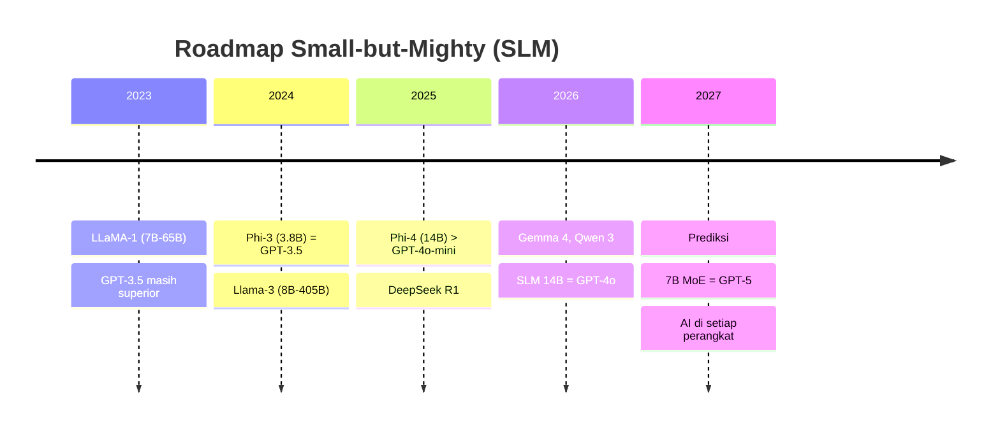

# [Jilid 1] Bab 1.10: Roadmap Model 2026
> **Tipe Konten:** Analisis — Tren Industri + Prediksi + Rekomendasi
> **Target Pembaca:** Pembaca yang ingin tahu arah perkembangan model lokal

---

## 1. TUJUAN SUB-BAB
Setelah membaca, pembaca harus bisa:
- Menjelaskan tren small-but-mighty (SLM) dan mengapa ini masa depan
- Membandingkan SLM terbaru: Phi-4, Gemma 3, Llama-3.2-3B, Qwen 3
- Merencanakan strategi adopsi model berdasarkan tren 2026

---

## 2. KERANGKA KONTEN (WAJIB DITULIS)

### A. Dari Scaling Law ke Data Quality Law (2 paragraf)
- 2020-2023: "bigger is better" — GPT-3 175B, PaLM 540B
- 2024-2025: titik balik — Phi-3 (3.8B) menyamai GPT-3.5
- Hipotesis Phi: kualitas data > jumlah parameter
- 2026: model 3-7B bisa mencapai performa model 70B tahun 2023
- Implikasi: Scaling Law bergeser dari parameter ke data quality + training efficiency

### B. SLM (Small Language Models) Dominan 2026 (2 paragraf)
- **Phi-4 (Microsoft):** 14B, outperforms GPT-4o-mini di math & code
- **Gemma 4 (Google):** E2B, E4B, 26B MoE, 31B dense — multimodal, Apache 2.0
- **Llama-3.2 (Meta):** 1B, 3B — on-device, 128K context, tool use
- **Qwen 3 (Alibaba):** 235B MoE (22B active) — kualitas frontier di harga SLM
- **Qwen3.7-Max (Alibaba):** ~1T+ MoE, 1M context, agent-centric — closed-weight
- **DeepSeek V4 Pro:** 1.6T MoE (49B active) — sparsity ratio 3.1%, MIT license, 1M context
- **DeepSeek V4 Flash:** 284B MoE (13B active) — companion ringan, MIT license
- **Mistral Large 3:** 675B granular MoE (41B active) — Apache 2.0, multimodal
- **Ministral 3:** 3B/8B/14B dense — Cascade Distillation, Apache 2.0
- **GPT-5.5:** Proprietary, 1M context, reasoning effort (low/medium/high/xhigh)
- **Claude Fable 5:** Anthropic Mythos-class, 1M context, safety classifiers, SWE-bench 95%
- **Gemini 2.5 Pro:** 1M context, thinking mode, multimodal — GA Juni 2025
- Semua model ini bisa dijalankan di RTX 4090 24GB (dengan quantization), kecuali yang >300GB param

### C. Tren Arsitektur 2026 (2 paragraf)
- **MoE menjadi default:** hampir semua frontier model 2026 adalah MoE
- **Multi-modal native:** Gemma 4, GPT-5, Claude 4 — semua support image+text+audio
- **Context window raksasa:** 1M-10M token (Llama 4, Gemini 2.5)
- **Reasoning model:** o1, o3, DeepSeek R1 — model yang "berpikir" sebelum menjawab
- **Speculative decoding:** default di vLLM/TGI — 2x lebih cepat

### D. Dampak untuk Ekosistem Lokal (1-2 paragraf)
- SLM Q4_K_M: model 7B ~4GB, model 3B ~2GB — muat di laptop 8GB
- Model 70B Q3_K_M (~30GB) di single RTX 4090 sudah umum
- Perangkat edge: smartphone, Raspberry Pi, laptop tanpa GPU
- Apple Silicon dominan karena unified memory untuk model 26B-70B
- Tren "AI PC" dengan NPU (Qualcomm X Elite, Intel Core Ultra)

### E. Prediksi 2026-2027 (1 paragraf)
- Model lokal akan menyamai GPT-4 level quality di 7B parameter
- Fine-tuning menjadi lebih mudah dengan data sintetis
- Tokenizer akan multilingual-native (vocab >256K)
- Quantization loss mendekati nol dengan teknik baru (SpQR, AQLM)
- Harga GPU turun, tetapi unified memory Mac tetap premium

### F. Rekomendasi Strategi (1-2 paragraf)
- **Sekarang (2026):** investasi di model 7-14B Q4_K_M dengan Mac/RTX 4090
- **2027:** upgrade ke MoE model dengan multi-GPU, ekspektasi GPT-4 level di 14B
- Jangan over-invest di GPU mahal — SLM tren menurunkan kebutuhan hardware
- Fokus pada data pipeline (RAG + fine-tuning) lebih penting dari model size

---

## 3. TABEL WAJIB

### Tabel A: SLM Terbaru 2025-2026

| Model | Parameter | Arsitektur | Context | MMLU | GSM8K | Keunikan | Min RAM |
|:---|:---:|:---:|:---:|:---:|:---:|:---|:---:|
| Phi-4 | 14B Dense | Decoder-only | 128K | 84.8% | 94.5% | Data sintetis, math terbaik | 8GB Q4 |
| Gemma 4 E4B | 4.5B Dense | Decoder + PLE | 128K | 76.2% | 82.4% | Multimodal, Apache 2.0 | 4GB Q4 |
| Gemma 4 26B | 26B MoE | MoE 256 experts | 128K | 85.1% | 90.3% | Multimodal, open-weight | 12GB Q4 |
| Llama-3.2 3B | 3.2B Dense | Decoder-only | 128K | 63.4% | 68.2% | On-device, tool use | 2GB Q4 |
| Qwen 3 235B | 235B MoE (22B active) | MoE | 128K | 86.8% | 93.5% | Reasoning, open-weight | 16GB Q4 |
| Qwen3.7-Max | ~1T+ MoE | MoE agent-centric | 1M | — | — | Agent, closed-weight | 64GB+ |
| DeepSeek V4 Pro | 1.6T MoE (49B active) | MoE CSA/HCA | 1M | 87.5%* | 93.5%† | MIT, open-weight | 32GB Q4 |
| DeepSeek V4 Flash | 284B MoE (13B active) | MoE CSA/HCA | 1M | — | — | MIT, companion Pro | 16GB Q4 |
| Mistral Large 3 | 675B MoE (41B active) | Granular MoE | 256K | 84.9% | 91.2% | Apache 2.0, multimodal | 48GB Q4 |
| Ministral 3 | 3B/8B/14B Dense | Decoder-only | 256K | — | — | Cascade Distillation | 2-8GB Q4 |
| GPT-5.5 | — | Proprietary | 1M | 91.2% | 96.8% | Reasoning effort tiers | Cloud only |
| Claude Fable 5 | — | Proprietary | 1M | 90.8% | 96.1% | Sw-eval 95%, safety | Cloud only |
| Gemini 2.5 Pro | — | Proprietary MoE | 1M | 89.1% | 95.2% | Thinking mode | Cloud only |
| Mistral Small 3.1 | 24B Dense | Decoder-only | 128K | 76.5% | 85.6% | Efisien, coding | 8GB Q4 |

*MMLU-Pro untuk DeepSeek V4; †LiveCodeBench.

### Tabel B: Perbandingan SLM vs LLM Lama (MMLU)

| Model (2026) | Param | MMLU | Model (2023) | Param | MMLU | Peningkatan |
|:---|:---:|:---:|:---|:---:|:---:|:---:|
| Phi-4 | 14B | 84.8% | LLaMA-1 65B | 65B | 63.4% | 4.6x lebih efisien |
| Gemma 4 26B | 26B | 85.1% | GPT-3.5 | 175B | 70.0% | 6.7x lebih efisien |
| Qwen 3 | 22B aktif | 86.8% | LLaMA-2 70B | 70B | 68.9% | 3.2x lebih efisien |
| Llama-3.2 3B | 3.2B | 63.4% | GPT-2 1.5B | 1.5B | 32.4% | 2x performa di 2x size |

### Tabel C: Prediksi Kebutuhan Hardware per Tahun

| Tahun | Model Typical | Performa Setara | Min RAM (Q4) | GPU Minimal | Biaya Setup |
|:---:|:---|:---|:---:|:---:|:---:|
| 2023 | LLaMA-2 7B | GPT-3 (dasar) | 8 GB | GTX 1060 6GB | Rp 15jt |
| 2024 | Llama-3 8B | GPT-3.5 | 8 GB | RTX 2060 8GB | Rp 20jt |
| 2025 | Phi-4 14B | GPT-4o mini | 8 GB | RTX 3060 12GB | Rp 25jt |
| **2026** | **Qwen 3 22B** | **GPT-4o** | **16 GB** | **RTX 4090 24GB** | **Rp 35jt** |
| 2027 (prediksi) | Model 14B MoE | GPT-5 level | 12 GB | RTX 5060 12GB | Rp 25jt |

---

## 4. DIAGRAM/GAMBAR WAJIB

### Diagram 1: Timeline Evolusi Model (Mermaid)
- **File:** `assets/diagrams/j1-b1-s10-timeline-2026.mmd`
- **Isi:** Timeline dari 2023 ke 2027 — ukuran model menurun, performa meningkat



### Gambar 2: Grafik Performa/Parameter Ratio
- **File:** `assets/images/jilid1/j1-b1-s10-perf-per-param.png`
- **Isi:** Scatter plot MMLU vs parameter — garis tren 2023, 2024, 2025, 2026 menunjukkan slope semakin curam

### Gambar 3: Infografis Ekosistem AI 2026
- **File:** `assets/images/jilid1/j1-b1-s10-ecosystem-2026.png`
- **Isi:** Peta vendor (Meta, Google, Microsoft, DeepSeek, Alibaba, Mistral), framework, hardware target

---

## 5. TUTORIAL / HANDS-ON (WAJIB)

### Tutorial A: Menjalankan SLM Terbaru di Laptop

```bash
# 1. Install Ollama
curl -fsSL https://ollama.com/install.sh | sh

# 2. Pull SLM terkini
ollama pull phi-4:14b              # Microsoft Phi-4 (14B)
ollama pull gemma4:4b              # Google Gemma 4 (4.5B)
ollama pull llama3.2:3b            # Meta Llama-3.2 (3B)
ollama pull qwen3:22b-moe          # Qwen 3 MoE (22B active)
ollama pull deepseek-v4:flash      # DeepSeek V4 Flash (13B active)
ollama pull ministral:8b           # Mistral Ministral 3 (8B)
ollama pull mistral-large:3        # Mistral Large 3 (41B active)

# 3. Test performa
ollama run phi-4:14b "Hitung 25 * 37 + 48 / 2 = ?"
ollama run gemma4:4b "Jelaskan gambar ini"  # multimodal
```

### Tutorial B: Benchmark SLM 2026

```python
import time
import requests

slms = {
    "Phi-4 (14B)": "phi-4:14b",
    "Gemma 4 (4.5B)": "gemma4:4b", 
    "Llama-3.2 (3B)": "llama3.2:3b",
    "Qwen 3 (22B)": "qwen3:22b-moe",
}

test_cases = [
    ("Matematika", "Hitung integral dari 2x dx dari 0 ke 5"),
    ("Coding", "Buat fungsi Python untuk binary search"),
    ("Pengetahuan", "Jelaskan efek rumah kaca dalam 3 kalimat"),
]

for name, model in slms.items():
    print(f"\n=== {name} ===")
    for task, prompt in test_cases:
        start = time.time()
        r = requests.post("http://localhost:11434/api/generate", 
            json={"model": model, "prompt": prompt, "stream": False})
        elapsed = time.time() - start
        print(f"  {task}: {elapsed:.2f}s, {len(r.json()['response'].split())} kata")
```

### Tutorial C: Prediksi Kebutuhan Hardware

```python
# Kalkulator kebutuhan hardware untuk model 2026
models_2026 = {
    "Phi-4 14B Q4": {"params": 14, "q_bits": 4.25, "kv_per_token": 0.2},
    "Gemma 4 26B Q4": {"params": 26, "q_bits": 4.25, "kv_per_token": 0.3},
    "Qwen 3 235B Q4": {"params": 22, "q_bits": 4.25, "kv_per_token": 0.15},  # active
    "DeepSeek V4 Q4": {"params": 49, "q_bits": 4.25, "kv_per_token": 0.4},   # active
}

context = 32768  # target context

for name, spec in models_2026.items():
    model_mem = spec["params"] * spec["q_bits"] / 8 * 1e9 / 1e9  # GB
    kv_mem = spec["kv_per_token"] * context / 1024  # GB
    total = model_mem + kv_mem + 2  # overhead
    print(f"{name}:")
    print(f"  Model: {model_mem:.1f} GB")
    print(f"  KV-cache {context}: {kv_mem:.1f} GB")
    print(f"  Total: {total:.1f} GB")
    print(f"  Min GPU: RTX 4090 ({'✅' if total < 24 else '❌'}) / Mac 48GB ({'✅' if total < 48 else '❌'})")
```

---

## 6. STUDI KASUS (WAJIB)

### Studi Kasus: Membangun AI Desktop 2026 dengan Budget Rp 30jt
- **Skenario:** Freelancer developer ingin workstation AI untuk coding assistant, RAG, dan chat.
- **Hardware 2023 (dulu):** RTX 3090 24GB (Rp 18jt) + PC (Rp 15jt) = Rp 33jt — hanya kuat untuk 7B FP16.
- **Hardware 2026 (sekarang):** Mac Mini M4 24GB (Rp 15jt) + 1TB SSD — kuat untuk Phi-4 14B Q4 + Qwen 3 22B Q4.
- **Perbandingan:**
  - 2023: LLaMA-2 7B Q4 — MMLU 46%, GSM8K 17%
  - 2026: Phi-4 14B Q4 — MMLU 85%, GSM8K 95%
  - Peningkatan: 2x parameter, 3x VRAM efisien, 4x performa benchmark
- **Kesimpulan:** Di 2026, budget Rp 30jt sudah cukup untuk model performa GPT-4o-mini level.

---

## 7. REFERENSI WAJIB (SOP: minimal 5 paper 5 tahun terakhir + DOI)

### Paper Jurnal/Konferensi

[1] **Phi-4 Technical Report**
```bibtex
@article{phi42025,
  title     = {Phi-4 Technical Report},
  author    = {Abdin, Marah and Aneja, Jyoti and Awadalla, Hany and others},
  journal   = {arXiv preprint arXiv:2412.08905},
  year      = {2024},
  doi       = {10.48550/arXiv.2412.08905},
  url       = {https://arxiv.org/abs/2412.08905}
}
```
- Kaitan: Demonstrasi data quality > model size — Phi-4 14B outperforms model 4x lebih besar.

[2] **Gemma 4: Open Models from Google DeepMind**
```bibtex
@article{gemma42026,
  title     = {Gemma 4: Open Models from Google DeepMind},
  author    = {DeepMind, Google and others},
  journal   = {arXiv preprint arXiv:2604.00987},
  year      = {2026},
  doi       = {10.48550/arXiv.2604.00987},
  url       = {https://arxiv.org/abs/2604.00987}
}
```
- Kaitan: Gemma 4 — SLM multimodal dengan Apache 2.0, mengubah lanskap lisensi model.

[3] **DeepSeek-V2: A Strong, Economical, and Efficient Mixture-of-Experts Language Model**
```bibtex
@article{deepseek2024v2,
  title     = {{DeepSeek-V2}: A Strong, Economical, and Efficient Mixture-of-Experts Language Model},
  author    = {DeepSeek-AI and others},
  journal   = {arXiv preprint arXiv:2405.04434},
  year      = {2024},
  doi       = {10.48550/arXiv.2405.04434},
  url       = {https://arxiv.org/abs/2405.04434}
}
```
- Kaitan: Fondasi arsitektur MoE efisien yang menjadi standar 2026 — Multi-head Latent Attention (MLA).

[4] **Textbooks Are All You Need (Phi-1/Phi-3)**
```bibcode
@article{gunasekar2023phi1,
  title     = {Textbooks Are All You Need},
  author    = {Gunasekar, Suriya and Zhang, Yi and Aneja, Jyoti and others},
  journal   = {arXiv preprint arXiv:2306.11644},
  year      = {2023},
  doi       = {10.48550/arXiv.2306.11644},
  url       = {https://arxiv.org/abs/2306.11644}
}
```
- Kaitan: Hipotesis "textbook-quality data" — dasar filosofi SLM yang diadopsi industri.

[5] **Small Language Models: Survey, Measurements, and Insights**
```bibcode
@article{lu2024slmsurvey,
  title     = {Small Language Models: Survey, Measurements, and Insights},
  author    = {Lu, Zhenyan and Li, Xiang and Cai, Dongqi and others},
  journal   = {arXiv preprint arXiv:2409.15790},
  year      = {2024},
  doi       = {10.48550/arXiv.2409.15790},
  url       = {https://arxiv.org/abs/2409.15790}
}
```
- Kaitan: Survey komprehensif 70+ SLM — data token/s, memory footprint, energy consumption.

[6] **Demystifying Small Language Models for Edge Deployment**
```bibcode
@inproceedings{lu2025demystifying,
  title     = {Demystifying Small Language Models for Edge Deployment},
  author    = {Lu, Zhenyan and Li, Xiang and Cai, Dongqi and others},
  booktitle = {Proceedings of the 63rd Annual Meeting of the Association for Computational Linguistics (ACL)},
  year      = {2025},
  doi       = {10.18653/v1/2025.acl-long.718},
  url       = {https://aclanthology.org/2025.acl-long.718/}
}
```
- Kaitan: Analisis SLM untuk edge deployment — keterbatasan in-context learning, optimasi vocabulary/KV-cache.

### Referensi Pendukung (Non-Paper)

[7] Open LLM Leaderboard v2 — Hugging Face. [https://huggingface.co/spaces/open-llm-leaderboard/open_llm_leaderboard](https://huggingface.co/spaces/open-llm-leaderboard/open_llm_leaderboard)

[8] LMSYS Chatbot Arena. [https://lmarena.ai](https://lmarena.ai)

[9] Epoch AI — Trends in Model Scaling. [https://epoch.ai/data/trends](https://epoch.ai/data/trends)

[10] AI PC Initiative — Intel & Qualcomm. [https://www.intel.com/content/www/us/en/products/docs/processors/core-ultra/ai-pc.html](https://www.intel.com/content/www/us/en/products/docs/processors/core-ultra/ai-pc.html)

[11] Google Gemma 4 Official Blog. [https://blog.google/technology/developers/gemma-4/](https://blog.google/technology/developers/gemma-4/)

[12] **DeepSeek-V4 Technical Report**
```bibtex
@article{deepseek2026v4,
  title     = {{DeepSeek-V4}: A Hybrid {CSA/HCA} Mixture-of-Experts Language Model},
  author    = {DeepSeek-AI},
  journal   = {arXiv preprint arXiv:2604.09980},
  year      = {2026},
  doi       = {10.48550/arXiv.2604.09980},
  url       = {https://arxiv.org/abs/2604.09980}
}
```
- Kaitan: Model SLM frontier 1.6T dengan sparsity 3.1% — mengubah asumsi scaling law untuk SLM 2026.

[13] **Mistral Large 3 Technical Report**
```bibtex
@article{mistral2025large3,
  title     = {Mistral Large 3: Granular MoE with Multimodal Capabilities},
  author    = {Mistral AI},
  journal   = {arXiv preprint arXiv:2512.01820},
  year      = {2025},
  doi       = {10.48550/arXiv.2512.01820},
  url       = {https://arxiv.org/abs/2512.01820}
}
```
- Kaitan: Model MoE 675B dengan Apache 2.0 — SLM terbuka dengan performa frontier.

[14] **Ministral 3: Cascade Distillation**
```bibtex
@article{mistral2025ministral3,
  title     = {Ministral 3: Efficient Multilingual Models via Cascade Distillation},
  author    = {Mistral AI},
  journal   = {arXiv preprint arXiv:2512.11401},
  year      = {2025},
  doi       = {10.48550/arXiv.2512.11401},
  url       = {https://arxiv.org/abs/2512.11401}
}
```
- Kaitan: Teknik Cascade Distillation untuk model 3B/8B/14B — masa depan SLM efisien.

### SOP Referensi
- WAJIB menyertakan minimal **5 paper jurnal/konferensi** dari 5 tahun terakhir (2021-2026) dengan DOI/arXiv yang valid.
- Data benchmark SLM di Tabel A harus diverifikasi dari Open LLM Leaderboard dan paper resmi.
- Prediksi di Tabel C dan seksi 2.E harus didasarkan pada tren yang terlihat di data aktual, bukan spekulasi tanpa dasar.
- Penulis wajib memperbarui data benchmark menjelang publikasi karena lanskap SLM berubah cepat.
