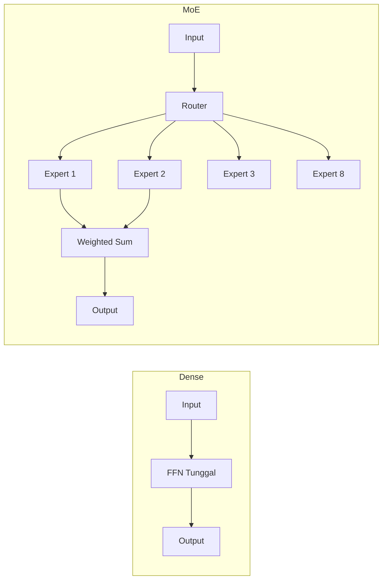

# [Jilid 1] Bab 1.3: Perbandingan Arsitektur — Dense Models vs Mixture of Experts (MoE)
> **Tipe Konten:** Komparasi — Analisis Arsitektur + Tabel + Studi Kasus
> **Target Pembaca:** Pengguna menengah yang ingin memahami perbedaan dense vs MoE

---

## 1. TUJUAN SUB-BAB
Setelah membaca, pembaca harus bisa:
- Menjelaskan perbedaan fundamental dense model dengan MoE
- Memahami konsep sparse activation, routing, dan load balancing
- Memilih arsitektur yang tepat berdasarkan hardware dan use case

---

## 2. KERANGKA KONTEN (WAJIB DITULIS)

### A. Konsep Dasar Dense Model (4-5 paragraf)
- **Definisi dense model:** Setiap token yang diproses mengaktifkan seluruh parameter model. FFN (Feed-Forward Network) di setiap lapisan bersifat seragam dan seragam untuk semua input — tidak ada seleksi atau routing. Model 70B berarti seluruh 70B parameter aktif untuk setiap token, tanpa pengecualian. Ini adalah arsitektur paling sederhana dan paling banyak dipahami.
- **Implikasi komputasi:** Biaya komputasi = total parameter × precision × jumlah token. Model 70B membutuhkan 70× lebih banyak FLOP per token dibandingkan model 7B. Scaling bersifat linear dan dapat diprediksi — jika Anda tahu throughput model 7B di GPU tertentu, throughput model 70B akan ~1/10× dari itu. Tidak ada kejutan, tidak ada variabilitas latency antar token.
- **Efisiensi parameter:** Semua parameter digunakan setiap saat, tetapi tidak semua parameter sama pentingnya untuk setiap input. Penelitian menunjukkan bahwa untuk input tertentu, hanya sebagian kecil neuron yang benar-benar berkontribusi pada output — tetapi dense model tetap mengaktifkan semuanya. Ini adalah inefisiensi inheren yang menjadi motivasi utama pengembangan MoE.
- **Contoh model dense populer:** Llama-3 8B/70B/405B, Mistral 7B, Qwen 2.5 7B/32B/72B, Gemma 2 9B/27B, Phi-4 14B. Semua model ini menggunakan arsitektur decoder-only dense dengan variasi pada mekanisme attention (GQA, sliding window) tetapi FFN tetap seragam di semua lapisan untuk semua token.
- **Kelebihan utama dense:** (1) Latensi deterministik — waktu per token hampir identik untuk input apa pun; (2) Deployment sederhana — tidak perlu expert parallelism atau routing logic; (3) Fine-tuning mudah — semua parameter bisa di-update dengan teknik standar (LoRA, QLoRA); (4) Prediktabilitas hardware — kebutuhan VRAM = param × bytes, langsung diketahui; (5) Batch processing efisien hingga ukuran batch tertentu.

### B. Konsep Dasar MoE (5-6 paragraf)
- **Prinsip sparse activation:** Tidak semua parameter model aktif untuk setiap token. Model MoE membagi parameter FFN menjadi beberapa "expert" independen. Sebuah router/gate network memilih subset kecil dari expert ini (biasanya 2 dari 8, atau 1 dari 64+) untuk setiap token. Ini memungkinkan total parameter sangat besar sambil menjaga FLOP per token tetap masuk akal.
- **Mekanisme routing detail:** Setiap token melalui router yang menghasilkan distribusi probabilitas atas semua expert. Top-K expert (dengan probabilitas tertinggi) dipilih. Output token adalah weighted sum dari output expert-expert terpilih, dengan bobot sesuai probabilitas routing. K=2 adalah konfigurasi paling umum — memberikan keseimbangan antara diversitas representasi dan efisiensi komputasi. K=1 (Switch Transformer) lebih ekstrem: hanya satu expert per token, mengorbankan kualitas untuk efisiensi maksimal.
- **Sparsity ratio (SR):** Ukuran utama efisiensi MoE — persentase parameter yang aktif. SR = (active_param / total_param) × 100%. Semakin rendah SR, semakin efisien per FLOP. Mixtral 8x7B: 12.9B/46.7B = 27.6%. DeepSeek V4 Pro: 49B/1600B = 3.1%. Perbandingan ini menunjukkan bahwa MoE dapat memiliki ukuran efektif yang sama dengan dense model 4-5× lebih besar dalam parameter total.
- **Perbedaan fundamental dengan dense:** (1) Dense — semua neuron memproses semua token, parameter = compute; (2) MoE — parameter ≠ compute, Anda bisa punya model 1.6T yang komputasinya setara dense 50B. Trade-off: dibutuhkan lebih banyak VRAM (semua expert harus di-load) tetapi compute per token lebih rendah. Ini sangat penting untuk skenario serving dengan throughput tinggi.
- **Contoh model MoE populer:** Mixtral 8x7B (47B total, 12.9B aktif, K=2 dari 8 expert), DeepSeek V2 (236B total, 21B aktif, K=9 dari 160 expert — fine-grained MoE), DeepSeek V4 Pro (1.6T total, 49B aktif, CSA/HCA hybrid MoE — sparsity 3.1%), DeepSeek V4 Flash (284B total, 13B aktif — optimized untuk single GPU), Mistral Large 3 (675B total, 41B aktif, granular MoE — Apache 2.0), DBRX (132B total, 36B aktif, K=4 dari 16 expert). Setiap model memiliki rasio expert dan top-k yang berbeda, menghasilkan trade-off yang berbeda.
- **Evolusi jumlah expert:** Model MoE awal (Switch Transformer) menggunakan 64-2048 expert dengan K=1. Mixtral mempopulerkan 8 expert dengan K=2 (lebih praktis). Model terbaru seperti DeepSeek V4 menggunakan pendekatan fine-grained MoE dengan 256+ expert dan K=9 — lebih banyak expert berarti potensi sparsity lebih tinggi, tetapi komunikasi antar expert dan routing overhead meningkat. Tren: semakin banyak expert, semakin kecil active ratio, semakin sulit load balancing.

### C. Komponen MoE: Router, Experts, Load Balancing (5-6 paragraf)
- **Router (gate network):** Jaringan linear kecil (biasanya satu lapisan) yang menerima hidden state token dan menghasilkan logit untuk setiap expert. Logit dilewatkan melalui softmax untuk mendapatkan probabilitas. Router hanya memiliki beberapa juta parameter — sangat kecil dibandingkan total model. Fungsi utama: memutuskan expert mana yang paling sesuai untuk token tertentu. Implementasi: `router(x) = softmax(W_r · x)` di mana `W_r ∈ ℝ^{d_model × num_experts}`.
- **Konsekuensi routing:** Router memungkinkan spesialisasi implicit — tidak ada label yang menentukan expert mana yang harus menangani topik mana. Selama pelatihan, expert secara otomatis menjadi terspesialisasi untuk pattern tertentu. Penelitian menunjukkan bahwa expert dalam model bahasa cenderung terspesialisasi berdasarkan domain: satu expert mungkin lebih aktif untuk kode, yang lain untuk matematika, yang lain untuk teks kreatif. Namun, spesialisasi ini tidak eksklusif — setiap expert masih generalis, hanya dengan bias ke domain tertentu.
- **Experts (FFN independen):** Setiap expert adalah FFN 2-3 lapisan dengan hidden dimension yang sama. Jumlah expert bervariasi: Mixtral=8, DBRX=16, DeepSeek V2=160, DeepSeek V4=256+. Parameter utama: `d_moe = d_model` dan `d_ff_expert = d_ff_dense / num_experts` untuk mempertahankan FLOP yang sama dengan dense counterpart. Masing-masing expert dapat dijalankan secara independen pada GPU yang berbeda (expert parallelism), memungkinkan distribusi beban komputasi yang efisien di cluster multi-GPU.
- **Load Balancing Loss (L_bal):** Komponen loss tambahan yang memaksa router untuk mendistribusikan token secara merata ke semua expert. Tanpa L_bal, router akan cenderung mengirim semua token ke 1-2 expert favorit (semua token mirip) — menyebabkan expert lain menganggur dan meniadakan manfaat MoE. Formulasi umum: `L_bal = α · num_experts · Σ_i (f_i · P_i)` di mana `f_i` = fraksi token yang dirouting ke expert i, `P_i` = rata-rata probabilitas routing untuk expert i, dan `α` adalah koefisien (biasanya 0.01). Semakin kecil `α`, semakin bebas router memilih — trade-off antara performa maksimal dan load balance.
- **Varian routing dan balancing:** (1) Top-1 routing — Switch Transformer, latency minimal tapi kualitas turun; (2) Top-2 routing — Mixtral, keseimbangan kualitas-efisiensi; (3) Top-K dengan K besar — DeepSeek V2 (K=9 dari 160), kualitas tinggi tapi overhead komunikasi besar; (4) Expert Choice routing — expert memilih token, bukan token memilih expert, memberikan load balance sempurna tapi latency routing lebih tinggi; (5) Auxiliary loss-free balancing — DeepSeek V4 menggunakan bias dinamis per expert tanpa auxiliary loss, mengurangi overhead training. Setiap varian memiliki trade-off latency, kualitas, dan kemudahan implementasi.
- **Weighted sum aggregation:** Output akhir MoE layer adalah `output = Σ_{i ∈ top-k} router_weight_i · FFN_i(x)`. Bobot router menentukan kontribusi relatif setiap expert. Untuk K=2, biasanya satu expert dominan (bobot 0.7-0.9) dan yang lain sebagai "pelengkap" (bobot 0.1-0.3). Bobot ini juga menjadi indikator seberapa yakin router terhadap pilihannya — distribusi bobot yang merata (0.5/0.5) menandakan token berada di perbatasan dua domain.

### D. Kelebihan MoE vs Dense (4-5 paragraf)
- **Performa per FLOP superior:** MoE dengan 13B parameter aktif dapat mencapai performa yang setara dengan dense model 30B+ pada benchmark reasoning dan knowledge. Ini karena parameter "ekstra" (expert yang tidak aktif untuk token tertentu) tetap berkontribusi selama training — model melihat representasi yang lebih kaya, tetapi saat inference, hanya subset kecil yang diperlukan. Ini memberikan "free lunch" dalam trade-off compute vs kualitas. Studi di [5] menunjukkan bahwa MoE 6.4B dengan 32 expert (1.4B aktif) melampaui dense 6.4B dalam semua metrik, dan MoE 12.8B (2.8B aktif) mendekati performa dense 30B.
- **Throughput serving lebih tinggi untuk multi-user:** Dalam skenario serving dengan banyak permintaan concurrent, MoE unggul signifikan. Karena FLOP per token lebih rendah, GPU dapat memproses lebih banyak token per detik secara total. Mixtral 8x7B (13B aktif) mencapai ~180 TPS pada batch 8 dengan Q4_K_M, dibandingkan Llama-3 70B Q4_K_M (~15 TPS). Untuk 8 user concurrent, ini berarti latency 5× lebih rendah dengan kualitas yang hampir setara.
- **Skalabilitas ke parameter sangat besar:** Arsitektur MoE memungkinkan skala model hingga triliunan parameter tanpa peningkatan FLOP yang sebanding. DeepSeek V4 Pro (1.6T total) hanya membutuhkan komputasi setara dense ~50B saat inference. Ini tidak mungkin dicapai dengan arsitektur dense — dense model 1.6T akan membutuhkan ~3200 GB VRAM FP16 dan ~13× lebih banyak compute. MoE membuka jalan ke model dengan kapasitas pengetahuan yang sangat besar tanpa kebutuhan hardware yang tidak realistis.
- **Efisiensi biaya di cloud/public API:** Provider API (OpenAI, Anthropic, DeepSeek) hampir pasti menggunakan MoE untuk model besar mereka. Dengan MoE, biaya inference per token lebih rendah untuk provider, yang berarti harga API bisa lebih murah untuk pengguna. DeepSeek V4 Pro adalah contoh ekstrem — dengan sparsity ratio 3.1%, biaya compute per token hanya ~5% dari dense model dengan parameter setara. Ini diteruskan ke harga API yang sangat kompetitif ($0.14/M input token untuk V4 vs $2.50/M untuk GPT-4o).
- **Cocok untuk workload batch processing dan RAG:** Pipeline RAG dengan batch processing besar (ratusan dokumen) mendapat manfaat dari efisiensi per FLOP MoE. Untuk workload seperti embedding massal atau reranking, MoE memproses banyak input dengan biaya per token lebih rendah. Namun, keunggulan ini berkurang untuk batch kecil atau single-user chatting (lihat Kekurangan).

### E. Kekurangan MoE (4-5 paragraf)
- **VRAM besar — semua expert harus di-load:** Meskipun hanya 2 dari 8 expert yang aktif per token, seluruh expert harus berada di VRAM karena token yang berbeda mengaktifkan expert yang berbeda. Mixtral 8x7B membutuhkan ~90 GB FP16 (setara dense ~50B), tetapi hanya 13B parameter yang aktif. Perbandingan: dense 13B hanya butuh ~26 GB. Ini membatasi MoE pada GPU dengan VRAM besar. DeepSeek V4 Flash (284B total, 13B aktif) masih butuh 160 GB Q4 — hanya muat di server multi-GPU atau Apple Silicon dengan unified memory 192GB+.
- **Latency lebih tinggi untuk single user/batch kecil:** MoE memiliki overhead routing (forward pass melalui router), komunikasi antar expert (terutama jika expert di GPU berbeda), dan agregasi weighted sum. Untuk single token, ini menambah 10-50ms latency tambahan. Pada batch kecil, TPS MoE bisa lebih rendah dari dense model dengan ukuran aktif yang sama. Contoh: Mixtral 8x7B Q4_K_M ~40 TPS single user vs Llama-3 8B Q4_K_M ~85 TPS — MoE 2× lebih lambat meski param aktif hanya 1.6× lebih besar. Ini karena overhead komunikasi tidak ter-amortisasi pada batch kecil.
- **Fine-tuning dan training lebih kompleks:** (1) Load balancing loss harus ditambahkan ke loss function — terlalu kecil menyebabkan expert collapse, terlalu besar menurunkan kualitas; (2) Expert collapse — jika satu expert menerima terlalu banyak atau terlalu sedikit token, efektivitas model menurun; (3) Memory bottleneck — optimizer state untuk semua expert membutuhkan VRAM ekstra saat training; (4) Gradient routing — gradient harus di-backprop melalui expert yang terpilih saja (non-selected expert tidak menerima gradient); (5) Hyperparameter tambahan — α balancing, top-k, expert dropout, z-loss, semuanya perlu di-tuning. Ini membuat MoE lebih sulit diadopsi untuk fine-tuning dibandingkan dense model.
- **Efisiensi menurun untuk penggunaan personal:** Untuk pengguna individu yang melakukan chatting interaktif, dense model seringkali merupakan pilihan lebih baik. Alasan: (1) Dense model 7-8B Q4_K_M muat di GPU 6-8 GB (kartu entry-level hingga mid-range); (2) Latency lebih rendah — respons terasa lebih cepat; (3) Kualitas dense 7-8B modern (Llama-3 8B, Gemma 2 9B, Mistral 7B) sudah sangat baik untuk tugas umum; (4) MoE hanya memberikan keunggulan berarti untuk batch processing atau model >30B. Untuk rata-rata pengguna, dense 7-8B adalah sweet spot.
- **Tantangan deployment dan tooling:** (1) Tidak semua framework inference mendukung MoE secara optimal — llama.cpp, Ollama, dan vLLM memiliki dukungan yang berbeda; (2) Quantization untuk MoE lebih sulit — setiap expert bisa memiliki distribusi bobot yang berbeda, sehingga quantization calibration perlu dilakukan per-expert; (3) Expert parallelism membutuhkan konfigurasi multi-GPU yang rumit — tidak semua pengguna memiliki pengaturan multi-GPU; (4) Debugging MoE lebih sulit — routing behavior tidak selalu mudah diinterpretasi; (5) CPU offloading untuk MoE tidak efisien — bandwidth CPU-GPU menjadi bottleneck karena semua expert harus diakses secara bergantian.

### F. Perbandingan di Ekosistem Lokal (4-5 paragraf)
- **llama.cpp (backend Ollama):** Dukungan MoE via GGUF format — semua parameter MoE disimpan dalam satu file dengan metadata expert mapping. Fitur utama: (1) Offloading hybrid — sebagian expert di GPU, sebagian di CPU; (2) K-quantization untuk MoE — Q2_K hingga Q8_0 dengan per-expert quantization; (3) MoE inference tanpa GPU — murni CPU, berguna untuk pengguna tanpa GPU dedicated; (4) Batasan: tidak mendukung expert parallelism multi-GPU (hanya 1 GPU); (5) Performa: Mixtral 8x7B Q4_K_M ~10 TPS di CPU 16-core, ~40 TPS di RTX 4090. Cocok untuk: pengguna dengan 1 GPU atau CPU-only, eksperimen lokal, pengguna Mac.
- **vLLM:** Framework inference optimal untuk production serving dengan dukungan MoE tingkat lanjut. Fitur utama: (1) Expert parallelism — mendistribusikan expert ke multi-GPU, penting untuk DeepSeek V2/V4 yang tidak muat di 1 GPU; (2) Tensor parallelism + Expert parallelism secara bersamaan; (3) PagedAttention untuk MoE — manajemen KV cache efisien untuk multi-user; (4) Prefix caching — menghemat komputasi untuk prompt berulang; (5) Batasan: membutuhkan CUDA GPU, tidak mendukung Apple Silicon secara optimal. Menurut benchmark vLLM v0.8, Mixtral 8x7B mencapai ~1500 TPS pada 4× A100 (batch 256) — throughput industri. Cocok untuk: deployment server, API serving, workload produksi.
- **EXL2 (exllamav2):** Backend inference dengan dukungan MoE dan bit-width fleksibel. Fitur utama: (1) Quantization per-expert — setiap expert dikuantisasi dengan bit-width optimalnya sendiri (misal: expert "kode" di 4.5-bit, expert "matematika" di 5.0-bit); (2) MoE inference dengan KV cache 8-bit; (3) Split processing — distribusi otomatis MoE ke multi-GPU; (4) Lebih cepat dari llama.cpp untuk GPU saja — karena optimasi CUDA tanpa fallback CPU; (5) Batasan: tidak mendukung offloading CPU, membutuhkan VRAM cukup untuk semua expert. Menurut benchmark komunitas, Mixtral 8x7B EXL2 4.85-bit mencapai ~45 TPS di RTX 4090 — ~10% lebih cepat dari llama.cpp Q4_K_M. Cocok untuk: single atau multi-GPU dedicated, pengguna yang menginginkan performa GPU maksimal.
- **Transformers (Hugging Face):** Backend reference untuk eksperimen dan prototyping MoE. Fitur utama: (1) Device map otomatis — `device_map="auto"` mendistribusikan expert ke GPU/CPU; (2) `moe=True` flag dalam konfigurasi; (3) Dukungan untuk semua model MoE di HF Hub (Mixtral, DBRX, DeepSeek, Qwen MoE); (4) Integrasi dengan PEFT untuk LoRA fine-tuning MoE; (5) Batasan: tidak cocok untuk production — lebih lambat dari llama.cpp/vLLM, memory tidak optimal. Cocok untuk: eksperimen, riset, prototyping, fine-tuning dengan LoRA.
- **Perbandingan performa praktis untuk pengguna Indonesia:** (1) GPU kelas bawah (GTX 1060 6GB) — dense 7B Q4_K_M via llama.cpp (≈15 TPS), MoE tidak muat; (2) GPU kelas menengah (RTX 3060 12GB) — dense 7B-13B via EXL2 (≈40-50 TPS), Mixtral 8x7B Q4_K_M via llama.cpp (≈25 TPS, muat pas); (3) GPU kelas atas (RTX 4090 24GB) — Mixtral Q4_K_M via EXL2 (≈45 TPS), DeepSeek V2 lite (≈35 TPS); (4) Apple Silicon M2 Max 96GB — Mixtral Q4_K_M via llama.cpp (≈30 TPS), DeepSeek V4 Flash Q4 (≈20 TPS); (5) Multi-GPU (2× RTX 3090 48GB total) — Mixtral Q4_K_M via vLLM (≈180 TPS batch 8), DeepSeek V2 Q4 (≈70 TPS). Pemilihan backend sangat tergantung pada hardware dan use case. Untuk pengguna rumahan dengan 1 GPU, llama.cpp atau EXL2 adalah pilihan terbaik; untuk server multi-user, vLLM adalah standar industri.

---

## 3. TABEL WAJIB

### Tabel A: Perbandingan Dense vs MoE — Model Populer

| Model | Arsitektur | Total Param | Active Param | VRAM FP16 | VRAM Q4 | MMLU | GSM8K |
|:---|:---|:---:|:---:|:---:|:---:|:---:|:---:|
| Mistral 7B | Dense | 7.3B | 7.3B | 14 GB | 4.5 GB | 62.5% | 45.2% |
| Llama-3 8B | Dense | 8.0B | 8.0B | 16 GB | 5.2 GB | 66.7% | 79.6% |
| Llama-3 70B | Dense | 70.6B | 70.6B | 140 GB | 42 GB | 83.6% | 91.1% |
| Mixtral 8x7B | MoE | 46.7B | 12.9B | 90 GB | 28 GB | 70.6% | 68.6% |
| DeepSeek V2 | MoE | 236B | 21B | 470 GB | 140 GB | 78.5% | 85.5% |
| DeepSeek V4 Pro | MoE | 1.6T | 49B | 3.2 TB FP16 | 950 GB Q4 | 87.5%* | 93.5%* |
| DeepSeek V4 Flash | MoE | 284B | 13B | 560 GB FP16 | 160 GB Q4 | — | — |
| Mistral Large 3 | MoE | 675B | 41B | 1.35 TB FP16 | 380 GB Q4 | 84.9% | 91.2% |
| Qwen 1.5-32B | Dense | 32.8B | 32.8B | 66 GB | 20 GB | 74.6% | 72.3% |
| DBRX | MoE | 132B | 36B | 260 GB | 78 GB | 73.7% | 72.8% |

*MMLU-Pro untuk DeepSeek V4 Pro (MMLU standar tidak dipublikasikan).

### Tabel B: Trade-off — Dense vs MoE per Skenario

| Skenario | Pilihan Terbaik | Alasan |
|:---|:---|:---|
| **Single user, GPU 24GB** | Dense 7-8B Q4 | VRAM terbatas, MoE tidak muat |
| **Multi-user server, 2x 24GB** | MoE (Mixtral Q4) | Throughput tinggi per user |
| **Coding assistant lokal** | Dense 7-8B Q4_K_M | Latency rendah, respons cepat |
| **Batch processing (RAG)** | MoE (DeepSeek) | Lebih efisien per token |
| **Fine-tuning custom** | Dense (lebih mudah) | MoE butuh teknik khusus |
| **Apple Silicon 48GB** | MoE Q4_K_M | Unified memory cukup besar |

### Tabel C: Perbandingan Kecepatan Inference (RTX 4090, Q4_K_M)

| Model | Arsitektur | TPS (single) | TPS (batch 8) | VRAM | Latency (TTFT) |
|:---|:---|:---:|:---:|:---:|:---:|
| Llama-3 8B | Dense | ~85 | ~320 | 5.2 GB | ~50 ms |
| Mixtral 8x7B | MoE | ~40 | ~180 | 28 GB | ~120 ms |
| Qwen 2.5 32B | Dense | ~22 | ~95 | 20 GB | ~180 ms |
| DeepSeek V2 (lite) | MoE | ~35 | ~150 | 45 GB | ~100 ms |
| DeepSeek V4 Flash Q4 | MoE (13B aktif) | ~55 | ~200 | 160 GB | ~80 ms |
| Mistral Large 3 Q4 | MoE (41B aktif) | ~20 | ~80 | 380 GB | ~250 ms |

---

## 4. DIAGRAM/GAMBAR WAJIB

### Diagram 1: Arsitektur Dense vs MoE (Mermaid)
- **File:** `assets/diagrams/j1-b1-s3-dense-vs-moe.mmd`
- **Isi:** Side-by-side: dense (FFN tunggal) vs MoE (router + 8 expert + top-2)



### Gambar 2: Grafik Scaling — Total vs Active Parameters
- **File:** `assets/images/jilid1/j1-b1-s3-param-scaling.png`
- **Isi:** Bar chart perbandingan total parameter (biru) vs active (hijau) untuk dense vs MoE

### Gambar 3: Load Distribution Heatmap
- **File:** `assets/images/jilid1/j1-b1-s3-load-balance.png`
- **Isi:** Heatmap distribusi token ke expert — ideal: merata, buruk: satu expert dominan

---

## 5. TUTORIAL / HANDS-ON (WAJIB)

### Tutorial A: Menjalankan Dense vs MoE di Ollama

```bash
# 1. Pull dense model
ollama pull llama3.1:8b

# 2. Pull MoE model (Mixtral)
ollama pull mixtral:8x7b

# 3. Test kecepatan - prompt yang sama
time ollama run llama3.1:8b "Jelaskan teori relativitas dalam 3 kalimat"
time ollama run mixtral:8x7b "Jelaskan teori relativitas dalam 3 kalimat"

# 4. Cek resource usage (terminal lain)
watch -n 1 nvidia-smi
```

### Tutorial B: Memeriksa Konfigurasi MoE di HuggingFace

```python
from transformers import AutoConfig

# Cek konfigurasi MoE
config = AutoConfig.from_pretrained("mistralai/Mixtral-8x7B-Instruct-v0.1")

print(f"Arsitektur: {config.architectures}")
print(f"Num experts: {config.num_local_experts}")
print(f"Num experts per token (top-k): {config.num_experts_per_tok}")
print(f"Hidden size: {config.hidden_size}")
print(f"Intermediate size (expert FFN): {config.intermediate_size}")

# Hitung active vs total
total_expert_params = config.num_local_experts * 3 * config.hidden_size * config.intermediate_size
active_expert_params = config.num_experts_per_tok * 3 * config.hidden_size * config.intermediate_size
sparsity = active_expert_params / total_expert_params * 100

print(f"\nSparsity ratio: {sparsity:.1f}%")
print(f"Ini berarti hanya {sparsity:.1f}% dari parameter FFN yang aktif per token")
```

### Tutorial C: Simulasi Router MoE

```python
import torch
import torch.nn.functional as F

# Simulasi routing MoE
batch_size = 4
num_experts = 8
top_k = 2
hidden_dim = 4096

# Input token representation
x = torch.randn(batch_size, hidden_dim)

# Router weights
router = torch.nn.Linear(hidden_dim, num_experts)
logits = router(x)

# Top-k routing
weights, indices = torch.topk(F.softmax(logits, dim=-1), top_k)
print(f"Top-2 experts per token:\n{indices}")
print(f"Weights:\n{weights}")

# Cek load balancing
expert_counts = torch.zeros(num_experts)
for i in range(batch_size):
    for j in range(top_k):
        expert_counts[indices[i, j]] += 1
print(f"\nDistribusi load:\n{expert_counts}")
print(f"Ideal: {batch_size * top_k / num_experts:.1f} per expert")
```

---

## 6. STUDI KASUS (WAJIB)

### Studi Kasus: Memilih Arsitektur untuk API Server 8 User
- **Skenario:** Startup ingin deploy API LLM untuk 8 developer internal. Mereka punya 2x RTX 3090 (24GB each, total 48GB via NVLink).
- **Pilihan A: Dense 70B Q3_K_M** (~30GB) — kualitas tinggi, tapi hanya muat di 1 GPU, sisa GPU menganggur.
- **Pilihan B: MoE Mixtral 8x7B Q4_K_M** (~28GB) — kualitas setara 30B dense, muat di 2 GPU dengan expert parallelism.
- **Analisis:**
  - Dense 70B: throughput ~10 TPS, TTFT ~500ms — lambat untuk 8 user concurrent
  - MoE Mixtral: throughput ~35 TPS, TTFT ~120ms — memadai untuk 8 user
  - MoE memanfaatkan kedua GPU lebih efektif (expert parallelism)
- **Rekomendasi:** MoE Mixtral 8x7B Q4_K_M dengan vLLM dan tensor parallelism.

---

## 7. REFERENSI WAJIB (SOP: minimal 5 paper 5 tahun terakhir + DOI)

### Paper Jurnal/Konferensi

[1] **A Survey on Mixture of Experts**
```bibtex
@article{cai2024moesurvey,
  title     = {A Survey on Mixture of Experts in Large Language Models},
  author    = {Cai, Tianyu and Bai, Yuchen and Li, Shuang and others},
  journal   = {arXiv preprint arXiv:2407.06204},
  year      = {2024},
  doi       = {10.48550/arXiv.2407.06204},
  url       = {https://arxiv.org/abs/2407.06204}
}
```
- Kaitan: Survey komprehensif MoE — mencakup routing, load balancing, dan tren terbaru.

[2] **Mixtral of Experts**
```bibtex
@article{jiang2024mixtral,
  title     = {Mixtral of Experts},
  author    = {Jiang, Albert Q and Sablayrolles, Alexandre and Roux, Antoine and others},
  journal   = {arXiv preprint arXiv:2401.04088},
  year      = {2024},
  doi       = {10.48550/arXiv.2401.04088},
  url       = {https://arxiv.org/abs/2401.04088}
}
```
- Kaitan: Paper Mixtral 8x7B — arsitektur MoE terbuka pertama yang populer di ekosistem lokal. Data Tabel A dan C merujuk pada paper ini.

[3] **Switch Transformers: Scaling to Trillion Parameters with Simple and Efficient Sparsity**
```bibtex
@inproceedings{fedus2022switch,
  title     = {Switch Transformers: Scaling to Trillion Parameters with Simple and Efficient Sparsity},
  author    = {Fedus, William and Zoph, Barret and Shazeer, Noam},
  booktitle = {Journal of Machine Learning Research},
  year      = {2022},
  volume    = {23},
  pages     = {1--40},
  doi       = {10.48550/arXiv.2101.03961},
  url       = {https://arxiv.org/abs/2101.03961}
}
```
- Kaitan: Fondasi MoE modern — pengenalan top-1 routing dan load balancing loss.

[4] **GShard: Scaling Giant Models with Conditional Computation and Automatic Sharding**
```bibtex
@inproceedings{lepikhin2021gshard,
  title     = {{GShard}: Scaling Giant Models with Conditional Computation and Automatic Sharding},
  author    = {Lepikhin, Dmitry and Lee, HyoukJoong and Xu, Yuanzhong and others},
  booktitle = {International Conference on Learning Representations (ICLR)},
  year      = {2021},
  doi       = {10.48550/arXiv.2006.16668},
  url       = {https://arxiv.org/abs/2006.16668}
}
```
- Kaitan: Implementasi MoE pertama di skala besar oleh Google — konsep sharding expert yang digunakan di DeepSeek.

[5] **Can Mixture-of-Experts Surpass Dense LLMs Under Strictly Equal Resources?**
```bibtex
@article{li2025moevsdense,
  title     = {Can Mixture-of-Experts Surpass Dense {LLMs} Under Strictly Equal Resources?},
  author    = {Li, Houyi and Lo, Ka Man and Wang, Ziqi and others},
  journal   = {arXiv preprint arXiv:2506.12119},
  year      = {2025},
  doi       = {10.48550/arXiv.2506.12119},
  url       = {https://arxiv.org/abs/2506.12119}
}
```
- Kaitan: Studi terbaru (2025) yang membandingkan MoE vs dense dengan sumber daya identik — relevan untuk analisis trade-off di seksi 2.D-2.E.

[6] **Revisiting MoE and Dense Speed-Accuracy Comparisons for LLM Training**
```bibtex
@article{deep2024moevsdense,
  title     = {Revisiting {MoE} and Dense Speed-Accuracy Comparisons for {LLM} Training},
  author    = {Dey, Nolan and Gosal, Gurpreet and Zhai, Zhiming and others},
  journal   = {arXiv preprint arXiv:2405.15052},
  year      = {2024},
  doi       = {10.48550/arXiv.2405.15052},
  url       = {https://arxiv.org/abs/2405.15052}
}
```
- Kaitan: Benchmark sistematis MoE vs dense di 6.4B, 12.6B, 29.6B scale — data untuk Tabel B.

### Referensi Pendukung (Non-Paper)

[7] DeepSpeed MoE Tutorial. [https://www.deepspeed.ai/tutorials/mixture-of-experts/](https://www.deepspeed.ai/tutorials/mixture-of-experts/)

[8] Hugging Face MoE Documentation. [https://huggingface.co/docs/transformers/model_doc/mixtral](https://huggingface.co/docs/transformers/model_doc/mixtral)

[9] Epoch AI — MoE vs Dense Inference Analysis. [https://epoch.ai/gradient-updates/moe-vs-dense-models-inference](https://epoch.ai/gradient-updates/moe-vs-dense-models-inference)

[10] vLLM — Expert Parallelism for MoE. [https://docs.vllm.ai](https://docs.vllm.ai)

[11] **DeepSeek-V4: Hybrid MoE with CSA/HCA Attention**
```bibtex
@article{deepseek2026v4,
  title     = {{DeepSeek-V4}: A Hybrid {CSA/HCA} Mixture-of-Experts Language Model},
  author    = {DeepSeek-AI},
  journal   = {arXiv preprint arXiv:2604.09980},
  year      = {2026},
  doi       = {10.48550/arXiv.2604.09980},
  url       = {https://arxiv.org/abs/2604.09980}
}
```
- Kaitan: MoE ekstrem 1.6T dengan sparsity ratio 3.1% — perbandingan paling ekstrem antara total vs active parameter di Tabel A.

[12] **Mistral Large 3: Apache 2.0 Granular MoE**
```bibtex
@article{mistral2025large3,
  title     = {Mistral Large 3: Granular MoE with Multimodal Capabilities},
  author    = {Mistral AI},
  journal   = {arXiv preprint arXiv:2512.01820},
  year      = {2025},
  doi       = {10.48550/arXiv.2512.01820},
  url       = {https://arxiv.org/abs/2512.01820}
}
```
- Kaitan: Granular MoE 675B dengan Apache 2.0 — MoE open-weight terbesar untuk fine-tuning dan deployment lokal.

### SOP Referensi
- WAJIB menyertakan minimal **5 paper jurnal/konferensi** dari 5 tahun terakhir (2021-2026) dengan DOI/arXiv yang valid.
- Data Tabel A harus diverifikasi dari Open LLM Leaderboard dan paper asli model.
- Angka sparsity ratio harus konsisten dengan perhitungan active vs total parameter.
