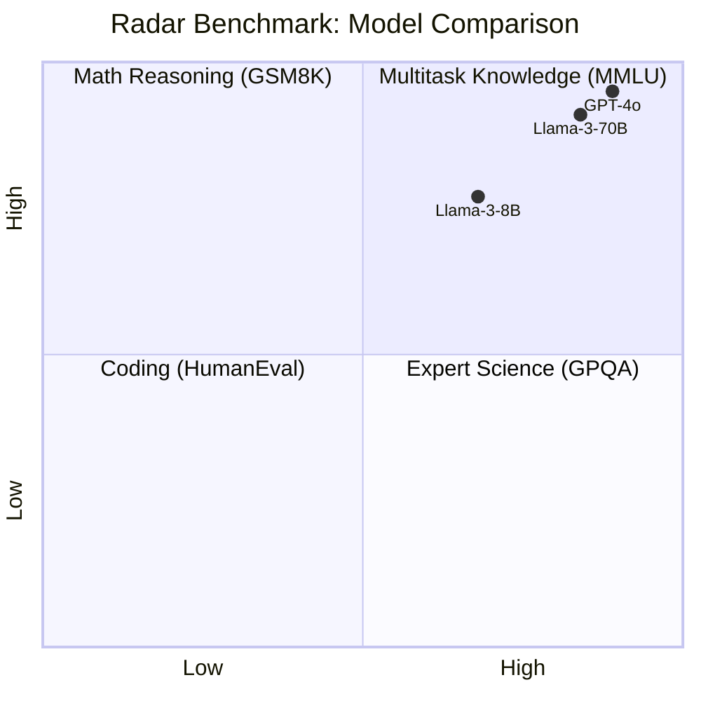

# [Jilid 1] Bab 1.5: Evaluasi Benchmark
> **Tipe Konten:** Edukasi — Interpretasi Data + Panduan Membaca Skor
> **Target Pembaca:** Pemula yang ingin memahami MMLU, GSM8K, HumanEval

---

## 1. TUJUAN SUB-BAB
Setelah membaca, pembaca harus bisa:
- Membaca dan menginterpretasi skor MMLU, GSM8K, HumanEval secara objektif
- Memahami metodologi few-shot, chain-of-thought, pass@k
- Mengevaluasi model secara mandiri menggunakan lm-evaluation-harness

---

## 2. KERANGKA KONTEN (WAJIB DITULIS)

### A. Mengapa Benchmark Penting? (1 paragraf)
- Tanpa benchmark: klaim "model ini lebih baik" bersifat anekdotal
- Benchmark = bahasa umum untuk membandingkan model lintas ukuran dan keluarga
- Tiga pilar: pengetahuan (MMLU), matematika (GSM8K), coding (HumanEval)
- Peringatan: benchmark tidak sempurna — data contamination, Goodhart's Law

### B. MMLU — Massive Multitask Language Understanding (2 paragraf)
- 57 subjek dari STEM, humaniora, ilmu sosial — ~14.000 soal pilihan ganda
- Skor = akurasi memilih jawaban benar dari 4 opsi
- Variasi: 5-shot (diberi 5 contoh), 0-shot (tanpa contoh)
- Contoh model: Llama-3 8B = 66.7%, GPT-4 = 86.4%
- Evaluasi menggunakan log-probability, bukan generasi teks bebas

### C. GSM8K — Grade School Math (1-2 paragraf)
- 8.500 soal matematika SD dengan multistep reasoning
- Butuh chain-of-thought (CoT) — model harus menunjukkan langkah
- Skor: pass@1 — apakah jawaban akhir benar (bukan langkah)
- Llama-3 8B: 79.6% dengan CoT
- Tantangan: model bisa "menebak" langkah yang salah tapi jawaban benar

### D. HumanEval — Code Generation (1 paragraf)
- 164 soal coding Python — fungsi yang harus diimplementasikan
- Evaluasi: apakah kode lulus semua test case? (pass@1, pass@10, pass@100)
- pass@k: probabilitas bahwa setidaknya satu dari k sampel benar
- Llama-3 8B: 62.2% pass@1, GPT-4: 87.1% pass@1

### E. Benchmark Lain yang Perlu Diketahui (1 paragraf)
- GPQA: graduate-level QA (biologi, fisika, kimia) — soal PhD-level
- MT-Bench: multi-turn conversation quality (dijudge GPT-4)
- MATH: competition math (lebih sulit dari GSM8K)
- IFEval: instruction following
- Arena Elo: preferensi manusia di LMSYS Chatbot Arena

### F. Membaca Skor dengan Bijak (1 paragraf)
- Konteks: skor MMLU 68% bukan berarti 68% kemampuan manusia
- Model kecil (7B) dengan fine-tuning bisa outperform model besar (70B) di domain spesifik
- Jangan bandingkan skor lintas benchmark secara langsung
- Perhatikan: setting evaluasi (few-shot, CoT, format prompt)

---

## 3. TABEL WAJIB

### Tabel A: Benchmark Score Lintas Model (2024-2025)

| Model | MMLU (5-shot) | GSM8K (8-shot CoT) | HumanEval (pass@1) | GPQA | MT-Bench |
|:---|:---:|:---:|:---:|:---:|:---:|
| GPT-4o | 88.7% | 95.3% | 87.1% | 69.3% | 8.96 |
| GPT-5.5 | 91.2% | 96.8% | 90.4% | 75.8% | 9.12 |
| Claude Fable 5 | 90.8% | 96.1% | 92.3%* | 73.5% | 9.05 |
| Llama-3.1 405B | 87.3% | 94.4% | 80.5% | 60.5% | 8.78 |
| Llama-3.1 70B | 83.6% | 91.1% | 72.6% | 51.2% | 8.37 |
| Llama-3.1 8B | 68.4% | 77.4% | 62.6% | 34.2% | 7.74 |
| Mistral 7B v0.2 | 62.5% | 45.2% | 30.5% | 27.8% | 6.52 |
| Qwen 2.5 72B | 85.3% | 91.8% | 76.5% | 57.1% | 8.41 |
| DeepSeek V3 | 88.5% | 92.8% | 82.6% | 62.3% | 8.67 |
| DeepSeek V4 Pro | 87.5%* | 93.5%† | 80.6%† | 68.1% | 8.95 |
| Mistral Large 3 | 84.9% | 91.2% | — | — | — |
| Gemini 2.5 Pro | 89.1% | 95.2% | 85.4% | 65.9% | 8.88 |
| Gemma 2 9B | 72.3% | 68.4% | 47.8% | 32.1% | 7.22 |
| Phi-4 14B | 84.8% | 94.5% | 82.6% | 56.4% | 8.32 |

*MMLU-Pro untuk DeepSeek V4 (bukan MMLU standar). †LiveCodeBench dan SWE-bench untuk DeepSeek V4 Pro.
‡SWE-bench untuk Claude Fable 5 (bukan HumanEval).

### Tabel B: Interpretasi Benchmark

| Benchmark | Apa yang Diukur? | Metode | Format | Skor Acak | Skor Manusia |
|:---|:---|:---|:---:|:---:|:---:|
| MMLU | Pengetahuan umum 57 subjek | 5-shot, pilih jawaban | Multiple choice (4) | 25% | ~89% |
| GSM8K | Reasoning matematika SD | 8-shot CoT | Generate + jawab | ~0% | ~98% |
| HumanEval | Coding Python | 0-shot pass@1 | Generate fungsi | ~0% | ~96% |
| GPQA | Sains tingkat PhD | 0-shot CoT | Multiple choice (4) | 25% | ~65% |
| MT-Bench | Kualitas percakapan | Multi-turn | GPT-4 judge 1-10 | N/A | N/A |

### Tabel C: Perbandingan Tools Evaluasi

| Fitur | LM Eval Harness | LM Studio Eval | SGLang | LangSmith |
|:---|:---|:---|:---|:---|
| **Open Source** | Ya | Ya | Ya | Tidak |
| **Benchmark Built-in** | 100+ | 10+ | 20+ | Custom |
| **Output Parsing** | Regex/Logprobs | Regex | Regex | LLM Judge |
| **Batch Evaluation** | Ya | Tidak | Ya | Ya |
| **Cocok untuk** | Penelitian | Pengguna rumahan | Production | Enterprise |

---

## 4. DIAGRAM/GAMBAR WAJIB

### Diagram 1: Radar Chart Benchmark per Model (Mermaid)
- **File:** `assets/diagrams/j1-b1-s5-radar-benchmark.mmd`
- **Isi:** Radar chart 4 dimensi: MMLU, GSM8K, HumanEval, GPQA untuk Llama-3 8B vs 70B vs GPT-4



### Gambar 2: Grafik Distribusi Skor MMLU per Subjek
- **File:** `assets/images/jilid1/j1-b1-s5-mmlu-subjects.png`
- **Isi:** Bar chart horizontal — 57 subjek MMLU, bandingkan Llama-3 8B vs 70B

### Gambar 3: Screenshot Proses Evaluasi
- **File:** `assets/images/jilid1/j1-b1-s5-eval-terminal.png`
- **Isi:** Output terminal saat menjalankan lm_eval untuk MMLU

---

## 5. TUTORIAL / HANDS-ON (WAJIB)

### Tutorial A: Evaluasi Model dengan LM Evaluation Harness

```bash
# 1. Install lm-evaluation-harness
pip install lm-eval

# 2. Evaluasi MMLU 5-shot pada model lokal (contoh: Llama-3 8B via Ollama)
# Model harus diserve di OpenAI-compatible endpoint
lm_eval --model local-completion \
    --model_args model=llama3.1:8b,base_url=http://localhost:11434/v1 \
    --tasks mmlu \
    --num_fewshot 5

# 3. Evaluasi GSM8K dengan chain-of-thought
lm_eval --model local-completion \
    --model_args model=llama3.1:8b,base_url=http://localhost:11434/v1 \
    --tasks gsm8k_cot \
    --num_fewshot 8

# 4. Evaluasi HumanEval (butuh sandbox Python)
lm_eval --model local-completion \
    --model_args model=llama3.1:8b,base_url=http://localhost:11434/v1 \
    --tasks humaneval
```

### Tutorial B: Evaluasi Manual — Test Sendiri

```python
# Evaluasi MMLU sederhana (sample)
mmlu_questions = [
    {
        "question": "Apa ibukota Indonesia?",
        "choices": ["Jakarta", "Surabaya", "Bandung", "Medan"],
        "answer": 0
    }
]

def evaluate_mmlu(model, tokenizer, questions):
    correct = 0
    for q in questions:
        prompt = f"Pertanyaan: {q['question']}\nPilihan: "
        for i, c in enumerate(q['choices']):
            prompt += f"{chr(65+i)}. {c}\n"
        prompt += "Jawaban:"
        
        # Dapatkan log-probability untuk A/B/C/D
        inputs = tokenizer(prompt, return_tensors="pt")
        with torch.no_grad():
            logits = model(**inputs).logits[0, -1]
        probs = logits[[tokenizer.encode(c)[0] for c in ['A','B','C','D']]]
        pred = probs.argmax().item()
        if pred == q['answer']:
            correct += 1
    return correct / len(questions) * 100
```

### Tutorial C: Benchmarking Kecepatan Inference

```bash
# Test token/s untuk setiap model
python -c "
import time
import requests

models = ['llama3.1:8b', 'mixtral:8x7b', 'qwen2.5:7b']
prompt = 'Jelaskan sejarah Indonesia dalam 10 kalimat.'

for model in models:
    start = time.time()
    r = requests.post('http://localhost:11434/api/generate', json={
        'model': model,
        'prompt': prompt,
        'stream': False
    })
    elapsed = time.time() - start
    tokens = len(r.json()['response'].split())
    print(f'{model}: {tokens/elapsed:.1f} token/s, {elapsed:.2f}s total')
"
```

---

## 6. STUDI KASUS (WAJIB)

### Studi Kasus: Memilih Model Berdasarkan Benchmark
- **Skenario:** Perusahaan edukasi ingin AI tutor matematika untuk siswa SD-SMP.
- **Prioritas:** GSM8K (matematika) > MMLU (pengetahuan umum) > HumanEval (tidak relevan)
- **Kandidat:**
  - Llama-3.1 8B: GSM8K 77.4% — cukup untuk soal SD
  - Phi-4 14B: GSM8K 94.5% — sangat baik untuk matematika
  - DeepSeek V4 Pro: LiveCodeBench 93.5% — unggul di coding dan matematika
  - Mistral 7B: GSM8K 45.2% — kurang memadai
- **Rekomendasi:** Phi-4 14B Q4_K_M (~8GB VRAM) atau DeepSeek V4 Pro via API. Biaya ~Rp 25jt untuk Mini PC + GPU 12GB.
- **Catatan:** GSM8K adalah proxy — perlu juga test dengan soal matematika kurikulum lokal.

---

## 7. REFERENSI WAJIB (SOP: minimal 5 paper 5 tahun terakhir + DOI)

### Paper Jurnal/Konferensi

[1] **Measuring Massive Multitask Language Understanding (MMLU)**
```bibtex
@inproceedings{hendrycks2021mmlu,
  title     = {Measuring Massive Multitask Language Understanding},
  author    = {Hendrycks, Dan and Burns, Collin and Basart, Steven and Zou, Andy and Mazeika, Mantas and Song, Dawn and Steinhardt, Jacob},
  booktitle = {International Conference on Learning Representations (ICLR)},
  year      = {2021},
  doi       = {10.48550/arXiv.2009.03300},
  url       = {https://arxiv.org/abs/2009.03300}
}
```
- Kaitan: Paper asli MMLU — menjelaskan metodologi 57 subjek dan 5-shot evaluation.

[2] **Training Verifiers to Solve Math Word Problems (GSM8K)**
```bibtex
@article{cobbe2021gsm8k,
  title     = {Training Verifiers to Solve Math Word Problems},
  author    = {Cobbe, Karl and Kosaraju, Vineet and Bavarian, Mohammad and others},
  journal   = {arXiv preprint arXiv:2110.14168},
  year      = {2021},
  doi       = {10.48550/arXiv.2110.14168},
  url       = {https://arxiv.org/abs/2110.14168}
}
```
- Kaitan: Paper asli GSM8K — metodologi chain-of-thought dan verifier-based evaluation.

[3] **Evaluating Large Language Models Trained on Code (HumanEval)**
```bibtex
@inproceedings{chen2021humaneval,
  title     = {Evaluating Large Language Models Trained on Code},
  author    = {Chen, Mark and Tworek, Jerry and Jun, Heewoo and others},
  booktitle = {Advances in Neural Information Processing Systems (NeurIPS)},
  year      = {2021},
  doi       = {10.48550/arXiv.2107.03374},
  url       = {https://arxiv.org/abs/2107.03374}
}
```
- Kaitan: Paper asli HumanEval — konsep pass@k dan metodologi functional correctness.

[4] **The Llama 3 Herd of Models**
```bibtex
@article{llama32024,
  title     = {The Llama 3 Herd of Models},
  author    = {Grattafiori, Aaron and Dubey, Abhimanyu and Jauhri, Abhinav and others},
  journal   = {arXiv preprint arXiv:2407.21783},
  year      = {2024},
  doi       = {10.48550/arXiv.2407.21783},
  url       = {https://arxiv.org/abs/2407.21783}
}
```
- Kaitan: Sumber data benchmark Llama-3 untuk Tabel A — mencakup MMLU, GSM8K, HumanEval dengan setup evaluasi terstandar.

[5] **Holistic Evaluation of Language Models (HELM)**
```bibtex
@article{liang2023helm,
  title     = {Holistic Evaluation of Language Models},
  author    = {Liang, Percy and Bommasani, Rishi and Lee, Tony and others},
  journal   = {Transactions on Machine Learning Research},
  year      = {2023},
  doi       = {10.48550/arXiv.2211.09110},
  url       = {https://arxiv.org/abs/2211.09110}
}
```
- Kaitan: Framework evaluasi holistik oleh Stanford CRFM — penting untuk memahami keterbatasan benchmark tunggal.

[6] **MMLU-Pro: A More Robust and Challenging Multi-Task Language Understanding Benchmark**
```bibtex
@article{wang2024mmlupro,
  title     = {{MMLU-Pro}: A More Robust and Challenging Multi-Task Language Understanding Benchmark},
  author    = {Wang, Yubo and Ma, Xueguang and Zhang, Ge and others},
  journal   = {arXiv preprint arXiv:2406.01574},
  year      = {2024},
  doi       = {10.48550/arXiv.2406.01574},
  url       = {https://arxiv.org/abs/2406.01574}
}
```
- Kaitan: Versi MMLU yang lebih sulit dengan 10 opsi per soal — mengurangi tebakan acak.

### Referensi Pendukung (Non-Paper)

[7] EleutherAI LM Evaluation Harness. [https://github.com/EleutherAI/lm-evaluation-harness](https://github.com/EleutherAI/lm-evaluation-harness)

[8] LMSYS Chatbot Arena Leaderboard. [https://lmarena.ai](https://lmarena.ai)

[9] Hugging Face Open LLM Leaderboard v2. [https://huggingface.co/spaces/open-llm-leaderboard/open_llm_leaderboard](https://huggingface.co/spaces/open-llm-leaderboard/open_llm_leaderboard)

[10] LiveCodeBench — Code Evaluation for LLMs. [https://livecodebench.github.io](https://livecodebench.github.io)

[11] **DeepSeek-V4 Technical Report**
```bibtex
@article{deepseek2026v4,
  title     = {{DeepSeek-V4}: A Hybrid {CSA/HCA} Mixture-of-Experts Language Model},
  author    = {DeepSeek-AI},
  journal   = {arXiv preprint arXiv:2604.09980},
  year      = {2026},
  doi       = {10.48550/arXiv.2604.09980},
  url       = {https://arxiv.org/abs/2604.09980}
}
```
- Kaitan: Sumber data MMLU-Pro 87.5%, LiveCodeBench 93.5%, SWE-bench 80.6% untuk DeepSeek V4 Pro di Tabel A.

[12] **Claude Fable 5 — Anthropic's Mythos-Class Model**
```bibtex
@article{anthropic2026fable5,
  title     = {Claude Fable 5: Safety-First Frontier Model},
  author    = {Anthropic},
  journal   = {Anthropic Blog},
  year      = {2026},
  url       = {https://anthropic.com/fable-5}
}
```
- Kaitan: SWE-bench 95.0% — tolok ukur kemampuan coding model frontier terbaru di Tabel A.

[13] **Mistral Large 3 Technical Report**
```bibtex
@article{mistral2025large3,
  title     = {Mistral Large 3: Granular MoE with Multimodal Capabilities},
  author    = {Mistral AI},
  journal   = {arXiv preprint arXiv:2512.01820},
  year      = {2025},
  doi       = {10.48550/arXiv.2512.01820},
  url       = {https://arxiv.org/abs/2512.01820}
}
```
- Kaitan: Sumber data MMLU 84.9% dan GSM8K 91.2% untuk Mistral Large 3 di Tabel A.

### SOP Referensi
- WAJIB menyertakan minimal **5 paper jurnal/konferensi** dari 5 tahun terakhir (2021-2026) dengan DOI/arXiv yang valid.
- Data Tabel A WAJIB diverifikasi dari Open LLM Leaderboard dan paper asli setiap model.
- Metodologi evaluasi (few-shot, CoT, pass@k) harus dijelaskan dengan benar sesuai paper asli.
