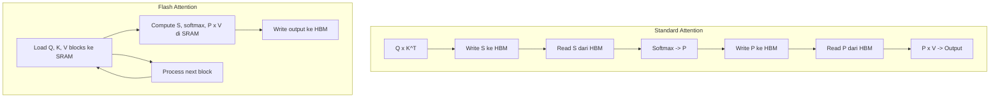

# [Jilid 1] Bab 1.7: Context Window Management
> **Tipe Konten:** Teknis — Algoritma + Optimasi + Praktik
> **Target Pembaca:** Pengguna menengah yang ingin memahami Flash Attention dan KV-Cache

---

## 1. TUJUAN SUB-BAB
Setelah membaca, pembaca harus bisa:
- Menjelaskan mekanisme attention dan bottleneck O(n²) di context window
- Memahami cara kerja Flash Attention, KV-Cache, dan sliding window
- Mengoptimalkan context window untuk hardware terbatas

---

## 2. KERANGKA KONTEN (WAJIB DITULIS)

### A. Mekanisme Attention dan Kompleksitas (1-2 paragraf)
- Attention: setiap token "melihat" semua token sebelumnya
- Kompleksitas O(n²) — 10x panjang konteks = 100x compute + memori
- Untuk n=4096: ~16M attention scores, untuk n=128K: ~16B scores
- Ini alasan utama kenapa konteks panjang itu mahal

### B. KV-Cache: Memori untuk Inference (1-2 paragraf)
- Pada inference autoregressive, K dan V dari token sebelumnya di-cache
- KV-cache size = 2 * n_layers * d_model * n_tokens * bytes_per_param
- Llama-3 8B: ~1.5 MB per token -> 128K token = ~190 GB (tanpa optimasi)
- GQA (Grouped Query Attention) mengurangi ukuran KV-cache 4-8x

### C. Flash Attention (2 paragraf)
- Masalah: standard attention menulis matriks S dan P ke HBM (VRAM) — lambat
- Flash Attention: compute attention dalam blok-blok kecil di SRAM (cache GPU)
- Tidak membuat matriks S/P penuh di HBM — memory linear, bukan kuadratik
- Flash Attention v1 (2022): 2-4x speedup, memori linear
- Flash Attention v2 (2023): 2x lebih cepat dari v1, 72% FLOPs utilization
- Flash Attention v3 (2024): optimasi H100, FP8 support

### D. Teknik Manajemen Context Lainnya (2 paragraf)
- **Sliding Window:** hanya token dalam window terakhir yang di-attend — Mistral 7B
- **ALiBi:** posisi embedding linear, bukan sinusoidal — memungkinkan extrapolation
- **PagedAttention:** KV-cache dipartisi seperti halaman memori — vLLM
- **Contextual Compression:** ringkas history sebelum masuk context window

### E. Trade-off Context Window di Hardware Lokal (1 paragraf)
- 4K konteks: ~800 MB KV-cache — nyaris semua GPU bisa
- 32K konteks: ~6 GB KV-cache — butuh GPU 16GB+
- 128K konteks: ~24 GB KV-cache — hanya GPU 24GB+ atau Mac 48GB
- Context compression + quantization = solusi untuk hardware terbatas

### F. Praktik Terbaik untuk Lokal (1 paragraf)
- Gunakan GQA model (Llama-3, Mistral, Qwen) untuk efisiensi KV-cache
- Aktifkan Flash Attention di semua inference engine
- Batasi context window sesuai kebutuhan (tidak perlu 128K untuk chat)
- Model dengan 1M context (DeepSeek V4 Pro, GPT-5.5, Claude Fable 5, Gemini 2.5 Pro, Qwen3.7-Max) membutuhkan optimasi KV-cache agresif — flash attention + sliding window + context compression wajib untuk konteks >128K
- Gunakan summarization untuk memampatkan history percakapan

---

## 3. TABEL WAJIB

### Tabel A: Memori KV-Cache per Model dan Context Length

| Model | GQA | d_model | Layers | KV-cache/token | 4K | 8K | 32K | 128K |
|:---|:---:|:---:|:---:|:---:|:---:|:---:|:---:|:---:|
| GPT-2 (1.5B) | Tidak | 1600 | 48 | 0.3 MB | 1.2 GB | 2.4 GB | 9.6 GB | - |
| Llama-3 8B | Ya (8 KV) | 4096 | 32 | 0.2 MB | 0.8 GB | 1.6 GB | 6.4 GB | 25.6 GB |
| Llama-3 70B | Ya (8 KV) | 8192 | 80 | 0.7 MB | 2.8 GB | 5.6 GB | 22.4 GB | 89.6 GB |
| Mistral 7B | Ya (8 KV) | 4096 | 32 | 0.2 MB | 0.8 GB | 1.6 GB | 6.4 GB | - |
| Qwen 2.5 7B | Ya (4 KV) | 4096 | 28 | 0.1 MB | 0.4 GB | 0.8 GB | 3.2 GB | 12.8 GB |
| DeepSeek V4 Pro | CSA/HCA hybrid | 8192 | 84 | 0.5 MB* | 2.0 GB | 4.0 GB | 16 GB | 64 GB |
| Gemini 2.5 Pro | Ya | 8192 | 64 | 0.4 MB | 1.6 GB | 3.2 GB | 12.8 GB | 51.2 GB |

*Estimasi untuk model MoE dengan hybrid attention — KV-cache hanya untuk attention heads aktif.

### Tabel B: Perbandingan Flash Attention vs Standard

| Metrik | Standard Attention | Flash Attn v1 | Flash Attn v2 | Flash Attn v3 |
|:---|:---:|:---:|:---:|:---:|
| **Kompleksitas memori** | O(n²) | O(n) | O(n) | O(n) |
| **Speedup vs standard** | 1x | 2-4x | 4-8x | 6-12x |
| **Max konteks A100 80GB** | ~32K | ~128K | ~256K | ~512K |
| **FP8 support** | Tidak | Tidak | Tidak | Ya |
| **GPU minimal** | Semua | Volta+ | Ampere+ | Hopper+ |
| **FLOPs utilization** | ~20% | ~40% | ~72% | ~85% |

### Tabel C: Teknik Manajemen Context

| Teknik | Cara Kerja | Keuntungan | Kerugian | Digunakan di |
|:---|:---|:---|:---|:---|
| **Sliding Window** | Attend only last N tokens | Memori O(n*w) | Kehilangan konteks awal | Mistral 7B |
| **ALiBi** | Linear position bias | Extrapolation ke >train length | Kualitas turun gradual | Bloom, MPT |
| **PagedAttention** | KV-cache di-page | Zero fragmentation, sharing | Overhead manajemen page | vLLM |
| **Context Compression** | Summarize history | Hemat memori signifikan | Kehilangan detail | LangChain, RAG |
| **RoPE (Rotary)** | Rotary position embedding | Relative position, extendable | Butuh interpolasi >train | Llama, Qwen, Gemma |

---

## 4. DIAGRAM/GAMBAR WAJIB

### Diagram 1: Perbandingan Standard vs Flash Attention (Mermaid)
- **File:** `assets/diagrams/j1-b1-s7-flash-vs-standard.mmd`
- **Isi:** Flowchart standard attention (Q->K->S->softmax->P->V) vs flash (tiling di SRAM)



### Gambar 2: Grafik Memori vs Context Length
- **File:** `assets/images/jilid1/j1-b1-s7-memory-vs-context.png`
- **Isi:** Line chart: sumbu X = context length, sumbu Y = memori — standard (kuadratik) vs flash (linear)

### Gambar 3: Ilustrasi KV-Cache Mechanism
- **File:** `assets/images/jilid1/j1-b1-s7-kv-cache.png`
- **Isi:** Diagram token generation — token baru pakai KV-cache dari token sebelumnya

---

## 5. TUTORIAL / HANDS-ON (WAJIB)

### Tutorial A: Mengaktifkan Flash Attention di Berbagai Engine

```python
# 1. HuggingFace Transformers
from transformers import AutoModelForCausalLM, AutoTokenizer

# Flash Attention 2
model = AutoModelForCausalLM.from_pretrained(
    "meta-llama/Meta-Llama-3-8B",
    torch_dtype=torch.float16,
    attn_implementation="flash_attention_2",  # atau "sdpa"
    device_map="auto"
)

tokenizer = AutoTokenizer.from_pretrained("meta-llama/Meta-Llama-3-8B")
prompt = "Jelaskan tentang Flash Attention" * 1000  # prompt panjang
inputs = tokenizer(prompt, return_tensors="pt").to("cuda")
output = model.generate(**inputs, max_new_tokens=100)
```

```bash
# 2. Ollama (aktifkan flash attention via Modelfile)
echo "FROM llama3.1:8b
PARAMETER num_ctx 32768
PARAMETER flash_attn true" | ollama create mymodel -f -

# 3. vLLM
python -m vllm.entrypoints.openai.api_server \
    --model meta-llama/Meta-Llama-3-8B \
    --enable-flash-attention \
    --max-model-len 32768
```

### Tutorial B: Mengukur Pengaruh Context Length

```bash
# Bandingkan kecepatan di konteks pendek vs panjang
python -c "
import time
import requests

for ctx_len in [2048, 4096, 8192, 16384, 32768]:
    # Buat prompt sepanjang ctx_len
    prompt = 'test ' * (ctx_len // 2)
    
    start = time.time()
    r = requests.post('http://localhost:11434/api/generate', json={
        'model': 'llama3.1:8b',
        'prompt': prompt,
        'options': {'num_ctx': ctx_len},
        'stream': False
    })
    elapsed = time.time() - start
    print(f'{ctx_len}: {elapsed:.2f}s')
"
```

### Tutorial C: Monitor KV-Cache Usage

```bash
# Monitor VRAM saat inference dengan konteks panjang
export PYTORCH_CUDA_ALLOC_CONF=expandable_segments:True

# Jalankan dengan nvidia-smi monitoring
nvidia-smi --query-gpu=timestamp,name,memory.used,memory.total --format=csv -l 1

# Di terminal lain, jalankan prompt panjang
ollama run llama3.1:8b --verbose \
    "Buat cerita 1000 kata tentang AI" 
```

---

## 6. STUDI KASUS (WAJIB)

### Studi Kasus: Analisis Dokumen Legal 50 Halaman
- **Skenario:** Firma hukum ingin menganalisis kontrak 50 halaman (~30K tokens) dengan LLM lokal.
- **Masalah:** Llama-3 8B dengan standard attention butuh ~30 GB KV-cache — melebihi VRAM RTX 4090 (24 GB).
- **Solusi:**
  1. Flash Attention: mengurangi memori attention dari O(n²) ke O(n)
  2. GQA: KV-cache hanya 0.2 MB/token (vs 1.5 MB tanpa GQA)
  3. Total KV-cache: 30K x 0.2 MB = 6 GB — muat di RTX 4090
  4. Sisa VRAM untuk model (Q4_K_M ~5.2 GB) + overhead = ~12 GB total
- **Hasil:** Dokumen 50 halaman bisa diproses dalam ~30 detik dengan RTX 4090.

---

## 7. REFERENSI WAJIB (SOP: minimal 5 paper 5 tahun terakhir + DOI)

### Paper Jurnal/Konferensi

[1] **FlashAttention: Fast and Memory-Efficient Exact Attention with IO-Awareness**
```bibtex
@inproceedings{dao2022flashattention,
  title     = {{FlashAttention}: Fast and Memory-Efficient Exact Attention with {IO}-Awareness},
  author    = {Dao, Tri and Fu, Daniel Y. and Ermon, Stefano and Rudra, Atri and R{\'e}, Christopher},
  booktitle = {Advances in Neural Information Processing Systems (NeurIPS)},
  year      = {2022},
  doi       = {10.48550/arXiv.2205.14135},
  url       = {https://arxiv.org/abs/2205.14135}
}
```
- Kaitan: Paper fundamental Flash Attention — teknik tiling dan recomputation yang mengurangi memori O(n²) ke O(n).

[2] **FlashAttention-2: Faster Attention with Better Parallelism and Work Partitioning**
```bibtex
@article{dao2023flashattention2,
  title     = {{FlashAttention-2}: Faster Attention with Better Parallelism and Work Partitioning},
  author    = {Dao, Tri},
  journal   = {arXiv preprint arXiv:2307.08691},
  year      = {2023},
  doi       = {10.48550/arXiv.2307.08691},
  url       = {https://arxiv.org/abs/2307.08691}
}
```
- Kaitan: Versi Flash Attention yang diadopsi luas — 72% FLOPs utilization, data Tabel B.

[3] **Efficient Memory Management for Large Language Model Serving with PagedAttention**
```bibtex
@inproceedings{kwon2023pagedattention,
  title     = {Efficient Memory Management for Large Language Model Serving with {PagedAttention}},
  author    = {Kwon, Woosuk and Li, Zhuohan and Zhuang, Siyuan and Sheng, Ying and Zheng, Lianmin and Yu, Cody Hao and Gonzalez, Joseph and Zhang, Hao and Stoica, Ion},
  booktitle = {Proceedings of the 29th Symposium on Operating Systems Principles (SOSP)},
  year      = {2023},
  doi       = {10.1145/3600006.3613165},
  url       = {https://doi.org/10.1145/3600006.3613165}
}
```
- Kaitan: PagedAttention — optimasi KV-cache untuk serving, digunakan di vLLM.

[4] **Train Short, Test Long: Attention with Linear Biases Enables Input Length Extrapolation (ALiBi)**
```bibcode
@inproceedings{press2022alibi,
  title     = {Train Short, Test Long: Attention with Linear Biases Enables Input Length Extrapolation},
  author    = {Press, Ofir and Smith, Noah A. and Lewis, Mike},
  booktitle = {International Conference on Learning Representations (ICLR)},
  year      = {2022},
  doi       = {10.48550/arXiv.2108.12409},
  url       = {https://arxiv.org/abs/2108.12409}
}
```
- Kaitan: ALiBi — alternatif position encoding yang memungkinkan extrapolation konteks > training length.

[5] **Ring Attention with Blockwise Transformers for Near-Infinite Context**
```bibtex
@inproceedings{liu2024ringattention,
  title     = {Ring Attention with Blockwise Transformers for Near-Infinite Context},
  author    = {Liu, Hao and Zaharia, Matei and Abbeel, Pieter},
  booktitle = {International Conference on Machine Learning (ICML)},
  year      = {2024},
  doi       = {10.48550/arXiv.2310.01801},
  url       = {https://arxiv.org/abs/2310.01801}
}
```
- Kaitan: Teknik context window tak terbatas via blockwise computation — batas atas potensi konteks.

[6] **Mistral 7B: Sliding Window Attention**
```bibcode
@article{jiang2023mistral,
  title     = {Mistral 7B},
  author    = {Jiang, Albert Q and others},
  journal   = {arXiv preprint arXiv:2310.06825},
  year      = {2023},
  doi       = {10.48550/arXiv.2310.06825},
  url       = {https://arxiv.org/abs/2310.06825}
}
```
- Kaitan: Implementasi sliding window attention dengan window 4096 — trade-off konteks vs memori.

### Referensi Pendukung (Non-Paper)

[7] Flash Attention GitHub Repository. [https://github.com/Dao-AILab/flash-attention](https://github.com/Dao-AILab/flash-attention)

[8] vLLM — PagedAttention Documentation. [https://docs.vllm.ai](https://docs.vllm.ai)

[9] RoPE (Rotary Position Embedding) — Blog Post by EleutherAI. [https://blog.eleuther.ai/rotary-embeddings/](https://blog.eleuther.ai/rotary-embeddings/)

[10] llama.cpp — Context Length Options. [https://github.com/ggerganov/llama.cpp](https://github.com/ggerganov/llama.cpp)

[11] **DeepSeek-V4: Hybrid CSA/HCA Attention for 1M Context**
```bibtex
@article{deepseek2026v4,
  title     = {{DeepSeek-V4}: A Hybrid {CSA/HCA} Mixture-of-Experts Language Model},
  author    = {DeepSeek-AI},
  journal   = {arXiv preprint arXiv:2604.09980},
  year      = {2026},
  doi       = {10.48550/arXiv.2604.09980},
  url       = {https://arxiv.org/abs/2604.09980}
}
```
- Kaitan: Inovasi hybrid Cross-Step Attention (CSA) dan Hybrid Chunk Attention (HCA) untuk konteks 1M token — alternatif arsitektur attention selain Flash Attention.

[12] **Gemini 2.5 Pro: 1M Context Window**
```bibtex
@article{google2025gemini25,
  title     = {Gemini 2.5 Pro: Thinking Model with 1M Context},
  author    = {Google DeepMind},
  journal   = {Google Blog},
  year      = {2025},
  url       = {https://blog.google/technology/google-deepmind/gemini-2.5-pro}
}
```
- Kaitan: Implementasi konteks 1M token dengan thinking mode — benchmark untuk manajemen konteks panjang.

### SOP Referensi
- WAJIB menyertakan minimal **5 paper jurnal/konferensi** dari 5 tahun terakhir (2021-2026) dengan DOI/arXiv yang valid.
- Data memori KV-cache di Tabel A harus diverifikasi dengan perhitungan manual menggunakan rumus: `2 * n_layers * (d_model/n_kv_heads) * n_kv_heads * 2 bytes * n_tokens`.
- Angka speedup Flash Attention di Tabel B harus merujuk pada hasil benchmark di paper asli.
