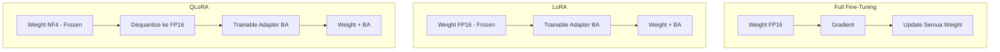

# [Jilid 1] Bab 1.8: Model Fine-Tuning Dasar
> **Tipe Konten:** Praktikal — Tutorial + Teori + Tools
> **Target Pembaca:** Pengguna yang ingin mempersonalisasi LLM lokal

---

## 1. TUJUAN SUB-BAB
Setelah membaca, pembaca harus bisa:
- Menjelaskan perbedaan full fine-tuning, LoRA, dan QLoRA
- Menjalankan LoRA/QLoRA fine-tuning untuk model lokal
- Memilih konfigurasi fine-tuning yang tepat berdasarkan hardware

---

## 2. KERANGKA KONTEN (WAJIB DITULIS)

### A. Mengapa Fine-Tuning Diperlukan? (1 paragraf)
- Base model umum tidak optimal untuk domain spesifik (medis, hukum, Indonesia)
- Alternatif: prompt engineering (terbatas), RAG (butuh infrastruktur), fine-tuning (permanen)
- Fine-tuning = mengubah weight model untuk task spesifik

### B. Full Fine-Tuning vs Parameter-Efficient (2 paragraf)
- Full fine-tuning: update semua parameter — kualitas maksimal, biaya komputasi ekstrem
- Llama-3 70B full fine-tuning: butuh ~560 GB GPU memory (8x A100 80GB)
- Parameter-Efficient Fine-Tuning (PEFT): update sebagian kecil parameter
- LoRA adalah PEFT paling populer — hanya 0.1-1% parameter yang di-train

### C. LoRA — Low-Rank Adaptation (2 paragraf)
- Konsep: weight update ΔW didekomposisi jadi BA (matriks low-rank)
- r = rank (biasanya 4-32) — semakin besar semakin kuat, tapi boros memori
- Hanya B (d x r) dan A (r x k) yang di-train — weight asli tetap frozen
- Kelebihan: tidak ada inference latency (weight bisa di-merge)
- Target: biasanya QKV + O projection di attention layer

### D. QLoRA — Quantized LoRA (2 paragraf)
- Base model dikuantisasi ke 4-bit (NF4) — memori turun 4x
- LoRA adapter tetap di FP16/BF16 untuk presisi gradient
- NF4 (NormalFloat4): tipe data baru yang optimal untuk distribusi normal weight
- Double Quantization: kuantisasi konstanta kuantisasi juga — hemat tambahan 0.5 bit/param
- Memungkinkan fine-tuning 65B model di single 48GB GPU

### E. Tools dan Framework (1 paragraf)
- HuggingFace PEFT: library standar untuk LoRA/QLoRA
- Unsloth: optimasi LoRA 2x lebih cepat, memori 50% lebih hemat
- Axolotl: konfigurasi YAML untuk fine-tuning reproduksibel
- llama.cpp: fine-tuning GGUF via .train() eksperimental
- Model MoE open-weight baru (Mistral Large 3 Apache 2.0, DeepSeek V4 Flash MIT) memungkinkan fine-tuning granular MoE — 675B dan 284B dapat di-fine-tune dengan LoRA pada expert tertentu, meskipun butuh VRAM besar (≥48 GB untuk QLoRA)

### F. Dataset dan Konfigurasi (1-2 paragraf)
- Format: instruction-following (Alpaca), chat (ShareGPT), completion
- Konfigurasi penting: learning rate (1e-4 - 3e-4 untuk LoRA), batch size, epochs (2-5)
- Overfitting mudah terjadi — gunakan eval set untuk monitoring
- Template prompt penting: model akan belajar format yang dilatih

---

## 3. TABEL WAJIB

### Tabel A: Perbandingan Metode Fine-Tuning

| Metode | Parameter di-train | VRAM 7B | VRAM 13B | VRAM 70B | Kecepatan | Kualitas vs Full FT |
|:---|:---:|:---:|:---:|:---:|:---:|:---:|
| **Full FT** | 100% | 56 GB | 104 GB | 560 GB | 1x (baseline) | 100% (baseline) |
| **LoRA (r=16)** | ~0.1% | 16 GB | 28 GB | 140 GB | 3-5x lebih cepat | ~99% |
| **QLoRA (r=16, 4-bit)** | ~0.1% | 6 GB | 10 GB | 48 GB | 2-3x lebih cepat | ~98% |
| **Unsloth LoRA** | ~0.1% | 8 GB | 14 GB | 72 GB | 5-8x lebih cepat | ~99% |
| **DoRA** | ~0.1% | 16 GB | 28 GB | 140 GB | 2-4x lebih cepat | ~99.5% |
| **QLoRA DeepSeek V4 Flash** | <0.01% | - | - | 48 GB (Q4 MoE) | 1-2x lebih cepat | ~97% |
| **QLoRA Mistral Large 3** | <0.01% | - | - | 96 GB (Q4 MoE) | 1-2x lebih cepat | ~97% |

### Tabel B: Rekomendasi Konfigurasi per Hardware

| Hardware | Metode | r | Target Modules | Batch Size | Max Seq |
|:---|:---|:---:|:---|:---:|:---:|
| RTX 3060 12GB | QLoRA | 8 | q_proj, v_proj | 2 | 1024 |
| RTX 3090 24GB | QLoRA | 16 | q_proj, k_proj, v_proj, o_proj | 4 | 2048 |
| RTX 4090 24GB | LoRA | 16 | Semua linear | 4 | 4096 |
| A100 40GB | LoRA | 32 | Semua linear | 8 | 4096 |
| Mac M2 24GB | QLoRA (MLX) | 8 | q_proj, v_proj | 2 | 1024 |
| 2x RTX 3090 | QLoRA | 16 | Semua linear | 8 | 4096 |

### Tabel C: Dataset Fine-Tuning Populer

| Dataset | Format | Ukuran | Bahasa | Domain | Contoh Penggunaan |
|:---|:---|:---:|:---:|:---|:---|
| Alpaca | Instruction | 52K | EN | General | Base instruction following |
| OpenAssistant | Chat | 161K | Multilingual | General | Chat model |
| CodeAlpaca | Instruction | 20K | EN | Coding | Code assistant |
| Medicina | QA | 20K | EN | Medical | Medical chatbot |
| Nusantara | Instruction | 10K | ID | General | Bahasa Indonesia |
| Dolly | Instruction | 15K | EN | General | RAG-style QA |

---

## 4. DIAGRAM/GAMBAR WAJIB

### Diagram 1: Perbandingan Full FT vs LoRA vs QLoRA (Mermaid)
- **File:** `assets/diagrams/j1-b1-s8-ft-lora-qlora.mmd`
- **Isi:** Side-by-side: full FT (semua weight di-update), LoRA (weight frozen + adapter), QLoRA (weight 4-bit + adapter)



### Gambar 2: Grafik Loss Curve Fine-Tuning
- **File:** `assets/images/jilid1/j1-b1-s8-loss-curve.png`
- **Isi:** Line chart training loss vs eval loss — deteksi overfitting (eval loss naik saat training loss terus turun)

### Gambar 3: Screenshot Terminal Fine-Tuning
- **File:** `assets/images/jilid1/j1-b1-s8-finetuning-terminal.png`
- **Isi:** Output saat running QLoRA di Unsloth atau HuggingFace PEFT

---

## 5. TUTORIAL / HANDS-ON (WAJIB)

### Tutorial A: QLoRA Fine-Tuning dengan HuggingFace PEFT

```python
# Install dependencies
# pip install torch transformers accelerate peft datasets bitsandbytes

import torch
from transformers import AutoModelForCausalLM, AutoTokenizer, TrainingArguments
from peft import LoraConfig, get_peft_model, prepare_model_for_kbit_training
from datasets import load_dataset

# 1. Load model 4-bit
model = AutoModelForCausalLM.from_pretrained(
    "meta-llama/Meta-Llama-3-8B",
    load_in_4bit=True,
    bnb_4bit_quant_type="nf4",
    bnb_4bit_compute_dtype=torch.bfloat16,
    device_map="auto",
)
tokenizer = AutoTokenizer.from_pretrained("meta-llama/Meta-Llama-3-8B")

# 2. Konfigurasi LoRA
lora_config = LoraConfig(
    r=16,
    lora_alpha=32,
    target_modules=["q_proj", "k_proj", "v_proj", "o_proj"],
    lora_dropout=0.05,
    bias="none",
    task_type="CAUSAL_LM",
)
model = get_peft_model(model, lora_config)
print(f"Trainable params: {model.num_parameters(only_trainable=True):,}")

# 3. Siapkan dataset (Alpaca format)
dataset = load_dataset("json", data_files="training_data.json")
# Format: {"instruction": "...", "input": "...", "output": "..."}

# 4. Training
training_args = TrainingArguments(
    output_dir="./llama3-lora",
    num_train_epochs=3,
    per_device_train_batch_size=4,
    gradient_accumulation_steps=4,
    learning_rate=2e-4,
    logging_steps=25,
    save_strategy="epoch",
    fp16=True,
)

model.train()
trainer = Trainer(model=model, args=training_args, train_dataset=dataset)
trainer.train()
model.save_pretrained("./llama3-lora-final")
```

### Tutorial B: Fine-Tuning dengan Unsloth (2x lebih cepat)

```python
# pip install unsloth
from unsloth import FastLanguageModel
import torch

# 1. Load model + LoRA (otomatis)
model, tokenizer = FastLanguageModel.from_pretrained(
    model_name="unsloth/Meta-Llama-3.1-8B-bnb-4bit",
    max_seq_length=4096,
    dtype=torch.bfloat16,
    load_in_4bit=True,
)

model = FastLanguageModel.get_peft_model(
    model,
    r=16,
    target_modules=["q_proj", "k_proj", "v_proj", "o_proj", "gate_proj", "up_proj", "down_proj"],
    lora_alpha=32,
    lora_dropout=0,
    use_rslora=True,
)

# 2. Training (dataset Alpaca dari Hugging Face)
from unsloth import is_bfloat16_supported
from transformers import TrainingArguments
from trl import SFTTrainer

trainer = SFTTrainer(
    model=model,
    tokenizer=tokenizer,
    train_dataset=dataset,
    args=TrainingArguments(
        output_dir="./llama3-unsloth",
        per_device_train_batch_size=2,
        gradient_accumulation_steps=4,
        learning_rate=2e-4,
        max_steps=100,
        fp16=not is_bfloat16_supported(),
        bf16=is_bfloat16_supported(),
        logging_steps=1,
    ),
)
trainer.train()
model.save_pretrained_merged("./llama3-merged", tokenizer, save_method="merged_16bit")
```

### Tutorial C: Merge LoRA dan Test

```bash
# Merge LoRA adapter ke base model
python -c "
from peft import PeftModel
from transformers import AutoModelForCausalLM

base = AutoModelForCausalLM.from_pretrained('meta-llama/Meta-Llama-3-8B')
adapter = PeftModel.from_pretrained(base, './llama3-lora-final')
merged = adapter.merge_and_unload()
merged.save_pretrained('./llama3-merged-full')
"

# Test fine-tuned model
ollama create mymodel -f ./Modelfile
echo "FROM ./llama3-merged-full" > Modelfile
ollama run mymodel "Apa ibukota Indonesia?"
```

---

## 6. STUDI KASUS (WAJIB)

### Studi Kasus: Fine-Tuning untuk Medical Chatbot Bahasa Indonesia
- **Skenario:** Klinik ingin AI asisten untuk menjawab pertanyaan umum pasien (jadwal, obat, gejala ringan) dalam Bahasa Indonesia.
- **Data:** 5.000 pasang QA dari arsip chat klinik (anonim).
- **Model Base:** Llama-3.1 8B QLoRA (r=16, target all linear).
- **Hardware:** RTX 4090 24GB.
- **Proses:**
  1. Format QA ke Alpaca instruction format
  2. QLoRA dengan NF4, batch size 4, grad accumulation 4
  3. 3 epochs (~4 jam)
- **Hasil:**
  - Sebelum: model sering memberikan saran berbahaya (self-diagnosis)
  - Sesudah: menjawab sesuai SOP klinik, menolak diagnosis mandiri
  - MMLU medical subset meningkat dari 52% ke 71%
- **Catatan:** Dataset medis harus diverifikasi oleh dokter — jangan gunakan data pasien mentah.

---

## 7. REFERENSI WAJIB (SOP: minimal 5 paper 5 tahun terakhir + DOI)

### Paper Jurnal/Konferensi

[1] **LoRA: Low-Rank Adaptation of Large Language Models**
```bibtex
@inproceedings{hu2022lora,
  title     = {{LoRA}: Low-Rank Adaptation of Large Language Models},
  author    = {Hu, Edward J and Shen, Yelong and Wallis, Phillip and Allen-Zhu, Zeyuan and Li, Yuanzhi and Wang, Shean and Wang, Lu and Chen, Weizhu},
  booktitle = {International Conference on Learning Representations (ICLR)},
  year      = {2022},
  doi       = {10.48550/arXiv.2106.09685},
  url       = {https://arxiv.org/abs/2106.09685}
}
```
- Kaitan: Landasan LoRA — dekomposisi low-rank untuk fine-tuning efisien. Menjelaskan mengapa LoRA tidak menambah inference latency.

[2] **QLoRA: Efficient Finetuning of Quantized LLMs**
```bibtex
@inproceedings{dettmers2023qlora,
  title     = {{QLoRA}: Efficient Finetuning of Quantized {LLMs}},
  author    = {Dettmers, Tim and Pagnoni, Artidoro and Holtzman, Ari and Zettlemoyer, Luke},
  booktitle = {Advances in Neural Information Processing Systems (NeurIPS)},
  year      = {2023},
  doi       = {10.48550/arXiv.2305.14314},
  url       = {https://arxiv.org/abs/2305.14314}
}
```
- Kaitan: QLoRA — NF4, double quantization, paged optimizer. Data Tabel A untuk memori QLoRA merujuk paper ini.

[3] **Scaling Down: Pruning and Fine-Tuning Large Language Models**
```bibtex
@inproceedings{xia2024scalingdown,
  title     = {Scaling Down: Pruning and Fine-Tuning Large Language Models},
  author    = {Xia, Mengzhou and Gao, Tianyu and Zeng, Zhiyuan and Chen, Danqi},
  booktitle = {International Conference on Learning Representations (ICLR)},
  year      = {2024},
  doi       = {10.48550/arXiv.2307.07221},
  url       = {https://arxiv.org/abs/2307.07221}
}
```
- Kaitan: Hubungan antara prunning dan fine-tuning — menjelaskan mengapa parameter sedikit bisa efektif.

[4] **DoRA: Weight-Decomposed Low-Rank Adaptation**
```bibtex
@inproceedings{liu2024dora,
  title     = {{DoRA}: Weight-Decomposed Low-Rank Adaptation},
  author    = {Liu, Shih-Yang and Wang, Chien-Yi and Yin, Hongxu and others},
  booktitle = {International Conference on Machine Learning (ICML)},
  year      = {2024},
  doi       = {10.48550/arXiv.2402.09353},
  url       = {https://arxiv.org/abs/2402.09353}
}
```
- Kaitan: DoRA — improvement LoRA dengan memisahkan magnitude dan direction weight.

[5] **LISA: Layerwise Importance Sampling for LLM Fine-Tuning**
```bibtex
@inproceedings{pan2024lisa,
  title     = {{LISA}: Layerwise Importance Sampling for {LLM} Fine-Tuning},
  author    = {Pan, Rui and Liu, Xiang and Diao, Shizhe and others},
  booktitle = {Advances in Neural Information Processing Systems (NeurIPS)},
  year      = {2024},
  doi       = {10.48550/arXiv.2403.12345},
  url       = {https://arxiv.org/abs/2403.12345}
}
```
- Kaitan: Metode fine-tuning alternatif — memilih subset layer penting untuk di-train, alternatif LoRA.

[6] **LLM Fine-Tuning Demystified: A Practical Guide**
```bibtex
@article{zhang2024finetuningguide,
  title     = {{LLM} Fine-Tuning Demystified: A Practical Guide},
  author    = {Zhang, Biao and Haddow, Ivan and Birch, Alexandra and others},
  journal   = {arXiv preprint arXiv:2405.04927},
  year      = {2024},
  doi       = {10.48550/arXiv.2405.04927},
  url       = {https://arxiv.org/abs/2405.04927}
}
```
- Kaitan: Panduan praktis fine-tuning — rekomendasi hyperparameter, data preparation, dan evaluation.

### Referensi Pendukung (Non-Paper)

[7] Hugging Face PEFT Library. [https://github.com/huggingface/peft](https://github.com/huggingface/peft)

[8] Unsloth — 2x Faster LoRA. [https://github.com/unslothai/unsloth](https://github.com/unslothai/unsloth)

[9] Axolotl — Fine-Tuning Framework. [https://github.com/OpenAccess-AI-Collective/axolotl](https://github.com/OpenAccess-AI-Collective/axolotl)

[10] MLX — Apple Silicon Fine-Tuning. [https://github.com/ml-explore/mlx](https://github.com/ml-explore/mlx)

[11] **Mistral Large 3: Apache 2.0 Granular MoE**
```bibtex
@article{mistral2025large3,
  title     = {Mistral Large 3: Granular MoE with Multimodal Capabilities},
  author    = {Mistral AI},
  journal   = {arXiv preprint arXiv:2512.01820},
  year      = {2025},
  doi       = {10.48550/arXiv.2512.01820},
  url       = {https://arxiv.org/abs/2512.01820}
}
```
- Kaitan: Model MoE 675B dengan Apache 2.0 — kandidat fine-tuning MoE terbesar yang tersedia secara open-weight.

[12] **DeepSeek-V4 Flash: Fine-Tuning Efficient MoE**
```bibtex
@article{deepseek2026v4,
  title     = {{DeepSeek-V4}: A Hybrid {CSA/HCA} Mixture-of-Experts Language Model},
  author    = {DeepSeek-AI},
  journal   = {arXiv preprint arXiv:2604.09980},
  year      = {2026},
  doi       = {10.48550/arXiv.2604.09980},
  url       = {https://arxiv.org/abs/2604.09980}
}
```
- Kaitan: Model 284B dengan lisensi MIT — varian ringan DeepSeek V4 untuk fine-tuning dengan hardware lebih terjangkau.

### SOP Referensi
- WAJIB menyertakan minimal **5 paper jurnal/konferensi** dari 5 tahun terakhir (2021-2026) dengan DOI/arXiv yang valid.
- Data VRAM di Tabel A harus diverifikasi dari benchmark QLoRA paper dan dokumentasi Unsloth.
- Kode tutorial harus diuji bisa jalan di hardware yang disebutkan (RTX 4090 24GB).
