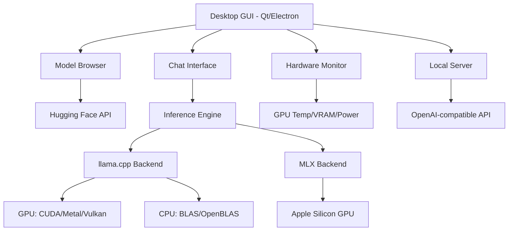

# [Jilid 1] Bab 3.2: LM Studio — Fitur Discovery dan Monitoring Hardware Terintegrasi
> **Tipe Konten:** Review Teknis — Fitur + Benchmark + Praktik
> **Target Pembaca:** Pengguna yang ingin GUI desktop all-in-one untuk eksperimen model

---

## 1. TUJUAN SUB-BAB
Setelah membaca, pembaca harus bisa:
- Menavigasi fitur discovery model LM Studio dari Hugging Face
- Menggunakan hardware monitoring (GPU/CPU/RAM) untuk profiling performa
- Mengkonfigurasi multi-model serving dan headless mode

---

## 2. KERANGKA KONTEN (WAJIB DITULIS)

### A. Ekosistem LM Studio (1 paragraf)
- Aplikasi desktop cross-platform (macOS, Windows, Linux)
- Integrated model browser + search dari Hugging Face
- Tidak memerlukan telemetry, fully offline

### B. Model Discovery & Download (1-2 paragraf)
- Searching model dari Hugging Face langsung di UI
- Filter by: quantization (GGUF, MLX), parameter count, license
- Auto-download + extract; manajemen versi model

### C. Inference Engine Dual: llama.cpp & MLX (1-2 paragraf)
- llama.cpp untuk GGUF models — GPU/CPU hybrid
- MLX untuk Apple Silicon — memanfaatkan unified memory
- User bisa memilih engine per model

### D. Hardware Monitoring & Profiling (1-2 paragraf)
- Monitoring GPU: VRAM usage, temperature, power draw
- Benchmark built-in: tokens/second, TTFT, memory peak
- GPU offload slider dari 0% hingga 100%

### E. Local Server & API (1 paragraf)
- OpenAI-compatible API endpoint
- Multi-model serving simultan
- Structured Output (JSON schema) via Outlines
- Headless mode sebagai background service

### F. Fitur Developer: CLI `lms` & SDK TypeScript (1 paragraf)
- Command-line tool `lms` untuk download, load, server
- lmstudio-js: TypeScript SDK untuk integrasi aplikasi
- Model on-demand loading

---

## 3. TABEL WAJIB

### Tabel A: Perbandingan Engine Inference LM Studio

| Fitur | llama.cpp (GGUF) | Apple MLX (Safetensors) |
|:---|:---|:---|
| **Target Hardware** | Semua (CPU/GPU/NVIDIA/AMD) | Apple Silicon M-series |
| **Format Model** | GGUF | MLX/Safetensors |
| **Quantization** | Q2–Q8, IQ1–IQ4 | FP16/FP32, MLX quant |
| **Vision Model** | LLaVA, llava-llama, DeepSeek V4 | LLaVA via mlx-vlm |
| **Kecepatan (M3 Max)** | ~80 t/s (7B) | ~95 t/s (7B) |
| **Multi-model** | Ya (GGUF + MLX campur) | Ya |

### Tabel B: Fitur Monitoring Hardware

| Metrik | LM Studio | Tool Alternatif | Akurasi |
|:---|:---|:---|:---:|
| GPU Temperature | Ada (NVIDIA/AMD/Intel) | nvidia-smi, radeontop | Real-time |
| VRAM Usage | Ada (per proses) | nvtop | ±50 MB |
| Token/s (Live) | Ada (di chat UI) | llama-bench | Real-time |
| TTFT | Ada (developer mode) | Manual curl timing | ±10 ms |
| Power Draw | Ada (NVIDIA/AMD) | nvidia-smi | Real-time |

### Tabel C: Perbandingan LM Studio vs Alternatif Desktop

| Fitur | LM Studio | Ollama | GPT4All | Text-Generation-WebUI |
|:---|:---|:---|:---|:---|
| **GUI Desktop** | Native app | CLI-only | Native app | Web UI |
| **Model Browser** | Ada (HF integrated) | CLI pull | Built-in leaderboard | Manual download |
| **Monitoring HW** | Terintegrasi | Tidak | Minimal | Extension |
| **Headless Mode** | Ada | Built-in | Tidak | Ada |
| **OpenAI API** | Ada | Ada | Ada | Ada |

---

## 4. DIAGRAM/GAMBAR WAJIB

### Diagram 1: Arsitektur Aplikasi LM Studio (Mermaid)
- **File:** `assets/diagrams/j1-b3-s2-arsitektur-lmstudio.mmd`
- **Isi:** Komponen UI → Engine Layer (llama.cpp / MLX) → Hardware Monitoring → API Server



### Gambar 2: Screenshot Hardware Monitoring Dashboard
- **File:** `assets/images/jilid1/j1-b3-s2-hw-monitor.png`
- **Isi:** Tampilan LM Studio dengan GPU temperature, VRAM usage, dan token/s yang sedang berjalan

### Gambar 3: Screenshot Model Browser
- **File:** `assets/images/jilid1/j1-b3-s2-model-browser.png`
- **Isi:** Tampilan pencarian model dengan filter quantization dan parameter count

---

## 5. TUTORIAL / HANDS-ON (WAJIB)

### Tutorial A: Setup Headless Server + Benchmark Model

```bash
# 1. Install LM Studio dan buka aplikasi
# 2. Cari model di Model Browser: "llama-3.2-3b-instruct-q4_k_m"
# 3. Download dan load model

# 4. Enable headless mode (Local LLM Service)
# Settings > Developer > Enable Local LLM Service

# 5. Gunakan CLI lms
lms list
lms load llama-3.2-3b-instruct-q4_k_m --context-length 8192

# 6. Benchmark dari terminal
python -c "
import time, requests
start = time.time()
r = requests.post('http://localhost:1234/v1/chat/completions',
    json={'model':'llama-3.2-3b','messages':[
        {'role':'user','content':'Buat cerita 500 kata'}
    ],'stream':False})
elapsed = time.time() - start
tokens = len(r.json()['choices'][0]['message']['content'].split())
print(f'Time: {elapsed:.2f}s, Tokens: {tokens}, Speed: {tokens/elapsed:.1f} t/s')
"
```

### Tutorial B: Multi-Model Serving & GPU Offload Tuning

```bash
# 1. Load 2 model berbeda secara simultan
lms load llama-3.2-3b-instruct-q4_k_m --gpu-offload 100
lms load qwen2.5-7b-instruct-q4_k_m --gpu-offload 50

# 2. Verifikasi via API
curl http://localhost:1234/v1/models

# 3. Monitoring resource
# Buka tab "Developer" > "Server Log" untuk lihat GPU allocation

# 4. JSON Structured Output
curl http://localhost:1234/v1/chat/completions \
  -d '{
    "model": "llama-3.2-3b",
    "messages": [{"role":"user","content":"Extract: Nama: Budi, Umur: 25"}],
    "response_format": {
      "type": "json_schema",
      "json_schema": {
        "name": "person",
        "schema": {
          "type": "object",
          "properties": {
            "nama": {"type": "string"},
            "umur": {"type": "integer"}
          }
        }
      }
    }
  }'
```

---

## 6. STUDI KASUS (WAJIB)

### Studi Kasus: Eksperimen Model untuk Penulis Konten
- **Profil:** Penulis konten dengan MacBook Pro M3 Pro 18GB
- **Kebutuhan:** Mencoba berbagai model (7B-14B) untuk bantu riset artikel
- **Solusi LM Studio:** Model browser untuk unduh 3 model (Mistral, Llama 3.2, Qwen 2.5, DeepSeek V4 Flash)
- **Monitoring:** Benchmark tiap model dengan GPU offload 100% → catat token/s dan VRAM
- **Hasil:** Qwen 2.5 7B Q4_K_M memberikan keseimbangan terbaik (75 t/s, 5.2GB VRAM); DeepSeek V4 Flash (13B aktif) unggul di tugas reasoning kompleks berkat arsitektur MoE
- **Kesimpulan:** LM Studio memungkinkan eksperimen cepat tanpa setup infrastruktur rumit

---

## 7. REFERENSI WAJIB (SOP: minimal 5 paper 5 tahun terakhir + DOI)

### Paper Jurnal/Konferensi

[1] **Efficient LLM Inference on CPUs**
```
@article{liao2024cpullm,
  title     = {Inference Performance Optimization for Large Language Models on {CPUs}},
  author    = {Liao, Shuai and others},
  journal   = {arXiv preprint arXiv:2407.07304},
  year      = {2024},
  doi       = {10.48550/arXiv.2407.07304},
  url       = {https://arxiv.org/abs/2407.07304}
}
```
- Kaitan: LM Studio menggunakan llama.cpp sebagai backend CPU/GPU — paper ini menjelaskan teknik optimasi KV cache dan distribusi inference yang relevan untuk performa di berbagai hardware.

[2] **NoMAD-Attention: Efficient LLM Inference on CPUs**
```
@article{zhang2024nomad,
  title     = {{NoMAD-Attention}: Efficient {LLM} Inference on {CPUs} Through Multiply-add-free Attention},
  author    = {Zhang, Tony and others},
  journal   = {arXiv preprint arXiv:2403.01273},
  year      = {2024},
  doi       = {10.48550/arXiv.2403.01273},
  url       = {https://arxiv.org/abs/2403.01273}
}
```
- Kaitan: Algoritma attention tanpa MAD untuk CPU — menjelaskan bagaimana LM Studio bisa memberikan performa baik bahkan di hardware tanpa GPU.

[3] **A Survey on Efficient Inference for Large Language Models**
```
@article{zhang2024efficientsurvey,
  title     = {A Survey on Efficient Inference for Large Language Models},
  author    = {Zhang, Zixuan and others},
  journal   = {arXiv preprint arXiv:2404.14294},
  year      = {2024},
  doi       = {10.48550/arXiv.2404.14294},
  url       = {https://arxiv.org/abs/2404.14294}
}
```
- Kaitan: Survey komprehensif teknik efisiensi inference — data-level, model-level, system-level. Relevan untuk menjelaskan posisi LM Studio dalam ekosistem optimasi.

[4] **LLM Inference Unveiled: Survey and Roofline Model Insights**
```
@article{yuan2024llmroofline,
  title     = {{LLM} Inference Unveiled: Survey and Roofline Model Insights},
  author    = {Yuan, Zhihang and others},
  journal   = {arXiv preprint arXiv:2402.16363},
  year      = {2024},
  doi       = {10.48550/arXiv.2402.16363},
  url       = {https://arxiv.org/abs/2402.16363}
}
```
- Kaitan: Roofline model untuk analisis bottleneck inference. Relevan untuk interpretasi hardware monitoring di LM Studio — pengguna bisa memahami apakah GPU-bound atau memory-bound.

[5] **FlashAttention: Fast and Memory-Efficient Exact Attention**
```
@inproceedings{dao2022flashattention,
  title     = {{FlashAttention}: Fast and Memory-Efficient Exact Attention with {IO}-Awareness},
  author    = {Dao, Tri and Fu, Daniel Y. and Ermon, Stefano and Rudra, Atri and Ré, Christopher},
  booktitle = {Advances in Neural Information Processing Systems (NeurIPS)},
  year      = {2022},
  doi       = {10.48550/arXiv.2205.14135},
  url       = {https://arxiv.org/abs/2205.14135}
}
```
- Kaitan: Fitur FlashAttention di LM Studio (toggle di settings) memungkinkan context window lebih besar. Paper ini menjelaskan mekanisme IO-aware tiling yang mendasarinya.

### Referensi Pendukung (Non-Paper)

[6] LM Studio. *Official Website & Blog*. [https://lmstudio.ai](https://lmstudio.ai)

[7] LM Studio CLI (`lms`) Documentation. [https://lmstudio.ai/docs](https://lmstudio.ai/docs)

[8] LM Studio Bench — Community Benchmark Tool. [https://github.com/Ajimaru/LM-Studio-Bench](https://github.com/Ajimaru/LM-Studio-Bench)

[9] Hugging Face Model Hub. [https://huggingface.co/models](https://huggingface.co/models)

### SOP Referensi
- WAJIB menyertakan minimal **5 paper jurnal/konferensi** dari 5 tahun terakhir (2021-2026) dengan DOI/arXiv yang valid.
- Data performa di tabel harus diverifikasi dengan benchmark komunitas.
- Paper tentang optimasi inference dan attention menjadi fondasi teoretis.

(End of sub-bab-2.md)
