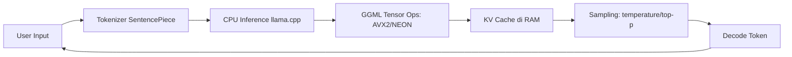

# [Jilid 1] Bab 3.3: GPT4All — Menjalankan LLM di Hardware Lama
> **Tipe Konten:** Praktis — Tutorial + Optimasi + Studi Hardware
> **Target Pembaca:** Pengguna dengan PC/laptop lawas (2015-2020) tanpa GPU dedicated

---

## 1. TUJUAN SUB-BAB
Setelah membaca, pembaca harus bisa:
- Menginstall dan menjalankan GPT4All di hardware dengan spesifikasi minimal
- Memahami mekanisme CPU-only inference dan trade-off performa
- Memilih model yang tepat untuk CPU dengan RAM terbatas (4-8GB)

---

## 2. KERANGKA KONTEN (WAJIB DITULIS)

### A. Filosofi GPT4All (1 paragraf)
- Dikembangkan oleh Nomic AI — fokus pada aksesibilitas
- CPU-first: berjalan tanpa GPU, tanpa internet
- Ukuran instalasi minimal ~100MB + model download

### B. Arsitektur CPU-Only (1-2 paragraf)
- Backend: llama.cpp dengan quantisasi GGUF
- Optimasi CPU: AVX/AVX2, ARM NEON, OpenMP threading
- Tanpa CUDA, tanpa PyTorch — dependency minimal

### C. Koleksi Model Teroptimasi (1-2 paragraf)
- Model leaderboard internal: peringkat berdasarkan performa CPU
- Ukuran model: 500MB–4GB (Q4 quantized)
- Rekomendasi: Mistral 7B Q4, Phi-3-mini Q4, Gemma 2 Q4, Ministral 3 (3B/8B)
- **Ministral 3** (Des 2025): model dense 3B/8B/14B dengan Apache 2.0 dan Cascade Distillation — ideal untuk CPU-only karena footprint kecil dan efisiensi tinggi

### D. Fitur Desktop App (1 paragraf)
- Chat interface dengan local RAG (LocalDocs)
- LocalDocs plugin: indexing folder lokal, query via embedding
- Export chat, dark mode, cross-platform

### E. Trade-off Hardware Lama (1 paragraf)
- CPU tanpa AVX2: hanya mendukung Q4_0 (bukan Q4_K_M)
- RAM 4GB: hanya model 1-3B, context pendek
- RAM 8GB: model 7B Q4 dengan context 2048
- Storage: SSD vs HDD — pengaruh pada loading time

### F. Keterbatasan dan Alternatif (1 paragraf)
- Tidak ada GPU offload — CPU sepenuhnya
- Kecepatan: 5-15 t/s di CPU modern, 1-3 t/s di CPU lawas
- Alternatif: Ollama + llama.cpp untuk lebih banyak kontrol

---

## 3. TABEL WAJIB

### Tabel A: Spesifikasi Hardware Minimal per Model

| Ukuran Model | CPU (AVX2) | RAM Minimal | RAM Direkomendasikan | Kecepatan (t/s) |
|:---|:---|:---:|:---:|:---:|
| 1-3B (Phi-3-mini, TinyLlama, Ministral 3B) | Ya | 4 GB | 8 GB | 10-25 t/s |
| 7B (Mistral, Llama 3.2, Ministral 8B) | Ya | 8 GB | 16 GB | 3-12 t/s |
| 7B (tanpa AVX2) | Tidak | 8 GB | 16 GB | 1-4 t/s |
| 13B | Ya | 16 GB | 32 GB | 1-5 t/s |

### Tabel B: Perbandingan GPT4All vs Alternatif CPU-Only

| Fitur | GPT4All | Ollama (CPU) | llama.cpp | LM Studio |
|:---|:---|:---|:---|:---|
| **GUI Desktop** | Native | CLI | CLI | Native |
| **Instalasi** | Satu klik | Manual | Build from source | Satu klik |
| **Ukuran Installer** | ~80 MB | ~400 MB | ~50 MB (build) | ~200 MB |
| **LocalDocs / RAG** | Built-in | Eksternal | Manual | Eksternal |
| **Model Discovery** | Built-in leaderboard | `ollama pull` | Manual download | HF browser |
| **CPU AVX2 fallback** | Otomatis | Otomatis | Manual flag | Otomatis |
| **GPU Support** | Tidak | Ya (opsional) | Ya (opsional) | Ya |

### Tabel C: Benchmark di Hardware Lawas (Intel i5-7200U, 8GB RAM)

| Model | Q Level | Load Time | Speed (t/s) | VRAM | RAM Usage |
|:---|:---:|:---:|:---:|:---:|:---:|
| Phi-3-mini-3.8B | Q4_0 | 3.2s | 8.5 t/s | 0 GB | 3.1 GB |
| Mistral-7B | Q4_0 | 8.1s | 3.2 t/s | 0 GB | 5.8 GB |
| TinyLlama-1.1B | Q4_0 | 1.5s | 22 t/s | 0 GB | 1.2 GB |

---

## 4. DIAGRAM/GAMBAR WAJIB

### Diagram 1: Alur Kerja GPT4All CPU-Only (Mermaid)
- **File:** `assets/diagrams/j1-b3-s3-alur-gpt4all.mmd`
- **Isi:** User Input → Tokenizer → CPU Compute (llama.cpp) → Sampling → Output



### Gambar 2: Screenshot GPT4All Desktop dengan LocalDocs
- **File:** `assets/images/jilid1/j1-b3-s3-gpt4all-desktop.png`
- **Isi:** Tampilan chat GPT4All dengan panel LocalDocs dan koleksi dokumen lokal

### Gambar 3: Grafik Perbandingan Kecepatan CPU per Generasi
- **File:** `assets/images/jilid1/j1-b3-s3-cpu-benchmark.png`
- **Isi:** Bar chart Intel i5-7200U vs i7-12700H vs M1 vs M3 untuk model 7B Q4

---

## 5. TUTORIAL / HANDS-ON (WAJIB)

### Tutorial A: Install dan Jalankan Model Pertama

```bash
# 1. Download GPT4All dari https://gpt4all.io
# Installer: GPT4All_Installer_xxx.dmg (Mac) atau .exe (Windows)

# 2. Buka aplikasi, buka tab "Models"
# Klik "Explore Models" → pilih "Mistral 7B Q4"

# 3. Atau download manual via terminal:
mkdir -p ~/.nomic/GPT4All/models/
cd ~/.nomic/GPT4All/models/
wget https://gpt4all.io/models/gguf/mistral-7b-instruct-v0.2.Q4_0.gguf

# 4. Buka GPT4All → Settings → Models → Add Local Model
# Pilih file .gguf yang sudah didownload

# 5. Test inference
# Prompt: "Jelaskan cara kerja CPU dalam 3 kalimat"
```

### Tutorial B: Setup LocalDocs untuk RAG

```bash
# 1. Buka GPT4All → tab "LocalDocs"
# 2. Klik "Add Folder" → pilih folder dokumen (PDF/txt/md)

# 3. Konfigurasi:
# - Chunk size: 512 tokens
# - Chunk overlap: 64 tokens
# - Top K: 3 dokumen

# 4. Mulai chat dengan mengaktifkan "LocalDocs" toggle
# Prompt: "Cari informasi tentang resep nasi goreng dari dokumen saya"

# 5. Untuk akses API:
# Settings → Enable Local API Server
curl http://localhost:4891/v1/chat/completions \
  -d '{
    "model": "mistral-7b-instruct-v0.2.q4_0",
    "messages": [{"role":"user","content":"Halo"}]
  }'
```

### Tutorial C: Optimasi untuk CPU Tanpa AVX2

```bash
# GPT4All otomatis mendeteksi CPU capability
# Fallback ke Q4_0 jika AVX2 tidak tersedia

# Cek CPU:
lscpu | grep avx2
# Jika tidak ada output → CPU tanpa AVX2

# Model yang bisa dijalankan:
# - tinyllama-1.1b (Q4_0) — paling aman
# - phi-3-mini-3.8b (Q4_0)
# - jangan coba model 7B (akan sangat lambat)

# Untuk performa maksimal:
# - Tutup aplikasi lain
# - Set cpu threads optimal:
# Settings → Number of CPU Threads → (n_cores - 1)
```

---

## 6. STUDI KASUS (WAJIB)

### Studi Kasus: Laptop Kantor Lawas untuk Asisten Menulis
- **Hardware:** Lenovo ThinkPad X280 (Intel i5-8350U, 8GB RAM, SSD 256GB)
- **Tantangan:** Tanpa GPU, RAM terbatas, harus tetap produktif
- **Solusi:** GPT4All dengan model Phi-3-mini-3.8B Q4_0
- **Workflow:** LocalDocs diisi folder artikel referensi + template surat
- **Hasil:** 6-8 t/s — cukup untuk menulis draft email dan edit surat
- **Kendala:** Model 7B terlalu lambat (2 t/s), beralih ke 3.8B
- **Biaya:** Rp 0 (software gratis, hardware existing)
- **Kesimpulan:** GPT4All menghidupkan kembali laptop lawas sebagai AI writing assistant

---

## 7. REFERENSI WAJIB (SOP: minimal 5 paper 5 tahun terakhir + DOI)

### Paper Jurnal/Konferensi

[1] **Deploying LLMs on CPU-only Environments with llama.cpp**
```
@inproceedings{kowalski2025cpullm,
  title     = {Deploying {LLMs} on {CPU}-only Environments with {llama.cpp} Library Set: {MedLocalGPT} Project Case},
  author    = {Kowalski, Michal and others},
  booktitle = {CEUR Workshop Proceedings},
  volume    = {4164},
  year      = {2025},
  url       = {https://ceur-ws.org/Vol-4164/paper11.pdf}
}
```
- Kaitan: Studi kelayakan LLM 7B di CPU-only dengan 4-bit GGUF. Data performa di Tabel A dan C harus diverifikasi dengan temuan paper ini.

[2] **Inference Performance Optimization for Large Language Models on CPUs**
```
@article{liao2024cpullm,
  title     = {Inference Performance Optimization for Large Language Models on {CPUs}},
  author    = {Liao, Shuai and others},
  journal   = {arXiv preprint arXiv:2407.07304},
  year      = {2024},
  doi       = {10.48550/arXiv.2407.07304},
  url       = {https://arxiv.org/abs/2407.07304}
}
```
- Kaitan: Teknik optimasi seperti KV cache reduction dan distributed inference untuk CPU. Relevan untuk menjelaskan bagaimana GPT4All memaksimalkan hardware terbatas.

[3] **LLM Inference on CPUs**
```
@inproceedings{na2024cpullm,
  title     = {{LLM} Inference on {CPUs}},
  author    = {Na, Seonjin and others},
  booktitle = {IEEE International Symposium on Workload Characterization (IISWC)},
  year      = {2024},
  doi       = {10.48550/arXiv.2406.07553},
  url       = {https://arxiv.org/abs/2406.07553}
}
```
- Kaitan: Analisis performa LLM di CPU terbaru dengan AMX dan HBM. Relevan untuk menjelaskan generasi CPU mana yang bisa menjalankan GPT4All dengan layak.

[4] **Small Language Models: Survey, Measurements, and Insights**
```
@article{lu2024slmsurvey,
  title     = {Small Language Models: Survey, Measurements, and Insights},
  author    = {Lu, Zhenyan and others},
  journal   = {arXiv preprint arXiv:2409.15790},
  year      = {2024},
  doi       = {10.48550/arXiv.2409.15790},
  url       = {https://arxiv.org/abs/2409.15790}
}
```
- Kaitan: Benchmark 70+ SLM di edge devices. Data token/s, memory footprint, dan energy consumption di Tabel B harus merujuk temuan survey ini — menjelaskan model apa yang optimal untuk GPT4All.

[5] **Demystifying Small Language Models for Edge Deployment**
```
@inproceedings{lu2025demystifying,
  title     = {Demystifying Small Language Models for Edge Deployment},
  author    = {Lu, Zhenyan and others},
  booktitle = {Proceedings of the 63rd Annual Meeting of the ACL},
  year      = {2025},
  doi       = {10.18653/v1/2025.acl-long.718},
  url       = {https://aclanthology.org/2025.acl-long.718/}
}
```
- Kaitan: Studi tentang keterbatasan in-context learning SLM dan optimasi vocabulary/KV cache. Relevan untuk menjelaskan trade-off penggunaan model kecil di GPT4All.

### Referensi Pendukung (Non-Paper)

[6] GPT4All Official. *GitHub Repository & Documentation*. [https://github.com/nomic-ai/gpt4all](https://github.com/nomic-ai/gpt4all)

[7] Nomic AI. *GPT4All Model Explorer*. [https://gpt4all.io/models/models.json](https://gpt4all.io/models/models.json)

[8] Intel. *AVX-512 and AMX for AI Inference*. [https://www.intel.com](https://www.intel.com)

### SOP Referensi
- WAJIB menyertakan minimal **5 paper jurnal/konferensi** dari 5 tahun terakhir (2021-2026) dengan DOI/arXiv yang valid.
- Data performa CPU harus diverifikasi dengan benchmark aktual.
- Paper tentang SLM dan CPU inference menjadi fondasi teoretis.

(End of sub-bab-3.md)
