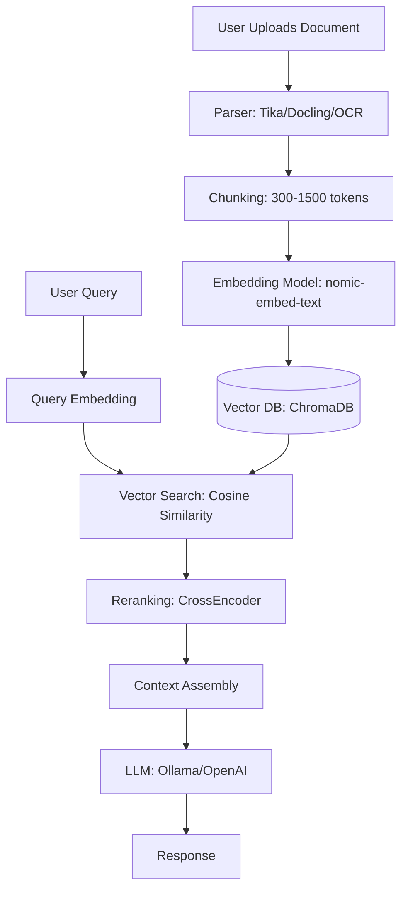

# [Jilid 1] Bab 3.4: Open WebUI — Setup Docker, Integrasi RAG, Fungsi Tools
> **Tipe Konten:** Praktis — Deployment + Konfigurasi + Fitur Lanjutan
> **Target Pembaca:** Pengguna yang ingin frontend all-in-one untuk LLM lokal

---

## 1. TUJUAN SUB-BAB
Setelah membaca, pembaca harus bisa:
- Deploy Open WebUI dengan Docker (Ollama bundling)
- Konfigurasi RAG pipeline dengan embedding lokal dan vektordb
- Membuat dan menggunakan Tools (function calling + Python execution)

---

## 2. KERANGKA KONTEN (WAJIB DITULIS)

### A. Arsitektur Open WebUI (1-2 paragraf)
- Backend Python (FastAPI) + Frontend Svelte
- Support multi-engine: Ollama, OpenAI-compatible API, vLLM
- Database: SQLite (default), bisa PostgreSQL

### B. Setup Docker (1-2 paragraf)
- Image: `ghcr.io/open-webui/open-webui:main` (standalone)
- Image bundling: `:ollama` (dengan Ollama internal), `:cuda` (GPU)
- Volume mount: `/app/backend/data` untuk persistensi
- GPU passthrough: `--gpus=all`

### C. RAG Pipeline (2-3 paragraf)
- Document loading: PDF, DOCX, TXT, MD, HTML
- Chunking: configurable chunk size + overlap
- Embedding: Ollama (nomic-embed-text), OpenAI, atau lokal (sentence-transformers)
- Vector DB: ChromaDB (default), PGVector, Qdrant, Milvus, dll. (9 opsi)
- Hybrid search: BM25 + embedding + CrossEncoder reranking
- Filesystem-style access: ENABLE_KB_EXEC (ls, grep, cat via tools)

### D. Tools / Function Calling (1-2 paragraf)
- Builtin tools: query_knowledge_bases, search_chats, web_search
- Custom tools: Python function yang dieksekusi di sandbox
- Native function calling vs default mode
- MCP (Model Context Protocol) tools support

### E. Advanced Features (1 paragraf)
- Multi-user dengan role (admin, user, pending)
- Web search integration (15+ search providers)
- Image generation integration (DALL-E, Stable Diffusion, Flux)
- Model management: switch model mid-chat, model weight adjustment

### F. Security & Performance (1 paragraf)
- RBAC: admin panel, user management, API key management
- Rate limiting, request logging
- Reverse proxy setup (Caddy, Nginx) untuk HTTPS

---

## 3. TABEL WAJIB

### Tabel A: Opsi Deployment Open WebUI

| Metode | Perintah | GPU Support | Cocok Untuk |
|:---|:---|:---:|:---|
| **Docker Standalone** | `docker run ghcr.io/open-webui/open-webui:main` | Via host | Pengguna dengan Ollama terpisah |
| **Docker + Ollama** | `docker run ghcr.io/open-webui/open-webui:ollama` | --gpus=all | Setup all-in-one termudah |
| **Docker + CUDA** | `docker run ghcr.io/open-webui/open-webui:cuda` | CUDA native | NVIDIA GPU users |
| **Docker Compose** | `docker compose up` | Ya | Production deployment |
| **Kubernetes** | Helm chart / kubectl | Ya | Enterprise scale |
| **Native (pip)** | `pip install open-webui` | Ya | Development |

### Tabel B: Perbandingan Vector Database Support

| Vector DB | Tipe | Open Source | Skalabilitas | Kecepatan Query |
|:---|:---|:---:|:---:|:---:|
| **ChromaDB** | Embedded | Ya | Kecil (<10K docs) | Cepat |
| **PGVector** | PostgreSQL extension | Ya | Sedang (10K-1M) | Sedang |
| **Qdrant** | Standalone | Ya | Besar (1M+) | Cepat |
| **Milvus** | Distributed | Ya | Sangat Besar (10M+) | Sangat cepat |
| **Elasticsearch** | Enterprise | Yes/No | Besar | Sedang |

### Tabel C: Perbandingan Frontend LLM

| Fitur | Open WebUI | Text-Gen-WebUI | GPT4All | Ollama Web UI |
|:---|:---|:---|:---|:---|
| **Docker Support** | Ya | Ya | Tidak | Ya |
| **RAG Built-in** | Ya (full pipeline) | Extension | LocalDocs | Tidak |
| **Tools/Functions** | Ya | Tidak | Tidak | Tidak |
| **Multi-User** | Ya (RBAC) | Tidak | Tidak | Tidak |
| **Web Search** | 15+ providers | Manual | Tidak | Tidak |
| **Multi-Model** | Ya | Ya | Terbatas | Ya |

---

## 4. DIAGRAM/GAMBAR WAJIB

### Diagram 1: Arsitektur Open WebUI RAG Pipeline (Mermaid)
- **File:** `assets/diagrams/j1-b3-s4-rag-pipeline.mmd`
- **Isi:** User Query → Embedding → Vector DB Search → Context Retrieval → LLM → Response



### Gambar 2: Screenshot Admin Panel — Tools Configuration
- **File:** `assets/images/jilid1/j1-b3-s4-tools-panel.png`
- **Isi:** Tampilan Admin Panel dengan daftar Builtin Tools dan Custom Tools

### Gambar 3: Screenshot RAG Document Library
- **File:** `assets/images/jilid1/j1-b3-s4-rag-library.png`
- **Isi:** Knowledge Base page dengan koleksi dokumen, status indexing, dan pencarian

---

## 5. TUTORIAL / HANDS-ON (WAJIB)

### Tutorial A: Docker Deployment + RAG Setup

```bash
# 1. Deploy Open WebUI dengan Ollama bundling
docker run -d -p 3000:8080 \
  --gpus=all \
  -v ollama:/root/.ollama \
  -v open-webui:/app/backend/data \
  --name open-webui \
  --restart always \
  ghcr.io/open-webui/open-webui:ollama

# 2. Pull model inference dan embedding
docker exec -it open-webui ollama pull deepseek-v4-flash
docker exec -it open-webui ollama pull llama3.1:8b
docker exec -it open-webui ollama pull nomic-embed-text

# 3. Buka http://localhost:3000
# Register akun admin pertama

# 4. Konfigurasi RAG:
# Admin Panel > Settings > Documents
# - Chunk Size: 1000 tokens
# - Chunk Overlap: 200 tokens
# - Embedding Model: nomic-embed-text (via Ollama)
# - Vector DB: ChromaDB (default)
# - Top K: 5

# 5. Upload dokumen ke Knowledge Base
# Workspace > Knowledge > Create Knowledge
# Upload file PDF tentang topik tertentu

# 6. Test RAG dengan prompt yang merujuk ke knowledge base
```

### Tutorial B: Custom Tool — Kalkulator Python

```python
# Di Open WebUI: Workspace > Tools > Create Tool
# Nama: kalkulator_dasar

"""
Title: Kalkulator Dasar
Description: Kalkulator untuk operasi aritmatika sederhana
"""
import json

def kalkulator(ekspresi: str) -> str:
    """
    Hitung ekspresi matematika sederhana.

    Parameters:
    ekspresi (str): Ekspresi matematika, contoh: "2 + 3 * 4"

    Returns:
    str: Hasil perhitungan dalam format JSON
    """
    try:
        # Filter hanya karakter yang aman
        aman = all(c in "0123456789+-*/(). " for c in ekspresi)
        if not aman:
            return json.dumps({"error": "Ekspresi mengandung karakter tidak aman"})

        hasil = eval(ekspresi)
        return json.dumps({"ekspresi": ekspresi, "hasil": hasil})
    except ZeroDivisionError:
        return json.dumps({"error": "Pembagian dengan nol"})
    except Exception as e:
        return json.dumps({"error": str(e)})
```

```bash
# Aktifkan tool di chat dengan mengetik "@kalkulator_dasar"
# Atau model akan memanggil tool secara otomatis jika relevan
```

### Tutorial C: Web Search RAG Integration

```bash
# 1. Admin Panel > Settings > Web Search
# Pilih search provider (contoh: SearXNG self-hosted atau Brave)

# 2. Integrasi dengan Docker:
# Tambahkan environment variable saat run
docker run -d -p 3000:8080 \
  --gpus=all \
  -v open-webui:/app/backend/data \
  -e WEB_SEARCH_PROVIDER=brave \
  -e BRAVE_SEARCH_API_KEY=your_api_key \
  --name open-webui \
  ghcr.io/open-webui/open-webui:ollama

# 3. Test: tanya pertanyaan yang butuh data real-time
# "Berita terbaru AI tahun 2026"
# Model akan: web search → retrieve → summarize
```

---

## 6. STUDI KASUS (WAJIB)

### Studi Kasus: Perpustakaan Digital SMK dengan Open WebUI
- **Profil:** SMK dengan 500 siswa, punya server lokal (Xeon E5, 64GB RAM, RTX 3060 12GB)
- **Kebutuhan:** Siswa bisa bertanya tentang materi pelajaran dari buku digital
- **Solusi:** Open WebUI + Ollama (DeepSeek V4 Flash + Qwen2.5-14B Q4_K_M) + ChromaDB
- **RAG Knowledge Base:** 200+ buku pelajaran (PDF) di-chunk dan di-embed
- **Tools:** Kalkulator, code runner (Python untuk pelajaran coding)
- **Multi-User:** 10 guru sebagai admin, 500 siswa sebagai user terbatas
- **Hasil:** DeepSeek V4 Flash memberikan respons lebih cepat untuk tugas ringan; Qwen 2.5-14B untuk tugas berat
- **Biaya:** Rp 0 (software), hardware existing

---

## 7. REFERENSI WAJIB (SOP: minimal 5 paper 5 tahun terakhir + DOI)

### Paper Jurnal/Konferensi

[1] **Open WebUI: An Open, Extensible, and Usable Interface for AI Interaction**
```
@article{openwebui2025,
  title     = {{Open WebUI}: An Open, Extensible, and Usable Interface for {AI} Interaction},
  author    = {The Open WebUI Team},
  journal   = {arXiv preprint arXiv:2510.02546},
  year      = {2025},
  doi       = {10.48550/arXiv.2510.02546},
  url       = {https://arxiv.org/abs/2510.02546}
}
```
- Kaitan: Paper utama Open WebUI — menjelaskan desain, usability testing, dan arsitektur. Gunakan sebagai referensi utama di seluruh sub-bab.

[2] **Retrieval Augmented Generation (RAG): A Survey**
```
@article{gao2024ragsurvey,
  title     = {Retrieval-Augmented Generation for Large Language Models: A Survey},
  author    = {Gao, Yunfan and others},
  journal   = {arXiv preprint arXiv:2312.10997},
  year      = {2024},
  doi       = {10.48550/arXiv.2312.10997},
  url       = {https://arxiv.org/abs/2312.10997}
}
```
- Kaitan: Survey komprehensif RAG — teknik indexing, retrieval, generation. Relevan untuk menjelaskan fondasi RAG pipeline di sub-bab 2.C.

[3] **APIServe: Efficient API Support for LLM Inferencing**
```
@article{fu2024apiserve,
  title     = {{APIServe}: Efficient {API} Support for Large-Language Model Inferencing},
  author    = {Fu, Yichao and others},
  journal   = {arXiv preprint arXiv:2402.01869},
  year      = {2024},
  doi       = {10.48550/arXiv.2402.01869},
  url       = {https://arxiv.org/abs/2402.01869}
}
```
- Kaitan: Framework inferensi untuk API-augmented LLM — relevan untuk fitur Tools/function calling di Open WebUI (sub-bab 2.D).

[4] **ScaleLLM: A Resource-Frugal LLM Serving Framework**
```
@inproceedings{wang2024scalellm,
  title     = {{ScaleLLM}: A Resource-Frugal {LLM} Serving Framework by Optimizing End-to-End Efficiency},
  author    = {Wang, Lei and others},
  booktitle = {Proceedings of EMNLP Industry Track},
  year      = {2024},
  doi       = {10.18653/v1/2024.emnlp-industry.22},
  url       = {https://aclanthology.org/2024.emnlp-industry.22/}
}
```
- Kaitan: Sistem serving dengan API gateway dan load balancing. Relevan untuk deployment Open WebUI multi-user di sub-bab 2.E.

[5] **ServerlessLLM: Low-Latency Serverless Inference for LLMs**
```
@inproceedings{fu2024serverlessllm,
  title     = {{ServerlessLLM}: Low-Latency Serverless Inference for Large Language Models},
  author    = {Fu, Yao and others},
  booktitle = {USENIX OSDI},
  year      = {2024},
  url       = {https://www.usenix.org/system/files/osdi24-fu.pdf}
}
```
- Kaitan: Sistem serverless dengan checkpoint management. Relevan untuk menjelaskan strategi deployment Docker Open WebUI di sub-bab 2.B.

### Referensi Pendukung (Non-Paper)

[6] Open WebUI Official. *GitHub Repository*. [https://github.com/open-webui/open-webui](https://github.com/open-webui/open-webui)

[7] Open WebUI Documentation. [https://docs.openwebui.com](https://docs.openwebui.com)

[8] ChromaDB Documentation. [https://www.trychroma.com](https://www.trychroma.com)

[9] Docker Documentation. [https://docs.docker.com](https://docs.docker.com)

[10] MCP (Model Context Protocol) Specification. [https://modelcontextprotocol.io](https://modelcontextprotocol.io)

### SOP Referensi
- WAJIB menyertakan minimal **5 paper jurnal/konferensi** dari 5 tahun terakhir (2021-2026) dengan DOI/arXiv yang valid.
- Paper tentang RAG, API serving, dan serverless inference menjadi fondasi teoretis.

(End of sub-bab-4.md)
