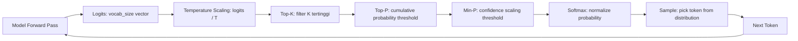

# [Jilid 1] Bab 3.5: Text-Generation-WebUI — Bedah Parameter Sampling
> **Tipe Konten:** Teknis — Teori Sampling + Praktik + Eksperimen
> **Target Pembaca:** Pengguna yang ingin memahami dan mengontrol perilaku output LLM

---

## 1. TUJUAN SUB-BAB
Setelah membaca, pembaca harus bisa:
- Menjelaskan perbedaan Temperature, Top-K, Top-P, Min-P, Repetition Penalty
- Menentukan kombinasi parameter optimal untuk berbagai use case
- Menggunakan Text-Generation-WebUI (oobabooga) untuk eksperimen sampling

---

## 2. KERANGKA KONTEN (WAJIB DITULIS)

### A. Mengapa Sampling Penting? (1 paragraf)
- Decoding strategy menentukan kualitas output sama pentingnya dengan model
- Greedy decoding → repetitif, membosankan
- Sampling yang tepat → kreatif, koheren, sesuai konteks

### B. Temperature (1-2 paragraf)
- Definisi: scaling logits sebelum softmax
- T rendah (0.1-0.5): deterministik, konservatif
- T sedang (0.7-1.0): seimbang, default
- T tinggi (1.2-2.0): kreatif, riskan incoherent
- Rumus: $P_i = \frac{e^{l_i/T}}{\sum_j e^{l_j/T}}$

### C. Top-K Sampling (1 paragraf)
- Pilih K token dengan probabilitas tertinggi, buang sisanya
- K kecil (10-40): lebih fokus, kurang variasi
- K besar (100+): lebih variasi, riskan token tidak relevan

### D. Top-P / Nucleus Sampling (1-2 paragraf)
- Pilih token hingga cumulative probability mencapai P
- P rendah (0.8-0.9): lebih ketat, lebih koheren
- P tinggi (0.95-0.99): lebih longgar, lebih variatif
- Lebih adaptif daripada Top-K karena menyesuaikan konteks

### E. Min-P Sampling (1-2 paragraf)
- Metode baru (Nguyen et al., ICLR 2025): scaling threshold berdasarkan top token
- Min-P = top_probability × p — adaptif terhadap confidence model
- Unggul di temperature tinggi: kreatif tanpa incoherent
- Parameter tunggal yang intuitif

### F. Parameter Lain (1 paragraf)
- Repetition Penalty: kurangi probabilitas token yang sudah muncul (1.0-1.2)
- Frequency Penalty: penalize token berdasarkan frekuensi
- Presence Penalty: penalize token yang sudah muncul (tanpa hitung frekuensi)
- Typical-P: sampling berdasarkan entropy
- Mirostat: auto-adjust temperature untuk target perplexity

### G. Implementasi di Text-Generation-WebUI (1 paragraf)
- Tab "Parameters": slider interaktif untuk setiap parameter
- "Truncate the prompt up to this length": context window
- "Seed": reproducibility untuk debugging
- "Character" tab: persona-based preset
- **GPT-5.5 Reasoning Effort:** Model terbaru seperti GPT-5.5 (Apr 2026) mendukung parameter `reasoning_effort` (low/medium/high/xhigh) yang mengontrol seberapa lama model "berpikir" sebelum menjawab — setara dengan mengatur depth CoT secara dinamis. Parameter ini bisa diatur via API OpenAI-compatible dengan nilai `low` untuk tugas cepat dan `xhigh` untuk masalah kompleks.

---

## 3. TABEL WAJIB

### Tabel A: Efek Parameter Sampling terhadap Output

| Parameter | Rentang | Efek Low | Efek Medium | Efek High |
|:---|:---:|:---|:---|:---|
| **Temperature** | 0.0–2.0 | Deterministik, repetitif | Seimbang (default 0.7) | Kreatif, riskan incoherent |
| **Top-K** | 1–200 | Fokus sempit | Seimbang (40) | Variasi tinggi |
| **Top-P** | 0.5–1.0 | Konservatif (0.8) | Default (0.9) | Longgar (0.99) |
| **Min-P** | 0.0–1.0 | Deterministik | Default (0.05-0.1) | Kreatif (0.2) |
| **Repetition Penalty** | 1.0–2.0 | Normal (1.0) | Sedang (1.1) | Agresif (1.2+) |

### Tabel B: Preset Parameter per Use Case

| Use Case | Temp | Top-P | Top-K | Min-P | Rep. Penalty | Seed |
|:---|:---:|:---:|:---:|:---:|:---:|:---:|
| **Coding / Reasoning** | 0.2 | 0.9 | 40 | 0.05 | 1.0 | 42 |
| **Creative Writing** | 0.9 | 0.95 | 60 | 0.1 | 1.1 | -1 |
| **Chat / Conversational** | 0.7 | 0.9 | 40 | 0.05 | 1.05 | -1 |
| **Roleplay** | 1.0 | 0.98 | 80 | 0.15 | 1.15 | -1 |
| **Factual Q&A** | 0.1 | 0.85 | 20 | 0.02 | 1.0 | 123 |
| **Translation** | 0.3 | 0.9 | 30 | 0.05 | 1.0 | 42 |

### Tabel C: Perbandingan Metode Sampling

| Metode | Adaptif | Parameter Tunggal | Performa di High Temp | Koherensi vs Kreativitas |
|:---|:---:|:---:|:---:|:---:|
| **Greedy** | Tidak | - | Buruk | 100% koheren, 0% kreatif |
| **Temperature** | Tidak | Ya | Buruk | Bergantung T |
| **Top-K** | Tidak | Ya | Buruk | Seimbang (dengan tuning) |
| **Top-P (Nucleus)** | Ya | Ya | Cukup | Baik |
| **Min-P** | Ya | Ya | **Sangat Baik** | **Terbaik** |
| **Mirostat** | Ya | Ya | Baik | Auto-tune |

---

## 4. DIAGRAM/GAMBAR WAJIB

### Diagram 1: Proses Decoding Step-by-Step (Mermaid)
- **File:** `assets/diagrams/j1-b3-s5-decoding-pipeline.mmd`
- **Isi:** Logits → Temperature Scaling → Top-K/Top-P Truncation → Min-P → Softmax → Sample → Token



### Gambar 2: Visualisasi Efek Temperature pada Distribusi
- **File:** `assets/images/jilid1/j1-b3-s5-temperature-distribution.png`
- **Isi:** 3 plot distribusi probabilitas — T=0.5 (tajam), T=1.0 (normal), T=2.0 (flat)

### Gambar 3: Screenshot Text-Generation-WebUI Parameter Panel
- **File:** `assets/images/jilid1/j1-b3-s5-tgwebui-params.png`
- **Isi:** Tampilan tab Parameters dengan semua slider dan input

---

## 5. TUTORIAL / HANDS-ON (WAJIB)

### Tutorial A: Eksperimen Parameter dengan Text-Generation-WebUI

```bash
# 1. Install Text-Generation-WebUI
git clone https://github.com/oobabooga/text-generation-webui
cd text-generation-webui
# Jalankan start_linux.sh / start_mac.sh / start_windows.bat

# 2. Load model (contoh: Llama 3.1 8B)
# Buka http://localhost:7860
# Model tab → Download model: "bartowski/Meta-Llama-3.1-8B-Instruct-GGUF"
# Pilih quantization: Q4_K_M → Load

# 3. Buka tab "Parameters" → set:
# - Temperature: 0.2 (deterministic)
# Prompt: "Tulis puisi tentang AI"

# 4. Ubah Temperature: 1.2
# Prompt yang sama → bandingkan hasil

# 5. Tambahkan Min-P sampling:
# Enable Min-P → set 0.1
# Temperature tetap 1.2 → lihat perbedaan koherensi
```

### Tutorial B: Script Python untuk Benchmark Sampling

```python
import requests
import json

BASE = "http://localhost:7860/api/v1"
PROMPT = "Lanjutkan cerita: Di tengah hutan rimba,"

configs = [
    {"name": "Greedy", "temperature": 0.01, "top_p": 1.0, "top_k": 1},
    {"name": "Creative", "temperature": 1.2, "top_p": 0.95, "top_k": 60},
    {"name": "MinP", "temperature": 1.2, "top_p": 0.95, "min_p": 0.1, "top_k": 0},
    {"name": "Balanced", "temperature": 0.7, "top_p": 0.9, "top_k": 40},
]

for cfg in configs:
    payload = {
        "prompt": PROMPT,
        "max_new_tokens": 100,
        "do_sample": True,
        **cfg
    }
    r = requests.post(f"{BASE}/generate", json=payload)
    text = r.json()["results"][0]["text"]
    print(f"\n=== {cfg['name']} ===")
    print(text[:200])
```

### Tutorial C: Menemukan Preset Optimal via Eksperimen

```python
# Script untuk auto-evaluasi parameter
import itertools

params = {
    "temperature": [0.3, 0.7, 1.0, 1.5],
    "top_p": [0.8, 0.9, 0.95],
    "repetition_penalty": [1.0, 1.1, 1.2],
}

best_score = 0
best_combo = None

for temp, top_p, rep in itertools.product(*params.values()):
    # Kirim prompt test, evaluasi secara manual
    # atau menggunakan metric otomatis seperti perplexity
    print(f"Testing: T={temp}, P={top_p}, RP={rep}")
    # ... logic evaluasi ...
```

---

## 6. STUDI KASUS (WAJIB)

### Studi Kasus: Parameter Tuning untuk Novel Writing
- **Penulis:** Ingin AI bantu menulis novel fantasi 50.000 kata
- **Masalah:** Output AI terlalu kaku (formulaik) atau terlalu acak (incoherent)
- **Eksperimen dengan Text-Generation-WebUI:**
  - Default (T=0.7, P=0.9): terlalu umum, kurang emosi
  - Creative (T=1.2, P=0.98, Top-K=80): terlalu liar, plot meloncat
  - **Min-P (T=1.0, Min-P=0.1):** paling seimbang — kreatif tapi koheren
- **Tambahan:** Repetition Penalty 1.15 untuk hindari pengulangan frase
- **Hasil:** 1200 kata per jam dengan kualitas setara draft penulis
- **Kesimpulan:** Min-P sampling adalah game-changer untuk creative writing

---

## 7. REFERENSI WAJIB (SOP: minimal 5 paper 5 tahun terakhir + DOI)

### Paper Jurnal/Konferensi

[1] **Min-P Sampling — Dynamic Truncation for LLM Text Generation**
```
@inproceedings{nguyen2025minp,
  title     = {Turning Up the Heat: Min-{p} Sampling for Creative and Coherent {LLM} Outputs},
  author    = {Nguyen, Nhat Minh and Baker, Andrew and Neo, Clement and Roush, Allen G. and Kirsch, Andreas and Shwartz-Ziv, Ravid},
  booktitle = {International Conference on Learning Representations (ICLR)},
  year      = {2025},
  doi       = {10.48550/arXiv.2407.01082},
  url       = {https://arxiv.org/abs/2407.01082}
}
```
- Kaitan: Paper utama Min-P sampling — metode truncasi dinamis yang diadopsi oleh TGW, vLLM, dan Hugging Face. Wajib disitasi di sub-bab 2.E.

[2] **Nucleus Sampling: The Curious Case of Neural Text Degeneration**
```
@inproceedings{holtzman2020nucleus,
  title     = {The Curious Case of Neural Text Degeneration},
  author    = {Holtzman, Ari and Buys, Jan and Du, Li and Forbes, Maxwell and Choi, Yejin},
  booktitle = {International Conference on Learning Representations (ICLR)},
  year      = {2020},
  doi       = {10.48550/arXiv.1904.09751},
  url       = {https://arxiv.org/abs/1904.09751}
}
```
- Kaitan: Paper foundational Nucleus Sampling (Top-P). Menjelaskan mengapa truncation diperlukan. Relevan untuk sub-bab 2.D.

[3] **Contrastive Decoding: Open-ended Text Generation as Optimization**
```
@inproceedings{li2023contrastive,
  title     = {Contrastive Decoding: Open-ended Text Generation as Optimization},
  author    = {Li, Xiang Lisa and others},
  booktitle = {Proceedings of the 61st Annual Meeting of the ACL},
  year      = {2023},
  doi       = {10.18653/v1/2023.acl-long.687},
  url       = {https://aclanthology.org/2023.acl-long.687/}
}
```
- Kaitan: Metode decoding yang membandingkan expert vs amateur model. Relevan untuk menjelaskan alternatif selain truncation sampling di sub-bab 2.F.

[4] **Speculative Decoding via Temperature-Centric Investigation**
```
@inproceedings{chang2024speculative,
  title     = {Temperature-Centric Investigation of Speculative Decoding},
  author    = {Chang, Kai and others},
  booktitle = {Proceedings of EMNLP Findings},
  year      = {2024},
  doi       = {10.18653/v1/2024.findings-emnlp.767},
  url       = {https://aclanthology.org/2024.findings-emnlp.767/}
}
```
- Kaitan: Analisis mendalam efek temperature pada speculative decoding. Relevan untuk sub-bab 2.B — bagaimana temperature memengaruhi distribusi token.

[5] **Fast Inference from Transformers via Speculative Decoding**
```
@inproceedings{leviathan2023speculative,
  title     = {Fast Inference from Transformers via Speculative Decoding},
  author    = {Leviathan, Yaniv and Kalman, Matan and Matias, Yossi},
  booktitle = {Proceedings of the 40th International Conference on Machine Learning (ICML)},
  year      = {2023},
  url       = {https://proceedings.mlr.press/v202/leviathan23a.html}
}
```
- Kaitan: Metode percepatan decoding menggunakan draft model — menunjukkan trade-off parameter sampling di lingkungan produksi.

### Referensi Pendukung (Non-Paper)

[6] Text-Generation-WebUI. *GitHub Repository*. [https://github.com/oobabooga/text-generation-webui](https://github.com/oobabooga/text-generation-webui)

[7] Hugging Face Transformers. *Generation Configuration*. [https://huggingface.co/docs/transformers/generation_strategies](https://huggingface.co/docs/transformers/generation_strategies)

[8] Min-P Sampling. *Implementasi di vLLM & HF*. [https://github.com/huggingface/transformers/pull/32663](https://github.com/huggingface/transformers/pull/32663)

### SOP Referensi
- WAJIB menyertakan minimal **5 paper jurnal/konferensi** dari 5 tahun terakhir (2021-2026) dengan DOI/arXiv yang valid.
- Data tabel parameter harus diverifikasi dengan pengujian langsung.
- Paper tentang decoding strategy menjadi fondasi teoretis.

(End of sub-bab-5.md)
