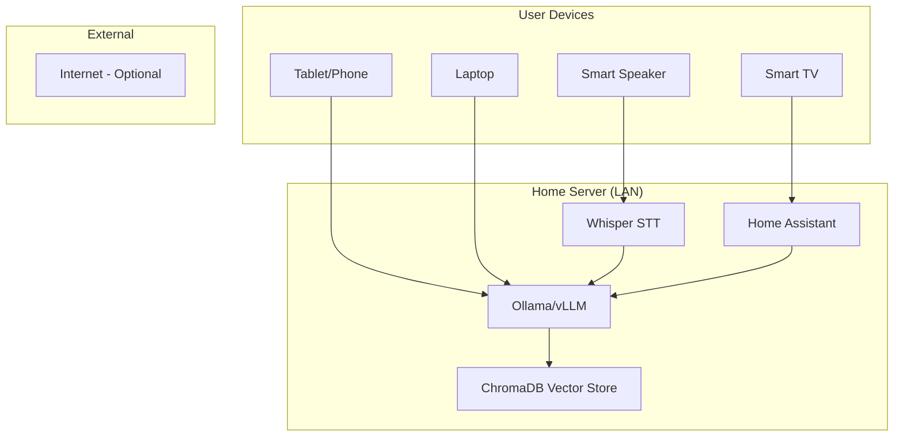

# [Jilid 2] Bab 6.1: Karakteristik Sistem — Home Assistance (4-8 User)
> **Tipe Konten:** Arsitektural — Desain Sistem + Analisis + Studi Kasus
> **Target Pembaca:** Pemilik rumah/keluarga yang ingin deploy LLM lokal untuk penggunaan bersama

---

## 1. TUJUAN SUB-BAB
Pembaca memahami:
- Perbedaan fundamental antara sistem personal vs multi-user rumahan
- Trade-off arsitektur: low power vs availability vs privacy
- Komponen utama yang membedakan Home Assistant dari skala yang lebih besar

---

## 2. KERANGKA KONTEN (WAJIB DITULIS)

### A. Definisi Home AI Assistant (1-2 paragraf)
- Bukan sekadar "LLM di rumah" — melainkan sistem yang melayani 4-8 anggota keluarga secara simultan
- Karakteristik unik: concurrency rendah (jarang 4 orang prompt bersamaan), prioritas latency sedang (5-10 detik acceptable), kebutuhan uptime fleksibel (tidak perlu 99.999%)
- Perbedaan fundamental: tidak perlu SSO, tidak perlu audit log, tidak perlu auto-scaling

### B. Pilar Desain Sistem (masing-masing 1 paragraf)
1. **Low Power (15-30W idle):** Berbeda dengan server kantor yang 24/7 di 300W. Home assistant harus tetap ekonomis.
2. **High Privacy:** Semua data tinggal di rumah. Tidak ada data keluarga yang bocor ke cloud.
3. **Local-first Networking:** Tidak boleh bergantung pada koneksi internet. DNS lokal, LAN-only.
4. **Intermiten Availability:** Boleh mati tengah malam saat semua tidur (unlike enterprise).
5. **Ease of Maintenance:** Harus bisa dikelola oleh non-IT anggota keluarga.

### C. Load Pattern Analysis (1-2 paragraf + grafik)
- Peak hours: 18:00-21:00 (semua pulang, minta bantuan PR anak, resep masak)
- Low traffic: 00:00-06:00 (semua tidur — bisa auto-shutdown GPU)
- Concurrent users pada peak: maksimal 2-3 orang bersamaan
- Jenis query: pendek (<100 token prompt), instruksional (bukan creative writing panjang)

### D. Komponen Sistem (tabel + narasi)
- LLM Server: vLLM / Ollama
- RAG Pipeline: ChromaDB lokal
- Smart Home Bridge: Home Assistant + HACS custom integration
- Voice Interface: Whisper (STT) + Piper (TTS) — opsional

### E. Network Topology (1 paragraf + diagram)
- LLM server di LAN, akses via mDNS/local DNS (raspberrypi.local)
- Port forwarding? TIDAK. Gunakan Tailscale/WireGuard jika akses remot diperlukan
- Setiap device (TV, tablet, laptop) akses via Open WebUI atau REST API lokal

---

## 3. TABEL WAJIB

### Tabel A: Perbandingan Skala Deployment

| Karakteristik | Personal (1 User) | Home Assistant (4-8 User) | Small Office (9-20 User) |
|:---|:---|:---|:---|
| **Concurrency** | 1 sequential | 2-3 peak | 5-10 peak |
| **Uptime Target** | Saat dipakai | ~16 jam/hari | 24/7 |
| **Power Budget** | ~100-300W (saat running) | ~30-100W (idle rendah) | ~300-600W |
| **Storage (Vector DB)** | Tidak perlu | ~100-500 GB | ~1-5 TB |
| **Backup** | Tidak perlu | Backup mingguan manual | Backup otomatis + redundancy |
| **IAM** | Single user | Family account (sederhana) | SSO/OAuth |
| **Cooling** | Fan standar | Silent/low noise | Rack cooling |
| **Biaya Estimasi** | ~Rp 15-30jt | ~Rp 25-45jt | ~Rp 60-120jt |

### Tabel B: Rekomendasi Hardware per Skenario Keluarga

| Skenario | Rekomendasi | Model Ideal | Total Estimasi |
|:---|:---|:---|:---:|
| **Keluarga kecil (4 org), budget hemat** | Mac Mini M4 24GB + Ollama | Llama-3.1-8B Q4_K_M | ~Rp 20jt |
| **Keluarga besar (6-8 org), performa** | PC RTX 4090 24GB + vLLM | Llama-3.1-70B Q3_K_M | ~Rp 45jt |
| **Keluarga dengan smart home** | Homelab: Mini PC + RTX 3090 used + Home Assistant | Qwen-2.5-14B Q4_K_M | ~Rp 30jt |
| **Lowest power (24/7 on)** | Mac Mini M4 Pro 48GB + Ollama | Llama-3.1-8B Q5_K_M | ~Rp 35jt |

### Tabel C: Service SLA Target

| Metrik | Target | Notes |
|:---|:---:|:---|
| **Time to First Token** | < 2 detik | Untuk model 7-14B |
| **Peak Response Time** | < 8 detik | Saat 3 user bersamaan |
| **Uptime Harian** | 16 jam (06:00-22:00) | Mati otomatis malam hari |
| **Max Concurrent Sessions** | 3 | Buffer untuk 8 anggota |
| **Power Consumption (idle)** | < 30W | GPU dalam keadaan sleep |

---

## 4. DIAGRAM/GAMBAR WAJIB

### Diagram 1: Arsitektur Home AI Assistant (Mermaid)
- **File:** `assets/diagrams/j2-b6-s1-architecture-home-ai.mmd`
- **Isi Mermaid:**



### Gambar 2: Contoh Dashboard Open WebUI untuk Keluarga
- **File:** `assets/images/jilid2/j2-b6-s1-family-dashboard.png`
- **Isi:** Screenshot Open WebUI dengan user profile: "Ayah", "Ibu", "Anak 1", "Anak 2"
- **Highlight:** Fitur parental control, history per user, session switching

### Gambar 3: Grafik Beban Harian (Line Chart)
- **File:** `assets/images/jilid2/j2-b6-s1-daily-load.png`
- **Isi:** Sumbu X = Jam (00:00-23:59), Sumbu Y = Jumlah Request
- **Anotasi:** Peak 18:00-21:00, near-zero 00:00-06:00

### Gambar 4: Foto Fisik Homelab (opsional, nilai tambah)
- **File:** `assets/images/jilid2/j2-b6-s1-homelab-setup.jpg`
- **Isi:** Foto rak Mini PC + GPU eksternal di ruang keluarga/Living room

---

## 5. TUTORIAL / HANDS-ON (WAJIB)

### Tutorial A: Setup VLAN Keluarga untuk Isolasi Anak

```bash
# Contoh konfigurasi pfSense/OpenWrt VLAN
# VLAN 10: Orang Tua (full access)
# VLAN 20: Anak (filtered, parental control)

# 1. Buat interface VLAN di OpenWrt
uci set network.vlan10=interface
uci set network.vlan10.ifname="eth0.10"
uci set network.vlan10.proto="static"
uci set network.vlan10.ipaddr="192.168.10.1"
uci set network.vlan10.netmask="255.255.255.0"

# 2. Firewall rule: blokir akses VLAN 20 ke situs dewasa
# (tambahkan aturan iptables/nftables)
```

### Tutorial B: Setup Power Schedule (Auto Shutdown GPU)

```bash
#!/bin/bash
# Cron job: matikan GPU 23:00, hidupkan 06:00

# Di /etc/crontab:
# 0 23 * * * root /usr/local/bin/gpu-off.sh
# 0 6  * * * root /usr/local/bin/gpu-on.sh

# gpu-off.sh:
echo 1 > /sys/bus/pci/devices/0000:01:00.0/remove

# gpu-on.sh:
echo 1 > /sys/bus/pci/rescan
nvidia-smi -pm 1
```

### Tutorial C: Simulasi Beban 4 User Bersamaan

```python
# stress_test.py — uji concurrency keluarga
import requests
import threading
import time

model = "http://192.168.1.100:11434/api/generate"
payloads = [
    {"model": "llama3.1:8b", "prompt": "Buatkan resep nasi goreng"},
    {"model": "llama3.1:8b", "prompt": "Jelaskan fotosintesis", "stream": False},
    {"model": "llama3.1:8b", "prompt": "Tulis puisi tentang hujan"},
    {"model": "llama3.1:8b", "prompt": "Hitung 25 * 37 = ?", "stream": False},
]

def send_request(idx, payload):
    start = time.time()
    r = requests.post(model, json=payload)
    elapsed = time.time() - start
    print(f"[User {idx+1}] {elapsed:.2f}s — {len(r.text)} chars")

threads = []
for i, p in enumerate(payloads):
    t = threading.Thread(target=send_request, args=(i, p))
    threads.append(t)

for t in threads: t.start()
for t in threads: t.join()
print("Selesai — semua user terlayani")
```

---

## 6. STUDI KASUS (WAJIB)

### Studi Kasus: Keluarga Pratama (5 Anggota)
- **Profil:** Ayah (engineer — butuh coding assistant), Ibu (dokter — butuh transkrip rekam medis), 3 anak (SD-SMP — butuh bantuan PR)
- **Hardware:** Mac Mini M4 Pro 48GB + 2TB SSD
- **Software:** Ollama (Llama-3.1-8B + Qwen-2.5-7B), Open WebUI, ChromaDB, Home Assistant
- **RAG Setup:**
  - Ayah: folder `/rag/code/` (dokumentasi proyek)
  - Ibu: folder `/rag/medical/` (jurnal, catatan pasien — dienkripsi)
  - Anak: folder `/rag/school/` (buku pelajaran kurikulum merdeka)
- **Hasil:** Anak bisa tanya PR matematika malam hari tanpa harus menunggu orang tua pulang. Ayah dapat bantuan debugging kode pukul 22.00. Ibu menggunakan Whisper untuk transkrip rekam medis.
- **Biaya:** ~Rp 35jt (sekali, tanpa biaya bulanan)
- **Penghematan:** Dibandingkan langganan ChatGPT Team ($25/orang/bulan x 5 = $125/bulan = Rp 2jt/bulan), balik modal dalam 18 bulan.

---

## 7. REFERENSI WAJIB (SOP: minimal 5 paper 5 tahun terakhir + DOI)

### Paper Jurnal/Konferensi

**Wajib disitasi dan dijadikan acuan data di setiap sub-bab. Metadata lengkap (author, title, year, DOI/arXiv, venue) harus dicantumkan.**

[1] **On-Device LLM for Home Assistant: Intent Detection & Response Generation**
```
@article{lang2025ondevice,
  title     = {On-Device {LLMs} for Home Assistant: Dual Role in Intent Detection and Response Generation},
  author    = {Lang, Martin and others},
  journal   = {arXiv preprint arXiv:2502.12923},
  year      = {2025},
  doi       = {10.48550/arXiv.2502.12923},
  url       = {https://arxiv.org/abs/2502.12923}
}
```
- Kaitan: Studi kelayakan LLM 8-bit di perangkat 8GB RAM CPU-only untuk home automation. Data SLA target (TTFT, concurrency) di Tabel C harus diverifikasi dengan temuan paper ini.

[2] **Harmony: Privacy-Preserving Smart Home Assistant with Local LLM**
```
@article{chen2024harmony,
  title     = {Harmony: A Privacy-Preserving and Robust Smart Home Assistant Powered by Locally Deployable {Llama3-8B}},
  author    = {Chen, Yijie and others},
  journal   = {arXiv preprint arXiv:2410.14252},
  year      = {2024},
  doi       = {10.48550/arXiv.2410.14252},
  url       = {https://arxiv.org/abs/2410.14252}
}
```
- Kaitan: Arsitektur modular agent untuk smart home dengan structured prompting. Relevan untuk sub-bab 2.D (Komponen Sistem).

[3] **Small Language Models: Survey, Measurements, and Insights**
```
@article{lu2024slmsurvey,
  title     = {Small Language Models: Survey, Measurements, and Insights},
  author    = {Lu, Zhenyan and Li, Xiang and Cai, Dongqi and Yi, Rongjie and Liu, Fangming and Lan, Wei and Luan, Jian and Zhang, Xiwen and Lane, Nicholas D. and Xu, Mengwei},
  journal   = {arXiv preprint arXiv:2409.15790},
  year      = {2024},
  doi       = {10.48550/arXiv.2409.15790},
  url       = {https://arxiv.org/abs/2409.15790}
}
```
- Kaitan: Benchmark 70+ SLM di edge devices. Data token/s, memory footprint, dan energy consumption di Tabel A dan B harus merujuk pada temuan survey ini.

[4] **Demystifying Small Language Models for Edge Deployment**
```
@inproceedings{lu2025demystifying,
  title     = {Demystifying Small Language Models for Edge Deployment},
  author    = {Lu, Zhenyan and Li, Xiang and Cai, Dongqi and Yi, Rongjie and Liu, Fangming and Liu, Wei and Luan, Jian and Zhang, Xiwen and Lane, Nicholas D. and Xu, Mengwei},
  booktitle = {Proceedings of the 63rd Annual Meeting of the Association for Computational Linguistics (ACL)},
  year      = {2025},
  doi       = {10.18653/v1/2025.acl-long.718},
  url       = {https://aclanthology.org/2025.acl-long.718/}
}
```
- Kaitan: Studi komprehensif SLM untuk edge — temuan tentang in-context learning limitation SLM dan optimasi vocabulary/KV cache. Relevan untuk analisis load pattern di sub-bab 2.C.

[5] **A Review on Edge Large Language Models: Design, Execution, and Applications**
```
@article{qu2024edgellm,
  title     = {A Review on Edge Large Language Models: Design, Execution, and Applications},
  author    = {Qu, Zaichen and others},
  journal   = {arXiv preprint arXiv:2410.11845},
  year      = {2024},
  doi       = {10.48550/arXiv.2410.11845},
  url       = {https://arxiv.org/abs/2410.11845}
}
```
- Kaitan: Survey komprehensif siklus hidup LLM di edge — dari model design, compression, hingga runtime inference. Menjadi referensi utama untuk sub-bab 2.B (Pilar Desain Sistem).

### Referensi Pendukung (Non-Paper/Dokumentasi)

[6] Home Assistant. *Official Documentation*. [https://www.home-assistant.io](https://www.home-assistant.io)

[7] Ollama. *GitHub Repository*. [https://github.com/ollama/ollama](https://github.com/ollama/ollama)

[8] Tailscale. *Zero-config VPN for homelab*. [https://tailscale.com](https://tailscale.com)

[9] Open WebUI. *GitHub Repository*. [https://github.com/open-webui/open-webui](https://github.com/open-webui/open-webui)

[10] ChromaDB. *Vector Database Documentation*. [https://www.trychroma.com](https://www.trychroma.com)

[11] Piper TTS. *GitHub Repository*. [https://github.com/rhasspy/piper](https://github.com/rhasspy/piper)

[12] OpenAI Whisper. *GitHub Repository*. [https://github.com/openai/whisper](https://github.com/openai/whisper)

[13] WireGuard. *Official Documentation*. [https://www.wireguard.com](https://www.wireguard.com)

[14] OpenWrt VLAN. *Documentation*. [https://openwrt.org/docs/guide-user/network/vlan](https://openwrt.org/docs/guide-user/network/vlan)

### SOP Referensi
- WAJIB menyertakan minimal **5 paper jurnal/konferensi** dari 5 tahun terakhir (2021-2026) dengan DOI/arXiv yang valid.
- Setiap data di tabel (concurrency, latency, biaya, token/s) WAJIB diverifikasi terhadap angka di paper asli.
- Paper pendukung harus relevan dengan sub-topik (contoh: paper tentang smart home LLM untuk bab 6, paper tentang edge AI untuk bab 7-8).
