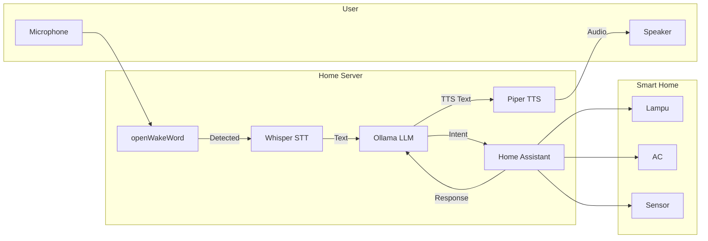

# [Jilid 2] Bab 6.4: Smart Home Integration — LLM ke Home Assistant (Hass.io)
> **Tipe Konten:** Tutorial — Integrasi Sistem + Automasi + Voice Control
> **Target Pembaca:** Pengguna Home Assistant yang ingin menambahkan kecerdasan LLM lokal

---

## 1. TUJUAN SUB-BAB
Pembaca mampu:
- Mengintegrasikan Ollama/vLLM dengan Home Assistant sebagai conversation agent
- Membuat automasi rumah pintar berbasis natural language (bukan rigid YAML)
- Mengimplementasikan voice control lokal via Wyoming pipeline (Whisper + Piper)

---

## 2. KERANGKA KONTEN

### A. Arsitektur Home Assistant + LLM (1-2 paragraf)
- Home Assistant sebagai otak IoT (lights, climate, sensors)
- LLM sebagai natural language interface — bukan pengganti automasi, melainkan frontend
- Alur: User → Wake Word → Whisper (STT) → Ollama (Intent) → HA API → Action → Piper (TTS)

### B. Native Ollama Integration di HA 2024.4+ (1-2 paragraf)
- Integrasi bawaan HA sejak 2024.4: Settings → Devices & Services → Add Ollama
- Konfigurasi URL Ollama (default `http://192.168.1.100:11434`)
- Ekspos entity yang boleh dikontrol LLM via Assist
- Model rekomendasi: Qwen-2.5-7B (function calling stabil), Llama-3.1-8B (umum)

### C. Custom Prompt dan Context Engineering (1 paragraf)
- System prompt HA: beri LLM konteks rumah (denah, nama ruangan, perangkat)
- Gunakan `expose_entities` untuk membatasi perangkat yang bisa dikontrol
- Template prompt untuk intent detection: "Turn on living room light" → service call `light.turn_on`

### D. Wyoming Voice Pipeline (1-2 paragraf)
- Wyoming protocol: standar terbuka untuk STT, TTS, wake word
- Komponen: openWakeWord (wake) → Whisper (STT) → Ollama (agent) → Piper (TTS)
- Setiap komponen bisa jalan di container terpisah

### E. Automasi Cerdas dengan LLM (1 paragraf)
- LLM tidak perlu untuk semua trigger (sensor suhu → AC tetap pakai automasi YAML)
- Gunakan LLM untuk: ambigu command ("suasana santai"), multiple intent ("matikan lampu dan nyalakan TV")
- Integrasi dengan calendar: "Jadwalkan AC nyala 30 menit sebelum saya pulang"

### F. Kinerja dan SLA (1 paragraf)
- Latensi target: wake → TTS < 5 detik untuk pengalaman natural
- GPU diperlukan jika ingin < 3 detik (Whisper + LLM)
- CPU-only: 6-12 detik (masih acceptable untuk smart home)

---

## 3. TABEL WAJIB

### Tabel A: Perbandingan Model untuk Home Assistant

| Model | Ukuran Q4 | Function Calling | Latensi (GPU) | Latensi (CPU) | Rekomendasi |
|:---|:---:|:---:|:---:|:---:|:---|
| **Qwen-2.5-7B** | ~4.5 GB | Sangat Baik | 1.5 detik | 6 detik | Terbaik untuk HA |
| **Llama-3.1-8B** | ~5.0 GB | Baik | 1.8 detik | 7 detik | Alternatif umum |
| **Phi-4-mini (3.8B)** | ~2.5 GB | Sedang | 0.8 detik | 3 detik | Hemat daya |
| **Ministral 3 3B** | ~1.8 GB | Baik | 0.5 detik | 2 detik | **Terbaik edge** |
| **Ministral 3 8B** | ~4.8 GB | Sangat Baik | 1.2 detik | 5 detik | **Sweet spot home** |
| **Qwen-2.5-14B** | ~8.5 GB | Sangat Baik | 3.0 detik | 15 detik | Akurasi maksimal |

> Ministral 3 series (Apache 2.0, Dec 2025) adalah pilihan terbaik untuk Home Assistant karena edge-optimized dengan function calling yang baik. Ministral 3 3B bisa jalan di CPU dengan latensi hanya 2 detik — ideal untuk device tanpa GPU. Untuk keluarga dengan GPU, Ministral 3 8B memberikan keseimbangan terbaik antara akurasi dan kecepatan.

### Tabel B: Komponen Voice Pipeline Wyoming

| Komponen | Fungsi | Model/Engine | RAM | Latensi (GPU) |
|:---|:---|:---|:---:|:---:|
| **openWakeWord** | Wake word detection | Neural network kecil | ~100 MB | 0.3 detik |
| **Whisper (faster-whisper)** | Speech-to-text | Whisper small/turbo | ~1-2 GB | 0.5-1 detik |
| **Ollama (LLM agent)** | Intent parsing + action | Ministral 3 3B / Qwen-2.5-7B | ~2-5 GB | 0.5-1.2 detik |
| **Piper TTS** | Text-to-speech | Piper medium ID | ~500 MB | 0.5 detik |

> Dengan Ministral 3 3B sebagai LLM agent, total pipeline voice bisa mencapai < 2 detik end-to-end (wake → action → TTS) — sangat responsif untuk smart home.

### Tabel C: Contoh Automasi dengan vs Tanpa LLM

| Skenario | Tanpa LLM (YAML) | Dengan LLM |
|:---|:---|:---|
| "Suasana santai" | Butuh script kompleks, 15 baris YAML | Satu kalimat natural |
| "Matikan lampu kamar dan nyalakan AC" | 2 automasi terpisah | Multiple intent otomatis |
| "Berapa suhu di luar?" | Butuh template sensor | Query database otomatis |
| "Hidupkan lampu 10 menit lagi" | Timer manual | LLM parse "10 menit" |

---

## 4. DIAGRAM/GAMBAR WAJIB

### Diagram 1: Arsitektur Voice Pipeline (Mermaid)
- **File:** `assets/diagrams/j2-b6-s4-voice-pipeline.mmd`



### Gambar 2: Screenshot Integrasi Ollama di HA
- **File:** `assets/images/jilid2/j2-b6-s4-ha-ollama-config.png`
- **Isi:** Halaman Devices & Services → Ollama → konfigurasi URL dan model

### Gambar 3: Screenshot Assist Pipeline
- **File:** `assets/images/jilid2/j2-b6-s4-assist-pipeline.png`
- **Isi:** Konfigurasi Assist pipeline dengan Wyoming STT + Ollama + Piper

---

## 5. TUTORIAL / HANDS-ON

### Tutorial A: Integrasi Ollama dengan Home Assistant via Docker Compose

```yaml
# docker-compose.yml — stack lengkap HA + Ollama + Wyoming
version: "3.8"

services:
  homeassistant:
    image: ghcr.io/home-assistant/home-assistant:stable
    volumes:
      - ./ha-config:/config
    ports:
      - "8123:8123"
    restart: unless-stopped

  ollama:
    image: ollama/ollama:latest
    volumes:
      - ./ollama-models:/root/.ollama
    ports:
      - "11434:11434"
    deploy:
      resources:
        reservations:
          devices:
            - driver: nvidia
              count: 1
              capabilities: [gpu]
    restart: unless-stopped

  wyoming-whisper:
    image: rhasspy/wyoming-faster-whisper:latest
    command: --model tiny-int8 --language id
    ports:
      - "10300:10300"
    restart: unless-stopped

  wyoming-piper:
    image: rhasspy/wyoming-piper:latest
    command: --voice id-ID
    ports:
      - "10200:10200"
    restart: unless-stopped
```

### Tutorial B: Konfigurasi Assist Pipeline di HA

```yaml
# Di configuration.yaml HA — setup conversation agent
# Setelah Ollama integration ditambahkan via UI:

conversation:
  - platform: ollama
    url: "http://ollama:11434"
    model: "qwen2.5:7b"
    prompt: |-
      Anda adalah asisten rumah pintar yang membantu keluarga.
      Anda mengontrol perangkat berikut:
      
      - {{ entity }}
      
      Anda hanya boleh menjalankan perintah yang aman dan sesuai.
    max_tokens: 150
    temperature: 0.3
    top_p: 0.9

# Ekspos entity via UI: Settings → Voice Assistants → Expose Entities
# Pilih: light.*, climate.*, switch.*, sensor.* (temperature only)
```

### Tutorial C: Automasi Multiple Intent dengan LLM

```python
# custom_agent.py — script untuk menangani multiple intent
# Jalankan sebagai add-on atau service terpisah

import requests
import json

HA_URL = "http://homeassistant:8123/api"
HA_TOKEN = "your-long-lived-token"
OLLAMA_URL = "http://ollama:11434/api/generate"

def parse_intent(user_text):
    """Kirim ke LLM untuk ekstraksi intent terstruktur"""
    prompt = f"""Ekstrak intent dari perintah berikut sebagai JSON array.
    Perintah: "{user_text}"
    Response format: [{{"entity": "light.living_room", "service": "turn_on"}}, ...]
    Hanya output JSON, tanpa penjelasan."""

    resp = requests.post(OLLAMA_URL, json={
        "model": "qwen2.5:7b",
        "prompt": prompt,
        "stream": False,
        "temperature": 0.1
    })

    return json.loads(resp.json()["response"])

def execute_intents(intents):
    """Jalankan intent via HA API"""
    headers = {
        "Authorization": f"Bearer {HA_TOKEN}",
        "Content-Type": "application/json"
    }

    for intent in intents:
        service = intent["service"]  # "light.turn_on"
        entity = intent["entity"]    # "light.living_room"

        domain, service_name = service.split(".")
        url = f"{HA_URL}/services/{domain}/{service_name}"
        requests.post(url, json={"entity_id": entity}, headers=headers)

# Contoh penggunaan
if __name__ == "__main__":
    perintah = "matikan lampu kamar dan nyalakan ac di suhu 24"
    intents = parse_intent(perintah)
    print(f"Parsed: {intents}")
    execute_intents(intents)
```

---

## 6. STUDI KASUS

### Studi Kasus: Rumah Pintang Keluarga Santoso (6 Anggota)
- **Setup:** Home Assistant di Mini PC + Ollama + Wyoming Whisper/Piper
- **Perangkat:** 20+ smart bulbs (Philips Hue), 3 AC (Broadlink IR), 5 sensor suhu, smart lock
- **LLM Model:** Qwen-2.5-7B Q4_K_M — function calling stabil, respon < 2 detik
- **Voice:** 2 microphone array ESP32-S3 di ruang tamu + dapur, trigger "Hey Rumah"
- **Automasi LLM:**
  - "Suasana makan malam" → lampu redup 30%, AC 24°C, playlist jazz
  - "Kunci pintu dan matikan semua lampu" → multiple intent dieksekusi berurutan
  - "Berapa tagihan listrik bulan ini?" → query sensor energy monitoring
- **Hasil:** Anak bisa minta tolong nyalakan lampu kamar tanpa remote. Orang tua bisa setting AC dari dapur. Tidak ada data yang ke cloud. Latensi rata-rata 3.5 detik (wake → action → TTS).

---

## 7. REFERENSI WAJIB

### Paper Jurnal/Konferensi

[1] **On-Device LLM untuk Home Assistant**
```
@article{lang2025ondevice,
  title   = {On-Device {LLMs} for Home Assistant: Dual Role in Intent Detection and Response Generation},
  author  = {Lang, Martin and others},
  journal = {arXiv preprint arXiv:2502.12923},
  year    = {2025},
  doi     = {10.48550/arXiv.2502.12923},
  url     = {https://arxiv.org/abs/2502.12923}
}
```
- Kaitan: Paper inti — studi kelayakan LLM 8-bit untuk intent detection dan response generation di Home Assistant. Data SLA latency di Tabel A harus diverifikasi dengan temuan paper ini.

[2] **HomeLLaMA — Privacy-Preserving Smart Home**
```
@article{huang2025homellama,
  title   = {Towards Privacy-Preserving and Personalized Smart Homes via Tailored Small Language Models},
  author  = {Huang, Xinyu and Shen, Leming and Ma, Zijing and Zheng, Yuanqing},
  journal = {IEEE Transactions on Mobile Computing},
  year    = {2025},
  doi     = {10.48550/arXiv.2507.08878},
  url     = {https://arxiv.org/abs/2507.08878}
}
```
- Kaitan: Arsitektur HomeLLaMA dengan PrivShield — sistem continuous learning untuk personalisasi smart home. Menjadi model arsitektur untuk sub-bab ini.

[3] **Harmony — Robust Smart Home Assistant**
```
@article{chen2024harmony,
  title   = {Harmony: A Privacy-Preserving and Robust Smart Home Assistant Powered by Locally Deployable {Llama3-8B}},
  author  = {Chen, Yijie and others},
  journal = {arXiv preprint arXiv:2410.14252},
  year    = {2024},
  doi     = {10.48550/arXiv.2410.14252},
  url     = {https://arxiv.org/abs/2410.14252}
}
```
- Kaitan: Struktur modular agent untuk smart home dengan structured prompting. Relevan untuk sub-bab 2.C (prompt engineering) dan 2.E (automasi cerdas).

[4] **GreenIFTTT — LLM untuk Home Automation**
```
@article{presta2024greenifttt,
  title   = {Designing Home Automation Routines Using an {LLM}-Based Chatbot},
  author  = {Presta, Lucrezia and others},
  journal = {Designs, MDPI},
  volume  = {8},
  number  = {3},
  pages   = {43},
  year    = {2024},
  doi     = {10.3390/designs8030043},
  url     = {https://www.mdpi.com/2411-9660/8/3/43}
}
```
- Kaitan: Studi pengguna yang membuktikan LLM chatbot memudahkan pembuatan rutinitas home automation. Data usability (N=13) dijadikan acuan untuk user experience.

[5] **Optimizing LLM for Smart Home at the Edge**
```
@article{velaga2024optimizing,
  title   = {Optimizing Large Language Models Assisted Smart Home Assistant Systems at the Edge: An Empirical Study},
  author  = {Velaga, Krishna Sruthi and Guo, Yifan},
  booktitle = {AAAI 2025 Workshop AI4WCN},
  year    = {2024},
  url     = {https://openreview.net/forum?id=qr2dIjQavP}
}
```
- Kaitan: Benchmark 4 model (Home-1B, TinyHome, TinyHome-Qwen, StableHome) di edge device. Temuan: optimasi mengurangi response time 82% (45s → 7.9s). Relevan untuk optimasi latency.

### Referensi Pendukung

[6] Home Assistant. *Ollama Integration*. [https://www.home-assistant.io/integrations/ollama](https://www.home-assistant.io/integrations/ollama)

[7] Home Assistant. *Wyoming Protocol*. [https://www.home-assistant.io/integrations/wyoming](https://www.home-assistant.io/integrations/wyoming)

[8] Piper TTS. *GitHub Repository*. [https://github.com/rhasspy/piper](https://github.com/rhasspy/piper)

[9] faster-whisper. *GitHub Repository*. [https://github.com/SYSTRAN/faster-whisper](https://github.com/SYSTRAN/faster-whisper)

[10] openWakeWord. *GitHub Repository*. [https://github.com/dscripka/openWakeWord](https://github.com/dscripka/openWakeWord)

[11] **Ministral 3 — Home Assistant Integration**
```
@misc{mistral2025ministral3,
  title   = {Ministral 3: Edge-Optimized for Home Automation},
  author  = {{Mistral AI}},
  year    = {2025},
  url     = {https://mistral.ai/news/ministral-3/},
  note    = {Apache 2.0, 3B/8B/14B variants}
}
```
- Kaitan: Model edge-optimized dengan function calling yang baik. Latensi CPU-only hanya 2 detik untuk 3B — ideal untuk Home Assistant tanpa GPU.
