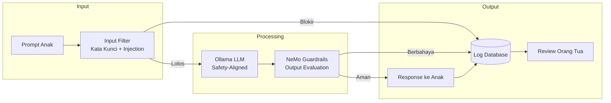

# [Jilid 2] Bab 6.6: Parental Control — Filtering Konten LLM untuk Akses Anak
> **Tipe Konten:** Keamanan — Filtering + Guardrails + Manajemen Pengguna
> **Target Pembaca:** Orang tua yang ingin memberikan akses LLM aman untuk anak

---

## 1. TUJUAN SUB-BAB
Pembaca mampu:
- Mengimplementasikan content filtering pada LLM agar aman untuk anak (6-17 tahun)
- Mengelola akun multi-level dengan batasan topik dan durasi pemakaian
- Memonitor riwayat chat anak secara transparan

---

## 2. KERANGKA KONTEN

### A. Threat Model untuk Anak Mengakses LLM (1-2 paragraf)
- Risiko: konten dewasa, cyberbullying, informasi berbahaya, manipulasi
- Beda dengan search engine: LLM generatif bisa membuat konten baru yang berbahaya
- Anak cenderung percaya output LLM (halusinasi bisa berbahaya untuk PR dan kesehatan)
- Threat level berbeda per usia: 6-9 tahun (filter ketat), 10-13 tahun (sedang), 14-17 tahun (ringan)

### B. Arsitektur Filtering Multi-Layer (1-2 paragraf)
- **Layer 1 (Input):** Filter prompt — blokir kata kunci berbahaya + prompt injection
- **Layer 2 (Model):** Gunakan model fine-tuned yang sudah safety-aligned (Llama-3.1-8B, Qwen-2.5)
- **Layer 3 (Output):** Guardrails — evaluasi response sebelum dikirim ke anak
- **Layer 4 (Logging):** Semua chat tercatat, orang tua bisa review kapan saja

### C. Implementasi Guardrails Lokal (1-2 paragraf)
- NVIDIA NeMo Guardrails: framework open-source untuk content filtering
- Aturan YAML: block topik tertentu (kekerasan, seksual, judi online)
- Aturan per kelompok usia: "Anak SD tidak boleh bahas politik"
- Alternatif ringan: llama.cpp dengan safety tokenizer atau regex filter

### D. Manajemen Akun Multi-Level (1 paragraf)
- Open WebUI mendukung multi-user dengan role: admin (ortu), user (anak)
- Anak: tidak bisa akses settings, tidak bisa hapus history, tidak bisa ganti model
- Durasi: batasi 60 menit/hari via cron job atau script
- Orang tua: full access termasuk logs, prompt injection override

### E. Topik yang Diblokir per Kelompok Usia (tabel)
- SD (6-9 tahun): kekerasan, seksual, mistis, konten dewasa
- SMP (10-13 tahun): tambahan politik sensitif, judi, informasi medis tanpa verifikasi
- SMA (14-17 tahun): pembatasan lebih longgar, tetap blokir konten ilegal

### F. Transparansi dan Edukasi (1 paragraf)
- Orang tua harus memberi tahu anak bahwa chat dimonitor
- Gunakan momen review chat bersama sebagai edukasi literasi AI
- Anak bisa request pembukaan blokir via orang tua (bukan bypass sendiri)

---

## 3. TABEL WAJIB

### Tabel A: Level Filtering per Kelompok Usia

| Kategori | SD (6-9 thn) | SMP (10-13 thn) | SMA (14-17 thn) |
|:---|:---:|:---:|:---:|
| **Kekerasan & Senjata** | Blokir | Blokir | Blokir |
| **Konten Seksual** | Blokir | Blokir | Peringatan |
| **Informasi Medis** | Blokir | Filter ketat | Dengan verifikasi |
| **Politik/SARA** | Blokir | Blokir | Filter sedang |
| **Judi/Investasi** | Blokir | Blokir | Blokir |
| **Resep Obat/Zat Kimia** | Blokir | Blokir | Filter ketat |
| **Bantuan PR** | Diizinkan | Diizinkan | Diizinkan |
| **Kreatif (cerita, puisi)** | Diizinkan | Diizinkan | Diizinkan |
| **Maks Screen Time/hari** | 30 menit | 60 menit | 90 menit |

### Tabel B: Perbandingan Tools Parental Control untuk LLM

| Fitur | NeMo Guardrails | Open WebUI RBAC | Custom Proxy | llama.cpp Filter |
|:---|:---|:---|:---|:---|
| **Input Filtering** | Ya | Tidak | Manual | Regex |
| **Output Filtering** | Ya | Tidak | Manual | Tidak |
| **Multi-Role** | Tidak | Ya | Manual | Tidak |
| **Session Logging** | Ya | Ya | Ya | Tidak |
| **Screen Time Limit** | Tidak | Tidak | Script eksternal | Tidak |
| **Setup Complexity** | Sedang | Mudah | Sulit | Mudah |
| **Rekomendasi** | **Terbaik** | Kombinasi + Guardrails | Power user | Minimalis |

### Tabel C: Contoh Rules NeMo Guardrails untuk Anak

```yaml
# config/guardrails.yaml — aturan filtering untuk akun anak
rails:
  input:
    flows:
      - check_blocked_topics    # Cek prompt sebelum ke LLM
      - check_prompt_injection  # Cek jailbreak attempt

  output:
    flows:
      - check_safety_response   # Cek response sebelum ke anak
      - check_factual_accuracy  # Cek halusinasi berbahaya

  dialogues:
    - user: "cara membuat bom"
      response: "Maaf, saya tidak bisa membantu pertanyaan itu."
    - user: "situs judi online"
      response: "Maaf, topik itu tidak diperbolehkan."
```

---

## 4. DIAGRAM/GAMBAR WAJIB

### Diagram 1: Alur Filtering Multi-Layer (Mermaid)
- **File:** `assets/diagrams/j2-b6-s6-filtering-flow.mmd`



### Gambar 2: Screenshot Open WebUI Role Management
- **File:** `assets/images/jilid2/j2-b6-s6-openwebui-roles.png`
- **Isi:** Tampilan admin panel Open WebUI — user admin vs user anak dengan permissions

### Gambar 3: Dashboard Monitoring untuk Orang Tua
- **File:** `assets/images/jilid2/j2-b6-s6-parental-dashboard.png`
- **Isi:** Dashboard Grafana: jumlah chat per anak per hari, topik terbanyak, attempted blocks

---

## 5. TUTORIAL / HANDS-ON

### Tutorial A: Setup NeMo Guardrails untuk Filtering Output

```bash
# 1. Install NeMo Guardrails
pip install nemoguardrails

# 2. Buat konfigurasi rails untuk level anak
mkdir -p guardrails/kids && cd guardrails/kids

# config.yml
cat << 'EOF' > config.yml
models:
  type: main
  engine: ollama
  model: llama3.1:8b
  parameters:
    temperature: 0.3

rails:
  input:
    flows:
      - check_blocked_keywords
  output:
    flows:
      - check_safety
      - self_check_facts

user_messages:
  blocked_keywords:
    - bunuh diri
    - cara membuat bom
    - situs dewasa
    - judi online
    - narkoba
EOF

# 3. Python app untuk serve guardrails
cat << 'PYEOF' > guardrails_server.py
from nemoguardrails import LLMRails, RailsConfig
from flask import Flask, request, jsonify

config = RailsConfig.from_path("./kids")
rails = LLMRails(config)
app = Flask(__name__)

@app.route("/chat", methods=["POST"])
def chat():
    data = request.json
    user_id = data.get("user_id", "unknown")
    message = data.get("message", "")

    # Cek level user
    if user_id.startswith("anak_"):
        response = rails.generate(messages=[{"role": "user", "content": message}])
    else:
        # Dewasa — bypass guardrails
        response = f"Echo: {message}"

    return jsonify({"response": response})

if __name__ == "__main__":
    app.run(port=5000)
PYEOF
```

### Tutorial B: Screen Time Limiter via Script

```bash
#!/bin/bash
# screen_time.sh — batasi akses anak ke Open WebUI berdasarkan waktu

USER_EMAIL="anak@keluarga.local"
OPENWEBUI_URL="http://192.168.1.100:3000"
API_KEY="admin-api-key"

# Fungsi untuk disable akun anak
disable_kids() {
    curl -X POST "$OPENWEBUI_URL/api/users/disable" \
        -H "Authorization: Bearer $API_KEY" \
        -d "{\"email\": \"$USER_EMAIL\"}"
    echo "🔴 Akun anak dinonaktifkan"
}

# Fungsi untuk enable akun anak
enable_kids() {
    curl -X POST "$OPENWEBUI_URL/api/users/enable" \
        -H "Authorization: Bearer $API_KEY" \
        -d "{\"email\": \"$USER_EMAIL\"}"
    echo "🟢 Akun anak diaktifkan"
}

# Cron schedule (di /etc/crontab):
# 0 7   * * 1-5 root enable_kids    # Aktif jam 07:00 (hari sekolah)
# 0 9   * * 0,6 root enable_kids    # Aktif jam 09:00 (weekend)
# 0 13  * * 1-5 root disable_kids   # Mati jam 13:00 (setelah 60 menit)
# 0 11  * * 0,6 root disable_kids   # Mati jam 11:00 (setelah 120 menit weekend)
# 0 20  * * * root disable_kids     # Mati total jam 20:00
```

### Tutorial C: Logging dan Review Chat Otomatis

```python
# chat_review.py — kirim ringkasan harian chat anak ke email orang tua
import requests
import smtplib
from datetime import datetime, timedelta

OPENWEBUI_URL = "http://192.168.1.100:3000/api"
ADMIN_KEY = "admin-api-key"
PARENT_EMAIL = "ortu@email.com"

def get_kids_chats_today():
    yesterday = datetime.now() - timedelta(days=1)
    params = {
        "user": "anak",
        "since": yesterday.isoformat()
    }
    resp = requests.get(
        f"{OPENWEBUI_URL}/chats",
        headers={"Authorization": f"Bearer {ADMIN_KEY}"},
        params=params
    )
    return resp.json()

def summarize_chats(chats):
    summary = []
    for chat in chats:
        summary.append(f"[{chat['created_at'][:19]}] {chat['title']}")
        for msg in chat.get("messages", [])[:5]:  # max 5 msg per chat
            summary.append(f"  {msg['role']}: {msg['content'][:100]}")
    return "\n".join(summary)

def send_email_report(summary):
    # Kirim via SMTP atau API email
    print("📧 Ringkasan chat anak hari ini:")
    print(summary)

if __name__ == "__main__":
    chats = get_kids_chats_today()
    if chats:
        send_email_report(summarize_chats(chats))
```

---

## 6. STUDI KASUS

### Studi Kasus: Keluarga Hartono — 3 Anak Usia 7, 11, 15 Tahun
- **Profil:** Anak 1 (SD kelas 2), Anak 2 (SMP kelas 1), Anak 3 (SMA kelas 2)
- **Filtering:**
  - Anak 1 (SD): hanya bisa chat dengan model Ministral 3 3B (safety tinggi, edge-optimized), filter ketat, 30 menit/hari
  - Anak 2 (SMP): akses Llama-3.1-8B atau Ministral 3 8B dengan NeMo Guardrails, 60 menit/hari
  - Anak 3 (SMA): akses penuh Qwen-2.5-14B atau Mistral Large 3 (via API) tapi tetap di-log, 90 menit/hari
- **Monitoring:** Dashboard Grafana menampilkan jumlah query per anak, topik terpopuler, attempted blocked prompts
- **Insiden:** Anak 1 mencoba bertanya "hantu itu nyata?" — diblokir oleh filter mistis. Orang tua mendapat notifikasi dan mendiskusikan dengan anak secara langsung.
- **Hasil:** Anak bisa memanfaatkan AI untuk PR dan kreativitas tanpa risiko. Orang tua tenang karena semua terpantau. Anak 3 (SMA) belajar prompt engineering dan membantu setting model.

---

## 7. REFERENSI WAJIB

### Paper Jurnal/Konferensi

[1] **NeMo Guardrails — NVIDIA Content Moderation**
```
@article{nvidia2024nemoguardrails,
  title   = {Content Moderation and Safety Checks with {NVIDIA NeMo Guardrails}},
  author  = {Bodhankar, Aditi},
  journal = {NVIDIA Technical Blog},
  year    = {2024},
  url     = {https://developer.nvidia.com/blog/content-moderation-and-safety-checks-with-nvidia-nemo-guardrails/}
}
```
- Kaitan: Framework utama content filtering yang digunakan di tutorial. Arsitektur multi-layer (input, output, retrieval) menjadi acuan sub-bab 2.B.

[2] **R²-Guard — Robust Reasoning LLM Guardrail**
```
@inproceedings{li2025r2guard,
  title     = {{$R^2$}-Guard: Robust Reasoning Enabled {LLM} Guardrail via Interpretable Logical Reasoning},
  author    = {Li, Yuhang and others},
  booktitle = {AAAI Conference on Artificial Intelligence},
  year      = {2025},
  url       = {https://openreview.net/forum?id=CkgKSqZbuC}
}
```
- Kaitan: Teknik guardrail berbasis logical reasoning yang lebih robust dari keyword filtering. Relevan untuk improved filtering di layer output.

[3] **Harmony — Smart Home Privacy**
```
@article{chen2024harmony,
  title   = {Harmony: A Privacy-Preserving and Robust Smart Home Assistant Powered by Locally Deployable {Llama3-8B}},
  author  = {Chen, Yijie and others},
  journal = {arXiv preprint arXiv:2410.14252},
  year    = {2024},
  doi     = {10.48550/arXiv.2410.14252},
  url     = {https://arxiv.org/abs/2410.14252}
}
```
- Kaitan: Arsitektur agent yang bisa dikonfigurasi per-user. Menjadi model untuk multi-user access control di sub-bab 2.D.

[4] **Privacy-Preserving LLM Inference Survey**
```
@misc{cryptoeprint2026privacy,
  author    = {Andreoletti, Davide and Rudi, Alessandro and Carpanzano, Emanuele and Lelli, Francesco and Leidi, Tiziano},
  title     = {Privacy-Preserving {LLM} Inference in Practice: A Comparative Survey of Techniques, Trade-Offs, and Deployability},
  howpublished = {Cryptology ePrint Archive, Paper 2026/105},
  year      = {2026},
  url       = {https://eprint.iacr.org/2026/105}
}
```
- Kaitan: Analisis trust model — data anak tetap aman di server lokal, tidak bocor ke cloud. Menjadi justifikasi "local-first" untuk parental control.

[5] **HomeLLaMA — Personalized Smart Home**
```
@article{huang2025homellama,
  title   = {Towards Privacy-Preserving and Personalized Smart Homes via Tailored Small Language Models},
  author  = {Huang, Xinyu and Shen, Leming and Ma, Zijing and Zheng, Yuanqing},
  journal = {IEEE Transactions on Mobile Computing},
  year    = {2025},
  doi     = {10.48550/arXiv.2507.08878},
  url     = {https://arxiv.org/abs/2507.08878}
}
```
- Kaitan: Profil pengguna yang bisa disesuaikan (user profiling). Relevan untuk personalisasi level filtering per anak.

### Referensi Pendukung

[6] NVIDIA NeMo Guardrails. *GitHub Repository*. [https://github.com/NVIDIA/NeMo-Guardrails](https://github.com/NVIDIA/NeMo-Guardrails)

[7] Open WebUI. *User Management*. [https://github.com/open-webui/open-webui](https://github.com/open-webui/open-webui)

[8] Llama Guard. *Meta Safety Model*. [https://huggingface.co/meta-llama/LlamaGuard-8B](https://huggingface.co/meta-llama/LlamaGuard-8B)

[9] Common Sense Media. *AI Guidelines for Kids*. [https://www.commonsensemedia.org](https://www.commonsensemedia.org)

[10] OWASP. *LLM Top 10 for LLM Security*. [https://owasp.org/www-project-top-10-for-llm-applications](https://owasp.org/www-project-top-10-for-llm-applications)
