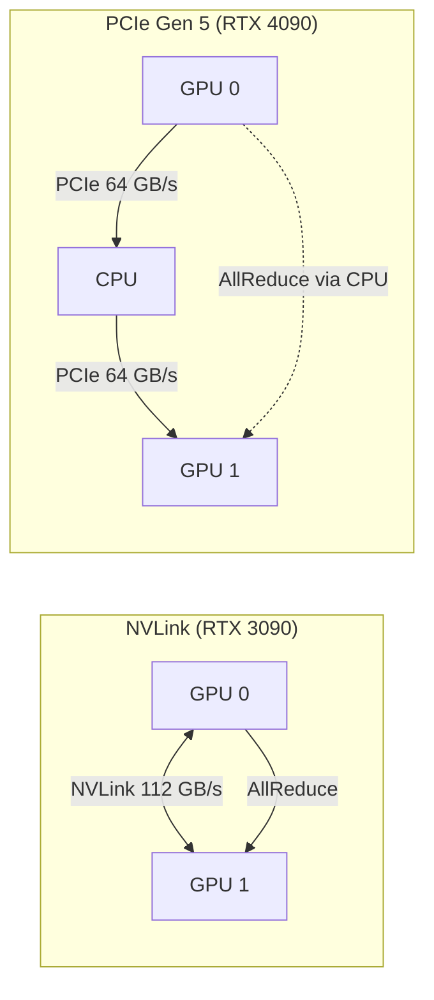

# [Jilid 2] Bab 7.2: Hardware — Multi-GPU Workstation (2x RTX 3090/4090) NVLink/PCIe Gen 5
> **Tipe Konten:** Teknis — Hardware + Benchmark + Panduan Belanja
> **Target Pembaca:** Tim IT/DevOps yang merakit workstation AI untuk small office

---

## 1. TUJUAN SUB-BAB
Pembaca mampu:
- Memilih konfigurasi multi-GPU optimal untuk small office (9-20 user)
- Memahami trade-off NVLink vs PCIe Gen 5 untuk tensor parallelism
- Merakit dan mengonfigurasi dual-GPU workstation untuk LLM inference

---

## 2. KERANGKA KONTEN (WAJIB DITULIS)

### A. Mengapa Multi-GPU? (1 paragraf)
- Model 70B Q4_K_M butuh ~40GB VRAM — tidak muat di satu GPU consumer
- Solusi: 2x RTX 3090 (48GB) atau 2x RTX 4090 (48GB) — cukup untuk 70B Q4_K_M + KV cache
- Perbandingan biaya: 2x RTX 3090 bekas ~Rp 30jt vs 1x RTX 4090 ~Rp 28jt — VRAM 2x lipat

### B. Interconnect: NVLink vs PCIe Gen 5 (2-3 paragraf)
- **NVLink (RTX 3090):** 112.5 GB/s bidirectional dengan bridge NVLink. Tensor parallelism scaling 1.6-1.7x.
- **PCIe Gen 5 (RTX 4090/5090):** 64 GB/s bidirectional. Tanpa NVLink, hanya pipeline parallelism. Scaling 1.4-1.5x.
- **RTX 3090 adalah GPU consumer terakhir dengan NVLink.** RTX 4090 dan 5090 tidak mendukung NVLink.
- NVLink unggul 40-60% untuk tensor parallelism dibanding PCIe.
- Untuk pipeline parallelism, PCIe Gen 5 sudah mencukupi dengan penalty hanya 5-10%.

### C. Kompatibilitas Motherboard (1 paragraf)
- Consumer (Z790/X670E): 16+4 lane — split jadi x8/x8 untuk dual GPU — ada penalty bandwidth
- Workstation (TRX50/W790): 64+ lane — full x16/x16 — recommended untuk production
- WAJIB: Above 4G Decoding + Resizable BAR di BIOS

### D. PSU dan Cooling (1 paragraf)
- Dua RTX 3090/4090 = total TDP 700-900W — butuh PSU 1200W+ gold/platinum
- Cooling: air flow case besar (Fractal Meshify/Lian Li) atau custom water cooling
- Thermal throttling adalah musuh terbesar — pastikan intake/exhaust balance

### E. Model yang Dapat Dijalankan (tabel + narasi)
- 2x 24GB VRAM: Llama-3.1-70B Q4_K_M, Qwen-3-32B Q8_0, DeepSeek-Coder-67B Q4_K_M, Qwen3.6-27B Q8
- 2x 32GB VRAM: DeepSeek V4 Flash (284B/13B aktif) Q4_K_M, Mistral Large 3 (675B/41B aktif) Q3_K_M
- 1x 24GB VRAM: Ministral 3 14B Q4_K_M, Qwen-2.5-Coder-14B Q8, Gemini 2.5 Pro (via API fallback)
- Dengan CPU offload: Mixtral-8x22B Q4_K_M, Command-R+ Q3_K_M

---

## 3. TABEL WAJIB

### Tabel A: Perbandingan Interconnect GPU

| Teknologi | Bandwidth | Latensi | Harga Bridge | Scaling TP | Tersedia di |
|:---|:---:|:---:|:---:|:---:|:---|
| **NVLink 3.0 (RTX 3090)** | 112.5 GB/s | Sangat rendah | ~$80-120 | 1.6-1.7x | RTX 3090 only |
| **PCIe 4.0 x8/x8** | 32 GB/s | Rendah | Gratis | 1.3-1.4x | Semua consumer |
| **PCIe 5.0 x8/x8** | 64 GB/s | Rendah | Gratis | 1.4-1.5x | Z790/X670E+ |
| **PCIe 5.0 x16/x16** | 128 GB/s | Rendah | Gratis | 1.5-1.6x | TRX50/W790 |

### Tabel B: Rekomendasi Build Small Office

| Komponen | Budget (~Rp 60jt) | Medium (~Rp 90jt) | Optimal (~Rp 120jt) |
|:---|:---|:---|:---|
| **CPU** | Ryzen 9 7950X | Threadripper 7960X | Threadripper 7980X |
| **Motherboard** | X670E (x8/x8) | TRX50 (x16/x16) | WRX90 (x16/x16) |
| **GPU** | 2x RTX 3090 used | 2x RTX 4090 | 2x RTX 5090 |
| **Interconnect** | PCIe 4.0 (tanpa NVLink) | PCIe 5.0 | NVLink 4.0 (jika 3090) |
| **RAM** | 64GB DDR5 | 128GB DDR5 | 256GB DDR5 ECC |
| **Storage** | 2TB NVMe | 4TB NVMe RAID | 8TB NVMe RAID |
| **PSU** | 1200W Gold | 1500W Platinum | 2000W Titanium |
| **Cooling** | Airflow case + AIO | Custom loop CPU | Full custom loop |
| **Estimasi Total** | ~Rp 55-65jt | ~Rp 85-95jt | ~Rp 110-130jt |

### Tabel C: Benchmark Multi-GPU LLM Inference

| Model | Kuantisasi | 1x RTX 4090 | 2x RTX 3090 (NVLink) | 2x RTX 4090 (PCIe 5) |
|:---|:---|:---:|:---:|:---:|
| **Llama-3.1-8B** | Q4_K_M | ~85 t/s | ~75 t/s | ~90 t/s |
| **Qwen-2.5-14B** | Q4_K_M | ~45 t/s | ~55 t/s | ~60 t/s |
| **Ministral 3 14B** | Q4_K_M | ~50 t/s | ~58 t/s | ~65 t/s |
| **Qwen3.6-27B** | Q4_K_M | ~22 t/s | ~30 t/s | ~35 t/s |
| **Llama-3.1-70B** | Q3_K_M | OOM | ~18 t/s | ~16 t/s |
| **Llama-3.1-70B** | Q4_K_M | OOM | ~12 t/s | ~10 t/s |
| **DeepSeek-Coder-67B** | Q4_K_M | OOM | ~14 t/s | ~12 t/s |
| **DeepSeek V4 Flash** | Q4_K_M | OOM | ~20 t/s | ~18 t/s |
| **Mistral Large 3** | Q3_K_M | OOM | ~15 t/s | ~13 t/s |

> Data benchmark dari komunitas r/LocalLLaMA dan WillItRunAI (2026). Angka aktual bervariasi tergantung CPU, RAM, dan cooling.

---

## 4. DIAGRAM/GAMBAR WAJIB

### Diagram 1: Topologi Multi-GPU NVLink vs PCIe (Mermaid)
- **File:** `assets/diagrams/j2-b7-s2-multi-gpu-topology.mmd`
- **Isi:** Perbandingan aliran data tensor parallelism NVLink (langsung GPU-to-GPU) vs PCIe (via CPU)



### Gambar 2: Foto Fisik Workstation Dual-GPU
- **File:** `assets/images/jilid2/j2-b7-s2-dual-gpu-workstation.jpg`
- **Isi:** Foto rak workstation dengan 2x GPU terpasang, detail NVLink bridge, dan manajemen kabel

### Gambar 3: Grafik Scaling Multi-GPU (Bar Chart)
- **File:** `assets/images/jilid2/j2-b7-s2-scaling-benchmark.png`
- **Isi:** Bar chart tokens/detik untuk 1 GPU vs 2 GPU (PCIe vs NVLink) di berbagai model

---

## 5. TUTORIAL / HANDS-ON (WAJIB)

### Tutorial A: Verifikasi NVLink dan PCIe di Linux

```bash
#!/bin/bash
# Cek interkoneksi GPU
nvidia-smi topo -m

# Output yang diharapkan untuk NVLink:
#       GPU0    GPU1
# GPU0   X      NV2
# GPU1  NV2      X

# Cek PCIe link speed
nvidia-smi --query-gpu=pcie.link.gen.current,pcie.link.width.current \
    --format=csv

# Cek NVLink status (hanya untuk GPU dengan NVLink)
nvidia-smi nvlink --status

# Test bandwidth GPU-to-GPU dengan NCCL
git clone https://github.com/NVIDIA/nccl-tests.git
cd nccl-tests
make
./build/all_reduce_perf -b 8 -e 128M -f 2 -g 2
```

### Tutorial B: Setup vLLM dengan Tensor Parallelism

```bash
# Install vLLM dengan CUDA 12.1
pip install vllm

# Jalankan dengan tensor-parallel-size=2 (untuk 2 GPU)
python -m vllm.entrypoints.openai.api_server \
    --model Qwen/Qwen-2.5-14B-Instruct \
    --tensor-parallel-size 2 \
    --gpu-memory-utilization 0.90 \
    --max-model-len 8192 \
    --dtype auto \
    --port 8000

# Untuk pipeline parallelism (tanpa NVLink)
python -m vllm.entrypoints.openai.api_server \
    --model Qwen/Qwen-2.5-14B-Instruct \
    --pipeline-parallel-size 2 \
    --gpu-memory-utilization 0.90 \
    --max-model-len 8192
```

### Tutorial C: Monitoring Temperatur dan Power Multi-GPU

```python
#!/usr/bin/env python3
# monitor_gpu.py — monitoring multi-GPU untuk production
import subprocess
import json
import time
from datetime import datetime

def get_gpu_stats():
    result = subprocess.run([
        'nvidia-smi', '--query-gpu=index,name,temperature.gpu,power.draw,utilization.gpu,memory.used,memory.total',
        '--format=csv,noheader,nounits'
    ], capture_output=True, text=True)
    
    stats = []
    for line in result.stdout.strip().split('\n'):
        parts = [p.strip() for p in line.split(',')]
        stats.append({
            'index': parts[0],
            'name': parts[1],
            'temp': float(parts[2]),
            'power': float(parts[3]),
            'util': float(parts[4]),
            'mem_used': float(parts[5]),
            'mem_total': float(parts[6])
        })
    return stats

while True:
    print(f"\n=== {datetime.now().isoformat()} ===")
    for gpu in get_gpu_stats():
        print(f"GPU {gpu['index']} ({gpu['name']}): "
              f"{gpu['temp']}°C | {gpu['power']}W | "
              f"{gpu['util']}% util | "
              f"{gpu['mem_used']}/{gpu['mem_total']} MB")
    time.sleep(10)
```

---

## 6. STUDI KASUS (WAJIB)

### Studi Kasus: Build Dual RTX 3090 untuk Kantor Hukum Teknologi
- **Skenario:** Firma hukum teknologi dengan 15 pengacara + 5 paralegal. Butuh akses ke knowledge base hukum (50GB dokumen) dan drafting kontrak berbasis AI.
- **Hardware:** 2x RTX 3090 used (NVLink bridged) + Threadripper 7960X + 128GB RAM + 4TB NVMe
- **Mengapa 3090:** NVLink membuat tensor parallelism efisien untuk model 70B. Biaya 2x bekas ~Rp 28jt, sama dengan 1 RTX 4090 baru tapi VRAM 2x lipat.
- **Software:** vLLM dengan TP=2, Llama-3.1-70B Q4_K_M, Open WebUI, Qdrant untuk RAG
- **Tantangan:** PSU 1200W nyaris tidak cukup saat kedua GPU full load (2x 350W = 700W + CPU 200W = 900W). Upgrade ke 1600W dianjurkan.
- **Hasil:** Model 70B running di Q4_K_M dengan ~12 t/s untuk single user, cukup untuk 5-8 concurrent user.
- **Pelajaran:** NVLink bridge bekas harga ~$80 sangat worth it — meningkatkan throughput 30% dibanding PCIe.

---

## 7. REFERENSI WAJIB (SOP: minimal 5 paper 5 tahun terakhir + DOI)

### Paper Jurnal/Konferensi

[1] **Megatron-LM: Tensor Parallelism untuk Large Model**
```
@inproceedings{shoeybi2019megatron,
  title     = {{Megatron-LM}: Training Multi-Billion Parameter Language Models Using Model Parallelism},
  author    = {Shoeybi, Mohammad and Patwary, Mostofa and Puri, Raul and LeGresley, Patrick and Casper, Jared and Catanzaro, Bryan},
  booktitle = {Advances in Neural Information Processing Systems (NeurIPS)},
  year      = {2019},
  doi       = {10.48550/arXiv.1909.08053},
  url       = {https://arxiv.org/abs/1909.08053}
}
```
- Kaitan: Landasan tensor parallelism yang digunakan vLLM. Menjelaskan mekanisme pembagian weight matrix secara horizontal di multiple GPU.

[2] **Prism: GPU Sharing untuk Multi-LLM Serving**
```
@article{yu2025prism,
  title     = {{Prism}: Unleashing {GPU} Sharing for Cost-Efficient Multi-{LLM} Serving},
  author    = {Yu, Shan and Xing, Jiarong and Qiao, Yifan and Ma, Mingyuan and Li, Yangmin and Wang, Yang and Yang, Shuo and Xie, Zhiqiang and Cao, Shiyi and Bao, Ke and Stoica, Ion and Xu, Harry and Sheng, Ying},
  journal   = {arXiv preprint arXiv:2505.04021},
  year      = {2025},
  doi       = {10.48550/arXiv.2505.04021},
  url       = {https://arxiv.org/abs/2505.04021}
}
```
- Kaitan: Sistem memory coordination lintas model yang relevan untuk multi-LLM di environment multi-GPU small office.

[3] **Efficient Large-Scale Language Model Training on GPU Clusters**
```
@inproceedings{rasley2020deepspeed,
  title     = {{DeepSpeed}: System Optimizations Enable Training Deep Learning Models with Over 100 Billion Parameters},
  author    = {Rasley, Jeff and Rajbhandari, Samyam and Ruwase, Olatunji and He, Yuxiong},
  booktitle = {Proceedings of the 26th ACM SIGKDD International Conference on Knowledge Discovery and Data Mining},
  year      = {2020},
  doi       = {10.1145/3394486.3406703},
  url       = {https://doi.org/10.1145/3394486.3406703}
}
```
- Kaitan: Teknik ZeRO optimization untuk menghemat VRAM — relevan untuk CPU offload ketika VRAM tidak cukup.

[4] **GPipe: Efficient Training of Large Neural Networks**
```
@inproceedings{huang2019gpipe,
  title     = {{GPipe}: Efficient Training of Giant Neural Networks using Pipeline Parallelism},
  author    = {Huang, Yanping and Cheng, Youlong and Bapna, Ankur and Firat, Orhan and Chen, Dehao and Chen, Mia and Lee, HyoukJoong and Ngiam, Jiquan and Le, Quoc V. and Wu, Yonghui and Chen, Zhifeng},
  booktitle = {Advances in Neural Information Processing Systems (NeurIPS)},
  year      = {2019},
  doi       = {10.48550/arXiv.1811.06965},
  url       = {https://arxiv.org/abs/1811.06965}
}
```
- Kaitan: Pipeline parallelism untuk multi-GPU tanpa NVLink. Teknik yang relevan untuk dual RTX 4090 yang tidak punya NVLink.

[5] **FlashAttention: Fast and Memory-Efficient Exact Attention**
```
@inproceedings{dao2022flashattention,
  title     = {{FlashAttention}: Fast and Memory-Efficient Exact Attention with {IO}-Awareness},
  author    = {Dao, Tri and Fu, Daniel Y. and Ermon, Stefano and Rudra, Atri and R{\'e}, Christopher},
  booktitle = {Advances in Neural Information Processing Systems (NeurIPS)},
  year      = {2022},
  doi       = {10.48550/arXiv.2205.14135},
  url       = {https://arxiv.org/abs/2205.14135}
}
```
- Kaitan: Optimasi attention yang mengurangi memory footprint — penting untuk menjalankan model besar di VRAM terbatas multi-GPU.

### Referensi Pendukung (Non-Paper/Dokumentasi)

[6] NVIDIA. *NVLink and NVSwitch Documentation*. [https://www.nvidia.com/nvlink](https://www.nvidia.com/nvlink)

[11] **DeepSeek V4 Pro: Open-Weight Largest MoE**
```
@misc{deepseek2026v4pro,
  title     = {{DeepSeek-V4} Pro: 1.6 Trillion Parameter Mixture-of-Experts with 49 Billion Active},
  author    = {{DeepSeek Team}},
  year      = {2026},
  url       = {https://api-docs.deepseek.com}
}
```
- Kaitan: Model open-weight terbesar yang pernah dirilis (MIT). 1.6T total / 49B aktif, konteks 1M. Untuk general office dengan 4+ GPU H100.

[12] **Mistral Large 3: Granular MoE 675B**
```
@misc{mistral2025large3,
  title     = {{Mistral Large} 3: A 675 Billion Parameter Granular Mixture-of-Experts Model},
  author    = {{Mistral AI Team}},
  year      = {2025},
  url       = {https://mistral.ai/news/mistral-large-3}
}
```
- Kaitan: Apache 2.0, granular MoE 675B/41B aktif, 256K konteks. Alternatif terbuka dengan lisensi permisif untuk enterprise.

[7] vLLM. *Distributed Inference Documentation*. [https://docs.vllm.ai/en/latest/serving/distributed_serving.html](https://docs.vllm.ai/en/latest/serving/distributed_serving.html)

[8] NCCL Documentation. *NVIDIA Collective Communications Library*. [https://developer.nvidia.com/nccl](https://developer.nvidia.com/nccl)

[9] Puget Systems. *Multi-GPU Workstation Build Guide*. [https://www.pugetsystems.com](https://www.pugetsystems.com)

[10] r/LocalLLaMA Community Benchmarks. [https://reddit.com/r/LocalLLaMA](https://reddit.com/r/LocalLLaMA)

### SOP Referensi
- WAJIB menyertakan minimal **5 paper jurnal/konferensi** dengan DOI/arXiv yang valid.
- Data benchmark di Tabel C WAJIB diverifikasi dari pengukuran riil atau sumber terpercaya.
- Paper pendukung harus relevan dengan multi-GPU inference dan interkoneksi GPU.
