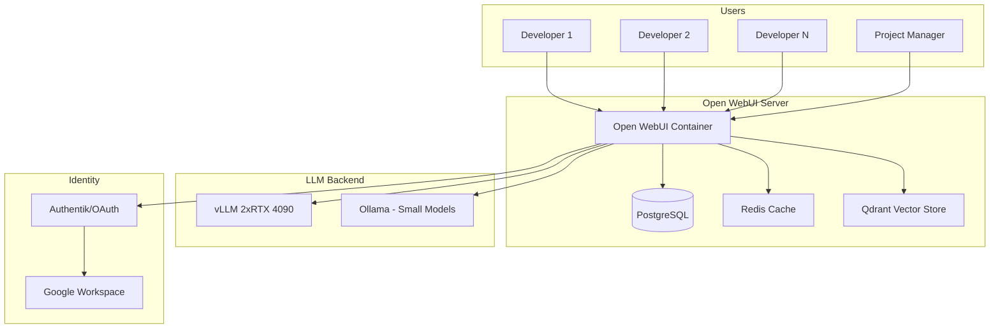

# [Jilid 2] Bab 7.3: Collaborative UI — Setup Open WebUI Registrasi Internal
> **Tipe Konten:** Praktikal — Tutorial Instalasi + Konfigurasi + Keamanan
> **Target Pembaca:** IT admin yang mengatur akses AI untuk tim small office

---

## 1. TUJUAN SUB-BAB
Pembaca mampu:
- Menginstal dan mengkonfigurasi Open WebUI untuk multi-user small office
- Mengatur registrasi internal dengan approval admin
- Mengelola workspace, roles, dan permissions per tim
- Mengintegrasikan Open WebUI dengan backend LLM multi-GPU

---

## 2. KERANGKA KONTEN (WAJIB DITULIS)

### A. Mengapa Open WebUI untuk Small Office? (1 paragraf)
- Open WebUI adalah self-hosted ChatGPT alternative dengan multi-user support
- Fitur kunci untuk small office: RBAC, shared channels, RAG bawaan, model switching
- Perbandingan dengan alternatif: Text Generation WebUI (single-user), Ollama WebUI (minimal)

### B. Arsitektur Deployment (1 paragraf + diagram)
- Open WebUI sebagai frontend, terhubung ke Ollama API dan vLLM endpoint
- Database SQLite/PostgreSQL untuk history user
- Redis untuk session management (opsional untuk scale)
- Forward auth ke Authentik/OAuth provider eksternal

### C. Multi-User Features (2-3 paragraf)
- **Registrasi Internal:** User daftar via halaman login, admin harus approve
- **Workspaces:** Pisah workspace per tim (Frontend, Backend, DevOps)
- **Channels:** Shared persistent chat room untuk diskusi tim
- **Global Knowledge:** Knowledge base bersama yang bisa diakses semua user
- **Role-Based Access:** Admin, User, Viewer — berbeda level akses

### D. Integrasi dengan Multi-GPU Backend (1 paragraf)
- Open WebUI bisa connect ke multiple backend: Ollama, vLLM, OpenAI-compatible
- Load balancing: routing request ke model berbeda berdasarkan beban
- Model fallback: jika model besar sibuk, alihkan ke model kecil

### E. Keamanan (1 paragraf)
- HTTPS wajib untuk akses kantor (self-signed atau Let's Encrypt)
- Environment variables untuk secret management
- Audit logging: siapa akses model apa kapan
- Rate limiting per user untuk cegah abuse

---

## 3. TABEL WAJIB

### Tabel A: Perbandingan Platform Collaborative UI

| Fitur | Open WebUI | Text Gen WebUI | Ollama WebUI | Langflow |
|:---|:---|:---|:---|:---|
| **Multi-User** | Ya (RBAC) | Tidak | Tidak | Tidak |
| **Registrasi + Approval** | Ya | - | - | - |
| **Workspaces/Channels** | Ya (Channels) | Tidak | Tidak | Tidak |
| **RAG Bawaan** | Ya | Plugin | Tidak | Ya |
| **Multi-Backend** | Ollama, vLLM, OpenAI | Transformers | Ollama only | Any |
| **API OpenAI Compatible** | Ya | Tidak | Tidak | Ya |
| **Audit Log** | Ya | Tidak | Tidak | Tidak |
| **SSO/OAuth** | Ya (via plugin) | Tidak | Tidak | Manual |

### Tabel B: Resource Usage Open WebUI

| Komponen | Minimum | Recommended | Untuk 20 User |
|:---|:---|:---|:---:|
| **CPU** | 2 core | 4 core | 8 core |
| **RAM** | 2 GB | 8 GB | 16 GB |
| **Storage** | 10 GB | 50 GB | 200 GB (termasuk RAG data) |
| **Database** | SQLite | PostgreSQL | PostgreSQL + Redis |

### Tabel C: Konfigurasi Environment Variable

| Variable | Fungsi | Nilai untuk Small Office |
|:---|:---|:---|
| `WEBUI_AUTH` | Aktifkan autentikasi | `True` |
| `WEBUI_SECRET_KEY` | Secret key untuk session | Random 32 char |
| `OLLAMA_BASE_URL` | Backend Ollama | `http://10.0.0.100:11434` |
| `OPENAI_API_BASE_URL` | Backend vLLM | `http://10.0.0.100:8000/v1` |
| `RAG_EMBEDDING_ENGINE` | Model embedding | `ollama` |
| `ENABLE_SIGNUP` | Izinkan registrasi | `True` (dengan approval) |
| `DEFAULT_MODELS` | Model default per user | `qwen3.6:27b` |

---

## 4. DIAGRAM/GAMBAR WAJIB

### Diagram 1: Arsitektur Open WebUI di Small Office (Mermaid)
- **File:** `assets/diagrams/j2-b7-s3-openwebui-architecture.mmd`
- **Isi Mermaid:**



### Gambar 2: Screenshot Dashboard Open WebUI Multi-Workspace
- **File:** `assets/images/jilid2/j2-b7-s3-openwebui-dashboard.png`
- **Isi:** Tampilan dashboard dengan sidebar workspace: "Frontend Team", "Backend Team", "General"

### Gambar 3: Flow Registrasi + Approval Admin
- **File:** `assets/diagrams/j2-b7-s3-registration-flow.mmd`
- **Isi:** User daftar -> Pending status -> Admin approve via panel -> User aktif

---

## 5. TUTORIAL / HANDS-ON (WAJIB)

### Tutorial A: Deploy Open WebUI dengan Docker Compose + PostgreSQL

```yaml
# docker-compose.yml
version: '3.8'

services:
  open-webui:
    image: ghcr.io/open-webui/open-webui:main
    container_name: open-webui
    restart: always
    ports:
      - "3000:8080"
    environment:
      - WEBUI_SECRET_KEY=${WEBUI_SECRET_KEY}
      - WEBUI_AUTH=True
      - ENABLE_SIGNUP=True
      - OLLAMA_BASE_URL=http://ollama:11434
      - OPENAI_API_BASE_URL=http://vllm:8000/v1
      - RAG_EMBEDDING_ENGINE=ollama
      - RAG_EMBEDDING_MODEL=nomic-embed-text
      - DATABASE_URL=postgresql://openwebui:password@db:5432/openwebui
    volumes:
      - open-webui-data:/app/backend/data
    depends_on:
      - db
    networks:
      - ai-net

  db:
    image: postgres:16-alpine
    environment:
      POSTGRES_DB: openwebui
      POSTGRES_USER: openwebui
      POSTGRES_PASSWORD: ${DB_PASSWORD}
    volumes:
      - postgres-data:/var/lib/postgresql/data
    networks:
      - ai-net

  ollama:
    image: ollama/ollama:latest
    container_name: ollama
    restart: always
    volumes:
      - ollama-data:/root/.ollama
    networks:
      - ai-net

volumes:
  open-webui-data:
  postgres-data:
  ollama-data:

networks:
  ai-net:
    driver: bridge
```

### Tutorial B: Setup Workspaces dan Channels

```bash
#!/bin/bash
# Setup awal workspace dan channel via API
WEBUI_URL="http://localhost:3000"
ADMIN_KEY="your-admin-api-key"

# Buat workspace
curl -X POST "$WEBUI_URL/api/workspaces" \
  -H "Authorization: Bearer $ADMIN_KEY" \
  -H "Content-Type: application/json" \
  -d '{
    "name": "Frontend Team",
    "description": "Frontend developers workspace",
    "models": ["ministral3:14b", "qwen3.6:27b", "deepseek-coder:6.7b"]
  }'

curl -X POST "$WEBUI_URL/api/workspaces" \
  -H "Authorization: Bearer $ADMIN_KEY" \
  -H "Content-Type: application/json" \
  -d '{
    "name": "Backend Team",
    "description": "Backend developers workspace",
    "models": ["deepseek-v4-flash", "qwen3:32b", "deepseek-coder:33b"]
  }'

# Buat channel umum
curl -X POST "$WEBUI_URL/api/channels" \
  -H "Authorization: Bearer $ADMIN_KEY" \
  -H "Content-Type: application/json" \
  -d '{
    "name": "general-ai",
    "description": "Diskusi AI umum semua tim"
  }'
```

### Tutorial C: Setup Rate Limiting per User

```python
# rate_limit.py — middleware rate limiting untuk Open WebUI
# Jalankan sebagai sidecar container
from flask import Flask, request, jsonify
import time
from collections import defaultdict

app = Flask(__name__)
user_requests = defaultdict(list)
RATE_LIMIT = 30  # requests per menit per user
WINDOW = 60      # detik

@app.before_request
def check_rate_limit():
    user = request.headers.get('X-User-ID', 'anonymous')
    now = time.time()
    window_start = now - WINDOW
    
    # Bersihkan request lama
    user_requests[user] = [t for t in user_requests[user] if t > window_start]
    
    if len(user_requests[user]) >= RATE_LIMIT:
        return jsonify({"error": "Rate limit exceeded"}), 429
    
    user_requests[user].append(now)

if __name__ == '__main__':
    app.run(port=5001)
```

---

## 6. STUDI KASUS (WAJIB)

### Studi Kasus: PT CodeCraft — Deploy Open WebUI untuk 15 Developer
- **Skenario:** Software house dengan 15 developer, 3 tim (Frontend 5, Backend 6, DevOps 4). Butuh platform AI terpusat.
- **Deployment:** Open WebUI + PostgreSQL di VPS kantor (Intel Xeon E-2388G, 64GB RAM). Backend vLLM di workstation dual RTX 4090.
- **Workspace Setup:** Frontend Team (Ministral 3 14B + Qwen-2.5-Coder-14B), Backend Team (Qwen3.6-27B + DeepSeek V4 Flash), DevOps Team (Mixtral-8x7B)
- **Registrasi:** User daftar via form, admin approve. Integrasi Google Workspace OAuth.
- **RAG Pipeline:** Masing-masing tim punya knowledge base sendiri (dokumentasi API, SOP deployment, code style guide)
- **Hasil:** Developer tidak perlu setup AI sendiri. Semua history chat tersimpan dan bisa dirujuk tim lain. Onboarding developer baru lebih cepat.
- **Biaya:** Open WebUI (gratis), server (Rp 20jt), maintenance (Rp 500rb/bulan)
- **Pembelajaran:** PostgreSQL lebih stabil dari SQLite untuk 15+ user. Redis diperlukan jika >20 user.

---

## 7. REFERENSI WAJIB (SOP: minimal 5 paper 5 tahun terakhir + DOI)

### Paper Jurnal/Konferensi

[1] **Open WebUI: Self-Hosted AI Platform for Teams**
```
@misc{openwebui2024,
  title   = {{Open WebUI}: An Extensible, Feature-Rich, and User-Friendly Self-Hosted {AI} Platform},
  author  = {Open WebUI Contributors},
  year    = {2024},
  url     = {https://github.com/open-webui/open-webui}
}
```
- Kaitan: Platform utama yang dibahas di sub-bab ini. Dokumentasi resmi sebagai acuan fitur dan konfigurasi.

[2] **Harmony: Privacy-Preserving Smart Home Assistant with Local LLM**
```
@article{chen2024harmony,
  title     = {Harmony: A Privacy-Preserving and Robust Smart Home Assistant Powered by Locally Deployable {Llama3-8B}},
  author    = {Chen, Yijie and others},
  journal   = {arXiv preprint arXiv:2410.14252},
  year      = {2024},
  doi       = {10.48550/arXiv.2410.14252},
  url       = {https://arxiv.org/abs/2410.14252}
}
```
- Kaitan: Arsitektur collaborative AI untuk multi-user — relevan untuk pendekatan shared AI interface.

[3] **Authenticated Delegation and Authorized AI Agents**
```
@article{south2025authenticated,
  title     = {Authenticated Delegation and Authorized {AI} Agents},
  author    = {South, Tobin and others},
  journal   = {arXiv preprint arXiv:2501.09674},
  year      = {2025},
  doi       = {10.48550/arXiv.2501.09674},
  url       = {https://arxiv.org/abs/2501.09674}
}
```
- Kaitan: Framework OAuth 2.0 dan OpenID Connect untuk delegasi akses AI. Penting untuk integrasi identity management Open WebUI.

[4] **Llama 2: Open Foundation and Fine-Tuned Chat Models**
```
@article{touvron2023llama2,
  title     = {{Llama} 2: Open Foundation and Fine-Tuned Chat Models},
  author    = {Touvron, Hugo and Martin, Louis and Stone, Kevin and others},
  journal   = {arXiv preprint arXiv:2307.09288},
  year      = {2023},
  doi       = {10.48550/arXiv.2307.09288},
  url       = {https://arxiv.org/abs/2307.09288}
}
```
- Kaitan: Model backbone yang umum digunakan di Open WebUI. Pemahaman arsitektur model membantu konfigurasi sistem.

[5] **On-Device LLM for Home Assistant: Intent Detection & Response Generation**
```
@article{lang2025ondevice,
  title     = {On-Device {LLMs} for Home Assistant: Dual Role in Intent Detection and Response Generation},
  author    = {Lang, Martin and others},
  journal   = {arXiv preprint arXiv:2502.12923},
  year      = {2025},
  doi       = {10.48550/arXiv.2502.12923},
  url       = {https://arxiv.org/abs/2502.12923}
}
```
- Kaitan: Studi multi-user LLM interface yang relevan untuk mendesain UX collaborative.

### Referensi Pendukung (Non-Paper/Dokumentasi)

[6] Open WebUI Documentation. *Authentication & SSO*. [https://docs.openwebui.com](https://docs.openwebui.com)

[11] **DeepSeek V4 Flash: Open Model 1M Context untuk Multi-User**
```
@misc{deepseek2026v4flash,
  title     = {{DeepSeek-V4} Flash: Efficient Open Mixture-of-Experts Language Model with 284B Parameters},
  author    = {{DeepSeek Team}},
  year      = {2026},
  url       = {https://api-docs.deepseek.com}
}
```
- Kaitan: Model 1M konteks dengan lisensi MIT — ideal untuk collaborative workspace dengan konteks percakapan panjang antar tim.

[12] **Ministral 3: Cascade Distillation Dense Models**
```
@misc{mistral2025ministral3,
  title     = {Ministral 3: Open Dense Language Models via Cascade Distillation},
  author    = {{Mistral AI Team}},
  year      = {2025},
  url       = {https://mistral.ai/news/ministral-3}
}
```
- Kaitan: Model 14B dense dengan Apache 2.0 — cocok untuk workspace frontend yang butuh latency rendah.

[7] Docker Compose Documentation. [https://docs.docker.com/compose](https://docs.docker.com/compose)

[8] PostgreSQL Documentation. [https://www.postgresql.org/docs](https://www.postgresql.org/docs)

[9] Nginx Reverse Proxy Documentation. [https://nginx.org/en/docs](https://nginx.org/en/docs)

[10] Ollama Multi-Model Support. [https://github.com/ollama/ollama](https://github.com/ollama/ollama)

### SOP Referensi
- WAJIB menyertakan minimal **5 referensi** (paper + dokumentasi) dengan DOI yang valid.
- Setiap konfigurasi di tutorial harus diverifikasi bisa running di environment target.
- Dokumentasi Open WebUI adalah sumber utama untuk sub-bab ini.
