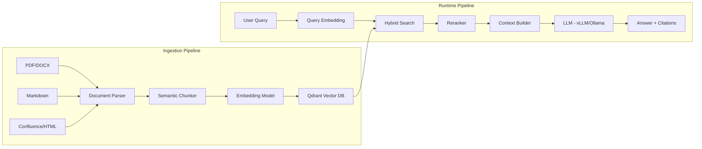

# [Jilid 2] Bab 7.4: Internal RAG System — AI ke Database SOP dan Dokumentasi Proyek
> **Tipe Konten:** Teknis — Pipeline RAG + Retrieval + Deployment
> **Target Pembaca:** Developer yang ingin membangun RAG internal untuk knowledge sharing tim

---

## 1. TUJUAN SUB-BAB
Pembaca mampu:
- Mendesain dan membangun RAG pipeline untuk dokumentasi internal dan SOP
- Memilih embedding model, vector database, dan chunking strategy yang tepat
- Mengintegrasikan RAG dengan Open WebUI dan vLLM/Ollama

---

## 2. KERANGKA KONTEN (WAJIB DITULIS)

### A. Kebutuhan RAG di Small Office (1 paragraf)
- Dokumentasi proyek berserakan di Google Docs, Confluence, GitHub Wiki, file lokal
- SOP perusahaan (HR, keuangan, operasional) butuh akses cepat
- Developer sering tanya ulang hal yang sudah didokumentasikan
- RAG = satu pintu tanya untuk semua knowledge base perusahaan

### B. Arsitektur Pipeline RAG (2-3 paragraf)
- **Ingestion:** PDF, Markdown, HTML, Confluence export -> chunking -> embedding -> simpan di vector DB
- **Retrieval:** Query user -> embedding query -> similarity search -> top-k chunks -> context
- **Generation:** Prompt + context -> LLM -> answer with citations
- **Chunking Strategy:** Semantic chunking (500-1000 tokens, overlap 10-20%) untuk dokumentasi teknis
- **Hybrid Search:** Vector + keyword (BM25) untuk coverage lebih baik

### C. Pilihan Embedding Model (1 paragraf)
- Multilingual: `intfloat/multilingual-e5-large` atau `BAAI/bge-m3` — support Bahasa Indonesia
- Ringan: `nomic-embed-text` (Ollama) — cukup untuk mayoritas kasus
- Kecil: `all-MiniLM-L6-v2` — cepat, akurasi lebih rendah
- Terbaru: `ministral-3-embed` (Mistral AI) — 14B backbone, Cascade Distillation untuk embedding, akurasi MTEB >65

### D. Pilihan Vector Database (1 paragraf)
- **Qdrant:** Performa terbaik, Rust-based, bisa self-hosted atau cloud
- **ChromaDB:** Sederhana, cocok untuk prototyping (<10GB data)
- **pgvector:** Tetap di PostgreSQL, tidak perlu DB terpisah
- Rekomendasi untuk small office: Qdrant self-hosted (Docker)

### E. Permission dan Keamanan (1 paragraf)
- Dokumen HR tidak boleh diakses developer biasa
- Implementasi metadata filtering: dokumen ditandai departemen, hanya user dari departemen itu yang bisa akses
- Enkripsi at-rest untuk dokumen sensitif

---

## 3. TABEL WAJIB

### Tabel A: Perbandingan Vector Database untuk Small Office

| Fitur | Qdrant | ChromaDB | pgvector | Weaviate |
|:---|:---|:---|:---|:---|
| **Deployment** | Docker | In-process | PostgreSQL | Docker |
| **Performance** | ***** | *** | **** | **** |
| **Hybrid Search** | Ya | Tidak | Ya (extension) | Ya |
| **Filtering** | Advanced | Basic | SQL-based | Advanced |
| **Multitenancy** | Ya | Limited | Ya | Ya |
| **Resource (RAM)** | ~1 GB | ~500 MB | ~Postgres | ~2 GB |
| **Backup** | Snapshot | File copy | pg_dump | Filesystem |
| **Rekomendasi** | **Best** | Prototype | If use PG | Enterprise |

### Tabel B: Perbandingan Embedding Model

| Model | Dimensi | Max Tokens | Ukuran | Kecepatan | Multilingual | Rekomendasi |
|:---|:---:|:---:|:---:|:---:|:---|:---|
| **nomic-embed-text** | 768 | 8192 | ~274 MB | Sangat cepat | Ya | Default Ollama |
| **bge-m3** | 1024 | 8192 | ~2.2 GB | Sedang | Ya (100+ bahasa) | Best accuracy |
| **multilingual-e5-large** | 1024 | 512 | ~2.3 GB | Lambat | Ya | Enterprise |
| **all-MiniLM-L6-v2** | 384 | 256 | ~80 MB | Sangat cepat | Tidak | Prototype ringan |
| **ministral-3-embed** | 1024 | 8192 | ~1.5 GB | Cepat | Ya (multilingual) | RAG small office |

### Tabel C: Estimasi Biaya Data RAG

| Tipe Dokumen | Volume | Ukuran | Chunk (500 token) | Embedding Storage | Biaya (Qdrant) |
|:---|:---:|:---:|:---:|:---:|:---:|
| **SOP Perusahaan** | 50 dokumen | ~10 MB | ~200 chunks | ~1.5 MB | Gratis |
| **Dokumentasi API** | 200 halaman | ~50 MB | ~1000 chunks | ~8 MB | Gratis |
| **Codebase Legacy** | 10.000 file | ~500 MB | ~50.000 chunks | ~400 MB | ~Rp 100rb/bln |
| **Jurnal/Paper** | 500 dokumen | ~250 MB | ~25.000 chunks | ~200 MB | ~Rp 50rb/bln |

---

## 4. DIAGRAM/GAMBAR WAJIB

### Diagram 1: Pipeline RAG End-to-End (Mermaid)
- **File:** `assets/diagrams/j2-b7-s4-rag-pipeline.mmd`
- **Isi Mermaid:**



### Gambar 2: Screenshot RAG Chat dengan Citation
- **File:** `assets/images/jilid2/j2-b7-s4-rag-citation.png`
- **Isi:** Screenshot Open WebUI menampilkan jawaban dengan sumber dokumen yang dicantumkan

### Gambar 3: Dashboard Monitoring RAG (Statistik)
- **File:** `assets/images/jilid2/j2-b7-s4-rag-monitor.png`
- **Isi:** Grafik jumlah query, retrieval latency, top documents accessed, user satisfaction

---

## 5. TUTORIAL / HANDS-ON (WAJIB)

### Tutorial A: Setup Qdrant + Pipeline Ingestion dengan Python

```python
# rag_ingestion.py — pipeline ingestion dokumentasi ke Qdrant
import os
from pathlib import Path
from qdrant_client import QdrantClient
from qdrant_client.models import VectorParams, Distance
from sentence_transformers import SentenceTransformer
import markdown
from bs4 import BeautifulSoup

# Inisialisasi
client = QdrantClient("localhost", port=6333)
model = SentenceTransformer("intfloat/multilingual-e5-large")

def chunk_markdown(filepath: str, chunk_size=500, overlap=100):
    with open(filepath, 'r') as f:
        text = f.read()
    # Simple semantic chunking berdasarkan heading
    chunks = []
    sections = text.split('\n## ')
    for section in sections:
        words = section.split()
        for i in range(0, len(words), chunk_size - overlap):
            chunk = ' '.join(words[i:i + chunk_size])
            if chunk.strip():
                chunks.append(chunk)
    return chunks

def index_folder(folder_path: str, collection_name: str):
    # Buat collection jika belum ada
    try:
        client.create_collection(
            collection_name=collection_name,
            vectors_config=VectorParams(size=1024, distance=Distance.COSINE)
        )
    except Exception:
        pass  # Collection sudah ada
    
    files = list(Path(folder_path).rglob("*.md")) + \
            list(Path(folder_path).rglob("*.mdx"))
    
    for filepath in files:
        chunks = chunk_markdown(str(filepath))
        if not chunks:
            continue
        embeddings = model.encode(chunks)
        
        points = []
        for i, (chunk, emb) in enumerate(zip(chunks, embeddings)):
            points.append({
                "id": hash(f"{filepath}_{i}") % (2**63),
                "vector": emb.tolist(),
                "payload": {
                    "source": str(filepath),
                    "chunk_index": i,
                    "department": folder_path.split('/')[-1],
                    "text": chunk
                }
            })
        client.upsert(collection_name=collection_name, points=points)
        print(f"Indexed {len(points)} chunks from {filepath}")

if __name__ == "__main__":
    # Index semua folder knowledge base
    for dept in ["sop", "api-docs", "codebase", "hr-policies"]:
        index_folder(f"/data/{dept}", f"kb-{dept}")
    print("Ingestion selesai!")
```

### Tutorial B: Query RAG dengan Filter Departemen

```python
# rag_query.py — query dengan filter departemen
from qdrant_client import QdrantClient
from sentence_transformers import SentenceTransformer

client = QdrantClient("localhost", port=6333)
model = SentenceTransformer("intfloat/multilingual-e5-large")

def query_rag(query: str, department: str = None, top_k: int = 5):
    query_vector = model.encode(query).tolist()
    
    # Filter berdasarkan departemen jika ada
    query_filter = None
    if department:
        from qdrant_client.models import Filter, FieldCondition, MatchValue
        query_filter = Filter(
            must=[FieldCondition(key="department", match=MatchValue(value=department))]
        )
    
    results = client.search(
        collection_name="kb-sop",
        query_vector=query_vector,
        query_filter=query_filter,
        limit=top_k
    )
    
    context = []
    sources = []
    for r in results:
        context.append(r.payload['text'])
        sources.append(f"{r.payload['source']} (relevance: {r.score:.2f})")
    
    return context, sources

# Contoh penggunaan
query = "Bagaimana prosedur reimbursement?"
context, sources = query_rag(query, department="sop")
print("Sumber:", sources)
```

### Tutorial C: Setup Auto-Sync RAG dengan GitHub Wiki

```yaml
# .github/workflows/sync-rag.yml
name: Sync RAG Knowledge Base

on:
  push:
    branches: [main]
    paths:
      - 'wiki/**'
      - 'docs/**'

jobs:
  sync-rag:
    runs-on: ubuntu-latest
    steps:
      - uses: actions/checkout@v4
      
      - name: Setup Python
        uses: actions/setup-python@v5
        with:
          python-version: '3.11'
      
      - name: Install dependencies
        run: pip install qdrant-client sentence-transformers
      
      - name: Run ingestion
        run: python rag_ingestion.py
        env:
          QDRANT_HOST: ${{ secrets.QDRANT_HOST }}
          QDRANT_API_KEY: ${{ secrets.QDRANT_API_KEY }}
```

---

## 6. STUDI KASUS (WAJIB)

### Studi Kasus: RAG untuk Startup Fintech (12 Developer)
- **Profil:** Startup fintech dengan 12 developer, 3 produk. Knowledge base: SOP compliance (50 dokumen), dokumentasi API (200 halaman), regulasi OJK (30 dokumen).
- **Hardware RAG:** Server dedicated: Ryzen 9 7950X, 64GB RAM, 2TB NVMe. Qdrant + PostgreSQL di Docker.
- **Embedding Model:** `bge-m3` (multilingual, support Bahasa Indonesia + Inggris untuk dokumen regulasi)
- **Chunking:** Semantic chunking dengan heading-based split, overlap 10%
- **Permission:** Dokumen HR dan compliance hanya bisa diakses admin. Developer hanya bisa akses dokumentasi teknis.
- **Integrasi:** Open WebUI RAG plugin terhubung ke Qdrant. User bisa tanya "Bagaimana cara integrasi payment gateway?" dan mendapat jawaban dari dokumentasi API.
- **Auto-Sync:** GitHub Actions trigger setiap ada push ke wiki repo. Dokumen Confluence disync manual via export periodik.
- **Hasil:** Developer tidak perlu tanya ulang ke senior. Waktu pencarian dokumentasi turun dari 15 menit jadi 30 detik. Compliance team puas karena dokumen tidak bocor.
- **Biaya:** Qdrant (gratis self-hosted), embedding model (gratis), storage Qdrant <5GB.

---

## 7. REFERENSI WAJIB (SOP: minimal 5 paper 5 tahun terakhir + DOI)

### Paper Jurnal/Konferensi

[1] **Retrieval-Augmented Generation for Large Language Models: A Survey**
```
@article{gao2023ragsurvey,
  title     = {Retrieval-Augmented Generation for Large Language Models: A Survey},
  author    = {Gao, Yunfan and Xiong, Yun and Gao, Xinyu and Jia, Kangxiang and Pan, Jinliang and Bi, Yuxi and Dai, Yi and Sun, Jiawei and Wang, Haofen},
  journal   = {arXiv preprint arXiv:2312.10997},
  year      = {2023},
  doi       = {10.48550/arXiv.2312.10997},
  url       = {https://arxiv.org/abs/2312.10997}
}
```
- Kaitan: Survey komprehensif tentang arsitektur RAG, termasuk retrieval, generator, dan augmentation techniques. Wajib dibaca penulis sub-bab.

[2] **Optimizing and Evaluating Enterprise RAG Solutions**
```
@article{wang2024enterpriserag,
  title     = {Optimizing and Evaluating Enterprise Retrieval-Augmented Generation Solutions},
  author    = {Wang, Yunjia and others},
  journal   = {arXiv preprint arXiv:2410.12812},
  year      = {2024},
  doi       = {10.48550/arXiv.2410.12812},
  url       = {https://arxiv.org/abs/2410.12812}
}
```
- Kaitan: Pengalaman praktis membangun RAG untuk enterprise documentation. Relevan dengan pendekatan RAG internal small office.

[3] **BEIR: A Heterogeneous Benchmark for Zero-shot Evaluation of Information Retrieval Models**
```
@inproceedings{thakur2021beir,
  title     = {{BEIR}: A Heterogeneous Benchmark for Zero-shot Evaluation of Information Retrieval Models},
  author    = {Thakur, Nandan and Reimers, Nils and R{\"u}ckl{\'e}, Andreas and Srivastava, Abhishek and Gurevych, Iryna},
  booktitle = {Advances in Neural Information Processing Systems (NeurIPS) Datasets and Benchmarks Track},
  year      = {2021},
  doi       = {10.48550/arXiv.2104.08663},
  url       = {https://arxiv.org/abs/2104.08663}
}
```
- Kaitan: Benchmark untuk embedding retrieval — jadi acuan pemilihan embedding model di Tabel B.

[4] **SPLADE: Sparse Lexical and Dense Retrieval**
```
@inproceedings{formal2021splade,
  title     = {{SPLADE}: Sparse Lexical and Expansion Model for First Stage Ranking},
  author    = {Formal, Thibault and Piwowarski, Benjamin and Clinchant, St{\'e}phane},
  booktitle = {Proceedings of the 44th International ACM SIGIR Conference on Research and Development in Information Retrieval},
  year      = {2021},
  doi       = {10.1145/3404835.3463098},
  url       = {https://doi.org/10.1145/3404835.3463098}
}
```
- Kaitan: Teknik hybrid retrieval (dense + sparse) yang jadi dasar hybrid search di Qdrant dan Weaviate.

[5] **Dense Passage Retrieval for Open-Domain Question Answering**
```
@inproceedings{karpukhin2020dpr,
  title     = {Dense Passage Retrieval for Open-Domain Question Answering},
  author    = {Karpukhin, Vladimir and O{\u{g}}uz, Barlas and Min, Sewon and Lewis, Patrick and Wu, Ledell and Edunov, Sergey and Chen, Danqi and Yih, Wen-tau},
  booktitle = {Proceedings of the 2020 Conference on Empirical Methods in Natural Language Processing (EMNLP)},
  year      = {2020},
  doi       = {10.18653/v1/2020.emnlp-main.550},
  url       = {https://aclanthology.org/2020.emnlp-main.550/}
}
```
- Kaitan: Fondasi dense retrieval yang digunakan semua modern RAG system. Landasan konseptual untuk pipeline embedding.

### Referensi Pendukung (Non-Paper/Dokumentasi)

[6] Qdrant Documentation. *Self-Hosted Vector Database*. [https://qdrant.tech/documentation](https://qdrant.tech/documentation)

[7] Sentence-Transformers. *Pretrained Embedding Models*. [https://www.sbert.net](https://www.sbert.net)

[8] LangChain RAG Documentation. [https://python.langchain.com/docs/use_cases/question_answering](https://python.langchain.com/docs/use_cases/question_answering)

[9] Unstructured.io. *Document Parsing for RAG*. [https://unstructured.io](https://unstructured.io)

[10] LlamaIndex Documentation. *RAG Pipeline*. [https://docs.llamaindex.ai](https://docs.llamaindex.ai)

[11] **Mistral AI Embedding Models with Cascade Distillation**
```
@misc{mistral2025ministral3embed,
  title     = {Ministral 3: Cascade Distillation for Efficient Embedding Models},
  author    = {{Mistral AI Team}},
  year      = {2025},
  url       = {https://mistral.ai/news/ministral-3}
}
```
- Kaitan: Teknik Cascade Distillation menghasilkan embedding model yang efisien dengan akurasi tinggi — cocok untuk RAG di small office dengan resource terbatas.

### SOP Referensi
- WAJIB menyertakan minimal **5 paper jurnal/konferensi** dengan DOI/arXiv yang valid.
- Setiap data di tabel embedding model WAJIB diverifikasi dari leaderboard (MTEB, BEIR).
- Implementasi pipeline RAG harus mengikuti best practices dari paper yang disitasi.
