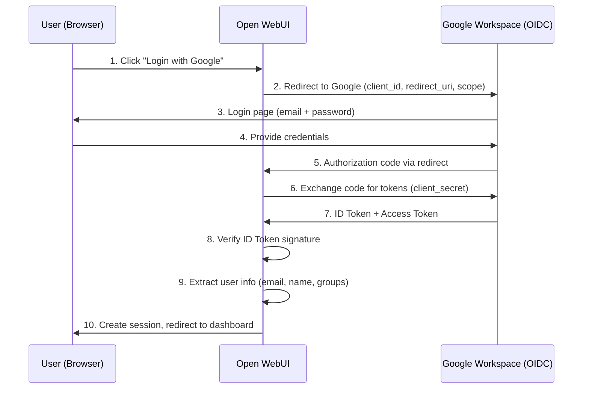

# [Jilid 2] Bab 7.6: Identity Management — Integrasi Google Workspace/Microsoft Login via OAuth
> **Tipe Konten:** Arsitektural — Keamanan + Konfigurasi SSO
> **Target Pembaca:** IT Admin yang mengatur akses tim ke platform AI small office

---

## 1. TUJUAN SUB-BAB
Pembaca mampu:
- Mengintegrasikan Google Workspace atau Microsoft 365 sebagai identity provider untuk AI platform
- Mengkonfigurasi OAuth 2.0 / OpenID Connect pada Open WebUI
- Menerapkan RBAC (Role-Based Access Control) untuk membedakan akses per tim

---

## 2. KERANGKA KONTEN (WAJIB DITULIS)

### A. Mengapa Identity Management Penting untuk Small Office? (1 paragraf)
- 9-20 user butuh autentikasi terpusat — tidak mungkin pakai password sharing
- Integrasi dengan akun Google/Microsoft yang sudah ada = zero onboarding friction
- Audit trail: tahu siapa akses model apa kapan
- RBAC: Developer akses coding model, Finance akses RAG SOP, Admin full access

### B. Arsitektur OAuth 2.0 dan OpenID Connect (2 paragraf)
- OpenID Connect (OIDC) = OAuth 2.0 + identity layer
- Flow: User login via Google -> Google beri ID token -> Open WebUI verifikasi -> Session dibuat
- Keamanan: token tidak pernah dikirim ke pihak ketiga, verifikasi di server internal
- PKCE (Proof Key for Code Exchange) untuk mencegah authorization code interception

### C. Pilihan Identity Provider untuk Small Office (1 paragraf)
- **Google Workspace:** Paling umum untuk startup Indonesia. Gratis sampai 300 user (Workspace Starter).
- **Microsoft Entra ID (Azure AD):** Untuk perusahaan yang sudah pakai Office 365. Mendukung SAML dan OIDC.
- **Authentik:** Self-hosted OSS IDP. Cocok jika ingin fleksibel tanpa dependensi cloud.
- **Authelia:** Lightweight, bisa integrate dengan LDAP existing.

### D. RBAC dan Scope Management (1 paragraf)
- Admin: full access, manage user, manage models
- Developer: akses coding assistant + RAG teknis
- Viewer: akses chat only, tidak bisa upload file
- Per-group pricing: bisa bedakan hak akses per departemen

### E. Security Considerations (1 paragraf)
- HTTPS wajib — OAuth redirect URI harus HTTPS (kecuali localhost)
- Vercel 2026 breach menunjukkan pentingnya OAuth token hygiene
- Revoke token periodik untuk akun non-aktif
- Monitor OAuth consent grants secara berkala

---

## 3. TABEL WAJIB

### Tabel A: Perbandingan Identity Provider

| Fitur | Google Workspace | Microsoft Entra ID | Authentik | Authelia |
|:---|:---|:---|:---|:---|
| **Tipe** | Cloud SaaS | Cloud SaaS | Self-hosted | Self-hosted |
| **Harga** | Gratis (starter) | Berbayar | Gratis (OSS) | Gratis (OSS) |
| **Protokol** | OIDC/OAuth 2 | OIDC, SAML | OIDC, SAML, LDAP | OIDC, LDAP |
| **MFA** | Ya (built-in) | Ya (Conditional) | Ya (TOTP/WebAuthn) | Ya (TOTP) |
| **RBAC** | Groups + OU | Groups + Roles | Groups | Groups |
| **User Sync** | Real-time | SCIM | LDAP sync | LDAP sync |
| **Self-hosted** | Tidak | Tidak | Ya | Ya |
| **Kompleksitas Setup** | Rendah | Sedang | Sedang | Rendah |

### Tabel B: Resource Identity Server

| Provider | CPU | RAM | Storage | Catatan |
|:---|:---:|:---:|:---:|:---|
| **Authentik (self-hosted)** | 2 core | 4 GB | 10 GB | Postgres + Redis |
| **Authelia** | 1 core | 512 MB | 1 GB | SQLite/Redis |
| **Google Workspace** | - | - | - | Cloud, tidak perlu server |

### Tabel C: Konfigurasi RBAC untuk Small Office

| Role | Akses Model | Akses RAG | Upload File | Admin Panel | Manajemen User |
|:---|:---|:---|:---|:---|:---:|
| **Super Admin** | Semua | Semua | Ya | Ya | Ya |
| **Developer** | Coding + General | Teknis | Ya | Tidak | Tidak |
| **Project Manager** | General + Chat | Dokumen Proyek | Ya | Tidak | Tidak |
| **Viewer** | Chat only | Read only | Tidak | Tidak | Tidak |

---

## 4. DIAGRAM/GAMBAR WAJIB

### Diagram 1: Flow OAuth 2.0 + OpenID Connect (Mermaid)
- **File:** `assets/diagrams/j2-b7-s6-oauth-flow.mmd`
- **Isi Mermaid:**



### Gambar 2: Screenshot Admin Panel — OAuth Settings
- **File:** `assets/images/jilid2/j2-b7-s6-oauth-settings.png`
- **Isi:** Halaman Admin Settings -> Connections -> OAuth di Open WebUI

### Gambar 3: Diagram RBAC per Departemen
- **File:** `assets/diagrams/j2-b7-s6-rbac.mmd`
- **Isi:** Tree diagram: Super Admin -> Developer (Frontend/Backend/DevOps), Project Manager, Viewer

---

## 5. TUTORIAL / HANDS-ON (WAJIB)

### Tutorial A: Integrasi Google Workspace OAuth di Open WebUI

```bash
#!/bin/bash
# 1. Buat project di Google Cloud Console
#    - APIs & Services -> Credentials -> Create OAuth 2.0 Client ID
#    - Application type: Web application
#    - Authorized redirect URI: https://ai.kantor.local/oauth/google/callback

# 2. Set environment variables di Open WebUI container
docker run -d \
  --name open-webui \
  -p 3000:8080 \
  -v open-webui:/app/backend/data \
  -e WEBUI_SECRET_KEY=your-secret-key \
  -e GOOGLE_CLIENT_ID=1234567890.apps.googleusercontent.com \
  -e GOOGLE_CLIENT_SECRET=GOCSPX-your-client-secret \
  -e GOOGLE_REDIRECT_URI=https://ai.kantor.local/oauth/google/callback \
  -e OAUTH_PROVIDERS=google \
  ghcr.io/open-webui/open-webui:main

# 3. Verifikasi: buka browser, coba login dengan Google
```

### Tutorial B: Integrasi Microsoft Entra ID (Azure AD)

```bash
#!/bin/bash
# 1. Setup di Azure Portal
#    App Registrations -> New Registration
#    Redirect URI: https://ai.kantor.local/oauth/microsoft/callback
#    Certificates & Secrets -> New client secret

# 2. Konfigurasi Open WebUI
MICROSOFT_CLIENT_ID="your-azure-client-id"
MICROSOFT_CLIENT_SECRET="your-azure-client-secret"
MICROSOFT_TENANT_ID="your-tenant-id"  # atau "common" untuk multi-tenant

docker run -d \
  --name open-webui \
  -p 3000:8080 \
  -v open-webui:/app/backend/data \
  -e WEBUI_SECRET_KEY=your-secret-key \
  -e MICROSOFT_CLIENT_ID=$MICROSOFT_CLIENT_ID \
  -e MICROSOFT_CLIENT_SECRET=$MICROSOFT_CLIENT_SECRET \
  -e MICROSOFT_TENANT_ID=$MICROSOFT_TENANT_ID \
  -e MICROSOFT_REDIRECT_URI=https://ai.kantor.local/oauth/microsoft/callback \
  -e OAUTH_PROVIDERS=microsoft \
  ghcr.io/open-webui/open-webui:main

# 3. Optional: sync Azure AD groups ke RBAC
#    Di Azure: buat App Role di Enterprise Application
```

### Tutorial C: Setup Authentik (Self-Hosted IDP) + Open WebUI

```yaml
# docker-compose.yml — Authentik + Open WebUI
version: '3.8'

services:
  authentik:
    image: ghcr.io/goauthentik/server:latest
    command: server
    environment:
      AUTHENTIK_SECRET_KEY: ${AUTHENTIK_SECRET_KEY}
      AUTHENTIK_POSTGRESQL__NAME: authentik
      AUTHENTIK_POSTGRESQL__USER: authentik
      AUTHENTIK_POSTGRESQL__PASSWORD: ${DB_PASS}
      AUTHENTIK_POSTGRESQL__HOST: postgres
    ports:
      - "9000:9000"
      - "9443:9443"
    volumes:
      - authentik-media:/media
    depends_on:
      - postgres
      - redis

  open-webui:
    image: ghcr.io/open-webui/open-webui:main
    ports:
      - "3000:8080"
    environment:
      WEBUI_SECRET_KEY: ${WEBUI_SECRET_KEY}
      # OIDC config untuk Authentik
      OAUTH_PROVIDERS: authentik
      OAUTH_OIDC_CLIENT_ID: open-webui
      OAUTH_OIDC_CLIENT_SECRET: ${OIDC_CLIENT_SECRET}
      OAUTH_OIDC_ISSUER_URL: https://auth.kantor.local/application/o/open-webui/
      OAUTH_OIDC_REDIRECT_URI: https://ai.kantor.local/oauth/oidc/callback
    volumes:
      - open-webui-data:/app/backend/data

  postgres:
    image: postgres:16-alpine
    environment:
      POSTGRES_DB: authentik
      POSTGRES_USER: authentik
      POSTGRES_PASSWORD: ${DB_PASS}
  
  redis:
    image: redis:alpine
```

---

## 6. STUDI KASUS (WAJIB)

### Studi Kasus: Integrasi Google Workspace untuk Startup 15 Orang
- **Profil:** Startup SaaS dengan 15 karyawan, semua pakai Google Workspace untuk email dan Docs.
- **Kebutuhan:** Login sekali (SSO) untuk akses Open WebUI, Tabby, dan internal wiki. Tidak mau karyawan bikin akun baru.
- **Setup:** Open WebUI + Authentik sebagai IDP bridge ke Google Workspace OIDC.
- **RBAC:**
  - Engineering (8 orang): akses coding model + RAG teknis + upload file
  - Product/Design (4 orang): akses chat + RAG dokumen produk
  - Ops/Finance (3 orang): akses chat + RAG SOP
  - Admin (Founder + CTO): full access
- **Group Sync:** Google Workspace groups disync via Authentik LDAP-like provider. Saat user dipecat dari Google Workspace, akses AI otomatis dicabut.
- **Hasil:** Zero onboarding — karyawan baru langsung bisa akses platform AI. Offboarding juga otomatis. Tidak ada shared password.
- **Pembelajaran:** Google OAuth sangat stabil. Masalah hanya terjadi saat Google Cloud Console tidak sengaja diubah config-nya.

---

## 7. REFERENSI WAJIB (SOP: minimal 5 paper 5 tahun terakhir + DOI)

### Paper Jurnal/Konferensi

[1] **OAuth 2.0 Authorization Framework: Security Considerations**
```
@misc{ietf2012oauth,
  title     = {The {OAuth} 2.0 Authorization Framework},
  author    = {Hardt, D.},
  howpublished = {IETF RFC 6749},
  year      = {2012},
  doi       = {10.17487/RFC6749},
  url       = {https://www.rfc-editor.org/rfc/rfc6749}
}
```
- Kaitan: Standar OAuth 2.0 yang menjadi dasar semua flow autentikasi di sub-bab ini.

[2] **OpenID Connect Core 1.0 Specification**
```
@misc{openid2014connect,
  title     = {{OpenID} Connect Core 1.0},
  author    = {Sakimura, N. and Bradley, J. and Jones, M. and de Medeiros, B. and Mortimore, C.},
  howpublished = {OpenID Foundation Specification},
  year      = {2014},
  url       = {https://openid.net/specs/openid-connect-core-1_0.html}
}
```
- Kaitan: Spesifikasi OpenID Connect yang menambahkan identity layer di atas OAuth 2.0.

[3] **Identity Management for Agentic AI: OpenID Foundation Whitepaper**
```
@article{south2025identity,
  title     = {Identity Management for Agentic {AI}: The New Frontier of Authorization, Authentication, and Security for an {AI} Agent World},
  author    = {South, Tobin and others},
  journal   = {OpenID Foundation Whitepaper},
  year      = {2025},
  doi       = {10.48550/arXiv.2510.25819},
  url       = {https://arxiv.org/abs/2510.25819}
}
```
- Kaitan: Whitepaper tentang identity management untuk AI agents. Relevan untuk RBAC di platform AI small office.

[4] **Authenticated Delegation and Authorized AI Agents**
```
@article{miller2025authdelegation,
  title     = {Authenticated Delegation and Authorized {AI} Agents},
  author    = {Miller, John and South, Tobin},
  journal   = {arXiv preprint arXiv:2501.09674},
  year      = {2025},
  doi       = {10.48550/arXiv.2501.09674},
  url       = {https://arxiv.org/abs/2501.09674}
}
```
- Kaitan: Framework ekstensi OAuth 2.0/OIDC untuk delegasi akses AI. Relevan untuk desain authorization di small office.

[5] **OAuth 2.0 for Browser-Based Applications**
```
@misc{ietf2020oauthbrowser,
  title     = {{OAuth} 2.0 for Browser-Based Applications},
  author    = {Denniss, W. and Bradley, J.},
  howpublished = {IETF BCP 216 / RFC 8628},
  year      = {2020},
  doi       = {10.17487/RFC8628},
  url       = {https://www.rfc-editor.org/rfc/rfc8628}
}
```
- Kaitan: Best practices OAuth untuk web apps — relevan dengan implementasi Open WebUI.

### Referensi Pendukung (Non-Paper/Dokumentasi)

[6] Google Workspace OAuth Documentation. [https://developers.google.com/identity/protocols/oauth2](https://developers.google.com/identity/protocols/oauth2)

[7] Microsoft Entra ID OAuth Documentation. [https://learn.microsoft.com/en-us/entra/identity-platform](https://learn.microsoft.com/en-us/entra/identity-platform)

[8] Authentik Documentation. [https://docs.goauthentik.io](https://docs.goauthentik.io)

[9] Open WebUI OAuth Configuration. [https://docs.openwebui.com/getting-started/env-configuration](https://docs.openwebui.com/getting-started/env-configuration)

[10] OWASP OAuth Security Cheat Sheet. [https://cheatsheetseries.owasp.org/cheatsheets/OAuth_Security_Cheat_Sheet.html](https://cheatsheetseries.owasp.org/cheatsheets/OAuth_Security_Cheat_Sheet.html)

### SOP Referensi
- WAJIB menyertakan minimal **5 referensi** (standard/IETF/paper) dengan DOI yang valid.
- Konfigurasi OAuth harus mengikuti best practices dari OWASP dan spesifikasi IETF.
- Dokumentasi resmi Google/Microsoft/Authentik adalah sumber utama untuk tutorial.
