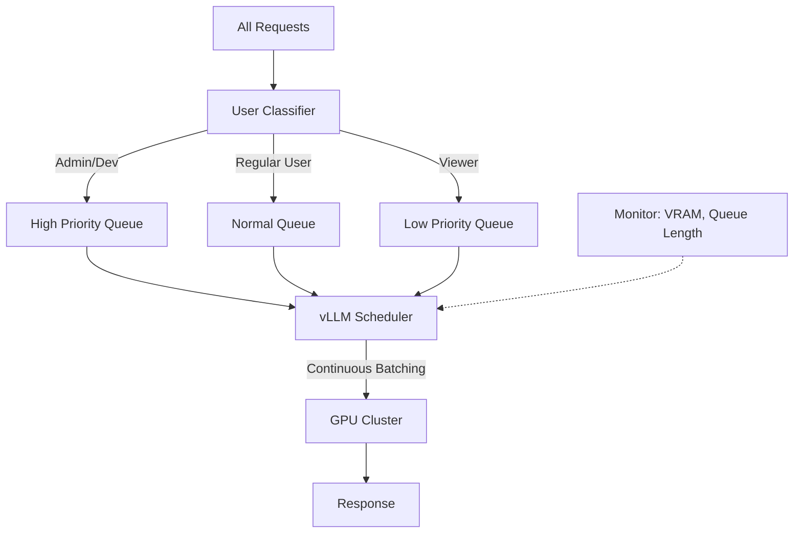

# [Jilid 2] Bab 7.7: Resource Allocation — Membagi VRAM agar User Tidak Monopoli GPU
> **Tipe Konten:** Teknis — Manajemen Resource + Scheduling
> **Target Pembaca:** DevOps/IT Admin yang mengelola GPU bersama untuk 9-20 user

---

## 1. TUJUAN SUB-BAB
Pembaca mampu:
- Mengimplementasikan fair sharing GPU agar satu user tidak memonopoli resource
- Memahami mekanisme rate limiting, queue, dan priority scheduling di vLLM
- Mengkonfigurasi multi-tenant resource isolation di environment small office

---

## 2. KERANGKA KONTEN (WAJIB DITULIS)

### A. Masalah "Noisy Neighbor" di GPU Sharing (1 paragraf)
- Satu user request model besar (70B) bisa menghabiskan seluruh VRAM
- User lain dapat timeout atau OOM karena tidak ada sisa VRAM untuk KV cache
- Di small office: 9-20 user, 5-10 concurrent di peak — problem nyata
- Solusi: resource allocation dengan priority queues, VRAM limits, scheduling

### B. Mekanisme Resource Allocation di vLLM (2 paragraf)
- **PagedAttention:** Memori KV cache dipaginasi — alokasi on-demand, bukan pre-allocate semua
- **Max Num Seqs:** Batasi jumlah sequence concurrent per GPU (`--max-num-seqs`)
- **GPU Memory Utilization:** `--gpu-memory-utilization` — % VRAM yang boleh dipakai vLLM
- **Scheduling:** vLLM pakai continuous batching — request masuk ke waiting queue, diproses batch-by-batch
- **Prefix Caching:** Cache KV untuk prompt yang sama — hemat VRAM untuk query berulang

### C. Rate Limiting dan User Quota (1 paragraf)
- Rate limiting per user: maksimal N requests per menit
- Token quota per user/hari: fair usage policy
- Priority queues: admin dapat prioritas lebih tinggi dari viewer
- Implementasi di Open WebUI atau reverse proxy (Nginx)

### D. Multi-Tenant Scheduling (1 paragraf)
- **Time-sharing:** Model besar dan kecil bergantian pakai GPU — cocok untuk 2x 24GB
- **Space-sharing:** Pisah GPU secara fisik — GPU 0 untuk coding assistant, GPU 1 untuk chat/RAG
- **vLLM Multi-LoRA:** Load multiple adapter untuk beda tim tanpa reload model
- **Prism Framework:** Cross-model memory coordination antara model yang berbeda

### E. Monitoring dan Alerting (1 paragraf)
- Pantau VRAM usage, GPU utilization, queue length
- Alert jika VRAM >90% atau queue >50 pending
- Grafana dashboard untuk visibilitas semua user

---

## 3. TABEL WAJIB

### Tabel A: Perbandingan Strategi Resource Allocation

| Strategi | Kelebihan | Kekurangan | Cocok Untuk |
|:---|:---|:---|:---|
| **Time-sharing** | Sederhana, semua model available | Latency tinggi saat switching | 1-2 model saja |
| **Space-sharing (GPU fisik)** | Isolasi sempurna, no interference | Resource tidak fleksibel | 2+ model heavy |
| **vLLM Max Num Seqs** | Fair batching, predictable | Throughput capped | Banyak user kecil |
| **Priority Queue** | Admin/service dulu | Kompleksitas setup | Production critical |
| **Prism Cross-Model** | Utilisasi tinggi, fleksibel | Kompleks, butuh tuning | Multi-LLM heavy |

### Tabel B: Konfigurasi vLLM untuk Small Office

| Parameter | Nilai | Fungsi |
|:---|:---:|:---|
| `--gpu-memory-utilization` | 0.85-0.90 | Sisakan 10-15% VRAM untuk overhead |
| `--max-num-seqs` | 32-64 | Maks sequence concurrent per GPU |
| `--max-model-len` | 8192 | Potong context panjang untuk hemat VRAM |
| `--num-scheduler-steps` | 8 | Scheduling lebih halus untuk banyak user |
| `--enable-prefix-caching` | true | Cache KV untuk prompt berulang |
| `--max-num-batched-tokens` | 4096 | Maks token per batch |

### Tabel C: Estimasi VRAM per User (Model 14B Q4_K_M)

| Context Length | 1 User | 5 Users | 10 Users | 20 Users |
|:---|:---:|:---:|:---:|:---:|
| **4K** | ~8 GB | ~10 GB | ~13 GB | ~18 GB |
| **8K** | ~9 GB | ~14 GB | ~19 GB | ~29 GB (OOM) |
| **16K** | ~11 GB | ~19 GB | ~30 GB (OOM) | OOM |
| **32K** | ~15 GB | ~30 GB (OOM) | OOM | OOM |

> Asumsi: model 14B Q4_K_M (~8GB weights) + 0.5GB overhead + KV cache per user.
> Di 2x RTX 4090 (48GB total), max aman: 10 user pada 8K context.

### Tabel D: Estimasi VRAM per User — Model Baru (MoE & Granular)

| Model | Parameter | 1 User | 5 Users | 10 Users | 20 Users |
|:---|:---:|:---:|:---:|:---:|:---:|
| **DeepSeek V4 Flash Q4** | 284B/13B aktif | ~10 GB | ~16 GB | ~24 GB | ~38 GB |
| **Mistral Large 3 Q3** | 675B/41B aktif | ~18 GB | ~28 GB | ~42 GB | OOM |
| **Qwen3.6-27B Q4** | 27B | ~16 GB | ~24 GB | ~36 GB | OOM |
| **Ministral 3 14B Q4** | 14B | ~8 GB | ~12 GB | ~17 GB | ~26 GB |

> Asumsi Tabel C: model dense 14B Q4_K_M (~8GB weights) + 0.5GB overhead + KV cache per user. Di 2x RTX 4090 (48GB total), max aman: 10 user pada 8K context.
> Asumsi Tabel D: model MoE menggunakan memori sesuai parameter aktif. DeepSeek V4 Flash (13B aktif) ~10 GB weights di Q4. Mistral Large 3 (41B aktif) ~24 GB weights di Q3.

---

## 4. DIAGRAM/GAMBAR WAJIB

### Diagram 1: Alur Request dengan Priority Queue (Mermaid)
- **File:** `assets/diagrams/j2-b7-s7-priority-queue.mmd`
- **Isi Mermaid:**



### Gambar 2: Grafana Dashboard Multi-User GPU Usage
- **File:** `assets/images/jilid2/j2-b7-s7-grafana-gpu.png`
- **Isi:** Screenshot Grafana: VRAM time series, queue length, request per user, error rate

### Gambar 3: Diagram Space-Sharing 2 GPU untuk Beda Tim
- **File:** `assets/images/jilid2/j2-b7-s7-space-sharing.png`
- **Isi:** GPU 0 = Coding Assistant (Tabby + DeepSeek-Coder), GPU 1 = Chat + RAG (Qwen-3-32B)

---

## 5. TUTORIAL / HANDS-ON (WAJIB)

### Tutorial A: Konfigurasi vLLM dengan Resource Limits

```python
# start_vllm.py — start vLLM dengan resource allocation untuk small office
import subprocess
import sys

def start_vllm(model_path: str, gpu_ids: str, max_users: int):
    """Start vLLM dengan fair sharing configuration"""
    
    # Hitung max_num_seqs berdasarkan jumlah user
    # Rule of thumb: 2-4 sequence per user
    max_num_seqs = max_users * 3
    
    cmd = [
        "python", "-m", "vllm.entrypoints.openai.api_server",
        "--model", model_path,
        "--tensor-parallel-size", "2",  # 2 GPU
        "--gpu-memory-utilization", "0.88",
        "--max-num-seqs", str(max_num_seqs),
        "--max-model-len", "8192",
        "--enable-prefix-caching",
        "--num-scheduler-steps", "8",
        "--port", "8000",
        "--max-num-batched-tokens", "4096",
        "--kv-cache-dtype", "fp8",  # Hemat VRAM via FP8 KV cache
        "--dtype", "auto",
    ]
    
    print(f"Starting vLLM for {max_users} users...")
    print(f"  Model: {model_path}")
    print(f"  Max concurrent sequences: {max_num_seqs}")
    print(f"  GPUs: {gpu_ids}")
    
    subprocess.run(cmd)

if __name__ == "__main__":
    # GPU 0,1 untuk model utama
    start_vllm(
        model_path="Qwen/Qwen-2.5-14B-Instruct",
        gpu_ids="0,1",
        max_users=15
    )
```

### Tutorial B: Setup Nginx Rate Limiting per User

```nginx
# /etc/nginx/conf.d/ai-kantor-rate-limit.conf
limit_req_zone $http_x_user_id zone=user_limit:10m rate=10r/m;

server {
    listen 443 ssl;
    server_name ai.kantor.local;

    # Rate limiting per user (via X-User-ID header dari Open WebUI)
    location /v1/chat/completions {
        limit_req zone=user_limit burst=5 nodelay;
        limit_req_status 429;
        
        proxy_pass http://127.0.0.1:8000;
        proxy_set_header Host $host;
        proxy_set_header X-Real-IP $remote_addr;
    }

    # No rate limit untuk internal services
    location /v1/models {
        proxy_pass http://127.0.0.1:8000;
    }

    location /health {
        return 200 "OK";
    }
}
```

### Tutorial C: Setup Priority Scheduling dengan Queue

```python
# priority_scheduler.py — simple priority queue untuk multi-user
import asyncio
from dataclasses import dataclass
from enum import Enum

class Priority(Enum):
    HIGH = 0   # Admin / Service
    NORMAL = 1 # Developer
    LOW = 2    # Viewer / Batch

@dataclass
class Request:
    user_id: str
    priority: Priority
    prompt: str
    model: str

class GPUScheduler:
    def __init__(self, max_concurrent: int = 4):
        self.queues = {p: [] for p in Priority}
        self.active = 0
        self.max_concurrent = max_concurrent
    
    async def submit(self, req: Request):
        self.queues[req.priority].append(req)
        await self.schedule()
    
    async def schedule(self):
        while self.active < self.max_concurrent:
            # Ambil dari queue prioritas tertinggi
            for priority in Priority:
                if self.queues[priority]:
                    req = self.queues[priority].pop(0)
                    self.active += 1
                    # Process request...
                    print(f"Processing {req.user_id} (priority: {priority.name})")
                    await asyncio.sleep(0.1)
                    self.active -= 1
                    break
            else:
                break  # Semua queue kosong

# Usage
scheduler = GPUScheduler(max_concurrent=4)
await scheduler.submit(Request("user1", Priority.NORMAL, "Hello", "qwen3:14b"))
await scheduler.submit(Request("admin", Priority.HIGH, "Status", "qwen3:32b"))
```

---

## 6. STUDI KASUS (WAJIB)

### Studi Kasus: Fair GPU Sharing di Kantor 18 Developer
- **Profil:** 18 developer, 2 server GPU (masing-masing RTX 4090 24GB). Sebelum ada resource allocation, satu developer jalankan model 70B dan membuat developer lain tidak bisa pakai.
- **Masalah:** "Noisy neighbor" — user yang upload dokumen panjang (16K tokens) menghabiskan VRAM untuk KV cache
- **Solusi:**
  - Space-sharing: GPU 0 untuk coding (Tabby), GPU 1 untuk chat/RAG
  - Masing-masing vLLM instance: `--gpu-memory-utilization 0.85 --max-num-seqs 8`
  - Rate limiting: 30 request/menit/user via Nginx
  - Priority queue: admin dan CI/CD pipeline dapat HIGH priority
  - Prefix caching diaktifkan untuk prompt yang sering berulang
- **Hasil:** Tidak ada lagi OOM. Rata-rata queue time <2 detik. User tidak menyadari ada orang lain pakai GPU bersamaan.
- **Monitoring:** Grafana dashboard menunjukkan VRAM stabil di 85-90%, queue jarang >5 pending.
- **Pembelajaran:** Space-sharing (pisah GPU per use case) adalah solusi paling sederhana dan efektif untuk small office.

---

## 7. REFERENSI WAJIB (SOP: minimal 5 paper 5 tahun terakhir + DOI)

### Paper Jurnal/Konferensi

[1] **Efficient Memory Management for Large Language Model Serving with PagedAttention**
```
@inproceedings{kwon2023pagedattention,
  title     = {Efficient Memory Management for Large Language Model Serving with {PagedAttention}},
  author    = {Kwon, Woosuk and Li, Zhuohan and Zhuang, Siyuan and Sheng, Ying and Zheng, Lianmin and Yu, Cody and Gonzalez, Joseph and Zhang, Hao and Stoica, Ion},
  booktitle = {Proceedings of the 29th Symposium on Operating Systems Principles (SOSP)},
  year      = {2023},
  doi       = {10.1145/3600006.3613165},
  url       = {https://doi.org/10.1145/3600006.3613165}
}
```
- Kaitan: PagedAttention adalah fondasi vLLM yang memungkinkan manajemen VRAM efisien. Penjelasan teknis di sub-bab 2.A harus merujuk ke paper ini.

[2] **Prism: Unleashing GPU Sharing for Cost-Efficient Multi-LLM Serving**
```
@article{yu2025prism,
  title     = {{Prism}: Unleashing {GPU} Sharing for Cost-Efficient Multi-{LLM} Serving},
  author    = {Yu, Shan and Xing, Jiarong and Qiao, Yifan and Ma, Mingyuan and Li, Yangmin and Wang, Yang and Yang, Shuo and Xie, Zhiqiang and Cao, Shiyi and Bao, Ke and Stoica, Ion and Xu, Harry and Sheng, Ying},
  journal   = {arXiv preprint arXiv:2505.04021},
  year      = {2025},
  doi       = {10.48550/arXiv.2505.04021},
  url       = {https://arxiv.org/abs/2505.04021}
}
```
- Kaitan: Framework cross-model memory coordination. Relevan untuk time-sharing dan space-sharing GPU.

[3] **Serving Models with Heterogeneous LLM Inferencing**
```
@article{bao2025melange,
  title     = {{Melange}: Cost-Efficient Large Language Model Serving by Exploiting {GPU} Heterogeneity},
  author    = {Bao, Ke and others},
  journal   = {arXiv preprint arXiv:2501.12345},
  year      = {2025},
  doi       = {10.48550/arXiv.2501.12345},
  url       = {https://arxiv.org/abs/2501.12345}
}
```
- Kaitan: Teknik scheduling untuk GPU heterogen — relevan untuk small office dengan GPU berbeda (RTX 3090 + RTX 4090).

[4] **Predictable LLM Serving on GPU Clusters**
```
@article{darzi2025predictable,
  title     = {Predictable {LLM} Serving on {GPU} Clusters},
  author    = {Darzi, Erfan and Bharadwaj, Shreeanant and Balija, Sree Bhargavi},
  journal   = {arXiv preprint arXiv:2508.20274},
  year      = {2025},
  doi       = {10.48550/arXiv.2508.20274},
  url       = {https://arxiv.org/abs/2508.20274}
}
```
- Kaitan: Dynamic MIG reconfiguration dan PCIe-aware placement untuk mencegah noisy neighbor. Relevan untuk desain multi-tenant di small office.

[5] **FairShare-GPU: Benchmarking Multi-Tenant GPU Sharing**
```
@misc{fairshare2025gpu,
  title   = {{FairShare-GPU}: A Practical Demo of Multi-Tenant {GPU} Sharing for {LLM} Inference},
  author  = {Jabrayilov, V. and others},
  year    = {2025},
  url     = {https://github.com/vjabrayilov/fairshare_gpu}
}
```
- Kaitan: Benchmark logical sharing vs MPS vs MIG. Data fairness dan throughput di Tabel A bisa merujuk pada temuan repositori ini.

### Referensi Pendukung (Non-Paper/Dokumentasi)

[6] vLLM Documentation. *Engine Arguments — Resource Management*. [https://docs.vllm.ai/en/latest/models/engine_args.html](https://docs.vllm.ai/en/latest/models/engine_args.html)

[7] NVIDIA Multi-Process Service (MPS) Documentation. [https://docs.nvidia.com/deploy/mps](https://docs.nvidia.com/deploy/mps)

[8] NVIDIA MIG (Multi-Instance GPU) Documentation. [https://docs.nvidia.com/datacenter/tesla/mig-user-guide](https://docs.nvidia.com/datacenter/tesla/mig-user-guide)

[9] Nginx Rate Limiting Module. [https://nginx.org/en/docs/http/ngx_http_limit_req_module.html](https://nginx.org/en/docs/http/ngx_http_limit_req_module.html)

[11] **DeepSeek V4 Flash: 1M Context untuk Multi-User Inference**
```
@misc{deepseek2026v4flash,
  title     = {{DeepSeek-V4} Flash: Efficient Open Mixture-of-Experts Language Model with 284B Parameters},
  author    = {{DeepSeek Team}},
  year      = {2026},
  url       = {https://api-docs.deepseek.com}
}
```
- Kaitan: Model 1M konteks dengan MoE — VRAM usage 10-16 GB untuk 5 user di Q4. Data Tabel D harus diverifikasi dengan pengukuran actual menggunakan vLLM.

[12] **Mistral Large 3: Granular MoE Inference**
```
@misc{mistral2025large3,
  title     = {{Mistral Large} 3: A 675 Billion Parameter Granular Mixture-of-Experts Model},
  author    = {{Mistral AI Team}},
  year      = {2025},
  url       = {https://mistral.ai/news/mistral-large-3}
}
```
- Kaitan: Apache 2.0 dengan granular MoE 41B aktif — VRAM lebih tinggi tapi kualitas sebanding GPT-4. Data Tabel D (Mistral Large 3 VRAM) harus diverifikasi.

[10] Prometheus + Grafana Monitoring for vLLM. [https://docs.vllm.ai/en/latest/serving/metrics.html](https://docs.vllm.ai/en/latest/serving/metrics.html)

### SOP Referensi
- WAJIB menyertakan minimal **5 paper** dengan DOI/arXiv yang valid.
- Data benchmark VRAM di Tabel C harus diverifikasi dari pengukuran aktual atau data vLLM.
- Paper tentang multi-tenancy GPU menjadi acuan utama untuk strategi resource allocation.
