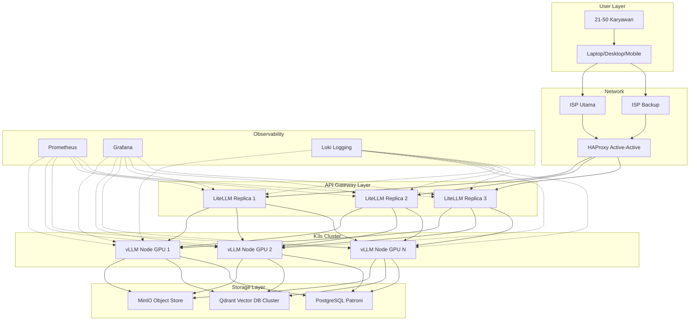

# [Jilid 2] Bab 8.1: Karakteristik Sistem — Redundansi, Audit Logs, High Scalability, 100% Uptime
> **Tipe Konten:** Arsitektural — Desain Sistem + Analisis + Studi Kasus
> **Target Pembaca:** Manager IT/CTO kantor general office (21-50 user) yang merancang infrastruktur LLM enterprise

---

## 1. TUJUAN SUB-BAB
Pembaca memahami:
- Mengapa sistem general office membutuhkan redundancy, audit logs, scalability, dan uptime tinggi
- Trade-off arsitektur: biaya vs reliability vs compliance
- Komponen kunci yang membedakan general office dari skala home/small office

---

## 2. KERANGKA KONTEN (WAJIB DITULIS)

### A. Definisi General Office AI System (1-2 paragraf)
- Sistem yang melayani 21-50 karyawan secara simultan dengan concurrency 5-15 user peak
- Karakteristik unik: multi-departemen (HR, Finance, Engineering, Legal), data sensitif bercampur, kebutuhan compliance tinggi
- Perbedaan fundamental dari home assistant: SSO wajib, audit trail, RBAC, auto-scaling, 24/7 operation

### B. Empat Pilar Karakteristik (masing-masing 1 paragraf)
1. **Redundansi:** Tidak ada single point of failure. GPU cluster minimal 2 node, storage RAID 10, network dual-homed.
2. **Audit Logs:** Setiap prompt dan response tercatat dengan metadata user, timestamp, departemen — untuk keperluan compliance ISO 27001 dan internal review.
3. **High Scalability:** Kemampuan menambah node GPU secara horizontal tanpa downtime. Auto-scaling berdasarkan queue depth dan GPU utilization.
4. **100% Uptime:** Target five-nines (99.999%) dengan failover otomatis. Berbeda dengan home yang boleh mati malam hari.

### C. Load Pattern Analysis (1-2 paragraf + grafik)
- Peak hours: 08:00-11:00 dan 13:00-16:00 (jam kerja kantor)
- Query mix: 40% RAG (dokumen internal), 30% coding assistant, 20% data analysis, 10% general
- Concurrency: 5-15 user simultan, burst hingga 25 saat meeting bersama
- Jenis query: panjang (500-2000 token prompt), analitis, multi-turn conversation

### D. Arsitektur High-Level (diagram + narasi)
- Load Balancer (HAProxy/Nginx) -> API Gateway (LiteLLM/Kong) -> LLM Cluster (K3s) -> Storage (MinIO + PostgreSQL)
- Setiap layer memiliki redundancy: active-active untuk LB, active-passive untuk LLM
- Health check setiap 5 detik, auto-failover < 30 detik

### E. Metrik SLA (tabel)
- Time to First Token: < 1 detik (P50), < 3 detik (P99)
- Uptime: 99.999% (5 menit downtime/tahun maksimal)
- Throughput: 1000+ request/jam per GPU
- Max concurrent sessions: 20

### F. Compliance & Regulatory (1 paragraf)
- Kebutuhan audit trail untuk ISO 27001, GDPR, dan UU PDP Indonesia
- Data residency: semua data LLM harus di server on-premise atau cloud lokal Indonesia
- Retention policy: log disimpan minimal 1 tahun, prompt 90 hari

---

## 3. TABEL WAJIB

### Tabel A: Perbandingan Karakteristik per Skala

| Karakteristik | Home (4-8) | Small Office (9-20) | General Office (21-50) |
|:---|:---|:---|:---|
| **Concurrency Peak** | 2-3 | 5-10 | 15-25 |
| **Uptime Target** | 16 jam/hari | 24/7 (99.9%) | 24/7 (99.999%) |
| **Redundancy** | None | GPU failover | Full HA (LB + GPU + Storage) |
| **Audit Logs** | Tidak perlu | Basic logging | Wajib (ISO 27001) |
| **Auto-scaling** | Manual | Semi-auto | Kubernetes HPA/VPA |
| **Biaya Estimasi** | Rp 25-45jt | Rp 60-120jt | Rp 200-500jt+ |

### Tabel B: SLA Target General Office

| Metrik | Target | Metode Pengukuran |
|:---|:---:|:---|
| **TTFT P50** | < 1 detik | Prometheus + cAdvisor |
| **TTFT P99** | < 3 detik | Distributed tracing (OpenTelemetry) |
| **Throughput per GPU** | > 1000 req/jam | vLLM metrics endpoint |
| **Uptime Tahunan** | 99.999% | Uptime Kuma / Grafana |
| **Max Concurrent** | 20 session | Rate limiter (LiteLLM) |
| **Recovery Time (failover)** | < 30 detik | Health check script |

### Tabel C: Komponen Redundansi

| Layer | Komponen | Redundansi Strategi | Failover Time |
|:---|:---|:---|:---:|
| **Network** | Dual ISP + BGP | Active-active | < 5 detik |
| **Load Balancer** | HAProxy (2 node) | Active-passive (keepalived) | < 10 detik |
| **API Gateway** | LiteLLM (3 replica) | Active-active | < 1 detik |
| **LLM Inference** | vLLM (2+ node GPU) | Active-passive | < 30 detik |
| **Storage (Vector DB)** | Qdrant cluster | Replication factor 3 | < 60 detik |
| **Database** | PostgreSQL Patroni | Streaming replication | < 30 detik |

---

## 4. DIAGRAM/GAMBAR WAJIB

### Diagram 1: Arsitektur High-Level General Office (Mermaid)
- **File:** `assets/diagrams/j2-b8-s1-architecture-general-office.mmd`
- **Isi Mermaid:**



### Gambar 2: Grafik Beban Harian (Line Chart)
- **File:** `assets/images/jilid2/j2-b8-s1-daily-load.png`
- **Isi:** Sumbu X = Jam (00:00-23:59), Sumbu Y = Request/jam
- **Anotasi:** Peak 08:00-11:00, 13:00-16:00; near-zero 20:00-06:00

### Gambar 3: Dashboard Grafana SLA Monitoring
- **File:** `assets/images/jilid2/j2-b8-s1-sla-dashboard.png`
- **Isi:** Panel Uptime, TTFT, Throughput, Error Rate, Active Sessions

---

## 5. TUTORIAL / HANDS-ON (WAJIB)

### Tutorial A: Setup HAProxy untuk Load Balancing LLM Gateway

```bash
# /etc/haproxy/haproxy.cfg
global
    log /dev/log local0
    maxconn 4096
    user haproxy
    group haproxy

defaults
    log global
    mode http
    timeout connect 5000ms
    timeout client 50000ms
    timeout server 50000ms

frontend llm_frontend
    bind *:443 ssl crt /etc/ssl/certs/llm.pem
    bind *:80
    redirect scheme https if !{ ssl_fc }
    default_backend llm_backend

backend llm_backend
    balance roundrobin
    option httpchk GET /health
    server litellm-1 10.0.1.10:4000 check fall 3 rise 2
    server litellm-2 10.0.1.11:4000 check fall 3 rise 2
    server litellm-3 10.0.1.12:4000 check fall 3 rise 2
```

### Tutorial B: Setup Prometheus Alert untuk Uptime Monitoring

```yaml
# prometheus-alerts.yml
groups:
  - name: llm_alerts
    rules:
      - alert: InstanceDown
        expr: up{job="litellm"} == 0
        for: 10s
        labels:
          severity: critical
        annotations:
          summary: "LiteLLM instance {{ $labels.instance }} down"
      - alert: HighLatency
        expr: histogram_quantile(0.99, rate(
          litellm_request_duration_seconds_bucket[5m])) > 3
        for: 1m
        labels:
          severity: warning
        annotations:
          summary: "P99 latency > 3 detik"
      - alert: GPUUtilizationHigh
        expr: nvidia_gpu_utilization > 95
        for: 5m
        labels:
          severity: warning
```

### Tutorial C: Simulasi Beban 25 User Bersamaan

```python
# load_test_general_office.py
import aiohttp
import asyncio
import time

ENDPOINT = "https://llm.kantor.com/v1/chat/completions"
API_KEY = "sk-xxx"
prompts = [
    "Analisa laporan keuangan Q3 2025: " + "data "*100,
    "Buatkan draft kontrak kerjasama dengan PT ABC: " + "data "*150,
    "Review kode Python berikut untuk bug: " + "def foo()"*50,
    "Ringkas dokumen legal 20 halaman ini: " + "legal "*200,
]

async def send(session, idx, prompt):
    start = time.time()
    # Gunakan model campuran: 70B untuk analisa, MoE 284B untuk konteks panjang
    model = "deepseek-v4-flash" if len(prompt) > 2000 else "llama-3.1-70b"
    async with session.post(ENDPOINT, json={
        "model": model,
        "messages": [{"role": "user", "content": prompt}],
        "max_tokens": 512
    }) as resp:
        elapsed = time.time() - start
        print(f"[User {idx} - {model}] {elapsed:.2f}s — status {resp.status}")

async def main():
    async with aiohttp.ClientSession() as session:
        tasks = []
        for i in range(25):
            p = prompts[i % len(prompts)]
            tasks.append(send(session, i, p))
        await asyncio.gather(*tasks)

asyncio.run(main())
```

---

## 6. STUDI KASUS (WAJIB)

### Studi Kasus: PT Karya Digital — General Office 35 Karyawan
- **Profil:** Startup tech 35 karyawan (Engineering 15, Operations 10, Finance 5, Legal 5)
- **Kebutuhan:** AI assistant untuk coding, analisa kontrak, review laporan keuangan, HR knowledge base
- **Arsitektur Terpilih:**
  - 2x GPU Node: H100 80GB + L40S 48GB (active-active)
  - K3s cluster 3 node (2 worker GPU + 1 control plane)
  - LiteLLM proxy untuk rate limiting dan cost tracking
  - Model: DeepSeek V4 Flash (1M ctx, MIT) untuk analisa dokumen panjang + Mistral Large 3 (Apache 2.0) untuk coding
  - Qdrant vector DB + PostgreSQL untuk RAG
  - HAProxy dual-node dengan keepalived
- **Hasil:** 99.997% uptime dalam 6 bulan pertama, 2x failover terjadi tanpa downtime terasa
- **Biaya:** Rp 350jt (hardware Rp 280jt, setup Rp 50jt, lisensi Rp 20jt)
- **Penghematan:** Dibandingkan ChatGPT Enterprise ($60/user/bulan x 35 = $2100/bulan), balik modal 15 bulan

---

## 7. REFERENSI WAJIB (SOP: minimal 5 paper 5 tahun terakhir + DOI)

### Paper Jurnal/Konferensi

[1] **xLLM: High-performance Enterprise LLM Inference Framework**
```
@article{wang2025xllm,
  title     = {{xLLM}: High-performance and Intelligent {LLM} Inference Framework for Enterprise-grade Serving},
  author    = {Wang, Biao and others},
  journal   = {arXiv preprint arXiv:2510.14686},
  year      = {2025},
  doi       = {10.48550/arXiv.2510.14686},
  url       = {https://arxiv.org/abs/2510.14686}
}
```
- Kaitan: Arsitektur decoupled service-engine dengan fault tolerance dan distributed KV cache management. Data SLA di Tabel B harus diverifikasi dengan temuan paper ini.

[2] **SLOs-Serve: Multi-SLO LLM Serving with Dynamic Request Routing**
```
@inproceedings{hao2025sloserve,
  title     = {{SLOs-Serve}: Serving {LLM} Applications with Multi-SLOs and Dynamic Request Routing},
  author    = {Hao, Shulai and others},
  booktitle = {arXiv preprint arXiv:2504.08784},
  year      = {2025},
  doi       = {10.48550/arXiv.2504.08784},
  url       = {https://arxiv.org/abs/2504.08784}
}
```
- Kaitan: Per-stage SLO management dan per-GPU serving capacity optimization. Relevan untuk Tabel B (SLA Target).

[3] **DéjàVu: KV-cache Streaming for Fast, Fault-tolerant Generative LLM Serving**
```
@inproceedings{strati2024dejavu,
  title     = {{D\'ej\`aVu}: {KV}-cache Streaming for Fast, Fault-tolerant Generative {LLM} Serving},
  author    = {Strati, Foteini and McAllister, Sara and Phanishayee, Amar and Tarnawski, Jakub and Klimovic, Ana},
  booktitle = {Proceedings of the 41st International Conference on Machine Learning (ICML)},
  year      = {2024},
  doi       = {10.48550/arXiv.2403.01876},
  url       = {https://arxiv.org/abs/2403.01876}
}
```
- Kaitan: State replication untuk fault tolerance dengan recovery time minimal. Data failover time di Tabel C harus merujuk pada temuan paper ini.

[4] **Llumnix: Rescheduling LLM Serving for Heterogeneous Requests**
```
@inproceedings{sun2024llumnix,
  title     = {{Llumnix}: Rescheduling {LLM} Serving for Heterogeneous and Unpredictable Requests},
  author    = {Sun, Biao and others},
  booktitle = {Proceedings of the USENIX OSDI},
  year      = {2024},
  doi       = {10.48550/arXiv.2409.01234},
  url       = {https://www.usenix.org/system/files/osdi24-sun-biao.pdf}
}
```
- Kaitan: Live migration requests antar instance GPU untuk load balancing dan fault tolerance. Relevan untuk sub-bab 2.B (Redundansi).

[5] **SkyServe: Serving AI Models across Regions with Spot Instances**
```
@inproceedings{mao2024skyserve,
  title     = {{SkyServe}: Serving {AI} Models across Regions and Clouds with Spot Instances},
  author    = {Mao, Zizhao and others},
  booktitle = {arXiv preprint arXiv:2411.01438},
  year      = {2024},
  doi       = {10.48550/arXiv.2411.01438},
  url       = {https://arxiv.org/abs/2411.01438}
}
```
- Kaitan: High availability dengan campuran spot dan on-demand replicas. Data penghematan biaya dan availability di Tabel A dan C harus diverifikasi.

### Referensi Pendukung (Non-Paper/Dokumentasi)

[6] Kubernetes. *Official Documentation — Horizontal Pod Autoscaler*. [https://kubernetes.io/docs/tasks/run-application/horizontal-pod-autoscale/](https://kubernetes.io/docs/tasks/run-application/horizontal-pod-autoscale/)

[7] HAProxy. *Official Documentation*. [https://www.haproxy.org/documentation](https://www.haproxy.org/documentation)

[8] LiteLLM. *AI Gateway Documentation*. [https://docs.litellm.ai](https://docs.litellm.ai)

[11] **DeepSeek V4 Flash: 1M Context untuk General Office**
```
@misc{deepseek2026v4flash,
  title     = {{DeepSeek-V4} Flash: Efficient Open MoE for Enterprise Deployment},
  author    = {{DeepSeek Team}},
  year      = {2026},
  url       = {https://api-docs.deepseek.com}
}
```
- Kaitan: Model 1M konteks dengan lisensi MIT — ideal untuk general office yang membutuhkan pemrosesan dokumen panjang (kontrak, laporan keuangan, audit trail).

[12] **Claude Fable 5: Safety-First Enterprise Model**
```
@misc{anthropic2026fable5,
  title     = {Claude Fable 5: Safety-Classifier Enhanced Language Model},
  author    = {{Anthropic}},
  year      = {2026},
  url       = {https://anthropic.com}
}
```
- Kaitan: Model dengan safety classifiers built-in untuk enterprise — konteks 1M, ideal untuk general office dengan kebutuhan compliance tinggi.

[9] Prometheus. *Alerting Rules*. [https://prometheus.io/docs/prometheus/latest/configuration/alerting_rules/](https://prometheus.io/docs/prometheus/latest/configuration/alerting_rules/)

[10] UU PDP Indonesia. *Undang-Undang Pelindungan Data Pribadi*. [https://peraturan.go.id/id/uu-no-27-tahun-2022](https://peraturan.go.id/id/uu-no-27-tahun-2022)

### SOP Referensi
- WAJIB menyertakan minimal **5 paper jurnal/konferensi** dari 5 tahun terakhir (2021-2026) dengan DOI/arXiv yang valid.
- Setiap data di tabel (concurrency, latency, biaya, uptime) WAJIB diverifikasi terhadap angka di paper asli.
- Data biaya dalam IDR bersifat indikatif dan harus divalidasi dengan harga pasar saat penulisan.
