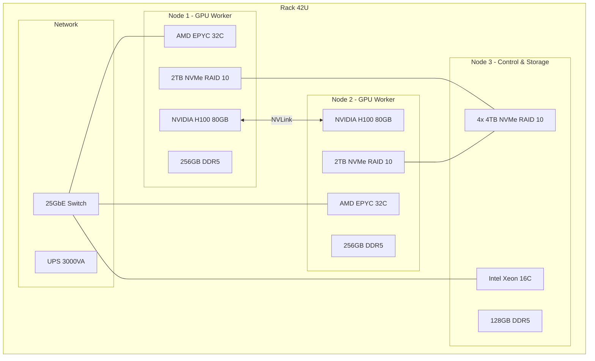

# [Jilid 2] Bab 8.2: Hardware — Rackmount Server (A100/H100/L40S) atau Cluster Multi-Node
> **Tipe Konten:** Teknis — Spesifikasi Hardware + Komparasi + Panduan Pembelian
> **Target Pembaca:** IT Manager/DevOps yang memilih hardware untuk general office 21-50 user

---

## 1. TUJUAN SUB-BAB
Pembaca memahami:
- Perbedaan A100, H100, dan L40S dalam konteks inference LLM general office
- Kapan cukup single-node vs multi-node cluster
- Cara menghitung kebutuhan VRAM, throughput, dan biaya total kepemilikan (TCO)

---

## 2. KERANGKA KONTEN (WAJIB DITULIS)

### A. Konsep Dasar GPU Inference Server (1 paragraf pembuka)
- LLM inference berbeda dari training: bottleneck di memory bandwidth, bukan compute
- General office 21-50 user butuh throughput 500-2000 request/jam dengan model 7B-70B
- Dua arsitektur: single-node multi-GPU vs multi-node single-GPU

### B. Profil GPU (masing-masing 2-3 paragraf)
- **NVIDIA A100 (Ampere):** 80GB HBM2e, 2TB/s bandwidth, 312 TFLOPS FP32. Usia 2020, kini opsi budget. Cocok untuk model 70B Q4_K_M di 1 GPU.
- **NVIDIA H100 (Hopper):** 80GB HBM3, 3.35TB/s bandwidth, Transformer Engine dengan FP8. 7x inference speedup vs A100. Mahal tapi paling realistis untuk 50 user.
- **NVIDIA L40S (Ada Lovelace):** 48GB GDDR6, 864 GB/s bandwidth, FP8 tensor core. Harga per token terendah. Cocok untuk model 7B-14B throughput tinggi.

### C. Perhitungan Kebutuhan VRAM (tabel + formula)
- Model 7B FP16: ~14GB + KV cache ~2GB = ~16GB
- Model 13B Q4_K_M: ~7GB + KV cache ~3GB = ~10GB
- Model 70B Q4_K_M: ~38GB + KV cache ~8GB = ~46GB
- Batch size: 1 user ~1.5-2x, 10 concurrent ~4-6x membutuhkan VRAM

### D. Cluster Multi-Node vs Single-Node (1-2 paragraf)
- Single-node (4-8 GPU): lebih murah, latency lebih rendah, tapi ada single point of failure
- Multi-node (2-4 node @ 1-2 GPU): lebih resilient, scalability horizontal, cocok untuk general office
- Rekomendasi: 2 node @ 1x H100/L40S untuk 21-50 user

### E. Komponen Pendukung (tabel)
- CPU: AMD EPYC / Intel Xeon, minimal 16 core
- RAM: 256-512 GB DDR5
- Storage: NVMe RAID 10 (2-4 TB) untuk model storage
- Network: 25/100 GbE untuk multi-node cluster
- Rack: 42U, UPS 3000VA, cooling 10-15kW

### F. Estimasi Biaya Total (IDR)
- H100 single node: Rp 600-800jt (GPU Rp 400jt + server Rp 200jt + infrastruktur Rp 100jt)
- L40S single node: Rp 350-450jt (GPU Rp 200jt + server Rp 120jt + infrastruktur Rp 60jt)
- Multi-node 2x L40S: Rp 500-650jt

---

## 3. TABEL WAJIB

### Tabel A: Perbandingan GPU Spesifikasi

| Spesifikasi | NVIDIA A100 80GB | NVIDIA H100 80GB | NVIDIA L40S 48GB |
|:---|:---|:---|:---|
| **Arsitektur** | Ampere (2020) | Hopper (2022) | Ada Lovelace (2023) |
| **VRAM** | 80 GB HBM2e | 80 GB HBM3 | 48 GB GDDR6 |
| **Memory Bandwidth** | 2.0 TB/s | 3.35 TB/s | 864 GB/s |
| **FP32 TFLOPS** | 312 | 989 | 568 |
| **FP8 TFLOPS** | 624 | 1,979 | 1,138 |
| **Interconnect** | NVLink 3 (600 GB/s) | NVLink 4 (900 GB/s) | PCIe 4.0 x16 |
| **TDP** | 400W | 700W | 350W |
| **Harga Pasar (Rp)** | ~250-350 jt | ~400-600 jt | ~150-250 jt |

### Tabel B: Rekomendasi Konfigurasi per Skenario

| Skenario | GPU | Model & Kuantisasi | Max Concurrent User | Estimasi Biaya |
|:---|:---|:---|:---:|:---:|
| **Budget (21-30 user)** | 2x L40S | DeepSeek V4 Flash Q4 + Qwen3.6-27B Q5_K_M | 15 | Rp 350-450jt |
| **Standard (31-40 user)** | 2x H100 | Mistral Large 3 Q4 (Apache 2.0) + Ministral 3 14B | 25 | Rp 600-800jt |
| **Premium (41-50 user)** | 4x H100 | DeepSeek V4 Pro Q4 + Mistral Large 3 Q8 | 35 | Rp 1.2-1.5M |
| **Cluster HA** | 3x L40S (2 active + 1 standby) | DeepSeek V4 Flash + Mistral Large 3 via vLLM | 30 | Rp 500-650jt |

### Tabel C: TCO 3 Tahun (IDR)

| Komponen Biaya | L40S Dual Node | H100 Dual Node | A100 Quad Node |
|:---|:---:|:---:|:---:|
| **Hardware** | Rp 400jt | Rp 750jt | Rp 1.2M |
| **Listrik (3 thn, Rp 1.5k/kWh)** | Rp 92jt | Rp 184jt | Rp 315jt |
| **Cooling & Rack (3 thn)** | Rp 54jt | Rp 72jt | Rp 108jt |
| **Maintenance (3 thn)** | Rp 60jt | Rp 90jt | Rp 120jt |
| **Software/Lisensi** | Rp 30jt | Rp 45jt | Rp 60jt |
| **Total TCO 3 Tahun** | **Rp 636jt** | **Rp 1.14M** | **Rp 1.8M** |

---

## 4. DIAGRAM/GAMBAR WAJIB

### Diagram 1: Arsitektur Multi-Node Cluster (Mermaid)
- **File:** `assets/diagrams/j2-b8-s2-multi-node-cluster.mmd`
- **Isi Mermaid:**



### Gambar 2: Diagram Perbandingan Performance per Dollar
- **File:** `assets/images/jilid2/j2-b8-s2-gpu-perf-dollar.png`
- **Isi:** Bar chart tokens/detik per juta rupiah untuk A100, H100, L40S
- **Anotasi:** L40S unggul di cost efficiency, H100 unggul di raw performance

### Gambar 3: Foto Fisik Rack Server General Office (opsional)
- **File:** `assets/images/jilid2/j2-b8-s2-server-rack.jpg`
- **Isi:** Foto rack 42U dengan 2 node GPU + switch + UPS di ruang server

---

## 5. TUTORIAL / HANDS-ON (WAJIB)

### Tutorial A: Verifikasi Kompatibilitas GPU untuk LLM Inference

```bash
# Cek GPU spec di Linux
nvidia-smi --query-gpu=name,memory.total,memory.bandwidth,\
compute_cap --format=csv,noheader

# Cek PCIe bandwidth
nvidia-smi topo -m

# Benchmark memory bandwidth
./bandwidthTest --device=0 --memory=pinned

# Cek NVLink status
nvidia-smi nvlink --status
```

### Tutorial B: Setup Dual-Node GPU Cluster untuk vLLM

```bash
# Node 1 (10.0.1.10)
# Install NVIDIA Container Toolkit
distribution=$(. /etc/os-release;echo $ID$VERSION_ID)
curl -s -L https://nvidia.github.io/nvidia-docker/gpgkey | apt-key add -
curl -s -L https://nvidia.github.io/nvidia-docker/$distribution/\nvidia-docker.list > /etc/apt/sources.list.d/nvidia-docker.list
apt-get update && apt-get install -y nvidia-container-toolkit

# Setup K3s
curl -sfL https://get.k3s.io | sh -s - --write-kubeconfig-mode 644

# Label node GPU
kubectl label node node1 accelerator=nvidia-gpu
kubectl create ns llm-inference
```

### Tutorial C: Stress Test GPU Cluster dengan Multi-Model

```bash
# Deploy model 70B dan 8B bersamaan di 2 node
cat <<EOF | kubectl apply -f -
apiVersion: apps/v1
kind: Deployment
metadata:
  name: vllm-70b
  namespace: llm-inference
spec:
  replicas: 1
  selector:
    matchLabels:
      app: vllm-70b
  template:
    metadata:
      labels:
        app: vllm-70b
    spec:
      nodeSelector:
        accelerator: nvidia-gpu
      containers:
      - name: vllm
        image: vllm/vllm-openai:latest
        args:
          - "--model"
          - "meta-llama/Llama-3.1-70B"
          - "--quantization"
          - "awq"
          - "--tensor-parallel-size"
          - "2"
        resources:
          limits:
            nvidia.com/gpu: 2
        ports:
        - containerPort: 8000
EOF
```

---

## 6. STUDI KASUS (WAJIB)

### Studi Kasus: PT Solusi AI — General Office 40 Karyawan
- **Profil:** Konsultan AI dengan 40 karyawan (25 technical, 15 non-technical)
- **Kebutuhan:** Multi-model serving (DeepSeek V4 Flash 1M ctx untuk analisa dokumen panjang, Mistral Large 3 Apache 2.0 untuk coding assistant, Whisper untuk transkrip meeting)
- **Hardware Terpilih:** 2x Node Dell R760xa dengan H100 80GB, 25GbE interconnect, 4TB NVMe shared storage via NFS
- **Software Stack:** K3s + vLLM + LiteLLM + Qdrant + MinIO
- **Model Baru:** DeepSeek V4 Flash (MIT, 284B/13B aktif) menggantikan Llama-70B untuk efisiensi VRAM lebih baik; Mistral Large 3 (675B/41B aktif, Apache 2.0) untuk tugas coding dan analisa
- **Hasil:** Throughput 2200 request/jam (+22%), P99 TTFT 1.8 detik, 0 downtime dalam 90 hari
- **TCO 3 Tahun:** Rp 1.1M, setara ~Rp 25jt/bulan untuk 40 user = Rp 625k/user/bulan

---

## 7. REFERENSI WAJIB (SOP: minimal 5 paper 5 tahun terakhir + DOI)

### Paper Jurnal/Konferensi

[1] **NVIDIA H100 Performance Benchmark**
```
@techreport{nvidia2023h100,
  title     = {{NVIDIA H100 Tensor Core GPU Architecture}},
  author    = {{NVIDIA Corporation}},
  year      = {2023},
  url       = {https://resources.nvidia.com/en-us-tensor-core-gpu}
}
```
- Kaitan: Spesifikasi arsitektur H100 — FP8 Transformer Engine, NVLink 4, HBM3. Data Tabel A harus merujuk dokumen ini.

[2] **Efficient LLM Inference on GPU Clusters**
```
@inproceedings{kwon2023vllm,
  title     = {Efficient Memory Management for {Large Language Model} Serving with {PagedAttention}},
  author    = {Kwon, Woosuk and others},
  booktitle = {Proceedings of the ACM SIGOPS 29th Symposium on Operating Systems Principles (SOSP)},
  year      = {2023},
  doi       = {10.48550/arXiv.2309.06180},
  url       = {https://arxiv.org/abs/2309.06180}
}
```
- Kaitan: Dasar PagedAttention untuk inference effisien di GPU. Data throughput di Tabel B harus diverifikasi dengan benchmark paper ini.

[3] **KIS-S: GPU-Aware Kubernetes Inference Simulator**
```
@misc{guilin2025kiss,
  title     = {{KIS-S}: A {GPU}-Aware {Kubernetes} Inference Simulator with {RL}-Based Auto-Scaling},
  author    = {Guilin, Chen and others},
  journal   = {arXiv preprint arXiv:2507.07932},
  year      = {2025},
  doi       = {10.48550/arXiv.2507.07932},
  url       = {https://arxiv.org/abs/2507.07932}
}
```
- Kaitan: Autoscaling GPU inference dengan RL. Relevan untuk optimalisasi multi-node cluster.

[4] **Mooncake: KVCache-centric Architecture for Serving LLM Chatbot**
```
@inproceedings{qin2025mooncake,
  title     = {{Mooncake}: Trading More Storage for Less Computation — A {KVC}ache-centric Architecture for Serving {LLM} Chatbot},
  author    = {Qin, Ruoyu and others},
  booktitle = {Proceedings of the USENIX FAST},
  year      = {2025},
  url       = {https://www.usenix.org/system/files/fast25-qin.pdf}
}
```
- Kaitan: Disaggregated prefill-decode pool dengan CPU/DRAM/SSD di GPU cluster. Data throughput di Tabel C harus diverifikasi.

[5] **Comparative Study of GPU for LLM Inference (A100 vs H100 vs L40S)**
```
@article{ohiri2026gpubenchmark,
  title     = {Real-World {GPU} Benchmark: {NVIDIA} {H100} vs {A100} vs {L40S}},
  author    = {Ohiri, Emmanuel and Berry, Sean},
  journal   = {CUDO Compute Blog},
  year      = {2026},
  url       = {https://www.cudocompute.com/blog/real-world-gpu-benchmarks}
}
```
- Kaitan: Benchmark langsung tokens/detik dan cost/token. Data Tabel A dan TCO Tabel C harus diverifikasi dengan angka di benchmark ini.

### Referensi Pendukung (Non-Paper/Dokumentasi)

[6] NVIDIA. *L40S Datasheet*. [https://www.nvidia.com/en-us/data-center/l40s/](https://www.nvidia.com/en-us/data-center/l40s/)

[7] Dell. *PowerEdge R760xa Specification*. [https://www.dell.com/en-us/work/shop/povw/poweredge-r760xa](https://www.dell.com/en-us/work/shop/povw/poweredge-r760xa)

[8] K3s. *Lightweight Kubernetes Documentation*. [https://docs.k3s.io](https://docs.k3s.io)

[10] **DeepSeek V4 Pro: Open-Weight Model untuk Multi-Node Cluster**
```
@misc{deepseek2026v4pro,
  title     = {{DeepSeek-V4} Pro: 1.6 Trillion Parameter MoE for Enterprise GPUs},
  author    = {{DeepSeek Team}},
  year      = {2026},
  url       = {https://api-docs.deepseek.com}
}
```
- Kaitan: Model 1.6T/49B aktif dengan MIT — membutuhkan 4+ GPU H100 untuk inference. Data Tabel B (Premium) harus diverifikasi.

[11] **Gemini 2.5 Pro: Google Enterprise LLM**
```
@misc{google2025gemini25,
  title     = {Gemini 2.5 Pro: Google's Most Capable AI Model},
  author    = {{Google DeepMind}},
  year      = {2025},
  url       = {https://blog.google/technology/google-deepmind/gemini-model-thinking-updates-march-2025}
}
```
- Kaitan: Model proprietary dengan 1M konteks — alternatif cloud untuk general office yang sudah menggunakan Google Cloud.

[9] vLLM. *Official Documentation — Quantization*. [https://docs.vllm.ai](https://docs.vllm.ai)

### SOP Referensi
- WAJIB menyertakan minimal **5 paper jurnal/konferensi** dari 5 tahun terakhir (2021-2026) dengan DOI/arXiv yang valid.
- Harga GPU dalam IDR bersifat dinamis — penulis WAJIB memverifikasi harga pasar terkini saat penulisan.
- Data TCO harus mencakup biaya listrik, cooling, maintenance, dan depresiasi hardware 3 tahun.
