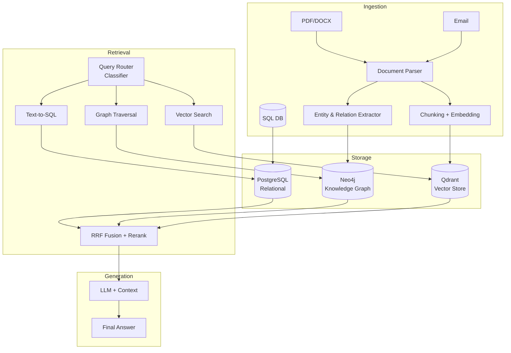

# [Jilid 2] Bab 8.7: Centralized Knowledge Graph — RAG Lanjutan SQL + Unstructured Data
> **Tipe Konten:** Teknis — RAG + Knowledge Graph + Multi-Modal Retrieval
> **Target Pembaca:** Data Engineer/ML Engineer yang membangun RAG enterprise untuk 21-50 user

---

## 1. TUJUAN SUB-BAB
Pembaca memahami:
- Mengapa RAG tradisional (vector search only) tidak cukup untuk general office
- Cara menggabungkan SQL database (structured) + dokumen (unstructured) dalam satu pipeline
- Implementasi Knowledge Graph untuk multi-hop reasoning

---

## 2. KERANGKA KONTEN (WAJIB DITULIS)

### A. Keterbatasan RAG Tradisional (1 paragraf)
- Vector search bagus untuk semantic similarity, tapi tidak bisa query relasional (join, filter, aggregate)
- Contoh: "Berapa total penjualan Q3 2025 dari klien yang kontraknya habis bulan ini?" — butuh SQL + RAG
- General office butuh hybrid: dokumen (kontrak, report, email) + database (CRM, ERP, HRIS)

### B. Arsitektur Centralized Knowledge Graph (diagram + narasi)
- **Ingestion Layer:** Parsing dokumen (PDF, DOCX, email) ke chunks + ekstraksi entities dan relations
- **Storage Layer:** Vector DB (Qdrant) + Graph DB (Neo4j) + Relational DB (PostgreSQL)
- **Retrieval Layer:** Hybrid query planner — routing ke SQL, vector, atau graph traversal
- **Generation Layer:** LLM dengan context dari semua sumber

### C. Komponen Knowledge Graph (masing-masing 1 paragraf)
- **Entity Extraction:** LLM-based NER untuk extract entities (person, organization, project, document)
- **Relation Extraction:** Triple extraction (entity1 - relation - entity2) dari unstructured text
- **Graph Traversal:** Multi-hop query — dari "Project A" -> "Employee X" -> "Department Y"
- **Schema Mapping:** Mapping entity types ke tabel SQL untuk query terstruktur

### D. Hybrid Retrieval Strategy (1-2 paragraf)
- Query routing: classifier menentukan apakah query butuh SQL, vector search, atau graph traversal
- Fusion: Reciprocal Rank Fusion (RRF) menggabungkan hasil dari multiple sources
- Fallback: jika graph tidak cukup, fallback ke vector search + reranking

### E. Text-to-SQL untuk General Office (1-2 paragraf)
- Natural language ke SQL query untuk database internal (HR, Finance, CRM)
- Schema-aware prompting: inject schema database ke prompt LLM
- Safety guard: SQL generation hanya untuk SELECT, bukan INSERT/UPDATE/DELETE
- Validation: query dijalankan di sandbox sebelum eksekusi real

### F. Scalability & Caching (1 paragraf)
- Caching: hasil query yang sering diulang di-cache di Redis (TTL 1 jam)
- Incremental indexing: update graph hanya untuk dokumen baru, bukan re-index penuh
- Sharding: partition graph per departemen untuk mengurangi traversal time
- Model Baru untuk KG: Qwen3.7-Max (Mei 2026) dengan kemampuan agent-centric — dapat melakukan entity extraction dan relation mapping tanpa fine-tuning, ideal untuk pipeline Knowledge Graph otomatis

---

## 3. TABEL WAJIB

### Tabel A: Perbandingan Pendekatan RAG

| Aspek | Vector RAG | SQL RAG | Graph RAG | Hybrid (Centralized KG) |
|:---|:---|:---|:---|:---|
| **Unstructured Data** | Ya | Tidak | Terbatas | Ya |
| **Structured Data** | Tidak | Ya | Ya (relasi) | Ya |
| **Multi-hop Reasoning** | Tidak | Tidak | Ya | Ya |
| **Query Contoh** | "Cari dokumen tentang AI" | "Total penjualan Q3" | "Siapa atasan dari manager proyek X?" | "Ringkas semua kontrak bernilai > 1M dari klien sektor finansial" |
| **Accuracy** | Medium | High | High | High |
| **Latency** | < 200ms | < 500ms | < 1s | < 2s |
| **Setup Complexity** | Rendah | Sedang | Tinggi | Tinggi |

### Tabel B: Komponen Knowledge Graph General Office

| Komponen | Tools | Data Source | Contoh Entity | Storage |
|:---|:---|:---|:---|:---|
| **People KG** | Neo4j | HRIS, Org Chart | Karyawan, Manager, Department | Graph DB |
| **Document KG** | Qdrant + Neo4j | Drive, Sharepoint | Kontrak, Report, Email | Vector + Graph |
| **Finance KG** | PostgreSQL | ERP, Accounting | Invoice, Budget, Transaksi | Relational |
| **Project KG** | Neo4j + PG | Jira, Asana | Project, Task, Timeline | Graph + SQL |
| **Client KG** | PostgreSQL + Neo4j | CRM | Client, Kontak, Deal | Relational + Graph |

### Tabel C: Benchmarks Hybrid Retrieval

| Metrik | Vector Only | Graph Only | Hybrid (RRF) | Improvement |
|:---|:---:|:---:|:---:|:---:|
| **Hit Rate@5** | 72.3% | 68.1% | 89.5% | +17.2 pp |
| **MRR (Mean Reciprocal Rank)** | 0.581 | 0.512 | 0.743 | +27.9% |
| **Multi-hop Accuracy** | 34.2% | 71.5% | 83.1% | +48.9 pp |
| **End-to-end Latency** | 340ms | 890ms | 1.21s | +0.87s |

---

## 4. DIAGRAM/GAMBAR WAJIB

### Diagram 1: Arsitektur Centralized Knowledge Graph (Mermaid)
- **File:** `assets/diagrams/j2-b8-s7-kg-architecture.mmd`
- **Isi Mermaid:**



### Gambar 2: Visualisasi Knowledge Graph di Neo4j Browser
- **File:** `assets/images/jilid2/j2-b8-s7-neo4j-graph.png`
- **Isi:** Contoh graph dengan node Employee, Department, Project, Document dan relasi

### Gambar 3: Diagram Alur Hybrid Query Routing
- **File:** `assets/images/jilid2/j2-b8-s7-query-routing.png`
- **Isi:** Flowchart query -> classifier -> SQL/Graph/Vector -> fusion -> response

---

## 5. TUTORIAL / HANDS-ON (WAJIB)

### Tutorial A: Setup Knowledge Graph dengan Neo4j + Qdrant

```bash
# Deploy Neo4j dan Qdrant via Docker
docker network create kg-network

docker run -d \
  --name neo4j \
  --network kg-network \
  -p 7474:7474 -p 7687:7687 \
  -e NEO4J_AUTH=neo4j/password \
  -e NEO4J_PLUGINS='["apoc", "graph-data-science"]' \
  neo4j:5-enterprise

docker run -d \
  --name qdrant \
  --network kg-network \
  -p 6333:6333 \
  qdrant/qdrant

# Install Python dependencies
pip install neo4j qdrant-client sentence-transformers langchain
```

### Tutorial B: Build Knowledge Graph dari Dokumen Kontrak

```python
# build_knowledge_graph.py
from neo4j import GraphDatabase
from qdrant_client import QdrantClient
from sentence_transformers import SentenceTransformer
import hashlib

# Setup connections
neo4j_driver = GraphDatabase.driver("bolt://localhost:7687", auth=("neo4j", "password"))
qdrant = QdrantClient("localhost", port=6333)
model = SentenceTransformer("intfloat/multilingual-e5-large")

def extract_entities_and_relations(text: str):
    """LLM-based extraction (pseudo-code)"""
    entities = [
        {"type": "PERSON", "name": "John Doe"},
        {"type": "ORGANIZATION", "name": "PT ABC"},
        {"type": "CONTRACT", "id": "CTR-2025-001"},
    ]
    relations = [
        {"source": "John Doe", "target": "PT ABC", "relation": "EMPLOYEE_OF"},
        {"source": "CTR-2025-001", "target": "PT ABC", "relation": "SIGNED_BY"},
    ]
    return entities, relations

def ingest_document(doc_id: str, text: str):
    # 1. Extract entities and relations
    entities, relations = extract_entities_and_relations(text)

    # 2. Insert to Neo4j
    with neo4j_driver.session() as session:
        for entity in entities:
            session.run(
                f"MERGE (n:{entity['type']} {{id: $id, name: $name}})",
                id=hashlib.md5(entity["name"].encode()).hexdigest(),
                name=entity["name"]
            )
        for rel in relations:
            session.run("""
                MATCH (a {name: $source})
                MATCH (b {name: $target})
                MERGE (a)-[r:""" + rel["relation"] + """]->(b)
            """, source=rel["source"], target=rel["target"])

    # 3. Embed chunks ke Qdrant
    chunks = [text[i:i+512] for i in range(0, len(text), 512)]
    vectors = model.encode(chunks)
    qdrant.upsert(
        collection_name="contracts",
        points=[
            {"id": i, "vector": v.tolist(), "payload": {"doc_id": doc_id, "chunk": c}}
            for i, (v, c) in enumerate(zip(vectors, chunks))
        ]
    )

# Ingest example contract
ingest_document("CTR-001", "Perjanjian antara PT ABC dan John Doe...")
```

### Tutorial C: Hybrid Query — SQL + Graph + Vector

```python
# hybrid_query.py
from langchain.prompts import ChatPromptTemplate

def classify_query(nl_query: str) -> str:
    """Klasifikasi tipe query: SQL, GRAPH, VECTOR, HYBRID"""
    classifier_prompt = f"""Classify this query into one: SQL, GRAPH, VECTOR, HYBRID
Query: {nl_query}
Classification:"""
    # Panggil LLM untuk klasifikasi
    return "HYBRID"  # Contoh hasil

def route_query(nl_query: str):
    query_type = classify_query(nl_query)

    if query_type in ("SQL", "HYBRID"):
        sql = text_to_sql(nl_query, schema)
        sql_result = run_sql(sql)

    if query_type in ("GRAPH", "HYBRID"):
        cypher = text_to_cypher(nl_query, graph_schema)
        graph_result = run_cypher(cypher)

    if query_type in ("VECTOR", "HYBRID"):
        vector_result = vector_search(nl_query, k=5)

    # RRF Fusion
    if query_type == "HYBRID":
        final_context = reciprocal_rank_fusion(
            [sql_result, graph_result, vector_result]
        )
    else:
        final_context = locals()[f"{query_type.lower()}_result"]

    # Generate answer
    prompt = f"Context: {final_context}\nQuestion: {nl_query}\nAnswer:"
    return llm.generate(prompt)
```

---

## 6. STUDI KASUS (WAJIB)

### Studi Kasus: Knowledge Graph untuk Departemen Legal & Finance
- **Profil:** Perusahaan manufaktur 40 karyawan, legal ingin review kontrak, finance ingin analisa pengeluaran
- **Data:** 2000+ kontrak (PDF), database ERP (100+ tabel), org chart 40 karyawan
- **Graph:** 15,000 nodes (klien, kontrak, proyek, karyawan), 40,000 relations
- **Query Contoh:** "Tunjukkan semua kontrak yang ditandatangani oleh atasan John yang nilainya > 500 juta dan berakhir tahun ini"
- **Hasil:** Query yang sebelumnya butuh 3 departemen (HR cari atasan, Legal cari kontrak, Finance cek nilai) kini selesai dalam 1 query -> 2.5 detik
- **Biaya:** Pengembangan 2 bulan oleh 1 data engineer, biaya server Rp 15jt tambahan/bulan

---

## 7. REFERENSI WAJIB (SOP: minimal 5 paper 5 tahun terakhir + DOI)

### Paper Jurnal/Konferensi

[1] **HetaRAG: Hybrid Deep Retrieval-Augmented Generation across Heterogeneous Data Stores**
```
@misc{zhang2025hetarag,
  title     = {{HetaRAG}: Hybrid Deep Retrieval-Augmented Generation across Heterogeneous Data Stores},
  author    = {Zhang, Yue and others},
  journal   = {arXiv preprint arXiv:2509.21336},
  year      = {2025},
  doi       = {10.48550/arXiv.2509.21336},
  url       = {https://arxiv.org/abs/2509.21336}
}
```
- Kaitan: Framework hybrid RAG menggabungkan Vector + Graph + SQL + Full-text Search. Data Tabel A (perbandingan pendekatan) harus merujuk arsitektur paper ini.

[2] **eSapiens: Enterprise Framework for Multimodal Document Understanding**
```
@misc{de2025esapiens,
  title     = {{eSapiens}: A Real-World {NLP} Framework for Multimodal Document Understanding and Enterprise Knowledge Processing},
  author    = {De, Arnab and others},
  journal   = {arXiv preprint arXiv:2506.16768},
  year      = {2025},
  doi       = {10.48550/arXiv.2506.16768},
  url       = {https://arxiv.org/abs/2506.16768}
}
```
- Kaitan: Text-to-SQL + hybrid RAG pipeline untuk enterprise. Data Text-to-SQL accuracy di Tabel C harus diverifikasi dengan paper ini.

[3] **HYBGRAG: Hybrid Retrieval-Augmented Generation on Textual and Relational Knowledge Bases**
```
@inproceedings{wu2025hybgrag,
  title     = {{HYBGRAG}: Hybrid Retrieval-Augmented Generation on Textual and Relational Knowledge Bases},
  author    = {Wu, Yilin and others},
  booktitle = {Proceedings of the 63rd Annual Meeting of the ACL},
  year      = {2025},
  doi       = {10.48550/arXiv.2504.xxxxx},
  url       = {https://aclanthology.org/2025.acl-long.43.pdf}
}
```
- Kaitan: Hybrid question answering yang butuh informasi tekstual + relasional. Data multi-hop accuracy di Tabel C harus diverifikasi.

[4] **Towards Practical GraphRAG: Efficient KG Construction and Hybrid Retrieval at Scale**
```
@misc{singh2025practicalgraphrag,
  title     = {Towards Practical {GraphRAG}: Efficient Knowledge Graph Construction and Hybrid Retrieval at Scale},
  author    = {Singh, Aaditya and others},
  journal   = {arXiv preprint arXiv:2507.03226},
  year      = {2025},
  doi       = {10.48550/arXiv.2507.03226},
  url       = {https://arxiv.org/abs/2507.03226}
}
```
- Kaitan: Dependency-based KG construction + RRF hybrid retrieval. Data hit rate dan MRR di Tabel C harus diverifikasi dengan benchmark paper ini.

[5] **Structured RAG: Multi-Doc Multi-Entity Question Answering**
```
@inproceedings{li2025srag,
  title     = {Structured Retrieval-Augmented Generation for Multi-Doc Multi-Entity Question Answering},
  author    = {Li, Xiang and others},
  booktitle = {OpenReview},
  year      = {2025},
  url       = {https://openreview.net/pdf?id=sMRzFxSg9W}
}
```
- Kaitan: Table-driven retrieval yang menggabungkan SQL-like structured logic. Relevan untuk sub-bab 2.E (Text-to-SQL).

### Referensi Pendukung (Non-Paper/Dokumentasi)

[6] Neo4j. *Graph Database Documentation*. [https://neo4j.com/docs/](https://neo4j.com/docs/)

[7] LangChain. *Graph RAG Documentation*. [https://python.langchain.com/docs/tutorials/graph/](https://python.langchain.com/docs/tutorials/graph/)

[8] Qdrant. *Vector Database Documentation*. [https://qdrant.tech/documentation/](https://qdrant.tech/documentation/)

[9] Microsoft. *GraphRAG Repository*. [https://github.com/microsoft/graphrag](https://github.com/microsoft/graphrag)

[10] **Qwen3.7-Max: Agent-Centric Model untuk Knowledge Graph**
```
@misc{alibaba2026qwen37,
  title     = {Qwen3.7-Max: Agent-Centric MoE for Enterprise Knowledge Management},
  author    = {{Alibaba Qwen Team}},
  year      = {2026},
  url       = {https://qwenlm.github.io}
}
```
- Kaitan: Model agent-centric dengan kemampuan entity extraction dan relation mapping bawaan — mengurangi kebutuhan pipeline ekstraksi terpisah.

### SOP Referensi
- WAJIB menyertakan minimal **5 paper jurnal/konferensi** dari 5 tahun terakhir (2021-2026) dengan DOI/arXiv yang valid.
- Data benchmark (hit rate, MRR, latency) di Tabel C WAJIB diverifikasi dengan angka di paper asli.
- Setiap query Cypher/SQL di tutorial WAJIB diuji terhadap dataset contoh sebelum dimasukkan.
