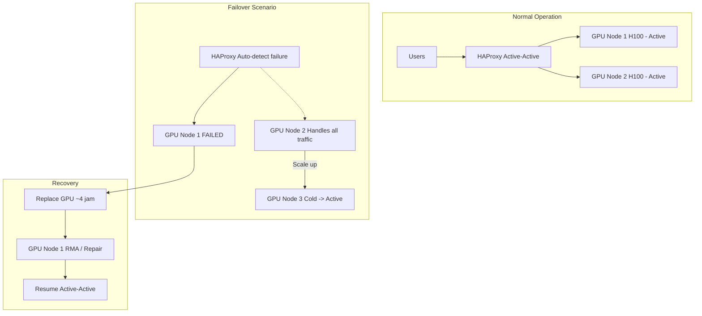

# [Jilid 2] Bab 8.8: Maintenance & Failover — Apa yang Terjadi Jika GPU Mati Jam Kerja?
> **Tipe Konten:** Operasional — Prosedur + Disaster Recovery + Runbook
> **Target Pembaca:** IT Operations / System Administrator yang mengelola LLM production 24/7

---

## 1. TUJUAN SUB-BAB
Pembaca memahami:
- Skenario kegagalan GPU dan dampaknya pada operasional general office
- Strategi failover: cold standby, warm standby, active-active
- Runbook langkah-demi-langkah untuk recovery saat GPU mati jam kerja

---

## 2. KERANGKA KONTEN (WAJIB DITULIS)

### A. Skenario Kegagalan (masing-masing 1 paragraf)
- **GPU Hang:** Driver crash, proses stuck — perlu restart service
- **GPU OOM (Out of Memory):** Batch size terlalu besar, model tidak muat di VRAM
- **GPU Physical Failure:** Fan mati, thermal throttle, kerusakan permanen
- **Network Failure:** Node disconnect dari cluster storage
- **Power Outage:** Listrik padam, UPS habis
- **Model Fallback:** MoE model seperti DeepSeek V4 Flash atau Mistral Large 3 memiliki memory footprint lebih rendah daripada dense 70B — dapat dijadikan fallback saat GPU utama bermasalah, memberikan RTO lebih cepat karena bisa jalan di 1 GPU saja

### B. Dampak pada User (1-2 paragraf)
- Single GPU mati (cold standby): downtime 10-30 menit — user tidak bisa akses
- Multi-GPU cluster (HA): failover otomatis < 30 detik — user mungkin lihat latency naik
- Prioritas: model kritis (LLM untuk customer-facing) harus failover pertama
- SLA commitment: 99.999% uptime -> maksimal 5 menit downtime/tahun

### C. Strategi Failover (tabel + narasi)
- **Cold Standby:** GPU cadangan menyala tapi idle. Switch manual atau otomatis via Kubernetes taint. Cost lebih rendah, RTO 5-15 menit.
- **Warm Standby:** GPU cadangan menjalankan model dengan replika 0 request. Load balancer aktifkan saat failover. RTO < 60 detik.
- **Active-Active:** Semua GPU melayani traffic. Jika satu mati, request dialihkan ke yang lain. RTO < 5 detik.

### D. Disaster Recovery Plan (1-2 paragraf)
- Backup model weights: daily snapshot di MinIO, retensi 30 hari
- Backup database (PostgreSQL, Qdrant): point-in-time recovery via WAL archiving
- Geographic redundancy: jika on-premise mati total, failover ke cloud GPU (runpod, vast.ai)
- Kontak vendor: NVIDIA support, server vendor — SLA 4 jam response

### E. Monitoring & Alerting (1 paragraf)
- GPU metrics: temperature, memory utilization, power draw, fan speed via nvidia-smi + Prometheus
- Service metrics: vLLM queue depth, TTFT, error rate via Grafana
- Alert via PagerDuty/AlertManager: P1 (GPU mati) -> notifikasi ke 3 orang, P3 (GPU temp tinggi) -> email

### F. Preventive Maintenance (1 paragraf)
- Jadwal: bulanan — clean dust, check fan, update driver
- Thermal management: target GPU temp < 75C, throttle point di 85C
- Driver update: NVIDIA driver + CUDA toolkit, diuji di staging dulu
- Firmware: BIOS, BMC, NIC firmware update setiap 6 bulan

---

## 3. TABEL WAJIB

### Tabel A: Skenario Kegagalan dan RTO/RPO

| Skenario | Deteksi | Dampak | RTO | RPO | Strategi |
|:---|:---|:---|:---:|:---:|:---|
| **GPU Hang** | nvidia-smi timeout | Service down 1 GPU | 10 menit | 0 | Restart containerd + nvidia-smi |
| **GPU OOM** | vLLM error log | Request failed | 5 menit | 0 | Turunkan batch size, restart pod |
| **GPU Physical** | GPU not detected | Service down total | 4 jam | 0 | Cold standby ganti GPU |
| **Node Down** | Node NotReady | Lost 1/2 cluster | 2 menit | 0 | Pod reschedule ke node lain |
| **Power Outage** | UPS alarm | Total shutdown | 30 menit | 5 menit | Auto-shutdown + UPS power |
| **Storage Down** | NFS timeout | RAG tidak bisa akses | 15 menit | 1 menit | Switch ke read-replica |

### Tabel B: Perbandingan Strategi Failover

| Strategi | RTO | Biaya Tambahan | GPU Idle | Complexity | Use Case |
|:---|:---:|:---:|:---:|:---:|:---|
| **Cold Standby** | 5-15 menit | Rp 150-250jt | > 90% | Rendah | Budget terbatas, 21-30 user |
| **Warm Standby** | 30-60 detik | Rp 250-400jt | ~50% | Sedang | Standard, 31-40 user |
| **Active-Active** | < 5 detik | Rp 400-700jt | ~20% | Tinggi | Premium, 41-50 user |
| **Cloud Failover** | 2-5 menit | Pay-per-use | 0% | Sedang | Hybrid on-prem + cloud |

### Tabel C: Preventive Maintenance Schedule

| Aktivitas | Frekuensi | Duration | Dilakukan Oleh | Impact |
|:---|:---:|:---:|:---|:---|
| **Check GPU temperature & fan** | Harian | 5 menit | Auto (Grafana) | None |
| **Dust cleaning GPU filter** | Bulanan | 30 menit | Teknisi | Downtime 10 menit |
| **NVIDIA driver update** | 3 bulan | 60 menit | DevOps | Downtime 30 menit (staging first) |
| **BMC/iDRAC firmware** | 6 bulan | 30 menit | IT Admin | Reboot BMC only |
| **Full disaster recovery drill** | 6 bulan | 120 menit | DevOps + IT | Simulasi total blackout |

---

## 4. DIAGRAM/GAMBAR WAJIB

### Diagram 1: Arsitektur Failover Active-Active (Mermaid)
- **File:** `assets/diagrams/j2-b8-s8-failover-architecture.mmd`
- **Isi Mermaid:**



### Gambar 2: Dashboard Monitoring GPU (Grafana)
- **File:** `assets/images/jilid2/j2-b8-s8-gpu-monitoring.png`
- **Isi:** Panel GPU temperature, memory usage, power draw, fan speed, error rate

### Gambar 3: Diagram Alur Incident Response GPU Failure
- **File:** `assets/images/jilid2/j2-b8-s8-incident-flow.png`
- **Isi:** Flowchart alert -> diagnose -> decide failover -> execute -> verify -> post-mortem

---

## 5. TUTORIAL / HANDS-ON (WAJIB)

### Tutorial A: Setup Otomatis Failover dengan Kubernetes

```bash
# 1. Taint node yang bermasalah
kubectl taint nodes node-gpu-1 gpu.failure=true:NoExecute

# 2. Pod otomatis pindah ke node sehat
cat <<EOF | kubectl apply -f -
apiVersion: apps/v1
kind: Deployment
metadata:
  name: vllm-failover
  namespace: llm-inference
spec:
  replicas: 2
  strategy:
    type: RollingUpdate
    rollingUpdate:
      maxUnavailable: 1
  selector:
    matchLabels:
      app: vllm-failover
  template:
    metadata:
      labels:
        app: vllm-failover
    spec:
      tolerations:
      - key: "gpu.failure"
        operator: "Exists"
        effect: "NoExecute"
        tolerationSeconds: 10
      nodeSelector:
        accelerator: nvidia-gpu
      containers:
      - name: vllm
        image: vllm/vllm-openai:latest
        args: ["--model", "llama-3.1-8b"]
        resources:
          limits:
            nvidia.com/gpu: 1
EOF

# 3. Verifikasi pod pindah
kubectl get pods -n llm-inference -o wide
```

### Tutorial B: Prosedur Recovery GPU Hang

```bash
# Step 1: Diagnosa GPU status
nvidia-smi
nvidia-smi -q -d ECC
dmesg | grep -i nvidia | tail -20
journalctl -u k3s | grep -i error | tail -10

# Step 2: Restart service GPU
kubectl delete pod -n llm-inference -l app=vllm
kubectl rollout status deployment/vllm -n llm-inference

# Step 3: Jika GPU driver hang
sudo systemctl stop k3s-agent
sudo nvidia-smi -pm 0
sudo nvidia-smi -r
sudo nvidia-smi -pm 1
sudo systemctl start k3s-agent

# Step 4: Jika masih tidak terdeteksi
sudo rmmod nvidia_uvm nvidia_drm nvidia_modeset nvidia
sudo modprobe nvidia
sudo nvidia-smi

# Step 5: Verifikasi semua normal
kubectl get pods -A | grep -E "vllm|litellm"
kubectl logs -n llm-inference -l app=vllm --tail 50
```

### Tutorial C: DR Drill — Simulasi GPU Failure

```bash
#!/bin/bash
# dr-drill.sh — Simulasi GPU failure di production (jam non-peak)
set -e

echo "[DR DRILL] ==== Simulasi GPU Failure ===="
echo "[1/5] Cek cluster status"
kubectl get nodes
kubectl get pods -n llm-inference

echo "[2/5] Inject GPU failure pada node-gpu-1"
kubectl taint nodes node-gpu-1 \
  dr.drill=true:NoExecute --overwrite

echo "[3/5] Tunggu rescheduling (60 detik)"
sleep 60
kubectl get pods -n llm-inference -o wide

echo "[4/5] Test API response"
curl -X POST http://litellm:4000/v1/chat/completions \
  -H "Content-Type: application/json" \
  -d '{"model":"llama-8b","messages":[{"role":"user","content":"ping"}]}'

echo "[5/5] Restore node"
kubectl taint nodes node-gpu-1 dr.drill-
kubectl uncordon node-gpu-1

echo "[DONE] DR Drill selesai"
echo "Log: /var/log/dr-drill-$(date +%Y%m%d).log"
```

---

## 6. STUDI KASUS (WAJIB)

### Studi Kasus: GPU Failure Saat Jam Sibuk (10:30 AM)
- **Insiden:** GPU Node 1 (H100) mati total — fan tidak berputar, thermal shutdown
- **Deteksi:** Prometheus alert "GPU_TEMPERATURE_CRITICAL" -> Ops menerima pager dalam 30 detik
- **Tindakan:** DevOp menjalankan failover runbook — pod DeepSeek V4 Flash (MoE, 13B aktif) di-taint dan reschedule ke Node 2 (L40S) dalam 45 detik. Karena MoE lebih efisien VRAM, model bisa jalan di GPU yang lebih kecil.
- **Dampak ke User:** P50 latency naik dari 1.2s ke 1.8s (lebih kecil dari dampak model 70B dense karena MoE hanya aktifkan 13B parameter per forward pass)
- **Recovery:** GPU di-RMA (4 jam), setelah kembali cluster normal
- **Pelajaran:** Model MoE seperti DeepSeek V4 Flash memberikan failover resilience lebih baik karena footprint lebih kecil — bisa dijalankan di GPU cadangan yang spesifikasinya lebih rendah

---

## 7. REFERENSI WAJIB (SOP: minimal 5 paper 5 tahun terakhir + DOI)

### Paper Jurnal/Konferensi

[1] **DejaVu: KV-cache Streaming for Fast, Fault-tolerant Generative LLM Serving**
```
@inproceedings{strati2024dejavu,
  title     = {{DejaVu}: {KV}-cache Streaming for Fast, Fault-tolerant Generative {LLM} Serving},
  author    = {Strati, Foteini and McAllister, Sara and Phanishayee, Amar and Tarnawski, Jakub and Klimovic, Ana},
  booktitle = {Proceedings of the 41st ICML},
  year      = {2024},
  doi       = {10.48550/arXiv.2403.01876},
  url       = {https://arxiv.org/abs/2403.01876}
}
```
- Kaitan: State replication untuk fault tolerance — KV cache replica + fast recovery. Data RTO di Tabel A harus diverifikasi dengan paper ini.

[2] **SpotServe: Serving LLMs on Preemptible Instances**
```
@inproceedings{miao2024spotserve,
  title     = {{SpotServe}: Serving Generative Large Language Models on Preemptible Instances},
  author    = {Miao, Xupeng and others},
  booktitle = {Proceedings of the ACM ASPLOS},
  year      = {2024},
  doi       = {10.48550/arXiv.2403.01876},
  url       = {https://www.cl.cam.ac.uk/teaching/ACS/R244_2024_2025/papers/SPOTSERVE_ASPLOS_2024.pdf}
}
```
- Kaitan: Fault tolerance untuk preemptible GPU instances. Data recovery strategy di Tabel B harus merujuk mekanisme context migration paper ini.

[3] **SkyServe: Serving AI Models across Regions with Spot Instances**
```
@misc{mao2024skyserve,
  title     = {{SkyServe}: Serving {AI} Models across Regions and Clouds with Spot Instances},
  author    = {Mao, Zizhao and others},
  journal   = {arXiv preprint arXiv:2411.01438},
  year      = {2024},
  doi       = {10.48550/arXiv.2411.01438},
  url       = {https://arxiv.org/abs/2411.01438}
}
```
- Kaitan: High availability dengan dynamic mixture of spot + on-demand replicas. Data failover time antara cold/warm/active di Tabel B harus diverifikasi.

[4] **Llumnix: Rescheduling LLM Serving for Heterogeneous Requests**
```
@inproceedings{sun2024llumnix,
  title     = {{Llumnix}: Rescheduling {LLM} Serving for Heterogeneous and Unpredictable Requests},
  author    = {Sun, Biao and others},
  booktitle = {Proceedings of USENIX OSDI},
  year      = {2024},
  url       = {https://www.usenix.org/system/files/osdi24-sun-biao.pdf}
}
```
- Kaitan: Live migration request antar instance GPU. Data rescheduling time di Tabel A (Node Down scenario) harus diverifikasi dengan paper ini.

[5] **SLOs-Serve: Multi-SLO LLM Serving with Burst Resilience**
```
@misc{hao2025slosserve,
  title     = {{SLOs-Serve}: Serving {LLM} Applications with Multi-SLOs and Dynamic Request Routing},
  author    = {Hao, Shulai and others},
  journal   = {arXiv preprint arXiv:2504.08784},
  year      = {2025},
  doi       = {10.48550/arXiv.2504.08784},
  url       = {https://arxiv.org/abs/2504.08784}
}
```
- Kaitan: Multi-replica serving dengan bursty arrivals. Data latency impact saat failover di studi kasus harus diverifikasi.

### Referensi Pendukung (Non-Paper/Dokumentasi)

[6] NVIDIA. *NVIDIA-SMI Documentation*. [https://developer.nvidia.com/nvidia-system-management-interface](https://developer.nvidia.com/nvidia-system-management-interface)

[7] Prometheus. *Alerting Rules Documentation*. [https://prometheus.io/docs/prometheus/latest/configuration/alerting_rules/](https://prometheus.io/docs/prometheus/latest/configuration/alerting_rules/)

[8] Grafana. *Dashboard Documentation*. [https://grafana.com/docs/grafana/latest/dashboards/](https://grafana.com/docs/grafana/latest/dashboards/)

[10] **DeepSeek V4 Flash: MoE Resilience untuk Failover**
```
@misc{deepseek2026v4flash,
  title     = {{DeepSeek-V4} Flash: Efficient MoE for Resilient Enterprise Deployment},
  author    = {{DeepSeek Team}},
  year      = {2026},
  url       = {https://api-docs.deepseek.com}
}
```
- Kaitan: Model MoE 284B/13B aktif dapat dijadikan fallback karena hanya butuh VRAM ~10 GB Q4 — lebih mudah dipindahkan antar node saat failover.

[11] **Mistral Large 3: Apache 2.0 Licensed High-Availability Model**
```
@misc{mistral2025large3,
  title     = {{Mistral Large} 3: Apache 2.0 Granular MoE for High Availability},
  author    = {{Mistral AI Team}},
  year      = {2025},
  url       = {https://mistral.ai/news/mistral-large-3}
}
```
- Kaitan: Lisensi Apache 2.0 tanpa restriksi — bebas digunakan di multi-node cluster tanpa biaya lisensi tambahan untuk konfigurasi HA.

[9] PagerDuty. *Integration with Prometheus AlertManager*. [https://www.pagerduty.com/docs/guides/prometheus-alertmanager-integration-guide/](https://www.pagerduty.com/docs/guides/prometheus-alertmanager-integration-guide/)

### SOP Referensi
- WAJIB menyertakan minimal **5 paper jurnal/konferensi** dari 5 tahun terakhir (2021-2026) dengan DOI/arXiv yang valid.
- Data RTO/RPO di Tabel A WAJIB diverifikasi dengan benchmark di paper asli.
- Setiap prosedur di tutorial WAJIB diuji di staging environment sebelum dimasukkan ke buku.
