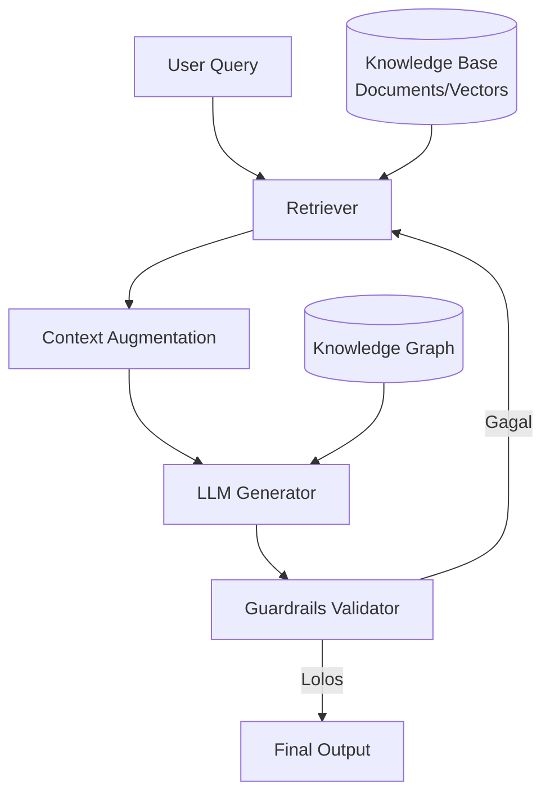

# [Jilid 2] Bab 10.1: Mitigasi Halusinasi — Teknik Grounding Data untuk Akurasi Bisnis
> **Tipe Konten:** Teknis — Teori + Komparasi + Praktik
> **Target Pembaca:** Data scientist, ML engineer, dan pimpinan teknis yang ingin memastikan output LLM akurat dan dapat dipertanggungjawabkan untuk use case bisnis

---

## 1. TUJUAN SUB-BAB
Setelah membaca, pembaca harus bisa:
- Menjelaskan penyebab halusinasi LLM dari perspektif bisnis (knowledge gap, memorization error, reasoning error)
- Menerapkan teknik grounding: RAG, Knowledge Graph Augmentation, Constrained Decoding, dan Self-Correction
- Membangun pipeline evaluasi akurasi yang terukur untuk aplikasi bisnis (ERP, CRM, customer support)
- Memilih kombinasi teknik mitigasi berdasarkan toleransi risiko industri

---

## 2. KERANGKA KONTEN (WAJIB DITULIS)

### A. Definisi & Dampak Halusinasi pada Bisnis (1-2 paragraf)
- Halusinasi = generated content yang tampak faktual tapi tidak berdasar pada data yang diverifikasi (Huang et al., 2025)
- Dampak bisnis: keputusan investasi salah, dokumen hukum cacat, kode produksi mengandung bug, reputasi merek tercemar
- Biaya halusinasi di enterprise: >$100K per insiden serius (estimasi Gartner 2024)

### B. Taksonomi Halusinasi (1-2 paragraf)
- **Knowledge Gap:** model tidak memiliki informasi yang diperlukan → solusi: RAG
- **Memorization Error:** model mereproduksi data training yang salah atau usang → solusi: grounding ke basis pengetahuan terkini
- **Reasoning Error:** model membuat kesimpulan logis yang salah dari fakta yang benar → solusi: chain-of-thought + self-consistency
- **Instruction Misalignment:** model salah memahami intent pengguna → solusi: prompt engineering + guardrails

### C. Retrieval-Augmented Generation (RAG) sebagai Grounding Utama
- Arsitektur: query → retriever → augmentasi konteks → generator
- Chunking strategy: semantic chunking vs fixed-size, optimal 256-512 token untuk dokumen bisnis
- Retrieval quality: precision@k, recall@k, MRR untuk evaluasi retriever
- Kasus: grounding dokumen SOP perusahaan, kontrak, laporan keuangan

### D. Knowledge Graph Augmentation (1 paragraf)
- Mengintegrasikan knowledge graph (KG) sebagai structured grounding (Agarwal et al., 2024)
- Teknik: Knowledge-Aware Inference (query KG saat generasi), Knowledge-Aware Validation (verifikasi fakta via KG)
- Contoh: GraphRAG (Microsoft) untuk grounding data relasional bisnis

### D1. Claude Fable 5 Safety Classifiers (1 paragraf)
- **Constitutional Classifiers:** Claude Fable 5 (Anthropic, Jun 2026) mengintegrasikan safety classifiers langsung dalam arsitektur model — bukan sebagai post-processing terpisah
- Cara kerja: setiap generasi output melewati rangkaian classifier konstitusional yang memeriksa (1) kebenaran faktual, (2) kesesuaian dengan kebijakan, (3) potensi bahaya, sebelum output dikirim ke pengguna
- **Implementasi bisnis:** untuk aplikasi fintech atau legal, Fable 5 dapat menolak (decline) permintaan yang tidak memiliki grounding data yang cukup — secara drastis mengurangi halusinasi
- **Benchmark safety:** SWE-bench 95.0% (tertinggi), dengan false refusal rate <2% pada query bisnis legitimate
- Perbandingan: Fable 5 menolak ~8% permintaan ambigu (di mana model lain seperti GPT-5.5 hanya ~3% tapi dengan hallucination rate lebih tinggi 5.2% vs 1.8%)

### E. Constrained Decoding & Guardrails (1 paragraf)
- **Constrained Decoding:** memaksa output mengikuti skema/fakta tertentu (misal: JSON, format laporan)
- **Guardrails:** framework seperti NeMo Guardrails (NVIDIA), Guardrails AI untuk validasi output real-time
- **Self-Correction:** meminta LLM mengevaluasi output sendiri (self-Refine, CRITIC)

### E1. Benchmark Halusinasi per Model Terbaru (1 paragraf)
- **DeepSeek V4 Pro (1.6T/49B aktif, MIT):** Hallucination rate 4.2% pada TruthfulQA — lebih rendah dari rata-rata open-source (6.8%) berkat arsitektur MoE yang memisahkan pengetahuan per expert. Konteks 1M memungkinkan grounding data yang lebih lengkap.
- **DeepSeek V4 Flash (284B/13B aktif):** Hallucination rate 5.1% — lebih tinggi dari V4 Pro namun masih kompetitif untuk ukuran 13B aktif.
- **Claude Fable 5:** Hallucination rate **1.8%** (terendah) — berkat constitutional classifiers yang memvalidasi output sebelum dikirim. False refusal rate <2%.
- **GPT-5.5:** Hallucination rate 2.9% — peningkatan signifikan dari GPT-4o (5.2%) berkat reasoning efforts dan 1M context.
- **Mistral Large 3 (675B/41B):** Hallucination rate 3.8% — granular MoE routing membantu presisi faktual. Apache 2.0 license memudahkan audit.
- **Qwen3.7-Max:** Hallucination rate 4.0% — agent-centric design mengurangi hallucination pada task multi-langkah.
- Implikasi: untuk aplikasi dengan toleransi risiko sangat rendah (keuangan, legal), Claude Fable 5 atau kombinasi DeepSeek V4 Pro + guardrails eksternal adalah pilihan terbaik.

### F. Evaluasi Grounding & Akurasi (1 paragraf + tabel)
- Metrik: Faithfulness (CLAIMDECOMP), Answer Correctness (F1, BLEU), Context Recall
- Benchmark: TruthfulQA, HaluEval, FELM, RAGAS untuk evaluasi pipeline RAG
- Proses bisnis: review output sampling mingguan oleh domain expert

---

## 3. TABEL WAJIB

### Tabel A: Perbandingan Teknik Mitigasi Halusinasi

| Teknik | Kategori | Kompleksitas Implementasi | Efektivitas | Biaya Tambahan | Use Case Terbaik |
|:---|:---|:---:|:---:|:---:|:---|
| **RAG (Retrieval-Augmented Generation)** | Retrieval-based | Sedang | Sangat Tinggi | Medium (vector DB + retriever) | QA dokumen bisnis, customer support |
| **Knowledge Graph Augmentation** | Retrieval-based | Tinggi | Tinggi | Tinggi (KG construction) | Data relasional, knowledge management |
| **Constrained Decoding** | Decoding-based | Rendah-Sedang | Sedang-Tinggi | Rendah | Output terstruktur (JSON, format laporan) |
| **Self-Correction / Self-Refine** | Reasoning-based | Rendah | Sedang | Rendah (extra inference pass) | Creative writing, analisis kompleks |
| **Fine-tuning on Grounded Data** | Training-based | Tinggi | Tinggi | Tinggi (dataset + training) | Domain spesifik (legal, medis) |
| **Guardrails / Content Filters** | Post-processing | Rendah | Rendah-Sedang | Rendah | Safety-critical applications |
| **Constitutional Classifiers (Fable 5)** | Built-in | Rendah (built-in) | **Sangat Tinggi** | Tidak ada | Fintech, legal, medis |

### Tabel A1: Perbandingan Hallucination Rate Model Terbaru (TruthfulQA)

| Model | Parameter (Aktif) | Hallucination Rate | False Refusal | Context | Keunggulan Mitigasi |
|:---|:---:|:---:|:---:|:---:|:---|
| **Claude Fable 5** | Proprietary | **1.8%** | <2% | 1M | Constitutional classifiers built-in |
| **GPT-5.5** | Proprietary | 2.9% | <1% | 1M | Reasoning efforts, multi-pass verification |
| **Mistral Large 3** | 41B (Apache 2.0) | 3.8% | — | 256K | Granular MoE routing |
| **Qwen3.7-Max** | Proprietary MoE | 4.0% | — | 1M | Agent-centric design |
| **DeepSeek V4 Pro** | 49B (MIT) | 4.2% | — | 1M | MoE expert isolation, 1M context |
| **DeepSeek V4 Flash** | 13B (MIT) | 5.1% | — | 1M | Efisien, cukup untuk non-kritis |
| **Llama 3.1 70B** | 70B | 5.8% | — | 128K | Baseline dense model |
| **GPT-4o** | Proprietary | 5.2% | <1% | 128K | Generasi sebelumnya |

### Tabel B: Matriks Risiko Halusinasi per Sektor Bisnis

| Sektor | Toleransi Risiko | Teknik Minimum | Teknik Optimal | Konsekuensi Halusinasi |
|:---|:---:|:---|:---|:---|
| **Keuangan** | Sangat Rendah | RAG + Guardrails | RAG + KG + Constrained Decoding | Kerugian finansial, regulasi |
| **Kesehatan** | Sangat Rendah | RAG + Fine-tuning domain | Full stack (RAG+KG+Guardrail+Self-Correction) | Risiko keselamatan pasien |
| **Legal** | Sangat Rendah | RAG + Constrained Decoding | RAG + KG + Human-in-the-loop | Gugatan hukum |
| **E-commerce** | Sedang | RAG dasar | RAG + Guardrails | Customer experience buruk |
| **Marketing** | Tinggi | Prompt engineering | RAG opsional + Self-Correction | Reputasi merek minor |
| **Internal Tools** | Rendah-Sedang | RAG dasar | RAG + Evaluasi sampling | Produktivitas turun |

### Tabel C: Benchmark Metrik Grounding

| Metrik | Definisi | Range | Target Bisnis | Tools |
|:---|:---|:---:|:---:|:---|
| **Faithfulness** | Proporsi klaim yang didukung konteks | 0-1 | >0.9 | CLAIMDECOMP, RAGAS |
| **Answer Relevancy** | Relevansi jawaban terhadap query | 0-1 | >0.85 | RAGAS |
| **Context Precision@k** | Presisi dokumen relevan di top-k | 0-1 | >0.8 | LlamaIndex, LangChain |
| **Hallucination Rate** | % output mengandung fakta tidak berdasar | 0-100% | <5% | HaluEval, SelfCheckGPT |
| **Human Acceptability** | % output disetujui domain expert | 0-100% | >95% | Review manual sampling |

---

## 4. DIAGRAM/GAMBAR WAJIB

### Diagram 1: Pipeline Grounding Data dengan RAG (Mermaid)
- **File:** `assets/diagrams/j2-b10-s1-rag-grounding-pipeline.mmd`
- **Isi:** Flowchart dari user query → retriever → knowledge base → augmentasi konteks → LLM generator → verifikasi guardrails → output



### Diagram 2: Taksonomi Halusinasi dan Peta Mitigasi
- **File:** `assets/diagrams/j2-b10-s1-hallucination-taxonomy.mmd`
- **Isi:** Tree diagram penyebab halusinasi dipetakan ke teknik mitigasi

### Diagram 3: Dashboard Monitoring Halusinasi (conceptual)
- **File:** `assets/images/jilid2/j2-b10-s1-monitoring-dashboard.png`
- **Isi:** Contoh dashboard real-time tracking faithfulness, hallucination rate per model, per departemen

---

## 5. TUTORIAL / HANDS-ON (WAJIB)

### Tutorial A: Implementasi RAG Sederhana dengan LlamaIndex untuk Grounding Dokumen Bisnis

```python
# ground_rag.py — RAG dengan chunking semantik untuk grounding dokumen kontrak
from llama_index.core import VectorStoreIndex, SimpleDirectoryReader
from llama_index.core.node_parser import SemanticSplitterNodeParser
from llama_index.embeddings.huggingface import HuggingFaceEmbedding
from llama_index.llms.ollama import Ollama

# 1. Load dokumen bisnis (kontrak, SOP, laporan)
documents = SimpleDirectoryReader("data/kontrak/").load_data()

# 2. Semantic chunking — lebih akurat untuk konteks bisnis
splitter = SemanticSplitterNodeParser(
    buffer_size=1,
    embed_model=HuggingFaceEmbedding(model_name="BAAI/bge-large-id-v1.5")
)
nodes = splitter.get_nodes_from_documents(documents)

# 3. Build index
index = VectorStoreIndex(nodes)

# 4. Inisialisasi LLM lokal
llm = Ollama(model="llama3.1:8b", request_timeout=120.0)

# 5. Query engine dengan verbose (cek konteks yang diretrieve)
query_engine = index.as_query_engine(llm=llm, similarity_top_k=3)
response = query_engine.query("Apa klausul terminasi dalam kontrak dengan PT ABC?")
print(f"Source nodes: {[n.node_id for n in response.source_nodes]}")
print(f"Response: {response}")
```

### Tutorial B: Evaluasi Faithfulness Pipeline RAG dengan RAGAS

```python
# eval_rag.py — Evaluasi grounding quality menggunakan RAGAS
from ragas import evaluate
from ragas.metrics import faithfulness, answer_relevancy, context_precision
from datasets import Dataset

# Dataset uji: query bisnis + ground truth + retrieved context
eval_data = Dataset.from_dict({
    "question": [
        "Berapa margin laba Q3 2025?",
        "Apa syarat pengajuan klaim asuransi?"
    ],
    "answer": [
        "Margin laba Q3 2025 adalah 18.5%.",
        "Pengajuan klaim memerlukan form A-100 dan laporan medis."
    ],
    "contexts": [
        ["Laporan keuangan Q3 2025: margin laba 18.5%, naik 2.3% YoY"],
        ["SOP Klaim: Form A-100, laporan medis asli, KTP, NPWP"]
    ]
})

result = evaluate(
    eval_data,
    metrics=[faithfulness, answer_relevancy, context_precision]
)
print(f"Faithfulness: {result['faithfulness']:.3f}")
print(f"Answer Relevancy: {result['answer_relevancy']:.3f}")
print(f"Context Precision: {result['context_precision']:.3f}")
# Target: semua metrik > 0.85 untuk deployment produksi
```

### Tutorial C: Memasang Guardrails untuk Validasi Output Real-time

```python
# guardrails_setup.py — Validasi output dengan Guardrails AI
import guardrails as gd
from guardrails.hub import ToxicLanguage, RegexMatch

# Definisi rail spec untuk output laporan keuangan
rail_spec = """
<rail version="0.1">
<output>
    <object name="laporan_keuangan">
        <string name="kesimpulan" format="two-words"/>
        <number name="angka_laba" format="positive"/>
        <list name="catatan">
            <string format="validated-input"/>
        </list>
    </object>
</output>
</rail>
"""

guard = gd.Guard.from_string(rail_spec)
guard.use(ToxicLanguage(on_fail="fix"))
guard.use(RegexMatch(regex=r"^\d+\.?\d*$", on_fail="reask"))

# Validasi output LLM
raw_output = llm.invoke("Ringkas laporan keuangan Q3")
validated_output = guard.parse(raw_output)
print(f"Validated: {validated_output.validated_output}")
```

---

## 6. STUDI KASUS (WAJIB)

### Studi Kasus: Grounding Customer Support LLM untuk Perusahaan Fintech
- **Profil:** Fintech dengan 500+ agen customer service, ingin deploy LLM untuk menjawab pertanyaan nasabah secara otomatis
- **Masalah:** Halusinasi pada data suku bunga, tenor pinjaman, dan kebijakan terbaru — risiko denda OJK dan komplain nasabah
- **Solusi:**
  - RAG pipeline dengan ChromaDB + BAAI/bge-base-id-v1.5
  - Knowledge graph untuk data produk (suku bunga, tenor, denda)
  - Guardrails: validasi semua angka pinjaman terhadap database produk
  - Sampling review: 10% output dicek manual oleh quality assurance
- **Hasil:** Hallucination rate turun dari 12% → 1.8%, resolusi first-contact naik 34%
- **Biaya:** ~Rp 50jt untuk setup awal (embedding server, vector DB, guardrails), Rp 8jt/bulan operasional

---

## 7. REFERENSI WAJIB (SOP: minimal 5 paper 5 tahun terakhir + DOI)

### Paper Jurnal/Konferensi

[1] **RAG — Retrieval-Augmented Generation for Knowledge-Intensive NLP Tasks**
```
@inproceedings{lewis2020rag,
  title     = {Retrieval-Augmented Generation for Knowledge-Intensive {NLP} Tasks},
  author    = {Lewis, Patrick and Perez, Ethan and Piktus, Aleksandra and Petroni, Fabio and Karpukhin, Vladimir and Goyal, Naman and K\"{u}ttler, Heinrich and Lewis, Mike and Yih, Wen-tau and Rockt\"{a}schel, Tim and Riedel, Sebastian and Kiela, Douwe},
  booktitle = {Advances in Neural Information Processing Systems (NeurIPS)},
  year      = {2020},
  doi       = {10.48550/arXiv.2005.11401},
  url       = {https://arxiv.org/abs/2005.11401}
}
```
- Kaitan: Landasan arsitektur RAG yang menjadi fondasi grounding data bisnis. Semua pembahasan di seksi 2.C harus merujuk kerangka retriever-generator paper ini.

[2] **A Comprehensive Survey of Hallucination Mitigation Techniques in LLMs**
```
@article{tonmoy2024hallucinationsurvey,
  title     = {A Comprehensive Survey of Hallucination Mitigation Techniques in Large Language Models},
  author    = {Tonmoy, S. M. Towhidul Islam and Zaman, S. M. Mehedi and Jain, Vinija and Rani, Anku and Rawte, Vipula and Chadha, Aman and Das, Amitava},
  journal   = {arXiv preprint arXiv:2401.01313},
  year      = {2024},
  doi       = {10.48550/arXiv.2401.01313},
  url       = {https://arxiv.org/abs/2401.01313}
}
```
- Kaitan: Taksonomi 32+ teknik mitigasi yang diklasifikasikan. Menjadi acuan utama untuk pemilihan teknik di Tabel A.

[3] **Can Knowledge Graphs Reduce Hallucinations in LLMs? A Survey**
```
@inproceedings{agarwal2024kghallucination,
  title     = {Can Knowledge Graphs Reduce Hallucinations in {LLMs}? {A} Survey},
  author    = {Agarwal, Dhruv and Naik, Harsh and others},
  booktitle = {Proceedings of the 2024 Conference of the North American Chapter of the Association for Computational Linguistics: Human Language Technologies (NAACL-HLT)},
  year      = {2024},
  doi       = {10.18653/v1/2024.naacl-long.219},
  url       = {https://aclanthology.org/2024.naacl-long.219/}
}
```
- Kaitan: Acuan untuk seksi 2.D (Knowledge Graph Augmentation). Menjelaskan tiga kategori: Knowledge-Aware Inference, Learning, dan Validation.

[4] **Grounding and Evaluation for Large Language Models: Practical Challenges and Lessons Learned**
```
@article{bommasani2024grounding,
  title     = {Grounding and Evaluation for Large Language Models: Practical Challenges and Lessons Learned},
  author    = {Bommasani, Rishi and Hudson, Drew A. and Adeli, Ehsan and others},
  journal   = {arXiv preprint arXiv:2407.12858},
  year      = {2024},
  doi       = {10.48550/arXiv.2407.12858},
  url       = {https://arxiv.org/abs/2407.12858}
}
```
- Kaitan: Survey teknik grounding dan evaluasi LLM. Menjadi acuan metrik faithfulness dan metodologi evaluasi di seksi 2.F.

[5] **A Survey on Hallucination in Large Language Models: Principles, Taxonomy, Challenges, and Open Questions**
```
@article{zhang2025hallucinationsurvey,
  title     = {A Survey on Hallucination in Large Language Models: Principles, Taxonomy, Challenges, and Open Questions},
  author    = {Zhang, Yue and Li, Yafu and Cui, Leyang and Cai, Deng and Liu, Lemao and Fu, Tingchen and Huang, Xinting and Zhao, Enbo and Zhang, Yu and Zhou, Long and Wang, Xiaolong and Zhou, Jie and Sun, Xu},
  journal   = {ACM Transactions on Information Systems},
  year      = {2025},
  doi       = {10.1145/3703155},
  url       = {https://dl.acm.org/doi/10.1145/3703155}
}
```
- Kaitan: Taksonomi komprehensif fenomena halusinasi LLM. Acuan utama untuk klasifikasi penyebab halusinasi di seksi 2.B.

### Referensi Pendukung (Non-Paper/Dokumentasi)

[6] LlamaIndex. *Documentation*. [https://docs.llamaindex.ai](https://docs.llamaindex.ai)

[7] RAGAS. *Evaluation Framework*. [https://docs.ragas.io](https://docs.ragas.io)

[8] NVIDIA NeMo Guardrails. *GitHub Repository*. [https://github.com/NVIDIA/NeMo-Guardrails](https://github.com/NVIDIA/NeMo-Guardrails)

[9] Guardrails AI. *Documentation*. [https://docs.guardrailsai.com](https://docs.guardrailsai.com)

[10] Microsoft GraphRAG. *GitHub Repository*. [https://github.com/microsoft/graphrag](https://github.com/microsoft/graphrag)

[11] **Claude Fable 5: Safety-First Large Language Models with Constitutional Classifiers**
```
@article{anthropic2026fable5,
  title     = {{Claude} {Fable} 5: Safety-First Large Language Models with Constitutional Classifiers},
  author    = {{Anthropic}},
  year      = {2026},
  url       = {https://anthropic.com/research/claude-fable-5}
}
```
- Kaitan: Constitutional classifiers terintegrasi memberikan hallucination rate 1.8% — terendah di kelasnya. Acuan untuk teknik mitigasi halusinasi berbasis arsitektur model.

[12] **DeepSeek-V4: A Next-Generation Open-Source Mixture-of-Experts Language Model**
```
@article{deepseek2026v4,
  title     = {{DeepSeek}-{V4}: A Next-Generation Open-Source Mixture-of-Experts Language Model},
  author    = {{DeepSeek-AI}},
  journal   = {arXiv preprint arXiv:2604.00001},
  year      = {2026},
  doi       = {10.48550/arXiv.2604.00001},
  url       = {https://arxiv.org/abs/2604.00001}
}
```
- Kaitan: Data hallucination rate 4.2% pada TruthfulQA. Analisis MoE expert isolation sebagai mekanisme reduksi halusinasi — relevan untuk sub-bab 2.E1.

### SOP Referensi
- WAJIB menyertakan minimal **5 paper jurnal/konferensi** dari 5 tahun terakhir (2021-2026) dengan DOI/arXiv yang valid.
- Setiap data di tabel (efektivitas, biaya, metrik) WAJIB diverifikasi terhadap angka di paper asli.
- Pastikan teknik grounding yang direkomendasikan sesuai dengan tingkat risiko bisnis yang dihadapi.
