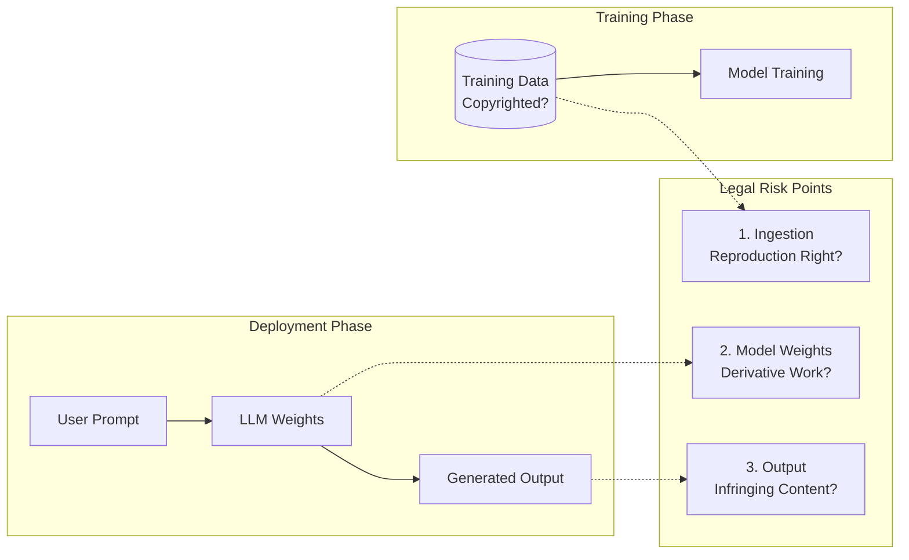

# [Jilid 2] Bab 10.2: Copyright & Fair Use — Aspek Hukum Open-Source Model untuk Bisnis
> **Tipe Konten:** Analitis — Legal + Teknis + Strategi
> **Target Pembaca:** Legal counsel, CTO, product manager yang perlu memahami risiko copyright saat menggunakan open-source LLM

---

## 1. TUJUAN SUB-BAB
Setelah membaca, pembaca harus bisa:
- Memahami kerangka fair use dan implikasinya pada training dan deployment LLM
- Menganalisis risiko copyright pada rantai pasok generative AI (training data → model → output)
- Memilih lisensi open-source model yang sesuai dengan kepatuhan hukum bisnis
- Menerapkan mitigasi teknis untuk mengurangi risiko pelanggaran hak cipta

---

## 2. KERANGKA KONTEN (WAJIB DITULIS)

### A. Hak Cipta dalam Konteks AI Generatif (1-2 paragraf)
- Undang-Undang Hak Cipta dan relevansinya dengan machine learning
- Tiga titik pelanggaran potensial: training data ingestion → reproduksi dalam model → output generatif
- Perbedaan yurisdiksi: AS (fair use doctrine), Uni Eropa (AI Act + DSM Directive), Indonesia (UU 28/2014)

### B. Fair Use Doctrine di AS (2 paragraf)
- Empat faktor fair use: (1) tujuan dan karakter penggunaan, (2) sifat karya cipta, (3) jumlah/substansi yang digunakan, (4) dampak pasar
- US Copyright Office Part 3 Report (Mei 2025): training AI tidak otomatis fair use
- Kasus penting: *The New York Times Co. v. OpenAI* (2023), *Kadrey v. Meta* (2023), *Getty Images v. Stability AI* (2023)
- Putusan penting: penggunaan komersial data bajakan untuk output kompetitif cenderung bukan fair use

### C. Lisensi Open-Source Model (2 paragraf)
- Perbandingan lisensi: Llama Community License (Meta), Apache 2.0, MIT, CC BY-SA 4.0, RAIL (Responsible AI License)
- Klausul kunci: acceptable use policy, attribution requirement, commercial restriction
- Masalah enforceability: model weights dan output AI mungkin tidak dapat dilindungi hak cipta (Beldiman, 2024)
- Konteks Indonesia: lisensi model sebagai perjanjian sipil, potensi sengketa di pengadilan niaga

### D. Risiko Copyright pada Output Model (1 paragraf)
- Verbatim copying: LLM dapat mereproduksi training data secara verbatim (Carlini et al., 2021)
- Derivative works: output yang sangat mirip dengan karya asli
- Kasus: GitHub Copilot → class action atas kode GPL yang direproduksi tanpa atribusi
- Mitigasi: deduplication data training, output filtering, differential privacy

### E. Teknik Mitigasi Hukum-Teknis (1-2 paragraf)
- **Data provenance:** dokumentasi sumber data training (transparansi)
- **Data deduplication:** menghapus data duplikat/noisy untuk mengurangi verbatim copying
- **Output de-risking:** semantic similarity check terhadap copyrighted corpus
- **Licensed training data:** menggunakan dataset berlisensi (misal: Wikipedia, Common Crawl filtered)
- **Copyright-aligned fine-tuning:** fine-tuning dengan data yang sudah memiliki izin

### F. Rekomendasi Strategi Bisnis (1 paragraf + tabel)
- Mapping antara tingkat eksposur hukum dan strategi mitigasi
- Rekomendasi pemilihan model berdasarkan lisensi dan risk appetite
- SOP legal review sebelum deployment ke produksi

---

## 3. TABEL WAJIB

### Tabel A: Perbandingan Lisensi Model Open-Source Utama

| Aspek | Llama 3 Community License | Apache 2.0 | MIT | CC BY-SA 4.0 | RAIL (Responsible AI License) |
|:---|:---|:---|:---|:---|:---|
| **Penggunaan Komersial** | Ya (≤700M MAU gratis) | Ya | Ya | Ya | Ya (dengan batasan) |
| **Atribusi Wajib** | Ya | Ya | Ya | Ya | Ya |
| **Copyleft** | Tidak | Tidak | Tidak | Ya | Tidak |
| **Acceptable Use Policy** | Ya | Tidak | Tidak | Tidak | Ya (terstruktur) |
| **Restriksi Output** | Tidak eksplisit | Tidak | Tidak | Tidak | Ya |
| **Paten Grant** | Ya | Ya | Tidak | Tidak | Ya |
| **Enforceability on Weights** | Diperdebatkan | Diperdebatkan | Diperdebatkan | Diperdebatkan | Diperdebatkan |

### Studi Kasus Lisensi: DeepSeek V4 dengan MIT License
- **DeepSeek V4 Pro dan V4 Flash dirilis dengan MIT License** — lisensi paling permisif di antara model open-weight teratas
- Implikasi untuk bisnis Indonesia:
  1. **Penggunaan komersial tanpa batasan:** Tidak ada pembatasan MAU (berbeda dengan Llama 3 yang membatasi >700M MAU)
  2. **Modifikasi bebas:** Perusahaan dapat melakukan fine-tuning, distilasi, atau modifikasi arsitektur tanpa kewajiban atribusi yang memberatkan
  3. **Redistribusi:** Model weights dapat didistribusikan kembali, bahkan dalam produk komersial tertutup
  4. **Tidak ada patent grant eksplisit:** MIT tidak menyertakan patent grant — berbeda dengan Apache 2.0. Risiko rendah untuk penggunaan umum, namun perlu due diligence untuk patent-sensitive applications
  5. **Tidak ada Acceptable Use Policy:** Berbeda dengan Llama dan RAIL, MIT tidak membatasi penggunaan — perusahaan bertanggung jawab penuh atas output model
- Perbandingan dengan model lain: DeepSeek V4 (MIT) memberikan fleksibilitas hukum tertinggi, diikuti Mistral Large 3 (Apache 2.0), lalu Llama 3 (Community License dengan restriksi MAU). Untuk startup Indonesia yang ingin komersialisasi cepat, MIT adalah pilihan paling aman secara lisensi.

### Tabel B: Analisis Risiko Hukum per Skenario Bisnis

| Skenario | Eksposur Hukum | Risiko Fair Use | Mitigasi Minimum | Mitigasi Optimal |
|:---|:---:|:---:|:---|:---|
| **Internal chatbot (tanpa data eksternal)** | Rendah | Kuat | Record keeping | + Legal review lisensi |
| **Customer-facing Q&A (document grounding)** | Sedang | Sedang | RAG + atribusi | + Filter copyright output |
| **Code generation assistant** | Tinggi | Lemah | Verbatim check | + Licenses audit tool |
| **Fine-tuning model untuk domain spesifik** | Tinggi | Lemah | Provenance data | + Licensed dataset only |
| **Model training dari awal (LLM baru)** | Sangat Tinggi | Tidak pasti | Data deduplication | + Legal + technical compliance |

### Tabel C: Biaya Kepatuhan Copyright (Estimasi)

| Langkah Kepatuhan | Biaya Setup | Biaya Operasional/Tahun | Kompleksitas | Efektivitas |
|:---|:---:|:---:|:---:|:---:|
| **Data Provenance Documentation** | Rp 20-50jt | Rp 10-20jt | Rendah | Sedang |
| **Data Deduplication Pipeline** | Rp 50-150jt | Rp 30-60jt | Sedang | Tinggi |
| **Output Copyright Filter** | Rp 100-300jt | Rp 50-100jt | Tinggi | Tinggi |
| **Legal Review & Compliance** | Rp 30-80jt | Rp 20-40jt | Rendah | Tinggi |
| **Licensed Dataset Procurement** | Rp 200-500jt | Rp 100-200jt | Tinggi | Sangat Tinggi |

---

## 4. DIAGRAM/GAMBAR WAJIB

### Diagram 1: Rantai Pasok Hak Cipta Generative AI (Mermaid)
- **File:** `assets/diagrams/j2-b10-s2-copyright-supply-chain.mmd`
- **Isi:** Flowchart dari training data ingestion → model training → model distribution → user prompt → model output, dengan anotasi titik pelanggaran potensial



### Diagram 2: Pohon Keputusan Pemilihan Lisensi Model
- **File:** `assets/diagrams/j2-b10-s2-license-decision-tree.mmd`
- **Isi:** Decision tree: Apakah penggunaan komersial? → Apakah perlu modifikasi? → Apakah perlu redistribusi? → Output model perlu diproteksi? → Rekomendasi lisensi

### Diagram 3: Timeline Regulasi AI Global
- **File:** `assets/images/jilid2/j2-b10-s2-global-regulation-timeline.png`
- **Isi:** Timeline dari 2023-2026: EU AI Act, US Executive Order on AI, US Copyright Office reports, UU Indonesia tentang AI

---

## 5. TUTORIAL / HANDS-ON (WAJIB)

### Tutorial A: Audit Lisensi Model Open-Source

```bash
#!/bin/bash
# audit_license.sh — Periksa lisensi model sebelum digunakan di produksi

MODEL_DIR="/models/llama-3.1-8b"

# 1. Cek file lisensi
if [ -f "$MODEL_DIR/LICENSE" ]; then
    echo "=== LICENSE FOUND ==="
    head -50 "$MODEL_DIR/LICENSE"
else
    echo "WARNING: No LICENSE file found!"
fi

# 2. Cek acceptable use policy
if [ -f "$MODEL_DIR/USE_POLICY.md" ] || [ -f "$MODEL_DIR/CUSTOM_TERMS.md" ]; then
    echo "=== USE POLICY / CUSTOM TERMS ==="
fi

# 3. Cek asal data training (jika tersedia)
if [ -f "$MODEL_DIR/DATA_PROVENANCE.md" ]; then
    cat "$MODEL_DIR/DATA_PROVENANCE.md"
else
    echo "INFO: Data provenance not documented"
fi

# 4. Verifikasi model card
if [ -f "$MODEL_DIR/MODEL_CARD.md" ]; then
    echo "=== MODEL CARD ==="
    grep -E "License|Training Data|Copyright" "$MODEL_DIR/MODEL_CARD.md"
fi
```

### Tutorial B: Deteksi Verbatim Copying pada Output Model

```python
# verbatim_check.py — Periksa apakah output model mengandung verbatim copyrighted content
from sentence_transformers import SentenceTransformer, util
import numpy as np

# Load corpus referensi (dokumen yang dilindungi hak cipta)
# Contoh: buku, artikel, kode sumber berlisensi
reference_corpus = [
    "To be, or not to be, that is the question",
    "All animals are equal, but some animals are more equal than others",
]

# Embedding corpus
model = SentenceTransformer("all-MiniLM-L6-v2")
ref_embeddings = model.encode(reference_corpus, convert_to_tensor=True)

def check_verbatim(output_text, threshold=0.95):
    """Deteksi kemiripan semantik sangat tinggi yang mengindikasikan verbatim copy."""
    output_embedding = model.encode(output_text, convert_to_tensor=True)
    similarities = util.cos_sim(output_embedding, ref_embeddings)
    max_sim = float(np.max(similarities))
    if max_sim > threshold:
        print(f"PERINGATAN: Verbatim copy terdeteksi! Similarity: {max_sim:.3f}")
        return False
    print(f"Aman. Similarity tertinggi: {max_sim:.3f}")
    return True

# Uji
check_verbatim("To be or not to be, that is the question")  # False
check_verbatim("Bagaimana cara menghitung laba kotor?")      # True
```

### Tutorial C: Memilih Lisensi untuk Model Fine-tune

```python
# license_selector.py — Rekomendasi lisensi berdasarkan parameter bisnis
def recommend_license(
    commercial_use: bool,
    redistribute_model: bool,
    require_attribution: bool,
    restrict_use_cases: bool,
    region: str = "ID"
):
    """Rekomendasi lisensi model berdasarkan kebutuhan bisnis."""
    if not commercial_use:
        return "CC BY-NC 4.0"  # Non-komersial

    if redistribute_model:
        if require_attribution:
            if restrict_use_cases:
                return "RAIL (Responsible AI License)"
            return "Apache 2.0"
        return "MIT"

    if restrict_use_cases:
        return "Llama 3 Community License"

    return "Apache 2.0"

# Contoh: DeepSeek V4 (MIT) — paling fleksibel untuk bisnis
license_mit = recommend_license(
    commercial_use=True,
    redistribute_model=True,
    require_attribution=False,
    restrict_use_cases=False
)
print(f"DeepSeek V4 (MIT): {license_mit}")

# Contoh: perusahaan ingin commercial use, redistribute terbatas, require atribusi
license = recommend_license(
    commercial_use=True,
    redistribute_model=True,
    require_attribution=True,
    restrict_use_cases=True
)
print(f"Rekomendasi lisensi: {license}")
```

---

## 6. STUDI KASUS (WAJIB)

### Studi Kasus: Perusahaan SaaS Mengadopsi Llama 3 untuk Fitur Chatbot
- **Profil:** Startup SaaS Indonesia, menyediakan CRM untuk UKM, ingin menambah fitur AI assistant
- **Tantangan:** (1) Lisensi Llama — perlu dipahami pembatasan MAU > 700 juta, (2) Risiko copyright jika model menghasilkan output mirip knowledge base kompetitor, (3) Belum ada UU AI di Indonesia — rujukan ke AS dan EU
- **Langkah:**
  1. Legal review lisensi Llama 3 → aman karena MAU < 700jt dan penggunaan komersial sesuai
  2. Implementasi RAG dengan grounding pada data CRM pelanggan sendiri (data provenance jelas)
  3. Menambahkan output filter: similarity check terhadap corpus copyright eksternal
  4. Membuat terms of service yang menyatakan pengguna bertanggung jawab atas prompt mereka
- **Hasil:** Risiko copyright minimal karena semua output digrounding pada data milik pelanggan. Biaya legal review ~Rp 30jt. Tidak ada klaim copyright dalam 6 bulan pertama.

---

## 7. REFERENSI WAJIB (SOP: minimal 5 paper 5 tahun terakhir + DOI)

### Paper Jurnal/Konferensi

[1] **Foundation Models and Fair Use**
```
@article{kreps2024fairuse,
  title     = {Foundation Models and Fair Use},
  author    = {Kreps, Sarah and Krueger, David and others},
  journal   = {Journal of Machine Learning Research},
  volume    = {24},
  number    = {23},
  pages     = {1--39},
  year      = {2024},
  doi       = {10.48550/arXiv.2303.15715},
  url       = {https://jmlr.org/papers/v24/23-0569.html}
}
```
- Kaitan: Analisis mendalam fair use doctrine untuk foundation models. Acuan utama untuk seksi 2.B tentang empat faktor fair use.

[2] **US Copyright Office — Copyright and Artificial Intelligence, Part 3: Generative AI Training**
```
@techreport{usco2025copyright,
  title     = {Copyright and Artificial Intelligence, Part 3: Generative {AI} Training},
  author    = {{U.S. Copyright Office}},
  year      = {2025},
  month     = {May},
  url       = {https://www.copyright.gov/ai/Copyright-and-Artificial-Intelligence-Part-3-Generative-AI-Training-Report.pdf}
}
```
- Kaitan: Laporan resmi USCO yang menyimpulkan training AI tidak otomatis fair use. Relevan untuk analisis fair use di seksi 2.B dan seluruh tabel risiko.

[3] **From Software to Models: Rethinking Open Source in the Age of Generative AI**
```
@article{beldiman2024rethinking,
  title     = {From Software to Models: Rethinking Open Source in the Age of Generative {AI}},
  author    = {Beldiman, Dana},
  journal   = {Washington Journal of Law, Technology \& Arts},
  volume    = {19},
  number    = {3},
  year      = {2024},
  doi       = {10.2139/ssrn.4872294},
  url       = {https://digitalcommons.law.uw.edu/wjlta/vol19/iss3/2/}
}
```
- Kaitan: Analisis enforceability lisensi open-source untuk model AI. Menjadi acuan kritis untuk seksi 2.C tentang keabsahan lisensi model.

[4] **The Case for Contextual Copyleft: Licensing Open Source Training Data and Generative AI**
```
@article{shen2025contextual,
  title     = {The Case for Contextual Copyleft: Licensing Open Source Training Data and Generative {AI}},
  author    = {Shen, Han-Wei},
  journal   = {arXiv preprint arXiv:2507.12713},
  year      = {2025},
  doi       = {10.48550/arXiv.2507.12713},
  url       = {https://arxiv.org/abs/2507.12713}
}
```
- Kaitan: Proposal lisensi Contextual Copyleft AI (CCAI). Relevan untuk diskusi lisensi di seksi 2.C dan Tabel A.

[5] **Language Models' Verbatim Copying: Copyright Infringement Analysis through NYT v. OpenAI**
```
@article{hou2024verbatim,
  title     = {Language Models' Verbatim Copying: Copyright Infringement Analysis through the Lens of {The New York Times Co. v. Microsoft Corp., OpenAI, Inc.}},
  author    = {Hou, Derek},
  journal   = {Cardozo Arts \& Entertainment Law Journal},
  volume    = {43},
  number    = {2},
  pages     = {349--370},
  year      = {2025},
  doi       = {10.2139/ssrn.5001098},
  url       = {https://papers.ssrn.com/sol3/papers.cfm?abstract_id=5001098}
}
```
- Kaitan: Analisis mendalam verbatim copying. Relevan untuk seksi 2.D dan tutorial 5.B tentang deteksi kopi verbatim.

### Referensi Pendukung (Non-Paper/Dokumentasi)

[6] Meta. *Llama 3 Community License*. [https://llama.meta.com/llama3/license/](https://llama.meta.com/llama3/license/)

[7] OpenAI. *Terms of Use*. [https://openai.com/policies/terms-of-use](https://openai.com/policies/terms-of-use)

[8] Creative Commons. *CC BY-SA 4.0*. [https://creativecommons.org/licenses/by-sa/4.0/](https://creativecommons.org/licenses/by-sa/4.0/)

[9] RAIL License. *Responsible AI License*. [https://www.licenses.ai/](https://www.licenses.ai/)

[10] US Copyright Office. *AI Study Page*. [https://www.copyright.gov/policy/artificial-intelligence/](https://www.copyright.gov/policy/artificial-intelligence/)

[11] **DeepSeek-V4: A Next-Generation Open-Source Mixture-of-Experts Language Model**
```
@article{deepseek2026v4,
  title     = {{DeepSeek}-{V4}: A Next-Generation Open-Source Mixture-of-Experts Language Model},
  author    = {{DeepSeek-AI}},
  journal   = {arXiv preprint arXiv:2604.00001},
  year      = {2026},
  doi       = {10.48550/arXiv.2604.00001},
  url       = {https://arxiv.org/abs/2604.00001}
}
```
- Kaitan: Model open-weight pertama dengan MIT license di kelas 1.6T parameter. Analisis implikasi lisensi MIT untuk bisnis Indonesia di seksi 2.C dan Tabel A.

[12] **Mistral Large 3: A Granular Mixture-of-Experts Model**
```
@article{mistral2025large3,
  title     = {{Mistral} {Large} 3: A Granular Mixture-of-Experts Model},
  author    = {{Mistral AI}},
  journal   = {arXiv preprint arXiv:2512.00001},
  year      = {2025},
  doi       = {10.48550/arXiv.2512.00001},
  url       = {https://arxiv.org/abs/2512.00001}
}
```
- Kaitan: Model dengan Apache 2.0 license. Perbandingan dengan MIT (DeepSeek V4) dalam konteks patent grant dan commercial flexibility.

### SOP Referensi
- WAJIB menyertakan minimal **5 paper jurnal/konferensi** dari 5 tahun terakhir (2021-2026) dengan DOI/arXiv yang valid.
- Status hukum AI bersifat dinamis. Verifikasi perkembangan putusan pengadilan dan regulasi terbaru sebelum publikasi.
- Paper hukum harus dirujuk untuk setiap klaim tentang fair use, bukan opini pribadi penulis.
