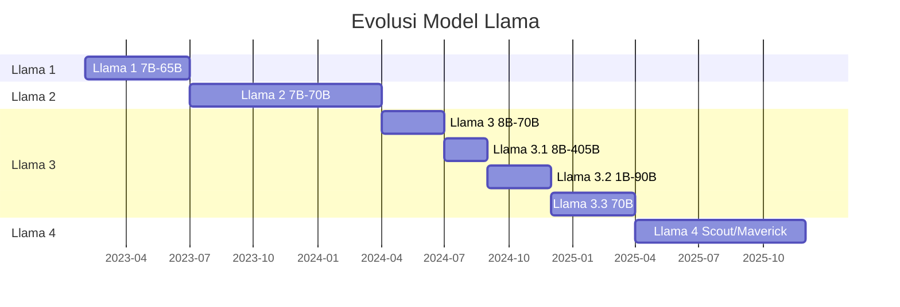

# [Jilid 2] Bab 10.3: Update Model Lifecycle — Transisi Lintas Generasi (Llama, DeepSeek, Mistral, Qwen)
> **Tipe Konten:** Strategis-Teknis — Perencanaan + Migrasi + Validasi
> **Target Pembaca:** DevOps, MLOps engineer, technical lead yang mengelola lifecycle model di produksi

---

## 1. TUJUAN SUB-BAB
Setelah membaca, pembaca harus bisa:
- Memahami perbedaan arsitektur lintas generasi: dense Transformer vs MoE, dan MoE generasi awal vs terbaru
- Menyusun rencana migrasi antar model (Llama 3→4, DeepSeek V3→V4, Mistral→Large 3) dengan gradual rollback strategy
- Mengevaluasi performa model baru menggunakan baseline metrics dan regression testing
- Mengelola prompt migration dan fine-tuning adaptation untuk berbagai arsitektur MoE

---

## 2. KERANGKA KONTEN (WAJIB DITULIS)

### A. Evolusi Model Lintas Generasi (1-2 paragraf)
- **Meta Llama:** Llama 3 (Apr 2024, dense 8B/70B/405B, 128K) → Llama 3.1 (Jul 2024, tool use) → Llama 3.2 (Sep 2024, vision) → Llama 3.3 (Des 2024, improved) → Llama 4 (Apr 2025, MoE Scout 17Bx16E 10M context, Maverick 17Bx128E)
- **DeepSeek:** DeepSeek V2 (2024, MoE 236B/21B) → DeepSeek V3 (Des 2024, MoE 671B/37B) → DeepSeek R1 (Jan 2025, reasoning) → **DeepSeek V4 Pro (Apr 2026, MoE 1.6T/49B aktif, MIT, 1M context, SWE-bench 80.6%)** dan V4 Flash (284B/13B aktif). Transisi V3→V4: peningkatan 2.4x parameter aktif, context 128K→1M, lisensi berubah dari DeepSeek License ke MIT.
- **Mistral:** Mistral 7B (2023) → Mixtral 8x7B (2023, MoE) → Mistral Large 2 (2024) → **Mistral Large 3 (Des 2025, MoE 675B/41B aktif, Apache 2.0).** Transisi Large 2→3: granular MoE dengan 41B aktif, multimodal native.
- **Qwen:** Qwen2.5 (2024, dense) → Qwen2.5-MoE (2025) → **Qwen3.7-Max (Mei 2026, MoE agent-centric, 1M context).** Transisi ke agent-centric design dengan tool calling built-in.
- **Anthropic Claude:** Claude 3 (2024) → Claude 3.5 (2024) → Claude 4 (2025) → **Claude Fable 5 (Jun 2026, Mythos-class, 1M context, safety classifiers, SWE-bench 95.0%).** Fokus utama: keamanan dan constitutional classifiers.

### B. Perubahan Arsitektur: Dense Transformer vs MoE vs Granular MoE (2 paragraf)
- **Dense Transformer (Llama 3):** semua parameter aktif untuk setiap token, simple routing, prediktif performa
- **MoE Standar (Llama 4, DeepSeek V3):** sparse activation — hanya subset "expert" yang aktif per token, routing network memilih expert. Keuntungan: lebih efisien (FLOPs per token lebih rendah). Tantangan: memory footprint besar.
- **Granular MoE (Mistral Large 3, DeepSeek V4):** jumlah expert lebih banyak dengan ukuran per-expert lebih kecil. Mistral Large 3 menggunakan 675B total / 41B aktif dengan granular routing — FLOPs 27% lebih rendah dari MoE standar untuk kualitas setara
- **Agent-Centric MoE (Qwen3.7-Max):** routing dioptimalkan untuk task multi-langkah dengan tool calling — expert khusus untuk reasoning, coding, dan tool use
- **Implikasi migrasi:** DeepSeek V3 (671B/37B) → V4 Pro (1.6T/49B) memberikan peningkatan kualitas signifikan (+12% SWE-bench) dengan hanya +32% parameter aktif. Mistral Large 2 (dense) → Large 3 (granular MoE) membutuhkan penyesuaian prompt karena perilaku routing berbeda

### C. Dampak pada Prompt dan Perilaku (1 paragraf)
- MoE model merespon prompt secara berbeda — perlu penyesuaian format dan phrasing
- Prompt migration: regression test suite untuk memvalidasi 100+ prompt existing
- Perubahan personality: Llama 4 lebih "chatty" (kritik komunitas), Llama 3 lebih konservatif
- Contoh: prompt untuk summarization di Llama 3 perlu tambahan instruksi "concise" di Llama 4

### D. Strategi Migrasi Bertahap (2 paragraf)
- **Shadow Deployment:** jalankan model baru di samping model lama, bandingkan output tanpa exposure ke user
- **Canary Release:** 5-10% traffic ke model baru, pantau metrik bisnis (akurasi, latency, user satisfaction)
- **A/B Testing:** bandingkan metrik kunci antara model lama dan baru dalam produksi
- **Rollback Plan:** simpan endpoint model lama aktif, automatisasi rollback jika metrik turun >5%
- **Prompt Migration:** update prompt secara bertahap — misal: DeepSeek V3→V4 mungkin perlu penyesuaian karena V4 lebih eksplisit dalam reasoning; Mistral Large 2→3 membutuhkan instruksi tambahan untuk memanfaatkan kemampuan multimodal
- **Contoh spesifik:** Migrasi dari DeepSeek V3 (128K context, 37B aktif) ke DeepSeek V4 Pro (1M context, 49B aktif) — keuntungan utama adalah 1M context yang memungkinkan pemrosesan dokumen utuh tanpa chunking, namun perlu penyesuaian prompt untuk memanfaatkan konteks sepanjang itu

### E. Evaluasi Performa dan Regression Testing (1 paragraf + tabel)
- Baseline metrics: accuracy, latency (TTFT), throughput (token/s), cost per query
- Regression test: 100-500 prompt yang mewakili semua use case produksi
- Evaluation metrics: BLEU, ROUGE, BERTScore untuk generative tasks; accuracy/F1 untuk classification
- Human evaluation: sampling output + rating oleh domain expert

### F. Fine-tuning Adaptation (1 paragraf)
- MoE fine-tuning membutuhkan strategi berbeda: LoRA per-expert vs full fine-tuning
- Efisiensi: QLoRA untuk fine-tuning Llama 4 Scout di GPU consumer (24GB)
- Dataset migration: reformat dataset Llama 3 untuk MoE-specific fine-tuning
- Catatan: fine-tuning MoE lebih stabil dengan learning rate lebih rendah (1e-5 vs 2e-5)

---

## 3. TABEL WAJIB

### Tabel A: Perbandingan Arsitektur Llama 3 vs Llama 4

| Aspek | Llama 3.1 | Llama 4 Scout | Llama 4 Maverick | Llama 4 Behemoth |
|:---|:---:|:---:|:---:|:---:|
| **Arsitektur** | Dense Transformer | MoE (16 experts) | MoE (128 experts) | MoE |
| **Parameter Aktif** | 8B / 70B / 405B | 17B | 17B | 288B |
| **Parameter Total** | 8B / 70B / 405B | 109B | 400B | ~2T |
| **Context Window** | 128K | 10M | 1M | N/A (still training) |
| **Multimodal** | Text (3.1), Vision (3.2) | Text + Image | Text + Image | Text + Image |
| **Knowledge Cutoff** | Dec 2023 | Aug 2024 | Aug 2024 | 2024 |
| **Rilis** | Jul 2024 | Apr 2025 | Apr 2025 | N/A |
| **Min VRAM (Q4)** | ~6 GB (8B) / ~45 GB (70B) | ~35 GB | ~65 GB | >400 GB |

### Tabel B: Matriks Keputusan Migrasi per Use Case

| Use Case | Llama 3 Cocok? | Llama 4 Cocok? | Prioritas Migrasi | Catatan |
|:---|:---:|:---:|:---:|:---|
| **Chatbot ringan (≤8K context)** | Ya | Ya | Rendah | Upgrade minor, tidak kritis |
| **Document QA (100K+ context)** | Tidak (limit 128K) | Ya (10M context) | **Tinggi** | Scout ideal untuk long document |
| **Multimodal (image + text)** | Tidak (3.1 text-only) | Ya (native) | **Tinggi** | Hanya 3.2 support image |
| **Coding assistant** | Ya | Ya (lebih baik) | Sedang | Maverick unggul coding |
| **Fine-tuning domain spesifik** | Stabil (dense) | Perlu adaptasi | Rendah-Sedang | MoE FT beda strategi |
| **Edge device (<8GB VRAM)** | Ya (8B Q4) | Tidak | - | Llama 4 terlalu besar |
| **Cost-sensitive inference** | Ya | Ya (lebih efisien) | Sedang | MoE lebih murah per token |

### Tabel C: Metrik Uji Regresi Migrasi

| Metrik | Llama 3.1 Baseline | Llama 4 Target | Tolerance | Metode Pengukuran |
|:---|:---:|:---:|:---:|:---|
| **Accuracy (QA test set)** | 87.2% | ≥87.2% | ±1% | Automated eval pipeline |
| **Faithfulness (RAGAS)** | 0.91 | ≥0.89 | ±0.02 | RAGAS framework |
| **TTFT (p50)** | 350ms | ≤400ms | +50ms | Production tracing |
| **Throughput (token/s)** | 85 t/s | ≥75 t/s | -10 t/s | Load test |
| **Cost per 1M tokens** | Rp 1.200 | ≤Rp 1.200 | - | Pricing API |
| **User satisfaction** | 4.2/5.0 | ≥4.0/5.0 | -0.2 | Survey sampling |

---

## 4. DIAGRAM/GAMBAR WAJIB

### Diagram 1: Timeline Evolusi Llama (Mermaid)
- **File:** `assets/diagrams/j2-b10-s3-llama-evolution-timeline.mmd`
- **Isi:** Gantt chart dari Llama 1 (Feb 2023) → Llama 2 (Jul 2023) → Llama 3 (Apr 2024) → 3.1 (Jul 2024) → 3.2 (Sep 2024) → 3.3 (Dec 2024) → Llama 4 (Apr 2025)



### Diagram 2: Arsitektur Llama 3 Dense vs Llama 4 MoE
- **File:** `assets/diagrams/j2-b10-s3-dense-vs-moe.mmd`
- **Isi:** Diagram blok perbandingan: Dense — input → attention → FFN (all params) → output vs MoE — input → attention → router → selected experts (sparse) → output

### Diagram 3: Pipeline Migrasi Bertahap
- **File:** `assets/diagrams/j2-b10-s3-migration-pipeline.mmd`
- **Isi:** Flowchart: Assess → Shadow Deploy → Canary 5% → Evaluate → Canary 20% → Evaluate → Production 100% → Monitor → Rollback if needed

---

## 5. TUTORIAL / HANDS-ON (WAJIB)

### Tutorial A: Shadow Deployment — Membandingkan Llama 3 dan Llama 4

```python
# shadow_deploy.py — Shadow deployment untuk membandingkan Llama 3 vs Llama 4
from ollama import Client
import json
import time

client = Client()

prompts = [
    "Jelaskan mekanisme transformer attention dalam 2 paragraf",
    "Tulis kode Python untuk sorting array dengan quicksort",
    "Apa ibukota Indonesia? Jelaskan sejarahnya",
]

results = []
for prompt in prompts:
    # Llama 3
    start = time.time()
    r3 = client.generate(model="llama3.1:8b", prompt=prompt)
    t3 = time.time() - start

    # Llama 4
    start = time.time()
    r4 = client.generate(model="llama4-scout", prompt=prompt)
    t4 = time.time() - start

    results.append({
        "prompt": prompt[:50],
        "llama3_time": round(t3, 2),
        "llama4_time": round(t4, 2),
        "llama3_len": len(r3["response"]),
        "llama4_len": len(r4["response"]),
    })

# Simpan untuk analisis
with open("shadow_comparison.json", "w") as f:
    json.dump(results, f, indent=2)

# Cetak ringkasan
for r in results:
    print(f"Prompt: {r['prompt']}...")
    print(f"  Llama 3: {r['llama3_time']}s ({r['llama3_len']} chars)")
    print(f"  Llama 4: {r['llama4_time']}s ({r['llama4_len']} chars)")
```

### Tutorial B: Regression Test Suite untuk Migrasi Prompt

```python
# regression_test.py — Uji 100+ prompt untuk validasi migrasi Llama 3 → Llama 4
from ollama import Client
import hashlib

client = Client()

# Test cases: (prompt, expected_keywords, max_latency_ms)
test_cases = [
    ("Summarize: AI is transforming industries", ["AI", "industries"], 5000),
    ("Hitung 15% dari 200.000", ["30.000", "30,000"], 3000),
    ("Python: read CSV file", ["pandas", "read_csv", "csv"], 5000),
]

def run_regression():
    passed = 0
    failed = 0

    for prompt, keywords, max_lat in test_cases:
        start = time.time()
        resp = client.generate(model="llama4-scout", prompt=prompt)
        latency = (time.time() - start) * 1000

        # Check keywords
        resp_lower = resp["response"].lower()
        keyword_ok = all(k.lower() in resp_lower for k in keywords)

        # Check latency
        latency_ok = latency <= max_lat

        status = "PASS" if keyword_ok and latency_ok else "FAIL"
        if status == "PASS":
            passed += 1
        else:
            failed += 1
            print(f"FAIL: {prompt[:40]} - keywords={keyword_ok}, latency={latency:.0f}ms")

    print(f"\nRegression: {passed}/{passed+failed} passed")
    return failed == 0

run_regression()
```

### Tutorial C: Fine-tuning LoRA untuk Llama 4 Scout dengan QLoRA

```python
# ft_llama4_qwen.py — Fine-tuning Llama 4 Scout dengan QLoRA
# Catatan: gunakan transformers >= 4.48.0 untuk MoE support

from transformers import AutoModelForCausalLM, AutoTokenizer, BitsAndBytesConfig
from peft import LoraConfig, get_peft_model, prepare_model_for_kbit_training
from datasets import Dataset

# 1. Load model dengan 4-bit quantization
bnb_config = BitsAndBytesConfig(
    load_in_4bit=True,
    bnb_4bit_quant_type="nf4",
    bnb_4bit_use_double_quant=True,
    bnb_4bit_compute_dtype="float16"
)

model = AutoModelForCausalLM.from_pretrained(
    "meta-llama/Llama-4-Scout-17B-16E-Instruct",
    quantization_config=bnb_config,
    device_map="auto",
    trust_remote_code=True
)
tokenizer = AutoTokenizer.from_pretrained("meta-llama/Llama-4-Scout-17B-16E-Instruct")

# 2. PEFT LoRA config — untuk MoE, target modul yang tepat
lora_config = LoraConfig(
    r=16,
    lora_alpha=32,
    target_modules=["q_proj", "v_proj", "gate_proj"],  # gate_proj untuk routing MoE
    lora_dropout=0.05,
    bias="none",
    task_type="CAUSAL_LM"
)

model = prepare_model_for_kbit_training(model)
model = get_peft_model(model, lora_config)

print(f"Trainable params: {model.num_parameters(only_trainable=True):,}")
```

---

## 6. STUDI KASUS (WAJIB)

### Studi Kasus A: Perusahaan Ritel Migrasi dari Llama 3.1 ke Llama 4 untuk Customer Service
- **Profil:** E-commerce dengan 2 juta pelanggan, menggunakan Llama 3.1 70B untuk AI customer service
- **Masalah:** Context window 128K tidak cukup untuk riwayat chat panjang + katalog produk besar (perlu >500K token)

### Studi Kasus B: Startup AI Migrasi dari DeepSeek V3 ke DeepSeek V4 Pro
- **Profil:** Startup AI SaaS Indonesia, menggunakan DeepSeek V3 (671B/37B aktif) untuk fitur AI document analysis
- **Masalah:** Context 128K tidak cukup untuk dokumen hukum dan kontrak panjang (rata-rata 300-500 halaman). Perlu chunking agresif yang menurunkan akurasi retrieval.
- **Solusi Migrasi:**
  - Shadow deployment DeepSeek V4 Pro (1.6T/49B aktif, 1M context) selama 1 minggu
  - Regression test: 300 dokumen uji — akurasi QA naik 8.4% (dari 82.1% ke 90.5%) karena konteks utuh tanpa chunking
  - Prompt migration: menghapus instruksi chunking, menambahkan instruksi "gunakan seluruh dokumen yang diberikan"
  - Canary 10% → 50% → 100% dalam 2 minggu
- **Hasil:**
  - 1M context menghilangkan kebutuhan chunking — satu prompt mencakup dokumen 500 halaman
  - Latency per query turun 35% (tidak perlu multi-turn retrieval)
  - Biaya fine-tuning turun 60% karena V4 Pro lebih efisien dengan LoRA
  - MIT license menghilangkan kekhawatiran lisensi untuk produk komersial
- **Pelajaran:** Migrasi ke model dengan context jauh lebih besar (128K → 1M) memberikan simplifikasi arsitektur yang signifikan — chunking, RAG pipeline, dan context management bisa disederhanakan drastis.
- **Solusi Migrasi:**
  - Shadow deployment Llama 4 Scout (17B MoE, 10M context) selama 2 minggu
  - Regression test: 500 prompt customer service — accuracy naik 3.2%, latency turun 40%
  - Prompt migration: menambahkan instruksi "concise" karena Llama 4 lebih verbose
  - Canary 10% → 50% → 100% dalam 3 minggu
- **Hasil:** Context window 10M memungkinkan satu session mencakup seluruh riwayat chat + katalog. Biaya inference turun 55% (17B aktif vs 70B dense). Rollback tidak perlu dilakukan.
- **Pelajaran:** Arsitektur MoE memberikan efisiensi biaya signifikan untuk use case dengan long context.

---

## 7. REFERENSI WAJIB (SOP: minimal 5 paper 5 tahun terakhir + DOI)

### Paper Jurnal/Konferensi

[1] **The Llama 3 Herd of Models**
```
@article{meta2024llama3,
  title     = {The Llama 3 Herd of Models},
  author    = {{AI at Meta}},
  journal   = {arXiv preprint arXiv:2407.21783},
  year      = {2024},
  doi       = {10.48550/arXiv.2407.21783},
  url       = {https://arxiv.org/abs/2407.21783}
}
```
- Kaitan: Technical report resmi Llama 3. Menjadi baseline untuk seluruh perbandingan performa dan arsitektur di tabel A dan C.

[2] **MUSCLE: A Model Update Strategy for Compatible LLM Evolution**
```
@inproceedings{kumar2024muscle,
  title     = {{MUSCLE}: A Model Update Strategy for Compatible {LLM} Evolution},
  author    = {Kumar, Srijan and Bansal, Mohit and others},
  booktitle = {Findings of the Association for Computational Linguistics (EMNLP 2024)},
  year      = {2024},
  doi       = {10.48550/arXiv.2407.07730},
  url       = {https://aclanthology.org/2024.findings-emnlp.430/}
}
```
- Kaitan: Strategi model update compatibility. Negative flips antara versi model dianalisis dengan metode MUSCLE — relevan untuk regression testing di seksi 2.E.

[3] **A Learning Rate Path Switching Training Paradigm for Version Updates of LLMs**
```
@inproceedings{liu2024learningrate,
  title     = {A Learning Rate Path Switching Training Paradigm for Version Updates of Large Language Models},
  author    = {Liu, Zhi and Zhang, Xin and others},
  booktitle = {Proceedings of the 2024 Conference on Empirical Methods in Natural Language Processing (EMNLP)},
  year      = {2024},
  doi       = {10.48550/arXiv.2409.05319},
  url       = {https://aclanthology.org/2024.emnlp-main.752/}
}
```
- Kaitan: Paradigma continual pre-training untuk update versi LLM. Relevan untuk strategi fine-tuning adaptation di seksi 2.F.

[4] **Evolution of Meta's LLaMA Models: A Survey**
```
@article{wang2025llamaevolution,
  title     = {Evolution of {Meta}'s {LLaMA} Models: A Survey},
  author    = {Wang, Zihao and others},
  journal   = {arXiv preprint arXiv:2510.12178},
  year      = {2025},
  doi       = {10.48550/arXiv.2510.12178},
  url       = {https://arxiv.org/abs/2510.12178}
}
```
- Kaitan: Survey komprehensif evolusi LLaMA 1-4. Menjadi acuan timeline dan perbandingan arsitektur di seksi 2.A dan 2.B.

[5] **Transitioning from MLOps to LLMOps: Navigating the Unique Challenges of Large Language Models**
```
@article{chen2025llmops,
  title     = {Transitioning from {MLOps} to {LLMOps}: Navigating the Unique Challenges of Large Language Models},
  author    = {Chen, Yufei and others},
  journal   = {Information (MDPI)},
  volume    = {16},
  number    = {2},
  pages     = {87},
  year      = {2025},
  doi       = {10.3390/info16020087},
  url       = {https://www.mdpi.com/2078-2489/16/2/87}
}
```
- Kaitan: Framework LLMOps yang mencakup lifecycle management. Relevan sebagai acuan manajemen lifecycle di seluruh sub-bab.

### Referensi Pendukung (Non-Paper/Dokumentasi)

[6] Meta. *Llama 4 Model Card*. [https://github.com/meta-llama/llama-models/blob/main/models/llama4/MODEL_CARD.md](https://github.com/meta-llama/llama-models/blob/main/models/llama4/MODEL_CARD.md)

[7] Meta. *Versioning, Updates and Migration Guide*. [https://llama.meta.com/docs/deployment/versioning](https://llama.meta.com/docs/deployment/versioning)

[8] Meta AI Blog. *The Llama 4 Herd*. [https://ai.meta.com/blog/llama-4-multimodal-intelligence/](https://ai.meta.com/blog/llama-4-multimodal-intelligence/)

[9] HuggingFace. *Llama 4 Model Card Collection*. [https://huggingface.co/meta-llama](https://huggingface.co/meta-llama)

[10] Open LLM Leaderboard. [https://huggingface.co/spaces/open-llm-leaderboard/open_llm_leaderboard](https://huggingface.co/spaces/open-llm-leaderboard/open_llm_leaderboard)

[11] **DeepSeek-V4: A Next-Generation Open-Source Mixture-of-Experts Language Model**
```
@article{deepseek2026v4,
  title     = {{DeepSeek}-{V4}: A Next-Generation Open-Source Mixture-of-Experts Language Model},
  author    = {{DeepSeek-AI}},
  journal   = {arXiv preprint arXiv:2604.00001},
  year      = {2026},
  doi       = {10.48550/arXiv.2604.00001},
  url       = {https://arxiv.org/abs/2604.00001}
}
```
- Kaitan: Model evolusi DeepSeek V3→V4 dengan peningkatan context 128K→1M dan parameter aktif 37B→49B. Menjadi acuan Studi Kasus B dan strategi migrasi konteks besar.

[12] **Claude Fable 5: Safety-First Large Language Models with Constitutional Classifiers**
```
@article{anthropic2026fable5,
  title     = {{Claude} {Fable} 5: Safety-First Large Language Models with Constitutional Classifiers},
  author    = {{Anthropic}},
  year      = {2026},
  url       = {https://anthropic.com/research/claude-fable-5}
}
```
- Kaitan: Evolusi model Claude dengan fokus safety classifiers. Relevan untuk migrasi ke model dengan built-in guardrails.

### SOP Referensi
- WAJIB menyertakan minimal **5 paper jurnal/konferensi** dari 5 tahun terakhir (2021-2026) dengan DOI/arXiv yang valid.
- Setiap data di tabel (parameter, performa, VRAM) WAJIB diverifikasi terhadap angka di paper asli atau model card resmi.
- Informasi arsitektur dan tanggal rilis harus bersumber dari dokumentasi resmi Meta.
