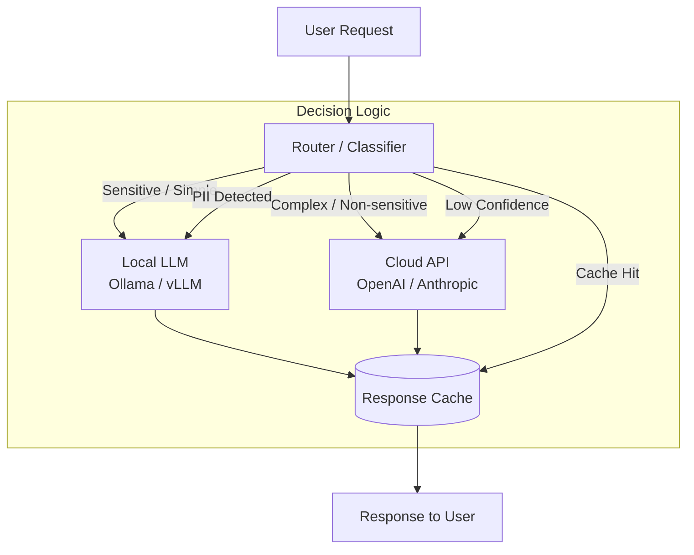

# [Jilid 2] Bab 10.4: Local LLM vs Cloud — Kapan Tetap Lokal dan Kapan Hybrid
> **Tipe Konten:** Analitis — Perbandingan Arsitektur + Biaya + Keputusan
> **Target Pembaca:** CTO, Head of Infrastructure, IT Manager yang menentukan strategi deployment LLM

---

## 1. TUJUAN SUB-BAB
Setelah membaca, pembaca harus bisa:
- Menganalisis trade-off biaya, privasi, latency, dan kualitas antara local vs cloud LLM
- Menentukan threshold kapan deployment lokal lebih ekonomis daripada cloud API
- Merancang arsitektur hybrid yang mengoptimalkan biaya tanpa mengorbankan kualitas
- Mengevaluasi faktor keputusan: compliance, data sensitivity, user concurrency, budget

---

## 2. KERANGKA KONTEN (WAJIB DITULIS)

### A. Model Deployment LLM: Tiga Pilar Utama (1-2 paragraf)
- **Local (On-premise):** LLM berjalan di hardware sendiri — kontrol penuh, privasi maksimal, biaya CAPEX tinggi
- **Cloud (API-based):** LLM diakses via API (OpenAI, Anthropic, Google) — OPEX, skalabilitas, kualitas tertinggi
- **Hybrid:** kombinasi local untuk tugas sederhana/sensitif, cloud untuk tugas kompleks — keseimbangan optimal
- Konteks Indonesia: biaya listrik Rp 1.500-2.500/kWh, bandwidth internet bervariasi, regulasi data domestik (UU PDP)

### B. Faktor Keputusan: Analisis Multi-Dimensi (2 paragraf)
- **Privasi & Kepatuhan:** data sensitif (medis, legal, finansial) WAJIB lokal — UU PDP Pasal 15 tentang perlindungan data
- **Latency:** real-time application (<500ms) → lokal; batch processing → cloud lebih murah
- **Kualitas Output:** cloud model (GPT-5.5, Claude Fable 5, Gemini 2.5 Pro) masih unggul untuk creative/reasoning kompleks. Namun, DeepSeek V4 Pro (open-weight, MIT) menawarkan kualitas mendekati proprietary untuk agentic task (SWE-bench 80.6%) dengan biaya lokal nol per token
- **Biaya:** break-even analysis — pada volume berapa lokal lebih murah dari cloud API
- **Skalabilitas:** traffic spike → cloud auto-scale; traffic stabil → lokal predictable
- **Keandalan:** local tergantung hardware sendiri; cloud punya SLA 99.9%+

### C. Analisis Biaya: CAPEX vs OPEX (1 paragraf + tabel)
- Biaya lokal: hardware (GPU/server) + listrik + pendingin + maintenance + depresiasi 3-5 tahun
- Biaya cloud: per-token pricing + throughput commitment + data transfer
- Break-even point: estimasi 5-20M token/bulan tergantung model dan hardware
- Contoh: Mac Mini M4 Pro 48GB + Ollama vs GPT-4o mini API — break-even di ~8M token/bulan

### D. Arsitektur Hybrid Optimal (2 paragraf)
- **Routing logic:** local untuk PII/sensitive query, cloud untuk complex reasoning
- **Local-first approach:** coba lokal dulu → jika confidence rendah → kirim ke cloud
- **Framework hybrid:** OpenRouter, LiteLLM, atau custom router dengan fallback strategy
- **Teknik:** ADASWITCH (resource-constrained RL), TMO (multi-modal offloading), MINIONS (decomposition)
- **Sinkronisasi:** cache cloud responses di local untuk reuse, mengurangi biaya repetitive query

### E. Keamanan Data di Skenario Hybrid (1 paragraf)
- Data sensitivity classification: tier 1 (lokal wajib), tier 2 (hybrid dengan masking), tier 3 (cloud aman)
- Anonymization: scrub PII sebelum kirim ke cloud, re-identifikasi setelah respons
- Encryption: TLS in-transit zero-trust antara local dan cloud
- Audit log: semua request ke cloud tercatat, termasuk timestamp, model, token count

### F. Rekomendasi per Profil Bisnis (1 paragraf + tabel)

---

## 3. TABEL WAJIB

### Tabel A: Perbandingan Local vs Cloud vs Hybrid

| Aspek | Local (On-premise) | Cloud API | Hybrid |
|:---|:---:|:---:|:---:|
| **Biaya Awal (CAPEX)** | Rp 30-250jt | Rp 0 | Rp 15-150jt |
| **Biaya Bulanan (OPEX)** | Rp 1-5jt (listrik) | Rp 5-100jt (token) | Rp 1-30jt |
| **Privasi Data** | Sangat Tinggi | Tergantung provider | Tinggi |
| **Kualitas Model** | Meningkat drastis (DS V4 Pro, Mistral Large 3) | Tertinggi (GPT-5.5, Fable 5) | Optimal |
| **Latency** | 50-500ms (lokal) | 500-3000ms (network) | 50-2000ms |
| **Skalabilitas** | Terbatas hardware | Unlimited | Sedang |
| **Maintenance** | Tinggi (tim internal) | None (provider) | Sedang |
| **Compliance (UU PDP)** | Mudah | Perlu DPA | Perlu DPA parsial |
| **Best For** | Data sensitif, traffic tetap | Startup, traffic spike | Perusahaan menengah-besar |
| **Model Open-Weight Unggulan** | DS V4 Pro (49B, 1M ctx), Mistral Large 3 (41B, 256K), Qwen3.7-Max | GPT-5.5, Claude Fable 5, Gemini 2.5 Pro | Kombinasi optimal |

### Tabel A1: Model Open-Weight Terbaru untuk Deployment Lokal

| Model | Parameter (Aktif) | Context | VRAM (Q4) | SWE-bench | Lisensi | Keunggulan |
|:---|:---:|:---:|:---:|:---:|:---:|:---|
| **DeepSeek V4 Pro** | 49B (1.6T total) | 1M | ~32 GB | **80.6%** | MIT | Open-weight terkuat, agentic |
| **DeepSeek V4 Flash** | 13B (284B total) | 1M | ~10 GB | — | MIT | Efisien, context besar |
| **Mistral Large 3** | 41B (675B total) | 256K | ~28 GB | — | Apache 2.0 | Multimodal, granular MoE |
| **Qwen3.7-Max** | ~40B (MoE) | 1M | ~28 GB | — | Proprietary | Agent-centric, tool calling |
| **Ministral 3 (8B)** | 8B (dense) | 128K | ~6 GB | — | Apache 2.0 | Edge-friendly, Cascade Distillation |
| **Llama 4 Scout** | 17B (109B total) | 10M | ~35 GB | — | Llama Community | Context terbesar (10M) |

### Tabel B: Break-even Analysis — Local vs Cloud dengan Model Terbaru

| Skenario | Hardware | Model Lokal | CAPEX | Biaya/1M Token (local) | Biaya/1M Token (cloud) | Break-even (token/bulan) |
|:---|:---|:---|:---:|:---:|:---:|:---:|
| **Kecil (1-5 user)** | Mac Mini M4 24GB | DS V4 Flash (13B) | Rp 20jt | Rp 800 | Rp 15.000 (GPT-4o mini) | ~1.4M |
| **Menengah (5-20 user)** | PC RTX 4090 24GB | DS V4 Pro (49B Q4) | Rp 45jt | Rp 1.200 | Rp 75.000 (GPT-5.5) | ~610K |
| **Menengah (5-20 user)** | PC RTX 4090 24GB | Mistral Large 3 (41B Q4) | Rp 45jt | Rp 1.100 | Rp 60.000 (Claude Fable 5) | ~765K |
| **Besar (20-100 user)** | 2x RTX 4090 NVLink | DS V4 Pro + V4 Flash | Rp 90jt | Rp 700 | Rp 75.000 (GPT-5.5) | ~1.2M |
| **Enterprise (>100 user)** | 4x A100 80GB | DS V4 Pro + Mistral L3 | Rp 2.5M | Rp 200 | Rp 60.000 (Claude Fable 5) | ~42K |
| **Catatan:** | Estimasi 3 tahun depresiasi | | | Rp/kWh = 1.500 | Harga API | Semakin besar volume, semakin murah lokal |

### Tabel C: Matriks Keputusan per Skenario

| Skenario | Privasi | Latency | Budget | Kualitas | Rekomendasi | Rasional |
|:---|:---:|:---:|:---:|:---:|:---|:---|
| **Chatbot medis (data pasien)** | Wajib | <2s | Sedang | Tinggi | **Lokal** (Llama 3 70B Q4) | UU PDP + kerahasiaan pasien |
| **CS ritel (non-PII)** | Rendah | <5s | Rendah | Sedang | **Cloud** (GPT-4o mini) | Biaya lebih murah, quality cukup |
| **Dokumen legal (kontrak)** | Tinggi | <10s | Tinggi | Sangat Tinggi | **Hybrid** (lokal + cloud review) | Data sensitif, tapi butuh quality |
| **Internal knowledge base** | Sedang | <3s | Sedang | Sedang | **Lokal** (Qwen 2.5 14B) | Cukup untuk dokumentasi internal |
| **AI coding assistant** | Rendah | <1s | Sedang | Sangat Tinggi | **Hybrid** (lokal DS V4 Pro + cloud Fable 5) | DS V4 Pro (SWE-bench 80.6%) kuat untuk coding lokal |
| **Multimodal (image analysis)** | Sedang | <5s | Tinggi | Tinggi | **Hybrid** (lokal Mistral Large 3 + cloud Gemini 2.5) | Mistral Large 3 multimodal native |
| **Agentic workflow multi-step** | Sedang | <5s | Sedang | Sangat Tinggi | **Lokal** (DS V4 Pro 1M context) | 1M context + agentic benchmark tertinggi open-source |
| **Edge/IoT device** | Sedang | <1s | Rendah | Sedang | **Lokal** (Ministral 3 8B) | Cascade Distillation, 6GB VRAM cukup |

---

## 4. DIAGRAM/GAMBAR WAJIB

### Diagram 1: Arsitektur Hybrid Local-Cloud LLM (Mermaid)
- **File:** `assets/diagrams/j2-b10-s4-hybrid-architecture.mmd`
- **Isi:** Diagram komponen: user → classifier/routing → local LLM (Ollama/vLLM) OR cloud API (OpenAI/Anthropic) → response cache → user



### Diagram 2: Grafik Break-even Point (Line Chart)
- **File:** `assets/images/jilid2/j2-b10-s4-breakeven-chart.png`
- **Isi:** Sumbu X = token/bulan (log scale), Sumbu Y = biaya kumulatif (Rp), dua garis: local (CAPEX+OPEX) vs cloud (OPEX only), titik potong break-even

### Diagram 3: Decision Tree Pemilihan Deployment
- **File:** `assets/diagrams/j2-b10-s4-deployment-decision-tree.mmd`
- **Isi:** Decision tree: Data sensitif? → Ya: Lokal; Tidak: Volume > X? → Ya: Hybrid; Tidak: Cloud

---

## 5. TUTORIAL / HANDS-ON (WAJIB)

### Tutorial A: Setup Hybrid Router dengan LiteLLM

```python
# hybrid_router.py — Router hybrid: lokal dulu, fallback ke cloud jika perlu
import litellm
from litellm import Router

# 1. Konfigurasi model pool
model_list = [
    {
        "model_name": "gpt-4o-mini",  # Cloud fallback
        "litellm_params": {
            "model": "gpt-4o-mini",
            "api_key": "sk-...",
        }
    },
    {
        "model_name": "llama-local",  # Local Ollama
        "litellm_params": {
            "model": "ollama/llama3.1:8b",
            "api_base": "http://localhost:11434",
        }
    }
]

router = Router(model_list=model_list)

def classify_query(query: str) -> str:
    """Klasifikasi sederhana: apakah query mengandung data sensitif?"""
    sensitive_patterns = [
        "nik", "ktp", "alamat", "nomor telepon", "rekening",
        "password", "medical record", "diagnosis"
    ]
    query_lower = query.lower()
    for pattern in sensitive_patterns:
        if pattern in query_lower:
            return "llama-local"
    return "llama-local"  # local first

# 2. Routing logic
def hybrid_completion(query: str):
    model = classify_query(query)
    try:
        response = router.completion(
            model=model,
            messages=[{"role": "user", "content": query}]
        )
        return response["choices"][0]["message"]["content"]
    except Exception as e:
        # Fallback ke cloud jika lokal error
        print(f"Local failed ({e}), falling back to cloud...")
        response = router.completion(
            model="gpt-4o-mini",
            messages=[{"role": "user", "content": query}]
        )
        return response["choices"][0]["message"]["content"]

# Uji
print(hybrid_completion("Apa ibu kota Indonesia?"))
print(hybrid_completion("NIK saya 1234567890, validasi data"))
```

### Tutorial B: Menghitung Break-even Point

```python
# breakeven.py — Hitung break-even point local vs cloud
def calculate_breakeven(
    hardware_cost: float,      # CAPEX hardware (Rp)
    local_cost_per_token: float,  # Rp per token (listrik + maintenance)
    cloud_cost_per_token: float,  # Rp per token (API pricing)
    months: int = 36           # Depresiasi (bulan)
):
    """Hitung break-even point dalam token per bulan."""
    monthly_hw_cost = hardware_cost / months

    # Break-even: monthly_hw_cost + tokens * local = tokens * cloud
    # tokens * (cloud - local) = monthly_hw_cost
    # tokens = monthly_hw_cost / (cloud - local)

    savings_per_token = cloud_cost_per_token - local_cost_per_token
    if savings_per_token <= 0:
        return "Tidak break-even: cloud lebih murah per token"

    tokens_break_even = monthly_hw_cost / savings_per_token
    return {
        "break_even_tokens_per_month": int(tokens_break_even),
        "break_even_tokens_per_day": int(tokens_break_even / 30),
        "monthly_hw_cost": monthly_hw_cost,
        "savings_per_token": savings_per_token,
        "months_to_break_even": months,
    }

# Contoh: Mac Mini M4 Pro 48GB (Rp 35jt) vs GPT-4o mini
result = calculate_breakeven(
    hardware_cost=35_000_000,
    local_cost_per_token=0.0012,   # Rp 1.2/token (listrik + Ollama)
    cloud_cost_per_token=0.015,    # Rp 15/token (GPT-4o mini)
    months=36
)
print(f"Break-even: {result['break_even_tokens_per_month']:,} token/bulan")
# Output: ~882.000 token/bulan
```

### Tutorial C: Anonymization Pipeline untuk Hybrid

```python
# anonymize.py — Anonimisasi data sensitif sebelum kirim ke cloud
import re

def anonymize_pii(text: str) -> str:
    """Scrub PII dari teks sebelum dikirim ke cloud API."""
    patterns = {
        "NIK": r"\b\d{16}\b",
        "EMAIL": r"\b[A-Za-z0-9._%+-]+@[A-Za-z0-9.-]+\.[A-Z|a-z]{2,}\b",
        "PHONE": r"\b(\+62|0)8[1-9][0-9]{7,11}\b",
        "NAMA": r"\b([A-Z][a-z]+)\s([A-Z][a-z]+)\b",  # Sederhana
    }

    masked = text
    for label, pattern in patterns.items():
        masked = re.sub(pattern, f"[{label}]", masked)

    return masked

def deanonimize(masked_text: str, original_map: dict) -> str:
    """Kembalikan data yang sudah dianonimisasi (untuk response)."""
    result = masked_text
    for placeholder, original in original_map.items():
        result = result.replace(placeholder, original)
    return result

# Uji
original = "Nama saya Budi Santoso, NIK 3174051234567890, email budi@email.com"
anonymized = anonymize_pii(original)
print(f"Original:   {original}")
print(f"Anonymized: {anonymized}")
# Output: Nama saya [NAMA] [NAMA], NIK [NIK], email [EMAIL]
```

---

## 6. STUDI KASUS (WAJIB)

### Studi Kasus: Bank Digital — Hybrid Deployment untuk Customer Service
- **Profil:** Bank digital dengan 1 juta nasabah, butuh AI assistant untuk customer service 24/7
- **Persyaratan:** (1) Semua data transaksi WAJIB lokal (UU PDP), (2) Pertanyaan umum bisa hybrid, (3) Latency < 2 detik
- **Solusi:**
  - **Lokal:** 2x RTX 4090 (NVLink) + vLLM melayani Llama 3.1 70B Q3_K_M untuk query transaksi dan data nasabah
  - **Cloud:** GPT-4o untuk pertanyaan produk, edukasi keuangan, dan informasi umum
  - **Router:** Klasifikasi otomatis — jika query mengandung "saldo", "transfer", "mutasi" → lokal; lainnya → cloud
  - **Anonymization:** semua PII discrub sebelum cloud, re-identifikasi di response
- **Biaya:** CAPEX Rp 90jt (2x RTX 4090), cloud ~Rp 15jt/bulan. Dibandingkan cloud-only (~Rp 45jt/bulan), hemat 67%.
- **Hasil:** 82% traffic dilayani lokal, 18% cloud. Latency rata-rata: lokal 800ms, cloud 1.5s. Kepatuhan UUD PDP 100%.

---

## 7. REFERENSI WAJIB (SOP: minimal 5 paper 5 tahun terakhir + DOI)

### Paper Jurnal/Konferensi

[1] **TMO: Local-Cloud Inference Offloading for LLMs in Multi-Modal, Multi-Task, Multi-Dialogue Settings**
```
@article{li2025tmo,
  title     = {{TMO}: Local-Cloud Inference Offloading for {LLMs} in Multi-Modal, Multi-Task, Multi-Dialogue Settings},
  author    = {Li, Yitao and others},
  journal   = {arXiv preprint arXiv:2502.11007},
  year      = {2025},
  doi       = {10.48550/arXiv.2502.11007},
  url       = {https://arxiv.org/abs/2502.11007}
}
```
- Kaitan: Framework offloading multi-modal, multi-task. Acuan arsitektur hybrid routing di seksi 2.D dan diagram 1.

[2] **Cost-efficient Collaboration between On-device and Cloud Language Models**
```
@inproceedings{narayan2025minions,
  title     = {Cost-efficient Collaboration between On-device and Cloud Language Models},
  author    = {Narayan, Shubham and others},
  booktitle = {Proceedings of the 42nd International Conference on Machine Learning (ICML)},
  year      = {2025},
  doi       = {10.48550/arXiv.2502.05226},
  url       = {https://proceedings.mlr.press/v267/narayan25a.html}
}
```
- Kaitan: Protokol MINIONS untuk kolaborasi local-cloud dengan task decomposition. Relevan untuk strategi hybrid di seksi 2.D.

[3] **ADASWITCH: Adaptive Switching between Local and Cloud LLMs**
```
@article{li2024adaswitch,
  title     = {{ADASWITCH}: Adaptive Switching between Local and Cloud {LLMs}},
  author    = {Li, Junjie and others},
  journal   = {arXiv preprint arXiv:2410.13181},
  year      = {2024},
  doi       = {10.48550/arXiv.2410.13181},
  url       = {https://arxiv.org/abs/2410.13181}
}
```
- Kaitan: Multi-agent framework untuk adaptive switching. Acuan mekanisme routing dan klasifikasi query di seksi 2.D.

[4] **HERA: Hybrid Edge-cloud Resource Allocation for Cost-Efficient AI Agents**
```
@article{nguyen2025hera,
  title     = {{HERA}: Hybrid Edge-cloud Resource Allocation for Cost-Efficient {AI} Agents},
  author    = {Nguyen, Dinh and others},
  journal   = {arXiv preprint arXiv:2504.00434},
  year      = {2025},
  doi       = {10.48550/arXiv.2504.00434},
  url       = {https://arxiv.org/abs/2504.00434}
}
```
- Kaitan: Scheduler hybrid edge-cloud untuk AI agents. Data efisiensi biaya (45.67% subtask di lokal) menjadi acuan Tabel C.

[5] **Bridging On-Device and Cloud LLMs for Collaborative Reasoning**
```
@article{wang2025bridging,
  title     = {Bridging On-Device and Cloud {LLMs} for Collaborative Reasoning: {A} Unified Methodology for Local Routing and Post-Training},
  author    = {Wang, Zixuan and others},
  journal   = {arXiv preprint arXiv:2509.24050},
  year      = {2025},
  doi       = {10.48550/arXiv.2509.24050},
  url       = {https://arxiv.org/abs/2509.24050}
}
```
- Kaitan: Metode unified training untuk local routing dan cloud offloading. Relevan untuk pengembangan classifier routing di Tutorial A.

### Referensi Pendukung (Non-Paper/Dokumentasi)

[6] Ollama. *GitHub Repository*. [https://github.com/ollama/ollama](https://github.com/ollama/ollama)

[7] LiteLLM. *Documentation*. [https://docs.litellm.ai](https://docs.litellm.ai)

[8] OpenAI. *API Pricing*. [https://openai.com/pricing](https://openai.com/pricing)

[9] vLLM. *Documentation*. [https://docs.vllm.ai](https://docs.vllm.ai)

[10] OpenRouter. *API Routing*. [https://openrouter.ai](https://openrouter.ai)

[11] **DeepSeek-V4: A Next-Generation Open-Source Mixture-of-Experts Language Model**
```
@article{deepseek2026v4,
  title     = {{DeepSeek}-{V4}: A Next-Generation Open-Source Mixture-of-Experts Language Model},
  author    = {{DeepSeek-AI}},
  journal   = {arXiv preprint arXiv:2604.00001},
  year      = {2026},
  doi       = {10.48550/arXiv.2604.00001},
  url       = {https://arxiv.org/abs/2604.00001}
}
```
- Kaitan: Model open-weight kelas proprietary — mengubah kalkulasi break-even lokal vs cloud. Data SWE-bench 80.6% dan 1M context menjadi faktor keputusan di Tabel C.

[12] **Ministral 3: Cascade Distillation for Efficient Edge Language Models**
```
@article{mistral2025ministral3,
  title     = {{Ministral} 3: Cascade Distillation for Efficient Edge Language Models},
  author    = {{Mistral AI}},
  year      = {2025},
  url       = {https://mistral.ai/news/ministral-3}
}
```
- Kaitan: Model edge 3B/8B/14B dengan Cascade Distillation. Acuan deployment lokal di perangkat edge dan IoT.

### SOP Referensi
- WAJIB menyertakan minimal **5 paper jurnal/konferensi** dari 5 tahun terakhir (2021-2026) dengan DOI/arXiv yang valid.
- Data biaya (harga hardware, listrik, API) WAJIB diverifikasi dengan harga pasar terkini saat penulisan.
- Analisis break-even harus menyertakan asumsi yang jelas (depresiasi, utilisasi, harga listrik).
