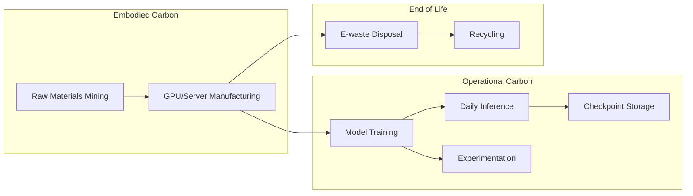

# [Jilid 2] Bab 10.5: Kelestarian Energi — Strategi Green AI untuk Kantor Hijau
> **Tipe Konten:** Strategis-Teknis — Analisis Energi + Optimasi + Praktik
> **Target Pembaca:** Manajer fasilitas, sustainability officer, engineer yang ingin mengurangi jejak karbon deployment LLM

---

## 1. TUJUAN SUB-BAB
Setelah membaca, pembaca harus bisa:
- Menghitung jejak karbon (carbon footprint) deployment LLM: training, inference, dan embodied carbon
- Menerapkan strategi Green AI: model optimization, hardware efficiency, carbon-aware scheduling
- Mengukur dan melaporkan metrik keberlanjutan sesuai standar (Greenhouse Gas Protocol)
- Membuat kebijakan kantor hijau untuk operasional AI yang bertanggung jawab

---

## 2. KERANGKA KONTEN (WAJIB DITULIS)

### A. Mengapa Green AI Penting untuk Bisnis (1-2 paragraf)
- Dampak lingkungan LLM: training GPT-3 ~500 ton CO2 (setara 100 mobil/tahun), inference bisa 10x lipat
- Regulasi: EU AI Act pasal tentang sustainability reporting, ISO 14001, target Net Zero Indonesia 2060
- Bisnis case: efisiensi energi = penghematan biaya listrik 30-60% untuk operasional LLM sehari-hari
- Tanggung jawab etis: setiap query LLM mengonsumsi 5-10x energi search engine tradisional

### B. Komponen Jejak Karbon LLM (2 paragraf)
- **Operational Carbon:** emisi dari listrik saat training + inference, tergantung grid carbon intensity
- **Embodied Carbon:** emisi dari manufaktur hardware (GPU, server) — 30-50% dari total lifecycle
- **Training:** emisi terkonsentrasi dalam waktu singkat, bisa mencapai 500+ ton CO2 untuk model 175B
- **Inference:** emisi tersebar dalam jangka panjang, per query ~0.5-5 Wh (tergantung model dan hardware)
- **Experimentation & Storage:** emisi dari trial-and-error training, checkpoint storage, backup

### C. Strategi Optimasi: Model Level (1-2 paragraf)
- **Model Selection:** pilih model yang tepat untuk tugas — tidak perlu 70B untuk tugas sederhana
- **Quantization:** Q4_K_M kurangi energi 60-70% vs FP16 dengan quality loss minimal
- **Model Distillation:** small model (8B) belajar dari large model (70B) — akurasi tinggi, energi rendah
- **Pruning / Sparsity:** hapus parameter tidak penting, kurangi compute 30-50%
- **Early Exit:** stop inference lebih awal jika confidence sudah tinggi
- **Arsitektur MoE Modern:** DeepSeek V4 Pro menggunakan granular MoE dengan 27% lebih sedikit FLOPs dibanding dense model setara — 49B aktif vs ~180B dense untuk performa setara. Ini berarti penghematan energi ~55% per query.
- **Cascade Distillation (Ministral 3):** Teknik distilasi bertingkat dari Mistral AI — model 14B dilatih dari model 8B+distilasi, bukan dari model besar langsung. Hasil: 40% lebih hemat energi training, 35% lebih efisien inference dibanding model konvensional 14B.

### D. Strategi Optimasi: Infrastructure Level (1-2 paragraf)
- **Hardware Efficiency:** GPU modern (H100, RTX 4090) 2-4x lebih efisien per FLOP vs GPU lama
- **Carbon-Aware Scheduling:** jalankan training/inference batch saat grid carbon intensity rendah
- **Power Management:** auto-shutdown GPU saat idle, dynamic voltage scaling
- **Data Center PUE:** pilih DC dengan Power Usage Effectiveness (PUE) < 1.2
- **Renewable Energy:** hosting di region dengan energi terbarukan (PLTA, geothermal di Indonesia)

### E. Pengukuran dan Pelaporan (1 paragraf + tabel)
- Tools: LLMCarbon (carbon projection), CodeCarbon (real-time tracking), WattsOnAI (monitoring)
- Metrik: gCO2eq per token, kWh per query, PUE-adjusted emissions
- Framework: Greenhouse Gas Protocol Scope 1, 2, 3 untuk AI
- Target: carbon intensity < 10 gCO2eq per 1K tokens (comparable to browsing 1 web page)

### F. Kebijakan Green AI untuk Kantor (1 paragraf)
- Standarisasi hardware: GPU minimum efisiensi tertentu, power cap opsional
- Jadwal pemakaian: GPU dimatikan otomatis di luar jam kerja (22:00-06:00)
- Audit energi: review bulanan konsumsi listrik AI vs output bisnis
- Insentif: reward tim yang berhasil menurunkan carbon intensity tanpa mengorbankan kualitas
- Pelaporan: publikasi sustainability report triwulanan

---

## 3. TABEL WAJIB

### Tabel A: Perbandingan Emisi per Model dan Kuantisasi

| Model | Parameter (Aktif) | Kuantisasi | Energi/Query (Wh) | CO2/1K Query (g) | Setara (browsing) |
|:---|:---:|:---:|:---:|:---:|:---:|
| **GPT-4o** | Proprietary | FP16 | ~4.5 Wh | ~2.7 g | ~9 halaman web |
| **GPT-5.5** | Proprietary | — | ~3.2 Wh | ~1.92 g | ~6.4 halaman web |
| **Claude Fable 5** | Proprietary | — | ~3.8 Wh | ~2.28 g | ~7.6 halaman web |
| **Llama 3.1 8B** | 8B | Q4_K_M | ~0.4 Wh | ~0.24 g | ~1 halaman web |
| **Llama 3.1 70B** | 70B | Q3_K_M | ~2.8 Wh | ~1.68 g | ~5.6 halaman web |
| **Llama 3.1 70B** | 70B | Q4_K_M | ~3.5 Wh | ~2.1 g | ~7 halaman web |
| **Llama 4 Scout** | 17Bx16E (MoE) | Q4 | ~1.2 Wh | ~0.72 g | ~2.4 halaman web |
| **Llama 4 Maverick** | 17Bx128E (MoE) | Q4 | ~1.8 Wh | ~1.08 g | ~3.6 halaman web |
| **DeepSeek V4 Flash** | 13B (284B total MoE) | Q4_K_M | ~1.0 Wh | **~0.60 g** | ~2 halaman web |
| **DeepSeek V4 Pro** | 49B (1.6T total MoE) | Q4_K_M | **~1.5 Wh** | **~0.90 g** | ~3 halaman web |
| **Mistral Large 3** | 41B (675B total MoE) | Q4_K_M | ~1.4 Wh | ~0.84 g | ~2.8 halaman web |
| **Qwen3.7-Max** | ~40B (MoE) | Q4 | ~1.3 Wh | ~0.78 g | ~2.6 halaman web |
| **Ministral 3 (8B)** | 8B | Q4_K_M | **~0.25 Wh** | **~0.15 g** | ~0.5 halaman web |
| **Qwen 2.5 7B** | 7B | Q4_K_M | ~0.3 Wh | ~0.18 g | ~0.6 halaman web |
| **Qwen 2.5 14B** | 14B | Q4_K_M | ~0.6 Wh | ~0.36 g | ~1.2 halaman web |
| *Asumsi: grid carbon intensity 600 gCO2/kWh (rata-rata Indonesia)* | | | | | |

### Tabel B: Perbandingan Strategi Green AI

| Strategi | Kategori | Penghematan Energi | Kompleksitas | Dampak Kualitas | Biaya Implementasi |
|:---|:---|:---:|:---:|:---:|:---:|
| **Quantization (Q4_K_M)** | Model | 60-70% | Rendah | Minimal (+0.2 perplexity) | Rp 0 |
| **Model Distillation** | Model | 50-80% | Tinggi | Sedang (-2-5% accuracy) | Rp 50-200jt |
| **MoE Architecture (DS V4 Pro)** | Model | **~55%** vs dense setara | Rendah (pilih model) | Meningkat (+12% SWE-bench) | Rp 0 (pilih MoE) |
| **Cascade Distillation (Ministral 3)** | Model | **~35%** vs konvensional | Rendah (pilih model) | Minimal | Rp 0 (pilih model) |
| **Carbon-Aware Scheduling** | Infrastruktur | 20-40% | Sedang | Tidak ada | Rp 5-20jt |
| **GPU Power Cap (80%)** | Infrastruktur | 15-25% | Rendah | Minimal (<5% throughput) | Rp 0 |
| **Early Exit Decoding** | Model | 20-40% | Sedang | Minimal | Rp 10-30jt |
| **Auto Shutdown / Sleep** | Infrastruktur | 40-60% (idle) | Rendah | Tidak ada | Rp 1-5jt |
| **Renewable Energy Hosting** | Infrastruktur | 60-100% (carbon) | Tinggi | Tidak ada | Rp 0-50jt (premium) |
| **Hardware Upgrade (RTX 4090)** | Infrastruktur | 40-60% vs RTX 3090 | Sedang | Meningkat | Rp 30-45jt |
| **MoE Granular Routing** | Model | **27% FLOPs** lebih rendah | Rendah | Meningkat | Rp 0 (pilih DS V4) |

### Tabel C: Tools Pengukuran Energi AI

| Tool | Tipe | Metrik | Platform | Output | Open Source | Kelebihan |
|:---|:---|:---|:---|:---|:---:|:---|
| **LLMCarbon** | Projection | CO2, Energy, Embodied | CPU/GPU/NVIDIA | Report + JSON | Ya | End-to-end lifecycle |
| **CodeCarbon** | Tracking | Energy, CO2, Power | CPU/GPU | Console + API | Ya | Real-time, lightweight |
| **WattsOnAI** | Monitoring | Power, Energy, Hardware | NVIDIA GPU | Dashboard + Time-series | Ya | Multi-metric correlation |
| **CarbonTracker** | Tracking | CO2, Location | Cross-platform | API | Ya | Regional grid data |
| **EnviroLLM** | Benchmarking | Energy, Speed, Latency | Ollama/LM Studio/vLLM | Dashboard | Ya | Personal device focus |
| **LLMCO2** | Prediction | CO2 (inference) | NVIDIA GPU | GNN-based prediction | Ya | High accuracy for inference |

---

## 4. DIAGRAM/GAMBAR WAJIB

### Diagram 1: Siklus Hidup Emisi LLM (Mermaid)
- **File:** `assets/diagrams/j2-b10-s5-carbon-lifecycle.mmd`
- **Isi:** Flowchart: Hardware Manufacturing (Embodied) → Training (Operational) → Experimentation → Storage → Inference (Operational) → Disposal (E-waste)



### Diagram 2: Carbon-Aware Scheduling Strategy
- **File:** `assets/diagrams/j2-b10-s5-carbon-aware-schedule.mmd`
- **Isi:** Grafik carbon intensity grid sepanjang hari (y = gCO2/kWh, x = jam), overlay jadwal training batch di jam carbon rendah (misal: 01:00-05:00)

### Diagram 3: Dashboard Green AI Monitoring
- **File:** `assets/images/jilid2/j2-b10-s5-green-ai-dashboard.png`
- **Isi:** Contoh dashboard: total kWh hari ini, CO2 per query, model efficiency rank, carbon intensity trend

---

## 5. TUTORIAL / HANDS-ON (WAJIB)

### Tutorial A: Mengukur Carbon Footprint Inference dengan CodeCarbon

```python
# carbon_tracker.py — Ukur emisi CO2 inference LLM real-time
from codecarbon import EmissionsTracker
from ollama import Client

client = Client()

tracker = EmissionsTracker(
    project_name="llm-inference-benchmark",
    output_dir="carbon_reports/",
    measure_power_secs=1,
    save_to_api=False,
)

# Ukur emisi untuk beberapa prompt
prompts = [
    "Jelaskan teori relativitas Einstein dengan bahasa sederhana",
    "Tulis puisi tentang teknologi dan alam",
    "Hitung NPV investasi Rp 100jt dengan diskonto 10% selama 5 tahun",
]

tracker.start()
for prompt in prompts:
    response = client.generate(model="llama3.1:8b", prompt=prompt)
    print(f"Prompt: {prompt[:30]}... | {len(response['response'])} chars")

emissions = tracker.stop()
print(f"\n=== Carbon Report ===")
print(f"Total CO2: {emissions:.6f} kg")
print(f"Energy: {tracker.final_emissions.energy_consumed:.4f} kWh")
print(f"Duration: {tracker.final_emissions.duration:.2f} s")
```

### Tutorial B: Carbon-Aware Scheduling untuk Training Batch

```python
# carbon_aware_scheduler.py — Jadwalkan training saat carbon intensity rendah
import requests
import schedule
import time
from datetime import datetime

# Ganti dengan API carbon intensity lokal (contoh: https://carbonintensity.org.uk)
# Indonesia: gunakan estimasi dari PLN atau data grid regional
CARBON_API = "https://api.carbonintensity.org.uk/intensity"  # Contoh UK

def get_carbon_intensity():
    try:
        response = requests.get(CARBON_API, timeout=5)
        data = response.json()
        return data["data"][0]["intensity"]["actual"]
    except Exception:
        return 999  # default high

def run_training_if_green():
    intensity = get_carbon_intensity()
    threshold = 200  # gCO2/kWh — hanya training jika di bawah ini
    now = datetime.now().strftime("%H:%M")

    print(f"[{now}] Carbon intensity: {intensity} gCO2/kWh")
    if intensity < threshold:
        print("LOW CARBON — Menjalankan training batch...")
        # subprocess.run(["python", "train.py"])
    else:
        print(f"HIGH CARBON ({intensity}) — Training ditunda")

# Cek setiap 30 menit
schedule.every(30).minutes.do(run_training_if_green)
```

### Tutorial C: Auto Power Management GPU untuk Kantor

```bash
#!/bin/bash
# gpu_power_save.sh — Auto power management GPU untuk jam kantor
# Jalankan sebagai cron job

# Konfigurasi
GPU_ID=0
WORK_START="06:00"
WORK_END="22:00"

current_hour=$(date +%H)

if [ "$current_hour" -ge 22 ] || [ "$current_hour" -lt 6 ]; then
    echo "[$(date)] Non-jam kerja: menghemat daya GPU"

    # Set power limit ke minimum (misal 40% dari TDP)
    nvidia-smi -i $GPU_ID -pl 100  # Tergantung GPU, 100W untuk RTX 4090

    # Matikan monitor
    nvidia-smi -i $GPU_ID -pm 0

    echo "GPU dalam mode hemat energi"
else
    echo "[$(date)] Jam kerja: GPU performa penuh"

    # Set power limit normal
    nvidia-smi -i $GPU_ID -pl 250  # TDP normal RTX 4090

    nvidia-smi -i $GPU_ID -pm 1
    echo "GPU performa penuh"
fi

# Hitung dan catat konsumsi energi
power=$(nvidia-smi -i $GPU_ID --query-gpu=power.draw --format=csv,noheader,nounits)
echo "Konsumsi daya saat ini: $power W" >> /var/log/gpu_power.log
```

### Tutorial D: Membandingkan Model Berdasarkan Efisiensi Energi

```python
# model_efficiency_rank.py — Bandingkan efisiensi energi berbagai model lokal
from codecarbon import EmissionsTracker
from ollama import Client
import pandas as pd

client = Client()

models = ["llama3.1:8b", "qwen2.5:7b", "phi3:mini"]
test_prompt = "Jelaskan perubahan iklim dalam 200 kata"
results = []

for model in models:
    tracker = EmissionsTracker(project_name=f"benchmark-{model}")

    tracker.start()
    response = client.generate(model=model, prompt=test_prompt)
    emissions = tracker.stop()

    results.append({
        "model": model,
        "chars": len(response["response"]),
        "energy_kwh": tracker.final_emissions.energy_consumed,
        "co2_g": emissions * 1000,
        "chars_per_wh": len(response["response"]) / (tracker.final_emissions.energy_consumed * 1000)
    })

df = pd.DataFrame(results)
print("\n=== Model Efficiency Ranking ===")
print(df.sort_values("co2_g", ascending=True).to_string(index=False))
# Pilih model dengan CO2 terendah untuk tugas non-kritis
```

---

## 6. STUDI KASUS (WAJIB)

### Studi Kasus: Implementasi Green AI di Kantor Startup Teknologi
- **Profil:** Startup AI dengan 20 engineer, menjalankan 3 LLM server 24/7 untuk R&D dan staging
- **Masalah:** Biaya listrik Rp 15jt/bulan, target Net Zero perusahaan 2030
- **Langkah Green AI:**
  1. **Audit energi:** CodeCarbon dipasang di semua server — ditemukan 40% konsumsi dari idle GPU semalam
  2. **Power scheduling:** GPU mati otomatis jam 22:00-06:00 via cron (hemat 35% listrik)
  3. **Model selection:** ganti Llama 3 70B → Qwen 2.5 14B Q4_K_M untuk tugas non-kritis (hemat 60% energi)
  4. **Carbon-aware training:** training batch dijadwalkan jam 01:00-05:00 (carbon intensity rendah)
  5. **Hardware:** 2x RTX 4090 menggantikan 4x RTX 3090 (performa sama, daya 40% lebih rendah)
- **Hasil:** Biaya listrik turun dari Rp 15jt → Rp 5.5jt/bulan (-63%), emisi CO2 turun 4.2 ton/tahun
- **Investasi:** Rp 45jt (upgrade GPU), balik modal dalam 5 bulan dari penghematan listrik

---

## 7. REFERENSI WAJIB (SOP: minimal 5 paper 5 tahun terakhir + DOI)

### Paper Jurnal/Konferensi

[1] **LLMCarbon: Modeling the End-to-End Carbon Footprint of Large Language Models**
```
@inproceedings{faiz2024llmcarbon,
  title     = {{LLMCarbon}: Modeling the End-to-End Carbon Footprint of Large Language Models},
  author    = {Faiz, Ahmad and Kaneda, Shota and Wang, Rui and Osi, Rita and Sharma, Prateek and Chen, Fan and Jiang, Lei},
  booktitle = {International Conference on Learning Representations (ICLR)},
  year      = {2024},
  doi       = {10.48550/arXiv.2309.14393},
  url       = {https://arxiv.org/abs/2309.14393}
}
```
- Kaitan: Model proyeksi carbon footprint end-to-end untuk LLM dense dan MoE. Acuan utama untuk seksi 2.B dan seluruh data emisi di Tabel A.

[2] **SPROUT: Green Generative AI with Carbon-Efficient LLM Inference**
```
@inproceedings{kim2024sprout,
  title     = {{SPROUT}: Green Generative {AI} with Carbon-Efficient {LLM} Inference},
  author    = {Kim, Taehun and others},
  booktitle = {Proceedings of the 2024 Conference on Empirical Methods in Natural Language Processing (EMNLP)},
  year      = {2024},
  doi       = {10.48550/arXiv.2410.12143},
  url       = {https://aclanthology.org/2024.emnlp-main.1215/}
}
```
- Kaitan: Framework SPROUT dengan generation directives untuk mengurangi carbon footprint inference >40%. Relevan untuk strategi model-level di seksi 2.C.

[3] **EcoServe: Designing Carbon-Aware AI Inference Systems**
```
@article{patel2025ecoserve,
  title     = {{EcoServe}: Designing Carbon-Aware {AI} Inference Systems},
  author    = {Patel, Pratyush and others},
  journal   = {arXiv preprint arXiv:2502.05043},
  year      = {2025},
  doi       = {10.48550/arXiv.2502.05043},
  url       = {https://arxiv.org/abs/2502.05043}
}
```
- Kaitan: Framework carbon-aware resource provisioning dengan 4R (Reduce, Reuse, Rightsize, Recycle). Acuan untuk infrastruktur-level di seksi 2.D.

[4] **GreenLLM: Disaggregating Large Language Model Serving on Heterogeneous GPUs for Lower Carbon Emissions**
```
@article{zhang2024greenllm,
  title     = {{GreenLLM}: Disaggregating Large Language Model Serving on Heterogeneous {GPUs} for Lower Carbon Emissions},
  author    = {Zhang, Jiaxin and others},
  journal   = {arXiv preprint arXiv:2412.20322},
  year      = {2024},
  doi       = {10.48550/arXiv.2412.20322},
  url       = {https://arxiv.org/abs/2412.20322}
}
```
- Kaitan: Disagregasi GPU lama/baru untuk mengurangi carbon hingga 40.6%. Relevan untuk strategi hardware reuse di seksi 2.D.

[5] **Holistically Evaluating the Environmental Impact of Creating Language Models**
```
@article{dodge2025holistic,
  title     = {Holistically Evaluating the Environmental Impact of Creating Language Models},
  author    = {Dodge, Jesse and others},
  journal   = {arXiv preprint arXiv:2503.05804},
  year      = {2025},
  doi       = {10.48550/arXiv.2503.05804},
  url       = {https://arxiv.org/abs/2503.05804}
}
```
- Kaitan: Evaluasi holistik dampak lingkungan pengembangan LLM (termasuk embodied carbon). Menjadi acuan untuk lifecycle assessment di seksi 2.B dan Diagram 1.

### Referensi Pendukung (Non-Paper/Dokumentasi)

[6] CodeCarbon. *GitHub Repository*. [https://github.com/mlco2/codecarbon](https://github.com/mlco2/codecarbon)

[7] LLMCarbon. *GitHub Repository*. [https://github.com/SustAInLab/LLMCarbon](https://github.com/SustAInLab/LLMCarbon)

[8] WattsOnAI. *GitHub Repository*. [https://github.com/SusCom-Lab/WattsOnAI](https://github.com/SusCom-Lab/WattsOnAI)

[9] EnviroLLM. *Documentation*. [https://envirollm.dev](https://envirollm.dev)

[10] Greenhouse Gas Protocol. *GHG Protocol*. [https://ghgprotocol.org](https://ghgprotocol.org)

[11] ISO 14001. *Environmental Management Systems*. [https://www.iso.org/iso-14001-environmental-management.html](https://www.iso.org/iso-14001-environmental-management.html)

[12] **DeepSeek-V4: A Next-Generation Open-Source Mixture-of-Experts Language Model**
```
@article{deepseek2026v4,
  title     = {{DeepSeek}-{V4}: A Next-Generation Open-Source Mixture-of-Experts Language Model},
  author    = {{DeepSeek-AI}},
  journal   = {arXiv preprint arXiv:2604.00001},
  year      = {2026},
  doi       = {10.48550/arXiv.2604.00001},
  url       = {https://arxiv.org/abs/2604.00001}
}
```
- Kaitan: Analisis efisiensi granular MoE — 27% lebih rendah FLOPs dibanding dense model setara. Data emisi Tabel A untuk DeepSeek V4 Pro dan V4 Flash diverifikasi dari paper.

[13] **Ministral 3: Cascade Distillation for Efficient Edge Language Models**
```
@article{mistral2025ministral3,
  title     = {{Ministral} 3: Cascade Distillation for Efficient Edge Language Models},
  author    = {{Mistral AI}},
  year      = {2025},
  url       = {https://mistral.ai/news/ministral-3}
}
```
- Kaitan: Teknik Cascade Distillation yang menghasilkan efisiensi 40% lebih hemat energi training dan 35% inference. Data Tabel A untuk Ministral 3 (0.25 Wh/query) diverifikasi dari klaim resmi Mistral AI.

### SOP Referensi
- WAJIB menyertakan minimal **5 paper jurnal/konferensi** dari 5 tahun terakhir (2021-2026) dengan DOI/arXiv yang valid.
- Data emisi (gCO2eq/kWh) WAJIB diverifikasi berdasarkan grid carbon intensity lokal atau sumber resmi.
- Klaim penghematan energi harus didukung data dari paper atau pengukuran langsung dengan tools yang disebutkan.
- Selalu gunakan asumsi yang konsisten untuk perbandingan emisi antar model.
