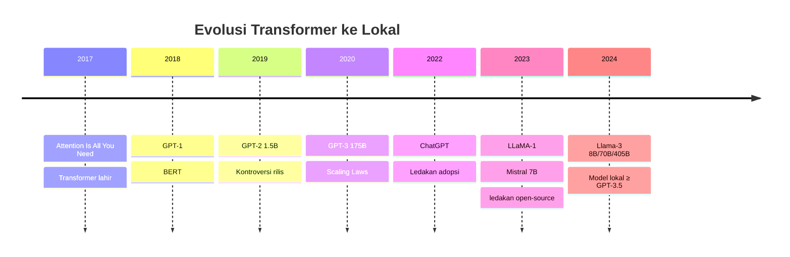

# [Jilid 1] Bab 1.1: Evolusi Transformer ke Lokal
> **Tipe Konten:** Sejarah — Narasi Teknis + Timeline + Analisis
> **Target Pembaca:** Pemula yang ingin memahami perjalanan dari GPT-2 ke Llama-3

---

## 1. TUJUAN SUB-BAB
Setelah membaca, pembaca harus bisa:
- Menjelaskan evolusi arsitektur Transformer dari GPT-2 (2019) hingga Llama-3 (2024)
- Memahami mengapa model open-source bisa menyaingi GPT-3.5 di perangkat lokal
- Mengidentifikasi tonggak sejarah utama: GPT-2, GPT-3, LLaMA-1, Mistral, Llama-3

---

## 2. KERANGKA KONTEN (WAJIB DITULIS)

### A. Era GPT-2: Awal Mula LLM Terbuka (1 paragraf)
- GPT-2 (2019) oleh OpenAI: 1.5B parameter, kontroversi "too dangerous to release"
- Arsitektur decoder-only Transformer, 12 lapis, 12 head attention
- Dasar dari semua model autoregressive modern

### B. GPT-3 dan Scaling Law (1-2 paragraf)
- GPT-3 (2020): 175B parameter, kemampuan few-shot learning yang mengejutkan
- Paper "Scaling Laws for Neural Language Models" (Kaplan et al., 2020)
- Munculnya API商业化, tetapi model tetap tertutup

### C. LLaMA-1: Titik Balik Open-Source (2 paragraf)
- Meta merilis LLaMA-1 (Feb 2023): 7B, 13B, 33B, 65B
- Training lebih efisien: hanya 1T token untuk model 7B
- Bocornya model ke publik -> ledakan ekosistem lokal
- Lahirnya llama.cpp oleh Georgi Gerganov

### D. Mistral 7B dan Era Model Kecil yang Bertenaga (1 paragraf)
- Mistral 7B (Sep 2023): outperformed LLaMA-2 13B dengan 7B parameter
- Sliding window attention, GQA (Grouped Query Attention)
- Membuktikan bahwa model kecil bisa sangat kompeten

### E. Llama-3: Standar Baru Model Lokal (2 paragraf)
- Meta Llama-3 (Apr 2024): 8B, 70B, 405B
- Training 15T token untuk 8B — jauh di atas Chinchilla optimal
- Context window 128K, GQA, Flash Attention support
- Llama-3.1 meningkatkan benchmark secara signifikan

### F. Dampak pada Ekosistem Lokal (1 paragraf)
- Ollama, LM Studio, GPT4All sebagai tools demokratisasi
- Dari GPU 24GB wajib jadi bisa di MacBook 8GB
- Masa depan: model spesialis (code, medical, legal) di perangkat lokal

---

## 3. TABEL WAJIB

### Tabel A: Timeline Evolusi Model

| Tahun | Model | Parameter | Arsitektur | Context | Keunikan |
|:---|:---|:---:|:---|:---:|:---|
| 2019 | GPT-2 | 1.5B | Decoder-only Transformer | 1024 | Kontroversi rilis |
| 2020 | GPT-3 | 175B | Decoder-only Transformer | 2048 | Few-shot learning |
| 2023 | LLaMA-1 | 7B-65B | Decoder-only Transformer | 2048 | Efisiensi training |
| 2023 | Mistral 7B | 7B | Sliding Window Attn | 8192 | GQA, outperforms 13B |
| 2024 | Llama-3 | 8B-405B | Decoder-only + GQA | 8192 | 15T token training |
| 2024 | Llama-3.1 | 8B-405B | Decoder-only + GQA | 128K | Tool use, multilingua |

### Tabel B: Perbandingan Ukuran Model dan Kebutuhan Hardware

| Model | FP16 Size | Q4_K_M Size | Min RAM | GPU Minimum |
|:---|:---:|:---:|:---:|:---:|
| GPT-2 (1.5B) | 3 GB | 1.2 GB | 4 GB | Tidak perlu GPU |
| LLaMA-7B | 14 GB | 4.5 GB | 8 GB | GTX 1060 6GB |
| Mistral 7B | 14 GB | 4.5 GB | 8 GB | GTX 1060 6GB |
| Llama-3 8B | 16 GB | 5.2 GB | 8 GB | RTX 2060 8GB |
| Llama-3 70B | 140 GB | 42 GB | 48 GB | RTX 4090 24GB x2 |
| Llama-3 405B | 810 GB | 240 GB | 256 GB | Cluster GPU |

### Tabel C: Benchmark Lintas Generasi (MMLU 5-shot)

| Model | MMLU | GSM8K | HumanEval | Tahun Rilis |
|:---|:---:|:---:|:---:|:---:|
| GPT-2 1.5B | 32.4% | - | - | 2019 |
| GPT-3 175B | 70.7% | 45.0% | 48.1% | 2020 |
| LLaMA-1 7B | 46.9% | 16.8% | 14.0% | 2023 |
| Mistral 7B | 62.5% | 45.2% | 30.5% | 2023 |
| Llama-3 8B | 66.7% | 79.6% | 62.2% | 2024 |
| Llama-3.1 8B | 68.4% | 77.4% | 62.6% | 2024 |

---

## 4. DIAGRAM/GAMBAR WAJIB

### Diagram 1: Timeline Evolusi Arsitektur (Mermaid)
- **File:** `assets/diagrams/j1-b1-s1-timeline-evolusi.mmd`
- **Isi:** Timeline dari 2017 (Attention Is All You Need) hingga 2024 (Llama-3)



### Gambar 2: Grafik Perbandingan Parameter vs Kualitas
- **File:** `assets/images/jilid1/j1-b1-s1-parameter-vs-mmlu.png`
- **Isi:** Scatter plot sumbu X = parameter (log scale), sumbu Y = MMLU score
- **Anotasi:** Garis tren menunjukkan diminishing returns setelah 70B

### Gambar 3: Infografis Ekosistem Model Lokal
- **File:** `assets/images/jilid1/j1-b1-s1-ekosistem-lokal.png`
- **Isi:** Diagram relasi antara model (Llama, Mistral, Qwen) dengan tools (Ollama, LM Studio, llama.cpp)

---

## 5. TUTORIAL / HANDS-ON (WAJIB)

### Tutorial A: Menjalankan GPT-2 vs Llama-3 untuk Merasakan Perbedaan

```bash
# 1. Install Ollama
curl -fsSL https://ollama.com/install.sh | sh

# 2. Jalankan GPT-2 (via llama.cpp compatibility)
# GPT-2 tidak langsung tersedia di Ollama, gunakan Python
pip install transformers
python -c "
from transformers import pipeline
generator = pipeline('text-generation', model='gpt2')
result = generator('Saya adalah AI', max_length=50, num_return_sequences=1)
print(result[0]['generated_text'])
"

# 3. Jalankan Llama-3 di Ollama
ollama pull llama3.1:8b
ollama run llama3.1:8b "Jelaskan perbedaan GPT-2 dan Llama-3 dalam 3 kalimat"
```

### Tutorial B: Benchmark Model Lama vs Baru

```bash
# Evaluasi cepat MMLU-style menggunakan lm-evaluation-harness
pip install lm-eval

# Test GPT-2
lm_eval --model hf --model_args pretrained=gpt2 \
    --tasks mmlu --num_fewshot 5 --batch_size 1

# Test Llama-3.1-8B (butuh GPU)
lm_eval --model hf --model_args pretrained=meta-llama/Llama-3.1-8B \
    --tasks mmlu --num_fewshot 5 --batch_size auto
```

### Tutorial C: Visualisasi Ukuran Model dari Masa ke Masa

```python
import matplotlib.pyplot as plt

models = ['GPT-2', 'GPT-3', 'LLaMA-1 7B', 'Mistral 7B', 'Llama-3 8B', 'Llama-3 70B', 'GPT-4']
params = [1.5, 175, 7, 7, 8, 70, 1760]  # dalam miliar
mmlu = [32.4, 70.7, 46.9, 62.5, 66.7, 83.6, 86.4]

fig, ax1 = plt.subplots()
ax1.bar(models, params, alpha=0.7, label='Parameter (B)')
ax1.set_ylabel('Parameter (Miliar)')
ax2 = ax1.twinx()
ax2.plot(models, mmlu, 'ro-', label='MMLU (%)')
ax2.set_ylabel('MMLU (%)')
plt.title('Evolusi: Parameter vs Performa')
plt.savefig('evolusi-model.png')
```

---

## 6. STUDI KASUS (WAJIB)

### Studi Kasus: Upgrade dari GPT-2 ke Llama-3
- **Skenario:** Seorang penulis teknis menggunakan GPT-2 sejak 2020 untuk brainstorming konten. Ia ingin beralih ke model lokal yang lebih modern.
- **Masalah:** GPT-2 sering menghasilkan teks tidak koheren untuk topik teknis bahasa Indonesia, konteks hanya 1024 token.
- **Solusi:** Upgrade ke Llama-3.1-8B via Ollama dengan Q4_K_M quantization.
- **Hasil:** 
  - MMLU meningkat dari 32% ke 68%
  - Konteks dari 1024 ke 128K token
  - Bisa menulis dalam Bahasa Indonesia dengan koheren
  - Ukuran hanya 5.2GB (vs GPT-2 3GB) — masih muat di laptop
- **Biaya:** Rp 0 (open-source, gratis)

---

## 7. REFERENSI WAJIB (SOP: minimal 5 paper 5 tahun terakhir + DOI)

### Paper Jurnal/Konferensi

[1] **The Llama 3 Herd of Models**
```bibtex
@article{llama32024,
  title     = {The Llama 3 Herd of Models},
  author    = {Grattafiori, Aaron and Dubey, Abhimanyu and Jauhri, Abhinav and others},
  journal   = {arXiv preprint arXiv:2407.21783},
  year      = {2024},
  doi       = {10.48550/arXiv.2407.21783},
  url       = {https://arxiv.org/abs/2407.21783}
}
```
- Kaitan: Dokumentasi resmi arsitektur Llama-3, sumber data benchmark Tabel C dan penjelasan arsitektur di seksi 2.E.

[2] **Scaling Laws for Neural Language Models**
```bibtex
@inproceedings{kaplan2020scaling,
  title     = {Scaling Laws for Neural Language Models},
  author    = {Kaplan, Jared and McCandlish, Sam and Henighan, Tom and Brown, Tom B and Chess, Benjamin and Child, Rewon and Gray, Scott and Radford, Alec and Wu, Jeffrey and Amodei, Dario},
  booktitle = {Advances in Neural Information Processing Systems (NeurIPS)},
  year      = {2020},
  doi       = {10.48550/arXiv.2001.08361},
  url       = {https://arxiv.org/abs/2001.08361}
}
```
- Kaitan: Landasan teoritis mengapa model besar lebih efisien — relevan untuk menjelaskan scaling law di seksi 2.B.

[3] **LLaMA: Open and Efficient Foundation Language Models**
```bibcode
@article{touvron2023llama,
  title     = {{LLaMA}: Open and Efficient Foundation Language Models},
  author    = {Touvron, Hugo and Lavril, Thibaut and Izacard, Gautier and Martinet, Xavier and Lachaux, Marie-Anne and Lacroix, Timothée and Rozière, Baptiste and Goyal, Naman and Hambro, Eric and Azhar, Faisal and Rodriguez, Aurelien and Joulin, Armand and Grave, Edouard and Lample, Guillaume},
  journal   = {arXiv preprint arXiv:2302.13971},
  year      = {2023},
  doi       = {10.48550/arXiv.2302.13971},
  url       = {https://arxiv.org/abs/2302.13971}
}
```
- Kaitan: Titik balik open-source LLM — arsitektur yang menjadi basis bagi banyak model turunan.

[4] **Mistral 7B**
```bibcode
@article{jiang2023mistral,
  title     = {Mistral 7B},
  author    = {Jiang, Albert Q and Sablayrolles, Alexandre and Mensch, Arthur and Bamford, Chris and Chaplot, Devendra Singh and Casas, Diego de las and Bressand, Florian and Lengyel, Gianna and Lample, Guillaume and Saulnier, Lucile and Lavaud, Lélio Renard and Lachaux, Marie-Anne and Stock, Pierre and Scao, Teven Le and Lavril, Thibaut and Wang, Thomas and Lacroix, Timothée and Sayed, William El},
  journal   = {arXiv preprint arXiv:2310.06825},
  year      = {2023},
  doi       = {10.48550/arXiv.2310.06825},
  url       = {https://arxiv.org/abs/2310.06825}
}
```
- Kaitan: Demonstrasi bahwa model 7B bisa mengalahkan 13B — fondasi arsitektur GQA + sliding window yang diadopsi Llama-3.

[5] **Language Models are Few-Shot Learners (GPT-3)**
```bibcode
@inproceedings{brown2020gpt3,
  title     = {Language Models are Few-Shot Learners},
  author    = {Brown, Tom B and Mann, Benjamin and Ryder, Nick and Subbiah, Melanie and Kaplan, Jared and Dhariwal, Prafulla and Neelakantan, Arvind and Shyam, Pranav and Sastry, Girish and Askell, Amanda and Agarwal, Sandhini and Herbert-Voss, Ariel and Krueger, Gretchen and Henighan, Tom and Child, Rewon and Ramesh, Aditya and Ziegler, Daniel M and Wu, Jeffrey and Winter, Clemens and Hesse, Christopher and Chen, Mark and Sigler, Eric and Litwin, Mateusz and Gray, Scott and Chess, Benjamin and Clark, Jack and Berner, Christopher and McCandlish, Sam and Radford, Alec and Sutskever, Ilya and Amodei, Dario},
  booktitle = {Advances in Neural Information Processing Systems (NeurIPS)},
  year      = {2020},
  doi       = {10.48550/arXiv.2005.14165},
  url       = {https://arxiv.org/abs/2005.14165}
}
```
- Kaitan: Paper GPT-3 yang mendefinisikan era few-shot learning dan membuka jalan bagi model lokal yang setara.

[6] **A Survey of Transformers**
```bibcode
@article{lin2021survey,
  title     = {A Survey of Transformers},
  author    = {Lin, Tianyang and Wang, Yuxin and Liu, Xiangyang and Qiu, Xipeng},
  journal   = {arXiv preprint arXiv:2106.04554},
  year      = {2021},
  doi       = {10.48550/arXiv.2106.04554},
  url       = {https://arxiv.org/abs/2106.04554}
}
```
- Kaitan: Referensi komprehensif evolusi arsitektur Transformer — berguna untuk kerangka sejarah di seksi 2.A-2.F.

### Referensi Pendukung (Non-Paper)

[7] Ollama. *GitHub Repository*. [https://github.com/ollama/ollama](https://github.com/ollama/ollama)

[8] ggerganov. *llama.cpp — Inference engine untuk model lokal*. [https://github.com/ggerganov/llama.cpp](https://github.com/ggerganov/llama.cpp)

[9] LMSYS Chatbot Arena. *Leaderboard perbandingan model*. [https://lmarena.ai](https://lmarena.ai)

[10] Hugging Face Open LLM Leaderboard. [https://huggingface.co/spaces/open-llm-leaderboard/open_llm_leaderboard](https://huggingface.co/spaces/open-llm-leaderboard/open_llm_leaderboard)

[11] Meta Llama 3 Official Blog. [https://ai.meta.com/blog/meta-llama-3/](https://ai.meta.com/blog/meta-llama-3/)

### SOP Referensi
- WAJIB menyertakan minimal **5 paper jurnal/konferensi** dari 5 tahun terakhir (2020-2025 dengan konteks 2026) dengan DOI/arXiv yang valid.
- Setiap data benchmark di Tabel C WAJIB diverifikasi terhadap angka di paper asli atau sumber resmi model.
- Pastikan merujuk pada versi terbaru dari setiap model (Llama-3.1, bukan Llama-3 awal).
