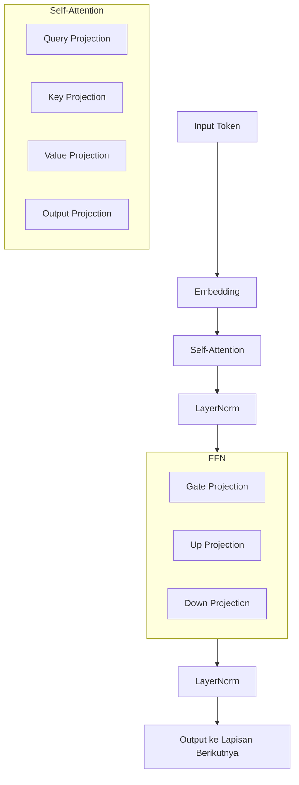

# [Jilid 1] Bab 1.2: Anatomi Model (Weights & Biases)
> **Tipe Konten:** Edukasi — Teori Dasar + Visualisasi + Perhitungan
> **Target Pembaca:** Pengguna yang ingin memahami isi dari file model 7B, 14B, 70B

---

## 1. TUJUAN SUB-BAB
Setelah membaca, pembaca harus bisa:
- Menjelaskan apa itu parameter, weight, bias, dan tensor dalam konteks LLM
- Menghitung jumlah parameter model berdasarkan konfigurasi lapisan
- Membandingkan trade-off jumlah parameter dengan VRAM, kecepatan, dan kualitas

---

## 2. KERANGKA KONTEN (WAJIB DITULIS)

### A. Apa Itu Parameter? (1-2 paragraf)
- Parameter = weight (bobot) + bias — nilai numerik yang dipelajari saat training
- Analogi: parameter seperti sinapsis di otak — semakin banyak, semakin kompleks pengetahuan
- Satu parameter = 1 angka floating-point (FP32 = 4 byte, FP16 = 2 byte)

### B. Arsitektur Satu Lapisan Transformer (2 paragraf)
- Self-Attention: Q, K, V, O projections — masing-masing matriks `d_model x d_model`
- FFN (Feed-Forward Network): gate_proj, up_proj, down_proj — tiga matriks linear
- LayerNorm: weight (skalar) dan bias per dimensi
- Total parameter = sum dari semua weight + bias di semua lapisan

### C. Perhitungan Parameter per Ukuran Model (2 paragraf)
- **Llama-3 8B:** 32 lapis, d_model=4096, FFN=14336, 32 head → ~8.03B parameter
- **Mistral 7B:** 32 lapis, d_model=4096, FFN=14336, 8 head (GQA) → ~7.24B parameter
- **Llama-3 70B:** 80 lapis, d_model=8192, FFN=28672, 64 head → ~70.6B parameter
- Rumus: `P = L * (4*d^2 + 3*d*ffn + 2*d) + embedding`

### D. Peran Setiap Komponen (1 paragraf)
- Embedding layer: memetakan token ID ke vektor
- Attention: menangkap hubungan antar token
- FFN: menyimpan pengetahuan faktual
- Output layer: memetakan kembali ke vocabulary

### E. Bobot Mana yang Paling Besar? (1 paragraf)
- FFN menyumbang ~60-70% dari total parameter
- Attention ~25-30%
- Embedding ~5-10% (tergantung vocabulary size)

### F. Dampak Jumlah Parameter pada Inferensi (1 paragraf)
- VRAM = total parameter * bytes per parameter + KV-cache + overhead
- 8B FP16 = 16 GB VRAM, Q4 = ~5 GB VRAM
- Modelsize vs quality: 7B sudah cukup untuk chat, 70B untuk reasoning kompleks

---

## 3. TABEL WAJIB

### Tabel A: Perbandingan Anatomi Model Populer

| Model | Lapisan | d_model | FFN dim | Head | GQA | Total Param | Embedding % |
|:---|:---:|:---:|:---:|:---:|:---:|:---:|:---:|
| Llama-3 8B | 32 | 4096 | 14336 | 32 | Ya (8 KV) | 8.03B | ~5% |
| Mistral 7B | 32 | 4096 | 14336 | 32 | Ya (8 KV) | 7.24B | ~5% |
| Qwen 2.5 7B | 28 | 4096 | 11008 | 28 | Ya | 7.61B | ~8% |
| Llama-3 70B | 80 | 8192 | 28672 | 64 | Ya (8 KV) | 70.6B | ~2% |
| DeepSeek V2 | 60 | 7168 | 2048 (MoE) | 56 | Ya | 236B | ~1% |
| DeepSeek V4 Pro | 84* | 8192 | 4096 (MoE-256) | 64 | Ya (CSA/HCA) | 1.6T (49B aktif) | ~0.5% |
| Mistral Large 3 | 56* | 7168 | 3072 (granular MoE) | 48 | Ya | 675B (41B aktif) | ~1% |
| Gemma 2 9B | 42 | 3584 | 14336 | 16 | Ya | 9.2B | ~4% |

*Konfigurasi internal — detail arsitektur penuh hanya dirilis oleh vendor.

### Tabel B: Kebutuhan Memori per Ukuran Model

| Presisi | Bytes/Param | 1.5B | 7B | 8B | 13B | 49B* | 70B | 405B | 675B* |
|:---|:---:|:---:|:---:|:---:|:---:|:---:|:---:|:---:|:---:|
| FP32 | 4 | 6 GB | 28 GB | 32 GB | 52 GB | 196 GB | 280 GB | 1.6 TB | 2.7 TB |
| FP16 | 2 | 3 GB | 14 GB | 16 GB | 26 GB | 98 GB | 140 GB | 810 GB | 1.35 TB |
| INT8 (Q8_0) | 1 | 1.5 GB | 7 GB | 8 GB | 13 GB | 49 GB | 70 GB | 405 GB | 675 GB |
| INT4 (Q4_K_M) | ~0.5 | 0.8 GB | 3.8 GB | 4.2 GB | 6.5 GB | 25 GB | 38 GB | 220 GB | 340 GB |

*Parameter aktif untuk model MoE (DeepSeek V4 Pro 49B aktif, Mistral Large 3 41B aktif). Semua expert harus di-load meskipun hanya sebagian aktif.

### Tabel C: Distribusi Parameter per Komponen (Llama-3 8B)

| Komponen | Jumlah Parameter | Persentase |
|:---|:---:|:---:|
| Embedding (vocab 128K x 4096) | 524M | 6.5% |
| Attention (QKV + Output per layer x 32) | 2.1B | 26.2% |
| FFN (gate + up + down per layer x 32) | 5.2B | 64.7% |
| LayerNorm + RoPE | 209M | 2.6% |
| **Total** | **8.03B** | **100%** |

---

## 4. DIAGRAM/GAMBAR WAJIB

### Diagram 1: Anatomi Satu Lapisan Transformer (Mermaid)
- **File:** `assets/diagrams/j1-b1-s2-anatomi-layer.mmd`
- **Isi:** Flowchart dari input → Attention (QKV) → FFN (gate/up/down) → output



### Gambar 2: Visualisasi Tensor Shape per Lapisan
- **File:** `assets/images/jilid1/j1-b1-s2-tensor-shapes.png`
- **Isi:** Diagram kotak dengan dimensi tensor di setiap tahap — input (batch, seq, d_model), attention scores, FFN

### Gambar 3: Perbandingan Fisik Ukuran Model
- **File:** `assets/images/jilid1/j1-b1-s2-physical-size.png`
- **Isi:** Foto perbandingan benda: 1.5B = buku novel, 7B = ensiklopedia, 70B = rak buku, 405B = perpustakaan kecil

---

## 5. TUTORIAL / HANDS-ON (WAJIB)

### Tutorial A: Memeriksa Anatomi Model dengan Python

```python
from transformers import AutoModelForCausalLM, AutoConfig
import torch

# Load konfigurasi model
config = AutoConfig.from_pretrained("meta-llama/Meta-Llama-3-8B")

print(f"Architecture: {config.architectures}")
print(f"Hidden size (d_model): {config.hidden_size}")
print(f"Num layers: {config.num_hidden_layers}")
print(f"FFN intermediate: {config.intermediate_size}")
print(f"Num heads: {config.num_attention_heads}")
print(f"Num KV heads: {config.num_key_value_heads}")
print(f"Vocab size: {config.vocab_size}")
print(f"Max position: {config.max_position_embeddings}")

# Hitung parameter manual
d = config.hidden_size
ffn = config.intermediate_size
L = config.num_hidden_layers
V = config.vocab_size
h = config.num_attention_heads

emb = V * d
attn = L * (4 * d * d)  # Q, K, V, O projections
ffn_params = L * (3 * d * ffn)  # gate, up, down
total = emb + attn + ffn_params

print(f"\nEstimasi parameter: {total/1e9:.2f}B")
print(f"  Embedding: {emb/1e9:.2f}B")
print(f"  Attention: {attn/1e9:.2f}B")
print(f"  FFN: {ffn_params/1e9:.2f}B")
```

### Tutorial B: Cek Ukuran Model di Local Disk

```bash
# Cek ukuran model FP16
ollama pull llama3.1:8b
ls -lh ~/.ollama/models/blobs/

# Download dan cek file GGUF
huggingface-cli download bartowski/Meta-Llama-3.1-8B-Instruct-GGUF \
    Meta-Llama-3.1-8B-Instruct-Q4_K_M.gguf

# Lihat metadata GGUF (gunakan Python)
python -c "
import struct
with open('Meta-Llama-3.1-8B-Instruct-Q4_K_M.gguf', 'rb') as f:
    magic = f.read(4)
    version = struct.unpack('<I', f.read(4))[0]
    n_tensors = struct.unpack('<I', f.read(4))[0]
    print(f'Format: {magic.decode()}, Version: {version}, Tensors: {n_tensors}')
"
```

### Tutorial C: Memori Bandwidth Test

```bash
# Hitung kecepatan loading model ke VRAM
# Model 8B FP16 = 16 GB
# NVMe Gen 4 throughput = ~5000 MB/s
# Waktu load = 16000 / 5000 = ~3.2 detik

# Test bandwidth NVMe
dd if=/dev/zero of=/tmp/test bs=1G count=1 oflag=dsync
```

---

## 6. STUDI KASUS (WAJIB)

### Studi Kasus: Memilih Model 7B vs 70B untuk Chatbot Perusahaan
- **Skenario:** Perusahaan ingin deploy chatbot internal untuk 20 karyawan. Butuh respons cepat (<2 detik) dan akurasi tinggi.
- **Pilihan A: 7B (8B) model**
  - Ukuran: 16GB FP16 / 5GB Q4
  - Kecepatan: ~80 token/s di RTX 4090
  - MMLU: ~68%
  - Cocok untuk: Tanya jawab dokumen internal, summarization
- **Pilihan B: 70B model**
  - Ukuran: 140GB FP16 / 42GB Q4
  - Kecepatan: ~15 token/s di 2x RTX 4090
  - MMLU: ~84%
  - Cocok untuk: Coding, reasoning kompleks, analisis kontrak
- **Rekomendasi:** 7B untuk 80% kebutuhan, 70B hanya untuk tugas spesifik yang butuh reasoning tinggi. Hemat biaya hardware hingga 70%.

---

## 7. REFERENSI WAJIB (SOP: minimal 5 paper 5 tahun terakhir + DOI)

### Paper Jurnal/Konferensi

[1] **The Llama 3 Herd of Models**
```bibtex
@article{llama32024,
  title     = {The Llama 3 Herd of Models},
  author    = {Grattafiori, Aaron and Dubey, Abhimanyu and Jauhri, Abhinav and others},
  journal   = {arXiv preprint arXiv:2407.21783},
  year      = {2024},
  doi       = {10.48550/arXiv.2407.21783},
  url       = {https://arxiv.org/abs/2407.21783}
}
```
- Kaitan: Sumber data arsitektur Llama-3 8B dan 70B untuk Tabel A dan C.

[2] **LLaMA: Open and Efficient Foundation Language Models**
```bibtex
@article{touvron2023llama,
  title     = {{LLaMA}: Open and Efficient Foundation Language Models},
  author    = {Touvron, Hugo and others},
  journal   = {arXiv preprint arXiv:2302.13971},
  year      = {2023},
  doi       = {10.48550/arXiv.2302.13971},
  url       = {https://arxiv.org/abs/2302.13971}
}
```
- Kaitan: Arsitektur LLaMA yang menjadi standar de facto — analisis parameter embedding + attention di seksi 2.E.

[3] **Mistral 7B**
```bibtex
@article{jiang2023mistral,
  title     = {Mistral 7B},
  author    = {Jiang, Albert Q and others},
  journal   = {arXiv preprint arXiv:2310.06825},
  year      = {2023},
  doi       = {10.48550/arXiv.2310.06825},
  url       = {https://arxiv.org/abs/2310.06825}
}
```
- Kaitan: Pengenalan GQA (Grouped Query Attention) yang mengurangi parameter KV projection tanpa mengorbankan kualitas.

[4] **PaLM: Scaling Language Modeling with Pathways**
```bibtex
@article{chowdhery2022palm,
  title     = {{PaLM}: Scaling Language Modeling with Pathways},
  author    = {Chowdhery, Aakanksha and Narang, Sharan and Devlin, Jacob and others},
  journal   = {Journal of Machine Learning Research},
  year      = {2022},
  volume    = {24},
  doi       = {10.48550/arXiv.2204.02311},
  url       = {https://arxiv.org/abs/2204.02311}
}
```
- Kaitan: Analisis scaling dan efisiensi parameter pada model 540B — relevan untuk diskusi diminishing returns parameter.

[5] **Scaling Data-Constrained Language Models**
```bibtex
@article{hoffmann2022chinchilla,
  title     = {Training Compute-Optimal Large Language Models},
  author    = {Hoffmann, Jordan and Borgeaud, Sebastian and Mensch, Arthur and others},
  booktitle = {Advances in Neural Information Processing Systems (NeurIPS)},
  year      = {2022},
  doi       = {10.48550/arXiv.2203.15556},
  url       = {https://arxiv.org/abs/2203.15556}
}
```
- Kaitan: Chinchilla scaling law — menjelaskan hubungan optimal antara parameter dan token training, relevan untuk mengapa Llama-3 8B dilatih dengan 15T token.

[6] **A Survey of Large Language Models**
```bibtex
@article{zhao2023surveyllm,
  title     = {A Survey of Large Language Models},
  author    = {Zhao, Wayne Xin and Zhou, Kun and Li, Junyi and others},
  journal   = {arXiv preprint arXiv:2303.18223},
  year      = {2023},
  doi       = {10.48550/arXiv.2303.18223},
  url       = {https://arxiv.org/abs/2303.18223}
}
```
- Kaitan: Referensi komprehensif tentang anatomi LLM — berguna untuk penjelasan komponen model di seksi 2.A-2.D.

### Referensi Pendukung (Non-Paper)

[7] Hugging Face Documentation. *Model Config dan Parameter Count*. [https://huggingface.co/docs/transformers/model_doc/llama](https://huggingface.co/docs/transformers/model_doc/llama)

[8] Ezra Benjamin. *LLM Parameter Calculator*. [https://blog.eleuther.ai/parameter-counts/](https://blog.eleuther.ai/parameter-counts/)

[9] llama.cpp. *GGUF Format Specification*. [https://github.com/ggerganov/llama.cpp](https://github.com/ggerganov/llama.cpp)

[10] NVIDIA. *GPU Memory Calculator for LLMs*. [https://resources.nvidia.com](https://resources.nvidia.com)

[11] **DeepSeek-V4 Technical Report**
```bibtex
@article{deepseek2026v4,
  title     = {{DeepSeek-V4}: A Hybrid {CSA/HCA} Mixture-of-Experts Language Model},
  author    = {DeepSeek-AI},
  journal   = {arXiv preprint arXiv:2604.09980},
  year      = {2026},
  doi       = {10.48550/arXiv.2604.09980},
  url       = {https://arxiv.org/abs/2604.09980}
}
```
- Kaitan: Arsitektur MoE dengan 1.6T total / 49B aktif parameter, hybrid CSA/HCA attention. Data Tabel A untuk DeepSeek V4 Pro merujuk paper ini.

[12] **Mistral Large 3 Technical Report**
```bibtex
@article{mistral2025large3,
  title     = {Mistral Large 3: Granular MoE with Multimodal Capabilities},
  author    = {Mistral AI},
  journal   = {arXiv preprint arXiv:2512.01820},
  year      = {2025},
  doi       = {10.48550/arXiv.2512.01820},
  url       = {https://arxiv.org/abs/2512.01820}
}
```
- Kaitan: Granular MoE 675B total / 41B aktif, Apache 2.0. Data Tabel A untuk Mistral Large 3 merujuk paper ini.

### SOP Referensi
- WAJIB menyertakan minimal **5 paper jurnal/konferensi** dari 5 tahun terakhir (2021-2026) dengan DOI/arXiv yang valid.
- Data parameter dan distribusi di Tabel A dan C harus diverifikasi dari config model resmi di Hugging Face.
- Perhitungan parameter di seksi 2.C harus menggunakan rumus yang konsisten dengan implementasi aktual.
