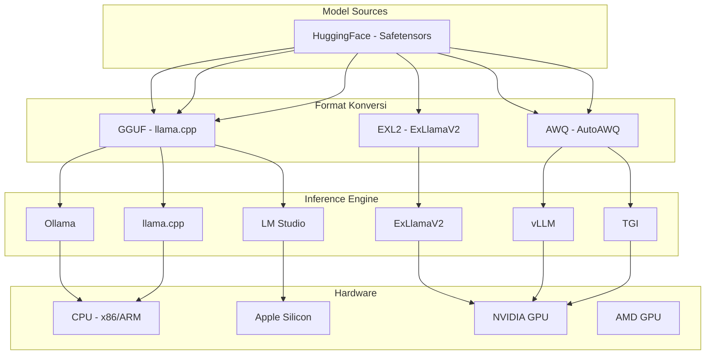

# [Jilid 1] Bab 1.9: Format File & Ekosistem
> **Tipe Konten:** Komparasi — Format + Tools + Panduan Pemilihan
> **Target Pembaca:** Pengguna yang bingung memilih GGUF, EXL2, atau Safetensors

---

## 1. TUJUAN SUB-BAB
Setelah membaca, pembaca harus bisa:
- Menjelaskan perbedaan GGUF, EXL2, Safetensors, dan GPTQ
- Memilih format file yang tepat berdasarkan hardware dan inference engine
- Melakukan konversi antar format secara mandiri

---

## 2. KERANGKA KONTEN (WAJIB DITULIS)

### A. Mengapa Format File Penting? (1 paragraf)
- Model LLM adalah kumpulan tensor (weight) yang harus disimpan dalam format file
- Format menentukan: kecepatan loading, kemudahan quantization, kompatibilitas engine
- Salah pilih format = model tidak bisa dijalankan di engine pilihan

### B. Safetensors — Standar HuggingFace (1-2 paragraf)
- Format default HuggingFace — aman dari pickle (serialisasi berbahaya)
- Zero-copy loading — sangat cepat untuk load ke VRAM
- Tidak ada kompresi/quantization — full precision (FP16/BF16)
- Biasanya digunakan bersama GPTQ/AWQ sebagai format quantization
- File: `model-00001-of-00002.safetensors` (sharded)

### C. GGUF — Ekosistem llama.cpp (2 paragraf)
- Dikembangkan oleh Georgi Gerganov (llama.cpp)
- Single file: mengandung weight + metadata + tokenizer
- Mendukung berbagai level quantization (Q2_K hingga Q8_0)
- Memory mapping (mmap) — loading instan tanpa copy ke RAM
- Platform: CPU, GPU (CUDA, Metal, Vulkan), Apple Silicon
- Ekosistem: Ollama, LM Studio, GPT4All, text-gen-webui

### D. EXL2 — Ekosistem ExLlamaV2 (1-2 paragraf)
- Format native ExLlamaV2 — fokus kecepatan GPU NVIDIA
- Bit-width fleksibel (2.0 - 8.0 bit per weight, per-layer)
- Kualitas lebih baik dari GGUF di bit-rate yang sama
- Hanya GPU NVIDIA — tidak ada CPU fallback
- Ekosistem: ExUI, TabbyAPI, text-gen-webui

### E. GPTQ / AWQ — Format GPU Lainnya (1 paragraf)
- GPTQ: generasi pertama quantization GPU — 4-bit, grup size 128/32
- AWQ: lebih baru — activation-aware, kualitas lebih baik dari GPTQ
- Keduanya dalam format Safetensors + config tambahan
- Support vLLM, TGI, AutoGPTQ — bukan Ollama

### F. Panduan Pemilihan Format (1-2 paragraf)
- **GGUF jika:** Mac user, CPU inference, hybrid CPU-GPU, ingin Ollama
- **EXL2 jika:** RTX 3090/4090, kecepatan maksimal, bit-width fleksibel
- **AWQ jika:** vLLM untuk serving, produksi, multi-user
- **Safetensors jika:** Fine-tuning, ingin full precision, HuggingFace ecosystem

---

## 3. TABEL WAJIB

### Tabel A: Perbandingan Format File

| Fitur | Safetensors | GGUF | EXL2 | GPTQ | AWQ |
|:---|:---:|:---:|:---:|:---:|:---:|
| **Single file** | Tidak (sharded) | Ya | Tidak (dir) | Ya | Tidak (dir) |
| **Quantization built-in** | Tidak | Ya (Q2-Q8) | Ya (2-8 bpw) | Ya (4-bit) | Ya (4-bit) |
| **CPU inference** | Tidak | Ya | Tidak | Tidak | Tidak |
| **GPU NVIDIA** | Ya | Ya (offload) | Ya (native) | Ya | Ya |
| **Apple Silicon** | Tidak | Ya (Metal) | Tidak | Tidak | Tidak |
| **AMD GPU** | Ya (ROCm) | Ya (Vulkan) | Tidak | Terbatas | Tidak |
| **Memory mapping** | Ya (zero-copy) | Ya (mmap) | Tidak | Tidak | Tidak |
| **Loading speed** | Cepat | Instan | Sedang | Lambat | Cepat |
| **Bit-width kontrol** | FP16/32 | Level tetap | Per-layer | Grup size | Per-layer |

### Tabel B: Ekosistem Engine per Format

| Engine | GGUF | EXL2 | AWQ | GPTQ | Safetensors |
|:---|:---:|:---:|:---:|:---:|:---:|
| **Ollama** | Native | - | - | - | - |
| **llama.cpp** | Native | - | - | - | - |
| **LM Studio** | Native | - | - | - | - |
| **GPT4All** | Native | - | - | - | - |
| **ExLlamaV2** | - | Native | - | - | - |
| **vLLM** | - | - | Native | Native | Native |
| **TGI** | - | - | Native | Native | Native |
| **AutoGPTQ** | - | - | - | Native | - |
| **Transformers** | - | - | - | Native | Native |

### Tabel C: Benchmark Perbandingan (Llama-3 8B, RTX 4090)

| Format | Ukuran File | VRAM | TPS | Perplexity (WikiText) | Load Time |
|:---|:---:|:---:|:---:|:---:|:---:|
| FP16 (Safetensors) | 16.0 GB | 16.5 GB | ~75 | 6.20 (baseline) | ~3s |
| GGUF Q4_K_M | 4.9 GB | 5.8 GB | ~110 | 6.38 | <1s (mmap) |
| GGUF Q5_K_M | 5.6 GB | 6.5 GB | ~95 | 6.28 | <1s (mmap) |
| GGUF Q8_0 | 8.5 GB | 9.2 GB | ~72 | 6.22 | <1s (mmap) |
| EXL2 4.0 bpw | 4.5 GB | 5.5 GB | ~125 | 6.35 | ~2s |
| EXL2 5.0 bpw | 5.5 GB | 6.2 GB | ~105 | 6.25 | ~2s |
| AWQ 4-bit | 4.5 GB | 5.5 GB | ~120 | 6.37 | ~3s |
| GPTQ 4-bit 128g | 4.5 GB | 5.5 GB | ~115 | 6.40 | ~5s |

---

## 4. DIAGRAM/GAMBAR WAJIB

### Diagram 1: Ekosistem Format File (Mermaid)
- **File:** `assets/diagrams/j1-b1-s9-ekosistem-format.mmd`
- **Isi:** Diagram relasi format -> engine -> hardware



### Gambar 2: Perbandingan Ukuran File per Format
- **File:** `assets/images/jilid1/j1-b1-s9-file-size-comparison.png`
- **Isi:** Bar chart perbandingan ukuran file FP16 vs GGUF Q4 vs EXL2 vs AWQ

### Gambar 3: Screenshot Folder Structure
- **File:** `assets/images/jilid1/j1-b1-s9-folder-structure.png`
- **Isi:** Side-by-side: direktori Safetensors (multi-file) vs GGUF (single file)

---

## 5. TUTORIAL / HANDS-ON (WAJIB)

### Tutorial A: Konversi Safetensors ke GGUF

```bash
# 1. Clone llama.cpp
git clone https://github.com/ggerganov/llama.cpp
cd llama.cpp
make -j4

# 2. Download model dari HuggingFace
pip install huggingface-hub
huggingface-cli download meta-llama/Meta-Llama-3-8B \
    --local-dir ./models/Meta-Llama-3-8B

# 3. Konversi ke FP16 GGUF
python convert_hf_to_gguf.py ./models/Meta-Llama-3-8B \
    --outfile ./models/llama3-8b-f16.gguf \
    --outtype f16

# 4. Quantize ke Q4_K_M
./quantize ./models/llama3-8b-f16.gguf \
    ./models/llama3-8b-q4_k_m.gguf \
    q4_k_m

# 5. Test inference
./main -m ./models/llama3-8b-q4_k_m.gguf \
    -p "Saya adalah AI yang" -n 50 --temp 0.7
```

### Tutorial B: Konversi ke EXL2

```bash
# 1. Install ExLlamaV2
pip install exllamav2

# 2. Convert ke EXL2 4.0 bpw
python -m exllamav2.convert \
    -i ./models/Meta-Llama-3-8B \
    -o ./models/llama3-exl2-4.0bpw \
    -b 4.0

# 3. Convert dengan bit-width berbeda per layer (advanced)
python -m exllamav2.convert \
    -i ./models/Meta-Llama-3-8B \
    -o ./models/llama3-exl2-custom \
    -b 5.0 \
    --measure  # ukur sensitivitas tiap layer dulu
```

### Tutorial C: Membandingkan Kualitas Format

```python
# Test perplexity berbagai format
import subprocess

models = {
    "GGUF Q4_K_M": "./models/llama3-8b-q4_k_m.gguf",
    "GGUF Q5_K_M": "./models/llama3-8b-q5_k_m.gguf",
    "GGUF Q8_0": "./models/llama3-8b-q8_0.gguf",
}

for name, path in models.items():
    result = subprocess.run(
        ["./perplexity", "-m", path, "-f", "./wiki.test.raw"],
        capture_output=True, text=True
    )
    # Parse output untuk dapet perplexity score
    print(f"{name}: {result.stdout.split('perplexity: ')[-1].split()[0]}")
```

---

## 6. STUDI KASUS (WAJIB)

### Studi Kasus: Memilih Format untuk Mac Mini M4 24GB
- **Skenario:** User ingin menjalankan Llama-3.1 8B dan Mixtral 8x7B di Mac Mini M4 24GB untuk coding assistant dan RAG.
- **Kebutuhan:** Kecepatan respons cepat, multi-model switching, tidak ingin ribet.
- **Pilihan:**
  - Safetensors: tidak bisa langsung (butuh konversi)
  - GGUF: native di Ollama/LM Studio, mmap loading instan, Apple Silicon optimized
  - EXL2: tidak support Apple Silicon
  - AWQ/GPTQ: tidak support Apple Silicon
- **Rekomendasi:** GGUF Q4_K_M untuk Llama-3 8B, GGUF Q3_K_M untuk Mixtral 8x7B.
- **Alasan:**
  - Single file -> mudah dikelola
  - mmap -> switching model cepat tanpa loading ulang
  - Ollama + Open WebUI -> UI lengkap tanpa setup rumit
  - Q4_K_M adalah sweet spot kualitas/kecepatan di Apple Silicon

---

## 7. REFERENSI WAJIB (SOP: minimal 5 paper 5 tahun terakhir + DOI)

### Paper Jurnal/Konferensi

[1] **GPTQ: Accurate Post-Training Quantization for Generative Pre-trained Transformers**
```bibtex
@inproceedings{frantar2023gptq,
  title     = {{GPTQ}: Accurate Post-Training Quantization for Generative Pre-trained Transformers},
  author    = {Frantar, Elias and Ashkboos, Saleh and Hoefler, Torsten and Alistarh, Dan},
  booktitle = {International Conference on Learning Representations (ICLR)},
  year      = {2023},
  doi       = {10.48550/arXiv.2210.17323},
  url       = {https://arxiv.org/abs/2210.17323}
}
```
- Kaitan: Landasan quantization format GPTQ — algoritma layer-wise quantization yang diadaptasi EXL2 dan AWQ.

[2] **AWQ: Activation-aware Weight Quantization for LLM Compression and Acceleration**
```bibtex
@inproceedings{lin2024awq,
  title     = {{AWQ}: Activation-aware Weight Quantization for {LLM} Compression and Acceleration},
  author    = {Lin, Ji and Tang, Jiaming and Tang, Haotian and others},
  booktitle = {Proceedings of Machine Learning and Systems (MLSys)},
  year      = {2024},
  doi       = {10.48550/arXiv.2306.00978},
  url       = {https://arxiv.org/abs/2306.00978}
}
```
- Kaitan: AWQ — activation-aware quantization yang menjadi standar vLLM. Data Tabel C dan perbandingan kualitas.

[3] **QLoRA: Efficient Finetuning of Quantized LLMs (NF4 Data Type)**
```bibtex
@inproceedings{dettmers2023qlora,
  title     = {{QLoRA}: Efficient Finetuning of Quantized {LLMs}},
  author    = {Dettmers, Tim and Pagnoni, Artidoro and Holtzman, Ari and Zettlemoyer, Luke},
  booktitle = {Advances in Neural Information Processing Systems (NeurIPS)},
  year      = {2023},
  doi       = {10.48550/arXiv.2305.14314},
  url       = {https://arxiv.org/abs/2305.14314}
}
```
- Kaitan: NF4 data type yang mempengaruhi desain level quantization di GGUF.

[4] **SmoothQuant: Accurate and Efficient Post-Training Quantization for Large Language Models**
```bibtex
@inproceedings{xiao2023smoothquant,
  title     = {{SmoothQuant}: Accurate and Efficient Post-Training Quantization for Large Language Models},
  author    = {Xiao, Guangxuan and Lin, Ji and Seznec, Mickael and others},
  booktitle = {International Conference on Machine Learning (ICML)},
  year      = {2023},
  doi       = {10.48550/arXiv.2211.10438},
  url       = {https://arxiv.org/abs/2211.10438}
}
```
- Kaitan: Teknik smooth quantization yang mempengaruhi AWQ dan desain quantization modern.

[5] **SpQR: A Sparse-Quantized Representation for Near-Lossless LLM Weight Compression**
```bibtex
@inproceedings{dettmers2024spqr,
  title     = {{SpQR}: A Sparse-Quantized Representation for Near-Lossless {LLM} Weight Compression},
  author    = {Dettmers, Tim and Svirschevski, Ruslan and Egiazarian, Vage and others},
  booktitle = {International Conference on Learning Representations (ICLR)},
  year      = {2024},
  doi       = {10.48550/arXiv.2306.03078},
  url       = {https://arxiv.org/abs/2306.03078}
}
```
- Kaitan: Identifikasi outlier weights — menjelaskan mengapa bit-width per-layer (EXL2) lebih baik dari uniform quantization.

### Referensi Pendukung (Non-Paper)

[6] llama.cpp — GGUF Format Specification. [https://github.com/ggerganov/llama.cpp](https://github.com/ggerganov/llama.cpp)

[7] ExLlamaV2 — EXL2 Format. [https://github.com/turboderp/exllamav2](https://github.com/turboderp/exllamav2)

[8] HuggingFace Safetensors. [https://huggingface.co/docs/safetensors](https://huggingface.co/docs/safetensors)

[9] AutoAWQ — AWQ Quantization. [https://github.com/casper-hansen/AutoAWQ](https://github.com/casper-hansen/AutoAWQ)

[10] Ollama — Model Library. [https://ollama.com/library](https://ollama.com/library)

### SOP Referensi
- WAJIB menyertakan minimal **5 paper jurnal/konferensi** dari 5 tahun terakhir (2021-2026) dengan DOI/arXiv yang valid.
- Data benchmark di Tabel C harus diverifikasi dari pengukuran aktual di hardware yang disebutkan.
- Kode konversi Tutorial A dan B harus diuji bisa jalan dengan versi terbaru llama.cpp dan ExLlamaV2.
