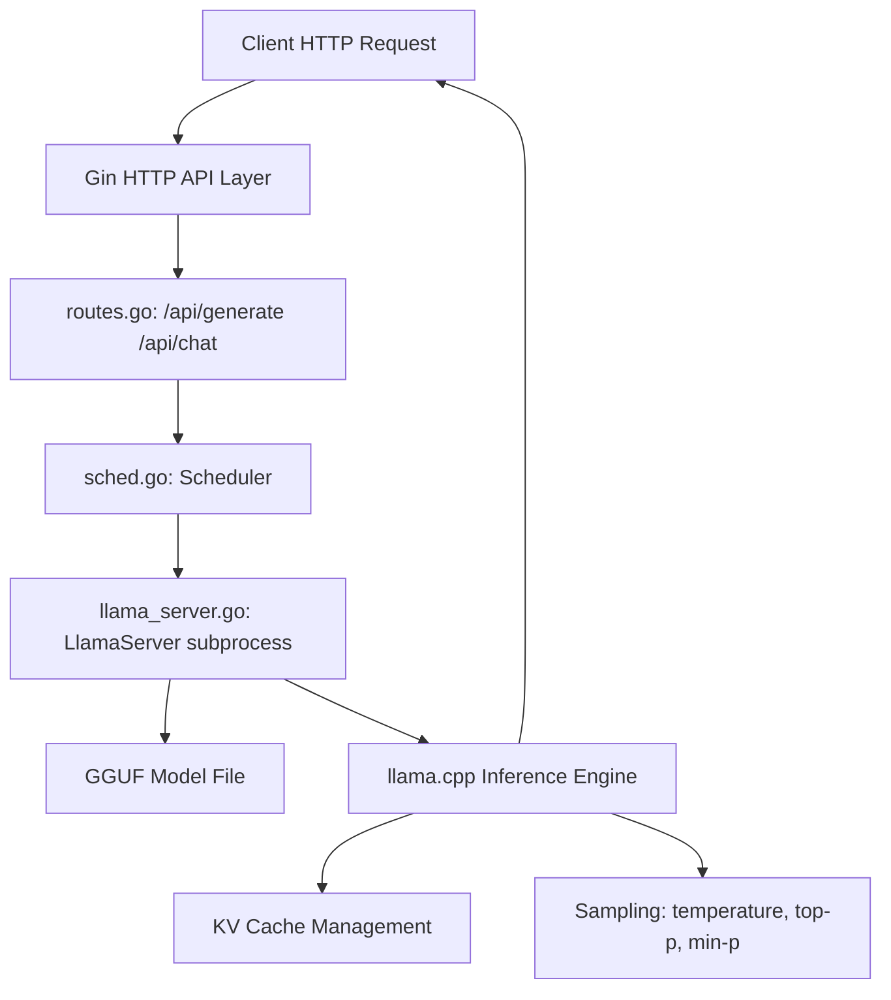

# [Jilid 1] Bab 3.1: Ollama — Arsitektur Backend, Manajemen Library, Kustomisasi Modelfile
> **Tipe Konten:** Teknis — Arsitektur + Praktik + Konfigurasi
> **Target Pembaca:** Pengguna yang ingin memahami dan mengelola Ollama secara mandiri

---

## 1. TUJUAN SUB-BAB
Setelah membaca, pembaca harus bisa:
- Menjelaskan arsitektur Ollama (HTTP API → Scheduler → Runner → Inference Engine)
- Mengelola model library dan memahami mekanisme blob storage
- Membuat Modelfile kustom dengan parameter dan template sendiri

---

## 2. KERANGKA KONTEN (WAJIB DITULIS)

### A. Arsitektur Sistem Ollama (1-2 paragraf + diagram)
- Ollama sebagai sistem berlapis: API Layer (Gin HTTP) → Orchestration (Scheduler) → Execution (llama.cpp/MLX)
- Model di-load sebagai subprocess terisolasi; crash tidak memengaruhi server utama
- Mekanisme keep-alive dan concurrent request management

### B. Model Library & Blob Storage (1-2 paragraf)
- Model disimpan sebagai GGUF di `~/.ollama/models/blobs/`
- Content-addressable storage: setiap blob di-hash SHA256, deduplikasi otomatis
- Perintah `ollama pull`, `ollama push`, `ollama rm` — mekanisme registri

### C. Modelfile Language (2-3 paragraf)
- FROM: base model (local atau registry)
- PARAMETER: temperature, top-p, context length, num_ctx, stop sequences
- TEMPLATE: kustomisasi chat template dengan Go templating
- SYSTEM: system prompt bawaan
- LICENSE, MESSAGES, ADAPTER

### D. Execution Backend (1-2 paragraf)
- llama.cpp sebagai backend utama (GGUF models)
- MLX experimental runner untuk Apple Silicon
- Image generation backend untuk model multimodal
- Pemilihan backend otomatis berdasarkan tipe model

### E. GPU Management & Scheduling (1 paragraf)
- Deteksi GPU otomatis (NVIDIA CUDA, AMD ROCm, Apple Metal)
- Scheduler mengalokasikan VRAM dan layer offload
- Concurrent model loading dengan prioritas

### F. Ollama API & Integrasi (1 paragraf)
- REST API endpoint: `/api/generate`, `/api/chat`, `/api/embeddings`
- OpenAI-compatible endpoint: `/v1/chat/completions`
- Integrasi dengan Open WebUI, LangChain, dan framework lain

---

## 3. TABEL WAJIB

### Tabel A: Perbandingan Parameter Modelfile

| Parameter | Tipe | Default | Deskripsi | Contoh Penggunaan |
|:---|:---:|:---:|:---|:---|
| `temperature` | float | 0.8 | Randomness sampling | `PARAMETER temperature 0.7` |
| `top_p` | float | 0.9 | Nucleus sampling threshold | `PARAMETER top_p 0.95` |
| `num_ctx` | int | 2048 | Context window size | `PARAMETER num_ctx 8192` |
| `stop` | string[] | [] | Stop sequences | `PARAMETER stop "<|im_end|>"` |
| `num_gpu` | int | -1 | GPU layers to offload | `PARAMETER num_gpu 99` |
| `mirostat` | int | 0 | Mirostat sampling mode | `PARAMETER mirostat 2` |

### Tabel B: Perbandingan Backend Ollama

| Fitur | llama.cpp | MLX | Image Generation |
|:---|:---|:---|:---|
| **Tipe Model** | GGUF | Safetensors (MLX) | Diffusion models |
| **Apple Silicon** | Native (Metal) | Native (MLX) | Native |
| **NVIDIA GPU** | CUDA | - | CUDA |
| **Multimodal** | Vision, Audio | Vision | Image generation |
| **Kecepatan Token/s** | **** | ***** (M-series) | N/A |
| **Kematangan** | Mature | Experimental | Experimental |

### Tabel C: Perintah Dasar Manajemen Ollama

| Perintah | Fungsi | Contoh |
|:---|:---|:---|
| `ollama pull` | Unduh model dari registry | `ollama pull llama3.1:8b` |
| `ollama push` | Unggah model ke registry | `ollama push user/model:tag` |
| `ollama create` | Buat model dari Modelfile | `ollama create mymodel -f Modelfile` |
| `ollama list` | Lihat model lokal | `ollama list` |
| `ollama run` | Jalankan model interaktif | `ollama run llama3.1:8b` |

---

## 4. DIAGRAM/GAMBAR WAJIB

### Diagram 1: Arsitektur Internal Ollama (Mermaid)
- **File:** `assets/diagrams/j1-b3-s1-arsitektur-ollama.mmd`
- **Isi:** Flow dari HTTP Request → Router → Scheduler → LlamaServer subprocess → Model Inference → Response



### Gambar 2: Contoh Modelfile Lengkap
- **File:** `assets/images/jilid1/j1-b3-s1-modelfile-example.png`
- **Isi:** Screenshot file Modelfile dengan FROM, PARAMETER, TEMPLATE, dan SYSTEM

### Gambar 3: Diagram Alur Request Lifecycle
- **File:** `assets/images/jilid1/j1-b3-s1-request-lifecycle.png`
- **Isi:** Sequence diagram dari client mengirim request hingga menerima stream response

---

## 5. TUTORIAL / HANDS-ON (WAJIB)

### Tutorial A: Membuat Modelfile Kustom

```dockerfile
# Modelfile — Asisten Coding Bahasa Indonesia
FROM llama3.1:8b

# Parameter inference
PARAMETER temperature 0.3
PARAMETER top_p 0.9
PARAMETER num_ctx 8192
PARAMETER stop "</s>"
PARAMETER mirostat 2
PARAMETER mirostat_tau 5.0

# System prompt
SYSTEM """
Anda adalah asisten coding yang ahli dalam Bahasa Indonesia.
Selalu berikan kode yang lengkap dan siap pakai.
Gunakan komentar dalam Bahasa Indonesia.
"""

# Chat template
TEMPLATE """
{{- if .System }}
<|system|>
{{ .System }}
{{- end }}
<|user|>
{{ .Prompt }}
<|assistant|>
"""
```

```bash
# Build dan run
ollama create my-coder -f Modelfile
ollama run my-coder "Buatkan fungsi Python untuk sorting array"
```

### Tutorial B: Mengelola Model Library dan API Server

```bash
# 1. List model yang tersedia
ollama list

# 2. Lihat detail model
ollama show llama3.1:8b

# 3. Jalankan Ollama sebagai server background
ollama serve &
# Server listening di http://localhost:11434

# 4. Panggil API dari terminal
curl http://localhost:11434/api/generate \
  -d '{
    "model": "llama3.1:8b",
    "prompt": "Jelaskan arsitektur transformer",
    "stream": false,
    "options": {
      "temperature": 0.7,
      "num_predict": 200
    }
  }'

# 5. OpenAI-compatible endpoint
curl http://localhost:11434/v1/chat/completions \
  -d '{
    "model": "llama3.1:8b",
    "messages": [{"role": "user", "content": "Halo!"}]
  }'
```

### Tutorial C: Concurrent Model Loading

```python
import requests
import concurrent.futures

models = ["llama3.1:8b", "qwen2.5:7b", "mistral:7b"]
base = "http://localhost:11434/api/generate"

def load_model(name):
    r = requests.post(f"{base}", json={
        "model": name, "prompt": "test", "stream": False
    })
    return name, r.elapsed.total_seconds()

with concurrent.futures.ThreadPoolExecutor() as ex:
    for model, time in ex.map(load_model, models):
        print(f"{model}: {time:.2f}s")
```

---

## 6. STUDI KASUS (WAJIB)

### Studi Kasus: Setup Ollama untuk Team Coding Assistant
- **Skenario:** Tim developer 5 orang ingin AI coding assistant lokal yang responsif
- **Hardware:** Server dengan RTX 4090 24GB
- **Solusi:** Ollama serve dengan model `deepseek-coder-v2:16b` (Q4_K_M)
- **Modelfile Kustom:** Ditambahkan konteks kodebase perusahaan, system prompt dengan standar koding tim
- **Konfigurasi:** `num_ctx` 16384, `temperature` 0.2, `num_gpu` 99
- **Hasil:** 5 developer bisa akses bersamaan via Open WebUI, latency < 3 detik per response
- **Pengelolaan:** Blob storage otomatis menduplikasi model yang sama untuk semua user

---

## 7. REFERENSI WAJIB (SOP: minimal 5 paper 5 tahun terakhir + DOI)

### Paper Jurnal/Konferensi

[1] **Hive: A Secure, Scalable Framework for Distributed Ollama Inference**
```
@article{vake2025hive,
  title     = {Hive: A Secure, Scalable Framework for Distributed {Ollama} Inference},
  author    = {Vake, Domen and Vičič, Jernej and Tošić, Aleksandar},
  journal   = {SoftwareX},
  volume    = {30},
  pages     = {102183},
  year      = {2025},
  doi       = {10.1016/j.softx.2025.102183},
  url       = {https://doi.org/10.1016/j.softx.2025.102183}
}
```
- Kaitan: Framework distributed inference berbasis Ollama. Menjelaskan arsitektur HiveCore + HiveNode yang relevan untuk deployment Ollama multi-mesin di sub-bab 2.A.

[2] **Efficient LLM Inference on CPUs**
```
@article{liao2024cpullm,
  title     = {Inference Performance Optimization for Large Language Models on {CPUs}},
  author    = {Liao, Shuai and others},
  journal   = {arXiv preprint arXiv:2407.07304},
  year      = {2024},
  doi       = {10.48550/arXiv.2407.07304},
  url       = {https://arxiv.org/abs/2407.07304}
}
```
- Kaitan: Optimasi KV cache dan distribusi inference di CPU — backend yang digunakan Ollama via llama.cpp. Relevan untuk sub-bab 2.D.

[3] **LLM Inference Serving: Survey of Recent Advances**
```
@article{zhang2024llmsurvey,
  title     = {{LLM} Inference Serving: Survey of Recent Advances and Opportunities},
  author    = {Zhang, Hao and others},
  journal   = {arXiv preprint arXiv:2407.12391},
  year      = {2024},
  doi       = {10.48550/arXiv.2407.12391},
  url       = {https://arxiv.org/abs/2407.12391}
}
```
- Kaitan: Survey sistem serving LLM — kerangka kerja untuk memahami posisi Ollama dalam ekosistem inference engine. Gunakan sebagai referensi arsitektur di sub-bab 2.A.

[4] **Towards Efficient Generative LLM Serving: A Survey**
```
@article{miao2024llmserving,
  title     = {Towards Efficient Generative Large Language Model Serving: A Survey from Algorithms to Systems},
  author    = {Miao, Xupeng and others},
  journal   = {ACM Computing Surveys},
  year      = {2025},
  doi       = {10.1145/3754448},
  url       = {https://dl.acm.org/doi/10.1145/3754448}
}
```
- Kaitan: Taksonomi sistem serving LLM dari algoritma hingga sistem. Relevan untuk menjelaskan komponen Scheduler, Runner, dan Memory Management di arsitektur Ollama.

[5] **FlashAttention: Fast and Memory-Efficient Exact Attention**
```
@inproceedings{dao2022flashattention,
  title     = {{FlashAttention}: Fast and Memory-Efficient Exact Attention with {IO}-Awareness},
  author    = {Dao, Tri and Fu, Daniel Y. and Ermon, Stefano and Rudra, Atri and Ré, Christopher},
  booktitle = {Advances in Neural Information Processing Systems (NeurIPS)},
  year      = {2022},
  doi       = {10.48550/arXiv.2205.14135},
  url       = {https://arxiv.org/abs/2205.14135}
}
```
- Kaitan: Algoritma attention IO-aware yang diadopsi llama.cpp/Ollama. Menjelaskan mengapa context window besar bisa efisien di hardware terbatas. Relevan untuk sub-bab 2.F.

### Referensi Pendukung (Non-Paper)

[6] Ollama. *Official GitHub Repository*. [https://github.com/ollama/ollama](https://github.com/ollama/ollama)

[7] Gerganov, G. *llama.cpp*. [https://github.com/ggerganov/llama.cpp](https://github.com/ggerganov/llama.cpp)

[8] Apple MLX. *Official Documentation*. [https://ml-explore.github.io/mlx/](https://ml-explore.github.io/mlx/)

[9] Ollama Modelfile Documentation. [https://github.com/ollama/ollama/blob/main/docs/modelfile.md](https://github.com/ollama/ollama/blob/main/docs/modelfile.md)

### SOP Referensi
- WAJIB menyertakan minimal **5 paper jurnal/konferensi** dari 5 tahun terakhir (2021-2026) dengan DOI/arXiv yang valid.
- Setiap data di tabel (parameter, kecepatan, dll.) WAJIB diverifikasi terhadap dokumentasi resmi.
- Paper tentang inference serving dan attention mechanism menjadi fondasi teoretis untuk sub-bab ini.

(End of sub-bab-1.md)
