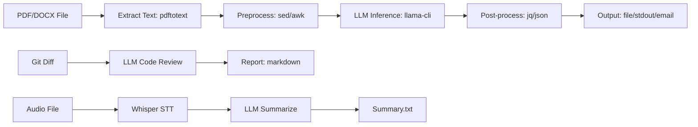

# [Jilid 1] Bab 3.10: CLI-Only Power — Efisiensi Maksimal Alat Berbasis Terminal
> **Tipe Konten:** Praktis — Terminal + Scripting + Workflow Otomasi
> **Target Pembaca:** Pengguna power/developer yang ingin workflow terminal murni

---

## 1. TUJUAN SUB-BAB
Setelah membaca, pembaca harus bisa:
- Menggunakan llama.cpp CLI untuk inference tanpa GUI
- Membangun pipeline terminal untuk batch processing dan otomasi
- Memanfaatkan satu baris perintah (one-liner) untuk berbagai tugas AI

---

## 2. KERANGKA KONTEN (WAJIB DITULIS)

### A. Filosofi CLI-Only (1 paragraf)
- Terminal adalah antarmuka paling efisien untuk power user
- Zero overhead: tidak ada GUI, tidak ada resource untuk rendering
- Scriptable: pipe, redirect, cron job, integrasi dengan tools UNIX

### B. llama.cpp CLI Tools (1-2 paragraf)
- `llama-cli`: inference interaktif dan one-shot
- `llama-server`: HTTP server OpenAI-compatible
- `llama-bench`: benchmarking performa
- `llama-perplexity`: evaluasi model quality
- `llama-embedding`: ekstraksi embedding
- `llama-tokenize`: tokenizer utility

### C. One-Liner Power (1-2 paragraf)
- Pipe langsung ke shell: `llama-cli -p "buat puisi" | cowsay`
- Batch processing: loop file, generate summary per file
- Kombinasi dengan jq, curl, sed, awk untuk pipeline kompleks
- Integrasi dengan editor (Vim/Neovim): `:!llama-cli ...`

### D. Shell Scripting untuk AI Pipeline (1-2 paragraf)
- Summarization batch: loop PDF → extract text → LLM summarize
- Translation pipeline: stdin → LLM → stdout
- Code review: git diff → LLM → review output
- Email drafting: template + LLM → compose

### E. Performance Optimization (1 paragraf)
- Thread tuning: `--threads` optimal = n_cores - 1
- Batch processing: `--batch-size` untuk throughput lebih tinggi
- GPU offload: `-ngl` layers ke GPU
- Memory mapping: `--mlock` untuk lock model di RAM

### F. Alternatif CLI Lain (1 paragraf)
- Ollama CLI: interaktif (`ollama run`) dan API (`ollama serve`)
- llamafile: single-file executable untuk LLM
- LocalAI CLI: `local-ai run`
- Shell-GPT (sgpt): AI assistant di terminal

---

## 3. TABEL WAJIB

### Tabel A: Perbandingan CLI Tools

| Tool | Instalasi | Ukuran Binary | Streaming | API Server | Fitur Unik |
|:---|:---|:---:|:---:|:---:|:---|
| **llama-cli** | Build/Download | ~50 MB | Ya | Tidak | Paling lengkap |
| **llama-server** | Build/Download | ~50 MB | Ya | Ya | OpenAI-compatible |
| **ollama** | Package manager | ~400 MB | Ya | Ya | Model management |
| **llamafile** | Download 1 file | ~40 MB + model | Ya | Ya | Single file, portable |
| **sgpt (shell-gpt)** | pip install | ~2 MB | Ya | Tidak | Integrasi shell |

### Tabel B: Contoh One-Liner

| Tugas | Perintah |
|:---|:---|
| **Ask question** | `llama-cli -m model.gguf -p "Apa itu AI?" -n 200` |
| **Summarize text** | `cat article.txt \| llama-cli -m model.gguf --temp 0.1 -p "Ringkas:" -n 150` |
| **Translate** | `echo "Hello" \| llama-cli -m model.gguf --temp 0.1 -p "Translate to ID:"` |
| **Code review** | `git diff \| llama-cli -m model.gguf -p "Review this diff:"` |
| **Chat di terminal** | `llama-cli -m model.gguf -cnv` |
| **Benchmark** | `llama-bench -m model.gguf -p 512 -n 128` |
| **Extract email** | `llama-cli -m model.gguf --temp 0 -p "Extract name,email from:\n" < contacts.txt` |

### Tabel C: Perbandingan Performa Mode CLI

| Mode | Kecepatan (7B Q4) | RAM | GPU | Cocok Untuk |
|:---|:---:|:---:|:---:|:---|
| **CPU-only** | 8-15 t/s | ~5 GB | 0 | Laptop/desktop tanpa GPU |
| **GPU offload 100%** | 40-85 t/s | ~6 GB | 12-24 GB VRAM | Desktop dengan GPU |
| **Hybrid (CPU+GPU)** | 20-40 t/s | ~5 GB + VRAM | 6-8 GB VRAM | GPU terbatas VRAM |
| **Metal (Apple)** | 30-60 t/s | ~6 GB | Unified Memory | Mac M-series |

---

## 4. DIAGRAM/GAMBAR WAJIB

### Diagram 1: AI Pipeline di Terminal (Mermaid)
- **File:** `assets/diagrams/j1-b3-s10-cli-pipeline.mmd`
- **Isi:** File Input → Extract → LLM → Post-process → Output



### Gambar 2: Screenshot Terminal — llama-cli Interactive Mode
- **File:** `assets/images/jilid1/j1-b3-s10-cli-session.png`
- **Isi:** Output terminal dengan llama-cli -cnv, prompt warna, streaming output

### Gambar 3: Screenshot Vim/Neovim dengan LLM Integration
- **File:** `assets/images/jilid1/j1-b3-s10-vim-llm.png`
- **Isi:** Neovim dengan visual selection → LLM transform in-place

---

## 5. TUTORIAL / HANDS-ON (WAJIB)

### Tutorial A: Setup llama.cpp CLI dan One-Liner

```bash
# 1. Build llama.cpp
git clone https://github.com/ggerganov/llama.cpp
cd llama.cpp
LLAMA_METAL=1 make -j 4  # atau LLAMA_CUDA=1 untuk NVIDIA

# 2. Download model (via huggingface-cli)
huggingface-cli download bartowski/Meta-Llama-3.1-8B-Instruct-GGUF \
    Meta-Llama-3.1-8B-Instruct-Q4_K_M.gguf \
    --local-dir ./models

# 3. One-liner: tanya langsung
./llama-cli -m models/llama-3.1-8b-q4.gguf \
    -p "Jelaskan apa itu machine learning dalam 3 kalimat" \
    -n 150 --temp 0.5 --no-display-prompt

# 4. Chat mode interaktif
./llama-cli -m models/llama-3.1-8b-q4.gguf \
    -cnv --system "Kamu adalah asisten yang ramah" \
    --color --interactive-first

# 5. Pipe dari file
cat README.md | ./llama-cli -m models/llama-3.1-8b-q4.gguf \
    -p "Buat rangkuman dari teks berikut:" \
    -n 200 --temp 0.3 --no-display-prompt > summary.txt
```

### Tutorial B: Batch Processing Pipeline

```bash
#!/bin/bash
# Batch summarization: semua .txt di folder → summary per file

MODEL="./models/llama-3.1-8b-q4.gguf"
INPUT_DIR="./articles"
OUTPUT_DIR="./summaries"

mkdir -p "$OUTPUT_DIR"

for file in "$INPUT_DIR"/*.txt; do
    filename=$(basename "$file")
    echo "Processing: $filename"

    # Extract first 2000 chars untuk prompt
    head -c 2000 "$file" | \
    ./llama-cli -m "$MODEL" \
        -p "Buat ringkasan 3 kalimat dalam Bahasa Indonesia:\n" \
        -n 100 --temp 0.2 --no-display-prompt \
        > "$OUTPUT_DIR/${filename%.txt}-summary.txt"
done

echo "Selesai! Semua ringkasan ada di $OUTPUT_DIR"
```

### Tutorial C: AI Code Review dari Git Diff

```bash
#!/bin/bash
# code-review.sh — review git diff dengan LLM

MODEL="./models/llama-3.1-8b-q4.gguf"

echo "🔍 AI Code Review — $(date)"
echo "==================================="

git diff --cached | \
./llama-cli -m "$MODEL" \
    --temp 0.1 -n 500 \
    -p "Kamu adalah senior code reviewer. \
Review kode berikut. Berikan:
1. Masalah potensial (bugs, security)
2. Saran perbaikan
3. Best practice yang bisa diterapkan

\`\`\`
$(cat)
\`\`\`

Review dalam Bahasa Indonesia:" \
    --no-display-prompt

# Penggunaan:
# git add file.js && ./code-review.sh
```

### Tutorial D: llama-bench untuk Profiling

```bash
# Benchmark komprehensif
./llama-bench -m models/llama-3.1-8b-q4.gguf \
    -p 512 -n 256 \
    -t 8 -ngl 99

# Output:
# | model | size | params | backend | test | t/s |
# | llama 8B Q4_K_M | 4.92 GiB | 8.03 B | Metal | pp 512 | 1987 t/s |
# | llama 8B Q4_K_M | 4.92 GiB | 8.03 B | Metal | tg 128 | 52.3 t/s |

# Bandingkan berbagai thread count
for t in 4 8 12 16; do
    echo "Threads: $t"
    ./llama-bench -m models/llama-3.1-8b-q4.gguf \
        -p 512 -n 128 -t $t -ngl 99 2>/dev/null
done
```

---

## 6. STUDI KASUS (WAJIB)

### Studi Kasus: Otomasi Konten untuk Blogger
- **Profil:** Blogger teknologi — menulis 3 artikel/minggu
- **Tools:** llama.cpp CLI + shell scripts + cron
- **Workflow:**
  1. `cron job` → scraping RSS feed → simpan artikel
  2. `llama-cli` → summarization artikel bahasa Inggris → Bahasa Indonesia
  3. `llama-cli` → generate draft opini dari summary
  4. Output: file markdown siap edit
- **Hasil:** 1 jam → 5 draft artikel, siap diedit manual
- **Efisiensi:** Menghemat 4 jam/minggu dibanding baca & tulis manual
- **Kesimpulan:** Dengan CLI tools + shell scripting, AI bisa jadi bagian dari pipeline produksi konten yang efisien

---

## 7. REFERENSI WAJIB (SOP: minimal 5 paper 5 tahun terakhir + DOI)

### Paper Jurnal/Konferensi

[1] **llama.cpp: LLM Inference in C/C++ (Software Artifact)**
```
@software{gerganov2023llamacpp,
  author    = {Gerganov, Georgi},
  title     = {{llama.cpp}: {LLM} Inference in {C/C++}},
  year      = {2023},
  url       = {https://github.com/ggerganov/llama.cpp}
}
```
- Kaitan: Proyek utama yang mendasari semua CLI tools. Arsitektur, GGUF format, dan konsep CPU-first inference.

[2] **Efficient LLM Inference on CPUs**
```
@article{liao2024cpullm,
  title     = {Inference Performance Optimization for Large Language Models on {CPUs}},
  author    = {Liao, Shuai and others},
  journal   = {arXiv preprint arXiv:2407.07304},
  year      = {2024},
  doi       = {10.48550/arXiv.2407.07304},
  url       = {https://arxiv.org/abs/2407.07304}
}
```
- Kaitan: Optimasi distributed inference, KV cache untuk CPU. Relevan untuk Tabel C — bagaimana tuning parameter CLI memengaruhi performa.

[3] **Deploying LLMs on CPU-only Environments with llama.cpp**
```
@inproceedings{kowalski2025cpullm,
  title     = {Deploying {LLMs} on {CPU}-only Environments with {llama.cpp} Library Set},
  author    = {Kowalski, Michal and others},
  booktitle = {CEUR Workshop Proceedings},
  volume    = {4164},
  year      = {2025},
  url       = {https://ceur-ws.org/Vol-4164/paper11.pdf}
}
```
- Kaitan: Studi kelayakan CPU-only LLM inference. Data thread scaling dan memory usage di Tabel C harus diverifikasi dengan paper ini.

[4] **NoMAD-Attention: Efficient LLM Inference on CPUs**
```
@article{zhang2024nomad,
  title     = {{NoMAD-Attention}: Efficient {LLM} Inference on {CPUs} Through Multiply-add-free Attention},
  author    = {Zhang, Tony and others},
  journal   = {arXiv preprint arXiv:2403.01273},
  year      = {2024},
  doi       = {10.48550/arXiv.2403.01273},
  url       = {https://arxiv.org/abs/2403.01273}
}
```
- Kaitan: Algoritma attention untuk CPU — menjelaskan bagaimana llama.cpp bisa efisien di CPU tanpa GPU. Relevan untuk sub-bab 2.E.

[5] **A Survey on Efficient Inference for Large Language Models**
```
@article{zhang2024efficientsurvey,
  title     = {A Survey on Efficient Inference for Large Language Models},
  author    = {Zhang, Zixuan and others},
  journal   = {arXiv preprint arXiv:2404.14294},
  year      = {2024},
  doi       = {10.48550/arXiv.2404.14294},
  url       = {https://arxiv.org/abs/2404.14294}
}
```
- Kaitan: Survey teknik efisiensi — data-level, model-level, system-level. Menjadi kerangka acuan untuk optimasi CLI pipeline di sub-bab 2.E.

### Referensi Pendukung (Non-Paper)

[6] llama.cpp CLI Documentation. [https://github.com/ggml-org/llama.cpp/tree/master/tools/cli](https://github.com/ggml-org/llama.cpp/tree/master/tools/cli)

[7] Ollama CLI. *GitHub Repository*. [https://github.com/ollama/ollama](https://github.com/ollama/ollama)

[8] llamafile — Mozilla. *Single-file LLM executable*. [https://github.com/Mozilla-Ocho/llamafile](https://github.com/Mozilla-Ocho/llamafile)

[9] Bash One-Liners for LLMs. *Justine Tunney's Blog*. [https://justine.lol/oneliners/](https://justine.lol/oneliners/)

[10] Shell-GPT (sgpt). *GitHub Repository*. [https://github.com/TheR1D/shell_gpt](https://github.com/TheR1D/shell_gpt)

### SOP Referensi
- WAJIB menyertakan minimal **5 paper jurnal/konferensi** dari 5 tahun terakhir (2021-2026) dengan DOI/arXiv yang valid.
- Data performa CLI harus diverifikasi dengan benchmark aktual.
- Paper tentang CPU inference dan system-level optimization menjadi fondasi teoretis.

(End of sub-bab-10.md)
