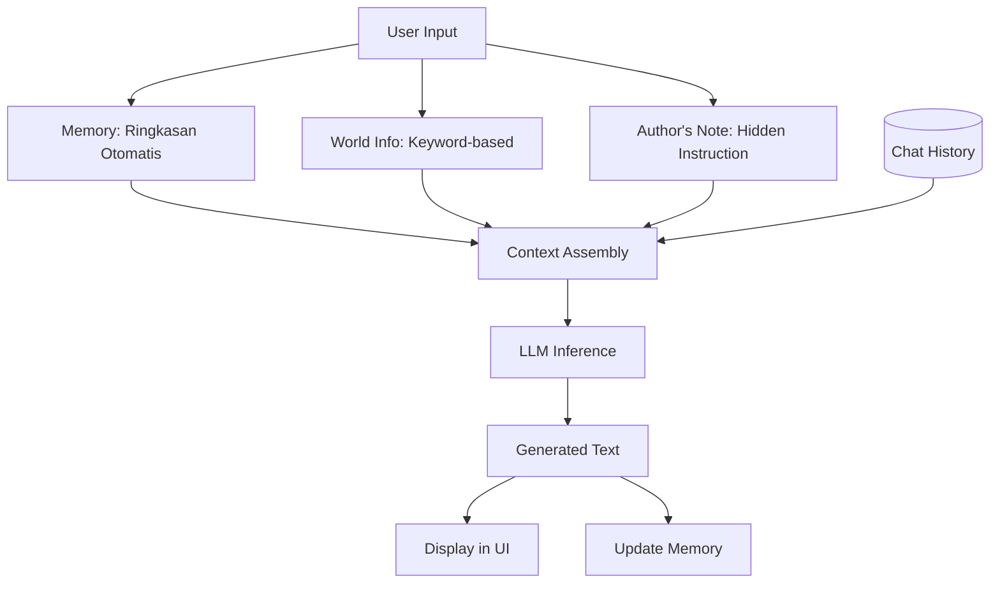

# [Jilid 1] Bab 3.6: KoboldCPP — Solusi Creative Writing dan Roleplay Lokal
> **Tipe Konten:** Praktis — Kreatif + Konfigurasi + Studi Kasus
> **Target Pembaca:** Penulis dan roleplayer yang ingin AI lokal untuk narasi interaktif

---

## 1. TUJUAN SUB-BAB
Setelah membaca, pembaca harus bisa:
- Menginstall dan menjalankan KoboldCPP untuk creative writing
- Menggunakan fitur-fitur spesifik: Memory, Author's Note, World Info
- Mengoptimalkan parameter untuk roleplay dan narasi panjang

---

## 2. KERANGKA KONTEN (WAJIB DITULIS)

### A. Filosofi KoboldCPP (1 paragraf)
- Turunan dari KoboldAI — dirancang khusus untuk creative writing dan roleplay
- Berbasis llama.cpp dengan UI web terintegrasi
- Open source, fokus pada pengalaman naratif interaktif

### B. Arsitektur & Fitur Unggulan (1-2 paragraf)
- Single binary C++ — portabel, tanpa dependency rumit
- UI web bawaan: editor cerita, character management
- Memory system: menyimpan konteks antar sesi
- Author's Note: sisipkan instruksi diam-diam ke konteks
- World Info: knowledge base untuk lore, karakter, lokasi

### C. Parameter Khusus Creative Writing (1-2 paragraf)
- Context shifting: manajemen context window untuk cerita panjang
- Dynamic context: prioritaskan token penting saat konteks penuh
- Adventure mode: narasi interaktif dengan pilihan
- Quick Continue: generate kelanjutan tanpa prompt baru

### D. KoboldAI Lite vs KoboldCPP (1 paragraf)
- KoboldAI Lite: versi web-only, bisa remote ke KoboldCPP server
- KoboldCPP: binary lokal + API
- Keduanya kompatibel: UI Lite → backend CPP

### E. Manajemen Character & World Info (1-2 paragraf)
- Character card: nama, deskripsi, persona, greeting
- World Info entries: keyword → konten, di-inject saat keyword muncul
- Memory: ringkasan otomatis percakapan sebelumnya
- Format populer: TavernAI / Pygmalion character cards

### F. Ekosistem Model untuk Roleplay (1 paragraf)
- Model yang di-fine-tune untuk roleplay: Mythomax, Tiefighter, Noromaid
- Model creative writing: Luna, Wyvern, Stheno
- Pentingnya roleplay-specific: lebih natural, lebih immersive

---

## 3. TABEL WAJIB

### Tabel A: Fitur KoboldCPP untuk Creative Writing

| Fitur | Deskripsi | Manfaat untuk Penulis |
|:---|:---|:---|
| **Memory** | Ringkasan otomatis konteks | Cerita panjang tetap koheren |
| **Author's Note** | Instruksi diam-diam di konteks | Kontrol tone/style tanpa muncul di output |
| **World Info** | Lore/karakter knowledge base | Worldbuilding konsisten |
| **Context Shifting** | Prioritaskan token penting | Cerita > 8K token tetap bisa |
| **Adventure Mode** | Narasi dengan pilihan interaktif | Gamebook / CYOA |
| **Quick Continue** | Generate tanpa prompt baru | Aliran menulis tidak terputus |

### Tabel B: Perbandingan Roleplay-Specific Models

| Model | Ukuran | Roleplay Quality | Writing Quality | Kecepatan (7B, Q4) |
|:---|:---:|:---:|:---:|:---:|
| **Mythomax-L2-13B** | 13B | ***** | ***** | 3-5 t/s (GPU 24GB) |
| **Tiefighter-13B** | 13B | **** | ***** | 3-5 t/s |
| **Noromaid-20B** | 20B | ***** | **** | 2-3 t/s (GPU 48GB) |
| **Llama-3-8B-Instruct** | 8B | *** | **** | 8-12 t/s |
| **Mistral-7B-RP** | 7B | **** | *** | 10-15 t/s |

### Tabel C: Parameter Optimal untuk Roleplay

| Parameter | Default | Roleplay | Creative Writing | Chat |
|:---|:---:|:---:|:---:|:---:|
| **Temperature** | 0.7 | 0.95 | 0.9 | 0.8 |
| **Top-P** | 0.9 | 0.95 | 0.95 | 0.9 |
| **Top-K** | 40 | 60 | 50 | 40 |
| **Repetition Penalty** | 1.0 | 1.15 | 1.1 | 1.05 |
| **Min-P** | 0.05 | 0.1 | 0.1 | 0.05 |
| **Context Size** | 2048 | 4096 | 8192 | 2048 |

---

## 4. DIAGRAM/GAMBAR WAJIB

### Diagram 1: Alur Context Management KoboldCPP (Mermaid)
- **File:** `assets/diagrams/j1-b3-s6-context-management.mmd`
- **Isi:** Input → Memory → World Info → Author's Note → Chat History → LLM → Output



### Gambar 2: Screenshot KoboldCPP dengan World Info Panel
- **File:** `assets/images/jilid1/j1-b3-s6-world-info.png`
- **Isi:** Tampilan UI KoboldCPP dengan panel World Info dan editor entri

### Gambar 3: Character Card Example (JSON)
- **File:** `assets/images/jilid1/j1-b3-s6-character-card.png`
- **Isi:** Contoh character card dalam format TavernAI dengan nama, description, personality, scenario

---

## 5. TUTORIAL / HANDS-ON (WAJIB)

### Tutorial A: Setup KoboldCPP dan Mulai Menulis

```bash
# 1. Download KoboldCPP
# Kunjungi https://github.com/LostRuins/koboldcpp/releases
# atau build dari source:

git clone https://github.com/LostRuins/koboldcpp
cd koboldcpp
make -j 4

# 2. Jalankan dengan model GGUF
python koboldcpp.py ../model.gguf --threads 8 \
  --contextsize 4096 \
  --blasbatchsize 1024 \
  --gpulayers 30

# 3. Buka http://localhost:5001
# UI KoboldCPP akan terbuka

# 4. Setting parameter writing:
# Temperature: 0.9
# Top-P: 0.95
# Repetition Penalty: 1.12
# Memory: "Cerita berlatar dunia fantasi abad pertengahan"

# 5. Mulai prompt:
# "Di istana kerajaan Atheria, seorang pangeran muda..."
# Klik "Generate" atau "Continue"
```

### Tutorial B: Setup World Info untuk Worldbuilding

```json
{
  "name": "Kerajaan Atheria",
  "entries": [
    {
      "key": ["Atheria", "Kerajaan Atheria"],
      "content": "Kerajaan Atheria adalah kerajaan makmur di Lembah Emas. \
Dipimpin oleh Raja Aldric yang bijaksana. Ibukota: Atherion.\
Bahasa resmi: Atherian. Mata uang: Gold Crown.",
      "selective": true
    },
    {
      "key": ["Pangeran Kael", "Kael"],
      "content": "Pangeran Kael adalah putra mahkota Atheria, \
berusia 24 tahun. Memiliki kemampuan sihir unsur api. \
Sifat: pemberani tapi impulsif. Rambut merah, mata emas.",
      "selective": true
    }
  ]
}
```

```bash
# Di UI KoboldCPP: World Info tab
# Import JSON → entries akan aktif
# Saat kata "Atheria" muncul di chat, World Info akan otomatis di-inject
```

### Tutorial C: Remote KoboldAI Lite ke KoboldCPP

```bash
# Di PC/server:
python koboldcpp.py model.gguf --host 0.0.0.0 --port 5001

# Di laptop/client:
# Buka https://lite.koboldai.net/
# Settings → API → KoboldCPP → http://server-ip:5001

# Atau self-host KoboldAI Lite:
git clone https://github.com/LostRuins/koboldai-lite
cd koboldai-lite
python -m http.server 8000
# Buka http://localhost:8000, sambungkan ke KoboldCPP server
```

---

## 6. STUDI KASUS (WAJIB)

### Studi Kasus: Novel Interaktif dengan World Info
- **Penulis:** Ingin menulis novel fantasi epik dengan AI sebagai co-writer
- **Tools:** KoboldCPP + Mythomax-L2-13B Q4_K_M + World Info ekstensif
- **World Info Setup:** 50 entri (12 karakter, 20 lokasi, 10 benda, 8 organisasi)
- **Memory System:** Ringkasan otomatis setiap 500 token
- **Parameter:** T=0.9, Min-P=0.1, RP=1.12, Context=8192
- **Workflow:** Menulis 300 kata → AI generate 500 kata → edit → continue
- **Hasil:** 3.000 kata/hari dengan koherensi plot yang baik
- **Kendala:** Context 8192 masih terbatas untuk novel bab penuh → perlu summarization manual

---

## 7. REFERENSI WAJIB (SOP: minimal 5 paper 5 tahun terakhir + DOI)

### Paper Jurnal/Konferensi

[1] **RoleLLM: Benchmarking, Eliciting, and Enhancing Role-Playing Abilities**
```
@inproceedings{wang2024rolellm,
  title     = {{RoleLLM}: Benchmarking, Eliciting, and Enhancing Role-Playing Abilities of Large Language Models},
  author    = {Wang, Zekun Moore and others},
  booktitle = {Proceedings of ACL Findings},
  year      = {2024},
  doi       = {10.18653/v1/2024.findings-acl.878},
  url       = {https://aclanthology.org/2024.findings-acl.878/}
}
```
- Kaitan: Framework benchmark dan enhancement role-playing LLM. Relevan untuk menjelaskan teknik prompt engineering untuk roleplay di sub-bab 2.F.

[2] **HOLLMWOOD: Unleashing Creativity in Screenwriting via Role Playing**
```
@inproceedings{chen2024holmwood,
  title     = {{HOLLMWOOD}: Unleashing the Creativity of Large Language Models in Screenwriting via Role Playing},
  author    = {Chen, Jing and others},
  booktitle = {Proceedings of EMNLP Findings},
  year      = {2024},
  doi       = {10.18653/v1/2024.findings-emnlp.474},
  url       = {https://aclanthology.org/2024.findings-emnlp.474/}
}
```
- Kaitan: Framework multi-role (Writer, Editor, Actor) untuk screenwriting. Relevan untuk sub-bab 2.E — bagaimana KoboldCPP memfasilitasi creative writing.

[3] **Capturing Minds: Enhancing Role-Playing Language Models with Personality-Indicative Data**
```
@inproceedings{luo2024rolepersonality,
  title     = {Capturing Minds, Not Just Words: Enhancing Role-Playing Language Models with Personality-Indicative Data},
  author    = {Luo, Ziyi and others},
  booktitle = {Proceedings of EMNLP Findings},
  year      = {2024},
  doi       = {10.18653/v1/2024.findings-emnlp.853},
  url       = {https://aclanthology.org/2024.findings-emnlp.853/}
}
```
- Kaitan: Dataset ROLEPERSONALITY untuk meningkatkan fidelity karakter. Relevan untuk World Info dan Character Cards di sub-bab 2.E.

[4] **PingPong: A Benchmark for Role-Playing Language Models**
```
@article{paul2024pingpong,
  title     = {{PingPong}: A Benchmark for Role-Playing Language Models with User Emulation and Multi-Model Evaluation},
  author    = {Paul, Debjit and others},
  journal   = {arXiv preprint arXiv:2409.06820},
  year      = {2024},
  doi       = {10.48550/arXiv.2409.06820},
  url       = {https://arxiv.org/abs/2409.06820}
}
```
- Kaitan: Benchmark role-playing dengan korelasi creative writing. Menemukan fine-tuning untuk creative writing meningkatkan role-play. Relevan untuk sub-bab 2.F.

[5] **Min-P Sampling for Creative Outputs**
```
@inproceedings{nguyen2025minp,
  title     = {Turning Up the Heat: Min-{p} Sampling for Creative and Coherent {LLM} Outputs},
  author    = {Nguyen, Nhat Minh and others},
  booktitle = {International Conference on Learning Representations (ICLR)},
  year      = {2025},
  doi       = {10.48550/arXiv.2407.01082},
  url       = {https://arxiv.org/abs/2407.01082}
}
```
- Kaitan: Min-P sampling sangat relevan untuk creative writing — memungkinkan temperature tinggi tanpa incoherence. Data di Tabel C harus merujuk paper ini.

### Referensi Pendukung (Non-Paper)

[6] KoboldCPP. *GitHub Repository*. [https://github.com/LostRuins/koboldcpp](https://github.com/LostRuins/koboldcpp)

[7] KoboldAI Lite. *GitHub Repository*. [https://github.com/LostRuins/koboldai-lite](https://github.com/LostRuins/koboldai-lite)

[8] TavernAI Character Card Specification. [https://github.com/TavernAI/TavernAI](https://github.com/TavernAI/TavernAI)

[9] Pygmalion Roleplay Models. [https://huggingface.co/PygmalionAI](https://huggingface.co/PygmalionAI)

### SOP Referensi
- WAJIB menyertakan minimal **5 paper jurnal/konferensi** dari 5 tahun terakhir (2021-2026) dengan DOI/arXiv yang valid.
- Paper tentang role-playing dan creative writing menjadi fondasi teoretis.

(End of sub-bab-6.md)
