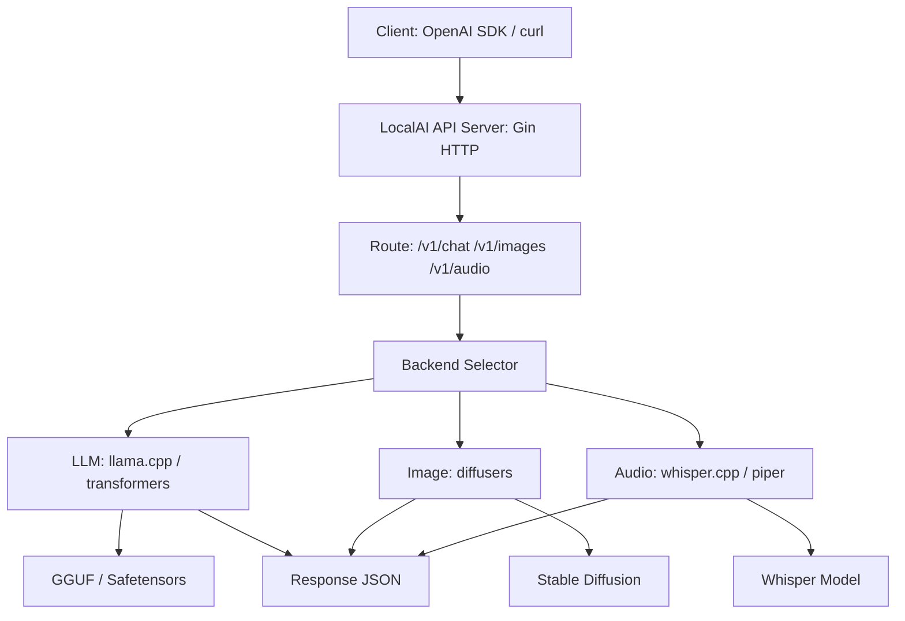

# [Jilid 1] Bab 3.7: LocalAI — Ubah PC Lokal Jadi Server API OpenAI-Compatible
> **Tipe Konten:** Teknis — Arsitektur + Deployment + Integrasi
> **Target Pembaca:** Developer yang ingin mengganti OpenAI API dengan server lokal

---

## 1. TUJUAN SUB-BAB
Setelah membaca, pembaca harus bisa:
- Deploy LocalAI dan mengganti endpoint API dari OpenAI ke lokal
- Mengonfigurasi model, embedding, image generation, dan TTS
- Memahami trade-off antara LocalAI vs vLLM vs Ollama sebagai API server

---

## 2. KERANGKA KONTEN (WAJIB DITULIS)

### A. Filosofi LocalAI (1 paragraf)
- Drop-in replacement untuk OpenAI API — 100% kompatibel
- Mendukung LLM, image generation, audio transcription, embeddings, TTS
- Tidak perlu GPU — CPU-first dengan opsi GPU

### B. Arsitektur Backend (1-2 paragraf)
- Backend modular: llama.cpp, transformers, diffusers, whisper.cpp
- Setiap model punya konfigurasi YAML sendiri
- Pipeline request: HTTP → Model Backend → Inference → Response

### C. Model Configuration YAML (1-2 paragraf)
- File YAML per model: backend, model path, parameters
- Parameter: context size, threads, GPU layers, mmap
- Multiple backend support per model type

### D. Embeddings & RAG Pipeline (1 paragraf)
- OpenAI-compatible `/v1/embeddings` endpoint
- Backend: bert.cpp, sentencetransformers
- Integrasi langsung dengan LangChain, LlamaIndex
- Dapat digunakan sebagai embedding server untuk Open WebUI

### E. Image & Audio Generation (1 paragraf)
- Image: Stable Diffusion (diffusers backend) — `/v1/images/generations`
- Audio: Whisper (STT) — `/v1/audio/transcriptions`
- TTS: Piper, Bark — `/v1/audio/speech`
- Satu server untuk semua modalitas

### F. Performance & Scaling (1 paragraf)
- Model loading: lazy loading, keep-alive
- Caching: prompt caching, image result caching
- Autoload: load model saat pertama dipanggil
- GPU acceleration: CUDA, Metal, OpenCL

---

## 3. TABEL WAJIB

### Tabel A: Fitur API OpenAI yang Didukung LocalAI

| Endpoint | LocalAI | OpenAI | Catatan |
|:---|:---:|:---:|:---|
| `/v1/chat/completions` | Ya | Ya | Streaming, function calling |
| `/v1/completions` | Ya | Ya | Legacy completions |
| `/v1/embeddings` | Ya | Ya | Multiple backend |
| `/v1/models` | Ya | Ya | List loaded models |
| `/v1/images/generations` | Ya | Ya | Stable Diffusion |
| `/v1/audio/transcriptions` | Ya | Ya | Whisper |
| `/v1/audio/speech` | Ya | Ya | Piper/Bark TTS |
| `/v1/moderations` | Tidak | Ya | Belum support |

### Tabel B: Perbandingan API Server Lokal

| Fitur | LocalAI | Ollama | vLLM | LiteLLM |
|:---|:---|:---|:---|:---|
| **Drop-in OpenAI** | **100%** | Sebagian | 95% | Proxy ke berbagai API |
| **LLM** | Ya | Ya | Ya | Proxy |
| **Image Gen** | Ya | Tidak | Tidak | Tidak |
| **STT/TTS** | Ya | Tidak | Tidak | Tidak |
| **Embeddings** | Ya | Ya | Tidak | Proxy |
| **GPU Support** | CUDA, Metal | CUDA, Metal, ROCm | CUDA | - |
| **CPU-Only** | Ya (optimized) | Ya | Tidak | - |
| **Multi-Model** | Ya (YAML) | Ya (CLI) | Ya | Ya |

### Tabel C: Backend Model LocalAI

| Tipe Model | Backend | Format | GPU Support |
|:---|:---|:---|:---:|
| **LLM** | llama.cpp | GGUF | Ya |
| **LLM** | transformers | Safetensors | Ya |
| **LLM** | diffusers | - | Ya (image) |
| **Embeddings** | bert.cpp | GGUF | Tidak |
| **Embeddings** | sentencetransformers | ONNX | Tidak |
| **STT** | whisper.cpp | GGML | Ya |
| **TTS** | piper | ONNX | Tidak |
| **TTS** | bark | transformers | Ya |

---

## 4. DIAGRAM/GAMBAR WAJIB

### Diagram 1: Arsitektur LocalAI Multi-Model (Mermaid)
- **File:** `assets/diagrams/j1-b3-s7-arsitektur-localai.mmd`
- **Isi:** HTTP Request → API Router → Backend Selector (LLM/Image/Audio) → Model Backend → Inference



### Gambar 2: Contoh File Konfigurasi YAML
- **File:** `assets/images/jilid1/j1-b3-s7-yaml-config.png`
- **Isi:** File YAML untuk model Llama 3.1 dengan parameter backend, GPU, context size

### Gambar 3: Diagram Migrasi dari OpenAI ke LocalAI
- **File:** `assets/images/jilid1/j1-b3-s7-migration-path.png`
- **Isi:** Flow: Ubah base_url dari api.openai.com ke localhost:8080 → semua aplikasi tetap jalan

---

## 5. TUTORIAL / HANDS-ON (WAJIB)

### Tutorial A: Deploy LocalAI dengan Docker

```bash
# 1. Deploy LocalAI
docker run -d \
  --name localai \
  -p 8080:8080 \
  -v localai-models:/models \
  -v localai-config:/config \
  localai/localai:latest-cpu

# Dengan GPU NVIDIA:
docker run -d \
  --name localai \
  --gpus all \
  -p 8080:8080 \
  -v localai-models:/models \
  -v localai-config:/config \
  localai/localai:latest-gpu-nvidia

# 2. Download model via LocalAI API
curl http://localhost:8080/models/apply \
  -d '{
    "url": "github:go-skynet/model-gallery/llama-3.1-8b-instruct.yaml"
  }'

# 3. Test chat completion (OpenAI-compatible)
curl http://localhost:8080/v1/chat/completions \
  -H "Content-Type: application/json" \
  -d '{
    "model": "llama-3.1-8b-instruct",
    "messages": [
      {"role": "user", "content": "Halo, siapa kamu?"}
    ],
    "temperature": 0.7,
    "stream": true
  }'
```

### Tutorial B: Konfigurasi Model YAML Manual

```yaml
# models/llama3.yaml
name: llama-3.1-8b-instruct
backend: llama.cpp
parameters:
  model: /models/llama-3.1-8b-instruct-q4_k_m.gguf
  context_size: 8192
  threads: 8
  f16: true
  mmap: true
  # GPU offload
  n_gpu_layers: 40
  # Temperature dan sampling default
  temperature: 0.7
  top_k: 40
  top_p: 0.9
```

```bash
# Test dengan Python (OpenAI SDK)
import openai

client = openai.OpenAI(
    base_url="http://localhost:8080/v1",
    api_key="not-needed"  # LocalAI tidak perlu API key
)

response = client.chat.completions.create(
    model="llama-3.1-8b-instruct",
    messages=[{"role": "user", "content": "Siapa presiden Indonesia?"}],
    stream=True
)

for chunk in response:
    print(chunk.choices[0].delta.content or "", end="")
```

### Tutorial C: Setup RAG dengan LangChain + LocalAI

```python
from langchain_community.embeddings import LocalAIEmbeddings
from langchain_community.vectorstores import Chroma

# Embedding via LocalAI
embeddings = LocalAIEmbeddings(
    model="text-embedding-ada-002",  # atau model lokal
    openai_api_base="http://localhost:8080/v1"
)

# Vector store
vectorstore = Chroma.from_documents(
    documents=splits,
    embedding=embeddings
)

# LLM via LocalAI
from langchain_community.chat_models import ChatLocalAI

llm = ChatLocalAI(
    model="llama-3.1-8b-instruct",
    base_url="http://localhost:8080/v1"
)

# RAG chain siap digunakan!
```

---

## 6. STUDI KASUS (WAJIB)

### Studi Kasus: Migrasi Startup dari OpenAI ke LocalAI
- **Profil:** Startup kecil (5 dev) yang biasa pakai OpenAI API — biaya $200/bulan
- **Tujuan:** Hemat biaya tanpa mengubah kode aplikasi
- **Solusi:** Deploy LocalAI di server Mini PC (Ryzen 9, 64GB RAM, RTX 4060)
- **Migrasi:** Cukup ubah `base_url` dari `api.openai.com` ke `localhost:8080`
- **Model:** Llama 3.1 8B untuk chat, BGE for embeddings, Whisper for transkrip
- **Hasil:** $0/biaya API bulanan, latency sama (rata-rata 2s), privacy terjamin
- **Kendala:** Kualitas output sedikit berbeda (fine-tuning mungkin diperlukan)
- **Kesimpulan:** LocalAI adalah pilihan ekonomis untuk startup yang ingin local-first

---

## 7. REFERENSI WAJIB (SOP: minimal 5 paper 5 tahun terakhir + DOI)

### Paper Jurnal/Konferensi

[1] **A Middle Path for On-Premises LLM Deployment**
```
@article{li2024middlepath,
  title     = {A Middle Path for On-Premises {LLM} Deployment: Preserving Privacy Without Sacrificing Model Confidentiality},
  author    = {Li, Xuechen and others},
  journal   = {arXiv preprint arXiv:2410.11182},
  year      = {2024},
  doi       = {10.48550/arXiv.2410.11182},
  url       = {https://arxiv.org/abs/2410.11182}
}
```
- Kaitan: Kerangka semi-open deployment LLM — relevan untuk filosofi LocalAI sebagai on-premises OpenAI replacement. Menjelaskan trade-off antara privasi dan confidentiality.

[2] **ScaleLLM: Resource-Frugal LLM Serving Framework**
```
@inproceedings{wang2024scalellm,
  title     = {{ScaleLLM}: A Resource-Frugal {LLM} Serving Framework by Optimizing End-to-End Efficiency},
  author    = {Wang, Lei and others},
  booktitle = {Proceedings of EMNLP Industry Track},
  year      = {2024},
  doi       = {10.18653/v1/2024.emnlp-industry.22},
  url       = {https://aclanthology.org/2024.emnlp-industry.22/}
}
```
- Kaitan: Sistem serving LLM dengan API gateway optimization. Relevan untuk menjelaskan arsitektur backend LocalAI di sub-bab 2.B.

[3] **LLM Inference Serving: Survey of Recent Advances**
```
@article{zhang2024llmsurvey,
  title     = {{LLM} Inference Serving: Survey of Recent Advances and Opportunities},
  author    = {Zhang, Hao and others},
  journal   = {arXiv preprint arXiv:2407.12391},
  year      = {2024},
  doi       = {10.48550/arXiv.2407.12391},
  url       = {https://arxiv.org/abs/2407.12391}
}
```
- Kaitan: Survey sistem serving — membantu memposisikan LocalAI dalam landscape API servers. Relevan untuk Tabel B (perbandingan API server).

[4] **ServerlessLLM: Low-Latency Serverless Inference**
```
@inproceedings{fu2024serverlessllm,
  title     = {{ServerlessLLM}: Low-Latency Serverless Inference for Large Language Models},
  author    = {Fu, Yao and others},
  booktitle = {USENIX OSDI},
  year      = {2024},
  url       = {https://www.usenix.org/system/files/osdi24-fu.pdf}
}
```
- Kaitan: Multi-tier checkpoint loading — relevan untuk menjelaskan mekanisme model loading dan caching di LocalAI (sub-bab 2.F).

[5] **Towards Efficient Generative LLM Serving: A Survey**
```
@article{miao2024llmsurvey,
  title     = {Towards Efficient Generative Large Language Model Serving: A Survey from Algorithms to Systems},
  author    = {Miao, Xupeng and others},
  journal   = {ACM Computing Surveys},
  year      = {2025},
  doi       = {10.1145/3754448},
  url       = {https://dl.acm.org/doi/10.1145/3754448}
}
```
- Kaitan: Taksonomi sistem serving — GPU memory management, request scheduling. Relevan untuk menjelaskan optimasi performa LocalAI.

### Referensi Pendukung (Non-Paper)

[6] LocalAI. *GitHub Repository*. [https://github.com/mudler/LocalAI](https://github.com/mudler/LocalAI)

[7] LocalAI Documentation. [https://localai.io](https://localai.io)

[8] LocalAI Model Gallery. [https://github.com/mudler/LocalAI/tree/master/models](https://github.com/mudler/LocalAI/tree/master/models)

[9] OpenAI API Reference. [https://platform.openai.com/docs/api-reference](https://platform.openai.com/docs/api-reference)

### SOP Referensi
- WAJIB menyertakan minimal **5 paper jurnal/konferensi** dari 5 tahun terakhir (2021-2026) dengan DOI/arXiv yang valid.
- Paper tentang API serving, on-premises deployment, dan inference optimization menjadi fondasi teoretis.

(End of sub-bab-7.md)
