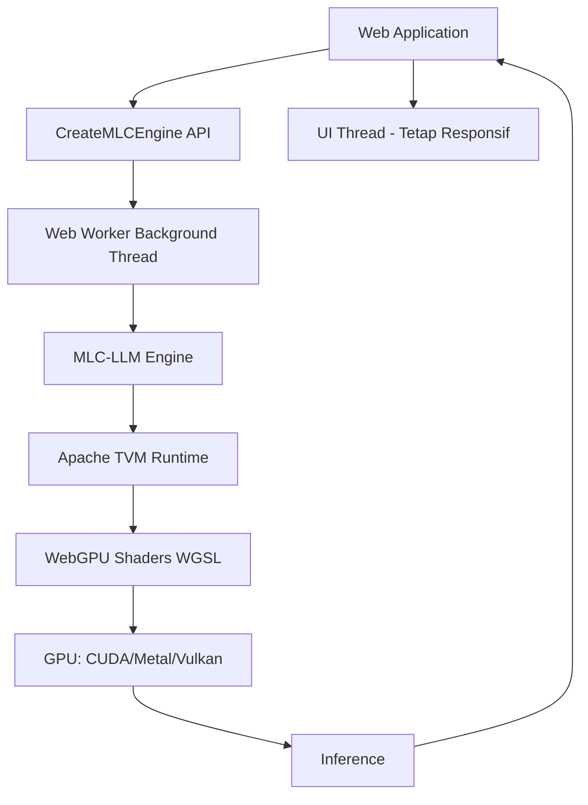

# [Jilid 1] Bab 3.8: Browser-Based LLM — WebLLM & WebGPU
> **Tipe Konten:** Teknis — Arsitektur Web + Benchmark + Hands-On
> **Target Pembaca:** Developer web yang ingin menjalankan LLM di browser tanpa server

---

## 1. TUJUAN SUB-BAB
Setelah membaca, pembaca harus bisa:
- Menjelaskan arsitektur WebLLM dengan WebGPU dan WebAssembly
- Mengintegrasikan WebLLM ke aplikasi web dengan OpenAI-style API
- Memahami trade-off performa browser vs native inference

---

## 2. KERANGKA KONTEN (WAJIB DITULIS)

### A. Mengapa LLM di Browser? (1 paragraf)
- Zero deployment: tidak perlu server, tidak perlu instalasi
- Privacy: 100% komputasi client-side, data tidak meninggalkan browser
- Universal: browser ada di setiap perangkat (desktop, laptop, tablet, HP)

### B. WebGPU: Akselerasi GPU di Browser (1-2 paragraf)
- Standar W3C baru untuk akses GPU dari JavaScript
- Backend-agnostic: CUDA, Metal, Vulkan — semua lewat WGSL
- Browser support: Chrome 113+, Edge 113+, Firefox Nightly
- Perbandingan: WebGL (graphics) vs WebGPU (compute + graphics)

### C. WebLLM Architecture (1-2 paragraf)
- Berbasis MLC-LLM + Apache TVM compiler
- WebGPU kernels compiled dari native CUDA/Metal
- Web Workers: inference di background thread, UI tetap responsif
- OpenAI-compatible API: `CreateMLCEngine()`

### D. Performa Browser vs Native (1-2 paragraf)
- WebLLM mempertahankan ~80% performa native (Metal)
- Bottleneck: WebGPU driver translation (WGSL → native shader)
- Model size: model 2B-7B Q4 feasible di browser
- Memory limit: tergantung GPU device memory

### E. Model yang Didukung (1 paragraf)
- Format: MLC format (optimized for WebGPU)
- Model populer: Llama 3.2, Phi-3, Gemma 2, Qwen 2.5
- Quantization: q4f16, q4f32, q0f16
- Model download via CDN atau Hugging Face

### F. Use Cases & Keterbatasan (1 paragraf)
- Chatbot pribadi, summarization, translation, code assistant
- Keterbatasan: model size max ~7B, context window terbatas, tidak semua browser support WebGPU
- Masa depan: WebGPU terus berkembang, gap performa mengecil

---

## 3. TABEL WAJIB

### Tabel A: Browser Support WebGPU

| Browser | Version | WebGPU Support | Status |
|:---|:---:|:---:|:---|
| **Google Chrome** | 113+ | Full | Stable |
| **Microsoft Edge** | 113+ | Full | Stable |
| **Firefox** | Nightly | Experimental | In Development |
| **Safari** | 16.4+ | Partial | In Development |
| **Opera** | 99+ | Full | Stable |

### Tabel B: Performa WebLLM vs Native (M3 Max, 7B Model)

| Metrik | WebLLM (WebGPU) | Native (Metal) | Rasio |
|:---|:---:|:---:|:---:|
| **Decode Speed (t/s)** | 42.5 t/s | 51.2 t/s | ~83% |
| **Prefill (128 tok)** | 0.82s | 0.64s | ~78% |
| **Prefill (2048 tok)** | 4.1s | 3.6s | ~88% |
| **Memory Usage** | 5.8 GB | 5.2 GB | ~112% |

### Tabel C: Perbandingan Framework Browser LLM

| Fitur | WebLLM | llama.cpp (WASM) | transformers.js |
|:---|:---|:---|:---|
| **GPU Acceleration** | WebGPU | CPU (WASM) | CPU (WASM) |
| **Kecepatan** | ***** (GPU) | ** (CPU) | *** (CPU) |
| **OpenAI API** | Ya | Manual | Manual |
| **Model Format** | MLC | GGUF | ONNX |
| **Web Worker** | Ya | Manual | Ya |
| **Browser Support** | Chrome/Edge | All browsers | All browsers |

---

## 4. DIAGRAM/GAMBAR WAJIB

### Diagram 1: Arsitektur WebLLM (Mermaid)
- **File:** `assets/diagrams/j1-b3-s8-arsitektur-webllm.mmd`
- **Isi:** JavaScript App → Web Worker → MLC Engine → WebGPU → GPU



### Gambar 2: Screenshot WebLLM Chat Running di Browser
- **File:** `assets/images/jilid1/j1-b3-s8-webllm-chat.png`
- **Isi:** WebLLM Chat interface dengan model terload, menampilkan status "Running on WebGPU"

### Gambar 3: Grafik Perbandingan Performa Browser vs Native
- **File:** `assets/images/jilid1/j1-b3-s8-perf-comparison.png`
- **Isi:** Bar chart WebGPU vs Metal vs CUDA untuk berbagai model dan context length

---

## 5. TUTORIAL / HANDS-ON (WAJIB)

### Tutorial A: WebLLM Chat — Hello World

```html
<!DOCTYPE html>
<html>
<head>
  <title>WebLLM Chat Lokal</title>
  <script type="module">
    import { CreateMLCEngine } from "@mlc-ai/web-llm";

    async function main() {
      const statusDiv = document.getElementById("status");
      const responseDiv = document.getElementById("response");

      statusDiv.textContent = "Loading model...";

      // Inisialisasi engine
      const engine = await CreateMLCEngine(
        "Llama-3.2-3B-Instruct-q4f16_1-MLC",
        { initProgressCallback: (p) => {
          statusDiv.textContent = `Loading: ${Math.round(p.progress * 100)}%`;
        }}
      );

      statusDiv.textContent = "Ready!";

      // Chat completion
      const reply = await engine.chat.completions.create({
        messages: [
          { role: "system", content: "Kamu adalah asisten yang membantu." },
          { role: "user", content: "Jelaskan AI dalam 3 kalimat." }
        ],
        temperature: 0.7,
        max_tokens: 100,
        stream: true,
      });

      let response = "";
      for await (const chunk of reply) {
        response += chunk.choices[0]?.delta?.content || "";
        responseDiv.textContent = response;
      }
    }

    main();
  </script>
</head>
<body>
  <h2>WebLLM Chat Lokal</h2>
  <div id="status">Initializing...</div>
  <div id="response"></div>
</body>
</html>
```

### Tutorial B: Setup WebGPU Check dan Fallback

```html
<script>
  async function checkWebGPU() {
    if (!navigator.gpu) {
      alert("WebGPU tidak didukung browser ini. Gunakan Chrome 113+");
      return false;
    }

    const adapter = await navigator.gpu.requestAdapter();
    if (!adapter) {
      alert("Tidak ada GPU adapter yang tersedia");
      return false;
    }

    const device = await adapter.requestDevice();
    const info = {
      vendor: adapter.info.vendor,
      architecture: adapter.info.architecture,
      device: adapter.info.device,
      features: [...adapter.features].join(", "),
    };

    console.table(info);
    return true;
  }

  // Integrasi dengan WebLLM
  async function loadModelWithFallback() {
    const hasWebGPU = await checkWebGPU();
    if (!hasWebGPU) {
      // Fallback ke transformers.js (CPU via WASM)
      console.log("Falling back to CPU-based inference");
      return loadTransformersJS();
    }
    return loadWebLLM();
  }
</script>
```

### Tutorial C: Multiple Model Switching

```javascript
import { CreateMLCEngine } from "@mlc-ai/web-llm";

class LocalAIAssistant {
  constructor() {
    this.engines = {};
  }

  async loadModel(name, modelId) {
    if (this.engines[name]) return this.engines[name];

    this.engines[name] = await CreateMLCEngine(modelId);
    return this.engines[name];
  }

  async chat(name, messages, options = {}) {
    const engine = await this.loadModel(name, this.modelMap[name]);
    return engine.chat.completions.create({
      messages,
      temperature: options.temperature || 0.7,
      max_tokens: options.maxTokens || 256,
      stream: true,
    });
  }

  async unloadAll() {
    for (const name in this.engines) {
      await this.engines[name].unload();
    }
    this.engines = {};
  }
}

// Usage
const assistant = new LocalAIAssistant();
const stream = await assistant.chat(
  "reasoning",
  [{ role: "user", content: "Solve: 2x + 5 = 15" }],
  { temperature: 0.2 }
);
```

---

## 6. STUDI KASUS (WAJIB)

### Studi Kasus: Aplikasi Web Privacy-First untuk Klinik Kecil
- **Profil:** Klinik dengan 3 dokter — butuh AI untuk rangkum rekam medis
- **Tantangan:** Data pasien TIDAK BOLEH dikirim ke server cloud
- **Solusi:** Web app dengan WebLLM — semua inferensi di browser dokter
- **Model:** Llama 3.2 3B q4f16 — cukup untuk summarization
- **Integrasi:** Web app React + WebLLM + Local Storage untuk history
- **Hasil:** Rangkuman rekam medis 200 kata dalam 5 detik, 100% offline
- **Kendala:** Dokter perlu Chrome terbaru + laptop dengan GPU
- **Kesimpulan:** WebLLM memungkinkan AI deployment tanpa server dan tanpa risiko data bocor

---

## 7. REFERENSI WAJIB (SOP: minimal 5 paper 5 tahun terakhir + DOI)

### Paper Jurnal/Konferensi

[1] **WebLLM: A High-Performance In-Browser LLM Inference Engine**
```
@article{ruan2024webllm,
  title     = {{WebLLM}: A High-Performance In-Browser {LLM} Inference Engine},
  author    = {Ruan, Charlie F. and Qin, Yucheng and Zhou, Xun and others},
  journal   = {arXiv preprint arXiv:2412.15803},
  year      = {2024},
  doi       = {10.48550/arXiv.2412.15803},
  url       = {https://arxiv.org/abs/2412.15803}
}
```
- Kaitan: Paper utama WebLLM — arsitektur, WebGPU optimasi, benchmark. Wajib disitasi di seluruh sub-bab.

[2] **FlashAttention: Fast and Memory-Efficient Exact Attention**
```
@inproceedings{dao2022flashattention,
  title     = {{FlashAttention}: Fast and Memory-Efficient Exact Attention with {IO}-Awareness},
  author    = {Dao, Tri and others},
  booktitle = {Advances in Neural Information Processing Systems (NeurIPS)},
  year      = {2022},
  doi       = {10.48550/arXiv.2205.14135},
  url       = {https://arxiv.org/abs/2205.14135}
}
```
- Kaitan: WebLLM mengimplementasikan FlashAttention via WebGPU — memungkinkan context window lebih besar di browser. Relevan untuk sub-bab 2.D.

[3] **Small Language Models: Survey, Measurements, and Insights**
```
@article{lu2024slmsurvey,
  title     = {Small Language Models: Survey, Measurements, and Insights},
  author    = {Lu, Zhenyan and others},
  journal   = {arXiv preprint arXiv:2409.15790},
  year      = {2024},
  doi       = {10.48550/arXiv.2409.15790},
  url       = {https://arxiv.org/abs/2409.15790}
}
```
- Kaitan: Benchmark SLM — model 1B-7B yang feasible di browser. Data model size dan memory footprint di Tabel B harus merujuk paper ini.

[4] **Demystifying Small Language Models for Edge Deployment**
```
@inproceedings{lu2025demystifying,
  title     = {Demystifying Small Language Models for Edge Deployment},
  author    = {Lu, Zhenyan and others},
  booktitle = {Proceedings of the 63rd Annual Meeting of the ACL},
  year      = {2025},
  doi       = {10.18653/v1/2025.acl-long.718},
  url       = {https://aclanthology.org/2025.acl-long.718/}
}
```
- Kaitan: Studi edge deployment SLM — relevan untuk memahami keterbatasan browser sebagai platform inference (sub-bab 2.F).

[5] **A Review on Edge Large Language Models**
```
@article{qu2024edgellm,
  title     = {A Review on Edge Large Language Models: Design, Execution, and Applications},
  author    = {Qu, Zaichen and others},
  journal   = {arXiv preprint arXiv:2410.11845},
  year      = {2024},
  doi       = {10.48550/arXiv.2410.11845},
  url       = {https://arxiv.org/abs/2410.11845}
}
```
- Kaitan: Survey siklus hidup LLM di edge — dari model compression hingga runtime. Relevan untuk menjelaskan posisi browser-based LLM dalam edge computing landscape.

### Referensi Pendukung (Non-Paper)

[6] WebLLM. *GitHub Repository & Documentation*. [https://github.com/mlc-ai/web-llm](https://github.com/mlc-ai/web-llm)

[7] WebGPU Specification. *W3C*. [https://www.w3.org/TR/webgpu/](https://www.w3.org/TR/webgpu/)

[8] MLC-LLM. *GitHub Repository*. [https://github.com/mlc-ai/mlc-llm](https://github.com/mlc-ai/mlc-llm)

[9] WebGPU Report — Browser Support. [https://webgpureport.org](https://webgpureport.org)

### SOP Referensi
- WAJIB menyertakan minimal **5 paper jurnal/konferensi** dari 5 tahun terakhir (2021-2026) dengan DOI/arXiv yang valid.
- Data performa WebLLM di tabel harus diverifikasi dengan paper asli (Ruan et al., 2024).

(End of sub-bab-8.md)
