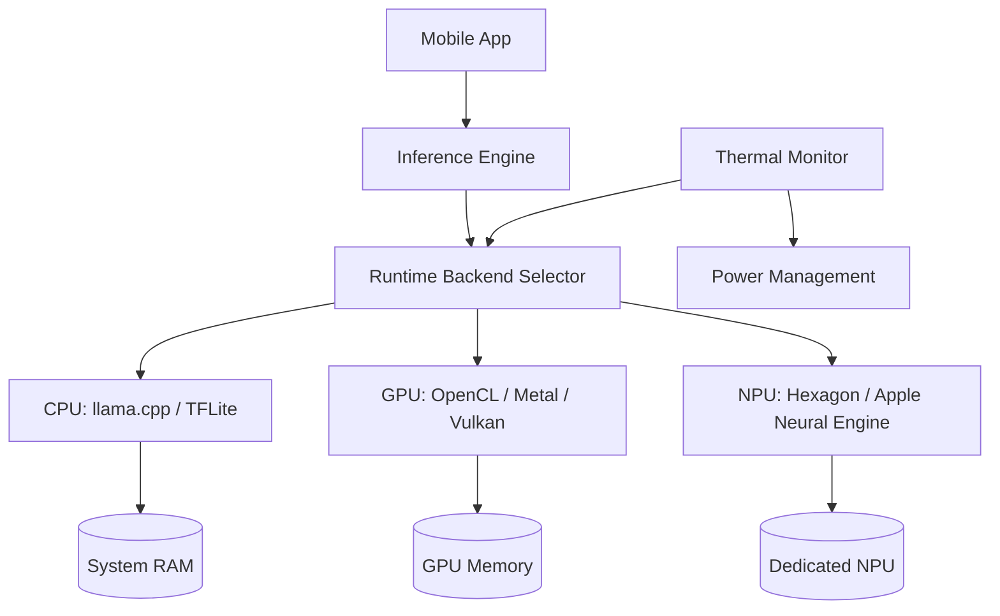

# [Jilid 1] Bab 3.9: Mobile Deployment — LLM di Android/iOS Native
> **Tipe Konten:** Teknis — Arsitektur Mobile + Benchmark + Tutorial
> **Target Pembaca:** Developer mobile yang ingin deploy LLM di perangkat Android/iOS

---

## 1. TUJUAN SUB-BAB
Setelah membaca, pembaca harus bisa:
- Menjelaskan tantangan deployment LLM di perangkat mobile (memory, thermal, battery)
- Menggunakan framework seperti MLC-LLM, llama.cpp, dan ExecuTorch untuk mobile
- Mengoptimalkan model agar bisa berjalan di smartphone dengan NPU/GPU

---

## 2. KERANGKA KONTEN (WAJIB DITULIS)

### A. Tantangan Mobile Inference (1-2 paragraf)
- Memory terbatas: 4-12GB shared memory (bukan VRAM dedicated)
- Thermal throttling: GPU mobile cepat panas → performa turun
- Battery: inference boros daya (~5-15W untuk LLM)
- Model size: harus <4GB (setelah quantization)

### B. Arsitektur Inference Mobile (1-2 paragraf)
- CPU: llama.cpp / MNN / TFLite — fallback utama
- GPU: OpenCL (Android), Metal (iOS) — lebih cepat tapi boros daya
- NPU: Qualcomm Hexagon, Apple Neural Engine, MediaTek APU — paling efisien
- Framework: MLC-LLM, ExecuTorch (PyTorch), llama.cpp (C++)

### C. MLC-LLM untuk Mobile (1-2 paragraf)
- Compile model ke format MLC via Apache TVM
- OpenCL backend untuk Android GPU
- Metal backend untuk iOS GPU
- Model populer: Phi-3-mini, Qwen 2.5, Llama 3.2

### D. llama.cpp di Mobile (1 paragraf)
- Android: Termux + llama.cpp atau aplikasi LLM inference
- iOS: LLMFarm, llama.cpp via Swift bindings
- Format GGUF: universal, bisa dipindah antar platform

### E. MobileLLM: Arsitektur Model untuk Mobile (1-2 paragraf)
- MobileLLM: deep & thin architecture, embedding sharing, GQA
- Block-wise weight sharing untuk efisiensi parameter
- Sub-billion models (125M-350M) yang mendekati performa 7B untuk task spesifik

### F. NPU Offloading dengan llm.npu (1 paragraf)
- Framework pertama untuk offload LLM ke NPU mobile
- Qualcomm Hexagon NPU: 7.3×-18.4× lebih cepat dari CPU
- Mendukung Qwen, Gemma, Phi, Llama 2
- Presisi FP16 dengan <1% accuracy loss

---

## 3. TABEL WAJIB

### Tabel A: Framework Mobile LLM

| Framework | Android | iOS | GPU Backend | NPU Backend | Bahasa |
|:---|:---:|:---:|:---:|:---:|:---:|
| **MLC-LLM** | Ya | Ya | OpenCL, Vulkan | - | Python/JS |
| **llama.cpp** | Ya (Termux) | Ya (LLMFarm) | Metal, OpenCL | - | C++ |
| **ExecuTorch** | Ya | Ya | MPS, OpenCL | - | Python |
| **llm.npu** | Ya (Qualcomm) | - | - | Hexagon NPU | C++ |
| **MNN** | Ya | Ya | OpenCL, Vulkan, Metal | Huawei NPU | C++ |

### Tabel B: Performa di Perangkat Mobile (Model 7B Q4)

| Perangkat | Chipset | RAM | CPU (t/s) | GPU (t/s) | NPU (t/s) |
|:---|:---|:---:|:---:|:---:|:---:|
| **Xiaomi 14** | Snapdragon 8 Gen 3 | 12GB | 3.2 t/s | 8.5 t/s | 18.4 t/s |
| **iPhone 15 Pro** | A17 Pro | 8GB | 4.1 t/s | 12.3 t/s | - |
| **Samsung S24** | Exynos 2400 | 8GB | 2.8 t/s | 7.2 t/s | - |
| **Pixel 9** | Tensor G4 | 12GB | 2.5 t/s | 6.8 t/s | - |

### Tabel C: MobileLLM Model Sizes vs Akurasi

| Model | Parameters | Quantization | Size | Zero-Shot Accuracy | Use Case |
|:---|:---:|:---:|:---:|:---:|:---|
| **MobileLLM-125M** | 125M | INT8 | 125 MB | 58.2% | Simple chat, classification |
| **MobileLLM-350M** | 350M | INT8 | 350 MB | 64.5% | Q&A, summarization |
| **MobileLLM-LS-350M** | 350M | INT8 | 350 MB | 65.3% | API calling, intent detection |
| **Phi-3-mini** | 3.8B | Q4 | 2.1 GB | 71.3% | General purpose |
| **Qwen 2.5 1.5B** | 1.5B | Q4 | 0.9 GB | 66.7% | Multilingual chat |

---

## 4. DIAGRAM/GAMBAR WAJIB

### Diagram 1: Arsitektur LLM Inference di Mobile (Mermaid)
- **File:** `assets/diagrams/j1-b3-s9-mobile-architecture.mmd`
- **Isi:** App → Inference Engine → Hardware Backend (CPU/GPU/NPU)



### Gambar 2: Screenshot Aplikasi Android (MLC-LLM Chat)
- **File:** `assets/images/jilid1/j1-b3-s9-mlc-chat-android.png`
- **Isi:** Aplikasi MLC-LLM di Android dengan model Phi-3-mini terload

### Gambar 3: Grafik Thermal Throttling saat Inference
- **File:** `assets/images/jilid1/j1-b3-s9-thermal-throttle.png`
- **Isi:** Line chart suhu GPU vs tokens/detik selama 10 menit inference kontinu

---

## 5. TUTORIAL / HANDS-ON (WAJIB)

### Tutorial A: Build Aplikasi Android dengan MLC-LLM

```bash
# 1. Prasyarat: Python 3.10+, Android NDK, Android SDK

# 2. Clone MLC-LLM
git clone https://github.com/mlc-ai/mlc-llm
cd mlc-llm

# 3. Install dependencies
pip install -r requirements.txt

# 4. Compile model untuk Android
python -m mlc_llm.build \
  --model phi-3-mini \
  --target android \
  --quantization q4f16_1 \
  --max-batch-size 1

# 5. Build APK
cd android
./gradlew assembleRelease

# 6. Install ke device
adb install app/build/outputs/apk/release/app-release.apk

# 7. Buka app → model akan otomatis didownload
# Atau copy model manual ke:
# /storage/emulated/0/Android/data/com.mlc.llm/files/
```

### Tutorial B: LLM Inference di iOS dengan LLMFarm

```swift
// 1. Install LLMFarm dari App Store atau build dari source
// https://github.com/guinmoon/LLMFarm

// 2. Integrasi llama.cpp via Swift Package Manager
// Package.swift:
// dependencies: [
//     .package(url: "https://github.com/ggerganov/llama.cpp", from: "b4000")
// ]

// 3. Code minimal untuk inference
import llama

class LocalLLM {
    private var model: OpaquePointer?
    private var context: OpaquePointer?

    func loadModel(path: String) {
        let params = llama_model_default_params()
        model = llama_load_model_from_file(path, params)
        context = llama_new_context_with_model(model, llama_context_default_params())
    }

    func generate(prompt: String) -> String {
        let tokens = tokenize(prompt)
        var output = ""

        for _ in 0..<256 {
            let token = sampleNext(tokens)
            if token == llama_token_eos() { break }
            output += String(cString: llama_token_to_piece(context, token))
            tokens.append(token)
        }
        return output
    }
}
```

### Tutorial C: NPU Offloading dengan llm.npu (Android)

```kotlin
// llm.npu memungkinkan offload LLM ke Qualcomm Hexagon NPU
// Cukup dengan menambahkan flag NPU saat load model

// Dalam C++ (jni):
#include "llm_npu.hpp"

llm_npu::ModelConfig config;
config.model_path = "/data/local/tmp/qwen2.5-1.5b-fp16.mnn";
config.use_npu = true;  // Enable NPU offload
config.npu_core = 3;    // Maximum NPU cores
config.precision = LLM_NPU_FP16;

auto model = llm_npu::create_model(config);
std::string result = model->generate("Jelaskan AI");

// Output: 1000+ tokens/detik prefill speed
// vs CPU: ~50 tokens/detik
// Efficiency: 7.3x-18.4x lebih cepat dari CPU
```

---

## 6. STUDI KASUS (WAJIB)

### Studi Kasus: AI Assistant Offline untuk Dokter di Daerah Terpencil
- **Profil:** Dokter di klinik desa (sinyal internet tidak stabil)
- **Device:** Xiaomi 14 (Snapdragon 8 Gen 3, 12GB RAM)
- **Solusi:** MLC-LLM Android + Qwen 2.5 1.5B Q4
- **Fitur:** Rangkum rekam medis, saran diagnosis awal, cek interaksi obat
- **NPU Offload:** llm.npu untuk prefill cepat (<1s untuk 512 token)
- **GPU untuk decode:** OpenCL backend — 8-10 t/s
- **Hasil:** Diagnosis assistant berjalan 100% offline, baterai tahan 4 jam pemakaian kontinu
- **Kendala:** Thermal throttling setelah 15 menit → perlu pendinginan pasif

---

## 7. REFERENSI WAJIB (SOP: minimal 5 paper 5 tahun terakhir + DOI)

### Paper Jurnal/Konferensi

[1] **MobileLLM: Optimizing Sub-billion Parameter Language Models for On-Device Use**
```
@article{liu2024mobilellm,
  title     = {{MobileLLM}: Optimizing Sub-billion Parameter Language Models for On-Device Use Cases},
  author    = {Liu, Zechun and others},
  journal   = {arXiv preprint arXiv:2402.14905},
  year      = {2024},
  doi       = {10.48550/arXiv.2402.14905},
  url       = {https://arxiv.org/abs/2402.14905}
}
```
- Kaitan: Paper utama MobileLLM — deep & thin architecture untuk mobile. Data Tabel C harus diverifikasi dengan paper ini.

[2] **Fast On-device LLM Inference with NPUs (llm.npu)**
```
@article{hou2024llmnpu,
  title     = {Fast On-device {LLM} Inference with {NPUs}},
  author    = {Hou, Xiaotian and others},
  journal   = {arXiv preprint arXiv:2407.05858},
  year      = {2024},
  doi       = {10.48550/arXiv.2407.05858},
  url       = {https://arxiv.org/abs/2407.05858}
}
```
- Kaitan: Framework pertama untuk offload LLM ke NPU mobile. Data speedup NPU vs CPU di Tabel B harus merujuk paper ini.

[3] **Elastic On-Device LLM Service (ElastiLM)**
```
@inproceedings{lu2025elastilm,
  title     = {Elastic On-Device {LLM} Service},
  author    = {Lu, Zhenyan and others},
  booktitle = {Proceedings of ACM MobiCom},
  year      = {2025},
  url       = {https://xumengwei.github.io/files/MobiCom25-ElastiLM.pdf}
}
```
- Kaitan: LLM service elastis di mobile — model switching based on task complexity. Relevan untuk sub-bab 2.A (tantangan mobile) dan arsitektur sistem.

[4] **MobiLoRA: Accelerating LoRA-based LLM Inference on Mobile Devices**
```
@inproceedings{li2025mobilora,
  title     = {{MobiLoRA}: Accelerating {LoRA}-based {LLM} Inference on Mobile Devices},
  author    = {Li, Shaoxiong and others},
  booktitle = {Proceedings of the 63rd Annual Meeting of the ACL},
  year      = {2025},
  doi       = {10.18653/v1/2025.acl-long.1140},
  url       = {https://aclanthology.org/2025.acl-long.1140/}
}
```
- Kaitan: Optimasi KV cache untuk LoRA inference di mobile — relevan untuk personalisasi model di perangkat mobile (sub-bab 2.E).

[5] **Small Language Models: Survey, Measurements, and Insights**
```
@article{lu2024slmsurvey,
  title     = {Small Language Models: Survey, Measurements, and Insights},
  author    = {Lu, Zhenyan and others},
  journal   = {arXiv preprint arXiv:2409.15790},
  year      = {2024},
  doi       = {10.48550/arXiv.2409.15790},
  url       = {https://arxiv.org/abs/2409.15790}
}
```
- Kaitan: Benchmark 70+ SLM — data token/s, memory footprint, energy consumption. Relevan untuk Tabel B dan C.

### Referensi Pendukung (Non-Paper)

[6] MLC-LLM. *GitHub Repository — Android/iOS deployment*. [https://github.com/mlc-ai/mlc-llm](https://github.com/mlc-ai/mlc-llm)

[7] LLMFarm. *iOS LLM Inference App*. [https://github.com/guinmoon/LLMFarm](https://github.com/guinmoon/LLMFarm)

[8] ExecuTorch. *PyTorch Mobile Inference*. [https://pytorch.org/executorch/](https://pytorch.org/executorch/)

[9] llama.cpp for Android. [https://github.com/ggerganov/llama.cpp#android](https://github.com/ggerganov/llama.cpp#android)

[10] Qualcomm AI Hub — On-Device AI Models. [https://aihub.qualcomm.com](https://aihub.qualcomm.com)

### SOP Referensi
- WAJIB menyertakan minimal **5 paper jurnal/konferensi** dari 5 tahun terakhir (2021-2026) dengan DOI/arXiv yang valid.
- Data performa mobile harus diverifikasi dengan benchmark aktual dari paper.
- Paper tentang mobile/on-device LLM menjadi fondasi teoretis.

(End of sub-bab-9.md)
