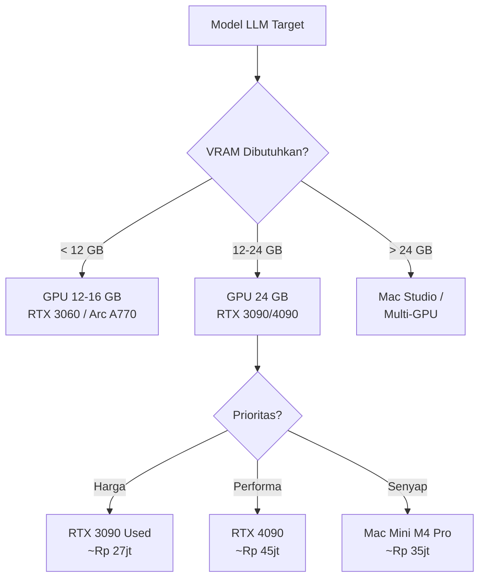

# [Jilid 2] Bab 6.2: Hardware Home — Single RTX 3090/4090 atau Mac Studio sebagai Server Rumah
> **Tipe Konten:** Teknis — Spesifikasi Hardware + Benchmark + Panduan Beli
> **Target Pembaca:** Pemilik rumah yang ingin membangun server LLM dengan budget Rp 25-45jt

---

## 1. TUJUAN SUB-BAB
Pembaca mampu:
- Memilih GPU/Mac yang tepat berdasarkan model LLM target dan jumlah pengguna
- Memahami trade-off VRAM vs kecepatan vs konsumsi daya untuk penggunaan rumahan 24/7
- Merakit atau membeli sistem siap pakai dengan estimasi biaya akurat dalam IDR

---

## 2. KERANGKA KONTEN

### A. Kebutuhan VRAM untuk Model LLM (1-2 paragraf)
- Rumus: VRAM = (param × bits/weight) / 8 + KV-cache overhead
- Contoh: Llama-3.1-8B Q4_K_M = ~4.5 GB model + ~2 GB KV-cache = ~6.5 GB
- Model 7-8B nyaman di 12-16 GB, model 13-14B butuh 24 GB, model 30-33B butuh 32-48 GB

### B. RTX 3090 vs RTX 4090 untuk Server Rumah (2 paragraf)
- RTX 3090 used: 24 GB VRAM, ~250W, harga used ~Rp 10-14jt — value terbaik
- RTX 4090: 24 GB VRAM, ~350W (undervolt 300W), ~146 tok/s (7B Q4) — performa tertinggi
- TDP dan noise penting untuk ruang keluarga: RTX 4090 butuh case besar dengan airflow baik
- Keduanya mampu menjalankan Llama-3.1-8B, Qwen-2.5-14B, hingga Llama-3.1-70B Q3_K_M

### C. Mac Studio / Mac Mini untuk Alternatif (1-2 paragraf)
- Mac Studio M2 Ultra: 192 GB unified memory — bisa jalankan 70B FP16 tanpa kuantisasi
- Mac Mini M4 Pro 48 GB: cukup untuk 8-14B Q4_K_M, idle 7W, sangat senyap
- Kelebihan: unified memory = tidak ada transfer CPU-GPU, noise 0 dB
- Kekurangan: harga premium, ekosistem terbatas (Ollama/llama.cpp hanya)

### D. Komponen Pendukung (tabel + narasi)
- Motherboard + CPU: minimal PCIe 4.0 x16, CPU dengan 8+ core (Ryzen 7 / Core i7)
- RAM sistem: 32-64 GB DDR5 untuk KV-cache dan OS
- Storage: NVMe 1-2 TB untuk model + 2-4 TB SATA untuk RAG data
- Power Supply: 850W Gold+ untuk RTX 4090, 750W untuk RTX 3090
- Case: Mid-tower dengan airflow baik dan dukungan GPU panjang (>320mm)

### E. Optimasi Daya untuk 24/7 (1 paragraf)
- Undervolt GPU: RTX 4090 bisa turun ke 300W dengan performa 95%
- Auto shutdown GPU malam hari via cron (00:00-06:00): hemat ~2-3 kWh/hari
- Fan curve senyap: atur fan GPU ke 30-40% di bawah 60°C

### F. Perbandingan Biaya Total (1 paragraf + tabel IDR)
- Build RTX 4090 baru: ~Rp 40-45jt
- Build RTX 3090 used: ~Rp 25-30jt
- Mac Studio M2 Ultra: ~Rp 55-70jt
- Mac Mini M4 Pro 48GB: ~Rp 30-35jt

---

## 3. TABEL WAJIB

### Tabel A: Perbandingan GPU/Mac untuk Home LLM Server

| Spesifikasi | RTX 3090 (Used) | RTX 4090 | Mac Mini M4 Pro | Mac Studio M2 Ultra |
|:---|:---:|:---:|:---:|:---:|
| **VRAM / Unified Memory** | 24 GB GDDR6X | 24 GB GDDR6X | 48 GB | 192 GB |
| **Bandwidth** | 936 GB/s | 1,008 GB/s | ~400 GB/s | ~800 GB/s |
| **Tok/s (7B Q4)** | ~110 | ~146 | ~60 | ~90 |
| **Tok/s (14B Q4)** | ~55 | ~73 | ~30 | ~50 |
| **TDP Idle / Load** | 30W / 350W | 35W / 450W | 7W / 65W | 15W / 120W |
| **Noise** | 2 fan (30 dB) | 3 fan (35 dB) | Fanless (0 dB) | Fanless (0 dB) |
| **Harga Baru** | ~Rp 14jt (used) | ~Rp 28-30jt | ~Rp 30-35jt | ~Rp 60-70jt |
| **Total Build** | ~Rp 25-30jt | ~Rp 40-45jt | ~Rp 32-37jt | ~Rp 62-72jt |

### Tabel B: Kesesuaian Model per Hardware

| Model | Ukuran (Q4) | RTX 3090/4090 | Mac Mini M4 Pro | Mac Studio M2 Ultra |
|:---|:---:|:---:|:---:|:---:|
| Llama-3.2-3B | ~2 GB | Sangat Cepat | Cepat | Sangat Cepat |
| Llama-3.1-8B | ~5 GB | Sangat Cepat | Cepat | Sangat Cepat |
| Qwen-2.5-14B | ~8 GB | Cepat | Mampu | Cepat |
| Llama-3.1-70B Q3 | ~27 GB | Mampu (CPU offload) | Tidak muat | Cepat |
| DeepSeek-R1-32B | ~18 GB | Cepat | Tidak muat | Sangat Cepat |

### Tabel C: Estimasi Biaya Build dalam IDR (Juni 2026)

| Komponen | Build RTX 3090 (Hemat) | Build RTX 4090 (Performa) | Mac Mini M4 Pro |
|:---|:---:|:---:|:---:|
| **GPU / Unit** | RTX 3090 used ~14jt | RTX 4090 ~29jt | Built-in |
| **CPU** | Ryzen 7 5700X ~2.5jt | Ryzen 7 7800X3D ~5jt | M4 Pro |
| **Motherboard** | B550 ~1.5jt | X670E ~3.5jt | Built-in |
| **RAM** | 32 GB DDR4 ~1jt | 64 GB DDR5 ~3jt | 48 GB Unified |
| **Storage** | 1 TB NVMe ~1.2jt + 2 TB HDD ~1jt | 2 TB NVMe ~2jt + 4 TB SSD ~3jt | 2 TB SSD ~3jt |
| **PSU** | 750W Gold ~1.2jt | 1000W Gold ~2jt | Built-in |
| **Case + Cooling** | Mid-tower ~800rb | Mid-tower + AIO ~2jt | Built-in |
| **Total** | **~Rp 27.2jt** | **~Rp 48.5jt** | **~Rp 35jt** |

> Catatan: Harga bersifat estimasi pasar Indonesia Juni 2026. Build RTX 4090 dapat dihemat dengan GPU retail non-OC.

---

## 4. DIAGRAM/GAMBAR WAJIB

### Diagram 1: Pipeline Pemilihan Hardware (Mermaid)
- **File:** `assets/diagrams/j2-b6-s2-hardware-selection.mmd`



### Gambar 2: Perbandingan Tokens/detik per GPU
- **File:** `assets/images/jilid2/j2-b6-s2-gpu-benchmark.png`
- **Isi:** Bar chart perbandingan tok/s RTX 3090 vs 4090 vs M4 Pro vs M2 Ultra untuk model 7B, 14B, 30B di Q4_K_M

### Gambar 3: Foto Fisik Build Server Rumahan
- **File:** `assets/images/jilid2/j2-b6-s2-home-server-build.jpg`
- **Isi:** Contoh build PC mid-tower dengan RTX 4090 di ruang keluarga, pengukuran noise

---

## 5. TUTORIAL / HANDS-ON

### Tutorial A: Undervolt RTX 4090 untuk Pemakaian 24/7

```bash
# 1. Install nvidia-smi dan tools
sudo apt install nvidia-smi nvidia-settings

# 2. Cek suhu dan power baseline
nvidia-smi -q -d POWER,TEMPERATURE

# 3. Set power limit ke 300W (turun dari 450W)
sudo nvidia-smi -pl 300

# 4. Buat systemd service agar otomatis saat boot
cat << 'EOF' | sudo tee /etc/systemd/system/gpu-powerlimit.service
[Unit]
Description=Set GPU Power Limit
After=nvidia-persistenced.service

[Service]
Type=oneshot
ExecStart=/usr/bin/nvidia-smi -pl 300
RemainAfterExit=yes

[Install]
WantedBy=multi-user.target
EOF

sudo systemctl enable gpu-powerlimit.service
sudo systemctl start gpu-powerlimit.service

# 5. Verifikasi: nvidia-smi harus menunjukkan Power Limit 300W
nvidia-smi -q -d POWER | grep "Power Limit"
```

### Tutorial B: Benchmark Model di Hardware Baru

```bash
#!/bin/bash
# benchmark.sh — uji tok/s untuk berbagai model

MODELS=(
  "llama3.2:3b"
  "llama3.1:8b"
  "qwen2.5:14b"
)

for model in "${MODELS[@]}"; do
  echo "=== Benchmark: $model ==="
  ollama pull "$model" 2>/dev/null

  # Ukur prompt processing + token generation speed
  start=$(date +%s%N)
  output=$(ollama run "$model" --nowordwrap \
    "Hitung 25 * 37 dan jelaskan langkahnya dalam 3 kalimat." 2>/dev/null)
  end=$(date +%s%N)

  elapsed_ms=$(( (end - start) / 1000000 ))
  char_count=${#output}
  approx_tokens=$(( char_count / 4 ))
  tok_per_sec=$(( approx_tokens * 1000 / elapsed_ms ))

  echo "Waktu: ${elapsed_ms}ms | Output: ${char_count} chars | ~${tok_per_sec} tok/s"
  echo ""
done
```

### Tutorial C: Cron Job Auto Shutdown GPU Malam Hari

```bash
# /etc/cron.d/gpu-schedule
# Matikan GPU pukul 23:00, hidupkan pukul 06:00
0 23 * * * root /usr/local/bin/gpu-off.sh
0 6  * * * root /usr/local/bin/gpu-on.sh

# gpu-off.sh — unbind GPU driver untuk hemat daya
echo "0000:01:00.0" > /sys/bus/pci/drivers/nvidia/unbind
nvidia-smi -pm 0

# gpu-on.sh — bind kembali GPU
echo "0000:01:00.0" > /sys/bus/pci/drivers/nvidia/bind
nvidia-smi -pm 1
nvidia-smi -pl 300
```

---

## 6. STUDI KASUS

### Studi Kasus: Pak Rudi (6 Anggota Keluarga, Budget Rp 30jt)
- **Profil:** Ayah (kerja kantoran), Ibu (guru), 4 anak (SD-SMA). Butuh LLM untuk PR, resep, dan smart home.
- **Hardware:** PC Rakitan RTX 3090 used (Rp 14jt) + Ryzen 7 5700X + 32 GB DDR4 + 1 TB NVMe + 2 TB HDD
- **Total: ~Rp 27jt** (sisa untuk microphone array dan smart plug)
- **Model:** Llama-3.1-8B Q4_K_M (daily chat, PR) + Qwen-2.5-7B (coding/resep)
- **Setup:** Ollama + Open WebUI + Home Assistant. GPU auto-shutdown 23:00-06:00.
- **Hasil:** 4 anak bisa tanya PR bersamaan saat jam makan malam. Latensi rata-rata 2-3 detik. Listrik tambahan ~Rp 150rb/bulan.
- **Penghematan:** Dibanding ChatGPT Team ($25/orang/bulan × 6 = $150/bulan), balik modal dalam 18 bulan.

---

## 7. REFERENSI WAJIB

### Paper Jurnal/Konferensi

[1] **Edge LLM Review — Komprehensif**
```
@article{qu2024edgellm,
  title   = {A Review on Edge Large Language Models: Design, Execution, and Applications},
  author  = {Qu, Zaichen and others},
  journal = {arXiv preprint arXiv:2410.11845},
  year    = {2024},
  doi     = {10.48550/arXiv.2410.11845},
  url     = {https://arxiv.org/abs/2410.11845}
}
```
- Kaitan: Survey komprehensif siklus hidup LLM di edge — dari model design hingga runtime inference. Data token/s dan memory footprint di Tabel A harus diverifikasi terhadap benchmark di paper ini.

[2] **Small Language Models Survey**
```
@article{lu2024slmsurvey,
  title   = {Small Language Models: Survey, Measurements, and Insights},
  author  = {Lu, Zhenyan and Li, Xiang and Cai, Dongqi and Yi, Rongjie and Liu, Fangming and Lan, Wei and Luan, Jian and Zhang, Xiwen and Lane, Nicholas D. and Xu, Mengwei},
  journal = {arXiv preprint arXiv:2409.15790},
  year    = {2024},
  doi     = {10.48550/arXiv.2409.15790},
  url     = {https://arxiv.org/abs/2409.15790}
}
```
- Kaitan: Benchmark 70+ SLM di edge devices. Data tok/s per GPU (Tabel A) dan kebutuhan VRAM (Tabel B) harus merujuk pada angka di survey ini.

[3] **Hardware Benchmark RTX 4090 untuk LLM Inference**
```
@article{hardwarecorner2025rtx4090,
  title   = {{RTX} 4090 Local {LLM} Benchmarks, Context Scaling and Supported Models},
  author  = {Levi, Chavy},
  journal = {Hardware Corner},
  year    = {2025},
  url     = {https://www.hardware-corner.net/rtx-4090-llm-benchmarks/}
}
```
- Kaitan: Benchmark tok/s RTX 4090 untuk Qwen3, llama.cpp dengan berbagai context length. Data Tabel A (tok/s 7B, 14B) diverifikasi dari benchmark ini.

[4] **On-Device LLM untuk Home Assistant**
```
@article{lang2025ondevice,
  title   = {On-Device {LLMs} for Home Assistant: Dual Role in Intent Detection and Response Generation},
  author  = {Lang, Martin and others},
  journal = {arXiv preprint arXiv:2502.12923},
  year    = {2025},
  doi     = {10.48550/arXiv.2502.12923},
  url     = {https://arxiv.org/abs/2502.12923}
}
```
- Kaitan: Studi kelayakan LLM 8-bit di perangkat 8 GB RAM. Data SLA latency dan concurrency menjadi acuan pemilihan hardware di sub-bab ini.

[5] **Privacy-Preserving LLM Inference Survey**
```
@misc{cryptoeprint2026privacy,
  author    = {Andreoletti, Davide and Rudi, Alessandro and Carpanzano, Emanuele and Lelli, Francesco and Leidi, Tiziano},
  title     = {Privacy-Preserving {LLM} Inference in Practice: A Comparative Survey of Techniques, Trade-Offs, and Deployability},
  howpublished = {Cryptology ePrint Archive, Paper 2026/105},
  year      = {2026},
  url       = {https://eprint.iacr.org/2026/105}
}
```
- Kaitan: Justifikasi mengapa local inference (di hardware sendiri) lebih aman daripada cloud API. Relevan untuk argumen "privacy-first" di pilar desain.

### Referensi Pendukung

[6] Ollama. *GitHub Repository*. [https://github.com/ollama/ollama](https://github.com/ollama/ollama)

[7] NVIDIA. *nvidia-smi Documentation*. [https://developer.nvidia.com/nvidia-system-management-interface](https://developer.nvidia.com/nvidia-system-management-interface)

[8] llama.cpp. *GitHub Repository*. [https://github.com/ggerganov/llama.cpp](https://github.com/ggerganov/llama.cpp)

[9] PC Part Picker Indonesia. [https://pcpartpicker.com](https://pcpartpicker.com)

[10] Argmax Inc. *WhisperKit: On-Device Real-Time ASR*. [https://github.com/argmaxinc/WhisperKit](https://github.com/argmaxinc/WhisperKit)
