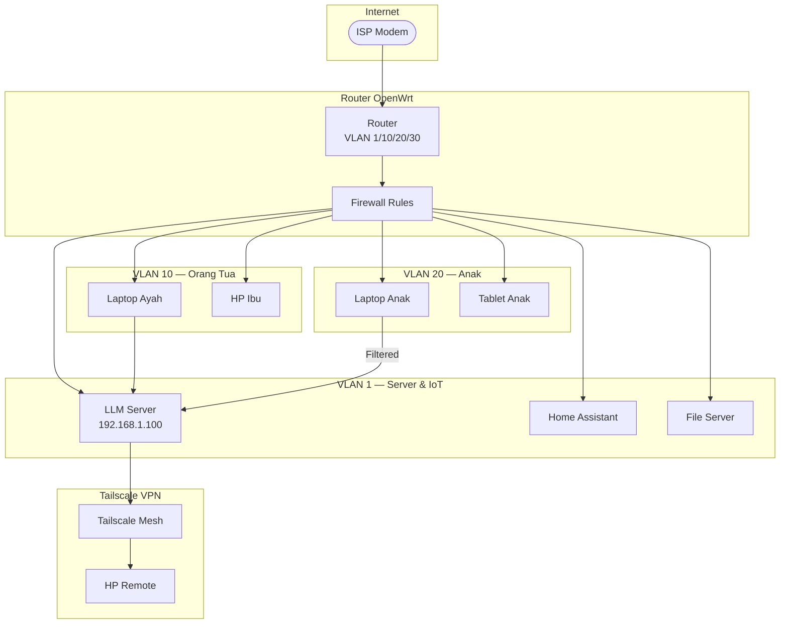

# [Jilid 2] Bab 6.3: Networking — Akses via Home Wi-Fi Tanpa Expose Port ke Internet
> **Tipe Konten:** Teknis — Jaringan + Keamanan + Konfigurasi
> **Target Pembaca:** Pemilik rumah yang ingin mengamankan akses LLM lokal dari berbagai perangkat

---

## 1. TUJUAN SUB-BAB
Pembaca mampu:
- Mengkonfigurasi jaringan rumah agar semua perangkat dapat mengakses LLM server secara lokal
- Mengimplementasi akses remote aman via Tailscale/WireGuard tanpa port forwarding
- Memisahkan lalu lintas keluarga dewasa dan anak via VLAN

---

## 2. KERANGKA KONTEN

### A. Topologi Jaringan Home AI (1-2 paragraf)
- LLM server sebagai node di LAN (192.168.x.x), bukan di DMZ atau cloud
- Akses via mDNS (hostname.local) atau static DHCP reservation
- Semua perangkat (TV, tablet, laptop, smart speaker) berkomunikasi dalam subnet yang sama

### B. DNS Lokal dan mDNS (1 paragraf)
- Gunakan mDNS/Avahi agar cukup akses `http://llm-server.local:11434`
- Konfigurasi static DHCP di router agar IP server tetap
- Alternatif: Pi-hole sebagai local DNS server dengan custom record

### C. Zero-Trust Remote Access via Tailscale (2 paragraf)
- Tailscale sebagai mesh VPN berbasis WireGuard — tanpa port forwarding
- Instalasi di server dan device klien (phone, laptop di luar rumah)
- ACL untuk membatasi akses per pengguna (parental control via network)
- Keunggulan: end-to-end encryption, tidak perlu DDNS atau static IP

### D. Segmentasi VLAN untuk Parental Control (1-2 paragraf)
- VLAN 10: Orang tua (full access ke LLM server, internet tanpa filter)
- VLAN 20: Anak (akses terbatas, filtered DNS, tidak bisa SSH ke server)
- Firewall rule: allow akses VLAN 20 ke server LLM hanya via port tertentu
- Implementasi di router OpenWrt / pfSense / MikroTik

### E. QoS dan Bandwidth Management (1 paragraf)
- LLM inference tidak boros bandwidth (request <10 KB, response <50 KB)
- Prioritaskan traffic ke port 11434 (Ollama) via QoS rules
- Pastikan latency voice (Whisper) < 200 ms di jaringan Wi-Fi 5 GHz

### F. Keamanan Dasar (1 paragraf)
- Jangan expose port Ollama/vLLM ke WAN
- Gunakan API key untuk akses ke Open WebUI
- HTTPS via mkcert/local CA untuk enkripsi traffic dalam LAN
- Logging akses via nginx reverse proxy

---

## 3. TABEL WAJIB

### Tabel A: Skema Subnet dan VLAN untuk Keluarga

| VLAN | Nama | IP Range | Pengguna | Akses LLM | Internet Filter | Catatan |
|:---|:---|:---|:---|:---|:---|:---|
| **1** | Native LAN | 192.168.1.0/24 | Semua perangkat IoT | Langsung | Tidak | Smart TV, speaker |
| **10** | Orang Tua | 192.168.10.0/24 | Ayah + Ibu | Full | Tidak | Laptop, HP kerja |
| **20** | Anak | 192.168.20.0/24 | 3 Anak | Terbatas | Ya (AdGuard) | Hanya via Open WebUI |
| **30** | Guest | 192.168.30.0/24 | Tamu | Tidak | Ya | Isolasi total |

### Tabel B: Metode Akses ke LLM Server

| Metode | Kecepatan | Keamanan | Setup | Ideal Untuk |
|:---|:---:|:---:|:---:|:---|
| **LAN langsung (HTTP)** | Sangat Cepat | Rendah | Mudah | Perangkat di rumah |
| **mDNS (hostname.local)** | Cepat | Rendah | Mudah | Akses lokal tanpa IP |
| **Tailscale (mesh VPN)** | Sedang | Sangat Tinggi | Sedang | Akses remote aman |
| **WireGuard (site-to-site)** | Tinggi | Tinggi | Sulit | Power user |
| **Cloudflare Tunnel** | Lambat | Tinggi | Sedang | Tidak direkomendasikan |

### Tabel C: Estimasi Biaya Komponen Jaringan

| Komponen | Fungsi | Harga (IDR) |
|:---|:---|:---:|
| Router OpenWrt (MikroTik hAP ax2) | VLAN, QoS, firewall | ~Rp 1.2jt |
| Access Point Wi-Fi 6 (TP-Link EAP610) | Cakupan 4-8 user | ~Rp 800rb |
| Switch managed 8-port (TP-Link TL-SG105E) | VLAN tagging | ~Rp 400rb |
| Pi-hole / Raspberry Pi 4 | DNS filtering + AdGuard | ~Rp 700rb |
| Kabel UTP Cat6 10m | Koneksi server ke switch | ~Rp 100rb |

---

## 4. DIAGRAM/GAMBAR WAJIB

### Diagram 1: Topologi Jaringan Home AI (Mermaid)
- **File:** `assets/diagrams/j2-b6-s3-network-topology.mmd`



### Gambar 2: Screenshot Konfigurasi Tailscale ACL
- **File:** `assets/images/jilid2/j2-b6-s3-tailscale-acl.png`
- **Isi:** Contoh file `tailscale-acl.yaml` yang membatasi akses anak ke server LLM

### Gambar 3: Diagram VLAN Tagging
- **File:** `assets/images/jilid2/j2-b6-s3-vlan-tagging.png`
- **Isi:** Ilustrasi alur VLAN tagged dari switch ke router, tagging per port

---

## 5. TUTORIAL / HANDS-ON

### Tutorial A: Setup Tailscale untuk Akses Remote Aman

```bash
# 1. Install Tailscale di server LLM
curl -fsSL https://tailscale.com/install.sh | sh
sudo tailscale up --accept-routes --advertise-routes=192.168.1.0/24

# 2. Install di device klien (phone/laptop)
# Download dari https://tailscale.com/download

# 3. Konfigurasi ACL (tailscale-acl.yaml)
# Di admin console Tailscale, buat ACL:
# {
#   "acls": [
#     {"action": "accept", "src": ["tag:parents"], "dst": ["*:*"]},
#     {"action": "accept", "src": ["tag:kids"], "dst": ["llm-server:11434"]}
#   ],
#   "tagOwners": {
#     "tag:parents": ["email@example.com"],
#     "tag:kids":    ["email@example.com"]
#   }
# }

# 4. Verifikasi koneksi
tailscale status
ping 192.168.1.100  # Harus reachable dari remote
curl http://192.168.1.100:11434/api/tags
```

### Tutorial B: Konfigurasi VLAN di OpenWrt

```bash
# 1. Buat interface VLAN
# Di LuCI → Network → Interfaces, tambah:
# VLAN 10 (Orang Tua): eth0.10 — 192.168.10.1/24
# VLAN 20 (Anak): eth0.20 — 192.168.20.1/24

uci set network.vlan10=interface
uci set network.vlan10.ifname="eth0.10"
uci set network.vlan10.proto="static"
uci set network.vlan10.ipaddr="192.168.10.1"
uci set network.vlan10.netmask="255.255.255.0"

uci set network.vlan20=interface
uci set network.vlan20.ifname="eth0.20"
uci set network.vlan20.proto="static"
uci set network.vlan20.ipaddr="192.168.20.1"
uci set network.vlan20.netmask="255.255.255.0"

uci commit network
/etc/init.d/network restart

# 2. Firewall rule: VLAN 20 hanya bisa akses port 11434 ke server
uci add firewall rule
uci set firewall.@rule[-1].name="Allow-Kids-to-LLM"
uci set firewall.@rule[-1].src="vlan20"
uci set firewall.@rule[-1].dest="lan"
uci set firewall.@rule[-1].dest_ip="192.168.1.100"
uci set firewall.@rule[-1].dest_port="11434"
uci set firewall.@rule[-1].target="ACCEPT"
uci commit firewall
/etc/init.d/firewall restart
```

### Tutorial C: Setup HTTPS Lokal dengan mkcert

```bash
# 1. Install mkcert
brew install mkcert  # macOS
sudo apt install mkcert  # Linux

# 2. Buat local CA dan trust
mkcert -install

# 3. Generate sertifikat untuk LLM server
mkcert llm-server.local 192.168.1.100

# 4. Config nginx reverse proxy dengan HTTPS
cat << 'EOF' | sudo tee /etc/nginx/sites-available/llm-proxy
server {
    listen 443 ssl;
    server_name llm-server.local;
    ssl_certificate /etc/ssl/certs/llm-server.local.pem;
    ssl_certificate_key /etc/ssl/private/llm-server.local-key.pem;

    location / {
        proxy_pass http://localhost:11434;
        proxy_set_header Host $host;
    }
}
EOF
```

---

## 6. STUDI KASUS

### Studi Kasus: Keluarga Wijaya (5 Anggota, Jaringan 2 Lantai)
- **Profil:** Rumah 2 lantai, 5 anggota keluarga. Server LLM di ruang kerja lantai 1.
- **Jaringan:** ISP 100 Mbps, Router MikroTik hAP ax2 + 2 AP TP-Link EAP610 (1 per lantai)
- **Segmentasi:**
  - VLAN 10 (Orang Tua): Ayah (kerja IT), Ibu (dokter) — full akses
  - VLAN 20 (Anak): 3 anak (SD-SMP) — akses LLM via Open WebUI, filtered DNS
  - VLAN 30 (IoT): Smart TV, kamera, smart plug — isolated dari device pribadi
- **Remote Access:** Tailscale di HP Ayah untuk akses saat di luar kota
- **Biaya Jaringan:** Router ~Rp 1.2jt + 2 AP ~Rp 1.6jt + switch managed ~Rp 400rb = total ~Rp 3.2jt
- **Hasil:** Anak hanya bisa akses LLM via Open WebUI (tidak langsung ke API). DNS filtering via AdGuard blokir situs dewasa. Orang tua bisa akses dari kantor via Tailscale.

---

## 7. REFERENSI WAJIB

### Paper Jurnal/Konferensi

[1] **Harmony — Privacy-Preserving Smart Home**
```
@article{chen2024harmony,
  title   = {Harmony: A Privacy-Preserving and Robust Smart Home Assistant Powered by Locally Deployable {Llama3-8B}},
  author  = {Chen, Yijie and others},
  journal = {arXiv preprint arXiv:2410.14252},
  year    = {2024},
  doi     = {10.48550/arXiv.2410.14252},
  url     = {https://arxiv.org/abs/2410.14252}
}
```
- Kaitan: Arsitektur modular agent untuk smart home dengan local-first networking. Prinsip "no cloud dependency" menjadi justifikasi topologi LAN-only di sub-bab ini.

[2] **HomeLLaMA — On-Device Smart Home Assistant**
```
@article{huang2025homellama,
  title   = {Towards Privacy-Preserving and Personalized Smart Homes via Tailored Small Language Models},
  author  = {Huang, Xinyu and Shen, Leming and Ma, Zijing and Zheng, Yuanqing},
  journal = {IEEE Transactions on Mobile Computing},
  year    = {2025},
  doi     = {10.48550/arXiv.2507.08878},
  url     = {https://arxiv.org/abs/2507.08878}
}
```
- Kaitan: Sistem privasi-preserving yang memastikan data tidak meninggalkan jaringan rumah. Relevan untuk argumen "jangan expose port ke internet".

[3] **Privacy-Preserving LLM Inference Survey**
```
@misc{cryptoeprint2026privacy,
  author    = {Andreoletti, Davide and Rudi, Alessandro and Carpanzano, Emanuele and Lelli, Francesco and Leidi, Tiziano},
  title     = {Privacy-Preserving {LLM} Inference in Practice: A Comparative Survey of Techniques, Trade-Offs, and Deployability},
  howpublished = {Cryptology ePrint Archive, Paper 2026/105},
  year      = {2026},
  url       = {https://eprint.iacr.org/2026/105}
}
```
- Kaitan: Analisis TI (Trusted Infrastructure) vs PETs untuk LLM. Menjelaskan mengapa LAN-only + Tailscale sudah cukup untuk threat model rumah tangga.

[4] **Edge LLM Review**
```
@article{qu2024edgellm,
  title   = {A Review on Edge Large Language Models: Design, Execution, and Applications},
  author  = {Qu, Zaichen and others},
  journal = {arXiv preprint arXiv:2410.11845},
  year    = {2024},
  doi     = {10.48550/arXiv.2410.11845},
  url     = {https://arxiv.org/abs/2410.11845}
}
```
- Kaitan: Referensi tentang network architecture untuk edge deployment. Data latency (Tabel C sub-bab 6.1) menjadi acuan QoS.

[5] **Demystifying SLM for Edge Deployment**
```
@inproceedings{lu2025demystifying,
  title     = {Demystifying Small Language Models for Edge Deployment},
  author    = {Lu, Zhenyan and Li, Xiang and Cai, Dongqi and Yi, Rongjie and Liu, Fangming and Liu, Wei and Luan, Jian and Zhang, Xiwen and Lane, Nicholas D. and Xu, Mengwei},
  booktitle = {Proceedings of the 63rd Annual Meeting of the ACL},
  year      = {2025},
  doi       = {10.18653/v1/2025.acl-long.718},
  url       = {https://aclanthology.org/2025.acl-long.718/}
}
```
- Kaitan: Analisis network constraints dan bandwidth untuk edge LLM — membuktikan bahwa Wi-Fi rumah (100-300 Mbps) lebih dari cukup.

### Referensi Pendukung

[6] Tailscale. *Zero-config VPN*. [https://tailscale.com](https://tailscale.com)

[7] OpenWrt. *VLAN Documentation*. [https://openwrt.org/docs/guide-user/network/vlan](https://openwrt.org/docs/guide-user/network/vlan)

[8] WireGuard. *Official Documentation*. [https://www.wireguard.com](https://www.wireguard.com)

[9] Pi-hole. *Network-wide Ad Blocking*. [https://pi-hole.net](https://pi-hole.net)

[10] mkcert. *Local HTTPS*. [https://github.com/FiloSottile/mkcert](https://github.com/FiloSottile/mkcert)
