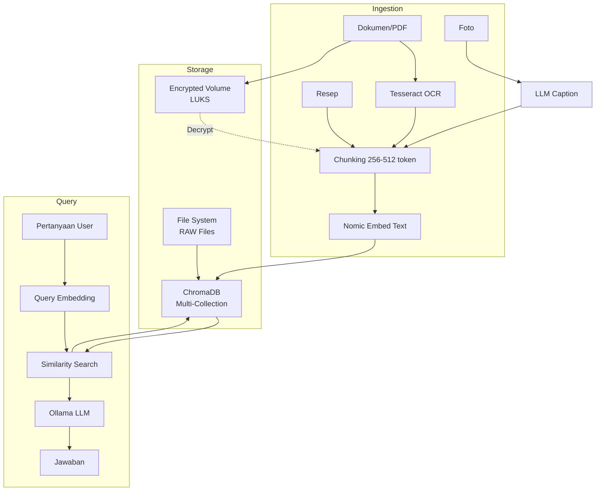

# [Jilid 2] Bab 6.5: Shared Knowledge Base — RAG Data Keluarga (Foto, Dokumen Pajak, Resep)
> **Tipe Konten:** Praktikal — Implementasi RAG + Pipeline Data + Keamanan
> **Target Pembaca:** Keluarga yang ingin menjadikan LLM sebagai "memori kolektif" rumah tangga

---

## 1. TUJUAN SUB-BAB
Pembaca mampu:
- Membangun RAG pipeline lokal untuk data keluarga (dokumen, foto, resep, catatan)
- Mengelola multi-user RAG dengan isolasi data per anggota keluarga
- Mengimplementasikan enkripsi untuk dokumen sensitif (pajak, medis)

---

## 2. KERANGKA KONTEN

### A. Konsep RAG untuk Data Keluarga (1 paragraf)
- RAG = Retrieval-Augmented Generation: LLM menjawab berdasarkan data yang di-retrieve dari database vektor
- Beda dengan cloud: data tidak pernah meninggalkan rumah, privasi 100%
- Use case: "Cari resep soto ayam buatan Ibu bulan lalu", "Berapa total pajak tahun 2025?"

### B. Arsitektur Pipeline RAG Lokal (1-2 paragraf)
- Ingestion: OCR (dokumen scan) → chunking → embedding → ChromaDB
- Query: pertanyaan user → embedding → similarity search → LLM + context
- Tools: ChromaDB (vector store), Nomic Embed Text (embedding), Ollama (LLM)
- Ukuran dataset keluarga: ~100-500 GB (foto + dokumen + resep)

### C. Multi-User RAG dengan Isolasi Data (1-2 paragraf)
- Setiap anggota punya folder `/rag/{user}/` dengan collection terpisah di ChromaDB
- Metadata filtering: filter berdasarkan user_id saat retrieval
- Akses data bersama (resep keluarga) vs data pribadi (catatan medis, pajak)
- Implementasi: header `X-User-ID` di Open WebUI → filter collection

### D. OCR dan Chunking untuk Dokumen Indonesia (1 paragraf)
- Dokumen Bahasa Indonesia: gunakan Tesseract OCR + Indonesian language pack
- Chunking strategy: 512 token dengan overlap 128 untuk dokumen formal
- Resep dan catatan informal: 256 token chunk (lebih pendek, lebih presisi)

### E. Enkripsi Dokumen Sensitif (1 paragraf)
- Dokumen pajak, KTP, akta: simpan dalam encrypted volume (LUKS/Veracrypt)
- Decrypt hanya saat RAG query diproses, jangan simpan plaintext di ChromaDB
- Atau: hash nama file + encrypt content, decrypt di memory saat retrieval

### F. Pipeline Foto dan Multimedia (1 paragraf)
- Foto: ekstrak metadata EXIF (tanggal, lokasi) + caption otomatis via LLM vision
- Simpan embedding teks dari caption EXIF (bukan embedding gambar langsung)
- Query: "Cari foto liburan di Bali tahun 2024" → retrieve via timestamp + caption

---

## 3. TABEL WAJIB

### Tabel A: Perbandingan Vector Database Lokal

| Fitur | ChromaDB | Qdrant | Weaviate | Milvus |
|:---|:---|:---|:---|:---|
| **Setup** | Sangat Mudah | Mudah | Sedang | Sulit |
| **Multi-Collection** | Ya | Ya | Ya | Ya |
| **Metadata Filter** | Ya | Ya | Ya | Ya |
| **Encryption at Rest** | Tidak | Tidak | Tidak | Tidak |
| **RAM (10K docs)** | ~500 MB | ~1 GB | ~2 GB | ~2 GB |
| **Rekomendasi** | Terbaik untuk pemula | Performa tinggi | Fitur lengkap | Skala besar |

### Tabel B: Ukuran Dataset Keluarga dan Embedding Cost

| Tipe Data | Volume | Chunk Size | Jumlah Chunk | Storage Vector | Embedding Time (CPU) |
|:---|:---:|:---:|:---:|:---:|:---:|
| Resep (500 dok) | ~50 MB | 256 token | ~2,000 | ~10 MB | 2 menit |
| Dokumen Pajak (50 PDF) | ~200 MB | 512 token | ~4,000 | ~20 MB | 5 menit |
| Catatan Sekolah (200 doc) | ~100 MB | 256 token | ~4,000 | ~20 MB | 4 menit |
| Foto + Caption (10,000) | ~50 GB (foto) | Caption 128 token | ~10,000 | ~50 MB | 15 menit |
| Total | ~50.3 GB | - | ~20,000 | ~100 MB | ~25 menit |

### Tabel C: Struktur Direktori RAG Keluarga

```
/rag/
├── shared/           # Data bersama — resep, panduan, info rumah
│   ├── recipes/      # Resep keluarga (markdown)
│   ├── home-manual/  # Manual peralatan rumah
│   └── school/       # Buku pelajaran kurikulum merdeka
├── ayah/
│   ├── work/         # Dokumentasi proyek, coding notes
│   └── finance/      # Pajak, investasi (ENCRYPTED)
├── ibu/
│   ├── medical/      # Catatan medis, jurnal (ENCRYPTED)
│   └── recipes-pribadi/
└── anak/
    ├── pr/           # Tugas sekolah, PR
    └── diary/        # Catatan pribadi anak
```

---

## 4. DIAGRAM/GAMBAR WAJIB

### Diagram 1: Pipeline RAG Keluarga (Mermaid)
- **File:** `assets/diagrams/j2-b6-s5-rag-pipeline.mmd`



### Gambar 2: Screenshot Open WebUI Multi-User RAG
- **File:** `assets/images/jilid2/j2-b6-s5-openwebui-multi-rag.png`
- **Isi:** Tampilan Open WebUI dengan pilihan user profile dan indikator collection aktif

### Gambar 3: Diagram Alur Enkripsi/Dekripsi
- **File:** `assets/images/jilid2/j2-b6-s5-encryption-flow.png`
- **Isi:** Flowchart: Dokumen Pajak → LUKS Encrypt → Mount saat query → Decrypt in memory → Chunk → Embed → Unmount

---

## 5. TUTORIAL / HANDS-ON

### Tutorial A: Setup ChromaDB Multi-User RAG

```python
# rag_family.py — pipeline RAG multi-user untuk keluarga
import chromadb
from chromadb.config import Settings
import hashlib

class FamilyRAG:
    def __init__(self, persist_dir="./chroma_data"):
        self.client = chromadb.PersistentClient(
            path=persist_dir,
            settings=Settings(anonymized_telemetry=False)
        )

    def get_collection(self, user_id, collection_type="shared"):
        """Dapatkan collection per user. Otomatis buat jika belum ada."""
        collection_name = f"{user_id}_{collection_type}"
        try:
            return self.client.get_collection(collection_name)
        except:
            return self.client.create_collection(collection_name)

    def add_document(self, user_id, text, metadata, doc_id=None):
        """Add document ke collection user tertentu."""
        collection = self.get_collection(user_id, metadata.get("type", "shared"))
        collection.add(
            documents=[text],
            metadatas=[{**metadata, "user_id": user_id}],
            ids=[doc_id or hashlib.md5(text.encode()).hexdigest()]
        )
        print(f"✅ Added to {user_id}'s collection: {metadata.get('filename', 'unknown')}")

    def query(self, user_id, question, n_results=3):
        """Query hanya di collection user tertentu."""
        collection = self.get_collection(user_id)
        results = collection.query(query_texts=[question], n_results=n_results)

        context = "\n\n".join(results["documents"][0])
        return f"Berdasarkan data {user_id}:\n\n{context}"

# Contoh penggunaan
rag = FamilyRAG()
rag.add_document("ibu", "Resep soto ayam: rebus ayam dengan bumbu...",
                 {"type": "recipes", "filename": "soto-ayam.txt"})
rag.add_document("anak", "Rumus luas lingkaran: π × r²",
                 {"type": "school", "filename": "matematika.txt"})

print(rag.query("ibu", "Bagaimana cara membuat soto?"))
print(rag.query("anak", "Apa rumus luas lingkaran?"))
# User lain tidak bisa mengakses data orang lain
```

### Tutorial B: OCR Dokumen Bahasa Indonesia + Embed

```bash
#!/bin/bash
# ingest_docs.sh — pipeline OCR + chunking + embedding untuk dokumen keluarga

# Prerequisites:
# sudo apt install tesseract-ocr tesseract-ocr-ind
# pip install pytesseract pdf2image chromadb nomic[local]

INPUT_DIR="./documents/"
OUTPUT_DB="./chroma_data"

# 1. OCR semua PDF di folder
for pdf in "$INPUT_DIR"*.pdf; do
    echo "Processing: $pdf"
    python3 -c "
import pytesseract
from pdf2image import convert_from_path

images = convert_from_path('$pdf', dpi=300)
for i, img in enumerate(images):
    text = pytesseract.image_to_string(img, lang='ind')
    with open('/tmp/ocr_output.txt', 'a') as f:
        f.write(f'[Page {i+1}]\n{text}\n')
    "
done

# 2. Chunking dan embedding ke ChromaDB
python3 << 'PYEOF'
import chromadb
from nomic import embed

client = chromadb.PersistentClient(path="$OUTPUT_DB")
collection = client.create_collection("shared_docs", get_or_create=True)

with open("/tmp/ocr_output.txt") as f:
    text = f.read()

# Simple chunking per 512 chars
chunks = [text[i:i+512] for i in range(0, len(text), 384)]

collection.add(
    documents=chunks,
    ids=[f"chunk_{i}" for i in range(len(chunks))]
)
print(f"✅ Ingested {len(chunks)} chunks")
PYEOF
```

### Tutorial C: Enkripsi Dokumen Sensitif dengan LUKS

```bash
# 1. Buat encrypted volume 10 GB untuk data sensitif
dd if=/dev/zero of=/home/rag/encrypted_volume.img bs=1M count=10240
sudo cryptsetup luksFormat /home/rag/encrypted_volume.img
sudo cryptsetup open /home/rag/encrypted_volume.img rag_secret
sudo mkfs.ext4 /dev/mapper/rag_secret
sudo mount /dev/mapper/rag_secret /mnt/rag_secret

# 2. Auto-mount saat server startup (systemd)
cat << 'EOF' | sudo tee /etc/systemd/system/rag-decrypt.service
[Unit]
Description=Decrypt RAG sensitive data
After=network.target

[Service]
Type=oneshot
RemainAfterExit=yes
ExecStart=/bin/bash -c 'echo -n "PASSWORD" | cryptsetup luksOpen /home/rag/encrypted_volume.img rag_secret && mount /dev/mapper/rag_secret /mnt/rag_secret'
ExecStop=/bin/bash -c 'umount /mnt/rag_secret && cryptsetup luksClose rag_secret'
```

---

## 6. STUDI KASUS

### Studi Kasus: Keluarga Gunawan — "Digital Memory" untuk 5 Anggota
- **Data Keluarga:**
  - 500+ resep tradisional (scan buku resep nenek → OCR)
  - 50 dokumen pajak dan keuangan (2019-2025) — encrypted LUKS
  - 10,000 foto keluarga — caption auto-generated via LLaVA
  - 200 catatan sekolah anak (PDF PR, jadwal ujian)
- **Hardware:** PC RTX 3090 + 2 TB NVMe + 4 TB HDD
- **Pipeline:** Tesseract OCR (Indonesia) → Nomic Embed Text → ChromaDB
- **Query contoh:**
  - "Cari resep opor ayam dari nenek" → retrieve dari collection shared
  - "Total biaya SPP anak tahun 2025" → retrieve dari collection ayah (decrypt on the fly)
  - "Foto keluarga saat lebaran 2024" → retrieve via EXIF date + caption
- **Hasil:** Ibu tidak perlu mencari binder resep. Ayah bisa cek pajak kapan saja. Anak bisa tanya PR tanpa WA orang tua. Semua data aman di rumah.

---

## 7. REFERENSI WAJIB

### Paper Jurnal/Konferensi

[1] **RAG Fundamentals and Architecture**
```
@article{lewis2020rag,
  title     = {Retrieval-Augmented Generation for Knowledge-Intensive {NLP} Tasks},
  author    = {Lewis, Patrick and Perez, Ethan and Piktus, Aleksandra and Petroni, Fabio and Karpukhin, Vladimir and Goyal, Naman and K\"{u}ttler, Heinrich and Lewis, Mike and Yih, Wen-tau and Rockt\"{a}schel, Tim and Riedel, Sebastian and Kiela, Douwe},
  booktitle = {Advances in Neural Information Processing Systems (NeurIPS)},
  year      = {2020},
  doi       = {10.48550/arXiv.2005.11401},
  url       = {https://arxiv.org/abs/2005.11401}
}
```
- Kaitan: Paper foundational RAG — arsitektur retriever-generator yang menjadi dasar pipeline sub-bab ini. Meski 2020, masih relevan sebagai fondasi.

[2] **Small Language Models Survey — Data untuk RAG**
```
@article{lu2024slmsurvey,
  title   = {Small Language Models: Survey, Measurements, and Insights},
  author  = {Lu, Zhenyan and Li, Xiang and Cai, Dongqi and Yi, Rongjie and Liu, Fangming and Lan, Wei and Luan, Jian and Zhang, Xiwen and Lane, Nicholas D. and Xu, Mengwei},
  journal = {arXiv preprint arXiv:2409.15790},
  year    = {2024},
  doi     = {10.48550/arXiv.2409.15790},
  url     = {https://arxiv.org/abs/2409.15790}
}
```
- Kaitan: Analisis embedding model untuk edge — data ukuran embedding, kecepatan retrieval, dan memory footprint di Tabel A dan B.

[3] **Demystifying SLM for Edge — RAG Constraints**
```
@inproceedings{lu2025demystifying,
  title     = {Demystifying Small Language Models for Edge Deployment},
  author    = {Lu, Zhenyan and Li, Xiang and Cai, Dongqi and Yi, Rongjie and Liu, Fangming and Liu, Wei and Luan, Jian and Zhang, Xiwen and Lane, Nicholas D. and Xu, Mengwei},
  booktitle = {Proceedings of the 63rd Annual Meeting of the ACL},
  year      = {2025},
  doi       = {10.18653/v1/2025.acl-long.718},
  url       = {https://aclanthology.org/2025.acl-long.718/}
}
```
- Kaitan: Temuan tentang in-context learning limitation SLM — relevan untuk menentukan chunk size dan konteks maksimal di RAG pipeline.

[4] **On-Device LLM untuk Home Assistant — RAG Integration**
```
@article{lang2025ondevice,
  title   = {On-Device {LLMs} for Home Assistant: Dual Role in Intent Detection and Response Generation},
  author  = {Lang, Martin and others},
  journal = {arXiv preprint arXiv:2502.12923},
  year    = {2025},
  doi     = {10.48550/arXiv.2502.12923},
  url     = {https://arxiv.org/abs/2502.12923}
}
```
- Kaitan: Studi kasus RAG terintegrasi dengan Home Assistant — relevan untuk shared knowledge base yang juga terhubung ke smart home data.

[5] **Privacy-Preserving LLM Inference Survey**
```
@misc{cryptoeprint2026privacy,
  author    = {Andreoletti, Davide and Rudi, Alessandro and Carpanzano, Emanuele and Lelli, Francesco and Leidi, Tiziano},
  title     = {Privacy-Preserving {LLM} Inference in Practice: A Comparative Survey of Techniques, Trade-Offs, and Deployability},
  howpublished = {Cryptology ePrint Archive, Paper 2026/105},
  year      = {2026},
  url       = {https://eprint.iacr.org/2026/105}
}
```
- Kaitan: Justifikasi pentingnya enkripsi data keluarga di RAG pipeline. Relevan untuk sub-bab 2.E (enkripsi dokumen sensitif).

### Referensi Pendukung

[6] ChromaDB. *Documentation*. [https://www.trychroma.com](https://www.trychroma.com)

[7] Tesseract OCR. *Indonesian Language Pack*. [https://github.com/tesseract-ocr/tessdata](https://github.com/tesseract-ocr/tessdata)

[8] Nomic AI. *Nomic Embed Text*. [https://www.nomic.ai](https://www.nomic.ai)

[9] LangChain. *RAG Documentation*. [https://python.langchain.com/docs/use_cases/question_answering](https://python.langchain.com/docs/use_cases/question_answering)

[10] LUKS. *Linux Unified Key Setup*. [https://gitlab.com/cryptsetup/cryptsetup](https://gitlab.com/cryptsetup/cryptsetup)
