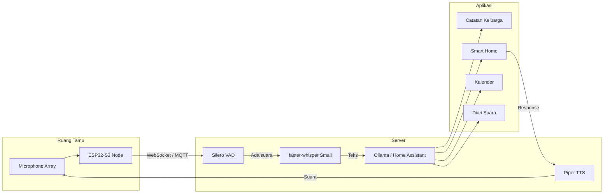

# [Jilid 2] Bab 6.7: Multimedia AI — Whisper Transkrip Suara Ruang Tamu Real-Time
> **Tipe Konten:** Teknis — Audio + ASR + Streaming + Multimodal
> **Target Pembaca:** Keluarga yang ingin voice interface real-time untuk smart home

---

## 1. TUJUAN SUB-BAB
Pembaca mampu:
- Menyiapkan pipeline speech-to-text real-time dengan Whisper di server rumah
- Mengintegrasikan transkrip suara ke berbagai aplikasi (notes, smart home, reminder)
- Mengoptimalkan latency voice agar terasa natural (< 2 detik end-to-end)

---

## 2. KERANGKA KONTEN

### A. Konsep ASR Real-Time di Edge (1-2 paragraf)
- Automatic Speech Recognition (ASR) mengubah audio ke teks
- Whisper (OpenAI): model transformer multilingual, support Bahasa Indonesia
- Real-time ≠ streaming: real-time = latency < 2 detik, bukan harus chunk-by-chunk
- Keunggulan lokal: privasi (audio tidak ke cloud), latency lebih rendah, tanpa biaya per jam

### B. Model Whisper: Tiny vs Small vs Medium vs Large (1 paragraf)
- Whisper Tiny (39M param): ~75 MB, WER ~15%, sangat cepat — ideal untuk voice command
- Whisper Small (244M): ~0.5 GB, WER ~8%, keseimbangan terbaik untuk rumah
- Whisper Medium (769M): ~1.5 GB, WER ~6%, untuk transkrip akurat
- faster-whisper: implementasi CTranslate2 yang 4x lebih cepat dari Whisper asli
- Whisper Turbo: distilled version, kualitas Large dengan kecepatan Small

### C. Arsitektur Voice Pipeline untuk Ruang Tamu (1-2 paragraf)
- Microphone array ESP32-S3 atau USB mic di ruang tamu → audio streaming via WebSocket
- Server: faster-whisper + VAD (Voice Activity Detection) → transkrip → LLM action
- Output: TTS (Piper) atau action (Home Assistant, catatan, reminder)
- Wake word: openWakeWord (ringan, 100 MB RAM) untuk trigger "Hai Rumah"

### D. Optimasi Latency (1-2 paragraf)
- VAD (Silero VAD) untuk deteksi kapan user mulai/selesai bicara
- Gunakan model tiny untuk VAD + small untuk transkrip final (two-pass)
- Batch audio 30 detik untuk Whisper (optimal untuk GPU)
- GPU diperlukan: CPU-only ~6-12 detik, GPU ~0.5-1.5 detik
- WebSocket lebih cepat dari HTTP polling untuk streaming

### E. Multi-Room Audio (1 paragraf)
- Beberapa mic di ruangan berbeda (ruang tamu, dapur, kamar)
- Setiap mic memiliki identifier unik untuk menentukan sumber suara
- Gunakan MQTT untuk distribusi audio antar node
- Hindari echo/feedback: mute speaker saat pipeline aktif

### F. Aplikasi Transkrip Real-Time (1 paragraf)
- Catatan otomatis: "Ibu: beli telur di pasar" → simpan ke notes
- Smart home: "Hidupkan lampu" → HA action
- Reminder: "Ingatkan saya jemput anak jam 3" → kalender
- Transkrip obrolan keluarga: simpan sebagai diari keluarga

---

## 3. TABEL WAJIB

### Tabel A: Perbandingan Model Whisper untuk Real-Time

| Model | Parameter | Ukuran | WER (ID) | Latency GPU | Latency CPU | RAM | Ideal Untuk |
|:---|:---:|:---:|:---:|:---:|:---:|:---:|:---|
| **Tiny** | 39M | ~75 MB | ~18% | 0.3 detik | 1.5 detik | ~1 GB | Voice command |
| **Base** | 74M | ~140 MB | ~14% | 0.4 detik | 2.0 detik | ~1.5 GB | Command + dictasi |
| **Small** | 244M | ~0.5 GB | ~10% | 0.6 detik | 3.5 detik | ~2 GB | **Sweet spot** |
| **Medium** | 769M | ~1.5 GB | ~7% | 1.0 detik | 6.0 detik | ~4 GB | Transkrip akurat |
| **Large-v3** | 1.55B | ~3.1 GB | ~5% | 1.5 detik | 12 detik | ~6 GB | Akurasi maksimal |
| **Turbo** | 809M | ~1.6 GB | ~5.5% | 0.7 detik | 4.0 detik | ~3 GB | Large quality, small speed |

### Tabel B: Komponen Hardware Voice Pipeline

| Komponen | Fungsi | Rekomendasi | Harga (IDR) |
|:---|:---|:---|:---:|
| **Microphone array** | Tangkap suara ruangan | MiniDSP UMA-8 (8 mic) | ~Rp 1jt |
| **USB microphone** | Alternatif sederhana | Blue Yeti / Fifine | ~Rp 500rb |
| **ESP32-S3 + I2S mic** | Wireless mic node | ESP32-S3 + INMP441 | ~Rp 150rb |
| **Speaker** | Output TTS | Edifier R1280T | ~Rp 600rb |
| **GPU** | Akselerasi Whisper | RTX 3090/4090 | (dari server) |

### Tabel C: Perbandingan Pipeline ASR untuk Latency

| Pipeline | VAD | Model | Latency (GPU) | Akurasi | Use Case |
|:---|:---:|:---:|:---:|:---:|:---|
| **Two-pass (Cepat)** | Silero VAD | Tiny → Small | 0.8 detik | Tinggi | Voice command |
| **Single-pass (Akurat)** | Silero VAD | Turbo | 1.2 detik | Sangat Tinggi | Transkrip rapat |
| **Streaming (Chunk)** | WebRTC VAD | Tiny | 0.4 detik | Sedang | Quick command |
| **Batch (Offline)** | - | Large-v3 | 2.0 detik | Sangat Tinggi | Transkrip file |

---

## 4. DIAGRAM/GAMBAR WAJIB

### Diagram 1: Pipeline Voice Real-Time (Mermaid)
- **File:** `assets/diagrams/j2-b6-s7-voice-pipeline.mmd`



### Gambar 2: Perbandingan Latency Whisper Tiny vs Small vs Large
- **File:** `assets/images/jilid2/j2-b6-s7-whisper-latency.png`
- **Isi:** Bar chart perbandingan latency GPU vs CPU untuk setiap ukuran Whisper (data dari Tabel A)

### Gambar 3: Screenshot Contoh Transkrip Obrolan Keluarga
- **File:** `assets/images/jilid2/j2-b6-s7-family-transcript.png`
- **Isi:** Output transkrip real-time yang menampilkan dialog beberapa anggota keluarga

---

## 5. TUTORIAL / HANDS-ON

### Tutorial A: Setup faster-whisper untuk Transkrip Real-Time

```python
# realtime_stt.py — pipeline transkrip suara real-time dengan faster-whisper
import pyaudio
import numpy as np
from faster_whisper import WhisperModel
import webrtcvad
import collections
import threading
import time

# Inisialisasi model Whisper Small (GPU)
model = WhisperModel("small", device="cuda", compute_type="float16")
vad = webrtcvad.Vad(2)  # Aggressiveness 0-3

# Audio config
FORMAT = pyaudio.paInt16
CHANNELS = 1
RATE = 16000
CHUNK = 480  # 30ms per chunk

audio = pyaudio.PyAudio()
stream = audio.open(format=FORMAT, channels=CHANNELS, rate=RATE,
                    input=True, frames_per_buffer=CHUNK)

print("🎤 Mendengarkan... Tekan Ctrl+C untuk berhenti")

buffer = []
silence_counter = 0
MIN_SILENCE = 30  # 30 chunk silent = ~1 detik

def transcribe_audio(audio_chunk):
    """Transkrip chunk audio via faster-whisper"""
    audio_array = np.frombuffer(audio_chunk, dtype=np.int16).astype(np.float32) / 32768.0
    segments, info = model.transcribe(audio_array, language="id", beam_size=5)

    text = " ".join(seg.text for seg in segments)
    if text.strip():
        print(f"📝 [{time.strftime('%H:%M:%S')}] {text}")
        # Kirim ke aplikasi lain via MQTT atau API
        # requests.post("http://localhost:3000/api/transcript", json={"text": text})

try:
    while True:
        chunk = stream.read(CHUNK, exception_on_overflow=False)

        # VAD: deteksi apakah ada suara
        is_speech = vad.is_speech(chunk, RATE)

        if is_speech:
            buffer.append(chunk)
            silence_counter = 0
        else:
            silence_counter += 1
            if silence_counter < MIN_SILENCE and len(buffer) > 0:
                buffer.append(chunk)

        # Jika silent > threshold dan ada buffer, transkrip
        if silence_counter >= MIN_SILENCE and len(buffer) > 0:
            audio_data = b"".join(buffer)
            threading.Thread(target=transcribe_audio, args=(audio_data,)).start()
            buffer = []
            silence_counter = 0

except KeyboardInterrupt:
    print("\n⏹️  Berhenti")
    stream.close()
    audio.terminate()
```

### Tutorial B: Setup ESP32-S3 sebagai Wireless Microphone Node

```cpp
// esp32_mic_node.ino — ESP32-S3 + INMP441 I2S mic ke server via WebSocket
#include <WiFi.h>
#include <WebSocketsClient.h>
#include <I2S.h>

const char* ssid = "WiFi Keluarga";
const char* password = "password123";
const char* ws_host = "192.168.1.100";  // IP server
const int ws_port = 8765;

WebSocketsClient webSocket;

// I2S config
I2S i2s(INPUT);
const int SAMPLE_RATE = 16000;
const int CHUNK_SIZE = 480;  // 30ms

void setup() {
    Serial.begin(115200);
    WiFi.begin(ssid, password);
    while (WiFi.status() != WL_CONNECTED) delay(500);

    webSocket.begin(ws_host, ws_port, "/audio");
    webSocket.onEvent(webSocketEvent);

    i2s.setDATA(41);  // DIN pin
    i2s.setBCLK(40);  // BCLK pin
    i2s.setMCLK(42);  // MCLK pin (optional)
    i2s.begin(I2S_PHILIPS_MODE, SAMPLE_RATE, 16);
}

void loop() {
    webSocket.loop();

    int16_t buffer[CHUNK_SIZE];
    size_t bytes_read = i2s.readBytes((char*)buffer, CHUNK_SIZE * 2);

    if (bytes_read > 0) {
        webSocket.sendBIN((uint8_t*)buffer, bytes_read);
    }
    delay(10);
}
```

### Tutorial C: WebSocket Server untuk Menerima Audio

```python
# ws_audio_server.py — WebSocket server untuk menerima audio dari ESP32
import asyncio
import websockets
import numpy as np
from faster_whisper import WhisperModel

model = WhisperModel("tiny", device="cuda", compute_type="float16")
audio_buffer = bytearray()

async def handle_audio(websocket):
    global audio_buffer
    print("✅ ESP32 terhubung")
    async for message in websocket:
        audio_buffer.extend(message)

        # Setelah 3 detik audio, transkrip
        if len(audio_buffer) > 48000 * 2:  # 3 detik @ 16kHz 16-bit
            audio_array = np.frombuffer(audio_buffer, dtype=np.int16).astype(np.float32) / 32768.0
            segments, _ = model.transcribe(audio_array, language="id")

            for seg in segments:
                print(f"📝 {seg.text}")
                await websocket.send(f"TRANSCRIPT:{seg.text}")

            audio_buffer = bytearray()

start_server = websockets.serve(handle_audio, "0.0.0.0", 8765)
asyncio.get_event_loop().run_until_complete(start_server)
asyncio.get_event_loop().run_forever()
```

---

## 6. STUDI KASUS

### Studi Kasus: Rumah Keluarga Kusuma — Ruang Tamu dengan Voice AI
- **Profil:** Rumah tipe 36/72, ruang tamu + dapur terbuka. 5 anggota keluarga aktif bicara.
- **Hardware:**
  - 2x ESP32-S3 + INMP441 (ruang tamu, dapur)
  - 1x MiniDSP UMA-8 (meja makan — tangkap 8 arah)
  - Server RTX 3090 menjalankan faster-whisper Small
- **Pipeline:** ESP32 → WebSocket → VAD → faster-whisper → Ollama → action
- **Aplikasi:**
  - "Bu, ingatkan beli beras" → tersimpan di notes keluarga
  - "Hidupkan lampu" → 2 detik kemudian lampu ruang tamu menyala
  - "Ayah, jemput aku jam 3" → notifikasi ke HP Ayah
  - Transkip obrolan makan malam → diari keluarga mingguan
- **Akurasi:** ~92% untuk percakapan normal, turun ke ~80% saat TV menyala
- **Latensi:** Rata-rata 1.8 detik (bicara → action/TTS)

---

## 7. REFERENSI WAJIB

### Paper Jurnal/Konferensi

[1] **Whisper — Robust Speech Recognition**
```
@article{radford2023whisper,
  title   = {Robust Speech Recognition via Large-Scale Weak Supervision},
  author  = {Radford, Alec and Kim, Jong Wook and Xu, Tao and Brockman, Greg and McLeavey, Christine and Sutskever, Ilya},
  journal = {Proceedings of the International Conference on Machine Learning (ICML)},
  year    = {2023},
  doi     = {10.48550/arXiv.2212.04356},
  url     = {https://arxiv.org/abs/2212.04356}
}
```
- Kaitan: Paper fundamental Whisper — model ASR multilingual yang mendukung Bahasa Indonesia. Data WER per model (Tabel A) harus diverifikasi dari paper ini.

[2] **WhisperKit — On-Device Real-Time ASR**
```
@article{durmus2025whisperkit,
  title   = {WhisperKit: On-device Real-time {ASR} with Billion-Scale Transformers},
  author  = {Durmus, Berkin and Okan, Arda and Pacheco, Eduardo and Nagengast, Zach and Orhon, Atila},
  journal = {arXiv preprint arXiv:2507.10860},
  year    = {2025},
  url     = {https://arxiv.org/abs/2507.10860}
}
```
- Kaitan: Sistem optimized untuk on-device Whisper — latency 0.46s dengan WER 2.2%. Arsitektur streaming encoder-decoder menjadi acuan pipeline sub-bab 2.C.

[3] **Simul-Whisper — Streaming ASR**
```
@inproceedings{wang2024simulwhisper,
  title     = {Simul-Whisper: Attention-Guided Streaming Whisper with Truncation Detection},
  author    = {Wang, Haoyu and Hu, Guoqiang and Lin, Guodong and Zhang, Wei-Qiang and Li, Jian},
  booktitle = {INTERSPEECH},
  year      = {2024},
  doi       = {10.21437/Interspeech.2024-1814},
  url       = {https://arxiv.org/abs/2406.10052}
}
```
- Kaitan: Teknik chunk-based streaming untuk Whisper tanpa fine-tuning. Relevan untuk real-time pipeline dengan latency rendah (chunk 1 detik, WER degradation hanya 1.46%).

[4] **Edge-ASR — Quantization for ASR Models**
```
@article{feng2025edgeasr,
  title   = {Edge-ASR: Towards Low-Bit Quantization of Automatic Speech Recognition Models},
  author  = {Feng, Chen and Lin, Yicheng and Zhuo, Shaojie and Su, Chenzheng and Ramakrishnan, Ramchalam Kinattinkara and Yuan, Zhaocong and Zhang, Xiaopeng},
  journal = {arXiv preprint arXiv:2507.07877},
  year    = {2025},
  url     = {https://arxiv.org/abs/2507.07877}
}
```
- Kaitan: Benchmark 8 SOTA PTQ methods untuk Whisper dan Moonshine. Temuan: 3-bit quantization masih viable. Relevan untuk optimasi model Whisper di edge device.

[5] **Real-Time STT on Edge**
```
@article{info2025realtimestt,
  title   = {Real-Time Speech-to-Text on Edge: A Prototype System for Ultra-Low Latency Communication with {AI}-Powered {NLP}},
  author  = {De Cicco, Luca and Mascolo, Saverio},
  journal = {Information, MDPI},
  volume  = {16},
  number  = {8},
  pages   = {685},
  year    = {2025},
  doi     = {10.3390/info16080685},
  url     = {https://www.mdpi.com/2078-2489/16/8/685}
}
```
- Kaitan: Prototype sistem STT real-time di edge dengan latency sub-second. Arsitektur WebSocket + VOSK jadi referensi untuk pipeline WebSocket di tutorial.

### Referensi Pendukung

[6] OpenAI Whisper. *GitHub Repository*. [https://github.com/openai/whisper](https://github.com/openai/whisper)

[7] faster-whisper. *GitHub Repository*. [https://github.com/SYSTRAN/faster-whisper](https://github.com/SYSTRAN/faster-whisper)

[8] Silero VAD. *GitHub Repository*. [https://github.com/snakers4/silero-vad](https://github.com/snakers4/silero-vad)

[9] Piper TTS. *GitHub Repository*. [https://github.com/rhasspy/piper](https://github.com/rhasspy/piper)

[10] openWakeWord. *GitHub Repository*. [https://github.com/dscripka/openWakeWord](https://github.com/dscripka/openWakeWord)
