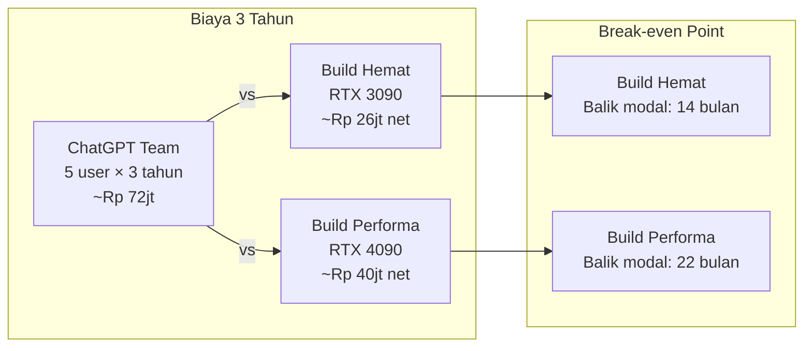

# [Jilid 2] Bab 6.8: Budgeting Home — Estimasi Biaya Rp 25jt - 45jt
> **Tipe Konten:** Analitis — Biaya + ROI + Perbandingan vs Cloud
> **Target Pembaca:** Pemilik rumah yang ingin menghitung kelayakan investasi LLM lokal

---

## 1. TUJUAN SUB-BAB
Pembaca mampu:
- Menghitung total biaya kepemilikan (TCO) server LLM rumahan dalam 3 tahun
- Membandingkan biaya LLM lokal vs langganan cloud (ChatGPT, Claude, Gemini)
- Memahami break-even point dan faktor-faktor yang mempengaruhi ROI

---

## 2. KERANGKA KONTEN

### A. Komponen Biaya Server LLM Rumahan (1 paragraf)
- **CAPEX (Capital Expenditure):** hardware sekali beli — GPU, CPU, RAM, storage, case, PSU
- **OPEX (Operational Expenditure):** listrik, internet, storage pengganti, spare part
- Biaya tersembunyi: AC ruangan (jika GPU 450W), UPS, kabel, tools

### B. Tiga Tier Build (2 paragraf)
- **Build Hemat (Rp 25-30jt):** RTX 3090 used + Ryzen 7 + 32 GB DDR4 — untuk 7-14B model
- **Build Performa (Rp 40-45jt):** RTX 4090 + Ryzen 7 7800X3D + 64 GB DDR5 — untuk 14-33B model
- **Build Premium (Rp 55-70jt):** Mac Studio M2 Ultra 192 GB — untuk 70B model tanpa kuantisasi
- Semua build sudah termasuk komponen pendukung (case, PSU, storage, networking)

### C. Biaya Listrik Tahunan (1-2 paragraf)
- Tarif listrik Indonesia: Rp 1.444 - Rp 1.700 per kWh (golongan rumah tangga)
- RTX 4090 idle 35W + load 350W: rata-rata 150W × 16 jam = 2.4 kWh/hari
- RTX 3090 used: lebih efisien di idle (30W) tapi kurang efisien di load
- Mac Mini M4 Pro: idle 7W + load 65W — paling hemat listrik
- Estimasi biaya listrik: Rp 100-200rb/bulan (GPU build), Rp 30-50rb/bulan (Mac Mini)

### D. Perbandingan vs Cloud Subscription (2 paragraf)
- ChatGPT Team: $25/orang/bulan × 5 anggota = $125/bulan = ~Rp 2jt/bulan
- ChatGPT Plus: $20/orang/bulan × 5 = $100/bulan = ~Rp 1.6jt/bulan
- Claude Pro: $20/orang/bulan × 5 = $100/bulan = ~Rp 1.6jt/bulan
- Total 3 tahun cloud (5 user): Rp 57-72jt (tergantung tier)
- Break-even: 12-24 bulan untuk build hemat, 24-30 bulan untuk build performa

### E. Biaya Tersembunyi dan Kontinjensi (1 paragraf)
- UPS Rp 1-2jt (proteksi data, GPU mati mendadak bisa rusak)
- Thermal paste+ganti fan: ~Rp 200rb/tahun
- SSD upgrade: ~Rp 1-2jt dalam 3 tahun
- Internet: sudah ada (tidak perlu langganan tambahan)
- Domain? Tidak perlu — akses via IP lokal

### F. Nilai Tambah Non-Finansial (1 paragraf)
- Privasi: data keluarga tidak dijual ke pihak ketiga
- Ketersediaan: offline tetap bisa dipakai saat internet mati
- Edukasi: anak belajar teknologi AI, prompt engineering, literasi data
- Kustomisasi: model bisa diganti sesuai kebutuhan, tidak terikat API

---

## 3. TABEL WAJIB

### Tabel A: TCO 3 Tahun — Build Hemat vs Performa vs Cloud

| Komponen Biaya | Build Hemat (RTX 3090) | Build Performa (RTX 4090) | Cloud ChatGPT Team (5 org) |
|:---|:---:|:---:|:---:|
| **CAPEX Hardware** | Rp 27.000.000 | Rp 45.000.000 | Rp 0 |
| **Listrik/tahun** | Rp 1.800.000 | Rp 2.400.000 | Rp 0 |
| **Subscription/tahun** | Rp 0 | Rp 0 | Rp 24.000.000 |
| **Maintenance/tahun** | Rp 500.000 | Rp 500.000 | Rp 0 |
| **Total Tahun 1** | **Rp 29.300.000** | **Rp 47.900.000** | **Rp 24.000.000** |
| **Total Tahun 2** | Rp 31.600.000 | Rp 50.800.000 | Rp 48.000.000 |
| **Total Tahun 3** | Rp 33.900.000 | Rp 53.700.000 | Rp 72.000.000 |
| **Nilai Jual Kembali (30%)** | -Rp 8.100.000 | -Rp 13.500.000 | Rp 0 |
| **TCO 3 Tahun Bersih** | **~Rp 25.800.000** | **~Rp 40.200.000** | **Rp 72.000.000** |

> Asumsi: tarif listrik Rp 1.500/kWh, GPU hidup 16 jam/hari, cloud ChatGPT Team ($25/user/bulan).

### Tabel B: Perbandingan Biaya Listrik per Build

| Build | Idle (W) | Load (W) | Rata-rata (W) | kWh/hari | Biaya/bulan | Biaya/tahun |
|:---|:---:|:---:|:---:|:---:|:---:|:---:|
| **RTX 3090 + Ryzen 7** | 80W | 420W | ~180W | 2.88 | ~Rp 130rb | ~Rp 1.56jt |
| **RTX 4090 + Ryzen 7** | 85W | 520W | ~200W | 3.20 | ~Rp 144rb | ~Rp 1.73jt |
| **Mac Mini M4 Pro** | 15W | 85W | ~35W | 0.56 | ~Rp 25rb | ~Rp 300rb |
| **Mac Studio M2 Ultra** | 30W | 150W | ~60W | 0.96 | ~Rp 43rb | ~Rp 516rb |

> Asumsi: 16 jam operasi/hari, tarif Rp 1.500/kWh. GPU dimatikan 8 jam saat tidur.

### Tabel C: Estimasi Biaya Tambahan (Opsional)

| Item | Fungsi | Harga (IDR) | Prioritas |
|:---|:---|:---:|:---:|
| **UPS 600VA** | Proteksi mati listrik | ~Rp 800rb | Wajib |
| **UPS 1200VA** | Proteksi + stabilizer | ~Rp 1.8jt | Disarankan |
| **Microphone array** | Voice input | ~Rp 500rb-1jt | Opsional |
| **Smart plug (watt meter)** | Monitoring listrik | ~Rp 200rb | Disarankan |
| **USB microphone** | Voice input awal | ~Rp 300rb | Opsional |
| **NVMe 2TB upgrade** | Storage model | ~Rp 2jt | Saat diperlukan |
| **Fan case tambahan** | Cooling GPU | ~Rp 150rb | Jika suhu > 75°C |

---

## 4. DIAGRAM/GAMBAR WAJIB

### Diagram 1: Break-Even Analysis — Lokal vs Cloud (Mermaid)
- **File:** `assets/diagrams/j2-b6-s8-breakeven.mmd`



### Gambar 2: Grafik Akumulasi Biaya 3 Tahun (Line Chart)
- **File:** `assets/images/jilid2/j2-b6-s8-cost-comparison.png`
- **Isi:** Line chart 3 garis: Cloud (naik linier), Build Hemat (awal tinggi, flatten), Build Performa (awal sangat tinggi, flatten)

### Gambar 3: Pie Chart Distribusi Biaya
- **File:** `assets/images/jilid2/j2-b6-s8-cost-breakdown.png`
- **Isi:** Pie chart: GPU 60%, CPU 12%, RAM 8%, Storage 8%, PSU 5%, Case 5%, Lain-lain 2%

---

## 5. TUTORIAL / HANDS-ON

### Tutorial A: Kalkulator TCO Lokal vs Cloud (Python)

```python
# tco_calculator.py — hitung TCO server LLM vs cloud
# Jalankan: python tco_calculator.py

def hitung_tco():
    print("=" * 50)
    print("KALKULATOR TCO — LOCAL LLM vs CLOUD")
    print("=" * 50)

    # Input build
    capex = float(input("Total biaya hardware (Rp): ") or "30000000")
    watt_idle = float(input("Daya idle (W): ") or "80")
    watt_load = float(input("Daya load (W): ") or "400")
    jam_per_hari = float(input("Jam operasi/hari: ") or "16")
    tarif_listrik = float(input("Tarif listrik (Rp/kWh): ") or "1500")

    # Input cloud
    user_count = int(input("Jumlah anggota keluarga: ") or "5")
    cloud_per_user = float(input("Biaya cloud/user/bulan (Rp): ") or "200000")

    # Hitung listrik
    watt_rata = (watt_idle * 0.7 + watt_load * 0.3)  # 70% idle, 30% load
    kwh_per_hari = watt_rata * jam_per_hari / 1000
    listrik_per_tahun = kwh_per_hari * 365 * tarif_listrik / 1000

    # TCO lokal 3 tahun
    lokal_tahun = []
    for tahun in range(1, 4):
        if tahun == 1:
            total = capex + listrik_per_tahun
        else:
            total = listrik_per_tahun
        lokal_tahun.append(total)

    # TCO cloud 3 tahun
    cloud_per_tahun = cloud_per_user * user_count * 12
    cloud_tahun = [cloud_per_tahun] * 3

    # Output
    print("\n" + "=" * 50)
    print(f"{'Tahun':<10} {'Lokal (Rp)':<20} {'Cloud (Rp)':<20}")
    print("-" * 50)
    for i in range(3):
        lok = sum(lokal_tahun[:i+1])
        clo = sum(cloud_tahun[:i+1])
        print(f"{i+1:<10} {lok:<20,.0f} {clo:<20,.0f}")

    # Break-even
    lok_kumulatif = 0
    for bulan in range(1, 37):
        if bulan == 1:
            lok_kumulatif += lokal_tahun[0] / 12 + capex / 12
        else:
            lok_kumulatif += lokal_tahun[0] / 12
        cloud_kumulatif = cloud_per_tahun / 12 * bulan

        if lok_kumulatif <= cloud_kumulatif:
            print(f"\n✅ Break-even di bulan ke-{bulan}")
            break

if __name__ == "__main__":
    hitung_tco()
```

### Tutorial B: Monitoring Biaya Listrik Real-Time

```bash
#!/bin/bash
# monitor_power.sh — monitor pemakaian listrik GPU dan hitung biaya

TARIF=1500  # Rp/kWh

while true; do
    # Ambil power draw GPU dari nvidia-smi
    POWER=$(nvidia-smi --query-gpu=power.draw --format=csv,noheader,nounits | head -1)
    POWER_W=$(echo "$POWER" | cut -d. -f1)

    # Hitung biaya per jam
    KWH=$(echo "scale=4; $POWER_W / 1000" | bc)
    BIAYA_PER_JAM=$(echo "scale=2; $KWH * $TARIF" | bc)

    # Hitung biaya harian (asumsi 16 jam)
    BIAYA_PER_HARI=$(echo "scale=2; $BIAYA_PER_JAM * 16" | bc)

    clear
    echo "=== MONITOR DAYA GPU ==="
    echo "Power draw: ${POWER_W}W"
    echo "Biaya listrik per jam: Rp ${BIAYA_PER_JAM}"
    echo "Biaya per hari: Rp ${BIAYA_PER_HARI}"
    echo "Biaya per bulan: Rp $(echo "$BIAYA_PER_HARI * 30" | bc)"
    echo "Biaya per tahun: Rp $(echo "$BIAYA_PER_HARI * 365" | bc)"
    echo ""
    echo "Tekan Ctrl+C untuk berhenti"
    sleep 5
done
```

### Tutorial C: Setup Smart Plug untuk Monitoring Daya

```yaml
# Di Home Assistant configuration.yaml — monitor daya via smart plug
# Asumsi: smart plug TP-Link HS110

sensor:
  - platform: tplink
    host: 192.168.1.50
    name: "Server LLM Power"

  - platform: template
    sensors:
      server_monthly_cost:
        friendly_name: "Biaya Listrik Server (Bulan Ini)"
        unit_of_measurement: "Rp"
        value_template: >-
          
          {{ (kwh * 1500) | round(0) | int }}
```

---

## 6. STUDI KASUS

### Studi Kasus: Keputusan Investasi Keluarga Firmansyah
- **Profil:** 5 anggota keluarga, pengeluaran cloud AI saat ini: Rp 2.5jt/bulan (ChatGPT Team 5 user + Claude 1 user)
- **Opsi A — Lanjut Cloud:** Rp 30jt/tahun × 3 tahun = Rp 90jt (dengan asumsi kenaikan harga 10%/tahun)
- **Opsi B — Build Lokal:** Build RTX 4090 ~Rp 45jt + listrik Rp 2.4jt/tahun = Rp 52.2jt / 3 tahun
- **Keputusan:** Pilih Build Lokal.
  - Break-even: bulan ke-20
  - Setelah 3 tahun: hemat Rp 37.8jt dibanding cloud
  - Setelah 5 tahun: hemat > Rp 80jt (hardware sudah lunas, hanya bayar listrik)
  - Bonus: privasi terjamin, bisa akses offline, anak belajar AI
- **Eksekusi:** Build RTX 4090 (45jt) + smart plug monitoring + auto-shutdown malam
- **Hasil:** Biaya listrik aktual Rp 190rb/bulan. Empat anggota keluarga menggunakan masing-masing ~50 query/hari. Kepuasan: lebih cepat dari ChatGPT (latensi lokal 2-3 detik vs cloud 5-8 detik).

---

## 7. REFERENSI WAJIB

### Paper Jurnal/Konferensi

[1] **Small Language Models Survey — Data Benchmark**
```
@article{lu2024slmsurvey,
  title   = {Small Language Models: Survey, Measurements, and Insights},
  author  = {Lu, Zhenyan and Li, Xiang and Cai, Dongqi and Yi, Rongjie and Liu, Fangming and Lan, Wei and Luan, Jian and Zhang, Xiwen and Lane, Nicholas D. and Xu, Mengwei},
  journal = {arXiv preprint arXiv:2409.15790},
  year    = {2024},
  doi     = {10.48550/arXiv.2409.15790},
  url     = {https://arxiv.org/abs/2409.15790}
}
```
- Kaitan: Data benchmark 70+ SLM di berbagai hardware — menjadi acuan untuk membandingkan cost-per-token antar build di Tabel A.

[2] **Edge LLM Review — TCO Analysis Framework**
```
@article{qu2024edgellm,
  title   = {A Review on Edge Large Language Models: Design, Execution, and Applications},
  author  = {Qu, Zaichen and others},
  journal = {arXiv preprint arXiv:2410.11845},
  year    = {2024},
  doi     = {10.48550/arXiv.2410.11845},
  url     = {https://arxiv.org/abs/2410.11845}
}
```
- Kaitan: Analisis siklus hidup edge LLM — dari biaya hardware hingga inference cost. Kerangka TCO di sub-bab 2.A merujuk pada metodologi review ini.

[3] **On-Device LLM untuk Home Assistant — Cost Analysis**
```
@article{lang2025ondevice,
  title   = {On-Device {LLMs} for Home Assistant: Dual Role in Intent Detection and Response Generation},
  author  = {Lang, Martin and others},
  journal = {arXiv preprint arXiv:2502.12923},
  year    = {2025},
  doi     = {10.48550/arXiv.2502.12923},
  url     = {https://arxiv.org/abs/2502.12923}
}
```
- Kaitan: Studi yang membuktikan kelayakan LLM di perangkat 8GB RAM — implikasinya: build hemat Rp 25-30jt sudah cukup untuk kebanyakan kebutuhan keluarga.

[4] **Privacy-Preserving LLM Inference — Cost of Privacy**
```
@misc{cryptoeprint2026privacy,
  author    = {Andreoletti, Davide and Rudi, Alessandro and Carpanzano, Emanuele and Lelli, Francesco and Leidi, Tiziano},
  title     = {Privacy-Preserving {LLM} Inference in Practice: A Comparative Survey of Techniques, Trade-Offs, and Deployability},
  howpublished = {Cryptology ePrint Archive, Paper 2026/105},
  year      = {2026},
  url       = {https://eprint.iacr.org/2026/105}
}
```
- Kaitan: Analisis trade-off biaya antara local deployment yang mahal di awal vs cloud yang murah di awal tapi mahal jangka panjang.

[5] **Demystifying SLM for Edge — Resource Requirements**
```
@inproceedings{lu2025demystifying,
  title     = {Demystifying Small Language Models for Edge Deployment},
  author    = {Lu, Zhenyan and Li, Xiang and Cai, Dongqi and Yi, Rongjie and Liu, Fangming and Liu, Wei and Luan, Jian and Zhang, Xiwen and Lane, Nicholas D. and Xu, Mengwei},
  booktitle = {Proceedings of the 63rd Annual Meeting of the ACL},
  year      = {2025},
  doi       = {10.18653/v1/2025.acl-long.718},
  url       = {https://aclanthology.org/2025.acl-long.718/}
}
```
- Kaitan: Analisis resource requirements SLM di edge — data RAM, daya, dan storage yang menjadi dasar estimasi biaya listrik di Tabel B.

### Referensi Pendukung

[6] PLN. *Tarif Tenaga Listrik*. [https://www.pln.co.id](https://www.pln.co.id)

[7] PC Part Picker. *Price Comparison*. [https://pcpartpicker.com](https://pcpartpicker.com)

[8] Tokopedia / Bukalapak. *Harga Hardware Indonesia*.

[9] OpenAI. *ChatGPT Pricing*. [https://openai.com/pricing](https://openai.com/pricing)

[10] Anthropic. *Claude Pricing*. [https://www.anthropic.com/pricing](https://www.anthropic.com/pricing)
