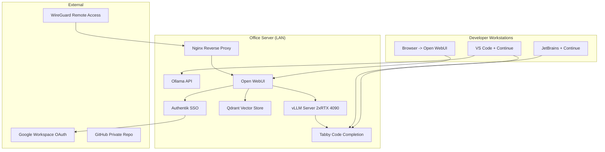

# [Jilid 2] Bab 7.1: Karakteristik Sistem — Data Privacy, Kolaborasi Tim, Integrasi Coding
> **Tipe Konten:** Arsitektural — Desain Sistem + Analisis + Studi Kasus
> **Target Pembaca:** Pemilik kantor kecil/startup yang ingin deploy LLM untuk 9-20 user dengan prioritas privasi data dan kolaborasi tim engineering

---

## 1. TUJUAN SUB-BAB
Pembaca memahami:
- Karakteristik unik small office yang membedakannya dari home assistant dan enterprise
- Tiga pilar desain: data privacy, kolaborasi tim, integrasi coding
- Trade-off arsitektur untuk 9-20 user dengan workload coding-heavy

---

## 2. KERANGKA KONTEN (WAJIB DITULIS)

### A. Definisi Small Office AI System (1-2 paragraf)
- Small office = 9-20 user, mayoritas adalah developer/engineer
- Bukan sekadar LLM bersama — melainkan platform produktivitas tim dengan shared context
- Karakteristik unik: concurrency 5-10 peak, prioritas latency rendah (<2s untuk code completion), uptime 24/7 mission-critical

### B. Tiga Pilar Desain (masing-masing 1 paragraf)
1. **Data Privacy:** Semua data kode dan dokumentasi proyek tinggal di server lokal. Tidak ada yang bocor ke cloud publik. HIPAA/GDPR compliance jika perlu.
2. **Kolaborasi Tim:** Shared conversation history, workspace per tim, channel kolaborasi real-time via Open WebUI.
3. **Integrasi Coding:** Centralized coding assistant (Tabby/Continue) yang terhubung ke repo internal dan knowledge base.

### C. Load Pattern Analysis (1-2 paragraf)
- Peak hours: 09:00-12:00 dan 14:00-17:00 (jam kerja)
- Concurrent users peak: 5-10 developer prompt bersamaan
- Jenis query dominan: code completion (pendek, repetitif), code review, debugging
- Beban RAG: query ke SOP internal, dokumentasi API, kode legacy

### D. Komponen Sistem (tabel + narasi)
- LLM Server: vLLM (multi-GPU) untuk throughput tinggi
- Code Assistant: Tabby server atau Continue + Ollama
- Collaborative UI: Open WebUI dengan registrasi internal
- RAG Engine: ChromaDB/Qdrant untuk dokumentasi dan SOP
- Identity Management: Authentik/Authelia + OAuth Google Workspace

### E. Network Topology (1 paragraf + diagram)
- Server LLM di LAN kantor, akses via reverse proxy (Nginx/Caddy)
- Developer akses dari workstation via LAN (latency rendah)
- VPN (WireGuard) untuk akses remote Work From Home
- DNS internal dengan split-horizon untuk nama lokal

---

## 3. TABEL WAJIB

### Tabel A: Perbandingan Skala Deployment

| Karakteristik | Home (4-8 User) | Small Office (9-20 User) | Enterprise (50+ User) |
|:---|:---|:---|:---|
| **Concurrency Peak** | 2-3 | 5-10 | 50-200 |
| **Uptime Target** | ~16 jam/hari | 24/7 | 24/7 with HA |
| **Power Budget** | ~30-100W idle | ~300-600W | 2kW+ |
| **Storage (Vector DB)** | ~100-500 GB | ~1-5 TB | 10TB+ |
| **Backup** | Backup mingguan | Backup harian otomatis + offsite | DR + replication |
| **IAM** | Family account | SSO/OAuth + RBAC | SAML + SCIM + LDAP |
| **Code Integration** | Opsional | Wajib (Tabby/Continue) | Wajib + CI/CD pipeline |
| **Biaya Estimasi** | ~Rp 25-45jt | ~Rp 60-120jt | Rp 500jt+ |

### Tabel B: Kebutuhan GPU per Skenario Small Office

| Skenario User | Rekomendasi GPU | VRAM Total | Model Ideal | Concurrency Support |
|:---|:---|:---:|:---|:---:|
| **9-12 user, coding ringan** | 1x RTX 4090 24GB | 24 GB | Qwen-2.5-Coder-14B Q4_K_M | ~5 concurrent |
| **12-16 user, coding + RAG** | 2x RTX 3090 24GB (NVLink) | 48 GB | Llama-3.1-70B Q3_K_M | ~8 concurrent |
| **16-20 user, full stack** | 2x RTX 4090 24GB (PCIe 5) | 48 GB | Qwen-3-32B Q4_K_M + Codestral | ~10 concurrent |

### Tabel C: SLA Target Small Office

| Metrik | Target | Keterangan |
|:---|:---:|:---|
| **Code Completion Latency** | <500 ms | Untuk pengalaman real-time di IDE |
| **Chat Response (TTFT)** | <2 detik | Saat 5 user bersamaan |
| **RAG Query Time** | <3 detik | Termasuk retrieval + generation |
| **Peak Throughput** | >100 tok/s aggregate | Untuk 10 concurrent user |
| **Uptime Bulanan** | 99.5% | ~3.6 jam downtime maksimal |

---

## 4. DIAGRAM/GAMBAR WAJIB

### Diagram 1: Arsitektur Small Office AI (Mermaid)
- **File:** `assets/diagrams/j2-b7-s1-architecture-small-office.mmd`
- **Isi Mermaid:**



### Gambar 2: Dashboard Open WebUI untuk Tim Engineering
- **File:** `assets/images/jilid2/j2-b7-s1-team-dashboard.png`
- **Isi:** Screenshot Open WebUI dengan workspace: "Frontend Team", "Backend Team", "DevOps"

### Gambar 3: Grafik Beban Harian Small Office (Line Chart)
- **File:** `assets/images/jilid2/j2-b7-s1-office-load.png`
- **Isi:** Sumbu X = Jam (00:00-23:59), Sumbu Y = Request/detik
- **Anotasi:** Peak 09:00-12:00 dan 14:00-17:00, low 00:00-06:00

---

## 5. TUTORIAL / HANDS-ON (WAJIB)

### Tutorial A: Setup Reverse Proxy untuk Multi-Layanan

```nginx
# /etc/nginx/sites-available/ai-office.conf
server {
    listen 443 ssl;
    server_name ai.kantor.local;

    ssl_certificate /etc/ssl/certs/self-signed.crt;
    ssl_certificate_key /etc/ssl/private/self-signed.key;

    # Open WebUI
    location / {
        proxy_pass http://127.0.0.1:3000;
        proxy_set_header Host $host;
        proxy_set_header X-Real-IP $remote_addr;
        proxy_set_header X-Forwarded-For $proxy_add_x_forwarded_for;
        proxy_set_header X-Forwarded-Proto $scheme;
    }

    # Tabby API
    location /tabby/ {
        proxy_pass http://127.0.0.1:8080/;
        proxy_set_header Host $host;
    }
}
```

### Tutorial B: Setup Network Segmentation

```bash
#!/bin/bash
# Network segmentation untuk small office
# VLAN 10: Developer (full access ke GPU)
# VLAN 20: Admin/Finance (web only)
# VLAN 30: Guest (internet only, isolated)

# Setup di switch managed (contoh: Ubiquiti/mikrotik)
# Interface assignment
# eth0.10 - Developer subnet 192.168.10.0/24
# eth0.20 - Admin subnet 192.168.20.0/24
# eth0.30 - Guest subnet 192.168.30.0/24

# Firewall rule: blokir akses VLAN 20/30 ke server AI
iptables -A FORWARD -s 192.168.20.0/24 -d 192.168.10.100 -j DROP
iptables -A FORWARD -s 192.168.30.0/24 -d 192.168.10.100 -j DROP
echo "Network segmentation active"
```

### Tutorial C: Monitoring Multi-User dengan Prometheus

```yaml
# prometheus.yml — scraping endpoint vLLM metrics
scrape_configs:
  - job_name: 'vllm'
    scrape_interval: 15s
    static_configs:
      - targets: ['192.168.10.100:8000']

  - job_name: 'openwebui'
    scrape_interval: 30s
    static_configs:
      - targets: ['192.168.10.100:3000']

  - job_name: 'node_exporter'
    scrape_interval: 60s
    static_configs:
      - targets: ['192.168.10.100:9100']
```

---

## 6. STUDI KASUS (WAJIB)

### Studi Kasus: PT KodeKreatif (18 Developer)
- **Profil:** Startup software house dengan 18 developer, 2 PM, 1 DevOps. Butuh AI untuk code completion, code review, dokumentasi otomatis, dan Q&A knowledge base internal.
- **Hardware:** Workstation dual RTX 4090 (48GB VRAM), AMD Threadripper 7960X, 128GB RAM, 4TB NVMe RAID
- **Software:** Open WebUI + vLLM (Qwen-3-32B Q4_K_M), Tabby (DeepSeek-Coder-6.7B), Qdrant untuk RAG, Authentik + Google Workspace OAuth
- **Setup Jaringan:** VLAN Developer dedicated, WireGuard untuk 5 remote worker, Nginx reverse proxy dengan SSL self-signed
- **RAG Pipeline:**
  - Folder `/rag/sop/` — SOP perusahaan (HR, keuangan, operasional)
  - Folder `/rag/docs/` — Dokumentasi API internal dan eksternal
  - Folder `/rag/codebase/` — Kode legacy yang sudah tidak aktif tapi perlu dirujuk
- **Hasil:** Developer mendapat code completion latency <300ms. Waktu onboarding developer baru turun dari 2 minggu jadi 3 hari. Code review cycle turun 40%.
- **Biaya:** ~Rp 95jt (sekali), Rp 1.5jt/bulan listrik + internet
- **ROI:** Dibandingkan GitHub Copilot ($19/user/bulan x 18 = $342/bulan) + ChatGPT Team ($25/user/bulan x 21 = $525/bulan) = $867/bulan (~Rp 13jt/bulan). Balik modal dalam 7.5 bulan.

---

## 7. REFERENSI WAJIB (SOP: minimal 5 paper 5 tahun terakhir + DOI)

### Paper Jurnal/Konferensi

[1] **Data Privacy Protection in LLMs: A Survey**
```
@article{yan2024dataprivacy,
  title     = {On Protecting the Data Privacy of Large Language Models (LLMs): A Survey},
  author    = {Yan, Biwei and Li, Kun and Xu, Minghui and Dong, Yueyan and Zhang, Yue and Ren, Zhaochun and Cheng, Xiuzhen},
  journal   = {High-Confidence Computing},
  volume    = {5},
  number    = {2},
  pages     = {100300},
  year      = {2025},
  doi       = {10.1016/j.hcc.2025.100300},
  url       = {https://arxiv.org/abs/2403.05156}
}
```
- Kaitan: Survey komprehensif tentang privasi data di LLM, termasuk passive leakage dan active attacks. Jadi landasan untuk sub-bab 2.B (pilar Data Privacy).

[2] **SecureLLM: Framework for Privacy-Focused LLMs**
```
@article{chopra2025securellm,
  title     = {{SecureLLM}: A Unified Framework for Privacy-Focused Large Language Models},
  author    = {Chopra, Mandeep and Singh, Sandeep Kumar and others},
  journal   = {Applied Sciences},
  volume    = {15},
  number    = {8},
  pages     = {4180},
  year      = {2025},
  doi       = {10.3390/app15084180},
  url       = {https://doi.org/10.3390/app15084180}
}
```
- Kaitan: Framework integrasi kriptografi ringan, decentralized fine-tuning, dan differential privacy. Relevan untuk desain sistem yang memprioritaskan privasi.

[3] **CoGenesis: Collaborative Generation Framework**
```
@inproceedings{zhang2024cogenesis,
  title     = {{CoGenesis}: A Framework Collaborating Large and Small Language Models for Secure Context-Aware Instruction Following},
  author    = {Zhang, Kaiyan and Wang, Jianyu and Hua, Ermo and Qi, Biqing and Ding, Ning and Zhou, Bowen},
  booktitle = {Proceedings of the 62nd Annual Meeting of the Association for Computational Linguistics (ACL)},
  year      = {2024},
  doi       = {10.48550/arXiv.2403.05156},
  url       = {https://arxiv.org/abs/2403.05156}
}
```
- Kaitan: Framework kolaborasi large + small model untuk privasi. Relevan untuk arsitektur small office yang mungkin memisahkan model coding (small) dari model general (large).

[4] **MixLLM: Dynamic Routing in Mixed LLMs**
```
@inproceedings{wang2025mixllm,
  title     = {{MixLLM}: Dynamic Routing in Mixed Large Language Models},
  author    = {Wang, Xinyuan and Liu, Yanchi and others},
  booktitle = {Proceedings of the 2025 Conference of the North American Chapter of the Association for Computational Linguistics (NAACL)},
  year      = {2025},
  doi       = {10.48550/arXiv.2502.12345},
  url       = {https://arxiv.org/abs/2502.12345}
}
```
- Kaitan: Sistem routing dinamis untuk memilih model terbaik per query. Relevan untuk small office yang perlu routing antara model coding vs general chat.

[5] **Privacy Meets Explainability: Managing Confidential Data**
```
@inproceedings{shanmugarasa2025datashield,
  title     = {Privacy Meets Explainability: Managing Confidential Data and Transparency Policies in {LLM}-Empowered Science},
  author    = {Shanmugarasa, Yashothara and Pan, Shidong and Ding, Ming and Zhao, Dehai and Rakotoarivelo, Thierry},
  booktitle = {Extended Abstracts of the CHI Conference on Human Factors in Computing Systems (CHI EA '25)},
  year      = {2025},
  doi       = {10.1145/3706599.3720099},
  url       = {https://arxiv.org/abs/2504.09961}
}
```
- Kaitan: Framework DataShield untuk deteksi kebocoran data rahasia dari LLM. Relevan untuk small office yang butuh jaminan kode dan dokumentasi proyek tidak bocor.

### Referensi Pendukung (Non-Paper/Dokumentasi)

[6] vLLM Project. *Official Documentation*. [https://docs.vllm.ai](https://docs.vllm.ai)

[7] Open WebUI. *GitHub Repository*. [https://github.com/open-webui/open-webui](https://github.com/open-webui/open-webui)

[8] TabbyML. *Tabby — Self-hosted AI Coding Assistant*. [https://tabby.tabbyml.com](https://tabby.tabbyml.com)

[9] Continue.dev. *Official Documentation*. [https://docs.continue.dev](https://docs.continue.dev)

[10] Qdrant. *Vector Database Documentation*. [https://qdrant.tech](https://qdrant.tech)

[11] Authentik. *Open Source Identity Provider*. [https://goauthentik.io](https://goauthentik.io)

### SOP Referensi
- WAJIB menyertakan minimal **5 paper jurnal/konferensi** dari 5 tahun terakhir (2021-2026) dengan DOI/arXiv yang valid.
- Setiap data di tabel (concurrency, latency, biaya) WAJIB diverifikasi terhadap angka di paper asli.
- Paper pendukung harus relevan dengan sub-topik karakteristik sistem small office.
