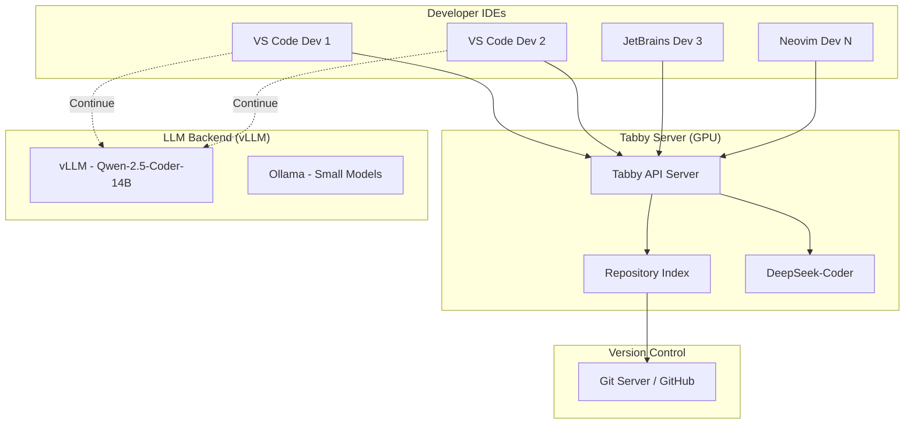

# [Jilid 2] Bab 7.5: Coding Helper Server — Centralized AI untuk Tim Developer (Tabby/Continue)
> **Tipe Konten:** Praktikal — Instalasi + Konfigurasi + Integrasi IDE
> **Target Pembaca:** Developer lead / DevOps yang ingin menyediakan AI coding assistant untuk tim

---

## 1. TUJUAN SUB-BAB
Pembaca mampu:
- Memilih antara Tabby (server-based) vs Continue (IDE extension) untuk tim
- Men-deploy centralized coding assistant server yang melayani seluruh tim
- Mengkonfigurasi repository-level context dan code indexing

---

## 2. KERANGKA KONTEN (WAJIB DITULIS)

### A. Kebutuhan Coding Assistant Terpusat (1 paragraf)
- Developer butuh code completion, chat, dan inline editing tanpa bergantung cloud
- Centralized server: satu GPU melayani seluruh tim, tidak perlu masing-masing setup AI
- Data kode tetap di server lokal — tidak bocor ke GitHub Copilot atau ChatGPT

### B. Tabby: Self-Hosted Code Completion Server (2 paragraf)
- Arsitektur: Server Rust-based, REST API + IDE extension (VS Code, JetBrains, Vim/Neovim)
- Fitur unggulan: repository-level code indexing, team management dashboard, GPU acceleration
- Model support: DeepSeek-Coder, StarCoder2, CodeLlama via llama.cpp backend
- Resource: minimal 8GB VRAM untuk 16K context, recommended 24GB untuk 32K context

### C. Continue: IDE Extension + BYO Backend (2 paragraf)
- Arsitektur: Extension VS Code/JetBrains, terhubung ke LLM backend apa saja
- Fitur unggulan: @mentions ke files/context, inline editing (Cmd+I), tab autocomplete
- Bisa connect ke Ollama, vLLM, OpenAI API, atau Tabby sebagai backend
- Lebih ringan: tidak perlu server terpisah, langsung dari IDE

### D. Tabby vs Continue: Kapan Pilih Yang Mana? (1 paragraf)
- Pilih Tabby jika: tim >10 developer, perlu centralized management, ingin repository indexing, mau admin dashboard
- Pilih Continue jika: tim <10 developer, ingin fleksibilitas model, sudah punya Ollama/vLLM
- Bisa juga kombinasi: Continue + Tabby backend = yang terbaik dari keduanya

### E. Model Coding Assistant yang Direkomendasikan (1 paragraf)
- Code Completion: DeepSeek-Coder-6.7B (latency rendah, akurasi tinggi), Qwen-2.5-Coder-7B (multilingual)
- Chat/Review: DeepSeek-Coder-33B, Qwen-2.5-Coder-14B, Llama-3.1-8B (general purpose)
- Fine-tuning roadmap: adaptasi ke codebase sendiri dengan QLoRA

---

## 3. TABEL WAJIB

### Tabel A: Perbandingan Tabby vs Continue vs GitHub Copilot

| Fitur | Tabby | Continue | GitHub Copilot |
|:---|:---|:---|:---|
| **Arsitektur** | Server + Extension | Extension Only | Cloud |
| **Self-Hosted** | Ya (wajib) | Opsional | Tidak |
| **Code Completion** | Ya | Ya | Ya |
| **Chat** | Ya | Ya | Ya (Copilot Chat) |
| **Inline Editing** | Tidak | Ya (Cmd+I) | Ya |
| **Repository Indexing** | Ya | Limited | Ya (cloud) |
| **Admin Dashboard** | Ya (team mgmt) | Tidak | Ya (business) |
| **Harga** | Gratis (open source) | Gratis | $19/user/bulan |
| **Data Privacy** | 100% lokal | Tergantung backend | Cloud Microsoft |
| **GPU Requirement** | 8-24 GB VRAM | Tidak perlu | Tidak perlu |

### Tabel B: Model untuk Coding Assistant

| Model | Ukuran | Completion Quality | Chat Quality | VRAM (Q4) | Latency (t/s) |
|:---|:---:|:---:|:---:|:---:|:---:|
| **DeepSeek-Coder-1.3B** | 1.3B | ** | * | ~1 GB | ~120 t/s |
| **Qwen-2.5-Coder-7B** | 7B | **** | *** | ~5 GB | ~65 t/s |
| **DeepSeek-Coder-6.7B** | 6.7B | **** | *** | ~5 GB | ~60 t/s |
| **CodeLlama-13B** | 13B | **** | *** | ~8 GB | ~40 t/s |
| **Qwen-2.5-Coder-14B** | 14B | ***** | **** | ~9 GB | ~30 t/s |
| **DeepSeek-Coder-33B** | 33B | ***** | ***** | ~20 GB | ~15 t/s |

### Tabel C: Kebutuhan Resource Tabby Server

| Model Completion | Jumlah User | VRAM | RAM | Storage (Index) |
|:---|:---:|:---:|:---:|:---:|
| DeepSeek-Coder-1.3B | 10 user | 4 GB | 8 GB | ~500 MB |
| Qwen-2.5-Coder-7B | 15 user | 8 GB | 16 GB | ~2 GB |
| DeepSeek-Coder-6.7B | 20 user | 10 GB | 16 GB | ~2 GB |
| DeepSeek-Coder-33B | 20 user | 24 GB | 32 GB | ~5 GB |

---

## 4. DIAGRAM/GAMBAR WAJIB

### Diagram 1: Arsitektur Centralized Coding Assistant (Mermaid)
- **File:** `assets/diagrams/j2-b7-s5-coding-assistant.mmd`
- **Isi Mermaid:**



### Gambar 2: Screenshot Tabby Admin Dashboard
- **File:** `assets/images/jilid2/j2-b7-s5-tabby-dashboard.png`
- **Isi:** Dashboard Tabby menunjukkan user aktif, completion stats, model usage

### Gambar 3: Screenshot Continue + Tabby Integration
- **File:** `assets/images/jilid2/j2-b7-s5-continue-tabby.png`
- **Isi:** Continue extension di VS Code dengan backend Tabby, menunjukkan inline completion

---

## 5. TUTORIAL / HANDS-ON (WAJIB)

### Tutorial A: Deploy Tabby Server dengan Docker

```bash
#!/bin/bash
# Setup Tabby server untuk tim developer

# 1. Pull model coding (DeepSeek-Coder-6.7B)
# Tabby akan download model otomatis saat pertama running

# 2. Jalankan Tabby server
docker run -d \
  --name tabby \
  --restart always \
  --gpus all \
  -p 8080:8080 \
  -v tabby-data:/data \
  -e TABBY_MODEL_CACHE_DIR=/data/models \
  -e TABBY_DISABLE_USAGE_COLLECTION=1 \
  tabbyml/tabby:latest \
  serve --model StarCoder2-7B \
  --device cuda \
  --port 8080

# 3. Verifikasi server
curl http://localhost:8080/v1/health

# 4. Index repository perusahaan
docker exec tabby tabby scheduler \
  --git-url https://github.com/company/internal-lib.git \
  --git-branch main
```

### Tutorial B: Konfigurasi Continue + Tabby Backend

```json
// config.json — Continue VS Code extension
{
  "models": [
    {
      "title": "Tabby Completion",
      "provider": "tabby",
      "apiBase": "http://10.0.0.100:8080",
      "apiKey": "tabby-local"
    },
    {
      "title": "Qwen-2.5-Coder-14B (Chat)",
      "provider": "openai",
      "apiBase": "http://10.0.0.100:8000/v1",
      "apiKey": "not-needed",
      "model": "Qwen/Qwen-2.5-Coder-14B-Instruct"
    }
  ],
  "tabAutocompleteModel": {
    "title": "Tabby",
    "provider": "tabby",
    "apiBase": "http://10.0.0.100:8080"
  },
  "slashCommands": [
    {
      "name": "edit",
      "description": "Edit selected code"
    },
    {
      "name": "review",
      "description": "Review this code"
    }
  ]
}
```

### Tutorial C: Benchmark Latency Coding Assistant

```python
# benchmark_tabby.py — uji latency completion
import requests
import time
import statistics

TABBY_URL = "http://localhost:8080/v1/completions"
CODE_SNIPPETS = [
    "def fibonacci(n):",
    "const handleClick = () => {",
    "SELECT * FROM users WHERE",
    "@GetMapping(\"/api/v1/",
    "terraform {",
]

for snippet in CODE_SNIPPETS:
    latencies = []
    for _ in range(10):
        start = time.time()
        r = requests.post(TABBY_URL, json={
            "prompt": snippet,
            "max_tokens": 50,
            "temperature": 0.1
        })
        elapsed = (time.time() - start) * 1000
        latencies.append(elapsed)
    
    print(f"Prompt: {snippet[:30]}...")
    print(f"  P50: {statistics.median(latencies):.0f}ms")
    print(f"  P95: {sorted(latencies)[8]:.0f}ms")
    print(f"  Avg: {statistics.mean(latencies):.0f}ms")
```

---

## 6. STUDI KASUS (WAJIB)

### Studi Kasus: Centralized Coding Assistant untuk 15 Developer
- **Profil:** Software agency dengan 15 developer (5 frontend, 6 backend, 4 mobile). Codebase: React, Node.js, Python, Flutter, Go.
- **Setup:** Tabby server di workstation dual RTX 4090. Model: DeepSeek-Coder-6.7B (completion) + Qwen-2.5-Coder-14B (chat/review).
- **Konfigurasi:** Setiap developer pakai Continue extension dengan Tabby backend. Repository indexing untuk 5 repo utama.
- **Fitur Digunakan:**
  - Tab completion: real-time suggestion saat ngetik
  - Chat: "Refactor function ini pakai async/await"
  - Inline edit: Cmd+I untuk edit seleksi kode
  - Review: "Review PR ini dari sisi security"
- **Hasil:** Developer melaporkan peningkatan kecepatan coding 25-40%. Code completion accepted rate: 35% (standar industri ~30%). Jumlah PR per hari naik dari 2.5 ke 3.8.
- **Biaya:** Tabby (gratis), model inference di GPU existing, hanya tambahan storage indexing ~5GB.
- **Pembelajaran:** DeepSeek-Coder-6.7B cukup untuk 90% kasus. Model 33B hanya diperlukan untuk review kode kompleks.

---

## 7. REFERENSI WAJIB (SOP: minimal 5 paper 5 tahun terakhir + DOI)

### Paper Jurnal/Konferensi

[1] **CodeBERT: A Pre-Trained Model for Programming and Natural Languages**
```
@inproceedings{feng2020codebert,
  title     = {{CodeBERT}: A Pre-Trained Model for Programming and Natural Languages},
  author    = {Feng, Zhangyin and Guo, Daya and Tang, Duyu and Duan, Nan and Feng, Xiaocheng and Gong, Ming and Shou, Linjun and Qin, Bing and Liu, Ting and Jiang, Daxin and Zhou, Ming},
  booktitle = {Findings of the Association for Computational Linguistics (EMNLP)},
  year      = {2020},
  doi       = {10.48550/arXiv.2002.08155},
  url       = {https://arxiv.org/abs/2002.08155}
}
```
- Kaitan: Landasan pre-trained model untuk code understanding. Relevan sebagai latar belakang model coding assistant.

[2] **StarCoder: Open Code LLMs**
```
@article{li2023starcoder,
  title     = {{StarCoder}: May the Source Be with You!},
  author    = {Li, Raymond and Allal, Loubna Ben and Zi, Yangtian and others},
  journal   = {arXiv preprint arXiv:2305.06161},
  year      = {2023},
  doi       = {10.48550/arXiv.2305.06161},
  url       = {https://arxiv.org/abs/2305.06161}
}
```
- Kaitan: Model open code LLM yang mendukung Tabby. Arsitektur model StarCoder relevan untuk pembahasan model completion.

[3] **DeepSeek-Coder: Code LLMs with DeepSeek Architecture**
```
@article{deepseek2024coder,
  title     = {{DeepSeek-Coder}: When the Large Language Model Meets Programming -- The Rise of Code {AI}},
  author    = {Guo, Daya and Zhu, Qihao and Yang, Dejian and others},
  journal   = {arXiv preprint arXiv:2401.14196},
  year      = {2024},
  doi       = {10.48550/arXiv.2401.14196},
  url       = {https://arxiv.org/abs/2401.14196}
}
```
- Kaitan: Model coding utama yang direkomendasikan untuk Tabby. Data kualitas completion di Tabel B harus merujuk benchmark paper ini.

[4] **Qwen-2.5-Coder: Coder Series of Qwen Models**
```
@article{qwen2025coder,
  title     = {{Qwen-2.5-Coder}: A Strong Code Language Model},
  author    = {Qwen Team, Alibaba Group},
  journal   = {arXiv preprint arXiv:2502.02368},
  year      = {2025},
  doi       = {10.48550/arXiv.2502.02368},
  url       = {https://arxiv.org/abs/2502.02368}
}
```
- Kaitan: Alternatif model coding terbaru yang mendukung multilingual code generation. Relevan untuk tim yang butuh dukungan multi-bahasa.

[5] **Evaluating Large Language Models for Code Generation**
```
@inproceedings{chen2021humaneval,
  title     = {Evaluating Large Language Models Trained on Code},
  author    = {Chen, Mark and Tworek, Jerry and Jun, Heewoo and others},
  booktitle = {Advances in Neural Information Processing Systems (NeurIPS)},
  year      = {2021},
  doi       = {10.48550/arXiv.2107.03374},
  url       = {https://arxiv.org/abs/2107.03374}
}
```
- Kaitan: Paper yang memperkenalkan HumanEval benchmark — standar evaluasi code generation yang dirujuk di Tabel B.

### Referensi Pendukung (Non-Paper/Dokumentasi)

[6] TabbyML. *Official Documentation*. [https://tabby.tabbyml.com/docs](https://tabby.tabbyml.com/docs)

[7] Continue.dev. *Official Documentation*. [https://docs.continue.dev](https://docs.continue.dev)

[8] Ollama Code Models. [https://ollama.com/library?q=coder](https://ollama.com/library?q=coder)

[9] BigCode Project. *StarCoder2 Models*. [https://huggingface.co/bigcode](https://huggingface.co/bigcode)

[10] Hugging Face Open LLM Leaderboard for Code. [https://huggingface.co/spaces/bigcode/bigcode-models-leaderboard](https://huggingface.co/spaces/bigcode/bigcode-models-leaderboard)

### SOP Referensi
- WAJIB menyertakan minimal **5 paper jurnal/konferensi** dengan DOI/arXiv yang valid.
- Data benchmark model di Tabel B WAJIB diverifikasi dari HumanEval atau leaderboard.
- Dokumentasi Tabby dan Continue adalah sumber utama konfigurasi tutorial.
