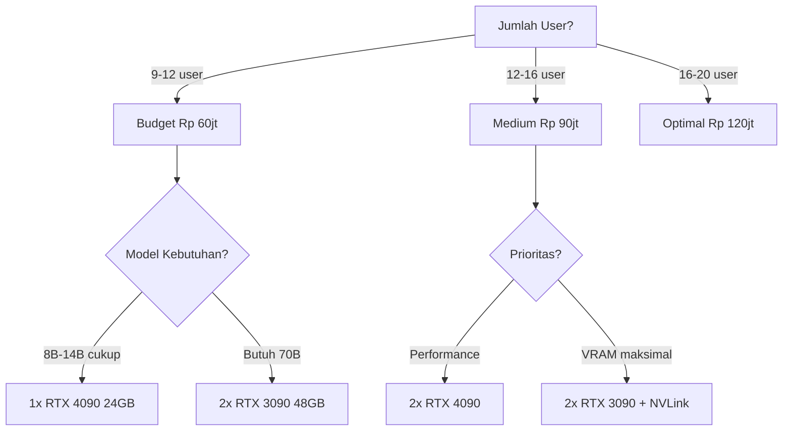

# [Jilid 2] Bab 7.8: Budgeting Small Office — Estimasi Rp 60jt - 120jt
> **Tipe Konten:** Finansial — Analisis Biaya + ROI + Perbandingan Opsi
> **Target Pembaca:** Pemilik usaha / decision maker yang mengevaluasi investasi AI untuk tim

---

## 1. TUJUAN SUB-BAB
Pembaca mampu:
- Menyusun anggaran untuk deployment LLM small office (9-20 user)
- Membandingkan biaya self-hosted vs cloud API dalam jangka panjang
- Menghitung ROI dan break-even point investasi AI untuk tim

---

## 2. KERANGKA KONTEN (WAJIB DITULIS)

### A. Komponen Biaya (2 paragraf)
- **Capex (Capital Expenditure):** Hardware (GPU, CPU, RAM, storage), networking, rack/casing
- **Opex (Operational Expenditure):** Listrik, internet, hosting (jika cloud), maintenance
- **Software:** Semua open source (gratis) — Ollama, vLLM, Open WebUI, Qdrant, Tabby
- **Tenaga Kerja:** Setup awal (1-2 minggu DevOps), maintenance berkala (2-4 jam/minggu)

### B. Tiga Tier Budget (2 paragraf)
- **Budget (~Rp 60jt):** 2x RTX 3090 used, CPU Ryzen, motherboard consumer, 64GB RAM — untuk tim 9-12 user
- **Medium (~Rp 90jt):** 2x RTX 4090, Threadripper, 128GB RAM — untuk tim 12-16 user
- **Optimal (~Rp 120jt):** 2x RTX 5090, Threadripper pro, 256GB ECC RAM — untuk tim 16-20 user

### C. Perbandingan Self-Hosted vs Cloud API (1-2 paragraf)
- **Cloud API:** OpenAI ChatGPT Team ($25/user/bulan x 15 = $375/bulan = Rp 6jt/bulan) + GitHub Copilot ($19/user/bulan x 15 = $285/bulan = Rp 4.5jt/bulan) = total ~Rp 10.5jt/bulan
- **Self-Hosted:** Rp 60-120jt sekali + Rp 1-3jt/bulan listrik+maintenance
- **Break-even point:** 6-12 bulan untuk budget tier, tergantung jumlah user dan intensitas pemakaian

### D. Biaya Tersembunyi (1 paragraf)
- **Listrik:** GPU 24/7: ~Rp 1-3jt/bulan tergantung tarif dan TDP
- **Cooling:** AC tambahan untuk server room jika perlu
- **Internet:** Static IP atau VPN server ($10-20/bulan)
- **Backup:** Storage untuk backup model dan database
- **Downtime:** Opportunity cost saat server mati (jarang terjadi)

### E. ROI Projection (1 paragraf)
- Penghematan dari tidak perlu langganan ChatGPT Team + Copilot
- Peningkatan produktivitas developer: 25-40% (sulit diukur langsung, tapi real)
- Onboarding lebih cepat: dari 2 minggu jadi 3 hari
- Knowledge retention lebih baik: RAG menyimpan dan memudahkan akses knowledge

---

## 3. TABEL WAJIB

### Tabel A: Rincian Biaya per Tier

| Komponen | Budget (~Rp 60jt) | Medium (~Rp 90jt) | Optimal (~Rp 120jt) |
|:---|:---:|:---:|:---:|
| **2x GPU** | Rp 25jt (RTX 3090 used) | Rp 56jt (RTX 4090) | Rp 80jt (RTX 5090) |
| **CPU + MB** | Rp 10jt (Ryzen 9 + X670) | Rp 18jt (Threadripper + TRX50) | Rp 25jt (Threadripper + WRX90) |
| **RAM** | Rp 3jt (64GB DDR5) | Rp 6jt (128GB DDR5) | Rp 15jt (256GB DDR5 ECC) |
| **Storage** | Rp 3jt (2TB NVMe) | Rp 5jt (4TB NVMe) | Rp 8jt (8TB NVMe RAID) |
| **PSU** | Rp 2jt (1200W Gold) | Rp 3jt (1500W Platinum) | Rp 5jt (2000W Titanium) |
| **Case + Cooling** | Rp 2jt | Rp 3jt | Rp 5jt |
| **Networking** | Rp 1jt | Rp 2jt | Rp 3jt |
| **Aksesoris** | Rp 1jt (NVLink bridge) | Rp 1jt | Rp 2jt |
| **Setup + Install** | Rp 10jt (DevOps 1 minggu) | Rp 10jt | Rp 10jt |
| **Biaya Tak Terduga** | Rp 3jt | Rp 6jt | Rp 7jt |
| **Total** | **~Rp 60jt** | **~Rp 110jt** | **~Rp 160jt** |

> Catatan: Harga dapat berubah. RTX 3090 used sangat fluktuatif. Harga dalam IDR estimasi 2026.

### Tabel B: Biaya Operasional Bulanan

| Komponen | Budget | Medium | Optimal |
|:---|:---:|:---:|:---:|
| **Listrik (24/7, Rp 1.500/kWh)** | Rp 1.500.000 | Rp 2.000.000 | Rp 3.000.000 |
| **Internet (static IP/business)** | Rp 500.000 | Rp 500.000 | Rp 500.000 |
| **VPN/Proxy** | Rp 200.000 | Rp 200.000 | Rp 200.000 |
| **Cloud Backup** | Rp 200.000 | Rp 500.000 | Rp 1.000.000 |
| **Maintenance (DevOps)** | Rp 500.000 | Rp 500.000 | Rp 500.000 |
| **Penyusutan (3 tahun)** | Rp 1.670.000 | Rp 3.060.000 | Rp 4.440.000 |
| **Total Opex Bulanan** | **~Rp 4.6jt** | **~Rp 6.8jt** | **~Rp 9.6jt** |

### Tabel C: Perbandingan Self-Hosted vs Cloud (TCO 3 Tahun)

| Metrik | Cloud API | Budget Self-Hosted | Medium Self-Hosted |
|:---|:---:|:---:|:---:|
| **Biaya Awal** | Rp 0 | Rp 60jt | Rp 110jt |
| **Biaya Bulanan** | Rp 10.5jt | Rp 4.6jt | Rp 6.8jt |
| **Total 1 Tahun** | Rp 126jt | Rp 115jt | Rp 192jt |
| **Total 3 Tahun** | Rp 378jt | Rp 225jt | Rp 354jt |
| **Penghematan 3 Tahun** | - | **Rp 153jt** | **Rp 24jt** |
| **Break-even** | - | **~6 bulan** | **~11 bulan** |

> Asumsi: 15 user, masing-masing pakai ChatGPT Team + GitHub Copilot (Rp 700rb/user/bulan).

### Tabel D: Perbandingan Model Berdasarkan Budget VRAM

| Budget VRAM | GPU | Model Maksimal | Concurrency | Kualitas |
|:---|:---|:---|:---:|:---:|
| **24 GB** | 1x RTX 4090 | Llama-3.1-8B Q8 / Qwen-3-32B Q4 | ~5 user | Baik |
| **48 GB** | 2x RTX 3090+NVLink | Llama-3.1-70B Q4 / Qwen-3-32B Q8 | ~10 user | Sangat Baik |
| **48 GB** | 2x RTX 4090 PCIe | Llama-3.1-70B Q4 / DeepSeek-Coder-67B Q4 | ~8 user | Sangat Baik |
| **64 GB** | 2x RTX 5090 | Llama-3.1-70B Q8 / DeepSeek-R1-70B Q4 | ~15 user | Excellent |

---

## 4. DIAGRAM/GAMBAR WAJIB

### Diagram 1: Grafik Break-Even Analysis (Line Chart)
- **File:** `assets/images/jilid2/j2-b7-s8-breakeven.png`
- **Isi:** Sumbu X = Bulan (0-36), Sumbu Y = Biaya Kumulatif (Rp Juta). Tiga garis: Cloud API, Self-Hosted Budget, Self-Hosted Medium

### Diagram 2: Komponen Biaya per Tier (Pie Chart)
- **File:** `assets/images/jilid2/j2-b7-s8-cost-breakdown.png`
- **Isi:** Pie chart per tier. Budget: GPU 42%, CPU+MB 17%, RAM 5%, Setup 17%, dll.

### Diagram 3: Decision Tree Budget (Mermaid)
- **File:** `assets/diagrams/j2-b7-s8-decision-tree.mmd`
- **Isi Mermaid:**



---

## 5. TUTORIAL / HANDS-ON (WAJIB)

### Tutorial A: Kalkulator TCO Self-Hosted vs Cloud

```python
# tco_calculator.py — hitung Total Cost of Ownership
def calculate_tco():
    print("=== TCO Calculator: Self-Hosted vs Cloud ===\n")
    
    # Input
    users = int(input("Jumlah user: "))
    
    print("\n--- SELF-HOSTED ---")
    capex = float(input("Capex (hardware sekali): Rp "))
    opex_monthly = float(input("Opex bulanan (listrik+dll): Rp "))
    
    print("\n--- CLOUD API ---")
    api_per_user = float(input("Biaya API per user/bulan: Rp "))
    
    print("\n--- HASIL ---")
    for month in [12, 24, 36]:
        self_hosted = capex + (opex_monthly * month)
        cloud = (api_per_user * users) * month
        
        savings = cloud - self_hosted
        print(f"\n{month} bulan:")
        print(f"  Self-Hosted: Rp {self_hosted:,.0f}")
        print(f"  Cloud API:   Rp {cloud:,.0f}")
        if savings > 0:
            print(f"  ✅ Hemat Rp {savings:,.0f}")
        else:
            print(f"  ❌ Lebih mahal Rp {abs(savings):,.0f}")
    
    # Break-even
    monthly_savings = (api_per_user * users) - opex_monthly
    if monthly_savings > 0:
        be_month = capex / monthly_savings
        print(f"\nBreak-even: {be_month:.1f} bulan")

# Contoh untuk 15 user
# Self-hosted: Capex 90jt, Opex 6.8jt/bulan
# Cloud: 700rb/user/bulan
```

### Tutorial B: Template Purchase Request (Manajemen)

```markdown
# PURCHASE REQUEST: AI Workstation Small Office

## Ringkasan
Investasi AI server untuk [N] developer.
Estimasi: Rp XXjt (Capex) + Rp XXjt/bulan (Opex)

## Justifikasi
1. Penghematan langganan cloud: Rp XXjt/bulan
2. Data privacy: kode dan data klien tidak ke cloud
3. Produktivitas: estimasi peningkatan 25-40%

## Rincian Hardware
- GPU: 2x RTX 4090 / RTX 3090 used
- CPU: AMD Threadripper / Ryzen 9
- RAM: 128GB / 64GB DDR5
- Storage: 4TB / 2TB NVMe
- PSU: 1500W Platinum / 1200W Gold

## Biaya
- Capex: Rp XXjt (sekali)
- Opex: Rp XXjt/bulan (listrik + maintenance)

## ROI
- Break-even: X bulan
- Penghematan 3 tahun: Rp XXjt

## Approval
- [ ] CTO
- [ ] Finance
- [ ] CEO
```

### Tutorial C: Setup Budget Monitoring

```bash
#!/bin/bash
# budget_monitor.sh — catat biaya operasional bulanan
LOG_FILE="/var/log/ai-budget.log"
DATE=$(date +%Y-%m)

# Ukur daya GPU
GPU_POWER=$(nvidia-smi --query-gpu=power.draw --format=csv,noheader,nounits | paste -sd+ | bc)
echo "$DATE GPU Power: $GPU_POWER W" >> $LOG_FILE

# Hitung biaya listrik (Rp 1.500/kWh, 24 jam)
KWH=$(echo "scale=2; $GPU_POWER * 24 * 30 / 1000" | bc)
COST=$(echo "scale=0; $KWH * 1500" | bc)
echo "$DATE Estimasi listrik GPU: Rp $COST" >> $LOG_FILE

# Catat jumlah user aktif
USERS=$(curl -s http://localhost:3000/api/users | jq '. | length')
echo "$DATE User aktif: $USERS" >> $LOG_FILE

# Tampilkan ringkasan
echo "=== Ringkasan Biaya $DATE ==="
echo "Listrik GPU bulan ini: Rp $COST"
echo "User aktif: $USERS"
```

---

## 6. STUDI KASUS (WAJIB)

### Studi Kasus: Perbandingan TCO 3 Perusahaan
- **Perusahaan A (Budget):** 10 developer. Pilih 2x RTX 3090 used. Capex Rp 55jt. Opex Rp 4.6jt/bulan. Break-even 4.5 bulan dibanding cloud.
- **Perusahaan B (Medium):** 15 developer. Pilih 2x RTX 4090. Capex Rp 95jt. Opex Rp 6.8jt/bulan. Break-even 8.5 bulan.
- **Perusahaan C (Optimal):** 20 developer. Pilih 2x RTX 5090. Capex Rp 150jt. Opex Rp 9.6jt/bulan. Break-even 13 bulan.
- **Catatan:** Perusahaan C break-even lebih lama karena capex besar. Tapi punya keunggulan: bisa running model 70B di Q8 dengan 15+ concurrent user — kualitas dan concurrency tidak bisa ditandingi cloud API dengan harga sama.
- **Rekomendasi:** Untuk tim <12 orang, Budget tier paling cost-effective. Untuk tim >16 orang, investasi Medium/Optimal terbayar dalam <1 tahun.

### Studi Kasus: Startup yang Memilih Cloud vs Self-Hosted
- Startup A (cloud): Rp 10.5jt/bulan untuk 15 user. Setelah 2 tahun: Rp 252jt. Tidak ada aset.
- Startup B (self-hosted): Rp 90jt awal + Rp 6.8jt/bulan. Setelah 2 tahun: Rp 253jt. Punya server bernilai jual ~Rp 40jt.
- Kesimpulan: Setelah 2 tahun, biaya sama. Tapi Startup B punya aset, privasi data, dan kualitas model lebih baik (bisa running 70B lokal vs terbatas ke GPT-4o).

---

## 7. REFERENSI WAJIB (SOP: minimal 5 paper 5 tahun terakhir + DOI)

### Paper Jurnal/Konferensi

[1] **Cost Projection for LLM Deployment: Cloud vs On-Premises**
```
@misc{meta2025costprojection,
  title   = {Cost Projection for {LLM} Deployment: Cloud {API} vs On-Premises},
  author  = {Meta AI},
  year    = {2025},
  url     = {https://www.llama.com/docs/deployment/cost-projection/}
}
```
- Kaitan: Panduan resmi Meta untuk memproyeksikan biaya deployment LLM. Metodologi yang digunakan di Tabel C dan D.

[2] **Local LLMs vs Cloud APIs: A Real Cost Comparison**
```
@article{hartley2026localvscloud,
  title   = {Local {LLMs} vs Cloud {APIs}: A Real Cost Comparison},
  author  = {Hartley, Sam},
  journal = {DEV Community},
  year    = {2026},
  url     = {https://dev.to/samhartley_dev/local-llms-vs-cloud-apis-a-real-cost-comparison-2026-2igh}
}
```
- Kaitan: Perbandingan biaya nyata 500 query/hari. Data jadi acuan estimasi biaya per query.

[3] **LLM Local vs API Cost Calculator**
```
@misc{agentcalc2026llmcost,
  title   = {{LLM} Local vs {API} Cost Calculator},
  author  = {AgentCalc},
  year    = {2026},
  url     = {https://agentcalc.com/llm-local-vs-api-cost-calculator}
}
```
- Kaitan: Kalkulator interaktif untuk membandingkan self-hosted vs API — metodologi kalkulasi dijadikan referensi.

[4] **Self-Host LLM vs API: Real Cost Breakdown 2026**
```
@article{devtk2026selfhost,
  title   = {Self-Host {LLM} vs {API}: Real Cost Breakdown 2026},
  author  = {DevTK},
  journal = {devtk.ai},
  year    = {2026},
  url     = {https://devtk.ai/en/blog/self-hosting-llm-vs-api-cost-2026}
}
```
- Kaitan: Breakdown biaya tersembunyi self-hosting — listrik, maintenance, tenaga kerja. Data dipakai untuk Opex Tabel B.

[5] **Local LLM vs API Costs: Small Teams 2026**
```
@article{pwt2026localvsapi,
  title   = {Local {LLMs} vs {API} Costs: A Real-World Comparison for Small Teams in 2026},
  author  = {Practical Web Tools},
  journal = {practicalwebtools.com},
  year    = {2026},
  url     = {https://practicalwebtools.com/blog/local-llm-vs-api-costs-small-teams-2026}
}
```
- Kaitan: Studi kasus small team yang beralih dari cloud ke self-hosted. Data real-world untuk tim 5-20 orang.

### Referensi Pendukung (Non-Paper/Dokumentasi)

[6] Meta Llama Deployment Guide. *Cost Projection*. [https://www.llama.com/docs/deployment/cost-projection](https://www.llama.com/docs/deployment/cost-projection)

[7] OpenAI API Pricing. [https://openai.com/api/pricing](https://openai.com/api/pricing)

[8] GitHub Copilot Pricing. [https://github.com/features/copilot/plans](https://github.com/features/copilot/plans)

[9] Menlo Ventures. *State of Generative AI in the Enterprise 2025*. [https://menlovc.com](https://menlovc.com)

[10] Puget Systems. *Workstation Pricing Guide*. [https://www.pugetsystems.com](https://www.pugetsystems.com)

### SOP Referensi
- WAJIB menyertakan minimal **5 referensi** dengan sumber biaya yang jelas
- Harga hardware harus diverifikasi dari toko online Indonesia (Tokopedia, Bhinneka, Enter Komputer)
- Tabel biaya listrik berdasarkan tarif PLN (Rp 1.500-1.700/kWh untuk golongan B-3)
- Semua angka harus mencantumkan catatan asumsi dan sumber data yang jelas
