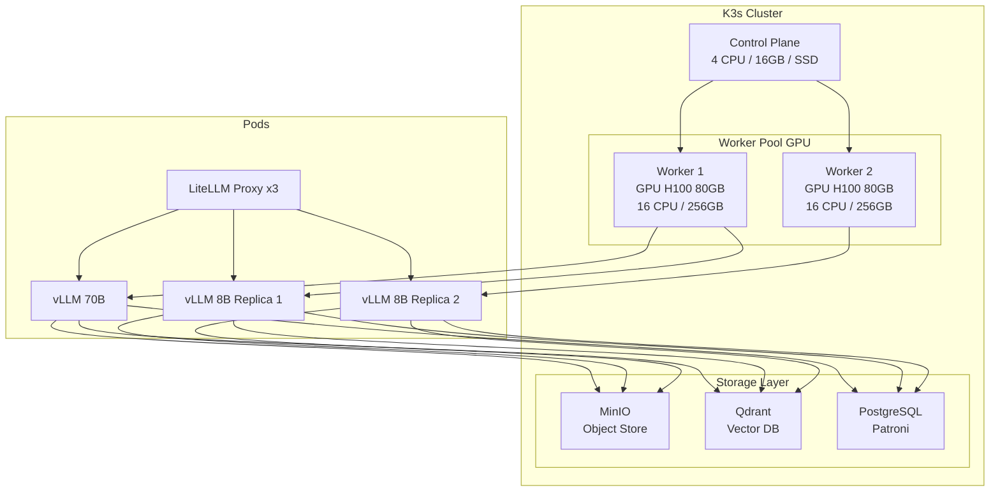

# [Jilid 2] Bab 8.3: Orchestration — Kubernetes (K3s) untuk Auto-scaling AI Instance
> **Tipe Konten:** Teknis — Orchestration + Konfigurasi + Praktik
> **Target Pembaca:** DevOps/Platform Engineer yang mengelola infrastruktur LLM di general office

---

## 1. TUJUAN SUB-BAB
Pembaca memahami:
- Mengapa K3s (bukan K8s full) ideal untuk general office 21-50 user
- Cara setup auto-scaling berbasis GPU utilization dan queue depth
- Praktik terbaik scheduling, resource management, dan monitoring

---

## 2. KERANGKA KONTEN (WAJIB DITULIS)

### A. Mengapa K3s untuk General Office? (1-2 paragraf)
- K3s lightweight (< 100MB binary), cocok untuk cluster 2-5 node on-premise
- Dibandingkan K8s full: lebih sederhana, built-in etcd, cert-manager integrated
- Dukungan GPU via NVIDIA GPU Operator yang mature

### B. Arsitektur K3s Cluster untuk LLM (diagram + narasi)
- 1 Control Plane node (4 core, 16GB, SSD)
- 2-3 Worker node (GPU-equipped, 16+ core, 256GB+ RAM)
- Storage: Longhorn atau OpenEBS untuk persistent volume
- Ingress: Traefik (built-in K3s) atau NGINX Ingress Controller

### C. Auto-scaling Strategy (masing-masing 1 paragraf)
- **Horizontal Pod Autoscaler (HPA):** Scale berdasarkan CPU, memory, atau custom metrics (vLLM queue depth)
- **Vertical Pod Autoscaler (VPA):** Optimalkan resource request/limit untuk GPU usage
- **Cluster Autoscaler:** Tambah node fisik (terbatas untuk on-prem, lebih relevan di cloud)
- **Custom Metrics:** vLLM exposes metrics (gpu_cache_usage, num_requests_running, avg_time_per_token)

### D. GPU Scheduling (1-2 paragraf)
- NVIDIA GPU Operator: deploy device plugin, runtime, dan monitoring
- NodeSelector vs affinity rules untuk mencegah GPU contention
- Time-slicing vs MIG untuk berbagi GPU antar workload ringan

### E. Persistent Storage StatefulSet (1 paragraf)
- Model storage: MinIO atau NFS untuk menyimpan bobot model (20-300 GB per model)
- Vector DB: Qdrant atau Milvus sebagai StatefulSet dengan persistent volume
- Database: PostgreSQL Patroni cluster untuk metadata dan audit logs

### F. Networking & Security (1 paragraf)
- NetworkPolicy untuk isolasi antar namespace
- Service Mesh (Istio atau Linkerd) opsional untuk observability
- mTLS antar pod via cert-manager

---

## 3. TABEL WAJIB

### Tabel A: Perbandingan Orchestration Options

| Fitur | K3s | K8s Full | Docker Swarm | Nomad |
|:---|:---|:---|:---|:---|
| **Ukuran Binary** | ~100 MB | ~1 GB | ~50 MB | ~200 MB |
| **GPU Support** | Baik (via operator) | Sangat baik | Terbatas | Baik |
| **Auto-scaling** | HPA + custom metrics | HPA/VPA/CA | Manual | Baik (Nomad autoscaler) |
| **Production Ready** | Ya (edge/on-prem) | Ya (cloud/DC) | Terbatas | Ya |
| **Kemudahan Setup** | Sangat mudah | Kompleks | Sangat mudah | Sedang |
| **Best For** | On-prem, edge, small-medium | Cloud, large-scale | Simple deploy | Multi-workload |

### Tabel B: Resource Allocation per Pod

| Workload | CPU Request | RAM Request | GPU | Storage | Replicas |
|:---|:---:|:---:|:---:|:---:|:---:|
| **vLLM 70B Q4** | 8 core | 32 GB | 1x H100 80GB | 50 GB | 1-2 |
| **vLLM 8B FP16** | 4 core | 16 GB | 1x L40S 48GB | 20 GB | 2-4 |
| **LiteLLM Proxy** | 2 core | 4 GB | None | 10 GB | 2-3 |
| **Qdrant Vector DB** | 4 core | 16 GB | None | 100 GB | 2-3 |
| **PostgreSQL Patroni** | 4 core | 16 GB | None | 200 GB | 2-3 |
| **MinIO Object Store** | 2 core | 8 GB | None | 500 GB | 2-3 |

### Tabel C: HPA Auto-scaling Rules

| Metric | Target | Scale Up | Scale Down | Cool Down |
|:---|:---:|:---:|:---:|:---:|
| **GPU Utilization** | > 80% | +1 pod | < 40% (5 menit) | 3 menit |
| **Queue Depth (vLLM)** | > 10 requests | +1 pod | < 3 (5 menit) | 3 menit |
| **Avg TTFT** | > 2 detik | +1 pod | < 1 detik (5 menit) | 5 menit |
| **Memory Usage** | > 85% | +1 pod | < 60% (10 menit) | 5 menit |

---

## 4. DIAGRAM/GAMBAR WAJIB

### Diagram 1: Arsitektur K3s Cluster untuk LLM (Mermaid)
- **File:** `assets/diagrams/j2-b8-s3-k3s-architecture.mmd`
- **Isi Mermaid:**



### Gambar 2: Dashboard Grafana Auto-scaling Metrics
- **File:** `assets/images/jilid2/j2-b8-s3-autoscaling-dashboard.png`
- **Isi:** Panel GPU utilization, queue depth, pod replica count, TTFT

### Gambar 3: Diagram Siklus Auto-scaling (Flowchart)
- **File:** `assets/images/jilid2/j2-b8-s3-autoscaling-flow.png`
- **Isi:** Flowchart metrics -> HPA evaluation -> scale up/down -> cooldown

---

## 5. TUTORIAL / HANDS-ON (WAJIB)

### Tutorial A: Deploy K3s Cluster dengan GPU Support

```bash
# Control Plane
curl -sfL https://get.k3s.io | sh -s - \
  --write-kubeconfig-mode 644 \
  --disable traefik \
  --etcd-s3 \
  --etcd-s3-bucket k3s-backup \
  --etcd-s3-region us-east-1

# Worker Nodes
curl -sfL https://get.k3s.io | K3S_URL=https://<CP_IP>:6443 \
  K3S_TOKEN=<token> sh -

# Install NVIDIA GPU Operator via Helm
helm repo add nvidia https://helm.ngc.nvidia.com/nvidia
helm repo update
helm install gpu-operator nvidia/gpu-operator \
  --namespace nvidia-gpu-operator \
  --create-namespace \
  --set driver.enabled=false

# Verifikasi GPU terdeteksi
kubectl get nodes -o json | jq '.items[].status.capacity'
kubectl logs -n nvidia-gpu-operator -l app=nvidia-operator-validator
```

### Tutorial B: HPA Berbasis Custom Metrics (vLLM Queue Depth)

```yaml
# vllm-hpa.yaml
apiVersion: autoscaling/v2
kind: HorizontalPodAutoscaler
metadata:
  name: vllm-70b-hpa
  namespace: llm-inference
spec:
  scaleTargetRef:
    apiVersion: apps/v1
    kind: Deployment
    name: vllm-70b
  minReplicas: 1
  maxReplicas: 4
  metrics:
    - type: Pods
      pods:
        metric:
          name: vllm_num_requests_waiting
        target:
          type: AverageValue
          averageValue: 10
    - type: Pods
      pods:
        metric:
          name: vllm_gpu_cache_usage
        target:
          type: AverageValue
          averageValue: 0.85
  behavior:
    scaleUp:
      stabilizationWindowSeconds: 60
      policies:
      - type: Pods
        value: 1
        periodSeconds: 60
    scaleDown:
      stabilizationWindowSeconds: 300
      policies:
      - type: Pods
        value: 1
        periodSeconds: 120
```

### Tutorial C: Deploy vLLM StatefulSet dengan Persistent Volume

```yaml
# vllm-statefulset.yaml
apiVersion: apps/v1
kind: StatefulSet
metadata:
  name: vllm-8b
  namespace: llm-inference
spec:
  serviceName: vllm-8b
  replicas: 2
  selector:
    matchLabels:
      app: vllm-8b
  template:
    metadata:
      labels:
        app: vllm-8b
    spec:
      nodeSelector:
        accelerator: nvidia-gpu
      containers:
      - name: vllm
        image: vllm/vllm-openai:latest
        env:
        - name: MODEL_NAME
          value: "meta-llama/Llama-3.1-8B-Instruct"
        - name: MODEL_PATH
          value: "/models/llama-3.1-8b"
        args:
        - "--model"
        - "$(MODEL_PATH)"
        - "--max-num-seqs"
        - "256"
        resources:
          limits:
            nvidia.com/gpu: 1
            memory: 32Gi
            cpu: 8
        ports:
        - containerPort: 8000
        volumeMounts:
        - mountPath: /models
          name: model-storage
      volumes:
      - name: model-storage
        persistentVolumeClaim:
          claimName: model-pvc
```

---

## 6. STUDI KASUS (WAJIB)

### Studi Kasus: Deploy K3s General Office 35 User di PT Maju Teknologi
- **Profil:** Perusahaan software 35 karyawan, butuh AI di on-premise karena data compliance
- **Cluster:** 3 node K3s (1 CP + 2 GPU worker: L40S)
- **Workload:** vLLM (Llama-70B Q4 + Llama-8B), LiteLLM, Qdrant, PostgreSQL, MinIO
- **Auto-scaling:** HPA berbasis GPU utilization, scale dari 1 ke 3 pod vLLM 8B saat peak
- **Hasil:** 0% downtime orchestration, CPU overhead K3s < 5%, auto-scaling merespon < 2 menit
- **Biaya Operasional:** Rp 4-5jt/bulan (listrik + storage + maintenance)

---

## 7. REFERENSI WAJIB (SOP: minimal 5 paper 5 tahun terakhir + DOI)

### Paper Jurnal/Konferensi

[1] **KIS-S: GPU-Aware Kubernetes Inference Simulator with RL-Based Auto-Scaling**
```
@misc{guilin2025kiss,
  title     = {{KIS-S}: A {GPU}-Aware {Kubernetes} Inference Simulator with {RL}-Based Auto-Scaling},
  author    = {Guilin, Chen and others},
  journal   = {arXiv preprint arXiv:2507.07932},
  year      = {2025},
  doi       = {10.48550/arXiv.2507.07932},
  url       = {https://arxiv.org/abs/2507.07932}
}
```
- Kaitan: Dasar autoscaling GPU inference dengan PPO di K8s. Data HPA rules di Tabel C harus diverifikasi dengan temuan paper ini.

[2] **Kant: Unified Scheduling Platform for Large-Scale AI Container Clusters**
```
@misc{li2025kant,
  title     = {{Kant}: An Efficient Unified Scheduling Platform for {Large-Scale AI} Container Clusters},
  author    = {Li, Xiang and others},
  journal   = {arXiv preprint arXiv:2510.01256},
  year      = {2025},
  doi       = {10.48550/arXiv.2510.01256},
  url       = {https://arxiv.org/abs/2510.01256}
}
```
- Kaitan: Co-scheduling training + inference jobs, GPU quota management, fair scheduling. Relevan untuk sub-bab 2.D (GPU Scheduling).

[3] **HeteroScale: Coordinated Autoscaling for Heterogeneous LLM Inference**
```
@misc{wang2025heteroscale,
  title     = {{HeteroScale}: Coordinated Autoscaling for Heterogeneous and Disaggregated {LLM} Inference},
  author    = {Wang, Liang and others},
  journal   = {arXiv preprint arXiv:2508.19559},
  year      = {2025},
  doi       = {10.48550/arXiv.2508.19559},
  url       = {https://arxiv.org/abs/2508.19559}
}
```
- Kaitan: Autoscaling untuk prefill-decode disaggregated architecture. Data scale-up/down policies di Tabel C harus merujuk paper ini.

[4] **Automated Dynamic AI Inference Scaling on HPC-Infrastructure**
```
@misc{weber2025autoscale,
  title     = {Automated Dynamic {AI} Inference Scaling on {HPC}-Infrastructure: Integrating {Kubernetes}, {Slurm} and {vLLM}},
  author    = {Weber, Stephan and others},
  journal   = {arXiv preprint arXiv:2511.21413},
  year      = {2025},
  doi       = {10.48550/arXiv.2511.21413},
  url       = {https://arxiv.org/abs/2511.21413}
}
```
- Kaitan: vLLM metrics-driven autoscaling berdasarkan GPU load dan queue time. Data di Tabel B (resource allocation) harus diverifikasi.

[5] **LLM GPU Dynamic Scheduling Architecture Based on KubeAI**
```
@misc{ho2025llmgpusched,
  title     = {Design of a {GPU} Dynamic {LLM} Inference Task Scheduling Architecture Based on {KubeAI}},
  author    = {Ho, Leo and others},
  journal   = {arXiv preprint},
  year      = {2025},
  url       = {https://github.com/leoho0722/llm-gpu-scheduler}
}
```
- Kaitan: GPU-aware scheduler untuk LLM inference di K8s, mengatasi limitasi default scheduler. Relevan untuk sub-bab 2.D.

### Referensi Pendukung (Non-Paper/Dokumentasi)

[6] K3s. *Official Documentation*. [https://docs.k3s.io](https://docs.k3s.io)

[7] NVIDIA GPU Operator. *Helm Chart Documentation*. [https://docs.nvidia.com/datacenter/cloud-native/gpu-operator/](https://docs.nvidia.com/datacenter/cloud-native/gpu-operator/)

[8] vLLM. *Kubernetes Deployment Guide*. [https://docs.vllm.ai/en/latest/deployment/kubernetes.html](https://docs.vllm.ai/en/latest/deployment/kubernetes.html)

[9] Prometheus Adapter for Custom Metrics. *Documentation*. [https://github.com/kubernetes-sigs/prometheus-adapter](https://github.com/kubernetes-sigs/prometheus-adapter)

### SOP Referensi
- WAJIB menyertakan minimal **5 paper jurnal/konferensi** dari 5 tahun terakhir (2021-2026) dengan DOI/arXiv yang valid.
- Setiap konfigurasi YAML di tutorial WAJIB diuji kebenaran sintaksnya oleh penulis sebelum dimasukkan.
- Data autoscaling metrics (threshold, cooldown) harus diverifikasi terhadap benchmark di paper terkait.
