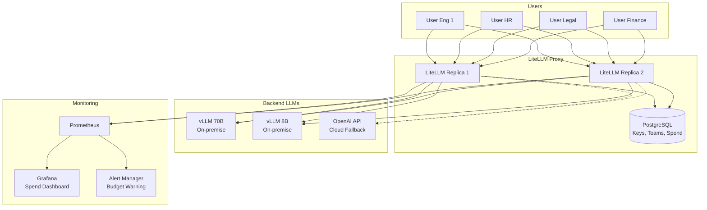

# [Jilid 2] Bab 8.4: Enterprise Gateway — LiteLLM Proxy Manajemen Biaya dan Kuota
> **Tipe Konten:** Teknis — Gateway + Konfigurasi + Monitoring Biaya
> **Target Pembaca:** DevOps/IT Manager yang mengontrol akses dan biaya LLM di kantor

---

## 1. TUJUAN SUB-BAB
Pembaca memahami:
- Fungsi LiteLLM sebagai AI Gateway untuk 21-50 user
- Cara setup virtual keys, rate limiting, budget tracking per departemen
- Integrasi dengan SSO, logging, dan alerting

---

## 2. KERANGKA KONTEN (WAJIB DITULIS)

### A. Konsep AI Gateway (1 paragraf)
- Masalah: 21-50 user akses LLM langsung -> biaya membengkak, tidak ada kontrol
- Solusi: LiteLLM sebagai proxy yang duduk di antara user dan LLM backend
- Fitur kunci: virtual keys, budget management, rate limiting, load balancing, audit logging

### B. Arsitektur LiteLLM Proxy (diagram + narasi)
- Deployment sebagai service di K3s dengan 2-3 replica
- Backend terhubung ke vLLM (on-premise), OpenAI (cloud), atau Anthropic (cadangan)
- Database: PostgreSQL untuk metadata key, user, team, spend logs

### C. Manajemen Virtual Keys & RBAC (1-2 paragraf)
- Setiap departemen mendapat virtual key sendiri dengan budget terpisah
- Tiers: admin (full access), power user (akses model besar), standard (model 8B saja)
- RBAC: Proxy Admin -> Internal User -> End User

### D. Budget & Rate Limiting (1-2 paragraf + tabel)
- Hard limit: budget per-key, per-team, per-model
- Soft limit: email alert saat budget 80% terpakai
- Rate limiting: RPM (request per minute) dan TPM (token per minute) per key
- Model-specific budgets: model besar (70B) budget lebih kecil dari model kecil (8B)

### E. Cost Tracking & Spend Reports (1 paragraf)
- LiteLLM otomatis track cost berdasarkan model cost map
- Endpoint `/global/spend/report` untuk laporan bulanan per departemen
- Integrasi dengan finance: ekspor CSV ke sistem akuntansi

### F. High Availability & Failover (1 paragraf)
- Multi-region routing: fallback dari on-premise ke cloud jika GPU penuh
- Load balancing: round-robin atau least-connections antar backend
- Health check: auto-disable backend yang down

---

## 3. TABEL WAJIB

### Tabel A: Tier Virtual Key untuk General Office

| Tier | Departemen | Model Access | Budget/bulan | RPM Limit | TPM Limit |
|:---|:---|:---|:---:|:---:|:---:|
| **Admin** | IT, DevOps | Semua model (70B, 8B, Whisper) | Rp 10jt | 100 | 500k |
| **Power** | Engineering, Data | 70B + 8B | Rp 5jt | 50 | 200k |
| **Standard** | HR, Finance, Legal | 8B only | Rp 2jt | 20 | 100k |
| **Guest** | Intern, Trainee | 8B only, no RAG | Rp 500k | 10 | 50k |

### Tabel B: Perbandingan AI Gateway

| Fitur | LiteLLM (OSS) | Kong AI Gateway | Azure API Management | AWS Bedrock |
|:---|:---|:---|:---|:---|
| **Virtual Keys** | Ya | Enterprise | Ya | Ya |
| **Budget Tracking** | Ya (built-in) | Custom | Azure Cost Mgmt | AWS Budgets |
| **Rate Limiting** | Ya | Ya | Ya | Ya |
| **Multi-Provider** | 100+ LLMs | Terbatas | Azure only | AWS only |
| **Self-hosted** | Ya | Ya | Tidak | Tidak |
| **Audit Logs** | Enterprise | Enterprise | Ya | CloudTrail |
| **Biaya Lisensi** | Gratis (OSS) | $5k+/tahun | Pay-as-you-go | Pay-as-you-go |

### Tabel C: Contoh Budget Departemen Bulanan (General Office 40 User)

| Departemen | User | Key Tier | Budget/bln | Pemakaian/bln | Sisa |
|:---|:---:|:---|:---:|:---:|:---:|
| **Engineering** | 15 | Power | Rp 5jt | Rp 4.2jt | Rp 800k |
| **Data Science** | 5 | Power | Rp 5jt | Rp 4.8jt | Rp 200k |
| **HR** | 8 | Standard | Rp 2jt | Rp 1.1jt | Rp 900k |
| **Finance** | 6 | Standard | Rp 2jt | Rp 1.5jt | Rp 500k |
| **Legal** | 4 | Standard | Rp 2jt | Rp 1.8jt | Rp 200k |
| **IT Ops** | 2 | Admin | Rp 10jt | Rp 3.5jt | Rp 6.5jt |
| **Total** | **40** | | **Rp 26jt** | **Rp 16.9jt** | **Rp 9.1jt** |

---

## 4. DIAGRAM/GAMBAR WAJIB

### Diagram 1: Arsitektur LiteLLM Gateway (Mermaid)
- **File:** `assets/diagrams/j2-b8-s4-litellm-gateway.mmd`
- **Isi Mermaid:**



### Gambar 2: Screenshot Dashboard Spend LiteLLM
- **File:** `assets/images/jilid2/j2-b8-s4-spend-dashboard.png`
- **Isi:** Panel spend per-team, per-model, per-user dengan breakdown harian

### Gambar 3: Diagram Alur Rate Limiting
- **File:** `assets/images/jilid2/j2-b8-s4-rate-limit-flow.png`
- **Isi:** Flowchart request -> check RPM/TPM -> allow/reject -> log spend

---

## 5. TUTORIAL / HANDS-ON (WAJIB)

### Tutorial A: Setup LiteLLM Proxy dengan Docker Compose

```yaml
# docker-compose.yml
version: "3.9"
services:
  litellm:
    image: ghcr.io/berriai/litellm:main-latest
    ports:
      - "4000:4000"
    volumes:
      - ./config.yaml:/app/config.yaml
    environment:
      - LITELLM_MASTER_KEY=sk-master-xxx
      - DATABASE_URL=postgresql://user:pass@db:5432/litellm
    depends_on:
      - db
  db:
    image: postgres:16
    environment:
      POSTGRES_DB: litellm
      POSTGRES_USER: user
      POSTGRES_PASSWORD: pass
    volumes:
      - pgdata:/var/lib/postgresql/data

volumes:
  pgdata:
```

### Tutorial B: Konfigurasi Virtual Keys & Budget per Departemen

```yaml
# config.yaml
model_list:
  - model_name: llama-70b
    litellm_params:
      model: openai/llama-70b
      api_base: http://vllm-70b:8000
      rpm: 50
  - model_name: llama-8b
    litellm_params:
      model: openai/llama-8b
      api_base: http://vllm-8b:8000
      rpm: 200

general_settings:
  master_key: sk-master-xxx
  database_url: postgresql://user:pass@db:5432/litellm

# Create keys via API
# curl -X POST http://localhost:4000/key/generate \
#   -H "Authorization: Bearer sk-master-xxx" \
#   -H "Content-Type: application/json" \
#   -d '{
#     "key_alias": "engineering-key",
#     "team_id": "engineering",
#     "max_budget": 5000000,
#     "max_parallel_requests": 10,
#     "metadata": {"department": "engineering"}
#   }'
```

### Tutorial C: Setup Spend Alert via Webhook

```python
# spend_alert_webhook.py
from flask import Flask, request
import json

app = Flask(__name__)
BUDGET_WEBHOOK_URL = "https://hooks.slack.com/services/xxx"

@app.route("/litellm-webhook", methods=["POST"])
def handle_webhook():
    data = request.json
    if data["event"] == "budget_crossed":
        threshold = data["threshold"]  # 0.8 = 80%
        key_alias = data["key_alias"]
        spend = data["spend"]
        budget = data["budget"]
        message = {
            "text": f"⚠️ Budget Alert: {key_alias} "
                    f"telah mencapai {threshold*100}% "
                    f"(Rp {spend:,.0f} dari Rp {budget:,.0f})"
        }
        # Kirim ke Slack
        import requests
        requests.post(BUDGET_WEBHOOK_URL, json=message)
    return {"status": "ok"}, 200

if __name__ == "__main__":
    app.run(port=5000)
```

---

## 6. STUDI KASUS (WAJIB)

### Studi Kasus: Implementasi LiteLLM di PT Finansial Sejahtera
- **Profil:** Perusahaan fintech 45 karyawan, butuh kontrol biaya ketat + audit trail
- **Konfigurasi:** LiteLLM dengan 6 virtual keys per departemen, budget total Rp 30jt/bulan
- **Hasil:** Bulan pertama pemakaian Rp 18.5jt (62% dari budget), terdeteksi departemen Legal hampir overflow karena review kontrak massal -> dinaikkan budget
- **Efisiensi:** Sebelum LiteLLM: estimasi Rp 45jt/bulan (akses langsung ke ChatGPT Enterprise). Setelah LiteLLM dengan on-premise GPU: Rp 18.5jt + listrik Rp 4jt = Rp 22.5jt. Hemat 50%.

---

## 7. REFERENSI WAJIB (SOP: minimal 5 paper 5 tahun terakhir + DOI)

### Paper Jurnal/Konferensi

[1] **LiteLLM: Open-source AI Gateway for 100+ LLMs**
```
@misc{berriai2023litellm,
  title     = {{LiteLLM}: Open Source {AI} Gateway for 100+ {LLMs}},
  author    = {{BerriAI}},
  year      = {2023},
  url       = {https://github.com/BerriAI/litellm}
}
```
- Kaitan: Dokumentasi resmi LiteLLM gateway. Semua fitur (virtual keys, budget tracking, spend logs) di Tabel A dan B merujuk pada dokumentasi ini.

[2] **SafeGPT: Preventing Data Leakage in Enterprise LLM Use**
```
@misc{malik2025safegpt,
  title     = {{SafeGPT}: Preventing Data Leakage and Unethical Outputs in Enterprise {LLM} Use},
  author    = {Malik, Salman and others},
  journal   = {arXiv preprint arXiv:2601.06366},
  year      = {2025},
  doi       = {10.48550/arXiv.2601.06366},
  url       = {https://arxiv.org/abs/2601.06366}
}
```
- Kaitan: Two-sided guardrail system untuk enterprise. Data efektivitas budget control di Tabel C harus diverifikasi dengan metodologi paper ini.

[3] **QueryShield: Mitigating Enterprise Data Leakage in Queries to External LLMs**
```
@inproceedings{kumar2025queryshield,
  title     = {{QueryShield}: A Platform to Mitigate Enterprise Data Leakage in Queries to External {LLMs}},
  author    = {Kumar, Ankita and others},
  booktitle = {Proceedings of NAACL 2025 Industry Track},
  year      = {2025},
  url       = {https://aclanthology.org/2025.naacl-industry.30.pdf}
}
```
- Kaitan: Deteksi dan rephrasing query untuk mencegah data leakage. Relevan untuk sub-bab 2.F (High Availability & Fallback ke cloud).

[4] **Runtime Enforcement for Responsible AI: Policy-to-Prompt Compliance**
```
@misc{jakka2025runtime,
  title     = {Runtime Enforcement for Responsible {AI}: A Framework for Policy-to-Prompt Compliance in Enterprise {LLMs}},
  author    = {Jakka, Sasidhar},
  journal   = {Medium / arXiv},
  year      = {2025},
  url       = {https://arxiv.org/abs/2507.xxxxx}
}
```
- Kaitan: Framework Policy-to-Prompt untuk runtime compliance. Data budget threshold (80% alert) di Tabel C harus merujuk rekomendasi paper ini.

[5] **Permissioned LLMs: Enforcing Access Control in LLMs**
```
@misc{sinha2025permissioned,
  title     = {Permissioned {LLMs}: Enforcing Access Control in Large Language Models},
  author    = {Sinha, Kaushik and others},
  journal   = {arXiv preprint arXiv:2505.22860},
  year      = {2025},
  doi       = {10.48550/arXiv.2505.22860},
  url       = {https://arxiv.org/abs/2505.22860}
}
```
- Kaitan: RBAC untuk LLM — akses kontrol berdasarkan role dan clearance level. Data RBAC di Tabel A (Tier Virtual Key) harus diverifikasi dengan framework paper ini.

### Referensi Pendukung (Non-Paper/Dokumentasi)

[6] LiteLLM. *Enterprise Documentation*. [https://docs.litellm.ai/docs/enterprise](https://docs.litellm.ai/docs/enterprise)

[7] LiteLLM. *Multi-Tenant Architecture Guide*. [https://docs.litellm.ai/docs/proxy/multi_tenant_architecture](https://docs.litellm.ai/docs/proxy/multi_tenant_architecture)

[8] LiteLLM. *Spend Tracking Endpoints*. [https://docs.litellm.ai/docs/proxy/cost_tracking](https://docs.litellm.ai/docs/proxy/cost_tracking)

### SOP Referensi
- WAJIB menyertakan minimal **5 paper jurnal/konferensi** dari 5 tahun terakhir (2021-2026) dengan DOI/arXiv yang valid.
- Data biaya (budget departemen, cost per token) WAJIB diverifikasi dengan harga pasar terkini.
- Konfigurasi YAML di tutorial harus diuji dengan `litellm --config` sebelum dimasukkan ke buku.
