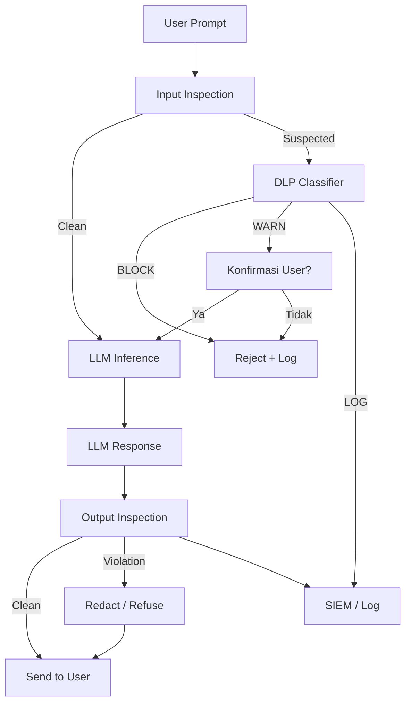

# [Jilid 2] Bab 8.5: Keamanan Tingkat Tinggi — Data Loss Prevention (DLP) Cegah Rahasia Bocor
> **Tipe Konten:** Keamanan — Analisis Risiko + Implementasi DLP + Kebijakan
> **Target Pembaca:** CISO/IT Security Manager yang menerapkan keamanan LLM di enterprise

---

## 1. TUJUAN SUB-BAB
Pembaca memahami:
- Ancaman data leakage spesifik untuk LLM di general office
- Implementasi DLP untuk mencegah rahasia perusahaan bocor melalui prompt/response
- Teknik deteksi: PII scanning, policy enforcement, output filtering

---

## 2. KERANGKA KONTEN (WAJIB DITULIS)

### A. Ancaman Data Leakage pada LLM (1-2 paragraf)
- Karyawan tidak sengaja memasukkan data sensitif (password, client data, source code proprietary) ke prompt
- Model bisa "mengingat" dan membocorkan data training ke user lain
- Skenario nyata: engineer paste API key ke prompt, HR upload CV tanpa redaksi

### B. Arsitektur DLP untuk LLM (diagram + narasi)
- **Input Side:** Prompt inspection sebelum mencapai LLM — cek PII, regex patterns, classifier
- **Output Side:** Response inspection — cek hallucination, policy violation, data leakage
- **Human-in-the-loop:** Prompt mencurigakan di-hold untuk review manual

### C. Teknik Deteksi (masing-masing 1 paragraf)
- **Pattern Matching:** Regex untuk NIK, passport, credit card, API key (sk-..., AKIA...)
- **Named Entity Recognition (NER):** Deteksi nama, alamat, nomor telepon via model NER
- **Classifier Model:** Fine-tuned BERT untuk klasifikasi sensitivitas dokumen
- **Vector Similarity:** Cek apakah prompt mirip dengan dokumen rahasia di vector DB

### D. Policy Enforcement (1-2 paragraf)
- Kebijakan DLP 3 level: BLOCK (tolak prompt), WARN (izinkan dengan peringatan), LOG (catat saja)
- Aturan per departemen: Legal boleh kirim kontrak ke LLM, Marketing tidak boleh
- Granularity: per-user, per-group, per-model, per-jenis data

### E. Response Sanitization (1 paragraf)
- Filter output: hapus PII dari response sebelum dikirim ke user
- Redaction: masked output (contoh: "Nama: ***") jika terdeteksi data sensitif
- Refusal: tolak generate response jika query mencurigakan

### F. Incident Response (1 paragraf)
- Log semua insiden DLP ke SIEM (Splunk, Wazuh, ELK)
- Notifikasi real-time ke security team via Slack/Email
- Post-mortem analysis: review prompt yang di-block, false positive rate

---

## 3. TABEL WAJIB

### Tabel A: Jenis Data Sensitif dan Deteksi

| Kategori | Contoh | Metode Deteksi | Action Default |
|:---|:---|:---|:---:|
| **PII (Personal)** | NIK, Passport, Alamat | Regex + NER | BLOCK |
| **Finance** | CC Number, Rekening | Luhn algorithm + Regex | BLOCK |
| **Credential** | API Key, Password, Token | Regex pattern (sk-*, AKIA*) | BLOCK + Alert |
| **Source Code** | Internal repo, proprietary | Classifier (fine-tuned) | WARN + LOG |
| **Client Data** | Nama klien, kontrak | Vector similarity | WARN |
| **Medical** | Diagnosis, rekam medis | NER medical entities | BLOCK |

### Tabel B: Perbandingan DLP Tools

| Tools | Input Inspection | Output Inspection | Self-hosted | Integrasi LLM | Harga |
|:---|:---:|:---:|:---:|:---|:---|
| **LLMGuard** | Ya | Ya | Ya | API-based | Gratis (OSS) |
| **SafeGPT** | Ya (redaction) | Ya (filter) | Ya | Plugin | Gratis (OSS) |
| **NeMo Guardrails** | Ya | Ya | Ya | LangChain/NVIDIA | Gratis (OSS) |
| **QueryShield** | Ya (rephrase) | Tidak | Ya | REST API | Research |
| **Guardrails AI** | Ya | Ya | Ya | SDK | OSS + Enterprise |

### Tabel C: DLP Policy Rules Contoh

| Rule ID | Pola | Scope | Action | Prioritas |
|:---|:---|:---|:---|:---:|
| **DLP-001** | `\b\d{16}\b` (CC Number) | All users | BLOCK | Critical |
| **DLP-002** | `sk-[a-zA-Z0-9]{20,}` | All users | BLOCK + Alert | Critical |
| **DLP-003** | `\b\d{6,}\b` (NIK mungkin) | Non-HR | WARN | High |
| **DLP-004** | Source code > 50 line | Engineering | LOG | Medium |
| **DLP-005** | Nama+Alamat (NER) | Marketing | WARN | Medium |
| **DLP-006** | URL internal `*.kantor.com` | All users | LOG | Low |

---

## 4. DIAGRAM/GAMBAR WAJIB

### Diagram 1: Pipeline DLP Input-Output (Mermaid)
- **File:** `assets/diagrams/j2-b8-s5-dlp-pipeline.mmd`
- **Isi Mermaid:**



### Gambar 2: Screenshot DLP Alert Dashboard
- **File:** `assets/images/jilid2/j2-b8-s5-dlp-alerts.png`
- **Isi:** Panel alert count, blocked prompts, false positive rate, top violated rules

### Gambar 3: Diagram Alur Incident Response DLP
- **File:** `assets/images/jilid2/j2-b8-s5-incident-response.png`
- **Isi:** Flowchart detect -> classify -> notify -> investigate -> remediate

---

## 5. TUTORIAL / HANDS-ON (WAJIB)

### Tutorial A: Setup LLMGuard untuk Input/Output Filtering

```python
# llm_guard_setup.py
from llm_guard.input_scanner import InputScanner
from llm_guard.output_scanner import OutputScanner
from llm_guard.detectors import Regex, BanTopics, Sensitive
from llm_guard.output.detectors import NoRefusal

# Input detectors
input_scanner = InputScanner(
    detectors=[
        Regex(
            patterns=[
                (r"\b\d{16}\b", "CREDIT_CARD"),
                (r"sk-[a-zA-Z0-9]{20,}", "OPENAI_KEY"),
                (r"AKIA[A-Z0-9]{16}", "AWS_KEY"),
                (r"\d{6}\s?\d{2}\s?\d{4}", "NIK"),
            ]
        ),
        BanTopics(topics=["cara meretas", "password admin", "data karyawan"]),
    ]
)

# Output detectors
output_scanner = OutputScanner(
    detectors=[
        Sensitive(entity_types=["EMAIL_ADDRESS", "PHONE_NUMBER", "CREDIT_CARD"]),
        NoRefusal(),
    ]
)

# Scan prompt
sanitized_prompt, is_valid, risk_score = input_scanner.scan(prompt)
if not is_valid:
    print(f"[BLOCKED] Risk: {risk_score}")
    # Log ke SIEM
else:
    response = llm.generate(sanitized_prompt)
    sanitized_response, is_valid, risk_score = output_scanner.scan(response)
```

### Tutorial B: Konfigurasi DLP Policy di LiteLLM Guardrails

```yaml
# litellm_dlp_config.yaml
guardrails:
  - name: pii-detection
    type: input
    detectors:
      - regex_pattern: '\b\d{16}\b'
        label: credit_card
        action: block
      - regex_pattern: 'sk-[a-zA-Z0-9]{20,}'
        label: openai_key
        action: block
        metadata:
          alert_channel: slack

  - name: output-sanitizer
    type: output
    detectors:
      - entity: email
        action: redact
      - entity: phone
        action: redact
      - entity: credit_card
        action: block

  - name: topic-filter
    type: input
    topics:
      - name: confidential
        keywords: ["rahasia perusahaan", "password", "API key"]
        action: warn
      - name: legal
        keywords: ["kontrak rahasia", "NDA"]
        action: log
```

### Tutorial C: Integrasi DLP Log ke Wazuh SIEM

```bash
# Forward DLP logs ke Wazuh
cat > /etc/wazuh-agent/llm-dlp.conf << 'EOF'
<localfile>
  <log_format>json</log_format>
  <location>/var/log/litellm/dlp_alerts.log</location>
</localfile>
EOF

# Custom decoder untuk DLP events
cat > /var/ossec/etc/decoders/llm_dlp_decoder.xml << 'EOF'
<decoder name="llm-dlp">
  <prematch>^{"dlp_alert"</prematch>
  <regex>\"rule_id\": \"(\S+)\"</regex>
  <order>rule_id</order>
</decoder>
EOF

# Restart wazuh-agent
systemctl restart wazuh-agent
```

---

## 6. STUDI KASUS (WAJIB)

### Studi Kasus: Insiden DLP di Perusahaan Konsultan Hukum
- **Insiden:** Seorang partner hukum memasukkan draft kontrak M&A senilai $50M ke ChatGPT publik
- **Dampak:** Informasi klien bocor ke server OpenAI di AS
- **Solusi DLP:** Implementasi LLMGuard + LiteLLM guardrails — input inspection memblokir prompt yang mengandung "nama klien" + "nilai transaksi" secara bersamaan
- **Hasil:** 15-20 prompt/hari di-block, false positive rate 12%, setelah 1 bulan fine-tuning turun ke 5%
- **Pelajaran:** DLP bukan hanya teknologi — perlu kebijakan dan sosialisasi karyawan

---

## 7. REFERENSI WAJIB (SOP: minimal 5 paper 5 tahun terakhir + DOI)

### Paper Jurnal/Konferensi

[1] **SafeGPT: Preventing Data Leakage and Unethical Outputs in Enterprise LLM Use**
```
@misc{malik2025safegpt,
  title     = {{SafeGPT}: Preventing Data Leakage and Unethical Outputs in Enterprise {LLM} Use},
  author    = {Malik, Salman and others},
  journal   = {arXiv preprint arXiv:2601.06366},
  year      = {2025},
  doi       = {10.48550/arXiv.2601.06366},
  url       = {https://arxiv.org/abs/2601.06366}
}
```
- Kaitan: Two-sided guardrail (input redaction + output moderation) untuk enterprise. Data efikasi DLP (precision, recall, false positive) di Tabel B harus diverifikasi dengan paper ini.

[2] **QueryShield: Platform to Mitigate Enterprise Data Leakage in Queries to External LLMs**
```
@inproceedings{kumar2025queryshield,
  title     = {{QueryShield}: A Platform to Mitigate Enterprise Data Leakage in Queries to External {LLMs}},
  author    = {Kumar, Ankita and others},
  booktitle = {Proceedings of NAACL 2025 Industry Track},
  year      = {2025},
  doi       = {10.48550/arXiv.2501.xxxxx},
  url       = {https://aclanthology.org/2025.naacl-industry.30.pdf}
}
```
- Kaitan: Deteksi + rephrasing query untuk enterprise. Dataset 1500 query dengan annotation sensitivitas. Relevan untuk sub-bab 2.C (Teknik Deteksi).

[3] **Position: Enterprise AI Must Enforce Participant-Aware Access Control**
```
@misc{jiang2025enterpriseai,
  title     = {Position: Enterprise {AI} Must Enforce Participant-Aware Access Control},
  author    = {Jiang, Albert and others},
  journal   = {arXiv preprint arXiv:2509.14608},
  year      = {2025},
  doi       = {10.48550/arXiv.2509.14608},
  url       = {https://arxiv.org/abs/2509.14608}
}
```
- Kaitan: Kebutuhan access control deterministic untuk mencegah data leakage di RAG pipeline. Data di Tabel A (Jenis Data Sensitif) harus diverifikasi taksonomi paper ini.

[4] **SecureLLM: Provably Secure Language Models for Sensitive Data**
```
@misc{lawson2024securellm,
  title     = {{SecureLLM}: Using Compositionality to Build Provably Secure Language Models for Private, Sensitive, and Secret Data},
  author    = {Lawson, Dan and others},
  journal   = {arXiv preprint arXiv:2405.09805},
  year      = {2024},
  doi       = {10.48550/arXiv.2405.09805},
  url       = {https://arxiv.org/abs/2405.09805}
}
```
- Kaitan: Fine-tuning composition dengan access control untuk SQL databases. Relevan untuk sub-bab 2.D (Policy Enforcement).

[5] **LLMGuard: Guarding against Unsafe LLM Behavior**
```
@misc{liu2024llmguard,
  title     = {{LLMGuard}: Guarding against Unsafe {LLM} Behavior},
  author    = {Liu, Yi and others},
  journal   = {arXiv preprint arXiv:2403.00826},
  year      = {2024},
  doi       = {10.48550/arXiv.2403.00826},
  url       = {https://arxiv.org/abs/2403.00826}
}
```
- Kaitan: Ensemble detectors untuk input/output filtering (PII, bias, toxicity). Data deteksi di Tabel B harus diverifikasi dengan benchmark paper ini.

### Referensi Pendukung (Non-Paper/Dokumentasi)

[6] LLMGuard. *GitHub Repository*. [https://github.com/linkedin/LLMGuard](https://github.com/linkedin/LLMGuard)

[7] NVIDIA NeMo Guardrails. *Documentation*. [https://docs.nvidia.com/nemo/guardrails/](https://docs.nvidia.com/nemo/guardrails/)

[8] Guardrails AI. *Documentation*. [https://www.guardrailsai.com](https://www.guardrailsai.com)

[9] Wazuh. *SIEM Open Source Documentation*. [https://documentation.wazuh.com](https://documentation.wazuh.com)

### SOP Referensi
- WAJIB menyertakan minimal **5 paper jurnal/konferensi** dari 5 tahun terakhir (2021-2026) dengan DOI/arXiv yang valid.
- Data false positive rate, precision, recall DLP tools WAJIB diverifikasi dengan benchmark di paper asli.
- Regex pattern untuk deteksi data sensitif WAJIB diuji coba terhadap dataset testing sebelum digunakan di production.
