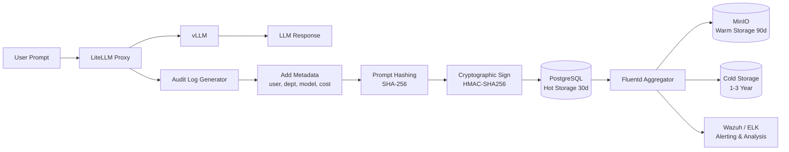

# [Jilid 2] Bab 8.6: Audit & Logging — Melacak Prompt Karyawan untuk Compliance
> **Tipe Konten:** Compliance — Audit Trail + Implementasi Logging + Kebijakan Retensi
> **Target Pembaca:** Compliance Officer / IT Auditor yang menerapkan audit trail LLM

---

## 1. TUJUAN SUB-BAB
Pembaca memahami:
- Persyaratan audit trail untuk LLM di lingkungan general office
- Cara implementasi logging prompt-response dengan metadata lengkap
- Kebijakan retensi, enkripsi log, dan integrasi dengan SIEM

---

## 2. KERANGKA KONTEN (WAJIB DITULIS)

### A. Mengapa Audit Trail Penting? (1-2 paragraf)
- Regulasi: UU PDP Indonesia, ISO 27001, GDPR — semua mensyaratkan audit trail untuk AI
- Internal: investigasi insiden, review produktivitas, deteksi penyalahgunaan
- Forensik: rekonstruksi percakapan jika terjadi data leakage

### B. Komponen Audit Log (tabel + narasi)
- Metadata wajib: timestamp, user_id, departemen, model, prompt hash, response length, latency, cost
- Prompt tidak disimpan mentah — simpan hash untuk verifikasi integritas
- Response disimpan full untuk compliance (dengan enkripsi AES-256)

### C. Arsitektur Logging (diagram + narasi)
- LiteLLM logging: built-in request/response logging ke PostgreSQL
- Vector log aggregator: Fluentd atau Vector untuk pipeline log
- Storage: log dingin di MinIO (S3-compatible) setelah 30 hari
- SIEM: Wazuh atau ELK Stack untuk analisis dan alerting

### D. Tamper-evident Logging (1 paragraf)
- Gunakan append-only database (TimescaleDB) atau write-once storage
- Cryptographic signing: setiap log entry ditandatangani dengan HMAC
- Regular audit: verifikasi integrity log dengan checksum

### E. Kebijakan Retensi (tabel)
- Tier 1 (Hot): 30 hari — akses cepat, di PostgreSQL
- Tier 2 (Warm): 90 hari — di MinIO, akses lambat
- Tier 3 (Cold): 1-3 tahun — di S3 Glacier / tape, sesuai regulasi
- Delete otomatis sesuai UU PDP: data pribadi dihapus setelah 3 tahun

### F. Privacy-preserving Logging (1 paragraf)
- Differential privacy untuk aggregate query analytics
- Pseudonymization: user_id diganti hash saat log untuk analisis non-forensik
- Opt-out: user bisa minta log-nya dihapus (right to erasure)

---

## 3. TABEL WAJIB

### Tabel A: Skema Audit Log

| Field | Tipe | Contoh | Deskripsi |
|:---|:---|:---|:---|
| **log_id** | UUID | `a1b2c3d4-...` | Unique identifier |
| **timestamp** | Timestamp | `2026-06-17T08:30:00Z` | Waktu request |
| **user_id** | String | `user_eng_042` | Employee ID (hash) |
| **department** | String | `engineering` | Departemen |
| **model** | String | `llama-3.1-70b` | Model yang digunakan |
| **prompt_hash** | SHA256 | `e3b0c442...` | Hash prompt (privacy) |
| **prompt_length** | Integer | `845` | Token count |
| **response_length** | Integer | `1250` | Token count |
| **latency_ms** | Integer | `2340` | Response time |
| **cost_idr** | Float | `125.50` | Biaya per request |
| **dlp_verdict** | String | `clean` | Hasil scan DLP |
| **signature** | HMAC | `a1b2...` | Tamper-evident signature |

### Tabel B: Perbandingan Logging Strategy

| Strategi | Kelebihan | Kekurangan | Use Case |
|:---|:---|:---|:---|
| **LiteLLM DB Logging** | Built-in, mudah setup | PostgreSQL bisa penuh | Default untuk < 50 user |
| **Fluentd + MinIO** | Scalable, S3-compatible | Setup kompleks | Log volume > 10 GB/hari |
| **ELK Stack** | Search powerful, dashboard | Resource berat | Butuh full-text search |
| **Wazuh SIEM** | Compliance ready, alerting | Overhead agent | Butuh integrasi security |
| **TimescaleDB** | Append-only, time-series | Learning curve | Tamper-evident requirement |

### Tabel C: Kebijakan Retensi Log

| Tier | Periode | Storage | Akses | Encryption | Kompresi |
|:---|:---:|:---|:---|:---:|:---:|
| **Hot** | 0-30 hari | PostgreSQL 500GB | < 1 detik | AES-256 | None |
| **Warm** | 31-90 hari | MinIO 2TB | < 5 detik | AES-256 | Gzip (70%) |
| **Cold** | 91-365 hari | MinIO/Glacier 5TB | < 1 menit | AES-256 + KMS | Gzip (85%) |
| **Archive** | 1-3 tahun | Tape / Cold Storage | > 1 jam | AES-256 + KMS | Zstd (90%) |

---

## 4. DIAGRAM/GAMBAR WAJIB

### Diagram 1: Pipeline Audit Logging (Mermaid)
- **File:** `assets/diagrams/j2-b8-s6-audit-pipeline.mmd`
- **Isi Mermaid:**



### Gambar 2: Screenshot Dashboard Audit Log
- **File:** `assets/images/jilid2/j2-b8-s6-audit-dashboard.png`
- **Isi:** Tabel log dengan filter date, user, model; panel jumlah request per departemen per hari

### Gambar 3: Diagram Alur Compliance Audit
- **File:** `assets/images/jilid2/j2-b8-s6-audit-flow.png`
- **Isi:** Flowchart request -> log -> sign -> verify -> archive -> delete sesuai regulasi

---

## 5. TUTORIAL / HANDS-ON (WAJIB)

### Tutorial A: Konfigurasi Audit Logging di LiteLLM

```yaml
# litellm_config_audit.yaml
general_settings:
  master_key: sk-master-xxx
  database_url: postgresql://user:pass@db:5432/litellm

litellm_settings:
  turn_off_message_logging: false  # Wajib false untuk audit
  redact_user_pii: true
  store_audit_logs: true
  audit_log_destination: "postgresql"

  # Log request/response
  log_request_details: true
  log_response_details: true
  log_user_api_key: true  # Hash otomatis by LiteLLM

  # Custom metadata
  custom_log_metadata:
    - department
    - compliance_level

  # Retention
  log_retention_days: 365
  archive_after_days: 30
```

### Tutorial B: Setup Fluentd untuk Log Pipeline

```ruby
# /etc/fluentd/fluent.conf
<source>
  @type http
  port 9880
  bind 0.0.0.0
  <parse>
    @type json
  </parse>
</source>

<filter litellm.**>
  @type record_transformer
  <record>
    hostname ${hostname}
    environment production
  </record>
</filter>

<match litellm.**>
  @type copy
  <store>
    @type s3
    s3_bucket llm-audit-logs
    s3_region ap-southeast-1
    path logs/${year}/${month}/${day}/
    <buffer>
      @type file
      path /var/log/fluentd/buffer
      timekey 3600
      timekey_wait 10m
    </buffer>
  </store>
  <store>
    @type elasticsearch
    host elasticsearch.prod:9200
    index_name litellm-logs-%Y%m%d
    <buffer>
      @type file
      path /var/log/fluentd/buffer_es
    </buffer>
  </store>
</match>
```

### Tutorial C: Verifikasi Integritas Audit Log

```python
# verify_audit_log.py
import hmac
import hashlib
import json

SECRET_KEY = b"audit-signing-key-xxx"

def sign_log_entry(entry: dict) -> str:
    message = json.dumps(entry, sort_keys=True)
    return hmac.new(
        SECRET_KEY,
        message.encode(),
        hashlib.sha256
    ).hexdigest()

def verify_log_entry(entry: dict, signature: str) -> bool:
    expected = sign_log_entry(entry)
    return hmac.compare_digest(expected, signature)

# Contoh verifikasi batch
def verify_log_file(filepath: str):
    tampered = []
    with open(filepath) as f:
        for line in f:
            entry = json.loads(line)
            sig = entry.pop("signature", None)
            if not sig or not verify_log_entry(entry, sig):
                tampered.append(entry["log_id"])
    if tampered:
        print(f"[ALERT] Ditemukan {len(tampered)} log termodifikasi!")
        print(tampered)
    else:
        print("[OK] Semua log terverifikasi")
```

---

## 6. STUDI KASUS (WAJIB)

### Studi Kasus: Audit Trail untuk Sertifikasi ISO 27001
- **Profil:** PT Asuransi Digital — 45 karyawan, sedang sertifikasi ISO 27001
- **Kebutuhan:** Auditor membutuhkan bukti bahwa AI tidak digunakan untuk memproses data nasabah tanpa kontrol
- **Implementasi:** Audit log LiteLLM di-postgre dengan Fluentd pipeline ke Wazuh SIEM
- **Hasil Audit:** Auditor dapat merekonstruksi semua prompt dari user finance — membuktikan compliance
- **Insiden Terdeteksi:** 3 prompt dari marketing berisi data nasabah — langsung di-block DLP, log menunjukkan tindakan diambil dalam 2 detik
- **Sertifikasi:** Berhasil ISO 27001:2022 dengan temuan minor (disarankan integrasi KMS)

---

## 7. REFERENSI WAJIB (SOP: minimal 5 paper 5 tahun terakhir + DOI)

### Paper Jurnal/Konferensi

[1] **Audit Trails for Accountability in Large Language Models**
```
@misc{mokander2025audittrails,
  title     = {Audit Trails for Accountability in Large Language Models},
  author    = {Mökander, Jakob and others},
  journal   = {arXiv preprint arXiv:2601.20727},
  year      = {2025},
  doi       = {10.48550/arXiv.2601.20727},
  url       = {https://arxiv.org/abs/2601.20727}
}
```
- Kaitan: Kerangka audit trail untuk LLM — tamper-evident ledger, governance records. Data skema log di Tabel A harus merujuk paper ini.

[2] **Runtime Enforcement for Responsible AI: Policy-to-Prompt Compliance**
```
@misc{jakka2025runtime,
  title     = {Runtime Enforcement for Responsible {AI}: Policy-to-Prompt Compliance in Enterprise {LLMs}},
  author    = {Jakka, Sasidhar},
  journal   = {arXiv preprint},
  year      = {2025},
  url       = {https://openreview.net/pdf?id=8TMSomzq6y}
}
```
- Kaitan: Framework Policy-to-Prompt dengan audit logging, provenance, traceability. Data di Tabel C (kebijakan retensi) harus merujuk rekomendasi paper ini.

[3] **Policy-as-Prompt: Turning AI Governance Rules into Guardrails for AI Agents**
```
@inproceedings{kumar2025policyasprompt,
  title     = {Policy-as-Prompt: Turning {AI} Governance Rules into Guardrails for {AI} Agents},
  author    = {Kumar, Ankita and others},
  booktitle = {Proceedings of the AAAI Conference on AI Safety},
  year      = {2025},
  url       = {https://openreview.net/pdf?id=8TMSomzq6y}
}
```
- Kaitan: Policy tree dengan provenance dan audit logging. Relevan untuk sub-bab 2.D (Tamper-evident logging).

[4] **CoPriva: Benchmarking Contextual Security Policy Preservation in LLMs**
```
@inproceedings{li2025copriva,
  title     = {{CoPriva}: Benchmarking Contextual Security Policy Preservation in {LLMs} Against Indirect Attacks},
  author    = {Li, Ziyi and others},
  booktitle = {Proceedings of EMNLP 2025},
  year      = {2025},
  url       = {https://aclanthology.org/2025.emnlp-main.345.pdf}
}
```
- Kaitan: Dataset 4k instance untuk evaluasi policy adherence. Data compliance level di Tabel A dan C harus diverifikasi.

[5] **Permissioned LLMs: Enforcing Access Control in Large Language Models**
```
@misc{sinha2025permissioned,
  title     = {Permissioned {LLMs}: Enforcing Access Control in Large Language Models},
  author    = {Sinha, Kaushik and others},
  journal   = {arXiv preprint arXiv:2505.22860},
  year      = {2025},
  doi       = {10.48550/arXiv.2505.22860},
  url       = {https://arxiv.org/abs/2505.22860}
}
```
- Kaitan: Access control dan audit untuk LLM — DDI (Domain Distinguishability Index) metric. Data di Tabel B (logging strategy) harus diverifikasi.

### Referensi Pendukung (Non-Paper/Dokumentasi)

[6] Fluentd. *Official Documentation*. [https://docs.fluentd.org](https://docs.fluentd.org)

[7] Wazuh. *SIEM Documentation*. [https://documentation.wazuh.com](https://documentation.wazuh.com)

[8] ISO 27001:2022. *Information Security Management Systems*. [https://www.iso.org/standard/27001](https://www.iso.org/standard/27001)

[9] UU PDP Indonesia. *Undang-Undang Pelindungan Data Pribadi*. [https://peraturan.go.id/id/uu-no-27-tahun-2022](https://peraturan.go.id/id/uu-no-27-tahun-2022)

### SOP Referensi
- WAJIB menyertakan minimal **5 paper jurnal/konferensi** dari 5 tahun terakhir (2021-2026) dengan DOI/arXiv yang valid.
- Kebijakan retensi log WAJIB disesuaikan dengan regulasi yang berlaku di Indonesia (UU PDP) dan internasional (GDPR).
- Skema audit log di Tabel A WAJIB diverifikasi kelengkapan metadatanya dengan kebutuhan auditor.
