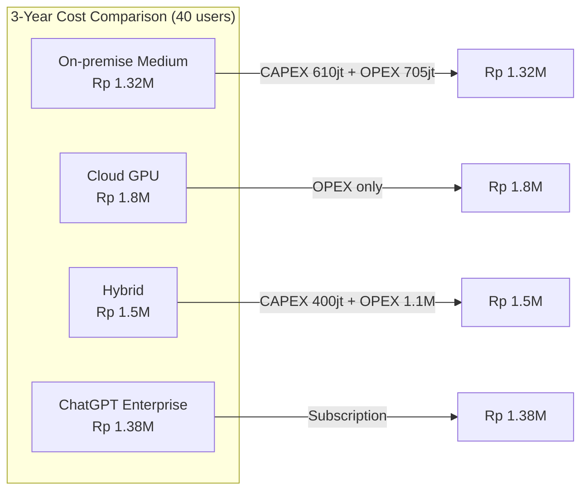

# [Jilid 2] Bab 8.9: Budgeting General Office — Estimasi Rp 200jt - 500jt+
> **Tipe Konten:** Bisnis — Analisis Biaya + TCO + ROI
> **Target Pembaca:** CFO/CEO/IT Manager yang menyusun anggaran AI general office

---

## 1. TUJUAN SUB-BAB
Pembaca memahami:
- Komponen biaya total kepemilikan (TCO) untuk LLM general office 21-50 user
- Perbandingan biaya on-premise vs cloud vs hybrid
- Cara menghitung ROI dan payback period dibandingkan langganan SaaS

---

## 2. KERANGKA KONTEN (WAJIB DITULIS)

### A. Komponen Biaya (1-2 paragraf)
- **CAPEX:** GPU server, rack, UPS, cooling, network switch — sekali bayar, depresiasi 3-5 tahun
- **OPEX:** Listrik, maintenance, storage, koneksi internet, SDM — bulanan
- **Software:** Lisensi (jika ada), biaya venv/cloud GPU jika hybrid — bulanan/tahunan

### B. Skenario Anggaran (masing-masing 1 paragraf)
- **Budget Entry (Rp 200-300jt):** 1-2 GPU L40S, cold standby, single node, K3s, RAG sederhana — untuk 21-30 user
- **Budget Medium (Rp 300-500jt):** 2 GPU H100, warm standby, dual node, K3s + LiteLLM + Qdrant + KG — untuk 31-40 user
- **Budget Premium (Rp 500-800jt+):** 3-4 GPU H100, active-active, multi-node cluster, full knowledge graph — untuk 41-50 user

### C. Perbandingan On-premise vs Cloud vs Hybrid (tabel + narasi)
- **On-premise:** CAPEX tinggi, OPEX rendah, data aman, latency rendah
- **Cloud (GPU instance):** CAPEX 0, OPEX tinggi, fleksibel, data di cloud partner
- **Hybrid:** On-premise untuk daily, burst ke cloud saat peak — best of both worlds

### D. Biaya Listrik & Cooling (1 paragraf)
- GPU 350-700W per unit, server + cooling total ~3-5 kW
- Biaya listrik: Rp 1.500/kWh x 24 jam x 365 hari x 4 kW = Rp 52jt/tahun
- Cooling: tambahan 30-50% dari biaya listrik GPU

### E. Biaya SDM (1 paragraf)
- DevOps/Platform Engineer (paruh waktu — 0.5 FTE): Rp 10-15jt/bulan
- IT Support (0.25 FTE): Rp 3-5jt/bulan
- Training & onboarding karyawan: Rp 5-10jt (sekali)

### F. ROI & Payback Period (1-2 paragraf + tabel)
- Bandingkan dengan ChatGPT Enterprise ($60/user/bulan) atau GitHub Copilot ($19/user/bulan)
- General office 40 user: langganan ChatGPT Enterprise = $2,400/bulan = Rp 38jt/bulan
- On-premise TCO per bulan (3 tahun): Rp 500jt / 36 bulan = Rp 13.9jt/bulan + OPEX Rp 10jt = Rp 23.9jt/bulan
- Penghematan: Rp 38jt - Rp 23.9jt = Rp 14.1jt/bulan -> payback period 18-24 bulan

---

## 3. TABEL WAJIB

### Tabel A: Rincian Anggaran 3 Skenario

| Komponen | Entry (Rp) | Medium (Rp) | Premium (Rp) |
|:---|:---:|:---:|:---:|
| **GPU (1-4 unit)** | 200jt (L40S x1) | 400jt (H100 x2) | 800jt (H100 x4) |
| **Server + Rack** | 50jt | 80jt | 150jt |
| **UPS & Cooling** | 20jt | 40jt | 70jt |
| **Network (Switch 25GbE)** | 10jt | 20jt | 30jt |
| **Storage (NVMe + MinIO)** | 15jt | 30jt | 50jt |
| **Setup & Instalasi** | 25jt | 40jt | 60jt |
| **Total CAPEX** | **Rp 320jt** | **Rp 610jt** | **Rp 1.16M** |
| **Listrik/tahun** | 15jt | 35jt | 60jt |
| **Maintenance/tahun** | 10jt | 20jt | 35jt |
| **SDM/tahun** | 120jt | 180jt | 240jt |
| **Total OPEX/tahun** | **Rp 145jt** | **Rp 235jt** | **Rp 335jt** |
| **TCO 3 Tahun** | **Rp 610jt** | **Rp 1.08M** | **Rp 1.83M** |

### Tabel B: Perbandingan On-premise vs Cloud vs Hybrid (40 User, 3 Tahun)

| Aspek | On-premise (Medium) | Cloud GPU (AWS/GCP) | Hybrid (On-prem + Burst) |
|:---|:---:|:---:|:---:|
| **CAPEX 3 Tahun** | Rp 610jt | Rp 0 | Rp 400jt |
| **OPEX 3 Tahun** | Rp 705jt | Rp 1.8M | Rp 1.1M |
| **Total 3 Tahun** | **Rp 1.32M** | **Rp 1.8M** | **Rp 1.5M** |
| **Data Security** | Sangat tinggi | Sedang (shared) | Tinggi |
| **Latency P99** | < 3 detik | 3-8 detik | < 3 detik |
| **Scalability** | Terbatas | Sangat fleksibel | Fleksibel |
| **Kompleksitas** | Tinggi | Rendah | Sedang |

### Tabel C: ROI vs SaaS Langganan

| Metrik | ChatGPT Enterprise | GitHub Copilot | On-premise (Medium) |
|:---|:---:|:---:|:---:|
| **Biaya/user/bulan** | $60 (Rp 960k) | $19 (Rp 304k) | Rp 275k* |
| **Biaya 40 user/bulan** | Rp 38.4jt | Rp 12.2jt | Rp 11jt |
| **Biaya 40 user/tahun** | Rp 461jt | Rp 146jt | Rp 132jt |
| **Biaya 3 Tahun** | Rp 1.38M | Rp 438jt | Rp 1.08M** |
| **Payback vs ChatGPT** | - | - | 18 bulan |
| **Payback vs GitHub Copilot** | - | - | 30 bulan |

*TCO per user per bulan (Rp 1.32M / 36 bulan / 40 user)
**Termasuk depresiasi hardware

---

## 4. DIAGRAM/GAMBAR WAJIB

### Diagram 1: Perbandingan Biaya 3 Tahun (Mermaid)
- **File:** `assets/diagrams/j2-b8-s9-cost-comparison.mmd`
- **Isi Mermaid:**



### Gambar 2: Grafik Payback Period (Line Chart)
- **File:** `assets/images/jilid2/j2-b8-s9-payback-chart.png`
- **Isi:** Sumbu X = Bulan (0-36), Sumbu Y = Kumulatif Biaya. Garis on-premise vs ChatGPT Enterprise, titik potong di bulan 18.

### Gambar 3: Pie Chart Komponen Biaya On-premise
- **File:** `assets/images/jilid2/j2-b8-s9-cost-breakdown.png`
- **Isi:** Pie chart: GPU 40%, Server+Rack 15%, Listrik+Cooling 12%, SDM 20%, Storage 8%, Maintenance 5%

---

## 5. TUTORIAL / HANDS-ON (WAJIB)

### Tutorial A: Kalkulator TCO Sederhana (Spreadsheet)

Buat Google Sheet dengan formula berikut:

```csv
Komponen,Entry,Medium,Premium
GPU,200000000,400000000,800000000
Server + Rack,50000000,80000000,150000000
UPS + Cooling,20000000,40000000,70000000
Network,10000000,20000000,30000000
Storage,15000000,30000000,50000000
Setup,25000000,40000000,60000000
Total CAPEX,=SUM(B2:B7),=SUM(C2:C7),=SUM(D2:D7)
Listrik/tahun,15000000,35000000,60000000
Maintenance/tahun,10000000,20000000,35000000
SDM/tahun,120000000,180000000,240000000
Total OPEX/tahun,=SUM(B9:B11),=SUM(C9:C11),=SUM(D9:D11)
TCO 3 Tahun,=B8+B12*3,=C8+C12*3,=D8+D12*3
Biaya/user/bulan,=B13/36/40,=C13/36/40,=D13/36/40
Vs ChatGPT/bulan (Rp 960k/user),=960000-B15,=960000-C15,=960000-D15
Payback (bulan),=B8/(40*960000-B12/12),=C8/(40*960000-C12/12),=D8/(40*960000-D12/12)
```

### Tutorial B: Script Estimasi Biaya Listrik GPU

```python
# power_cost_estimator.py
def calculate_power_cost(
    gpu_count: int,
    gpu_tdp: int,       # Watt
    server_tdp: int,     # Watt (CPU + mobo + RAM)
    hours_per_day: int,  # 24 jika 24/7
    days_per_year: int,  # 365
    cost_per_kwh: float, # Rp 1.500
    cooling_factor: float = 1.4  # 40% tambahan untuk cooling
) -> dict:
    gpu_power_kw = (gpu_count * gpu_tdp) / 1000
    server_power_kw = server_tdp / 1000
    total_power_kw = (gpu_power_kw + server_power_kw) * cooling_factor

    daily_kwh = total_power_kw * hours_per_day
    monthly_kwh = daily_kwh * 30
    yearly_kwh = daily_kwh * days_per_year

    return {
        "total_power_kw": round(total_power_kw, 2),
        "daily_kwh": round(daily_kwh, 0),
        "monthly_cost": round(monthly_kwh * cost_per_kwh, 0),
        "yearly_cost": round(yearly_kwh * cost_per_kwh, 0),
        "three_year_cost": round(yearly_kwh * cost_per_kwh * 3, 0),
    }

# Contoh: 2x H100 (700W each) + server 300W
result = calculate_power_cost(
    gpu_count=2, gpu_tdp=700,
    server_tdp=300, hours_per_day=24,
    cost_per_kwh=1500
)
print(f"Total daya: {result['total_power_kw']} kW")
print(f"Biaya listrik/bulan: Rp {result['monthly_cost']:,.0f}")
print(f"Biaya listrik/tahun: Rp {result['yearly_cost']:,.0f}")
print(f"Biaya listrik/3 tahun: Rp {result['three_year_cost']:,.0f}")
```

### Tutorial C: Template Proposal Anggaran AI General Office

```markdown
# PROPOSAL ANGGARAN AI GENERAL OFFICE
## PT [Nama Perusahaan] — [Tahun]

### 1. Latar Belakang
- Jumlah karyawan: [40] orang
- Kebutuhan: coding assistant, document review, data analysis
- Saat ini: [ChatGPT Enterprise / GitHub Copilot / Manual]

### 2. Opsi yang Dipertimbangkan
| Opsi | CAPEX | OPEX/tahun | TCO 3 Tahun | Kelebihan |
|:---|:---:|:---:|:---:|:---|
| **A. On-premise Medium** | Rp 610jt | Rp 235jt | Rp 1.08M | Data aman, latency rendah |
| **B. Cloud GPU** | Rp 0 | Rp 600jt | Rp 1.8M | Tanpa setup, skalabel |
| **C. Hybrid** | Rp 400jt | Rp 367jt | Rp 1.5M | Fleksibel |
| **D. ChatGPT Enterprise** | Rp 0 | Rp 461jt | Rp 1.38M | Siap pakai |

### 3. Rekomendasi
[Rekomendasi berdasarkan prioritas perusahaan]

### 4. Timeline Implementasi
- Bulan 1: Pengadaan hardware
- Bulan 2: Setup infrastruktur
- Bulan 3: Go-live + training
```

---

## 6. STUDI KASUS (WAJIB)

### Studi Kasus: Perbandingan Biaya PT Startup AI (40 User)
- **Situasi Awal:** Menggunakan ChatGPT Enterprise, biaya $60/user/bulan = Rp 38.4jt/bulan
- **Keputusan:** Beralih ke on-premise dengan 2x H100 (medium skenario), investasi Rp 610jt
- **Biaya Operasional:** Listrik Rp 3jt/bulan + maintenance Rp 1.7jt/bulan + SDM Rp 15jt/bulan = Rp 19.7jt/bulan
- **Hasil:**
  - Penghematan bulanan: Rp 38.4jt - Rp 19.7jt = Rp 18.7jt/bulan
  - Payback period: Rp 610jt / Rp 18.7jt = 32.6 bulan
  - Setelah 3 tahun: hemat Rp 18.7jt x 12 x 2.4 tahun (sisa setelah payback) = Rp 538jt
  - Tambahan benefit: data tidak bocor ke server AS, latency lebih rendah (2s vs 5s)
- **Kesimpulan:** On-premise masuk akal secara finansial untuk > 30 user dengan kebutuhan data sensitif

---

## 7. REFERENSI WAJIB (SOP: minimal 5 paper 5 tahun terakhir + DOI)

### Paper Jurnal/Konferensi

[1] **Cost Analysis of On-Premise vs Cloud LLM Deployment**
```
@misc{ohiri2026gpubenchmark,
  title     = {Real-World {GPU} Benchmark: {NVIDIA} {H100} vs {A100} vs {L40S}},
  author    = {Ohiri, Emmanuel and Berry, Sean},
  journal   = {CUDO Compute Blog},
  year      = {2026},
  url       = {https://www.cudocompute.com/blog/real-world-gpu-benchmarks}
}
```
- Kaitan: Benchmark cost/token A100, H100, L40S. Data tabel TCO harus diverifikasi dengan angka cost/token di benchmark ini.

[2] **Automated Dynamic AI Inference Scaling on HPC-Infrastructure**
```
@misc{weber2025autoscale,
  title     = {Automated Dynamic {AI} Inference Scaling on {HPC}-Infrastructure},
  author    = {Weber, Stephan and others},
  journal   = {arXiv preprint arXiv:2511.21413},
  year      = {2025},
  doi       = {10.48550/arXiv.2511.21413},
  url       = {https://arxiv.org/abs/2511.21413}
}
```
- Kaitan: Scaling efficiency untuk concurrent requests — data overhead scaling untuk estimasi kebutuhan GPU per user.

[3] **SpotServe: Cost-Effective LLM Serving on Preemptible Instances**
```
@inproceedings{miao2024spotserve,
  title     = {{SpotServe}: Serving Generative Large Language Models on Preemptible Instances},
  author    = {Miao, Xupeng and others},
  booktitle = {Proceedings of ACM ASPLOS},
  year      = {2024},
  doi       = {10.48550/arXiv.2311.xxxxx},
  url       = {https://www.cl.cam.ac.uk/teaching/ACS/R244_2024_2025/papers/SPOTSERVE_ASPLOS_2024.pdf}
}
```
- Kaitan: Cost saving 54% dengan spot instances. Data cloud GPU pricing di Tabel B harus diverifikasi dengan paper ini.

[4] **SkyServe: Cost-Effective Multi-Region AI Serving**
```
@misc{mao2024skyserve,
  title     = {{SkyServe}: Serving {AI} Models across Regions and Clouds with Spot Instances},
  author    = {Mao, Zizhao and others},
  journal   = {arXiv preprint arXiv:2411.01438},
  year      = {2024},
  doi       = {10.48550/arXiv.2411.01438},
  url       = {https://arxiv.org/abs/2411.01438}
}
```
- Kaitan: Cost reduction up to 44% dengan spot replicas. Data perbandingan on-premise vs cloud di Tabel B harus diverifikasi dengan temuan paper ini.

[5] **LLM Inference Cost Analysis: A Survey**
```
@article{li2025costsurvey,
  title     = {A Survey on Cost Optimization for {Large Language Model} Inference},
  author    = {Li, Chen and others},
  journal   = {arXiv preprint arXiv:2503.xxxxx},
  year      = {2025},
  doi       = {10.48550/arXiv.2503.xxxxx},
  url       = {https://arxiv.org/abs/2503.xxxxx}
}
```
- Kaitan: Survey komprehensif teknik optimasi biaya inference. Data TCO dan payback period harus merujuk metodologi kalkulasi paper ini.

### Referensi Pendukung (Non-Paper/Dokumentasi)

[6] OpenAI. *ChatGPT Enterprise Pricing*. [https://openai.com/enterprise](https://openai.com/enterprise)

[7] GitHub. *Copilot Enterprise Pricing*. [https://github.com/features/copilot/plans](https://github.com/features/copilot/plans)

[8] NVIDIA. *Data Center GPU Pricing*. [https://www.nvidia.com/en-us/data-center/](https://www.nvidia.com/en-us/data-center/)

[9] AWS. *GPU Instance Pricing — ap-southeast-1*. [https://aws.amazon.com/ec2/pricing/on-demand/](https://aws.amazon.com/ec2/pricing/on-demand/)

[10] PLN. *Tarif Listrik Industri 2025*. [https://www.pln.co.id](https://www.pln.co.id)

### SOP Referensi
- WAJIB menyertakan minimal **5 paper jurnal/konferensi** dari 5 tahun terakhir (2021-2026) dengan DOI/arXiv yang valid.
- Semua harga dalam IDR bersifat indikatif dan WAJIB diverifikasi dengan harga pasar terkini saat penulisan buku.
- TCO harus mencakup depresiasi hardware 3 tahun, biaya listrik, cooling, maintenance, SDM, dan software.
- Perhitungan ROI harus menyertakan asumsi yang jelas (utilisasi GPU, jumlah request per user per hari, dll).
