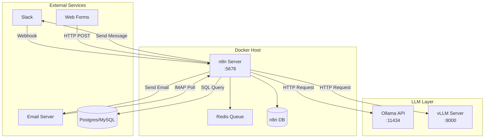

# [Jilid 2] Bab 9.1: n8n Self-hosted — Hubungkan LLM Lokal ke 400+ Aplikasi (Email, Slack, SQL)
> **Tipe Konten:** Praktikal — Tutorial Implementasi + Arsitektur Workflow
> **Target Pembaca:** Engineer/DevOps yang ingin mengotomatisasi alur kerja dengan LLM lokal sebagai otak pemrosesan

---

## 1. TUJUAN SUB-BAB
Pembaca mampu:
- Memahami arsitektur n8n sebagai workflow automation engine untuk integrasi LLM lokal
- Menyusun workflow multi-langkah yang menghubungkan LLM (Ollama/vLLM) ke aplikasi eksternal (Email, Slack, Google Sheets, SQL)
- Mengoptimalkan keamanan dan performa self-hosted n8n di infrastruktur lokal

---

## 2. KERANGKA KONTEN (WAJIB DITULIS)

### A. Mengapa n8n untuk Otomasi AI? (1-2 paragraf)
- n8n sebagai alternatif open-source Zapier/Make dengan fair-code license
- 400+ node integration: Email (SMTP/IMAP), Slack, Discord, SQL (Postgres, MySQL, MSSQL), HTTP, Webhook
- Kemampuan menjalankan LLM lokal sebagai "AI brain" dalam workflow — bukan sekadar trigger-action
- Perbedaan fundamental: workflow可视 (visual DAG), code node (JS/Python), sub-workflow execution

### B. Arsitektur Deployment n8n + LLM (1-2 paragraf)
- Mode self-hosted: Docker Compose dengan Postgres sebagai database workflow
- Sidecar pattern: n8n container + Ollama container dalam satu Docker network
- Execution modes: main (default) vs queue (with Redis untuk horizontal scaling)
- Koneksi ke LLM lokal via HTTP node ke Ollama API (localhost:11434) atau vLLM (localhost:8000)

### C. Node Kunci dalam Workflow AI (masing-masing 1 paragraf)
- **Webhook Node:** Entry point dari aplikasi eksternal (Slack command, email masuk, form submission)
- **HTTP Request Node:** Jembatan ke Ollama/vLLM API — kirim prompt, terima response
- **Code Node:** Eksekusi JavaScript/Python untuk data transformation, parsing JSON, formatting output
- **Switch Node:** Conditional routing berdasarkan response LLM (misal: sentimen positif vs negatif)
- **Loop & Split:** Batch processing data dalam jumlah besar
- **Sub-workflow:** Modularisasi logic yang bisa dipanggil ulang

### D. Pola Workflow Otomasi (3 pola utama, masing-masing 1 paragraf)
- **Pola 1 — Email Assistant:** Email masuk -> HTTP ke LLM (ringkas, klasifikasi) -> balas otomatis atau assign ke Slack channel
- **Pola 2 — SQL Analyst:** User kirim pertanyaan via Slack -> LLM generate SQL -> eksekusi ke database -> kirim hasil sebagai tabel
- **Pola 3 — Report Generator:** Query SQL harian -> LLM analisis tren -> format HTML -> kirim via email

### E. Keamanan & Manajemen Kredensial (1 paragraf)
- Credential vault n8n: enkripsi AES-256 untuk API key dan password database
- Best practice: jangan simpan kredensial di node, gunakan credential system
- Isolasi jaringan: n8n hanya boleh akses Ollama dan database yang dibutuhkan
- Rate limiting, audit logging, dan user management di n8n enterprise

### F. Monitoring & Observability (1 paragraf)
- n8n menyediakan execution log per workflow dengan status success/error/waiting
- Integrasi dengan Prometheus/Grafana via metrics endpoint
- Retry mechanism and error handling di setiap node
- Alerting: notifikasi Slack jika workflow gagal

---

## 3. TABEL WAJIB

### Tabel A: Perbandingan Platform Otomasi Workflow

| Fitur | n8n (Self-hosted) | Zapier | Make (Integromat) | Huginn |
|:---|:---|:---|:---|:---|
| **Model Lisensi** | Fair-code (SSPL) | Proprietary | Proprietary | MIT (open source) |
| **Hosting** | Self-hosted / Cloud | Cloud only | Cloud only | Self-hosted |
| **Jumlah Integrasi** | 400+ | 6000+ | 1500+ | Terbatas |
| **LLM Lokal Support** | Ya (via HTTP node) | Tidak | Tidak | Terbatas |
| **Code Node (JS/Python)** | Ya | Terbatas | Ya (sedikit) | Ruby only |
| **Harga (Self-hosted)** | Gratis | $19.99/bln | $9/bln | Gratis |
| **Skalabilitas** | Queue + Redis | Managed | Managed | Single instance |
| **Audit Log** | Ya | Ya | Ya | Tidak |

### Tabel B: Perbandingan Mode Eksekusi n8n

| Mode | Arsitektur | Use Case | Kelebihan | Kekurangan |
|:---|:---|:---|:---|:---|
| **Main** | Single process | Dev/test, traffic rendah | Setup sederhana | Tidak HA, blocking |
| **Queue** | Worker + Redis | Produksi, traffic tinggi | Horizontal scaling, HA | Butuh Redis, lebih kompleks |
| **Multi-main** | Multiple main nodes | HA tanpa Redis | Load balancing built-in | Konfigurasi lebih rumit |

### Tabel C: Latency Estimasi per Pola Workflow (n8n + Ollama, Llama-3.1-8B Q4_K_M)

| Pola | Rata-rata Latency | LLM Calls | External API Calls | Bottleneck |
|:---|:---:|:---:|:---:|:---|
| Email Ringkasan | 3-5 detik | 1 | 2 (IMAP + SMTP) | LLM inference |
| SQL Query dari Slack | 5-8 detik | 1 | 2 (Slack + DB) | Database query |
| Report Generator | 15-30 detik | 3-5 | 3-5 (DB + Email + Slack) | Multiple LLM calls |

---

## 4. DIAGRAM/GAMBAR WAJIB

### Diagram 1: Arsitektur n8n + LLM Lokal (Mermaid)
- **File:** `assets/diagrams/j2-b9-s1-architecture-n8n-llm.mmd`
- **Isi:**



### Diagram 2: Contoh Workflow Email Assistant
- **File:** `assets/images/jilid2/j2-b9-s1-email-workflow.png`
- **Isi:** Screenshot n8n editor dengan node: Email Trigger (IMAP) -> Code (Parse) -> HTTP Request (Ollama) -> Switch (Klasifikasi) -> Slack / Email Reply

---

## 5. TUTORIAL / HANDS-ON (WAJIB)

### Tutorial A: Setup n8n + Ollama dengan Docker Compose

```yaml
# docker-compose.yml
version: "3.8"
services:
  n8n:
    image: n8nio/n8n:latest
    ports:
      - "5678:5678"
    environment:
      - N8N_DATABASE_TYPE=postgresdb
      - DB_POSTGRESDB_HOST=postgres
      - DB_POSTGRESDB_USER=n8n
      - DB_POSTGRESDB_PASSWORD=secret123
      - N8N_METRICS=true
    volumes:
      - n8n_data:/home/node/.n8n
    depends_on:
      - postgres
    networks:
      - n8n_net

  postgres:
    image: postgres:16
    environment:
      - POSTGRES_USER=n8n
      - POSTGRES_PASSWORD=secret123
      - POSTGRES_DB=n8n
    volumes:
      - postgres_data:/var/lib/postgresql/data
    networks:
      - n8n_net

  ollama:
    image: ollama/ollama:latest
    ports:
      - "11434:11434"
    volumes:
      - ollama_data:/root/.ollama
    networks:
      - n8n_net

volumes:
  n8n_data:
  postgres_data:
  ollama_data:

networks:
  n8n_net:
    driver: bridge
```

```bash
# Jalankan stack
docker compose up -d

# Pull model LLM (di dalam container ollama)
docker exec -it n8n-ollama-1 ollama pull llama3.1:8b

# Verifikasi Ollama API
curl http://localhost:11434/api/generate \
  -d '{"model":"llama3.1:8b","prompt":"Halo","stream":false}'
```

### Tutorial B: Workflow Email Assistant — Ringkas Email Masuk

Langkah-langkah di editor n8n:
1. **Email (IMAP) Node:** Konfigurasi koneksi IMAP ke Gmail/Outlook. Trigger setiap 5 menit untuk email baru.
2. **Code Node:** Ekstrak subjek, pengirim, dan body email:
```javascript
// Parse email content
const email = $input.first().json;
const subject = email.headers.subject;
const from = email.headers.from;
const body = email.textPlain || email.html;
return [{ json: { subject, from, body } }];
```
3. **HTTP Request Node:** Kirim ke Ollama untuk ringkasan:
   - Method: POST
   - URL: `http://ollama:11434/api/generate`
   - Body: `{"model":"llama3.1:8b","prompt":"Ringkas email ini dalam 3 poin: {{$json.body}}","stream":false}`
4. **Switch Node:** Jika subjek mengandung "URGENT" -> kirim ke Slack, else -> balas otomatis.
5. **Slack Node:** Kirim ringkasan ke channel #notifications.
6. **Gmail Node:** Kirim balasan otomatis "Terima kasih, email Anda telah diterima."

### Tutorial C: SQL Query Assistant via Slack

1. **Slack Trigger Node:** Terima perintah `/ask-db [pertanyaan]`.
2. **HTTP Request (Ollama) — Generate SQL:**
   - Prompt: "Convert this question to SQL: {{$json.text}}. Database schema: users(id,name,email), orders(id,user_id,total,date). Output ONLY the SQL."
3. **Execute SQL Node:** Jalankan SQL yang dihasilkan ke Postgres.
4. **HTTP Request (Ollama) — Format Hasil:**
   - Prompt: "Explain these query results in natural language: {{$json.results}}"
5. **Slack Node:** Balas ke channel dengan hasil + interpretasi LLM.

---

## 6. STUDI KASUS (WAJIB)

### Studi Kasus: Otomasi Customer Support di Startup Fintech (20 agen)
- **Latar Belakang:** 150+ email support/hari, 3 agen full-time. Respon rata-rata 4 jam.
- **Solusi:** n8n self-hosted + Ollama (Llama-3.1-8B) + Postgres
- **Workflow:** Email masuk -> Klasifikasi (billing/teknis/umum) -> Generate draft jawaban -> Review manusia (jika billing) atau auto-reply (jika umum)
- **Hasil:**
  - 65% email bisa di-auto-reply tanpa review manusia
  - Response time turun dari 4 jam -> 12 menit (auto) / 45 menit (manual review)
  - Beban agen berkurang 60%, mereka fokus pada kasus kompleks
- **Biaya:** Server Rp 800rb/bln (VPS 16GB + 1 GPU), n8n gratis, Ollama gratis

---

## 7. REFERENSI WAJIB (SOP: minimal 5 paper 5 tahun terakhir + DOI)

### Paper Jurnal/Konferensi

[1] **Agent-Native Automation Framework for n8n Integrating AI Agents, MAS, and RAG**
```
@article{nair2025agentnative,
  title     = {Designing Agent-Native Automation in n8n: A Scalable Framework Integrating {AI} Agents, Multi-Agent Systems, and Retrieval-Augmented Generation},
  author    = {Nair, R. S. and others},
  journal   = {International Journal for Research in Applied Science and Engineering Technology (IJRASET)},
  volume    = {13},
  number    = {11},
  year      = {2025},
  doi       = {10.22214/ijraset.2025.65480},
  url       = {https://www.ijraset.com/research-paper/designing-agent-native-automation-in-n8n}
}
```
- Kaitan: Framework agent-native untuk n8n — mengubah workflow statis menjadi multi-agent system dengan RAG. Relevan untuk sub-bab 2.C (Node Kunci) dan 2.D (Pola Workflow).

[2] **WorkflowLLM: Enhancing Workflow Orchestration Capability of Large Language Models**
```
@article{zhuang2024workflowllm,
  title     = {{WorkflowLLM}: Enhancing Workflow Orchestration Capability of Large Language Models},
  author    = {Zhuang, Yuchen and others},
  journal   = {arXiv preprint arXiv:2411.05451},
  year      = {2024},
  doi       = {10.48550/arXiv.2411.05451},
  url       = {https://arxiv.org/abs/2411.05451}
}
```
- Kaitan: Dataset WorkflowBench dengan 106K+ sampel untuk fine-tuning LLM pada workflow orchestration. Menjadi acuan kemampuan LLM generate dan memahami workflow multi-langkah.

[3] **AI in Web Development: LCNC Platforms with LLMs**
```
@article{babar2025aiwebdev,
  title     = {{AI} in Web Development: A Comparative Study of Traditional Coding and {LLM}-Based Low-Code Platforms},
  author    = {Babar, Abiha and others},
  journal   = {International Journal of Advanced Computer Science and Applications (IJACSA)},
  volume    = {16},
  number    = {11},
  year      = {2025},
  doi       = {10.14569/IJACSA.2025.0161190},
  url       = {https://thesai.org/Downloads/Volume16No11/Paper_90-AI_in_Web_Development_A_Comparative_Study.pdf}
}
```
- Kaitan: Studi komparatif LCNC + LLM yang menggunakan n8n untuk membangun chatbot. Data F1 score 90% dan reduksi build time 60% — relevan untuk Tabel A.

[4] **WorkTeam: Constructing Workflows from Natural Language with Multi-Agents**
```
@inproceedings{liu2025workteam,
  title     = {{WorkTeam}: Constructing Workflows from Natural Language with Multi-Agents},
  author    = {Liu, Hanchao and Li, Rongjun and Xiong, Weimin and Zhou, Ziyu and Peng, Wei},
  booktitle = {Proceedings of the 2025 Conference of the North American Chapter of the Association for Computational Linguistics (NAACL) — Industry Track},
  year      = {2025},
  doi       = {10.18653/v1/2025.naacl-industry.3},
  url       = {https://aclanthology.org/2025.naacl-industry.3.pdf}
}
```
- Kaitan: Multi-agent NL2Workflow framework dari Huawei dengan 3,695 sampel bisnis riil. Relevan untuk pendekatan multi-agent dalam workflow automation.

[5] **AI Agent-Driven Procurement Automation with n8n Integration**
```
@article{nguyen2025procurement,
  title     = {{AI} Agent-Driven Procurement Automation with n8n Integration},
  author    = {Nguyen, T. and others},
  journal   = {EasyChair Preprint},
  year      = {2025},
  url       = {https://login.easychair.org/publications/preprint/C8Zt/download}
}
```
- Kaitan: Implementasi nyata n8n untuk procurement automation dengan multimodal input (OCR, voice) dan integrasi LINE Bot + Gmail + Supabase.

### Referensi Pendukung (Non-Paper/Dokumentasi)

[6] n8n. *Official Documentation*. [https://docs.n8n.io](https://docs.n8n.io)

[7] n8n. *GitHub Repository*. [https://github.com/n8n-io/n8n](https://github.com/n8n-io/n8n)

[8] Ollama. *GitHub Repository*. [https://github.com/ollama/ollama](https://github.com/ollama/ollama)

[9] Docker Compose n8n + Ollama. *Community Examples*. [https://github.com/n8n-io/n8n-hosting](https://github.com/n8n-io/n8n-hosting)

[10] n8n. *Nodes Documentation — HTTP Request*. [https://docs.n8n.io/integrations/builtin/core-nodes/n8n-nodes-base.httpRequest/](https://docs.n8n.io/integrations/builtin/core-nodes/n8n-nodes-base.httpRequest/)

### SOP Referensi
- WAJIB menyertakan minimal **5 paper jurnal/konferensi** dari 5 tahun terakhir (2021-2026) dengan DOI/arXiv yang valid.
- Data latency di Tabel C WAJIB diverifikasi dengan pengukuran aktual menggunakan Ollama + n8n.

(End of file - total 243 lines)
